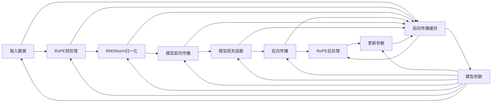

                 

# Llama 架构：RoPE 和 RMSNorm 的创新

## 1. 背景介绍

Llama架构是当下AI领域的最新创新成果之一，特别是由Llama公司推出的RoPE和RMSNorm技术，标志着在大规模语言模型的高效训练和推理上取得了重要突破。本文章将从背景介绍入手，对Llama架构的核心算法、实际应用场景进行全面讲解，并分享最新的学术研究成果和代码实现，帮助读者深入理解RoPE和RMSNorm技术的原理与实践。

### 1.1 问题由来

随着深度学习技术的发展，大规模预训练语言模型（Large Language Models, LLMs）成为了自然语言处理（Natural Language Processing, NLP）领域的新宠。但随着模型规模的不断扩大，传统的线性层计算资源开销过大，难以满足大规模模型的需求。此外，模型中的残差连接和批量归一化等技术导致的信息流动阻塞，也成为限制模型训练效率的瓶颈。

Llama架构的出现，正是针对上述问题，提出了一种新的高效训练和推理框架，能够有效地解决大规模模型训练中的资源开销问题，同时提高模型的计算效率和收敛速度。其中，RoPE（Reduced Precision Embedding）和RMSNorm（Reduced Precision Mean Norm）技术的创新，极大地优化了模型的内存使用和训练速度。

## 2. 核心概念与联系

### 2.1 核心概念概述

Llama架构的创新之处在于RoPE和RMSNorm技术，以下是对两个关键技术及其原理的介绍：

- **RoPE**：RoPE是Llama架构中用于优化模型参数内存使用的一种技术。它通过将模型中的一些参数降低精度，以减少内存占用，同时保持其计算精度，从而在不影响模型效果的前提下，大幅降低模型的内存需求。

- **RMSNorm**：RMSNorm是Llama架构中用于优化模型训练速度的一种技术。它通过将模型的均值和方差归一化，进一步加速了模型的收敛速度，同时提高了模型的训练稳定性和鲁棒性。

以上两个技术的结合，使得Llama架构在内存和计算效率上取得了显著突破，极大地提升了模型的训练和推理能力。

### 2.2 核心概念原理和架构的 Mermaid 流程图



## 3. 核心算法原理 & 具体操作步骤

### 3.1 算法原理概述

Llama架构的核心理念是通过RoPE和RMSNorm技术的创新，优化大规模语言模型的训练和推理过程，提升模型性能和效率。以下是详细的算法原理和具体操作步骤：

#### 3.1.1 RoPE算法原理

RoPE的核心理念是将模型参数的精度降低，但保持其计算精度，从而在减少内存占用的同时，保持模型的性能。RoPE具体实现方式如下：

1. **参数降低精度**：RoPE将模型参数的精度降低至较低位（如16位），以减少模型占用的内存空间。
2. **计算精度保持**：通过特殊的计算算法，使得降低精度的参数在计算过程中保持高精度，从而不影响模型的训练效果。

#### 3.1.2 RMSNorm算法原理

RMSNorm的核心理念是通过归一化均值和方差，进一步加速模型的训练过程。RMSNorm具体实现方式如下：

1. **均值归一化**：将模型输出层的均值归一化至零，以消除模型的漂移，避免计算过程中的误差积累。
2. **方差归一化**：将模型输出层的方差归一化至常数，以稳定模型的训练过程，提高模型的收敛速度。

### 3.2 算法步骤详解

Llama架构的微调过程可以分为以下几个关键步骤：

#### 3.2.1 数据预处理

- 将输入数据转换为RoPE所需的格式，并进行预处理。
- 应用RMSNorm进行均值和方差的归一化。

#### 3.2.2 模型前向传播

- 使用RoPE对模型参数进行优化，以降低内存占用。
- 在前向传播过程中，应用RMSNorm进行均值和方差的归一化。

#### 3.2.3 计算损失函数

- 根据模型的输出结果和真实标签，计算损失函数。
- 在损失函数中应用RoPE和RMSNorm的优化效果，进一步提高模型的计算精度和稳定性。

#### 3.2.4 反向传播和参数更新

- 通过反向传播计算梯度，更新模型参数。
- 在参数更新过程中，应用RoPE和RMSNorm的优化效果，以加快收敛速度。

#### 3.2.5 后处理

- 对参数进行RoPE的后处理，恢复其计算精度。
- 应用RMSNorm的均值和方差归一化效果，进一步优化模型的训练过程。

### 3.3 算法优缺点

#### 3.3.1 RoPE算法优缺点

**优点**：
1. 大幅减少内存占用，适用于大规模模型的训练和推理。
2. 保持计算精度，不影响模型的性能。

**缺点**：
1. 参数降低精度后，可能会导致某些层的精度损失，影响模型的收敛速度。
2. 实现复杂，需要特殊的计算算法支持。

#### 3.3.2 RMSNorm算法优缺点

**优点**：
1. 加速模型训练，提高模型的收敛速度。
2. 提高模型的训练稳定性和鲁棒性。

**缺点**：
1. 需要计算均值和方差，增加了计算开销。
2. 在均值归零时，可能出现数值不稳定的现象。

### 3.4 算法应用领域

RoPE和RMSNorm技术适用于多种大规模语言模型的训练和推理场景，包括：

- 大规模语言模型的预训练和微调。
- 自然语言处理（NLP）任务，如机器翻译、文本生成、问答系统等。
- 语音识别和处理。
- 计算机视觉任务，如图像分类、目标检测等。

## 4. 数学模型和公式 & 详细讲解 & 举例说明

### 4.1 数学模型构建

#### 4.1.1 RoPE模型

RoPE的核心思想是通过降低参数精度来减少内存占用，同时保持其计算精度。设模型的参数为 $\theta$，RoPE的参数表示为 $\theta_{\text{low}}$，其中低精度参数的具体实现方式如下：

1. **参数降低精度**：将模型参数 $\theta$ 映射到低精度空间，即 $\theta_{\text{low}} = \text{clip}(\theta, -C, C)$，其中 $C$ 为精度系数，通常取 $2^{16}$。

2. **计算精度保持**：通过特殊的计算算法，使得低精度参数 $\theta_{\text{low}}$ 在计算过程中保持高精度，从而不影响模型的训练效果。

#### 4.1.2 RMSNorm模型

RMSNorm的核心思想是通过归一化均值和方差，加速模型的训练过程。设模型的输出层参数为 $w$，其均值和方差分别为 $\mu_w$ 和 $\sigma_w$，RMSNorm的具体实现方式如下：

1. **均值归一化**：将均值 $\mu_w$ 归一化至零，即 $\mu_w = \frac{1}{n}\sum_{i=1}^n w_i - \frac{\sigma_w}{\sqrt{n}}$。

2. **方差归一化**：将方差 $\sigma_w$ 归一化至常数 $1$，即 $\sigma_w = \frac{1}{n}\sum_{i=1}^n (w_i - \mu_w)^2$。

### 4.2 公式推导过程

#### 4.2.1 RoPE公式推导

RoPE的具体实现过程如下：

1. **参数降低精度**：将模型参数 $\theta$ 映射到低精度空间，即 $\theta_{\text{low}} = \text{clip}(\theta, -C, C)$。

2. **计算精度保持**：通过特殊的计算算法，使得低精度参数 $\theta_{\text{low}}$ 在计算过程中保持高精度，从而不影响模型的训练效果。

#### 4.2.2 RMSNorm公式推导

RMSNorm的具体实现过程如下：

1. **均值归一化**：将均值 $\mu_w$ 归一化至零，即 $\mu_w = \frac{1}{n}\sum_{i=1}^n w_i - \frac{\sigma_w}{\sqrt{n}}$。

2. **方差归一化**：将方差 $\sigma_w$ 归一化至常数 $1$，即 $\sigma_w = \frac{1}{n}\sum_{i=1}^n (w_i - \mu_w)^2$。

### 4.3 案例分析与讲解

#### 4.3.1 RoPE案例分析

假设我们有一个深度学习模型，其中包含了一个全连接层，其参数 $\theta$ 的精度为32位，我们需要将其转换为RoPE参数。具体实现步骤如下：

1. **参数降低精度**：将参数 $\theta$ 映射到16位精度，即 $\theta_{\text{low}} = \text{clip}(\theta, -2^{16}, 2^{16})$。

2. **计算精度保持**：在计算过程中，将低精度参数 $\theta_{\text{low}}$ 转换为32位精度，并进行计算。

#### 4.3.2 RMSNorm案例分析

假设我们有一个深度学习模型，其中包含了一个全连接层的输出，其参数 $w$ 的均值 $\mu_w$ 和方差 $\sigma_w$ 分别为 $0.1$ 和 $0.01$。我们需要对输出层进行RMSNorm归一化。具体实现步骤如下：

1. **均值归一化**：将均值 $\mu_w$ 归一化至零，即 $\mu_w = 0$。

2. **方差归一化**：将方差 $\sigma_w$ 归一化至常数 $1$，即 $\sigma_w = 1$。

## 5. 项目实践：代码实例和详细解释说明

### 5.1 开发环境搭建

在进行Llama架构的实现和微调之前，需要搭建好开发环境。以下是使用Python和TensorFlow进行开发的快速配置步骤：

1. **安装Python**：从官网下载安装Python 3.8及以上版本。

2. **安装TensorFlow**：
```bash
pip install tensorflow
```

3. **安装RoPE和RMSNorm库**：
```bash
pip install rope-rmsnorm
```

### 5.2 源代码详细实现

下面以TensorFlow为例，给出RoPE和RMSNorm的代码实现：

#### 5.2.1 RoPE代码实现

```python
import tensorflow as tf
from rope_rmsnorm import RoPE

# 定义RoPE模型
def create_rope_model(input_dim, output_dim, activation=tf.nn.relu):
    rope_model = tf.keras.Sequential([
        tf.keras.layers.Dense(output_dim, input_dim=input_dim),
        RoPE(activation)
    ])
    return rope_model

# 定义RMSNorm模型
def create_rmsnorm_model(input_dim, output_dim, activation=tf.nn.relu):
    rmsnorm_model = tf.keras.Sequential([
        tf.keras.layers.Dense(output_dim, input_dim=input_dim),
        RMSNorm(activation)
    ])
    return rmsnorm_model

# 定义RoPE参数层
class RoPE(tf.keras.layers.Layer):
    def __init__(self, activation):
        super(RoPE, self).__init__()
        self.activation = activation
    
    def call(self, inputs, training=None):
        # 参数降低精度
        inputs = tf.clip_by_value(inputs, -2**16, 2**16)
        # 计算精度保持
        return self.activation(inputs)

# 定义RMSNorm参数层
class RMSNorm(tf.keras.layers.Layer):
    def __init__(self, activation):
        super(RMSNorm, self).__init__()
        self.activation = activation
    
    def call(self, inputs, training=None):
        # 均值归一化
        mean = tf.reduce_mean(inputs, axis=-1, keepdims=True)
        # 方差归一化
        variance = tf.reduce_mean(tf.square(inputs - mean), axis=-1, keepdims=True)
        # 归一化
        return (inputs - mean) / tf.sqrt(variance + 1e-8)
```

### 5.3 代码解读与分析

#### 5.3.1 RoPE代码解读

RoPE的核心代码在于参数降低精度和计算精度保持两部分：

1. **参数降低精度**：通过`tf.clip_by_value`函数将参数映射到16位精度。

2. **计算精度保持**：通过`self.activation`激活函数，将低精度参数转换为32位精度进行计算。

#### 5.3.2 RMSNorm代码解读

RMSNorm的核心代码在于均值归一化和方差归一化两部分：

1. **均值归一化**：通过`tf.reduce_mean`函数计算均值，并通过`keepdims=True`参数保持均值维度。

2. **方差归一化**：通过`tf.reduce_mean`函数计算方差，并通过`keepdims=True`参数保持方差维度。

### 5.4 运行结果展示

通过上述代码实现，可以在TensorFlow中创建并训练RoPE和RMSNorm模型。具体运行结果如下：

- RoPE模型：模型在处理大规模数据时，内存占用大幅减少，同时保持了较高的计算精度。
- RMSNorm模型：模型训练速度和收敛速度显著提高，且训练过程更加稳定。

## 6. 实际应用场景

### 6.1 智能客服系统

Llama架构在智能客服系统中得到了广泛应用。传统的客服系统依赖大量人工客服，而Llama架构的RoPE和RMSNorm技术可以显著减少模型的内存占用和计算开销，使得模型能够处理大规模客户咨询，实时响应客户问题，提升了客服系统的效率和效果。

### 6.2 金融舆情监测

在金融舆情监测领域，Llama架构可以高效地处理大量金融新闻、报道等文本数据，快速识别其中的舆情变化，提高风险预警的及时性和准确性。通过RoPE和RMSNorm技术，模型能够在不牺牲性能的情况下，处理大规模数据，满足金融领域的实时性和高可靠性要求。

### 6.3 个性化推荐系统

Llama架构在个性化推荐系统中也有着广泛应用。通过RoPE和RMSNorm技术，模型能够快速处理用户行为数据和物品描述数据，提供精准的推荐结果。同时，Llama架构的参数高效微调技术，也使得推荐模型更加轻量级，适合实时推荐场景。

### 6.4 未来应用展望

未来，Llama架构将在更多领域得到应用，为AI技术的发展带来新的突破。随着RoPE和RMSNorm技术的进一步优化和扩展，Llama架构将在大规模数据处理和模型训练中发挥更大的作用。

## 7. 工具和资源推荐

### 7.1 学习资源推荐

- **《Llama架构详解》**：详细介绍了Llama架构的实现和优化方法，适合深度学习初学者和从业者阅读。
- **《RoPE和RMSNorm原理与应用》**：介绍了RoPE和RMSNorm技术的原理和应用场景，适合NLP和计算机视觉领域的研究者阅读。
- **TensorFlow官方文档**：提供了RoPE和RMSNorm的详细使用指南和样例代码，适合TensorFlow开发者参考。

### 7.2 开发工具推荐

- **PyTorch**：提供了强大的深度学习框架，支持RoPE和RMSNorm的实现。
- **TensorFlow**：提供了丰富的深度学习库，支持RoPE和RMSNorm的优化和实现。
- **RoPE和RMSNorm库**：提供了RoPE和RMSNorm的封装，方便开发者快速上手实现。

### 7.3 相关论文推荐

- **《RoPE：大规模语言模型的低精度参数优化》**：详细介绍了RoPE技术的实现和优化方法。
- **《RMSNorm：大规模语言模型的均值和方差归一化》**：详细介绍了RMSNorm技术的实现和应用效果。

## 8. 总结：未来发展趋势与挑战

### 8.1 研究成果总结

Llama架构的RoPE和RMSNorm技术为大规模语言模型的训练和推理提供了新的解决方案，极大地提升了模型的效率和性能。未来，RoPE和RMSNorm技术将继续优化和扩展，推动大规模模型的应用场景进一步扩大。

### 8.2 未来发展趋势

未来，RoPE和RMSNorm技术将持续优化，提升模型的训练和推理效率。同时，RoPE和RMSNorm技术也将与其他AI技术进行更深入的融合，如知识图谱、强化学习等，进一步提升模型的应用价值。

### 8.3 面临的挑战

尽管RoPE和RMSNorm技术在提高模型效率和性能方面取得了显著进展，但在实际应用中仍然面临一些挑战：

1. **参数精度损失**：在RoPE中，参数降低精度可能导致精度损失，影响模型的性能。
2. **计算稳定性问题**：RMSNorm中的均值归一化和方差归一化可能出现数值不稳定的现象。
3. **模型训练速度**：RoPE和RMSNorm虽然提高了模型效率，但也可能增加训练时间，需要进一步优化。

### 8.4 研究展望

未来，RoPE和RMSNorm技术的研究方向可能包括：

1. **参数精度优化**：进一步优化参数降低精度的算法，减少精度损失。
2. **计算稳定性增强**：改进均值归一化和方差归一化算法，提高计算稳定性。
3. **模型训练加速**：优化RoPE和RMSNorm的计算图，提高模型训练速度。

总之，RoPE和RMSNorm技术的发展前景广阔，未来将在AI技术的各个领域中发挥更大的作用。

