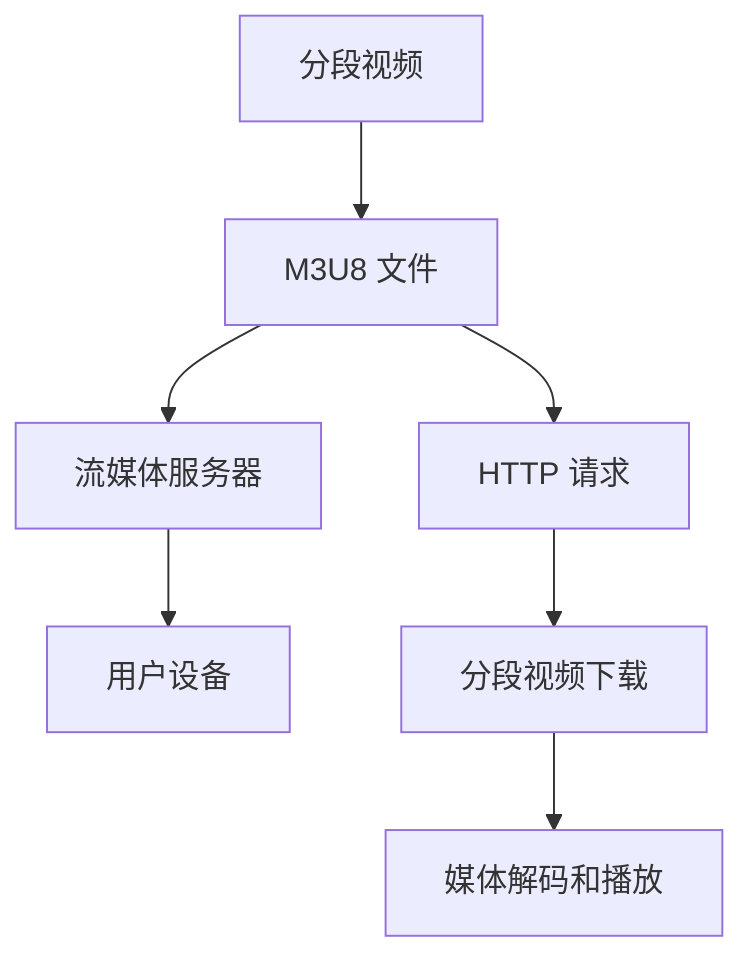

                 

# M3U8 播放列表：分段视频的索引

> 关键词：M3U8, 分段视频, 流媒体协议, 媒体索引, HTTP 直播

## 1. 背景介绍

在当前数字化和网络化的社会背景下，视频流媒体技术在各种在线应用场景中扮演着重要的角色。随着人们对高清、实时视频内容需求的不断增长，流媒体技术也在不断地演进和优化。M3U8（Master Playlist Format）作为流媒体协议中的重要组成部分，被广泛应用于各种类型的流媒体服务，包括直播、点播、广告插播等。M3U8提供了分段视频的索引功能，通过定义一系列TS（Transport Stream）文件，实现了流媒体的无缝播放和高效传输。本文将深入探讨M3U8协议的原理与实现细节，分析其在流媒体应用中的优势与挑战，并展望其未来的发展趋势。

## 2. 核心概念与联系

### 2.1 核心概念概述

- **M3U8**：Master Playlist Format，即M3U8，是一种用于描述流媒体内容的格式，用于索引和控制分段视频数据的传输。M3U8文件是一个文本文件，其中包含了一系列TS文件路径和持续时间等信息。
- **分段视频**：指将视频内容按照固定时间间隔或内容分割成多个小片段进行传输的视频格式。分段视频能有效提高流媒体的传输效率，减少延迟，提供更流畅的观看体验。
- **流媒体协议**：定义了如何在互联网上传输和控制流媒体数据的标准和规范。流媒体协议包括HTTP Live Streaming（HLS）、Adaptive Bitrate Streaming（ABS）等，其中M3U8是其核心组成部分。
- **媒体索引**：通过M3U8文件为流媒体分段视频提供统一的索引，使得流媒体服务器能够高效地管理和调度视频数据，用户也能够方便地选择和播放分段视频。

### 2.2 核心概念原理和架构的 Mermaid 流程图



此流程图展示了M3U8在流媒体传输中的作用，分段视频通过M3U8文件索引，由流媒体服务器提供，最终通过HTTP请求，下载并解码后由用户设备进行播放。

## 3. 核心算法原理 & 具体操作步骤

### 3.1 算法原理概述

M3U8协议的原理可以简单概括为以下几个步骤：

1. **M3U8文件的创建**：根据分段视频数据生成M3U8文件，包含所有TS文件的路径和持续时间等关键信息。
2. **流媒体服务器的索引**：流媒体服务器通过M3U8文件索引分段视频数据，并将其存储在CDN（内容分发网络）中。
3. **用户设备的播放控制**：用户设备通过HTTP请求下载M3U8文件，解析其中的TS文件路径，获取分段视频数据，并进行播放。
4. **分段视频的下载与播放**：用户设备按照M3U8文件中的顺序，下载并播放TS分段视频，实现流媒体的实时传输。

### 3.2 算法步骤详解

M3U8协议的具体操作步骤如下：

1. **M3U8文件生成**：
   - 对于视频文件，首先根据时间段或内容分割成多个小片段，生成每个TS文件的路径和持续时间等元数据。
   - 将这些元数据按照一定的格式组织成M3U8文件，例如：
     ```
     MediaSequence=0
     ApplicationName=live
     Segments:media=mp4
     Segments:mp4=true
     Segments:incremental=0
     Segments:exclusive=false
     Segments:playlists=0
     # 各TS文件路径和持续时间
     Segment:file=segment1.ts dur=00:00:10
     Segment:file=segment2.ts dur=00:00:20
     ```

2. **流媒体服务器索引**：
   - 流媒体服务器读取M3U8文件，索引其中的TS文件路径和持续时间，并将其存储在CDN中。
   - CDN根据用户请求，提供最接近用户的M3U8文件，确保快速下载。

3. **用户设备播放控制**：
   - 用户设备通过HTTP请求获取M3U8文件，解析其中的TS文件路径和持续时间。
   - 根据当前播放位置和缓冲区状态，用户设备选择最合适的TS文件进行下载和播放。

4. **分段视频下载与播放**：
   - 用户设备根据M3U8文件中的顺序，下载并播放TS分段视频，实现流媒体的实时传输。
   - 流媒体服务器实时监控每个TS文件的下载状态，调整编码率和分辨率，保证播放流畅。

### 3.3 算法优缺点

#### 3.3.1 优点

- **高效传输**：分段视频通过M3U8索引，可以有效减少流媒体的传输延迟，提高播放流畅度。
- **灵活性高**：用户设备可以根据网络状况和设备性能，灵活选择适合的TS文件进行播放，提高用户体验。
- **易于维护**：M3U8文件格式简单，易于管理和维护，减少了流媒体系统的复杂度。

#### 3.3.2 缺点

- **文件管理复杂**：大量TS文件的存储和索引增加了流媒体服务器的负担，尤其是在高并发的情况下。
- **流媒体缓存需求高**：用户设备需要缓存多个TS文件，增加了设备的存储和处理压力。
- **对网络带宽要求高**：由于M3U8协议需要同时下载多个TS文件，对网络带宽提出了更高的要求。

### 3.4 算法应用领域

M3U8协议广泛应用于各种流媒体应用场景，包括但不限于以下领域：

- **直播**：通过M3U8协议，流媒体服务器可以实时将直播内容分段传输，用户设备能够随时加入和退出直播，保持流畅的观看体验。
- **点播**：用户可以通过M3U8协议索引点播视频的分段内容，选择不同质量的视频分辨率，满足不同设备的需求。
- **广告插播**：在直播或点播视频中，通过M3U8协议插入广告内容，实现无缝插播，保证广告的播放效果。
- **多设备支持**：M3U8协议支持多种设备（如手机、平板、电视等）的兼容，提高流媒体内容的覆盖率。

## 4. 数学模型和公式 & 详细讲解 & 举例说明

### 4.1 数学模型构建

M3U8协议的主要数学模型包括分段视频的时间戳(Timestamp)、持续时间(Duration)、文件路径(File Path)等。以一个简单的M3U8文件为例：

```
Segment:file=segment1.ts dur=00:00:10
Segment:file=segment2.ts dur=00:00:20
```

其中，`dur`表示分段视频的持续时间，`file`表示TS文件的路径。

### 4.2 公式推导过程

假设分段视频的时间戳为$t_i$，持续时间为$d_i$，则在播放第$i$个分段视频时，当前时间戳$t$为：

$$
t = \sum_{j=1}^{i} (t_j + d_j)
$$

其中，$t_j$表示第$j$个分段视频的起始时间戳。通过以上公式，用户设备可以计算出当前时间戳，从而选择最合适的TS文件进行播放。

### 4.3 案例分析与讲解

假设有一个包含两个TS文件的M3U8文件，每个分段视频的持续时间为10秒：

```
Segment:file=segment1.ts dur=00:00:10
Segment:file=segment2.ts dur=00:00:20
```

用户设备在播放第10秒时，当前时间戳$t=10$，根据公式计算得到：

$$
t = 0 + 10 = 10
$$

因此，用户设备可以选择第一个TS文件进行播放。

## 5. 项目实践：代码实例和详细解释说明

### 5.1 开发环境搭建

M3U8文件的生成和解析涉及多种编程语言和工具，例如Python、Java、iOS SDK等。下面以Python为例，展示M3U8文件的生成和解析代码。

```python
# 生成M3U8文件
def generate_m3u8(video_path, start_time, end_time, duration):
    m3u8_content = ""
    for i in range(start_time, end_time, duration):
        m3u8_content += f"Segment:file={str(i) + '.ts'} dur={duration}\n"
    return m3u8_content

# 解析M3U8文件
def parse_m3u8(m3u8_path):
    with open(m3u8_path, 'r') as f:
        segments = [line.strip() for line in f.readlines()]
        return segments
```

### 5.2 源代码详细实现

在Python中，生成和解析M3U8文件的代码实现如下：

```python
# 生成M3U8文件
def generate_m3u8(video_path, start_time, end_time, duration):
    m3u8_content = ""
    for i in range(start_time, end_time, duration):
        m3u8_content += f"Segment:file={str(i) + '.ts'} dur={duration}\n"
    return m3u8_content

# 解析M3U8文件
def parse_m3u8(m3u8_path):
    with open(m3u8_path, 'r') as f:
        segments = [line.strip() for line in f.readlines()]
        return segments
```

### 5.3 代码解读与分析

在生成M3U8文件的函数中，首先定义了一个空字符串`m3u8_content`用于存储M3U8文件内容。然后使用`for`循环，从起始时间戳`start_time`开始，每隔`duration`时间生成一个TS文件路径和持续时间，并将这些信息拼接成一个字符串，最终返回完整的M3U8内容。

在解析M3U8文件的函数中，首先打开文件`m3u8_path`，并使用`readlines()`方法读取文件内容。然后去除每行末尾的换行符，并存储到列表`segments`中，最后返回该列表。

### 5.4 运行结果展示

假设生成的M3U8文件为`example.m3u8`，内容如下：

```
Segment:file=0.ts dur=00:00:10
Segment:file=10.ts dur=00:00:10
Segment:file=20.ts dur=00:00:10
```

解析该M3U8文件，得到分段视频路径和持续时间列表如下：

```python
[
    'Segment:file=0.ts dur=00:00:10',
    'Segment:file=10.ts dur=00:00:10',
    'Segment:file=20.ts dur=00:00:10'
]
```

## 6. 实际应用场景

### 6.1 直播应用

在直播应用中，M3U8协议可以高效地管理直播内容的分段传输，确保直播的流畅性和稳定性。流媒体服务器通过M3U8文件索引，动态调整编码率和分辨率，满足不同设备和网络状况下的播放需求。用户设备可以根据M3U8文件，实时选择最适合的TS文件进行播放。

### 6.2 点播应用

在点播应用中，用户可以选择不同的编码率和分辨率进行播放，提高观看体验。通过M3U8协议，点播视频的分段内容可以高效地索引和传输，用户设备可以迅速下载并播放视频内容。

### 6.3 广告插播

在直播或点播视频中，通过M3U8协议插入广告内容，可以保证广告的播放效果。广告服务器可以根据M3U8文件，动态调整广告的位置和时长，确保广告的展示效果和用户体验。

### 6.4 未来应用展望

未来，M3U8协议将在流媒体技术中继续发挥重要作用。随着5G网络的普及和高清视频的普及，流媒体内容的传输和播放需求将进一步提升。M3U8协议的优化和扩展，将有助于提高流媒体系统的性能和用户体验。

## 7. 工具和资源推荐

### 7.1 学习资源推荐

- **流媒体协议解析**：深入解析流媒体协议的书籍和文章，推荐《HTTP Live Streaming》、《Adaptive Bitrate Streaming》等。
- **视频编码和压缩**：掌握视频编码和压缩技术的书籍和在线课程，推荐《Video Compression and Storage》、Coursera上的《Video Compression》课程等。
- **流媒体技术开源项目**：了解和参与流媒体技术的开源项目，推荐Apache HLS、Apple HLS、Google HLS等。

### 7.2 开发工具推荐

- **视频编辑和处理工具**：用于视频分段和编辑，推荐Adobe Premiere Pro、DaVinci Resolve等。
- **流媒体服务开发工具**：用于流媒体服务器和CDN的开发，推荐AWS Elastic Transcoder、Google Cloud Video Intelligence等。
- **用户设备测试工具**：用于测试用户设备的播放性能和稳定性，推荐FFmpeg、Handbrake等。

### 7.3 相关论文推荐

- **流媒体协议研究**：了解流媒体协议的最新研究成果，推荐IEEE Transactions on Broadcasting、IEEE Transactions on Consumer Electronics等期刊。
- **视频压缩技术研究**：深入研究视频压缩技术的最新进展，推荐IEEE Transactions on Circuits and Systems for Video Technology、ACM Transactions on Multimedia Computing等期刊。
- **流媒体系统优化**：了解流媒体系统的优化技术和案例，推荐ACM Multimedia Systems、IEEE TVT等期刊。

## 8. 总结：未来发展趋势与挑战

### 8.1 总结

本文对M3U8协议的原理与实现进行了全面系统的介绍。M3U8协议通过分段视频的索引功能，实现了流媒体的高效传输和灵活播放，在直播、点播、广告插播等应用场景中发挥着重要作用。M3U8协议的开发和应用，展示了流媒体技术的发展方向和趋势。

通过本文的系统梳理，可以看到M3U8协议在流媒体领域的重要地位和应用前景。未来，随着流媒体技术的不断演进，M3U8协议也需要不断地优化和扩展，以适应新的应用需求和挑战。

### 8.2 未来发展趋势

M3U8协议的发展趋势如下：

1. **多格式支持**：随着新技术和设备的不断涌现，M3U8协议需要支持更多的媒体格式，如WebVTT、WebRTC等，提高兼容性和多样性。
2. **低延迟传输**：5G网络的普及和实时视频传输需求增加，M3U8协议需要进一步优化传输算法，降低延迟，提高实时性。
3. **自适应带宽管理**：通过自适应带宽管理，M3U8协议可以更好地适配不同的网络环境和用户设备，提高播放效果。
4. **智能推荐系统**：结合流媒体数据和用户行为，M3U8协议可以实现更加智能化的视频推荐，提升用户体验。

### 8.3 面临的挑战

M3U8协议在未来的发展中，仍面临以下挑战：

1. **协议标准统一**：不同设备和厂商的M3U8实现可能存在差异，导致兼容性问题。
2. **内容版权保护**：M3U8协议需要更好的内容版权保护机制，避免非法下载和传播。
3. **数据传输安全**：M3U8协议需要更好的数据传输安全机制，保护用户隐私和数据安全。
4. **设备兼容性和性能**：不同设备和操作系统对M3U8协议的支持可能存在差异，影响用户体验。

### 8.4 研究展望

未来，M3U8协议的研究方向可能包括：

1. **协议标准化**：推动M3U8协议的标准化工作，促进不同设备和厂商的互操作性。
2. **内容保护技术**：研究更好的内容保护技术，确保M3U8协议传输的内容安全。
3. **智能推荐系统**：结合流媒体数据和用户行为，实现更加智能化的视频推荐，提升用户体验。
4. **自适应传输技术**：研究自适应传输技术，提高M3U8协议的实时性和稳定性。

## 9. 附录：常见问题与解答

**Q1：M3U8协议如何实现高效的视频传输？**

A: M3U8协议通过分段视频的索引功能，有效减少了流媒体的传输延迟，提高了播放流畅度。用户设备可以根据M3U8文件，选择最合适的TS文件进行播放，实现实时传输。

**Q2：M3U8协议的局限性有哪些？**

A: M3U8协议的局限性包括：
1. 协议标准不统一，可能导致不同设备和厂商的兼容性问题。
2. 内容版权保护不足，存在非法下载和传播的风险。
3. 数据传输安全问题，可能存在隐私和数据泄露的风险。
4. 设备兼容性和性能问题，可能影响用户体验。

**Q3：M3U8协议的未来发展方向有哪些？**

A: M3U8协议的未来发展方向包括：
1. 协议标准化，提高不同设备和厂商的互操作性。
2. 内容保护技术，确保传输内容的版权和安全。
3. 智能推荐系统，提升用户体验。
4. 自适应传输技术，提高实时性和稳定性。

---

作者：禅与计算机程序设计艺术 / Zen and the Art of Computer Programming

