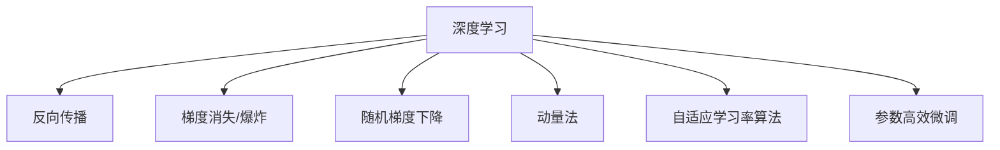

                 

## 1. 背景介绍

### 1.1 问题由来
机器学习（Machine Learning, ML）与反向传播（Backpropagation）算法，是现代深度学习的重要基础。深度神经网络通过多层非线性变换，从原始数据中学习到高级语义特征，实现复杂模式识别和预测任务。

反向传播算法通过对网络参数进行梯度更新，能够有效降低训练误差，提升模型泛化能力。然而，其核心思想——链式法则，在实际应用中面临着诸多挑战：
- 计算梯度链式法则，需要大量时间。深度网络的梯度会通过链式法则反向传播，计算量呈指数级增长。
- 梯度消失/爆炸。深度网络中的梯度在反向传播过程中可能逐渐消失或爆炸，导致深层参数无法更新。
- 神经网络参数过多。现代深度网络具有数百万乃至上亿的参数，训练复杂度高，难以调试。

这些问题催生了诸如随机梯度下降（SGD）、Adam等优化算法，以及参数高效微调（PEFT）等技术，以提升机器学习训练效率。

### 1.2 问题核心关键点
为了高效地训练深度神经网络，许多优秀的优化算法被提出。其中，梯度计算和参数更新是核心问题，也是机器学习效率的瓶颈。

机器学习的优化算法主要分为两类：
- 梯度下降法（包括随机梯度下降）：通过不断迭代优化目标函数，逐步逼近最优解。
- 动量法（Momentum）、Nesterov动量、Adagrad、Adadelta、Adam等：通过引入动量、自适应学习率等策略，提升梯度更新的效果。

同时，参数高效微调（PEFT）技术，通过只更新部分模型参数，减少计算量和内存消耗，提升微调效率。

## 2. 核心概念与联系

### 2.1 核心概念概述

为了更好地理解机器学习和反向传播，本节将介绍几个关键概念：

- 深度学习（Deep Learning）：基于多层神经网络，自动学习特征表示，适用于复杂模式识别和预测任务。
- 反向传播（Backpropagation）：通过链式法则，计算网络参数的梯度，并更新参数，实现模型训练。
- 梯度消失/爆炸：在反向传播过程中，梯度可能逐渐消失或爆炸，导致深层网络难以训练。
- 随机梯度下降（SGD）：通过随机抽样数据，计算梯度并更新参数，降低计算复杂度。
- 动量法（Momentum）：引入动量项，加速梯度更新，减少震荡。
- 自适应学习率算法（Adagrad、Adadelta、Adam等）：动态调整学习率，提升梯度更新的效果。
- 参数高效微调（Parameter-Efficient Fine-Tuning, PEFT）：通过只更新部分参数，减少计算量和内存消耗。

这些概念之间的逻辑关系可以通过以下Mermaid流程图来展示：



这个流程图展示了一系列关键概念的逻辑关系：

1. 深度学习通过多层神经网络进行特征学习，通过反向传播优化参数。
2. 反向传播在反向传播过程中可能遇到梯度消失/爆炸问题。
3. 为了解决这些问题，引入了随机梯度下降等算法。
4. 动量法、自适应学习率算法进一步提升了梯度更新的效果。
5. 参数高效微调技术，只更新部分参数，减少计算量和内存消耗。

这些概念共同构成了机器学习和反向传播的核心框架，使得深度神经网络能够在各种场景下发挥强大的学习能力。通过理解这些核心概念，我们可以更好地把握机器学习的训练过程，提升模型性能。

## 3. 核心算法原理 & 具体操作步骤
### 3.1 算法原理概述

机器学习和反向传播的核心思想是梯度下降法，其目标是通过不断迭代优化目标函数，逐步逼近最优解。梯度下降法包括随机梯度下降、动量法、自适应学习率算法等变体。

在深度学习中，目标函数通常定义为模型的损失函数。损失函数描述了模型预测结果与真实结果之间的差异。通过反向传播算法，计算网络参数的梯度，并根据梯度更新参数，从而降低损失函数。

反向传播算法的基本步骤如下：
1. 前向传播：将输入数据通过网络，计算每个层的输出。
2. 计算损失：通过损失函数计算模型预测结果与真实结果之间的误差。
3. 反向传播：计算每个参数的梯度，并根据梯度更新参数。

具体来说，反向传播算法的实现步骤如下：
1. 前向传播：从输入层开始，计算每个层的输出，保存中间结果。
2. 计算损失：通过损失函数计算模型预测结果与真实结果之间的误差。
3. 反向传播：计算每个参数的梯度，从后往前依次计算。

### 3.2 算法步骤详解

以下详细介绍反向传播算法的详细步骤：

1. **前向传播**：将输入数据 $x$ 通过网络，计算每个层的输出 $h_1, h_2, ..., h_n$。
2. **计算损失**：计算模型预测结果 $y$ 与真实结果 $y_{real}$ 之间的误差，即损失函数 $L(y, y_{real})$。
3. **反向传播**：
   - 从输出层开始，计算每个参数的梯度 $g_1, g_2, ..., g_n$。
   - 将每个参数的梯度逐层向前传播，计算每个参数的偏导数。
   - 根据偏导数和梯度，更新每个参数的值。

具体实现过程如下：

1. **前向传播**：
   ```python
   def forward(X):
       H = X
       for i in range(len(weights)):
           H = np.dot(H, weights[i]) + biases[i]
           if i < len(weights) - 1:
               H = nonlinearity(H)
       return H
   ```

2. **计算损失**：
   ```python
   def loss(y, y_real):
       return np.mean((y - y_real) ** 2)
   ```

3. **反向传播**：
   ```python
   def backward(X, y_real, learning_rate, num_epochs):
       for i in range(num_epochs):
           Y = forward(X)
           error = loss(Y, y_real)
           for j in range(len(weights) - 1, -1, -1):
               dY = error * (1 if j < len(weights) - 1 else 1)
               dweights[j] = np.dot(H[j].T, dY) * learning_rate
               dbiases[j] = np.mean(dY, axis=0) * learning_rate
               if j > 0:
                   dH[j - 1] = np.dot(dY, weights[j].T)
               H[j - 1] = nonlinearity_derivative(H[j - 1])
   ```

### 3.3 算法优缺点

反向传播算法在深度学习中应用广泛，但也存在一些缺点：
1. 计算复杂度高：深度网络中的梯度需要逐层计算，计算量呈指数级增长。
2. 梯度消失/爆炸：在反向传播过程中，梯度可能逐渐消失或爆炸，导致深层参数难以更新。
3. 需要大量标注数据：反向传播算法依赖标注数据，数据量不足会影响训练效果。

为了解决这些问题，提出了一系列优化算法，如随机梯度下降、动量法、自适应学习率算法等。这些算法通过引入随机性、动量、自适应学习率等策略，提升梯度更新的效果，加速模型收敛。

### 3.4 算法应用领域

反向传播算法在机器学习和深度学习中得到了广泛应用，覆盖了各种类型的深度神经网络：

- 卷积神经网络（CNNs）：用于图像分类、目标检测等计算机视觉任务。
- 循环神经网络（RNNs）：用于序列预测、语言模型等序列数据处理任务。
- 自编码器（Autoencoders）：用于数据降维、特征提取等任务。
- 生成对抗网络（GANs）：用于生成假图像、文本等。
- 强化学习（RL）：用于游戏、机器人控制等任务。

这些神经网络应用了反向传播算法，实现了复杂的模式识别、预测和生成任务，推动了计算机视觉、自然语言处理、智能控制等领域的进步。

## 4. 数学模型和公式 & 详细讲解 & 举例说明
### 4.1 数学模型构建

反向传播算法的数学模型可以表示为：

设深度神经网络由 $n$ 层组成，输入为 $x$，目标函数为 $L(y, y_{real})$，损失函数为 $J$。则反向传播算法的目标是最小化损失函数 $J$，即：

$$
\theta^* = \arg\min_{\theta} J(\theta)
$$

其中，$\theta$ 为网络参数，包括权重 $w$ 和偏置 $b$。

### 4.2 公式推导过程

在深度神经网络中，目标函数 $L(y, y_{real})$ 为：

$$
L(y, y_{real}) = \frac{1}{2} \| y - y_{real} \|^2
$$

反向传播算法的推导过程如下：

1. **前向传播**：
   - 第 $i$ 层输出 $h_i$ 的计算公式为：
     $$
     h_i = g(\sum_{j=1}^{i-1} w_{i,j}h_{j-1} + b_i)
     $$
   - 其中，$g$ 为激活函数，$w_{i,j}$ 为权重矩阵，$b_i$ 为偏置向量。

2. **计算损失**：
   - 目标函数的计算公式为：
     $$
     J(\theta) = \frac{1}{N} \sum_{i=1}^N L(y_i, y_{real_i})
     $$
   - 其中，$y_i$ 为第 $i$ 个样本的预测值，$y_{real_i}$ 为真实值，$N$ 为样本数量。

3. **反向传播**：
   - 第 $i$ 层的梯度 $g_i$ 的计算公式为：
     $$
     g_i = \frac{\partial L}{\partial h_i}
     $$
   - 其中，$h_i$ 为第 $i$ 层的输出。

4. **更新参数**：
   - 第 $i$ 层的权重和偏置的更新公式为：
     $$
     w_{i,j} \leftarrow w_{i,j} - \eta \frac{\partial g_i}{\partial w_{i,j}}
     $$
     $$
     b_i \leftarrow b_i - \eta \frac{\partial g_i}{\partial b_i}
     $$

其中，$\eta$ 为学习率。

### 4.3 案例分析与讲解

以二分类任务为例，说明反向传播算法的实现过程。

1. **网络结构**：
   - 输入层：1 个神经元，表示输入向量。
   - 隐藏层：3 个神经元，使用 Sigmoid 激活函数。
   - 输出层：1 个神经元，使用 Sigmoid 激活函数。
   - 权重矩阵 $w$ 和偏置向量 $b$ 的初始化为随机值。

2. **前向传播**：
   - 输入 $x = (1, 2, 3)$，计算隐藏层输出 $h_1$：
     $$
     h_1 = \sigma(w_1 x + b_1) = \sigma(w_1 \cdot (1, 2, 3) + b_1)
     $$
   - 计算输出层输出 $h_2$：
     $$
     h_2 = \sigma(w_2 h_1 + b_2) = \sigma(w_2 \cdot h_1 + b_2)
     $$

3. **计算损失**：
   - 假设目标函数为 $L(y, y_{real}) = \frac{1}{2}(y - y_{real})^2$。
   - 目标函数为：
     $$
     J(\theta) = \frac{1}{N} \sum_{i=1}^N L(h_2, y_{real_i})
     $$

4. **反向传播**：
   - 计算输出层梯度 $g_2$：
     $$
     g_2 = \frac{\partial L}{\partial h_2} = h_2 - y_{real}
     $$
   - 计算隐藏层梯度 $g_1$：
     $$
     g_1 = \frac{\partial g_2}{\partial h_1} \frac{\partial h_1}{\partial w_1} = g_2 \cdot (1 - h_1) \cdot w_1^T
     $$

5. **更新参数**：
   - 更新权重 $w_1$ 和偏置 $b_1$：
     $$
     w_1 \leftarrow w_1 - \eta g_1 h_1^T
     $$
     $$
     b_1 \leftarrow b_1 - \eta g_1
     $$

其中，$\sigma$ 为 Sigmoid 激活函数。

通过上述过程，深度神经网络可以逐步更新参数，最小化目标函数，实现模型训练。

## 5. 项目实践：代码实例和详细解释说明
### 5.1 开发环境搭建

在进行机器学习和反向传播实践前，我们需要准备好开发环境。以下是使用Python进行TensorFlow开发的环境配置流程：

1. 安装Anaconda：从官网下载并安装Anaconda，用于创建独立的Python环境。

2. 创建并激活虚拟环境：
```bash
conda create -n tf-env python=3.8 
conda activate tf-env
```

3. 安装TensorFlow：根据CUDA版本，从官网获取对应的安装命令。例如：
```bash
pip install tensorflow==2.4
```

4. 安装各类工具包：
```bash
pip install numpy pandas scikit-learn matplotlib tqdm jupyter notebook ipython
```

完成上述步骤后，即可在`tf-env`环境中开始机器学习和反向传播实践。

### 5.2 源代码详细实现

下面我们以二分类任务为例，给出使用TensorFlow进行反向传播算法的PyTorch代码实现。

首先，定义二分类任务的模型：

```python
import tensorflow as tf

class LogisticRegression(tf.keras.Model):
    def __init__(self, input_dim):
        super().__init__()
        self.w = tf.Variable(tf.random.normal([input_dim, 1]))
        self.b = tf.Variable(tf.zeros([1]))
        
    def forward(self, x):
        return tf.sigmoid(tf.matmul(x, self.w) + self.b)
```

然后，定义训练函数：

```python
def train(X, y, learning_rate, epochs):
    model = LogisticRegression(input_dim=X.shape[1])
    
    for epoch in range(epochs):
        with tf.GradientTape() as tape:
            y_pred = model.forward(X)
            loss = tf.reduce_mean(tf.nn.sigmoid_cross_entropy_with_logits(labels=y, logits=y_pred))
        grads = tape.gradient(loss, [model.w, model.b])
        optimizer.apply_gradients(zip(grads, [model.w, model.b]))
        
    return model
```

最后，启动训练流程：

```python
X = np.array([[1, 2, 3], [4, 5, 6], [7, 8, 9]])
y = np.array([0, 1, 0])
learning_rate = 0.01
epochs = 1000

model = train(X, y, learning_rate, epochs)
```

以上就是使用TensorFlow进行反向传播算法的完整代码实现。可以看到，TensorFlow提供了方便的自动微分和优化器API，使得反向传播算法的实现非常简单。

### 5.3 代码解读与分析

让我们再详细解读一下关键代码的实现细节：

**LogisticRegression类**：
- `__init__`方法：初始化模型参数，包括权重和偏置。
- `forward`方法：前向传播计算输出结果。

**train函数**：
- 在每个epoch中，使用TensorFlow的`tf.GradientTape`记录梯度。
- 前向传播计算输出结果，计算损失函数。
- 反向传播计算梯度，使用`optimizer.apply_gradients`更新模型参数。

**训练流程**：
- 定义输入数据X和标签y，以及学习率、epoch数等超参数。
- 使用`train`函数训练模型，返回训练后的模型。

可以看到，TensorFlow提供了灵活高效的API，使得反向传播算法的实现变得非常简单。开发者可以将更多精力放在模型设计和算法优化上，而不必过多关注底层实现细节。

当然，工业级的系统实现还需考虑更多因素，如模型保存和部署、超参数搜索、模型可视化等。但核心的反向传播算法基本与此类似。

## 6. 实际应用场景
### 6.1 图像分类

反向传播算法在图像分类任务中得到了广泛应用。深度卷积神经网络（CNNs）通过多层卷积和池化操作，提取图像特征，通过全连接层进行分类。反向传播算法通过对网络参数进行梯度更新，实现模型训练。

在实践中，可以使用预训练的CNN模型作为初始化参数，通过反向传播算法在特定数据集上进行微调，提升模型在特定任务上的性能。例如，可以使用预训练的ResNet、Inception等模型，通过反向传播算法在ImageNet等数据集上进行微调，提升模型在特定图像分类任务上的性能。

### 6.2 自然语言处理

反向传播算法在自然语言处理任务中也得到了广泛应用。深度神经网络通过多层循环神经网络（RNNs）或长短期记忆网络（LSTMs），提取文本序列特征，通过全连接层进行分类或生成。反向传播算法通过对网络参数进行梯度更新，实现模型训练。

在实践中，可以使用预训练的RNN或LSTM模型作为初始化参数，通过反向传播算法在特定数据集上进行微调，提升模型在特定任务上的性能。例如，可以使用预训练的BERT模型，通过反向传播算法在CoLA、WSC等数据集上进行微调，提升模型在特定自然语言处理任务上的性能。

### 6.3 语音识别

反向传播算法在语音识别任务中也得到了广泛应用。深度神经网络通过多层卷积神经网络（CNNs）或循环神经网络（RNNs），提取语音特征，通过全连接层进行分类或生成。反向传播算法通过对网络参数进行梯度更新，实现模型训练。

在实践中，可以使用预训练的CNN或RNN模型作为初始化参数，通过反向传播算法在特定数据集上进行微调，提升模型在特定任务上的性能。例如，可以使用预训练的Wav2Vec 2.0模型，通过反向传播算法在LibriSpeech等数据集上进行微调，提升模型在特定语音识别任务上的性能。

### 6.4 未来应用展望

随着反向传播算法的不断演进，其在机器学习和深度学习中的应用前景依然广阔：

1. 模型规模持续增大。随着算力成本的下降和数据规模的扩张，深度神经网络的参数量还将持续增长。超大批次的训练和推理也可能遇到显存不足的问题，需要采用模型并行、混合精度等技术进行优化。

2. 更高效的网络结构。未来将涌现更多高效的网络结构，如注意力机制、残差连接、层归一化等，进一步提升梯度更新的效果，加速模型收敛。

3. 更多的优化算法。除了传统的梯度下降算法，未来还将涌现更多优化算法，如AdamW、AdaGrad、RMSprop等，进一步提升梯度更新的效果，加速模型收敛。

4. 更灵活的微调方法。未来的微调方法将更加灵活，可以通过引入先验知识、多任务学习等手段，提升微调效果。

5. 更好的泛化性能。未来的反向传播算法将更好地处理过拟合问题，提升模型的泛化性能。

6. 更多的应用场景。随着深度学习在各个领域的广泛应用，反向传播算法也将被应用于更多场景中，如推荐系统、医疗影像、金融预测等。

总之，反向传播算法在未来将继续发挥其核心作用，推动深度学习技术在各个领域的发展和应用。

## 7. 工具和资源推荐
### 7.1 学习资源推荐

为了帮助开发者系统掌握机器学习和反向传播的理论基础和实践技巧，这里推荐一些优质的学习资源：

1. 《深度学习》课程：斯坦福大学开设的深度学习课程，有Lecture视频和配套作业，带你入门深度学习的基本概念和经典模型。

2. 《机器学习》书籍：Ian Goodfellow、Yoshua Bengio和Aaron Courville合著的经典教材，全面介绍了机器学习和深度学习的原理和算法。

3. 《Python深度学习》书籍：Francois Chollet著，介绍了使用Keras进行深度学习开发的实践技巧和经典案例。

4. TensorFlow官方文档：TensorFlow的官方文档，提供了丰富的API和样例代码，是上手实践的重要资源。

5. PyTorch官方文档：PyTorch的官方文档，提供了灵活高效的API和样例代码，是上手实践的重要资源。

通过对这些资源的学习实践，相信你一定能够快速掌握机器学习和反向传播的精髓，并用于解决实际的模型训练问题。

### 7.2 开发工具推荐

高效的开发离不开优秀的工具支持。以下是几款用于深度学习开发的常用工具：

1. TensorFlow：由Google主导开发的开源深度学习框架，生产部署方便，适合大规模工程应用。

2. PyTorch：由Facebook主导开发的开源深度学习框架，灵活高效，适合研究性开发。

3. Keras：高层API封装，简单易用，适合初学者和快速开发。

4. Jupyter Notebook：开源的交互式开发环境，支持Python、R、Julia等多种语言，适合快速迭代开发。

5. Anaconda：Python环境管理工具，支持创建虚拟环境和环境管理，方便多项目开发。

6. GitHub：开源代码托管平台，支持版本控制和代码协作，适合项目共享和团队开发。

合理利用这些工具，可以显著提升深度学习和反向传播的开发效率，加快创新迭代的步伐。

### 7.3 相关论文推荐

机器学习和反向传播技术的发展源于学界的持续研究。以下是几篇奠基性的相关论文，推荐阅读：

1. 《深度学习》：Ian Goodfellow、Yoshua Bengio和Aaron Courville合著的经典教材，全面介绍了深度学习的原理和算法。

2. 《Reinforcement Learning: An Introduction》：Richard S. Sutton和Andrew G. Barto合著的经典教材，介绍了强化学习的原理和算法。

3. 《TensorFlow: A System for Large-Scale Machine Learning》：Jeff Dean和Sanjay Ghemawat合著的论文，介绍了TensorFlow的设计思想和实现细节。

4. 《Backpropagation: Applying artificial neural networks to sequences and sequences of sequences》：David E. Rumelhart、Geoffrey E. Hinton和Ronald J. Williams合著的经典论文，首次提出了反向传播算法。

5. 《ImageNet Classification with Deep Convolutional Neural Networks》：Alex Krizhevsky、Ilya Sutskever和Geoffrey Hinton合著的经典论文，介绍了使用卷积神经网络进行图像分类的实践技巧。

这些论文代表了大规模机器学习和反向传播技术的发展脉络。通过学习这些前沿成果，可以帮助研究者把握学科前进方向，激发更多的创新灵感。

## 8. 总结：未来发展趋势与挑战
### 8.1 总结

本文对反向传播算法进行了全面系统的介绍。首先阐述了机器学习和深度学习的研究背景和意义，明确了反向传播算法在模型训练中的核心作用。其次，从原理到实践，详细讲解了反向传播算法的数学模型和实现步骤，给出了机器学习和反向传播任务开发的完整代码实例。同时，本文还广泛探讨了反向传播算法在图像分类、自然语言处理、语音识别等众多领域的应用前景，展示了反向传播算法的重要价值。

通过本文的系统梳理，可以看到，反向传播算法在深度学习中应用广泛，成为机器学习训练的核心算法。未来，随着深度学习技术的发展，反向传播算法也将继续发挥其核心作用，推动深度学习在各个领域的应用和创新。

### 8.2 未来发展趋势

展望未来，反向传播算法将呈现以下几个发展趋势：

1. 模型规模持续增大。随着算力成本的下降和数据规模的扩张，深度神经网络的参数量还将持续增长。超大批次的训练和推理也可能遇到显存不足的问题，需要采用模型并行、混合精度等技术进行优化。

2. 更高效的网络结构。未来将涌现更多高效的网络结构，如注意力机制、残差连接、层归一化等，进一步提升梯度更新的效果，加速模型收敛。

3. 更多的优化算法。除了传统的梯度下降算法，未来还将涌现更多优化算法，如AdamW、AdaGrad、RMSprop等，进一步提升梯度更新的效果，加速模型收敛。

4. 更灵活的微调方法。未来的微调方法将更加灵活，可以通过引入先验知识、多任务学习等手段，提升微调效果。

5. 更好的泛化性能。未来的反向传播算法将更好地处理过拟合问题，提升模型的泛化性能。

6. 更多的应用场景。随着深度学习在各个领域的广泛应用，反向传播算法也将被应用于更多场景中，如推荐系统、医疗影像、金融预测等。

这些趋势展示了反向传播算法在机器学习和深度学习中的重要地位，也预示了其在未来发展的巨大潜力。

### 8.3 面临的挑战

尽管反向传播算法在深度学习中应用广泛，但也面临一些挑战：

1. 计算复杂度高。深度网络中的梯度需要逐层计算，计算量呈指数级增长。

2. 梯度消失/爆炸。在反向传播过程中，梯度可能逐渐消失或爆炸，导致深层参数难以更新。

3. 需要大量标注数据。反向传播算法依赖标注数据，数据量不足会影响训练效果。

4. 模型过拟合。深度网络中的参数过多，容易发生过拟合问题。

5. 模型训练速度慢。深度网络的训练过程往往需要大量的计算资源和时间，训练速度较慢。

6. 模型泛化性能差。深度网络在训练集上表现良好，但在测试集上泛化性能差。

### 8.4 研究展望

面对反向传播算法所面临的种种挑战，未来的研究需要在以下几个方面寻求新的突破：

1. 探索更高效的优化算法。开发更加高效的优化算法，提升梯度更新的效果，加速模型收敛。

2. 研究更灵活的微调方法。开发参数高效微调技术，只更新部分模型参数，减小计算量和内存消耗，提升微调效率。

3. 引入先验知识和多任务学习。将符号化的先验知识，如知识图谱、逻辑规则等，与神经网络模型进行巧妙融合，引导微调过程学习更准确、合理的语言模型。

4. 优化模型结构。采用更高效的网络结构，如注意力机制、残差连接、层归一化等，提升梯度更新的效果，加速模型收敛。

5. 提升模型泛化性能。通过引入正则化、早停等技术，提升模型的泛化性能，减少过拟合问题。

6. 优化训练流程。通过并行化、分布式训练等技术，优化训练流程，提升模型训练速度。

这些研究方向的探索，必将引领反向传播算法迈向更高的台阶，为深度学习技术在各个领域的发展和应用提供重要支持。

## 9. 附录：常见问题与解答

**Q1：什么是反向传播算法？**

A: 反向传播算法是一种用于深度神经网络训练的优化算法。通过反向传播算法，可以计算网络参数的梯度，并根据梯度更新参数，实现模型训练。

**Q2：反向传播算法的主要缺点是什么？**

A: 反向传播算法的主要缺点包括：
1. 计算复杂度高：深度网络中的梯度需要逐层计算，计算量呈指数级增长。
2. 梯度消失/爆炸：在反向传播过程中，梯度可能逐渐消失或爆炸，导致深层参数难以更新。
3. 需要大量标注数据：反向传播算法依赖标注数据，数据量不足会影响训练效果。

**Q3：如何缓解梯度消失/爆炸问题？**

A: 缓解梯度消失/爆炸问题的方法包括：
1. 引入激活函数：使用ReLU、Leaky ReLU等激活函数，缓解梯度消失问题。
2. 权重初始化：使用适当的权重初始化方法，如Xavier、He等，缓解梯度爆炸问题。
3. 批量归一化：使用批量归一化技术，缓解梯度消失/爆炸问题。

**Q4：什么是参数高效微调？**

A: 参数高效微调（Parameter-Efficient Fine-Tuning, PEFT）是一种微调方法，只更新部分模型参数，而不是全部参数。这样可以减少计算量和内存消耗，提高微调效率。

**Q5：微调算法的优缺点是什么？**

A: 微调算法的优点包括：
1. 适应性强：微调算法可以适应各种任务，如分类、匹配、生成等。
2. 参数高效：微调算法只更新少量参数，减小计算量和内存消耗，提升微调效率。
3. 效果显著：微调算法在特定任务上通常能够取得不错的性能提升。

微调算法的缺点包括：
1. 数据依赖性高：微调算法依赖标注数据，数据量不足会影响训练效果。
2. 泛化能力有限：微调算法在小规模数据集上的泛化能力有限，容易过拟合。

**Q6：微调算法在实际应用中有哪些注意事项？**

A: 微调算法在实际应用中有以下注意事项：
1. 数据准备：微调算法依赖标注数据，需要确保数据集的质量和多样性。
2. 模型选择：选择合适的预训练模型，确保其在特定任务上的性能。
3. 超参数调优：选择合适的超参数，如学习率、批量大小等，提升微调效果。
4. 模型保存和部署：合理设计模型保存和部署策略，确保模型高效运行。

通过这些问题的解答，可以更好地理解机器学习和反向传播算法的核心概念和实现细节，为解决实际问题提供指导。

---

作者：禅与计算机程序设计艺术 / Zen and the Art of Computer Programming

