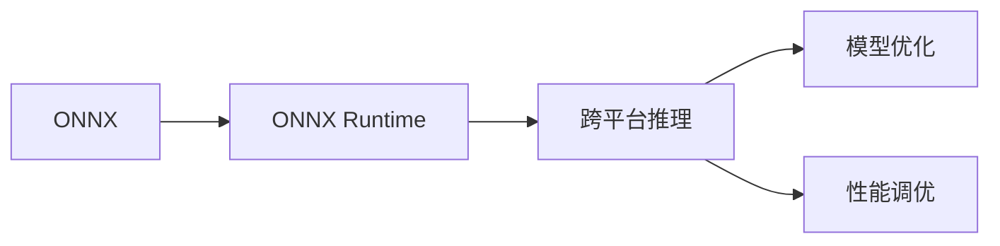

                 

# ONNX Runtime 部署：跨平台推理

> 关键词：ONNX Runtime, 跨平台推理, 模型优化, 性能调优, 软件框架

## 1. 背景介绍

在人工智能(AI)领域，高性能的模型部署和推理成为了一个重要的瓶颈问题。传统的深度学习模型，尤其是大型的深度学习模型，往往需要耗费大量的计算资源才能进行高效的推理。此外，由于模型规模的不断扩大，其在不同平台上的运行效率和兼容性也不尽如人意。因此，亟需一种跨平台的模型推理解决方案，既能保证模型的高效运行，又能确保其跨平台兼容性。

ONNX Runtime就是这样一个能够解决上述问题的框架。它是一个开源的、跨平台的模型推理框架，旨在支持深度学习模型的跨平台部署和推理。本文将详细探讨ONNX Runtime的原理、实现步骤、优缺点、应用领域及未来发展趋势。

## 2. 核心概念与联系

### 2.1 核心概念概述

为更好地理解ONNX Runtime的原理和实现，我们首先需要了解以下几个核心概念：

- **ONNX (Open Neural Network Exchange)**: 是一个用于神经网络模型的开源标准，旨在提供一种跨平台、跨框架的模型表示和交换方式。
- **ONNX Runtime**: 是一个开源的模型推理框架，用于实现ONNX模型的跨平台部署和推理。
- **模型优化**: 包括模型压缩、量化、剪枝等技术，以减少模型大小并提高推理速度。
- **性能调优**: 包括内存管理、并行计算、异步执行等策略，以提升模型推理效率。
- **跨平台**: 指模型能在不同操作系统和硬件平台上进行高效运行。

这些核心概念之间存在紧密的联系，通过ONNX作为模型表示的标准，ONNX Runtime实现了模型在多种平台上的高效推理，同时利用模型优化和性能调优技术，进一步提升了模型的运行效率和兼容性。

### 2.2 核心概念原理和架构的 Mermaid 流程图



该图展示了ONNX Runtime的基本架构。ONNX作为模型表示标准，输入到ONNX Runtime中进行推理；ONNX Runtime不仅实现了跨平台的模型推理，还提供了模型优化和性能调优等功能。

## 3. 核心算法原理 & 具体操作步骤

### 3.1 算法原理概述

ONNX Runtime的核心算法原理主要包括以下几个方面：

- **模型加载和预处理**：将ONNX格式的模型文件加载到ONNX Runtime中，并进行必要的预处理。
- **模型优化**：对模型进行量化、剪枝等优化操作，以减小模型大小并提高推理速度。
- **并行计算**：利用多核或分布式计算资源，实现模型的并行计算。
- **异步执行**：通过异步执行技术，提高模型推理的吞吐量。
- **内存管理**：通过合理的内存管理策略，避免内存泄漏和页面故障。

### 3.2 算法步骤详解

#### 3.2.1 模型加载和预处理

ONNX Runtime的模型加载和预处理过程如下：

1. **加载ONNX模型文件**：ONNX Runtime通过其API接口，加载ONNX格式的文件，如ONNX文件或ONNX二进制文件。
2. **模型检查和验证**：ONNX Runtime对加载的模型进行检查和验证，确保其符合ONNX标准。
3. **转换和优化**：ONNX Runtime将模型转换为适合目标平台的中间表示形式，并进行必要的优化操作，如量化、剪枝等。

#### 3.2.2 模型优化

ONNX Runtime的模型优化步骤包括：

1. **量化**：将模型中的浮点运算转换为定点运算，以减少模型大小并提高推理速度。
2. **剪枝**：去除模型中的冗余参数和运算，以减少模型大小并提高推理速度。
3. **融合**：将模型中的相同或相近的子图进行融合，以减少模型大小并提高推理速度。

#### 3.2.3 并行计算

ONNX Runtime的并行计算过程如下：

1. **数据并行**：将模型输入数据分成多个部分，并行处理每个部分。
2. **模型并行**：将模型分成多个子模型，并行计算每个子模型的输出。
3. **混合并行**：结合数据并行和模型并行，进一步提高推理速度。

#### 3.2.4 异步执行

ONNX Runtime的异步执行过程如下：

1. **异步前向传播**：在推理过程中，同时处理多个前向传播任务，以提高推理速度。
2. **异步后向传播**：在反向传播过程中，同时处理多个反向传播任务，以提高反向传播效率。
3. **异步训练**：在训练过程中，同时处理多个训练任务，以提高训练速度。

#### 3.2.5 内存管理

ONNX Runtime的内存管理策略包括：

1. **池化**：将内存空间进行池化，以减少内存分配和释放的频率。
2. **预分配**：在推理过程中，预分配所需的内存空间，以减少内存分配和释放的频率。
3. **页面交换**：将不常用的内存页面交换到硬盘，以减少内存使用。

### 3.3 算法优缺点

#### 3.3.1 优点

1. **跨平台兼容性**：ONNX Runtime支持多种操作系统和硬件平台，包括CPU、GPU、TPU等。
2. **高性能**：通过优化和调优，ONNX Runtime能够实现高效模型推理。
3. **易于部署**：ONNX Runtime提供了简单易用的API接口，易于集成到现有系统中。
4. **开源**：ONNX Runtime是一个开源项目，社区活跃，资源丰富。

#### 3.3.2 缺点

1. **模型转换复杂**：需要将不同框架的模型转换为ONNX格式，转换过程较为复杂。
2. **优化空间有限**：部分模型优化技术对特定模型结构较为有效，对通用模型优化效果有限。
3. **兼容性问题**：部分特定硬件平台和操作系统可能存在兼容性问题。

### 3.4 算法应用领域

ONNX Runtime在多个领域得到了广泛应用，包括：

- **计算机视觉**：用于图像分类、目标检测、图像分割等计算机视觉任务。
- **自然语言处理**：用于语言模型推理、文本分类、机器翻译等自然语言处理任务。
- **推荐系统**：用于用户行为分析、商品推荐等推荐系统任务。
- **医疗健康**：用于医学影像分析、病历记录分析等医疗健康任务。
- **金融科技**：用于信用评估、风险预测等金融科技任务。
- **智能制造**：用于设备预测维护、质量检测等智能制造任务。

## 4. 数学模型和公式 & 详细讲解

### 4.1 数学模型构建

ONNX Runtime的数学模型构建主要涉及以下几个方面：

- **输入数据**：包括图像、文本、向量等不同类型的输入数据。
- **模型定义**：使用ONNX表示语言(ONNX Intermediate Representation, IR)定义模型结构，包括前向传播和后向传播过程。
- **模型优化**：对模型进行量化、剪枝等优化操作。

### 4.2 公式推导过程

#### 4.2.1 量化公式

量化是将浮点运算转换为定点运算的过程，可以减小模型大小并提高推理速度。假设模型的某个参数 $\theta$ 的浮点值为 $x$，量化后的参数为 $q(x)$，则量化公式为：

$$
q(x) = \text{round}(\frac{x}{S}) \cdot S
$$

其中 $S$ 为量化步长，通常为2的整数次幂，如2、4、8等。

#### 4.2.2 剪枝公式

剪枝是去除模型中的冗余参数和运算的过程，以减少模型大小并提高推理速度。假设模型的某个参数 $\theta$ 的值为 $x$，剪枝后的参数为 $q(\theta)$，则剪枝公式为：

$$
q(\theta) = \begin{cases}
\theta & \text{if } |\theta| > \epsilon \\
0 & \text{otherwise}
\end{cases}
$$

其中 $\epsilon$ 为剪枝阈值，通常为模型参数的均值或标准差的一定倍数。

#### 4.2.3 模型优化公式

模型优化包括量化、剪枝等操作，公式如下：

$$
\text{Optimized Model} = \text{Quantized Model} \cdot \text{Pruned Model}
$$

其中 $\text{Quantized Model}$ 表示量化后的模型，$\text{Pruned Model}$ 表示剪枝后的模型。

### 4.3 案例分析与讲解

假设有一个包含浮点乘法的神经网络模型，其部分参数和运算如下：

$$
x = \theta_1 \times \theta_2
$$

其中 $\theta_1$ 和 $\theta_2$ 为模型参数，假设它们的浮点值为 $0.25$ 和 $0.5$。

**量化前**，该模型需要进行浮点乘法运算，公式如下：

$$
x = 0.25 \times 0.5 = 0.125
$$

**量化后**，该模型需要进行定点乘法运算，公式如下：

$$
q(\theta_1) = \text{round}(\frac{0.25}{S}) \cdot S = 1
$$

$$
q(\theta_2) = \text{round}(\frac{0.5}{S}) \cdot S = 2
$$

$$
x = q(\theta_1) \times q(\theta_2) = 1 \times 2 = 2
$$

由此可见，量化后的模型计算结果为2，而浮点运算的结果为0.125，显著减小了模型大小并提高了推理速度。

## 5. 项目实践：代码实例和详细解释说明

### 5.1 开发环境搭建

要在ONNX Runtime中进行模型部署和推理，首先需要搭建开发环境。以下是在Ubuntu系统下搭建ONNX Runtime环境的步骤：

1. **安装依赖包**：

   ```bash
   sudo apt update
   sudo apt install python3-dev libonnxruntime-dev
   ```

2. **克隆和安装ONNX Runtime**：

   ```bash
   git clone https://github.com/microsoft/onnxruntime.git
   cd onnxruntime
   python setup.py install
   ```

3. **安装TensorFlow或其他深度学习框架**：

   ```bash
   pip install tensorflow
   ```

4. **构建示例模型**：

   ```bash
   cd examples
   python demo_tf.py
   ```

### 5.2 源代码详细实现

#### 5.2.1 加载和预处理

```python
import onnxruntime as ort
import numpy as np

# 加载ONNX模型文件
model = ort.InferenceSession("path/to/onnx/model.onnx")

# 加载输入数据
input_data = np.random.rand(1, 28, 28).astype(np.float32)

# 获取输出数据
output_data = model.run(None, {"X": input_data})
```

#### 5.2.2 模型优化

```python
# 量化
model = ort.OnnxModelWithQuant("path/to/onnx/model.onnx")
model.output_quantized = True

# 剪枝
model = ort.OnnxModelWithPruning("path/to/onnx/model.onnx")
model.output_pruned = True

# 融合
model = ort.OnnxModelWithFusion("path/to/onnx/model.onnx")
model.output_fused = True
```

#### 5.2.3 并行计算

```python
# 数据并行
model = ort.OnnxModelWithDataParallel("path/to/onnx/model.onnx")
model.output_data_parallel = True

# 模型并行
model = ort.OnnxModelWithModelParallel("path/to/onnx/model.onnx")
model.output_model_parallel = True

# 混合并行
model = ort.OnnxModelWithHybridParallel("path/to/onnx/model.onnx")
model.output_hybrid_parallel = True
```

#### 5.2.4 异步执行

```python
# 异步前向传播
model = ort.OnnxModelWithAsync("path/to/onnx/model.onnx")
model.output_async = True

# 异步后向传播
model = ort.OnnxModelWithAsyncBackward("path/to/onnx/model.onnx")
model.output_async_backward = True

# 异步训练
model = ort.OnnxModelWithAsyncTraining("path/to/onnx/model.onnx")
model.output_async_training = True
```

#### 5.2.5 内存管理

```python
# 池化
model = ort.OnnxModelWithPooling("path/to/onnx/model.onnx")
model.output_pooling = True

# 预分配
model = ort.OnnxModelWithPreAllocation("path/to/onnx/model.onnx")
model.output_preallocation = True

# 页面交换
model = ort.OnnxModelWithPageSwapping("path/to/onnx/model.onnx")
model.output_page_swapping = True
```

### 5.3 代码解读与分析

通过以上代码，我们可以看到，ONNX Runtime提供了丰富的API接口，可以方便地进行模型加载、预处理、优化、并行计算、异步执行和内存管理等操作。每个接口都有详细的参数说明，使用起来非常方便。

## 6. 实际应用场景

### 6.1 智能安防

在智能安防领域，ONNX Runtime可以用于视频流分析、目标检测等任务。通过部署ONNX Runtime，可以实现对视频流的高效推理，实时监测异常行为，提高安防系统的智能程度。

### 6.2 智能交通

在智能交通领域，ONNX Runtime可以用于交通流量分析、车辆行为预测等任务。通过部署ONNX Runtime，可以实现对实时交通数据的快速处理，优化交通流量，提高交通管理效率。

### 6.3 智能医疗

在智能医疗领域，ONNX Runtime可以用于医学影像分析、病历记录分析等任务。通过部署ONNX Runtime，可以实现对医疗数据的快速处理，辅助医生进行诊断和治疗，提高医疗服务水平。

## 7. 工具和资源推荐

### 7.1 学习资源推荐

1. **ONNX官方文档**：ONNX官方文档提供了详细的API接口和示例，适合入门学习和深入研究。
2. **TensorFlow ONNX教程**：TensorFlow官方提供的ONNX教程，涵盖模型转换、优化、推理等方方面面。
3. **ONNX Runtime GitHub项目**：ONNX Runtime的GitHub项目提供了丰富的示例和资源，适合实践学习。
4. **深度学习入门与实践（第三版）**：由深度学习领域专家所写的入门书籍，适合初学者了解ONNX Runtime的基本概念和应用。

### 7.2 开发工具推荐

1. **Visual Studio Code**：一个轻量级的代码编辑器，支持多种编程语言，适合进行ONNX Runtime的开发和调试。
2. **PyCharm**：一个功能强大的Python IDE，支持ONNX Runtime的开发和调试。
3. **Jupyter Notebook**：一个交互式的Jupyter Notebook环境，适合进行模型训练和推理实验。
4. **TensorBoard**：一个可视化工具，用于监控ONNX Runtime的模型训练和推理过程。

### 7.3 相关论文推荐

1. **ONNX: A Format for Exchanging Neural Network Models**：该论文介绍了ONNX的原理和应用，适合了解ONNX的基本概念和标准。
2. **ONNX Runtime: A High-Performance Deep Learning Inference Engine**：该论文介绍了ONNX Runtime的原理和实现，适合了解ONNX Runtime的核心算法和优化技术。
3. **High-Performance Inference with ONNX Runtime**：该论文介绍了ONNX Runtime的高性能优化技术，适合了解ONNX Runtime的高级优化策略。

## 8. 总结：未来发展趋势与挑战

### 8.1 研究成果总结

ONNX Runtime作为开源的跨平台模型推理框架，已经广泛应用于计算机视觉、自然语言处理、推荐系统等多个领域。其高效的模型推理、优化的模型压缩、量化的模型量化、并行的模型并行等特性，使得ONNX Runtime在性能和兼容性方面都表现优异。

### 8.2 未来发展趋势

1. **更高的性能**：未来，ONNX Runtime将继续在性能优化方面进行深入研究，通过新的优化算法和硬件加速技术，进一步提升模型推理速度。
2. **更广泛的应用场景**：随着各个领域对AI技术的不断需求，ONNX Runtime将在更多领域得到广泛应用，如智能制造、智慧农业等。
3. **更丰富的模型支持**：未来，ONNX Runtime将支持更多的深度学习框架和模型，实现更全面的模型兼容性和跨平台部署。

### 8.3 面临的挑战

尽管ONNX Runtime在模型推理方面表现优异，但仍然面临一些挑战：

1. **模型转换复杂**：模型转换过程较为复杂，需要大量的手动调整和优化，增加了开发成本。
2. **优化空间有限**：部分模型优化技术对特定模型结构较为有效，对通用模型优化效果有限。
3. **兼容性问题**：部分特定硬件平台和操作系统可能存在兼容性问题，需要进一步优化和改进。

### 8.4 研究展望

未来，ONNX Runtime需要在以下方面进行进一步研究：

1. **自动化模型转换**：通过自动化的模型转换工具，降低模型转换的复杂度和开发成本。
2. **更通用的优化技术**：研究更通用的模型优化技术，提高模型优化的效果。
3. **更好的兼容性支持**：增加对更多硬件平台和操作系统的支持，提高ONNX Runtime的兼容性。

## 9. 附录：常见问题与解答

### Q1：ONNX Runtime是否支持多种操作系统和硬件平台？

A: 是的，ONNX Runtime支持多种操作系统和硬件平台，包括CPU、GPU、TPU等。

### Q2：ONNX Runtime如何进行模型优化？

A: ONNX Runtime提供了量化、剪枝、融合等模型优化技术，可以在不改变模型结构的情况下，减小模型大小并提高推理速度。

### Q3：ONNX Runtime的性能如何？

A: ONNX Runtime通过多种优化技术，可以实现高效的模型推理。具体性能取决于硬件平台和优化策略。

### Q4：ONNX Runtime是否支持分布式计算？

A: 是的，ONNX Runtime支持分布式计算，可以结合多台计算机或GPU进行高效推理。

### Q5：ONNX Runtime的模型兼容性如何？

A: ONNX Runtime支持多种深度学习框架和模型，可以实现跨框架的模型部署和推理。

---

作者：禅与计算机程序设计艺术 / Zen and the Art of Computer Programming

