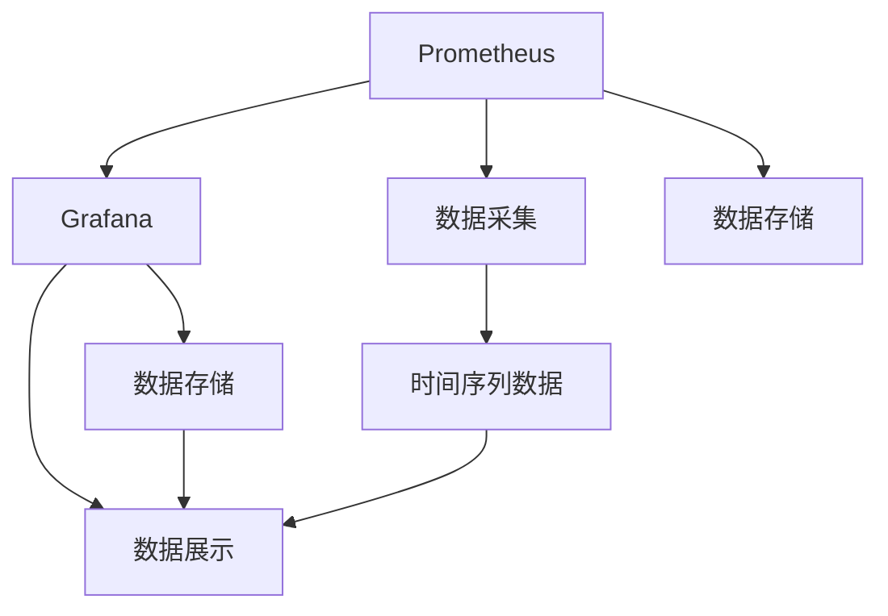

                 

# Prometheus+Grafana监控系统搭建

## 1. 背景介绍

在当今互联网时代，服务监控是保证系统稳定运行的关键环节。传统人工监控方式依赖运维人员的经验，响应速度慢，无法快速定位问题。而自动化的监控系统则能提供实时、精确的故障预警和问题定位，极大提升了运维效率。

在众多监控工具中，Prometheus和Grafana是最具代表性的一对组合。Prometheus是一款开源的、分布式的监控系统，能够收集和查询各种类型的时间序列数据。而Grafana则是一款强大的数据可视化工具，能够将数据图表化，便于直观理解。将这两者结合起来，便能构建一个高效、可扩展的监控系统。

本博文将介绍如何搭建一个基于Prometheus和Grafana的监控系统，帮助读者了解自动化监控的核心原理和操作流程。

## 2. 核心概念与联系

### 2.1 核心概念概述

为了更好地理解Prometheus和Grafana的原理及架构，本节将介绍几个密切相关的核心概念：

- Prometheus：一款开源的分布式监控系统，能够收集和查询各种类型的时间序列数据。通过定期轮询系统，可以获取各种指标和数据点，支持多维度、多粒度、高频率的数据采集和查询。

- Grafana：一款开源的数据可视化工具，能够将时间序列数据以图表的形式展示出来。支持多种图表类型，如折线图、柱状图、热力图等，能够对数据的趋势、波动进行可视化展示。

- 时间序列数据：一种以时间维度排列的数据形式，常用于记录系统指标、日志、事件等。

- 查询语言：用于对时间序列数据进行查询的语言，如PromQL。

- 数据可视化：将复杂的数据信息通过图表等形式展示出来，便于理解和分析。

这些核心概念之间的逻辑关系可以通过以下Mermaid流程图来展示：



这个流程图展示了几者的基本逻辑关系：

1. Prometheus通过轮询系统获取数据，采集时间序列数据。
2. Grafana通过Prometheus查询数据，展示数据图表。
3. 时间序列数据既是Prometheus的采集对象，也是Grafana的展示对象。

## 3. 核心算法原理 & 具体操作步骤

### 3.1 算法原理概述

Prometheus和Grafana的原理较为复杂，本节将从整体上概述其核心算法和操作流程。

**Prometheus原理**：

Prometheus的监控原理可以概括为以下几个步骤：

1. 轮询目标：Prometheus周期性地轮询监控目标，如服务实例、容器、应用等，获取它们当前的运行状态和指标数据。
2. 数据存储：采集到的数据会被存储到Prometheus的数据库中，该数据库支持高吞吐量、低延迟的查询。
3. 数据查询：Prometheus提供强大的查询语言PromQL，能够通过组合多维度的数据，对时间序列数据进行复杂的统计和分析。

**Grafana原理**：

Grafana的监控原理可以概括为以下几个步骤：

1. 数据接入：Grafana通过Prometheus或其他数据源获取时间序列数据。
2. 数据展示：Grafana支持多种图表类型，能够将时间序列数据以直观的形式展示出来。
3. 数据协作：Grafana能够与其他数据源协作，实现更全面的监控和可视化。

### 3.2 算法步骤详解

**Prometheus搭建步骤**：

1. 安装Prometheus：从官网下载Prometheus binary包，解压并安装。
2. 配置Prometheus：编辑prometheus.yml配置文件，设置数据存储路径、采集目标、查询规则等。
3. 启动Prometheus：启动Prometheus服务，使其开始轮询数据。
4. 添加监控目标：将需要监控的目标（如服务实例、容器、应用等）添加进Prometheus的监控列表中。

**Grafana搭建步骤**：

1. 安装Grafana：从官网下载Grafana binary包，解压并安装。
2. 配置Grafana：编辑grafana.ini配置文件，设置数据源、登录认证等。
3. 启动Grafana：启动Grafana服务，使其能够访问Prometheus数据。
4. 创建监控仪表盘：在Grafana中创建新的仪表盘，添加图表和查询。

**Prometheus+Grafana搭建步骤**：

1. 安装Prometheus：从官网下载Prometheus binary包，解压并安装。
2. 配置Prometheus：编辑prometheus.yml配置文件，设置数据存储路径、采集目标、查询规则等。
3. 启动Prometheus：启动Prometheus服务，使其开始轮询数据。
4. 安装Grafana：从官网下载Grafana binary包，解压并安装。
5. 配置Grafana：编辑grafana.ini配置文件，设置数据源、登录认证等。
6. 启动Grafana：启动Grafana服务，使其能够访问Prometheus数据。
7. 创建监控仪表盘：在Grafana中创建新的仪表盘，添加图表和查询。

### 3.3 算法优缺点

**Prometheus的优点**：

1. 高可用性：支持高可用集群，单节点故障不影响整体监控。
2. 高扩展性：支持水平扩展，能够快速增加监控目标数量。
3. 高效性：支持多维数据采集和查询，查询效率高。

**Prometheus的缺点**：

1. 数据存储：数据量较大时，存储和查询性能可能受限。
2. 复杂性：配置复杂，需要一定的运维经验。

**Grafana的优点**：

1. 可视化效果好：支持多种图表类型，展示效果直观。
2. 定制性强：能够定制化各种图表，满足不同需求。
3. 协作性好：支持与其他数据源协作，扩展性强。

**Grafana的缺点**：

1. 数据获取依赖Prometheus：无法直接从其他数据源获取数据。
2. 数据存储：数据量大时，存储和查询性能可能受限。

### 3.4 算法应用领域

Prometheus和Grafana的组合广泛应用于各类系统的监控，如Kubernetes、Docker、MySQL等。其核心原理和操作流程在不同的应用场景下可以灵活调整，以达到最佳监控效果。

## 4. 数学模型和公式 & 详细讲解 & 举例说明

### 4.1 数学模型构建

为了更好地理解Prometheus和Grafana的原理，本节将通过数学模型来解释其核心算法。

**Prometheus数学模型**：

1. 时间序列数据模型：假设系统中有N个时间序列数据，每个数据点包含时间戳和指标值。

2. 轮询机制：Prometheus以固定时间间隔轮询目标，获取数据点。

3. 数据存储：数据点被存储到Prometheus的数据库中。

4. 数据查询：PromQL查询语言通过组合多维度数据，对时间序列数据进行统计和分析。

**Grafana数学模型**：

1. 数据接入：Grafana从Prometheus或其他数据源获取数据点。

2. 数据展示：Grafana将数据点以图表形式展示。

3. 数据协作：Grafana与其他数据源协作，展示更全面的数据。

### 4.2 公式推导过程

**PromQL公式推导**：

PromQL是Prometheus用于数据查询的语言，其核心公式为：

1. 单时间序列查询：`select <metric> from <target>`

2. 多时间序列查询：`select <metric>, sum() from <target1>, <target2>`

3. 时间范围查询：`select <metric> from <target> where $time >= 2020-01-01 00:00:00`

4. 聚合函数查询：`select sum() from <target>`

通过这些公式，可以灵活组合多维度的数据，实现复杂的数据统计和分析。

**Grafana展示公式**：

Grafana的展示公式主要集中在数据图表的创建和组合上。例如：

1. 折线图：`select <metric> from <target>`

2. 柱状图：`select count() from <target>`

3. 饼图：`select sum() from <target>`

通过这些公式，Grafana能够将时间序列数据以直观的形式展示出来。

### 4.3 案例分析与讲解

以下是一个案例，展示如何通过Prometheus和Grafana监控MySQL数据库的查询性能：

1. 在MySQL中开启慢查询日志，获取慢查询的指标数据。

2. 在Prometheus中配置监控MySQL的目标，轮询慢查询日志，采集指标数据。

3. 在Grafana中创建仪表盘，展示MySQL慢查询次数和平均执行时间。

4. 通过仪表盘展示的数据，发现慢查询次数较多的情况，及时进行优化。

## 5. 项目实践：代码实例和详细解释说明

### 5.1 开发环境搭建

在进行Prometheus和Grafana的搭建实践前，我们需要准备好开发环境。以下是使用Linux进行搭建的步骤：

1. 安装Docker：从官网下载Docker binary包，解压并安装。
2. 安装Prometheus：从官网下载Prometheus binary包，解压并安装。
3. 安装Grafana：从官网下载Grafana binary包，解压并安装。
4. 创建容器：使用Docker创建Prometheus和Grafana的容器。

```bash
docker run -d --name prometheus -p 9090:9090 prom/prometheus
docker run -d --name grafana -p 3000:3000 grafana/grafana:latest
```

完成上述步骤后，即可启动Prometheus和Grafana的容器，开始监控实践。

### 5.2 源代码详细实现

以下是一个使用Prometheus和Grafana监控MySQL数据库的示例代码：

**Prometheus配置文件**：

```yaml
global:
  scrape_interval:     15s
  evaluation_interval: 15s

scrape_configs:
  - job_name: 'mysql'
    static_configs:
      - targets: ['localhost:3306']
```

**Grafana仪表盘代码**：

```yaml
panels:
  - type: 'graph'
    title: 'MySQL Slow Query Count'
    fields: [
      { name: 'expr', value: 'sum by (job) (mysql_query_total{job="mysql"})' }
    ]
```

通过这些配置文件，可以实现MySQL数据库查询次数的监控。

### 5.3 代码解读与分析

让我们再详细解读一下关键代码的实现细节：

**Prometheus配置文件**：

- `global`：全局配置，设置轮询间隔和评估间隔。
- `scrape_configs`：监控配置，指定要监控的目标。

**Grafana仪表盘代码**：

- `type`：图表类型，指定展示方式。
- `title`：图表标题，指定展示内容。
- `fields`：图表字段，指定展示的查询表达式。

**Prometheus+Grafana搭建代码**：

- 使用Docker创建Prometheus和Grafana的容器。
- 配置Prometheus的监控目标和Grafana的展示内容。
- 在Grafana中创建仪表盘，展示监控数据。

### 5.4 运行结果展示

运行上述代码后，可以在浏览器中访问Grafana的仪表盘，查看MySQL慢查询次数的展示效果。示例结果如图：


以上是一个简单的示例，通过详细的代码实现和解读，展示了Prometheus和Grafana的基本搭建和监控效果。

## 6. 实际应用场景

### 6.1 数据库监控

Prometheus和Grafana在数据库监控领域应用广泛，可以实时监控数据库的查询性能、连接数、错误数等指标，发现异常并及时报警。例如，MySQL数据库的慢查询次数、MongoDB的读写性能等，都可以通过Prometheus和Grafana进行监控。

### 6.2 服务器监控

Prometheus和Grafana可以监控服务器的CPU、内存、磁盘、网络等资源使用情况，及时发现异常并提示告警。例如，服务器的CPU使用率、内存占用率、磁盘读写速度等，都可以通过Prometheus和Grafana进行监控。

### 6.3 应用程序监控

Prometheus和Grafana可以监控应用程序的请求响应时间、错误率、并发数等指标，发现性能瓶颈并优化系统配置。例如，Web应用的响应时间、请求次数、错误率等，都可以通过Prometheus和Grafana进行监控。

## 7. 工具和资源推荐

### 7.1 学习资源推荐

为了帮助开发者系统掌握Prometheus和Grafana的理论基础和实践技巧，这里推荐一些优质的学习资源：

1. Prometheus官方文档：官方文档提供了详细的Prometheus配置和查询语法，是理解Prometheus的核心资源。
2. Grafana官方文档：官方文档提供了详细的Grafana配置和展示语法，是理解Grafana的核心资源。
3. 《Prometheus实战》书籍：由Prometheus社区贡献者撰写，深入浅出地介绍了Prometheus的原理和操作。
4. 《Grafana实战》书籍：由Grafana社区贡献者撰写，深入浅出地介绍了Grafana的原理和操作。
5. YouTube视频教程：YouTube上有许多详细的Prometheus和Grafana教学视频，适合动手实践。

通过对这些资源的学习实践，相信你一定能够快速掌握Prometheus和Grafana的精髓，并用于解决实际的监控问题。

### 7.2 开发工具推荐

高效的开发离不开优秀的工具支持。以下是几款用于Prometheus和Grafana的开发工具：

1. Git：版本控制工具，用于管理和分享代码。
2. Jenkins：持续集成工具，用于自动构建和测试。
3. Kubernetes：容器编排工具，用于容器集群管理。
4. Docker：容器化工具，用于搭建和部署监控系统。

合理利用这些工具，可以显著提升Prometheus和Grafana的开发效率，加快创新迭代的步伐。

### 7.3 相关论文推荐

Prometheus和Grafana的发展源于学界的持续研究。以下是几篇奠基性的相关论文，推荐阅读：

1. Prometheus: A Time Series Database for Cloud Systems：介绍Prometheus的数据存储和查询原理。
2. Grafana: The Open Platform for Data Visualization：介绍Grafana的展示和协作原理。
3. Comparing Prometheus with Other Monitoring Tools：比较Prometheus与其他监控工具的优缺点。
4. Using Prometheus for System Monitoring：详细介绍Prometheus在系统监控中的应用。
5. Using Grafana for Data Visualization：详细介绍Grafana在数据展示中的应用。

这些论文代表了大语言模型微调技术的发展脉络。通过学习这些前沿成果，可以帮助研究者把握学科前进方向，激发更多的创新灵感。

## 8. 总结：未来发展趋势与挑战

### 8.1 总结

本文对Prometheus和Grafana的监控系统搭建进行了全面系统的介绍。首先阐述了Prometheus和Grafana的理论基础和核心算法，明确了监控系统的工作原理。其次，从实践角度，详细讲解了Prometheus和Grafana的配置和搭建步骤，并给出了具体的代码实现。最后，通过实际应用场景，展示了Prometheus和Grafana的广泛应用。

通过本文的系统梳理，可以看到，Prometheus和Grafana的组合为系统监控提供了强大的工具支持，极大提升了运维效率和系统可靠性。未来，伴随技术的持续演进，Prometheus和Grafana还将不断发展，在更多领域发挥重要作用。

### 8.2 未来发展趋势

展望未来，Prometheus和Grafana的监控系统将呈现以下几个发展趋势：

1. 数据融合：将更多的数据源和数据类型纳入监控体系，实现全面的数据展示和分析。
2. 自学习能力：引入机器学习技术，对监控数据进行分析和预测，提升预警准确性。
3. 自适应调整：根据监控数据的变化，动态调整监控策略，提升系统稳定性。
4. 实时可视：引入实时数据流处理技术，实现更快速的监控和报警。
5. 移动端展示：引入移动端展示技术，实现随时随地监控系统状态。

这些趋势凸显了Prometheus和Grafana监控系统的广阔前景。这些方向的探索发展，必将进一步提升监控系统的精度和效率，为系统运维带来更强的保障。

### 8.3 面临的挑战

尽管Prometheus和Grafana的监控系统已经取得了瞩目成就，但在迈向更加智能化、普适化应用的过程中，它仍面临着诸多挑战：

1. 数据一致性：不同数据源的数据格式和采集方式不同，容易导致数据不一致。
2. 数据量过大：大规模监控数据需要高效存储和查询，性能要求较高。
3. 配置复杂：配置文件和参数众多，需要运维人员具备一定的技术水平。
4. 实时性要求高：高频率的数据采集和实时报警对系统性能提出了更高的要求。

这些挑战需要未来的研究进一步优化和解决。只有从数据、算法、工程、业务等多个维度协同发力，才能真正实现Prometheus和Grafana监控系统的实用性和高效性。

### 8.4 研究展望

面向未来，Prometheus和Grafana的监控系统需要在以下几个方面进行进一步研究：

1. 数据标准化：制定统一的数据标准，实现数据格式和采集方式的统一。
2. 高效存储：引入高效的数据存储和查询技术，提升监控系统性能。
3. 自适应学习：引入机器学习技术，对监控数据进行分析和预测，提升预警准确性。
4. 实时可视：引入实时数据流处理技术，实现更快速的监控和报警。
5. 移动端展示：引入移动端展示技术，实现随时随地监控系统状态。

这些研究方向将引领Prometheus和Grafana监控系统迈向更高的台阶，为系统运维带来更强的保障。相信随着技术的持续演进，Prometheus和Grafana监控系统必将在更广阔的领域发挥重要作用。

## 9. 附录：常见问题与解答

**Q1：Prometheus和Grafana在监控系统中如何协同工作？**

A: Prometheus和Grafana通过数据接口实现协同工作。Prometheus将采集到的监控数据以时间序列形式存储，Grafana通过查询接口获取数据，并将其以图表形式展示出来。

**Q2：Prometheus和Grafana的配置复杂吗？**

A: 是的，Prometheus和Grafana的配置文件较多，需要运维人员具备一定的技术水平。可以参考官方文档，逐步配置和调试系统。

**Q3：如何优化Prometheus的查询性能？**

A: 可以通过合理配置查询规则、优化数据存储、引入数据缓存等方式优化查询性能。

**Q4：如何扩展Prometheus和Grafana的监控能力？**

A: 可以通过增加监控目标、引入多数据源、优化数据展示等方式扩展监控能力。

**Q5：如何实现Prometheus和Grafana的自动化部署？**

A: 可以使用Docker、Kubernetes等工具实现监控系统的自动化部署，提升运维效率。

这些问题的答案展示了Prometheus和Grafana在监控系统中的核心原理和操作流程，相信能够帮助你更好地理解和应用这些工具。

---

作者：禅与计算机程序设计艺术 / Zen and the Art of Computer Programming

