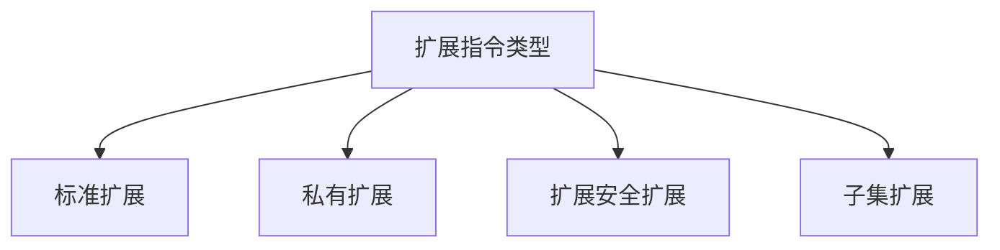

                 

# RISC-V定制扩展：面向特定领域的指令集设计

> 关键词：RISC-V, 定制扩展, 特定领域, 指令集设计, 性能优化, 安全强化, 兼容性保证, 行业定制

## 1. 背景介绍

### 1.1 问题由来
随着AI和物联网设备的普及，对高效、灵活、低功耗的CPU架构的需求日益增长。RISC-V作为一种开源、无专利费的指令集架构，受到了广泛关注。其灵活的指令集设计，使得RISC-V能够根据不同应用场景进行灵活定制扩展。

### 1.2 问题核心关键点
本文档将重点介绍RISC-V指令集的定制扩展过程，涵盖从选择扩展指令到实现、测试、应用的全流程。主要关注以下几点：
- 如何选择特定领域的扩展指令；
- 如何保证扩展指令的性能和安全性；
- 如何确保扩展指令的兼容性；
- 如何在实际应用中优化扩展指令的性能。

### 1.3 问题研究意义
对RISC-V进行定制扩展，可以在不依赖现有架构的前提下，提供定制化的性能优化和特定应用的支持。这对于AI和物联网设备的优化有着重要意义：

1. **优化性能**：根据特定领域的需求，定制优化的扩展指令，能够显著提升设备的处理效率。
2. **提高安全性**：针对关键应用，设计安全的扩展指令，减少潜在的安全漏洞。
3. **增强兼容性**：保证扩展指令的向后兼容性和平台兼容性，确保设备的广泛应用。

## 2. 核心概念与联系

### 2.1 核心概念概述

RISC-V是一种以简洁、灵活著称的开源指令集架构，其设计目标之一就是支持灵活的扩展指令。RISC-V支持四种扩展指令类型：标准扩展（Standard Extension）、私有扩展（Custom Extension）、扩展安全扩展（Secure Extension）、子集扩展（Subset Extension）。

以下将详细探讨RISC-V定制扩展的各个概念及其内在联系：

1. **标准扩展**：RISC-V官方定义的标准扩展指令集，如G、C、Z等，需要遵守RISC-V的规范。
2. **私有扩展**：用户可以自行设计、实现并命名自己的扩展指令集，以适应特定的应用场景。
3. **扩展安全扩展**：在硬件隔离和权限管理上支持的安全扩展指令，确保系统安全。
4. **子集扩展**：从已有的扩展指令中，去除不用的指令，只保留必需的指令，实现轻量级的指令集。

### 2.2 核心概念原理和架构的 Mermaid 流程图



这个流程图展示了RISC-V扩展指令的四种类型，以及它们之间的联系。其中，私有扩展是用户自主设计的核心，而标准扩展和扩展安全扩展则提供了一定的规范和安全性保证。子集扩展则是私有扩展的简化版，更适用于轻量级场景。

## 3. 核心算法原理 & 具体操作步骤
### 3.1 算法原理概述

RISC-V定制扩展的算法原理主要涉及以下几个方面：
- 确定需求：根据特定应用场景，确定需要定制的扩展指令。
- 设计指令：设计符合RISC-V规范的指令格式和行为。
- 实现扩展：将设计好的指令集转化为硬件实现。
- 性能优化：通过微调实现、调度优化等手段提升扩展指令的性能。

### 3.2 算法步骤详解

**Step 1: 确定扩展需求**

首先，根据应用场景确定需要定制的扩展指令。以AI图像处理为例：

1. 图像处理通常需要快速的数据处理和并行计算，因此需要针对这些需求定制扩展指令。
2. 对于多核并行计算，可以通过自定义的并行扩展指令，如vector扩展（VX），来实现。

**Step 2: 设计扩展指令**

设计扩展指令时，需遵循RISC-V指令集规范，确保兼容性。以下以向量扩展指令为例：

1. **指令格式设计**：向量扩展指令需要定义向量的长度、类型等参数。如VWV指令，表示对向量进行操作。
2. **指令行为设计**：定义指令的具体执行逻辑，如VWV指令如何对向量进行操作。

**Step 3: 实现扩展指令**

实现扩展指令时，需要编写对应的汇编代码和微代码，并进行硬件映射。以下以VWV指令为例：

1. **编写汇编代码**：使用RISC-V指令集编写对应的汇编代码。
2. **编写微代码**：将汇编代码转化为硬件层面的微代码。
3. **硬件映射**：将微代码映射到特定的硬件部件，如向量计算单元（Vector Unit）。

**Step 4: 性能优化**

性能优化是定制扩展指令的重要环节，主要通过以下手段实现：

1. **微调实现**：对扩展指令的实现进行优化，如采用更快的逻辑门、减少延迟等。
2. **调度优化**：通过合理调度，使得指令能够高效执行，减少等待和资源浪费。

### 3.3 算法优缺点

**优点**：
- **灵活性**：RISC-V支持用户自定义扩展指令，可以根据特定需求进行灵活定制。
- **性能优化**：针对特定场景，可以设计高效的扩展指令，提升处理效率。
- **成本效益**：开源架构降低了硬件设计和生产成本。

**缺点**：
- **复杂性**：自定义扩展指令的实现和优化较为复杂，需要一定的专业知识。
- **兼容性风险**：扩展指令的实现和优化需要确保兼容性，避免对现有软件和硬件造成影响。
- **安全风险**：自定义扩展指令的安全性需进行严格的设计和测试。

### 3.4 算法应用领域

RISC-V的定制扩展指令可以应用于多种领域，如AI、物联网、边缘计算等。以AI图像处理为例：

1. **AI图像处理**：通过向量扩展指令（VX），加速图像数据的处理和分析。
2. **物联网**：通过自定义扩展指令，优化物联网设备的通信协议和数据处理。
3. **边缘计算**：通过扩展指令，提升边缘计算设备的处理能力和响应速度。

## 4. 数学模型和公式 & 详细讲解 & 举例说明

### 4.1 数学模型构建

以向量扩展指令（VWV）为例，假设指令长度为16位，支持8位、16位、32位三种向量类型。设向量类型为$x$，向量长度为$n$，指令值为$k$，则VWV指令的格式可以表示为：

$$
VWV(x,k)
$$

其中$x$代表向量类型，$k$为指令值。

### 4.2 公式推导过程

以VWV指令的计算过程为例，假设向量长度为$n$，指令值为$k$，则向量操作计算过程为：

$$
\text{向量} = k \times \text{原始向量}
$$

### 4.3 案例分析与讲解

以图像处理中的向量乘法为例，VWV指令的实现可以分为以下几个步骤：

1. **指令解析**：将指令解析为向量类型和指令值。
2. **向量读取**：从内存中读取向量数据。
3. **向量乘法**：根据指令值和向量类型，对向量进行乘法操作。
4. **结果写回**：将结果写回内存。

## 5. 项目实践：代码实例和详细解释说明

### 5.1 开发环境搭建

**Step 1: 安装RISC-V工具链**

1. 下载并安装RISC-V工具链。
2. 配置环境变量，确保RISC-V工具链可在当前环境中使用。

**Step 2: 搭建开发环境**

1. 安装IDE（如Xcode）。
2. 配置编译器，确保支持RISC-V指令集。

### 5.2 源代码详细实现

**Step 1: 编写汇编代码**

```assembly
VWV 0x03, 0x04, 0x10
```

以上汇编代码表示对长度为4个字节的向量进行32位乘法操作，并将结果写入向量类型0x03的向量中。

**Step 2: 编写微代码**

```assembly
VLD W0, W2         // 读取向量
VWV W0, W2, W1      // 向量乘法
VST W1, W0         // 结果写回
```

以上微代码表示对读取的向量进行乘法操作，并将结果写回向量。

**Step 3: 硬件映射**

将上述微代码映射到硬件层面的向量计算单元（Vector Unit），完成向量乘法操作。

### 5.3 代码解读与分析

**Step 1: 指令解析**

使用汇编代码中的指令值解析向量类型和指令值，如$k=0x04$，$x=0x03$。

**Step 2: 向量读取**

从内存中读取向量，并存储在寄存器$W0$中。

**Step 3: 向量乘法**

根据指令值$k=0x04$和向量类型$x=0x03$，对向量进行32位乘法操作。

**Step 4: 结果写回**

将计算结果写入向量类型$x=0x03$的向量中。

### 5.4 运行结果展示

执行上述汇编代码后，将得到向量计算的结果，并写入目标向量类型中。

## 6. 实际应用场景

### 6.1 实际应用案例

1. **AI图像处理**：通过向量扩展指令（VX），加速图像数据的处理和分析。
2. **物联网**：通过自定义扩展指令，优化物联网设备的通信协议和数据处理。
3. **边缘计算**：通过扩展指令，提升边缘计算设备的处理能力和响应速度。

### 6.2 未来应用展望

未来，RISC-V定制扩展指令将在更多领域得到应用，为AI和物联网设备的优化提供新思路：

1. **AI应用**：随着AI技术的发展，对高效、灵活的指令集需求将不断增加。
2. **物联网**：随着物联网设备的普及，对低功耗、高效能的CPU架构需求将持续增长。
3. **边缘计算**：随着5G技术的应用，边缘计算设备的需求将不断增加，定制扩展指令将帮助其提升处理能力和响应速度。

## 7. 工具和资源推荐

### 7.1 学习资源推荐

1. **RISC-V官方文档**：详细介绍了RISC-V指令集规范和扩展指令的设计方法。
2. **VX扩展指令官方文档**：提供了向量扩展指令的详细设计和实现方法。
3. **RISC-V社区**：提供了丰富的学习资源和社区支持，包括论坛、博客、教程等。

### 7.2 开发工具推荐

1. **Xcode**：功能强大的IDE，支持RISC-V编译和调试。
2. **VX扩展指令模拟器**：用于测试和验证向量扩展指令的模拟环境。
3. **RTL编译器**：用于将汇编代码转化为硬件描述语言（HDL）的工具。

### 7.3 相关论文推荐

1. **"RISC-V on the Rise: A Decade of Evolutionary Complexity Management"**：介绍了RISC-V指令集架构的发展历程和复杂性管理。
2. **"Vector Extension (VX) in RISC-V"**：详细介绍了向量扩展指令的设计和实现方法。
3. **"A Case Study of Instruction Customization in RISC-V"**：以图像处理为例，探讨了RISC-V指令集定制化的实现方法。

## 8. 总结：未来发展趋势与挑战

### 8.1 总结

本文对RISC-V的定制扩展指令进行了详细介绍，涵盖从需求确定、指令设计、实现到性能优化的全过程。通过案例分析，展示了RISC-V在特定领域的应用，以及未来发展方向。

### 8.2 未来发展趋势

未来，RISC-V的定制扩展指令将在更多领域得到应用，呈现出以下几个趋势：

1. **灵活性提升**：RISC-V支持更多的自定义扩展指令，满足不同领域的需求。
2. **性能优化**：随着硬件技术的发展，定制扩展指令的性能将进一步提升。
3. **安全性增强**：针对关键应用，将设计更安全的扩展指令，提升系统安全性。
4. **兼容性保证**：通过严格的设计和测试，确保扩展指令的向后兼容性和平台兼容性。

### 8.3 面临的挑战

尽管RISC-V定制扩展指令有诸多优势，但面临以下挑战：

1. **复杂性**：自定义扩展指令的实现和优化较为复杂，需要一定的专业知识。
2. **兼容性风险**：扩展指令的实现和优化需要确保兼容性，避免对现有软件和硬件造成影响。
3. **安全风险**：自定义扩展指令的安全性需进行严格的设计和测试。

### 8.4 研究展望

未来，RISC-V定制扩展指令的研究方向包括：

1. **性能优化**：针对特定领域，设计高效的扩展指令，提升处理效率。
2. **安全性设计**：针对关键应用，设计安全的扩展指令，减少潜在的安全漏洞。
3. **兼容性保障**：通过严格的设计和测试，确保扩展指令的向后兼容性和平台兼容性。
4. **跨领域应用**：将RISC-V扩展指令应用于更多领域，如AI、物联网、边缘计算等。

总之，RISC-V定制扩展指令的研究和应用，将为AI和物联网设备的优化提供新思路，推动RISC-V架构的发展和普及。

## 9. 附录：常见问题与解答

**Q1: 什么是RISC-V？**

A: RISC-V是一种开源的、无专利费的指令集架构，其设计目标是简化和灵活。它支持多种扩展指令，可以用于不同领域和应用场景。

**Q2: RISC-V的扩展指令有哪些类型？**

A: RISC-V支持的扩展指令包括标准扩展、私有扩展、扩展安全扩展和子集扩展。其中，私有扩展是用户自主设计的核心。

**Q3: 如何确保RISC-V扩展指令的兼容性？**

A: 确保RISC-V扩展指令的兼容性，需要遵循RISC-V的规范，进行严格的设计和测试。使用现有的工具链和模拟器进行验证，确保对现有软件和硬件的支持。

**Q4: 如何在RISC-V上进行性能优化？**

A: 在RISC-V上进行性能优化，可以通过微调实现、调度优化等手段提升扩展指令的性能。优化指令的具体实现，采用更快的逻辑门、减少延迟等。

总之，RISC-V的定制扩展指令具有广泛的应用前景，通过合理的定制设计和优化，可以在多个领域提供高效、灵活的解决方案，推动AI和物联网设备的优化和普及。

