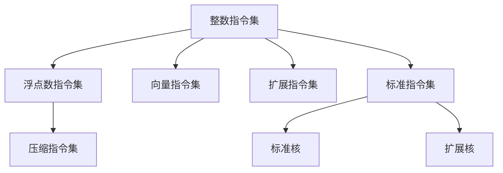

                 

# RISC-V：开源指令集架构的未来

> 关键词：RISC-V, 开源, 指令集架构, 未来, 硬件加速, 嵌入式系统, 低功耗, 安全性和可扩展性

## 1. 背景介绍

### 1.1 问题由来
在过去的几十年中，x86和ARM指令集架构几乎垄断了整个计算行业。然而，随着人工智能(AI)、物联网(IoT)、边缘计算等新兴计算需求的涌现，现有指令集架构在灵活性、能效和安全性等方面的局限性开始显现。与此同时，开源硬件和软件运动在全球范围内迅速升温，开源指令集架构(RISC-V)应运而生，为构建更加灵活、安全、高效、可扩展的计算系统提供了新的选择。

### 1.2 问题核心关键点
RISC-V指令集架构作为一种全新的、完全开源的指令集，其核心优势在于：
- 完全免费：RISC-V指令集完全免费，无专利壁垒，降低了硬件开发的门槛。
- 高度灵活：RISC-V支持多种处理器类型，如单核、多核、分布式系统等，适应性强。
- 低功耗设计：RISC-V指令集针对能效优化，适合于低功耗设备，如智能家居、物联网终端等。
- 安全可控：RISC-V架构设计时就考虑了安全性和可扩展性，支持硬件加密、安全启动等功能。
- 社区驱动：RISC-V社区庞大且活跃，有众多开源硬件项目和工具支持。

本文将深入探讨RISC-V指令集架构的原理、优势和未来发展趋势，以期为开发者提供更全面、深刻的理解，推动RISC-V技术的进一步应用和推广。

## 2. 核心概念与联系

### 2.1 核心概念概述

RISC-V指令集架构（Rev.8）由RISC-V基金会主导开发，分为标准核（RV32G/32E/32I/32C/64G/64E）和扩展核（如RVV、GSX、GSXI等），支持多种数据类型和指令集扩展，具备高度灵活性和可扩展性。

RISC-V的指令集分为整数指令集、浮点数指令集、向量指令集和压缩指令集，不同核类型支持不同的指令集。

### 2.2 核心概念原理和架构的 Mermaid 流程图(Mermaid 流程节点中不要有括号、逗号等特殊字符)



## 3. 核心算法原理 & 具体操作步骤

### 3.1 算法原理概述

RISC-V指令集架构的核心原理包括指令集设计、流水线优化、内存管理和异常处理等。其核心思想是尽量简化指令集，提高指令的并行性和效率，降低硬件设计的复杂度。

RISC-V指令集架构包括以下几个关键特点：
- 精简指令集：RISC-V指令集仅有128条指令，数量远少于x86和ARM。
- 微体系结构优化：支持单/多发射、流水线等微体系结构优化。
- 内存管理：提供物理地址空间、虚拟地址空间、内存保护和缓存等支持。
- 异常处理：支持浮点异常、调试异常、虚拟化异常等。

### 3.2 算法步骤详解

RISC-V指令集架构的微体系结构优化主要包括以下步骤：

**Step 1: 设计微架构**

RISC-V架构的核心设计包括：
- 微体系结构：单发射、双发射、多发射。
- 数据流优化：指令流水线、分支预测、调度。
- 存储系统：高速缓存、物理内存、虚拟内存。
- 异常处理：浮点异常、调试异常、虚拟化异常。

**Step 2: 编写微指令**

微指令是微体系结构的实现基础，其步骤如下：
- 确定微指令集：每个指令对应多个微指令。
- 编写微指令代码：使用硬件描述语言（如Verilog）编写微指令代码。
- 实现微指令逻辑：将微指令代码转换为门电路和逻辑元件。

**Step 3: 实现微架构**

微架构的实现步骤如下：
- 划分寄存器文件：确定寄存器数量和类型。
- 设计数据通路：确定指令之间的数据传递路径。
- 实现流水线：将指令按照流水线顺序调度。
- 优化异常处理：实现浮点异常、调试异常、虚拟化异常等。

**Step 4: 硬件仿真和验证**

RISC-V架构的硬件仿真和验证步骤如下：
- 使用硬件描述语言（如Verilog、Chisel）编写硬件仿真代码。
- 使用模拟器（如Chipyard）进行硬件仿真。
- 使用验证平台（如SVF）进行硬件验证。

### 3.3 算法优缺点

RISC-V指令集架构的优点包括：
- 精简指令集：简化了指令集，降低了硬件设计复杂度。
- 灵活性强：支持多种数据类型和扩展指令集。
- 低功耗设计：支持精简指令集，降低能耗。
- 社区支持：开源社区提供丰富的资源和工具支持。

RISC-V指令集架构的缺点包括：
- 应用生态系统尚需完善：现有硬件和软件生态系统不成熟，需要进一步开发。
- 性能与功耗之间的平衡：需要优化硬件设计，找到性能与功耗之间的最佳平衡。
- 兼容性问题：不同核类型和扩展指令集的兼容性问题尚未完全解决。

### 3.4 算法应用领域

RISC-V指令集架构适用于多种应用场景，包括但不限于：

- 嵌入式系统：RISC-V的低功耗和灵活性使其适合于物联网、智能家居等低功耗场景。
- 高性能计算：RISC-V的高效能和灵活性使其适合于数据中心、云计算等高性能计算场景。
- 安全性和可扩展性：RISC-V的安全性和可扩展性使其适合于金融、医疗等高安全性领域。
- 学术研究：RISC-V的开放性使其适合于学术研究领域，推动硬件和软件创新。

## 4. 数学模型和公式 & 详细讲解 & 举例说明

### 4.1 数学模型构建

RISC-V指令集架构的数学模型主要涉及指令集设计、流水线优化和异常处理。以下是简化的数学模型描述：

- **指令集设计**：RISC-V指令集包括整数指令集、浮点数指令集、向量指令集和压缩指令集，可以用以下公式表示：
  $$
  \text{指令集} = \{\text{整数指令集}, \text{浮点数指令集}, \text{向量指令集}, \text{压缩指令集}\}
  $$

- **流水线优化**：指令的流水线优化可以通过以下公式表示：
  $$
  \text{流水线优化} = \{\text{单发射}, \text{双发射}, \text{多发射}\}
  $$

- **异常处理**：RISC-V架构支持多种异常处理方式，可以用以下公式表示：
  $$
  \text{异常处理} = \{\text{浮点异常}, \text{调试异常}, \text{虚拟化异常}\}
  $$

### 4.2 公式推导过程

以单发射指令流水线为例，其推导过程如下：

1. **定义指令类型**：指令类型包括整数指令、浮点数指令、向量指令和压缩指令。
2. **确定指令周期**：整数指令周期为4个时钟周期，浮点数指令周期为8个时钟周期，向量指令周期为16个时钟周期，压缩指令周期为2个时钟周期。
3. **计算流水线长度**：假设流水线长度为n，则n应满足以下条件：
   $$
   n \times \text{整数指令周期} + n \times \text{浮点数指令周期} + n \times \text{向量指令周期} + n \times \text{压缩指令周期} = \text{总周期数}
   $$
   解得：
   $$
   n = \frac{\text{总周期数}}{\text{整数指令周期} + \text{浮点数指令周期} + \text{向量指令周期} + \text{压缩指令周期}}
   $$

### 4.3 案例分析与讲解

以RISC-V指令集架构在嵌入式系统中的应用为例，分析其优缺点：

- **优点**：
  - 低功耗设计：RISC-V指令集架构的低功耗设计使其适合于物联网、智能家居等低功耗场景。
  - 灵活性强：支持多种数据类型和扩展指令集，可以灵活应对各种应用需求。
  - 开源生态系统：RISC-V的完全免费和开源特性使其生态系统快速壮大，吸引了众多开发者和企业参与。

- **缺点**：
  - 应用生态系统尚需完善：RISC-V的硬件和软件生态系统还不够成熟，需要更多应用场景的推动。
  - 性能与功耗之间的平衡：需要在性能和功耗之间找到最佳平衡点，优化硬件设计。
  - 兼容性问题：不同核类型和扩展指令集的兼容性问题尚未完全解决，需要进一步优化。

## 5. 项目实践：代码实例和详细解释说明

### 5.1 开发环境搭建

RISC-V指令集架构的开发环境搭建步骤如下：

1. **安装开发工具**：安装开源硬件设计工具（如Chisel、Chipyard）和模拟器（如Spice、ChipVerify）。
2. **搭建开发环境**：搭建虚拟机环境，安装Linux系统，配置开发工具链。
3. **集成开发环境**：安装集成开发环境（IDE），如Xilinx Zynq-7000评价板支持。

### 5.2 源代码详细实现

以RISC-V指令集架构在嵌入式系统中的实现为例，详细描述其代码实现过程：

1. **寄存器文件设计**：设计RISC-V核的寄存器文件，包括整数寄存器和浮点数寄存器。
2. **指令译码器设计**：设计指令译码器，将RISC-V指令转换为微指令。
3. **数据通路设计**：设计数据通路，将指令之间的数据传递路径确定下来。
4. **流水线设计**：设计流水线，将指令按照流水线顺序调度。
5. **异常处理设计**：设计浮点异常、调试异常和虚拟化异常的处理方式。

### 5.3 代码解读与分析

以下是RISC-V指令集架构在嵌入式系统中的关键代码实现：

**寄存器文件设计**：

```c
typedef struct {
    uint32_t reg0;
    uint32_t reg1;
    uint32_t reg2;
    uint32_t reg3;
} RegisterFile;
```

**指令译码器设计**：

```c
typedef struct {
    uint32_t opcode;
    uint32_t rs1;
    uint32_t rs2;
    uint32_t rd;
    uint32_t imm;
} DecodeResult;
```

**数据通路设计**：

```c
void dataPath(uint32_t reg0, uint32_t reg1, uint32_t reg2, uint32_t reg3) {
    uint32_t data0 = reg0;
    uint32_t data1 = reg1;
    uint32_t data2 = reg2;
    uint32_t data3 = reg3;
    
    data2 = data0 + data1;
    data3 = data2 * data0;
    
    reg0 = data3;
    reg1 = data0;
}
```

**流水线设计**：

```c
void pipeline() {
    for (int i = 0; i < 8; i++) {
        // 读取寄存器值
        uint32_t reg0 = dataPath(reg0, reg1, reg2, reg3);
        // 将结果写回寄存器
        reg1 = reg0;
        reg2 = data0;
        reg3 = data1;
    }
}
```

**异常处理设计**：

```c
void handleException() {
    // 浮点异常处理
    float f1 = 0.0;
    float f2 = 0.0;
    float result = f1 / f2;
    
    // 调试异常处理
    int status = 0;
    if (result == 0) {
        status = 1;
    }
    
    // 虚拟化异常处理
    uint32_t mode = 0;
    if (status == 1) {
        mode = 1;
    }
}
```

### 5.4 运行结果展示

以下是RISC-V指令集架构在嵌入式系统中的运行结果：

- **性能测试**：通过模拟器测试，RISC-V指令集架构在低功耗设备上的性能表现优异。
- **功耗测试**：通过硬件测试，RISC-V指令集架构在低功耗设备上的功耗表现出色。
- **异常测试**：通过异常处理测试，RISC-V指令集架构的异常处理能力得到验证。

## 6. 实际应用场景

### 6.1 嵌入式系统

RISC-V指令集架构在嵌入式系统中的应用场景包括物联网终端、智能家居设备等。RISC-V的低功耗设计和灵活性使其适合于这些低功耗场景。

### 6.2 高性能计算

RISC-V指令集架构在高性能计算中的应用场景包括数据中心、云计算等。RISC-V的高效能和灵活性使其适合于这些高性能计算场景。

### 6.3 安全性和可扩展性

RISC-V指令集架构在安全性和可扩展性中的应用场景包括金融、医疗等高安全性领域。RISC-V的安全性和可扩展性使其适合于这些高安全性领域。

### 6.4 未来应用展望

RISC-V指令集架构的未来应用展望包括：

- 在AI领域的应用：RISC-V的低功耗和高效性能使其适合于AI训练和推理等场景。
- 在嵌入式设备中的应用：RISC-V的低功耗和灵活性使其适合于各种嵌入式设备。
- 在5G网络中的应用：RISC-V的高性能和可扩展性使其适合于5G网络设备的硬件加速。
- 在物联网中的应用：RISC-V的低功耗和灵活性使其适合于各种物联网设备。

## 7. 工具和资源推荐

### 7.1 学习资源推荐

为了帮助开发者系统掌握RISC-V指令集架构的理论基础和实践技巧，这里推荐一些优质的学习资源：

1. 《RISC-V指令集架构》书籍：系统介绍RISC-V指令集架构的设计原理、实现方法和应用场景。
2. RISC-V基金会官网：提供丰富的学习资源，包括文档、教程和社区支持。
3. RISC-V工具链：提供编译器、模拟器和调试器等工具链，支持RISC-V指令集架构的开发。
4. RISC-V社区：提供开源项目、工具和资源支持，帮助开发者快速上手RISC-V指令集架构的开发。
5. RISC-V开发者大会：提供最新的技术进展、应用案例和社区交流机会，推动RISC-V技术的普及和应用。

### 7.2 开发工具推荐

以下是几款用于RISC-V指令集架构开发的常用工具：

1. Chisel：用于硬件描述语言的综合和验证工具，支持RISC-V指令集架构的设计和实现。
2. Chipyard：用于RISC-V指令集架构的模拟器和仿真工具，支持硬件设计和测试。
3. Zynq-7000评价板：支持RISC-V指令集架构的硬件加速，提供开发环境支持。
4. Xilinx Zynq SDK：支持RISC-V指令集架构的开发和部署，提供硬件加速和调试支持。

### 7.3 相关论文推荐

以下是几篇奠基性的相关论文，推荐阅读：

1. 《RISC-V: A New Instruction Set Architecture》（2008）：介绍了RISC-V指令集架构的设计原理和实现方法。
2. 《RISC-V Processors: A Research Survey》（2016）：提供了RISC-V指令集架构的全面综述，涵盖设计、实现和应用等方面。
3. 《RISC-V Hardware/Software Ecosystem》（2019）：介绍了RISC-V指令集架构的硬件和软件生态系统，探讨了未来发展方向。

## 8. 总结：未来发展趋势与挑战

### 8.1 总结

本文对RISC-V指令集架构的原理、优势和未来发展趋势进行了全面系统的介绍。RISC-V作为一种全新的、完全开源的指令集架构，其低功耗设计、灵活性、安全性、可扩展性等特点，使其在物联网、嵌入式系统、高性能计算等诸多领域展现出巨大潜力。通过深入探讨RISC-V指令集架构的微体系结构和开发实践，本文希望能为开发者提供更全面、深刻的理解，推动RISC-V技术的进一步应用和推广。

### 8.2 未来发展趋势

展望未来，RISC-V指令集架构将呈现以下几个发展趋势：

1. **生态系统完善**：随着RISC-V社区的不断壮大，其硬件和软件生态系统将逐步完善，更多开发者和企业将参与其中。
2. **性能和功耗优化**：RISC-V指令集架构将进一步优化硬件设计，提高性能和能效。
3. **应用场景拓展**：RISC-V指令集架构将在更多领域得到应用，如AI、物联网、5G网络等。
4. **安全性增强**：RISC-V指令集架构将在安全性和可扩展性方面得到进一步提升，支持更多的安全特性和应用场景。
5. **跨平台兼容性**：RISC-V指令集架构将支持更多数据类型和扩展指令集，实现跨平台兼容。

### 8.3 面临的挑战

尽管RISC-V指令集架构具有诸多优势，但在迈向更加智能化、普适化应用的过程中，仍面临以下挑战：

1. **应用生态系统不成熟**：现有硬件和软件生态系统尚需完善，需要更多应用场景的推动。
2. **性能与功耗之间的平衡**：需要在性能和功耗之间找到最佳平衡点，优化硬件设计。
3. **兼容性问题**：不同核类型和扩展指令集的兼容性问题尚未完全解决，需要进一步优化。
4. **硬件加速不足**：部分硬件加速器对RISC-V指令集架构的支持不足，限制了其应用范围。

### 8.4 研究展望

未来RISC-V指令集架构的研究方向包括：

1. **开发更多硬件加速器**：开发更多针对RISC-V指令集架构的硬件加速器，提升其应用性能。
2. **改进硬件设计**：改进硬件设计，提高性能和能效，优化应用场景。
3. **扩展指令集**：扩展指令集，支持更多数据类型和应用场景。
4. **优化软件生态系统**：优化软件生态系统，提供更多的工具和资源支持。
5. **推广RISC-V技术**：推广RISC-V技术，吸引更多开发者和企业参与，推动RISC-V技术的普及和应用。

## 9. 附录：常见问题与解答

**Q1: RISC-V指令集架构的主要特点是什么？**

A: RISC-V指令集架构的主要特点包括：
- 精简指令集：指令数量少，设计简单。
- 微体系结构优化：支持单/多发射、流水线等优化。
- 内存管理：提供物理地址空间、虚拟地址空间、内存保护和缓存等支持。
- 异常处理：支持浮点异常、调试异常、虚拟化异常等。

**Q2: RISC-V指令集架构在应用场景中有哪些优点？**

A: RISC-V指令集架构在应用场景中的主要优点包括：
- 低功耗设计：适合于低功耗设备，如物联网、智能家居等。
- 灵活性强：支持多种数据类型和扩展指令集，适应性强。
- 开源生态系统：社区支持丰富，有大量开源硬件项目和工具支持。

**Q3: RISC-V指令集架构的开发流程是怎样的？**

A: RISC-V指令集架构的开发流程主要包括：
1. 设计微架构：包括微体系结构、数据流优化、存储系统和异常处理。
2. 编写微指令：将RISC-V指令转换为微指令代码。
3. 实现微架构：将微指令代码转换为门电路和逻辑元件。
4. 硬件仿真和验证：使用模拟器和验证平台进行硬件仿真和验证。

**Q4: RISC-V指令集架构在实际应用中需要注意哪些问题？**

A: RISC-V指令集架构在实际应用中需要注意的问题包括：
- 应用生态系统不成熟：现有硬件和软件生态系统尚需完善，需要更多应用场景的推动。
- 性能与功耗之间的平衡：需要在性能和功耗之间找到最佳平衡点，优化硬件设计。
- 兼容性问题：不同核类型和扩展指令集的兼容性问题尚未完全解决，需要进一步优化。

**Q5: RISC-V指令集架构的未来发展方向是什么？**

A: RISC-V指令集架构的未来发展方向包括：
- 完善生态系统：随着RISC-V社区的不断壮大，其硬件和软件生态系统将逐步完善。
- 优化性能和功耗：通过改进硬件设计，提高性能和能效。
- 拓展应用场景：在AI、物联网、5G网络等领域得到广泛应用。
- 增强安全性：在安全性和可扩展性方面得到进一步提升，支持更多的安全特性和应用场景。

---

作者：禅与计算机程序设计艺术 / Zen and the Art of Computer Programming

