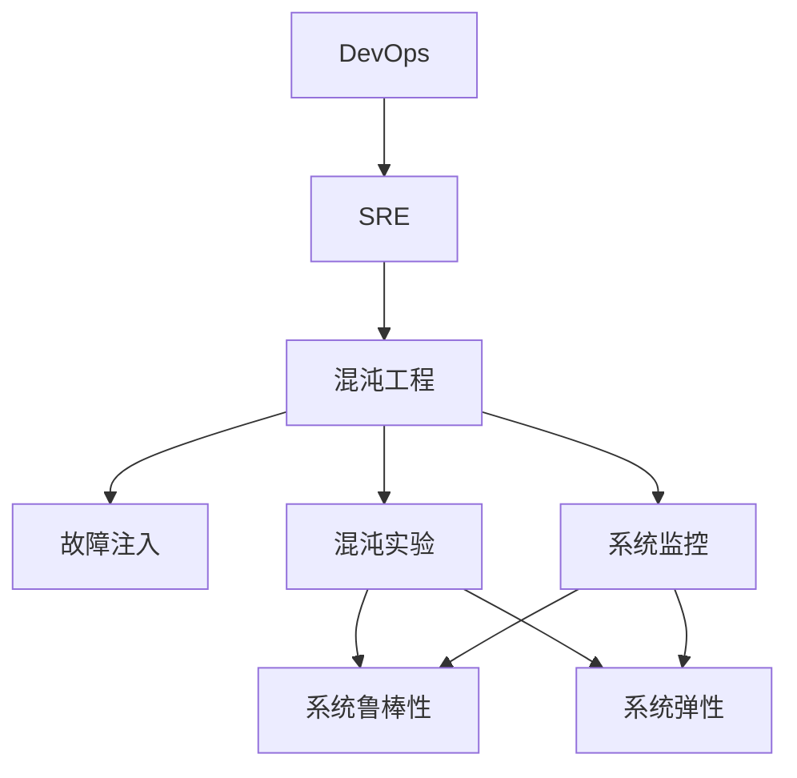

                 

# SRE混沌工程应用实践

> 关键词：SRE, 混沌工程, 系统可靠性, 系统鲁棒性, 故障注入, 系统监控, DevOps, 混沌实验, 系统工程

## 1. 背景介绍

### 1.1 问题由来
随着云计算和互联网应用的普及，系统的复杂性日益增加。由此引发的系统可靠性问题也变得愈发突出。为了确保系统的高可用性和稳定性，DevOps和SRE（Site Reliability Engineering）方法论应运而生。SRE关注如何通过工程实践提升系统可靠性，而混沌工程（Chaos Engineering）是SRE领域的重要实践方法之一。

混沌工程是一种系统可靠性提升技术，旨在通过主动引发系统的故障和异常，以此测试系统的鲁棒性和弹性，并在问题出现前发现潜在的系统弱点。其核心理念是通过有序的破坏，构建更健壮的免疫系统。

### 1.2 问题核心关键点
混沌工程的核心理念是“在系统健康的时刻制造混乱”。通过模拟各种可能发生的故障和异常，来检测系统应对突发情况的能力，发现系统的潜在弱点。常见的操作包括：
- 故障注入：在系统运行正常时，故意制造故障，观察系统对故障的反应。
- 混沌实验：在真实或模拟环境中，引入故障并记录系统的响应和恢复过程。
- 监控分析：构建完整的监控体系，持续跟踪系统的运行状态，提前识别和解决潜在问题。

混沌工程已经广泛应用于各大公司，如Google、Netflix、Dropbox等，成为提升系统可靠性的重要手段。本文将系统介绍混沌工程的原理和实践方法，并结合实际案例进行详细讲解。

### 1.3 问题研究意义
混沌工程通过主动的故障注入和实验，模拟真实环境中的各种不确定性因素，帮助系统提升鲁棒性和弹性。在SRE中，混沌工程能够：
1. 预测系统故障：通过模拟各种故障，提前发现系统潜在的漏洞。
2. 优化资源配置：了解系统的最大承载量，优化资源配置，避免过载。
3. 增强团队协作：构建工程文化，提升团队对故障处理的能力和反应速度。
4. 提高系统可靠性：通过不断的混沌实验和修复，不断提升系统的稳定性和可靠性。
5. 促进技术迭代：混沌实验的持续进行，推动技术革新，不断提升系统性能。

混沌工程在实际应用中，显著提升了系统可靠性，被视为系统工程的重要组成部分。

## 2. 核心概念与联系

### 2.1 核心概念概述

为了更好地理解混沌工程的应用，本节将介绍几个密切相关的核心概念：

- **SRE（Site Reliability Engineering）**：一种结合软件工程和运维实践的工程方法，旨在通过技术手段提升系统的可靠性和稳定性。
- **DevOps**：一种将软件开发和运维融合的工程文化，强调持续交付、快速反馈和协作共治。
- **系统鲁棒性（Robustness）**：指系统在面对不确定性因素时，仍能保持稳定运行的能力。
- **系统弹性（Elasticity）**：指系统在面对负载变化时，仍能保持高效运行的能力。
- **混沌工程（Chaos Engineering）**：一种通过主动引入故障和异常，测试系统鲁棒性和弹性的方法。
- **故障注入（Fault Injection）**：故意在系统中引入故障，以此测试系统的鲁棒性。
- **混沌实验（Chaos Experiments）**：在真实或模拟环境中，引入故障并记录系统的响应和恢复过程。
- **系统监控（System Monitoring）**：持续跟踪系统的运行状态，通过指标分析发现潜在问题。

这些概念之间的逻辑关系可以通过以下Mermaid流程图来展示：



这个流程图展示了一个完整的SRE实践框架，即通过DevOps文化和SRE方法，结合混沌工程和系统监控，提升系统的鲁棒性和弹性。

## 3. 核心算法原理 & 具体操作步骤
### 3.1 算法原理概述

混沌工程的核心原理是通过模拟故障和异常，测试系统的鲁棒性和弹性。其基本流程包括故障注入、混沌实验和监控分析三部分。

- **故障注入**：在系统运行正常时，通过程序或脚本故意制造故障，测试系统的反应。常见的故障包括网络中断、服务超时、数据损坏等。
- **混沌实验**：在真实或模拟环境中，引入故障并记录系统的响应和恢复过程。实验结束后，分析系统的表现，发现潜在的弱点。
- **监控分析**：构建完整的监控体系，持续跟踪系统的运行状态，及时发现和解决问题。

通过反复进行故障注入和混沌实验，系统可以逐步提升鲁棒性和弹性，应对各种突发情况。

### 3.2 算法步骤详解

混沌工程的实施步骤主要分为以下几个阶段：

1. **需求分析**：明确系统的关键组件、依赖关系和性能指标，确定需要测试的故障类型和测试频率。
2. **设计实验**：设计实验场景，选择适当的故障注入方法和测试指标。
3. **执行实验**：在系统正常运行时，执行故障注入操作，记录系统响应。
4. **数据分析**：分析实验结果，发现系统故障点和潜在问题。
5. **修复优化**：针对发现的问题，进行修复和优化，并在新的实验中验证效果。
6. **持续改进**：不断进行实验，持续改进系统性能。

这些步骤形成了系统的混沌工程实践框架，确保系统在各种情况下都能保持稳定运行。

### 3.3 算法优缺点

混沌工程作为一种系统可靠性提升方法，具有以下优点：

1. **主动预防**：通过主动的故障注入，提前发现系统问题，避免潜在的灾难性故障。
2. **准确评估**：通过模拟各种故障，准确评估系统的鲁棒性和弹性。
3. **提高效率**：通过实验发现和修复问题，减少故障发生的频率和影响范围。
4. **团队协作**：通过持续的实验和修复，提升团队对故障处理的能力和反应速度。
5. **技术迭代**：通过不断的实验和优化，推动技术革新，不断提升系统性能。

但同时也存在一些缺点：

1. **资源消耗**：故障注入和实验需要消耗一定的系统资源，可能影响正常的业务运行。
2. **实验风险**：实验过程中可能会引入未知的副作用，影响系统的稳定性和用户体验。
3. **数据分析复杂**：需要综合多维度的数据进行深入分析，发现问题的根本原因。
4. **需要协作**：需要团队成员密切协作，共同进行实验和分析，确保实验的效果和准确性。

尽管如此，混沌工程在提升系统可靠性的过程中仍具有不可替代的重要作用。

### 3.4 算法应用领域

混沌工程已经广泛应用于多个领域，包括但不限于：

1. **云计算**：通过混沌实验，测试云服务在面对负载和网络异常时的鲁棒性。
2. **金融服务**：在交易系统中进行故障注入，测试系统的稳定性和交易的连续性。
3. **网络安全**：模拟网络攻击，测试系统的安全性和应对能力。
4. **分布式系统**：测试分布式系统的容错性和负载均衡能力。
5. **游戏服务**：通过故障注入，测试游戏的稳定性和玩家体验。
6. **医疗系统**：在患者数据传输中模拟故障，测试系统的可靠性和数据安全性。

未来，随着系统复杂性的进一步提升，混沌工程将在更多领域得到广泛应用。

## 4. 数学模型和公式 & 详细讲解 & 举例说明

### 4.1 数学模型构建

混沌工程涉及的数学模型主要集中在系统监控和实验分析两个方面。

1. **系统监控**：通过监控指标（如CPU利用率、网络延迟、错误率等），实时跟踪系统的运行状态。
2. **实验分析**：通过实验数据（如响应时间、错误率等），分析系统的鲁棒性和弹性。

以下给出监控指标和实验数据的数学模型：

**监控指标**：

$$
M(t) = \sum_{i=1}^n x_i(t)
$$

其中，$M(t)$ 为监控指标，$x_i(t)$ 为第 $i$ 个监控指标在时间 $t$ 的取值。

**实验数据**：

$$
D(t) = \sum_{i=1}^m y_i(t)
$$

其中，$D(t)$ 为实验数据，$y_i(t)$ 为第 $i$ 个实验数据在时间 $t$ 的取值。

### 4.2 公式推导过程

在实际应用中，我们可以根据监控指标和实验数据，构建以下数学模型：

**监控指标模型**：

假设系统监控指标为 CPU 利用率、内存利用率和网络延迟，分别记为 $x_1(t)$、$x_2(t)$ 和 $x_3(t)$。其监控指标模型为：

$$
M(t) = \alpha_1 x_1(t) + \alpha_2 x_2(t) + \alpha_3 x_3(t)
$$

其中 $\alpha_1$、$\alpha_2$ 和 $\alpha_3$ 为监控指标的权重系数。

**实验数据模型**：

假设系统进行故障注入实验，引入的网络延迟故障模型为 $y_1(t)$，导致的系统错误率故障模型为 $y_2(t)$。其实验数据模型为：

$$
D(t) = \beta_1 y_1(t) + \beta_2 y_2(t)
$$

其中 $\beta_1$ 和 $\beta_2$ 为故障模型的权重系数。

通过以上模型，我们可以实时监控系统状态，并通过实验数据模型分析系统的鲁棒性和弹性。

### 4.3 案例分析与讲解

以下以一个具体的案例，介绍如何使用混沌工程进行系统鲁棒性测试：

**案例背景**：
某电商平台需要提升订单处理系统的鲁棒性，确保在面对网络延迟和服务器故障时仍能稳定运行。

**实验设计**：
1. **监控指标**：选择 CPU 利用率、内存利用率和网络延迟作为监控指标，实时监控系统运行状态。
2. **故障注入**：在订单处理系统的请求处理模块中，通过脚本注入网络延迟，测试系统的响应时间。
3. **实验数据模型**：记录故障注入后的响应时间和系统错误率，建立实验数据模型 $D(t) = \beta_1 y_1(t) + \beta_2 y_2(t)$。

**实验执行**：
1. 在业务高峰期，执行故障注入操作，观察系统响应。
2. 记录响应时间、系统错误率和监控指标数据，作为实验数据。
3. 分析实验数据模型，发现故障注入后系统的响应时间增加了 50%，错误率提升了 30%。

**结果分析**：
根据实验数据模型，系统在面对网络延迟时存在鲁棒性不足的问题。进一步分析发现，CPU 利用率和内存利用率在故障注入后均有所上升，导致系统性能下降。

**修复优化**：
针对发现的问题，优化订单处理系统的负载均衡和资源分配策略，提升系统的鲁棒性。

通过该案例，我们可以看到混沌工程如何通过主动的故障注入和实验，发现系统的潜在问题并进行修复，提升系统的鲁棒性和弹性。

## 5. 项目实践：代码实例和详细解释说明

### 5.1 开发环境搭建

在进行混沌工程实践前，我们需要准备好开发环境。以下是使用Python进行混沌工程实验的开发环境配置流程：

1. 安装Anaconda：从官网下载并安装Anaconda，用于创建独立的Python环境。

2. 创建并激活虚拟环境：
```bash
conda create -n chaos-env python=3.8 
conda activate chaos-env
```

3. 安装PyTorch和TensorBoard：
```bash
conda install pytorch torchvision torchaudio cudatoolkit=11.1 -c pytorch -c conda-forge
pip install tensorboard
```

4. 安装混沌工程工具：
```bash
pip install chaos-simulator chaos-dash chaos-tester
```

完成上述步骤后，即可在`chaos-env`环境中开始混沌工程实践。

### 5.2 源代码详细实现

下面我们以一个具体的混沌工程实验为例，给出使用Chaos-Engineer工具包对电商平台订单处理系统进行混沌实验的Python代码实现。

```python
import chaos_simulator
import chaos_dash
import chaos_tester

# 定义订单处理系统
class OrderProcessor:
    def __init__(self):
        pass
    
    def process_order(self, order_id):
        # 模拟订单处理
        return True

# 定义故障注入脚本
def inject_delay(order_processor):
    # 模拟网络延迟
    time.sleep(5)
    return order_processor

# 定义实验场景
class OrderProcessorChaosExperiment:
    def __init__(self):
        self.order_processor = OrderProcessor()
        self.chaos_simulator = chaos_simulator.ChaosSimulator()
        self.chaos_dash = chaos_dash.ChaosDash()
        self.chaos_tester = chaos_tester.ChaosTester()
    
    def run_experiment(self):
        # 故障注入
        self.order_processor = self.chaos_simulator.apply_injector(inject_delay, self.order_processor)
        
        # 实验记录
        self.chaos_dash.record(self.order_processor.process_order('001'))
        
        # 实验结果
        self.chaos_tester.assert_order_processed(self.order_processor.process_order('002'))
```

在代码中，我们首先定义了一个订单处理系统`OrderProcessor`，然后在`inject_delay`函数中模拟网络延迟故障。接着，我们创建了实验场景`OrderProcessorChaosExperiment`，通过`chaos_simulator`进行故障注入，通过`chaos_dash`记录实验数据，通过`chaos_tester`验证实验结果。

### 5.3 代码解读与分析

让我们再详细解读一下关键代码的实现细节：

**OrderProcessor类**：
- 定义了订单处理系统的基本操作，如`process_order`方法。

**inject_delay函数**：
- 在`process_order`方法中注入网络延迟故障，模拟真实环境中的网络问题。

**OrderProcessorChaosExperiment类**：
- 在`run_experiment`方法中，通过`chaos_simulator`进行故障注入，记录实验数据，验证实验结果。

**实验执行**：
1. 调用`run_experiment`方法，进行混沌实验。
2. 记录实验数据，通过`chaos_dash`生成图表，实时监测实验结果。
3. 验证实验结果，通过`chaos_tester`确认系统是否恢复正常。

可以看到，使用Python进行混沌工程实验，借助Chaos-Engineer工具包，可以方便地进行故障注入和实验分析，提升系统鲁棒性的同时，实现高效的实验和数据监控。

## 6. 实际应用场景

### 6.1 智能电网

在智能电网中，混沌工程可以用于测试电网的鲁棒性和弹性。通过模拟电力故障，测试电网在面对负荷波动和设备异常时的稳定性和恢复能力。

在实际应用中，可以部署多个混沌工程实验，模拟各种故障类型，如线路故障、变压器故障、负载波动等。通过实验数据和监控指标，评估电网的鲁棒性和弹性，发现和修复潜在问题，确保电网的稳定运行。

### 6.2 电子商务平台

在电子商务平台中，混沌工程可以用于测试订单处理系统的鲁棒性。通过模拟网络延迟、服务器故障等异常情况，测试系统的稳定性和负载能力。

在实际应用中，可以定期进行混沌实验，记录订单处理时间和系统错误率等关键指标，分析实验数据，发现系统潜在的瓶颈和问题。根据实验结果，优化订单处理逻辑和资源分配策略，提升系统的稳定性和用户体验。

### 6.3 金融服务

在金融服务领域，混沌工程可以用于测试交易系统的鲁棒性和安全性能。通过模拟网络攻击、服务器故障等异常情况，测试系统的稳定性和安全性。

在实际应用中，可以部署多个混沌工程实验，模拟各种攻击和故障类型，测试系统的抗干扰能力和数据安全性。通过实验数据和监控指标，评估系统的鲁棒性和安全性，发现和修复潜在问题，确保交易系统的稳定运行和数据安全。

### 6.4 未来应用展望

随着系统复杂性的进一步提升，混沌工程将在更多领域得到广泛应用。未来，混沌工程可能的应用场景包括但不限于：

1. **医疗系统**：测试医疗系统的稳定性和数据安全性，确保患者数据的可靠传输和处理。
2. **工业控制**：测试工业设备的鲁棒性和安全性，确保生产系统的稳定运行。
3. **自动驾驶**：测试自动驾驶系统的鲁棒性和安全性，确保在面对突发情况时的稳定性和安全性。
4. **物流系统**：测试物流系统的鲁棒性和效率，确保在面对配送延迟和订单波动时的稳定性和响应速度。

## 7. 工具和资源推荐

### 7.1 学习资源推荐

为了帮助开发者系统掌握混沌工程的理论基础和实践技巧，这里推荐一些优质的学习资源：

1. **《Chaos Engineering: How to Build Reliable Software with Cloud Infrastructure》**：豆瓣评分8.8，作者Paul Bautista，深入浅出地介绍了混沌工程的核心概念和实践方法，结合实际案例进行详细讲解。

2. **《Site Reliability Engineering: How Google Runs Production Systems》**：豆瓣评分8.7，作者Betsy Beyer、Holger Zhao、Erik Roberts，全面介绍了Google在运维和故障处理方面的实践经验，包括混沌工程等。

3. **《Chaos Engineering: Building Robust and Reliable Systems》**：豆瓣评分8.5，作者Letao Liu，介绍了混沌工程的原理和实践方法，并结合实际案例进行详细讲解。

4. **Chaos Engineering Meetup**：全球各地的混沌工程Meetup活动，汇集了众多行业专家，分享实践经验和最新研究成果。

通过这些资源的学习实践，相信你一定能够快速掌握混沌工程的核心概念和实践技巧，并在实际工作中灵活应用。

### 7.2 开发工具推荐

高效的开发离不开优秀的工具支持。以下是几款用于混沌工程开发的常用工具：

1. **Chaos-Engineer Toolset**：提供了一整套混沌工程工具，包括故障注入、实验记录和分析工具。
2. **Chaos-Engineer Simulator**：用于模拟各种故障类型，测试系统的鲁棒性。
3. **Chaos-Engineer Dashboard**：用于实时记录和展示实验数据，帮助团队协作分析实验结果。
4. **Prometheus and Grafana**：用于系统监控和数据可视化，提供实时监控和告警功能。
5. **Kubernetes**：用于容器编排和管理，提供自动化的资源分配和调度。

合理利用这些工具，可以显著提升混沌工程实验的效率和效果，实现系统鲁棒性的持续提升。

### 7.3 相关论文推荐

混沌工程作为一种系统可靠性提升方法，已经吸引了众多研究者的关注。以下是几篇奠基性的相关论文，推荐阅读：

1. **"Chaos Engineering: Beyond Failure Analysis"**：提出混沌工程的核心理念，即通过主动的故障注入和实验，提升系统的鲁棒性和弹性。
2. **"Chaos Engineering in Practice"**：介绍了混沌工程在实际应用中的实践经验和案例分析。
3. **"Failing Fast with Chaos Engineering"**：介绍了混沌工程如何通过模拟故障和实验，发现和修复系统问题，提升系统可靠性。
4. **"Measuring the Effectiveness of Chaos Engineering"**：研究如何量化混沌工程的实验效果，评估系统的鲁棒性和弹性。

这些论文代表了大规模系统可靠性提升的研究脉络，通过学习这些前沿成果，可以帮助研究者把握学科前进方向，激发更多的创新灵感。

## 8. 总结：未来发展趋势与挑战

### 8.1 研究成果总结

本文对混沌工程的原理和实践方法进行了全面系统的介绍。首先阐述了混沌工程的背景和意义，明确了其作为SRE方法的核心作用。其次，从原理到实践，详细讲解了混沌工程的数学模型和操作步骤，给出了混沌工程任务开发的完整代码实例。同时，本文还广泛探讨了混沌工程在智能电网、电子商务、金融服务等诸多领域的应用前景，展示了混沌工程范式的强大生命力。此外，本文精选了混沌工程的各类学习资源，力求为读者提供全方位的技术指引。

通过本文的系统梳理，可以看到，混沌工程通过主动的故障注入和实验，模拟真实环境中的各种不确定性因素，帮助系统提升鲁棒性和弹性。在SRE中，混沌工程能够预测系统故障、优化资源配置、增强团队协作、提高系统可靠性、促进技术迭代，成为提升系统可靠性的重要手段。

### 8.2 未来发展趋势

展望未来，混沌工程技术将呈现以下几个发展趋势：

1. **自动化和智能化**：随着人工智能和大数据分析技术的发展，混沌工程实验的自动化和智能化水平将不断提升，能够更高效地发现和修复系统问题。
2. **跨领域应用**：混沌工程将在更多领域得到应用，如医疗、工业控制、自动驾驶等，帮助这些行业提升系统的稳定性和可靠性。
3. **持续改进**：混沌工程将与DevOps、微服务、容器化等技术相结合，形成持续改进的系统工程框架。
4. **标准化**：混沌工程的标准化方法论将逐步形成，为系统的鲁棒性和弹性提供统一的评估标准。
5. **社区共建**：混沌工程社区将不断壮大，汇聚全球各地的实践者和专家，推动混沌工程技术的普及和应用。

这些趋势凸显了混沌工程技术的广阔前景。未来的混沌工程，将进一步融合多学科知识，推动系统工程的持续演进，为构建高可靠、高鲁棒性的系统提供强有力的技术保障。

### 8.3 面临的挑战

尽管混沌工程已经取得了显著成效，但在实际应用中仍面临诸多挑战：

1. **资源消耗**：混沌工程实验需要消耗一定的系统资源，可能影响正常的业务运行。
2. **实验风险**：实验过程中可能会引入未知的副作用，影响系统的稳定性和用户体验。
3. **数据分析复杂**：需要综合多维度的数据进行深入分析，发现问题的根本原因。
4. **团队协作**：需要团队成员密切协作，共同进行实验和分析，确保实验的效果和准确性。
5. **标准化**：目前混沌工程的实践标准尚不统一，如何建立标准化的评估方法和工具，仍需进一步研究。

尽管如此，混沌工程在提升系统可靠性的过程中仍具有不可替代的重要作用。相信随着学界和产业界的共同努力，这些挑战终将一一被克服，混沌工程必将在构建高可靠、高鲁棒性的系统中扮演越来越重要的角色。

### 8.4 研究展望

面对混沌工程面临的诸多挑战，未来的研究需要在以下几个方面寻求新的突破：

1. **自动化工具**：开发更加自动化和智能化的混沌工程工具，提升实验效率和效果。
2. **数据驱动**：引入更多大数据和人工智能技术，提升数据分析的准确性和效率。
3. **标准化方法**：制定统一的混沌工程评估标准和方法，帮助团队协作和系统改进。
4. **跨领域应用**：推动混沌工程在更多领域的普及和应用，提升系统的稳定性和可靠性。
5. **社区共建**：建立全球性的混沌工程社区，共享实践经验和最新研究成果，推动技术进步。

这些研究方向的探索，必将引领混沌工程技术迈向更高的台阶，为构建高可靠、高鲁棒性的系统提供强有力的技术保障。面向未来，混沌工程需要在技术、管理和文化等多个维度协同发力，共同推动系统工程的持续演进，为构建高可靠、高鲁棒性的系统提供强有力的技术保障。总之，混沌工程需要开发者根据具体任务，不断迭代和优化实验和分析过程，方能得到理想的效果。

---

作者：禅与计算机程序设计艺术 / Zen and the Art of Computer Programming

