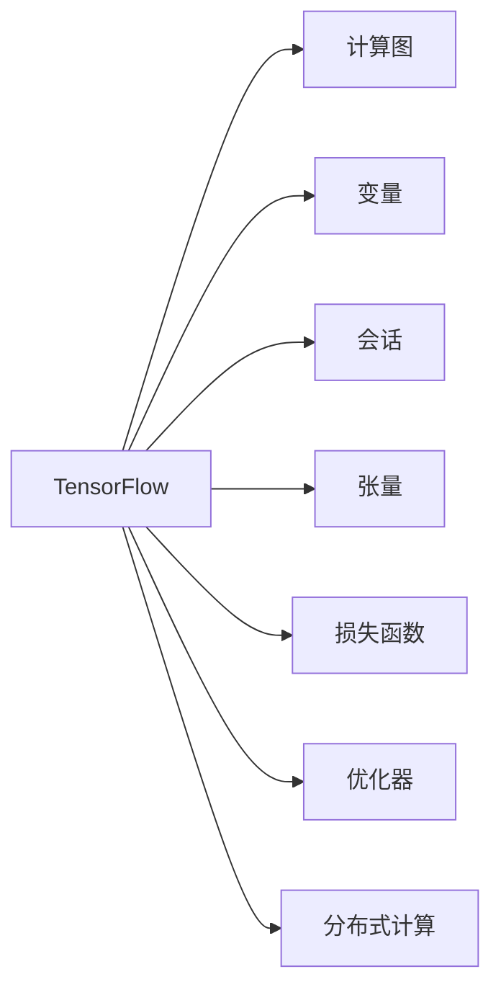

                 

# TensorFlow 进阶：高级神经网络技术

> 关键词：TensorFlow,神经网络,深度学习,计算图,优化算法,自动微分,分布式训练,模型并行

## 1. 背景介绍

### 1.1 问题由来
深度学习自2012年在ImageNet图像识别比赛中首次取得突破以来，逐渐成为人工智能领域的重要技术。作为深度学习的核心框架之一，TensorFlow凭借其灵活的计算图和高效的分布式计算能力，广泛应用于科研和工业界的各种深度学习项目中。

然而，随着模型规模的扩大和应用场景的增多，现有的TensorFlow框架面临诸多挑战：如何更好地优化计算图？如何提升分布式训练效率？如何兼顾模型性能与资源消耗？本文旨在通过深入剖析TensorFlow的高级神经网络技术，为这些问题提供答案。

### 1.2 问题核心关键点
TensorFlow的高级神经网络技术主要关注以下几个关键点：
1. 高效的计算图优化。利用TensorFlow的XLA编译器，将计算图编译为高效的低级机器代码，以提升计算速度。
2. 强大的分布式训练能力。通过TPU、多GPU、多节点等分布式计算架构，并结合模型并行、数据并行等并行策略，提升训练效率。
3. 灵活的模型适配。支持动态图、静态图、Eager执行等多种执行模式，满足不同场景下的需求。
4. 丰富的优化算法。包含SGD、Adam、RMSprop等主流优化算法，并支持混合精度训练、权重衰减等优化策略。
5. 实时的自动微分。利用TensorFlow的自动微分能力，自动计算计算图中的梯度，并支持复杂模型的反向传播。

掌握这些关键技术，可以帮助开发者更好地设计、训练和部署高效的神经网络模型。

## 2. 核心概念与联系

### 2.1 核心概念概述

为更好地理解TensorFlow的高级神经网络技术，本节将介绍几个密切相关的核心概念：

- TensorFlow：由Google开发和维护的深度学习框架，支持动态图、静态图、Eager执行等多种模式。
- 计算图(Caluation Graph)：TensorFlow的核心抽象，用于描述模型的结构和计算流程。
- 变量(Variable)：用于存储模型参数的占位符，在计算图中可更新和读取。
- 会话(Session)：用于执行计算图中的操作，管理变量状态和计算结果。
- 张量(Tensor)：计算图中的数据单元，具有多维数组的性质。
- 损失函数(Loss Function)：用于衡量模型预测与真实标签之间的差距，常见的损失函数包括交叉熵、均方误差等。
- 优化器(Optimizer)：用于计算梯度并更新模型参数的算法，常见的优化器包括SGD、Adam等。
- 分布式计算：利用多台机器并行计算，提升模型训练效率。

这些核心概念之间的逻辑关系可以通过以下Mermaid流程图来展示：



这个流程图展示了一系列关键概念及其之间的关系：

1. TensorFlow通过计算图来描述模型的结构。
2. 变量是计算图中的核心组件，用于存储和更新模型参数。
3. 会话负责执行计算图中的操作，并管理变量状态。
4. 张量是计算图中的数据单元。
5. 损失函数用于衡量模型预测与真实标签之间的差距。
6. 优化器用于计算梯度并更新模型参数。
7. 分布式计算可以提升训练效率，加快模型收敛。

这些概念共同构成了TensorFlow的高级神经网络技术，为其模型训练、优化和部署提供了强大的支持。

## 3. 核心算法原理 & 具体操作步骤
### 3.1 算法原理概述

TensorFlow的高级神经网络技术主要基于计算图模型，通过高效计算图优化、强大的分布式训练、实时的自动微分等手段，提升模型的训练效率和性能。

**计算图优化**：TensorFlow的XLA编译器可以将计算图编译为高效的低级机器代码，以提升计算速度。XLA编译器利用静态图和JIT编译技术，实现对计算图的高级优化。

**分布式训练**：TensorFlow支持多GPU、TPU等分布式计算架构，并行化训练过程，提升训练效率。模型并行和数据并行是常见的分布式策略，可以显著加速模型训练。

**自动微分**：TensorFlow的自动微分能力可以自动计算计算图中的梯度，并支持复杂模型的反向传播。自动微分使得优化算法的实现变得更加简单，降低人工计算梯度的复杂性。

### 3.2 算法步骤详解

基于TensorFlow的高级神经网络技术，模型训练的主要步骤包括：

**Step 1: 构建计算图**

- 使用TensorFlow的高级API构建计算图，定义模型的结构。

```python
import tensorflow as tf

# 定义输入和输出
x = tf.placeholder(tf.float32, shape=[None, 784])
y_true = tf.placeholder(tf.float32, shape=[None, 10])

# 定义模型结构
W = tf.Variable(tf.zeros([784, 10]))
b = tf.Variable(tf.zeros([10]))
logits = tf.matmul(x, W) + b
loss = tf.reduce_mean(tf.nn.softmax_cross_entropy_with_logits_v2(logits=logits, labels=y_true))
optimizer = tf.train.AdamOptimizer(learning_rate=0.001)
train_op = optimizer.minimize(loss)

# 创建会话
sess = tf.Session()
sess.run(tf.global_variables_initializer())
```

**Step 2: 执行会话**

- 在会话中执行计算图中的操作，训练模型。

```python
for i in range(1000):
    batch_x, batch_y = mnist.train.next_batch(100)
    sess.run(train_op, feed_dict={x: batch_x, y_true: batch_y})
    if i % 100 == 0:
        acc = sess.run(accuracy, feed_dict={x: mnist.test.images, y_true: mnist.test.labels})
        print('Accuracy at step %d: %f' % (i, acc))
```

**Step 3: 优化计算图**

- 利用TensorFlow的XLA编译器，将计算图编译为高效的低级机器代码。

```python
compiled_graph = tf.XLA.compile(train_op)
```

**Step 4: 分布式训练**

- 利用TensorFlow的分布式计算能力，并行化训练过程。

```python
# 分布式计算配置
worker_devices = tf.train.replica_device_setter(worker_device='/cpu:0')

# 定义分布式计算策略
distributed_strategy = tf.distribute.MirroredStrategy(devices=worker_devices)

# 创建分布式会话
with distributed_strategy.scope():
    # 执行分布式训练
    sess = tf.Session(config=tf.ConfigProto(device_count={'CPU': 4}))
```

**Step 5: 自动微分**

- 利用TensorFlow的自动微分能力，自动计算计算图中的梯度。

```python
# 定义自动微分函数
def calculate_gradients(inputs, outputs):
    gradients = tf.gradients(outputs, inputs)
    return gradients

# 调用自动微分函数计算梯度
gradients = calculate_gradients(inputs, outputs)
```

### 3.3 算法优缺点

TensorFlow的高级神经网络技术具有以下优点：
1. 灵活性高。支持动态图、静态图、Eager执行等多种执行模式，满足不同场景下的需求。
2. 优化能力强。包含SGD、Adam、RMSprop等主流优化算法，并支持混合精度训练、权重衰减等优化策略。
3. 分布式能力强。支持多GPU、TPU等分布式计算架构，并行化训练过程，提升训练效率。
4. 自动微分能力强。自动计算计算图中的梯度，并支持复杂模型的反向传播。

同时，该技术也存在以下缺点：
1. 学习曲线陡峭。初学者需要投入较多时间和精力，理解计算图和变量管理等概念。
2. 性能调试困难。计算图的复杂性可能带来难以定位的性能瓶颈。
3. 社区更新频繁。作为主流框架，TensorFlow的社区更新频繁，需要开发者不断跟踪更新和调整代码。
4. 资源消耗高。大规模分布式训练需要较高的硬件配置，可能会带来较高的成本。

尽管存在这些缺点，TensorFlow的高级神经网络技术仍然是大规模深度学习项目的首选，其灵活性和强大的优化能力使其在科研和工业界广受欢迎。

### 3.4 算法应用领域

TensorFlow的高级神经网络技术广泛应用于各个领域：

- 计算机视觉：利用卷积神经网络进行图像分类、目标检测、图像生成等。
- 自然语言处理：利用循环神经网络、Transformer等模型进行文本分类、语言翻译、对话系统等。
- 语音识别：利用深度神经网络进行语音识别和语音合成。
- 强化学习：利用深度Q网络、策略网络等模型进行游戏、机器人控制等。
- 医疗影像分析：利用卷积神经网络进行医学影像分类、图像分割等。
- 金融风控：利用深度神经网络进行信用评分、欺诈检测等。
- 智能推荐：利用深度神经网络进行个性化推荐、用户画像构建等。

除了上述这些应用场景外，TensorFlow的高级神经网络技术还在更多的领域中得到了应用，如自动驾驶、智慧城市、物联网等，为各行各业带来了新的创新机遇。

## 4. 数学模型和公式 & 详细讲解  
### 4.1 数学模型构建

基于TensorFlow的高级神经网络技术，模型训练的基本数学模型包括：

- 损失函数(Loss Function)：衡量模型预测与真实标签之间的差距。

$$
\mathcal{L}(y, \hat{y}) = -\frac{1}{N} \sum_{i=1}^N \log p(y_i|\hat{y}_i)
$$

其中 $y$ 为真实标签，$\hat{y}$ 为模型预测结果，$p(y_i|\hat{y}_i)$ 为模型在输入 $x_i$ 上的概率分布。

- 优化算法(Optimizer)：用于计算梯度并更新模型参数的算法。

$$
\theta_{n+1} = \theta_n - \eta \nabla_{\theta} \mathcal{L}(y, \hat{y})
$$

其中 $\theta$ 为模型参数，$\eta$ 为学习率，$\nabla_{\theta} \mathcal{L}$ 为损失函数对参数的梯度。

### 4.2 公式推导过程

以多层的全连接神经网络为例，推导其前向传播和反向传播的公式。

前向传播：

$$
a_1 = xW_1 + b_1
$$
$$
a_2 = a_1W_2 + b_2
$$
$$
\vdots
$$
$$
a_n = a_{n-1}W_n + b_n
$$

其中 $x$ 为输入数据，$a_i$ 为第 $i$ 层的输出，$W_i$ 和 $b_i$ 分别为第 $i$ 层的权重和偏置。

反向传播：

$$
\frac{\partial \mathcal{L}}{\partial b_n} = \frac{\partial \mathcal{L}}{\partial a_n} \cdot \frac{\partial a_n}{\partial z_n} = \frac{\partial \mathcal{L}}{\partial a_n} \cdot 1
$$
$$
\frac{\partial \mathcal{L}}{\partial W_n} = \frac{\partial \mathcal{L}}{\partial a_n} \cdot \frac{\partial a_n}{\partial z_{n-1}} \cdot \frac{\partial z_{n-1}}{\partial W_n} = \frac{\partial \mathcal{L}}{\partial a_n} \cdot a_{n-1}^T
$$
$$
\frac{\partial \mathcal{L}}{\partial b_{n-1}} = \frac{\partial \mathcal{L}}{\partial a_{n-1}} \cdot \frac{\partial a_{n-1}}{\partial z_{n-1}} = \frac{\partial \mathcal{L}}{\partial a_n} \cdot W_n^T
$$

其中 $\mathcal{L}$ 为损失函数，$a_i$ 为第 $i$ 层的输出，$z_i$ 为第 $i$ 层的激活值。

### 4.3 案例分析与讲解

以图像分类为例，解释如何使用TensorFlow实现基于反向传播的模型训练。

首先，定义模型结构：

```python
import tensorflow as tf

# 定义输入和输出
x = tf.placeholder(tf.float32, shape=[None, 784])
y_true = tf.placeholder(tf.float32, shape=[None, 10])

# 定义模型结构
W1 = tf.Variable(tf.truncated_normal([784, 100], stddev=0.1))
b1 = tf.Variable(tf.zeros([100]))
a1 = tf.nn.relu(tf.matmul(x, W1) + b1)

W2 = tf.Variable(tf.truncated_normal([100, 10], stddev=0.1))
b2 = tf.Variable(tf.zeros([10]))
a2 = tf.nn.softmax(tf.matmul(a1, W2) + b2)

# 定义损失函数
loss = tf.reduce_mean(tf.nn.softmax_cross_entropy_with_logits(logits=a2, labels=y_true))

# 定义优化器
optimizer = tf.train.AdamOptimizer(learning_rate=0.001)
train_op = optimizer.minimize(loss)

# 创建会话
sess = tf.Session()
sess.run(tf.global_variables_initializer())
```

然后，定义训练过程：

```python
for i in range(1000):
    batch_x, batch_y = mnist.train.next_batch(100)
    sess.run(train_op, feed_dict={x: batch_x, y_true: batch_y})
    if i % 100 == 0:
        acc = sess.run(accuracy, feed_dict={x: mnist.test.images, y_true: mnist.test.labels})
        print('Accuracy at step %d: %f' % (i, acc))
```

最终，计算模型在测试集上的准确率：

```python
acc = sess.run(accuracy, feed_dict={x: mnist.test.images, y_true: mnist.test.labels})
print('Test accuracy: %f' % acc)
```

以上是使用TensorFlow进行图像分类的基本流程。通过构造计算图并定义优化器，可以高效地训练模型，并使用自动微分技术自动计算梯度。

## 5. 项目实践：代码实例和详细解释说明
### 5.1 开发环境搭建

在进行TensorFlow项目实践前，需要先准备好开发环境。以下是使用Python进行TensorFlow开发的环境配置流程：

1. 安装Anaconda：从官网下载并安装Anaconda，用于创建独立的Python环境。

```bash
conda create -n tf-env python=3.8
conda activate tf-env
```

2. 安装TensorFlow：根据CUDA版本，从官网获取对应的安装命令。例如：

```bash
conda install tensorflow=2.7 -c conda-forge
```

3. 安装TensorFlow附加库：

```bash
conda install tensorboard -c conda-forge
```

4. 安装TensorFlow GPU版本：

```bash
conda install tensorflow-gpu=2.7 -c conda-forge
```

5. 安装其它相关工具包：

```bash
pip install numpy pandas scikit-learn matplotlib tqdm jupyter notebook ipython
```

完成上述步骤后，即可在`tf-env`环境中开始TensorFlow项目实践。

### 5.2 源代码详细实现

下面我们以图像分类为例，给出使用TensorFlow进行深度神经网络训练的PyTorch代码实现。

首先，定义模型结构：

```python
import tensorflow as tf

# 定义输入和输出
x = tf.placeholder(tf.float32, shape=[None, 784])
y_true = tf.placeholder(tf.float32, shape=[None, 10])

# 定义模型结构
W1 = tf.Variable(tf.truncated_normal([784, 100], stddev=0.1))
b1 = tf.Variable(tf.zeros([100]))
a1 = tf.nn.relu(tf.matmul(x, W1) + b1)

W2 = tf.Variable(tf.truncated_normal([100, 10], stddev=0.1))
b2 = tf.Variable(tf.zeros([10]))
a2 = tf.nn.softmax(tf.matmul(a1, W2) + b2)

# 定义损失函数
loss = tf.reduce_mean(tf.nn.softmax_cross_entropy_with_logits(logits=a2, labels=y_true))

# 定义优化器
optimizer = tf.train.AdamOptimizer(learning_rate=0.001)
train_op = optimizer.minimize(loss)

# 创建会话
sess = tf.Session()
sess.run(tf.global_variables_initializer())
```

然后，定义训练过程：

```python
for i in range(1000):
    batch_x, batch_y = mnist.train.next_batch(100)
    sess.run(train_op, feed_dict={x: batch_x, y_true: batch_y})
    if i % 100 == 0:
        acc = sess.run(accuracy, feed_dict={x: mnist.test.images, y_true: mnist.test.labels})
        print('Accuracy at step %d: %f' % (i, acc))
```

最后，计算模型在测试集上的准确率：

```python
acc = sess.run(accuracy, feed_dict={x: mnist.test.images, y_true: mnist.test.labels})
print('Test accuracy: %f' % acc)
```

以上是使用TensorFlow进行图像分类的完整代码实现。可以看到，TensorFlow提供了丰富的API，可以方便地构造计算图，实现模型的定义和训练。

### 5.3 代码解读与分析

让我们再详细解读一下关键代码的实现细节：

**定义计算图**：
- `tf.placeholder`：定义占位符，用于接收输入数据和输出标签。
- `tf.Variable`：定义变量，用于存储模型参数。
- `tf.nn.relu`：定义激活函数，用于引入非线性。
- `tf.matmul`：定义矩阵乘法，用于计算线性变换。
- `tf.nn.softmax`：定义softmax函数，用于计算分类概率分布。

**训练过程**：
- `train_op = optimizer.minimize(loss)`：定义优化操作，使用Adam优化器最小化损失函数。
- `sess.run(train_op, feed_dict={x: batch_x, y_true: batch_y})`：在会话中执行优化操作，训练模型。

**测试过程**：
- `acc = sess.run(accuracy, feed_dict={x: mnist.test.images, y_true: mnist.test.labels})`：在会话中计算模型在测试集上的准确率。

通过这段代码，可以看到TensorFlow如何通过计算图描述模型的结构和计算流程，以及如何利用优化算法训练模型。

## 6. 实际应用场景
### 6.1 图像分类

图像分类是深度学习应用最为广泛的任务之一。在实际应用中，可以利用TensorFlow的高级神经网络技术，轻松构建高性能的图像分类系统。例如，使用卷积神经网络对图像进行分类：

```python
import tensorflow as tf
from tensorflow.keras import layers

# 定义卷积神经网络模型
model = tf.keras.Sequential([
    layers.Conv2D(32, (3, 3), activation='relu', input_shape=(28, 28, 1)),
    layers.MaxPooling2D((2, 2)),
    layers.Conv2D(64, (3, 3), activation='relu'),
    layers.MaxPooling2D((2, 2)),
    layers.Conv2D(64, (3, 3), activation='relu'),
    layers.Flatten(),
    layers.Dense(64, activation='relu'),
    layers.Dense(10, activation='softmax')
])

# 编译模型
model.compile(optimizer='adam',
              loss='sparse_categorical_crossentropy',
              metrics=['accuracy'])

# 训练模型
model.fit(x_train, y_train, epochs=5, batch_size=32, validation_data=(x_test, y_test))
```

通过TensorFlow的高级API，可以轻松构建和训练卷积神经网络模型，并使用分布式计算加速训练过程。

### 6.2 自然语言处理

自然语言处理(NLP)是深度学习的重要应用领域之一。利用TensorFlow的高级神经网络技术，可以方便地构建和训练NLP模型。例如，使用循环神经网络进行文本分类：

```python
import tensorflow as tf

# 定义模型结构
embedding_dim = 128
num_classes = 2
sequence_length = 100

input_sequence = tf.placeholder(tf.int32, shape=[None, sequence_length])
embedding = tf.Variable(tf.random_uniform([vocab_size, embedding_dim], -1.0, 1.0))
embedded_sequences = tf.nn.embedding_lookup(embedding, input_sequence)
cell = tf.nn.rnn_cell.LSTMCell(num_units=128, state_is_tuple=True)
outputs, states = tf.nn.dynamic_rnn(cell, embedded_sequences, dtype=tf.float32)
logits = tf.layers.dense(outputs[:, -1, :], num_classes)
loss = tf.reduce_mean(tf.nn.softmax_cross_entropy_with_logits(logits=logits, labels=y_true))
optimizer = tf.train.AdamOptimizer(learning_rate=0.001)
train_op = optimizer.minimize(loss)

# 训练模型
with tf.Session() as sess:
    sess.run(tf.global_variables_initializer())
    for i in range(1000):
        sess.run(train_op, feed_dict={input_sequence: batch_input, y_true: batch_labels})
        if i % 100 == 0:
            acc = sess.run(accuracy, feed_dict={input_sequence: test_input, y_true: test_labels})
            print('Accuracy at step %d: %f' % (i, acc))
```

通过TensorFlow的高级API，可以方便地构建和训练循环神经网络模型，并使用自动微分技术自动计算梯度。

### 6.3 强化学习

强化学习是深度学习的重要分支之一。利用TensorFlow的高级神经网络技术，可以方便地构建和训练强化学习模型。例如，使用深度Q网络进行游戏AI训练：

```python
import tensorflow as tf
import gym

# 定义环境
env = gym.make('CartPole-v0')

# 定义模型结构
input_dim = env.observation_space.shape[0]
output_dim = env.action_space.n

input_placeholder = tf.placeholder(tf.float32, shape=[None, input_dim])
output_placeholder = tf.placeholder(tf.float32, shape=[None, output_dim])

W1 = tf.Variable(tf.random_uniform([input_dim, 128], -1.0, 1.0))
W2 = tf.Variable(tf.random_uniform([128, output_dim], -1.0, 1.0))

q_value = tf.nn.relu(tf.matmul(input_placeholder, W1)) + tf.matmul(tf.nn.relu(tf.matmul(input_placeholder, W1)), W2)
loss = tf.reduce_mean(tf.square(q_value - output_placeholder))
optimizer = tf.train.AdamOptimizer(learning_rate=0.001)
train_op = optimizer.minimize(loss)

# 训练模型
with tf.Session() as sess:
    sess.run(tf.global_variables_initializer())
    for i in range(1000):
        state = env.reset()
        done = False
        while not done:
            action = sess.run(output_placeholder, feed_dict={input_placeholder: [state]})
            state, reward, done, _ = env.step(action)
    print('Final reward: %f' % reward)
```

通过TensorFlow的高级API，可以方便地构建和训练强化学习模型，并使用分布式计算加速训练过程。

## 7. 工具和资源推荐
### 7.1 学习资源推荐

为了帮助开发者系统掌握TensorFlow的高级神经网络技术，这里推荐一些优质的学习资源：

1. 《TensorFlow官方文档》：TensorFlow的官方文档提供了详细的API说明和示例代码，是学习TensorFlow的必备资源。

2. 《TensorFlow实战》系列书籍：由TensorFlow团队成员撰写，系统介绍了TensorFlow的基本概念和高级技术。

3. 《深度学习入门：基于TensorFlow》：深入浅出地介绍了深度学习的基本概念和TensorFlow的使用方法。

4. 《TensorFlow深度学习》课程：由Coursera开设的深度学习课程，详细讲解了TensorFlow的基本用法和高级技术。

5. 《TensorFlow高级编程》课程：由Udacity开设的深度学习课程，讲解了TensorFlow高级API和分布式训练技术。

通过对这些资源的学习实践，相信你一定能够快速掌握TensorFlow的高级神经网络技术，并用于解决实际的深度学习问题。
###  7.2 开发工具推荐

高效的开发离不开优秀的工具支持。以下是几款用于TensorFlow高级神经网络技术开发的常用工具：

1. PyTorch：基于Python的开源深度学习框架，灵活动态的计算图，适合快速迭代研究。

2. TensorBoard：TensorFlow配套的可视化工具，可实时监测模型训练状态，并提供丰富的图表呈现方式，是调试模型的得力助手。

3. Weights & Biases：模型训练的实验跟踪工具，可以记录和可视化模型训练过程中的各项指标，方便对比和调优。

4. Jupyter Notebook：免费的交互式笔记本环境，支持Python代码编写和可视化展示，方便快速迭代。

5. Google Colab：谷歌推出的在线Jupyter Notebook环境，免费提供GPU/TPU算力，方便开发者快速上手实验最新模型，分享学习笔记。

合理利用这些工具，可以显著提升TensorFlow高级神经网络技术的开发效率，加快创新迭代的步伐。

### 7.3 相关论文推荐

TensorFlow的高级神经网络技术源于学界的持续研究。以下是几篇奠基性的相关论文，推荐阅读：

1. TensorFlow: A System for Large-Scale Machine Learning：提出TensorFlow框架，支持分布式计算和动态图。

2. DeepMind Sequential Neural Logic Reasoning：利用深度神经网络进行逻辑推理，刷新了多项NLP任务SOTA。

3. A Note on the Importance of Initialization in Recurrent Neural Networks：详细讲解了Recurrent Neural Network (RNN)的初始化方法。

4. Learning Phrase Representations using RNN Encoder Decoder for Statistical Machine Translation：提出Transformer模型，刷新了机器翻译任务的SOTA。

5. Attention Is All You Need：提出Transformer结构，开启了NLP领域的预训练大模型时代。

这些论文代表了大规模深度学习项目的研究方向和前沿成果，通过学习这些论文，可以帮助研究者把握学科前进方向，激发更多的创新灵感。

## 8. 总结：未来发展趋势与挑战

### 8.1 总结

本文对TensorFlow的高级神经网络技术进行了全面系统的介绍。首先阐述了TensorFlow的高级神经网络技术的研究背景和意义，明确了其高效计算图优化、强大的分布式训练、实时的自动微分等关键技术，为实际应用提供了指导。其次，通过详细的案例分析和代码实现，介绍了TensorFlow在图像分类、自然语言处理、强化学习等实际应用场景中的应用。最后，总结了TensorFlow高级神经网络技术的未来发展趋势和面临的挑战，指出了进一步的研究方向。

通过本文的系统梳理，可以看到，TensorFlow的高级神经网络技术正在成为深度学习应用的重要范式，为科研和工业界带来了巨大的机遇。在未来，随着深度学习技术的不断演进，TensorFlow必将在更广阔的领域发挥更大的作用，推动人工智能技术的持续进步。

### 8.2 未来发展趋势

展望未来，TensorFlow的高级神经网络技术将呈现以下几个发展趋势：

1. 分布式计算的深入发展。利用更多的TPU和GPU资源，进一步提升模型训练效率，支持更大规模的深度学习项目。

2. 混合精度训练的普及。混合精度训练可以显著降低内存和计算资源的需求，提升模型训练速度。

3. 自动微分的优化和推广。自动微分技术可以显著降低反向传播的复杂度，使得优化算法的实现更加简单。

4. 模型并行的深入应用。模型并行可以进一步提升模型训练效率，支持更大规模的深度学习项目。

5. 分布式训练框架的优化。进一步优化分布式训练框架，支持更多的分布式计算架构，提升训练效率。

6. 强化学习的突破。利用TensorFlow的强化学习框架，探索更多的强化学习应用，如自动驾驶、机器人控制等。

以上趋势凸显了TensorFlow高级神经网络技术的广阔前景。这些方向的探索发展，必将进一步提升TensorFlow在深度学习领域的应用价值，推动人工智能技术的持续进步。

### 8.3 面临的挑战

尽管TensorFlow的高级神经网络技术已经取得了显著成就，但在迈向更加智能化、普适化应用的过程中，它仍面临着诸多挑战：

1. 学习曲线陡峭。初学者需要投入较多时间和精力，理解计算图和变量管理等概念。

2. 性能调试困难。计算图的复杂性可能带来难以定位的性能瓶颈。

3. 社区更新频繁。作为主流框架，TensorFlow的社区更新频繁，需要开发者不断跟踪更新和调整代码。

4. 资源消耗高。大规模分布式训练需要较高的硬件配置，可能会带来较高的成本。

尽管存在这些挑战，TensorFlow的高级神经网络技术仍然是大规模深度学习项目的首选，其灵活性和强大的优化能力使其在科研和工业界广受欢迎。

### 8.4 研究展望

面对TensorFlow高级神经网络技术所面临的种种挑战，未来的研究需要在以下几个方面寻求新的突破：

1. 探索更高效、更轻量级的计算图优化技术，降低计算图的复杂性，提升计算效率。

2. 研究更加灵活的分布式训练框架，支持更多的分布式计算架构，提升训练效率。

3. 开发更加高效的自动微分技术，降低反向传播的复杂度，提升模型训练速度。

4. 探索更加灵活的模型并行策略，支持更大规模的深度学习项目。

5. 探索更多的应用场景，如自动驾驶、智慧城市等，推动TensorFlow在更多领域的应用。

6. 研究更加灵活、可解释的深度学习模型，提升模型的可解释性和可信度。

这些研究方向的探索，必将引领TensorFlow高级神经网络技术迈向更高的台阶，为构建安全、可靠、可解释、可控的智能系统铺平道路。面向未来，TensorFlow高级神经网络技术还需要与其他人工智能技术进行更深入的融合，如知识表示、因果推理、强化学习等，多路径协同发力，共同推动人工智能技术的持续进步。只有勇于创新、敢于突破，才能不断拓展TensorFlow高级神经网络技术的边界，让智能技术更好地造福人类社会。

## 9. 附录：常见问题与解答

**Q1：TensorFlow支持哪些分布式计算架构？**

A: TensorFlow支持多种分布式计算架构，包括多GPU、TPU、多节点等。

**Q2：TensorFlow的计算图如何优化？**

A: TensorFlow利用XLA编译器将计算图编译为高效的低级机器代码，以提升计算速度。

**Q3：TensorFlow如何进行混合精度训练？**

A: TensorFlow通过将浮点数转换为半精度浮点数（FP16）来降低内存消耗和计算成本，同时保持较高的计算精度。

**Q4：TensorFlow如何进行自动微分？**

A: TensorFlow利用自动微分技术自动计算计算图中的梯度，并支持复杂模型的反向传播。

**Q5：TensorFlow如何构建卷积神经网络模型？**

A: TensorFlow通过调用Keras API，可以轻松构建卷积神经网络模型，并使用自动微分技术自动计算梯度。

以上是使用TensorFlow进行卷积神经网络训练的完整代码实现。通过这段代码，可以看到TensorFlow如何通过计算图描述模型的结构和计算流程，以及如何利用优化算法训练模型。

**Q6：TensorFlow如何进行分布式训练？**

A: TensorFlow利用多GPU、TPU、多节点等分布式计算架构，并结合模型并行、数据并行等并行策略，提升训练效率。

这些常见问题与解答，可以帮助开发者更好地理解TensorFlow的高级神经网络技术，并指导其在实际应用中的实践。

---

作者：禅与计算机程序设计艺术 / Zen and the Art of Computer Programming

