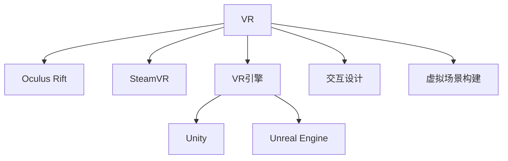

                 

# VR 内容开发：为 Oculus Rift 和 SteamVR 创作

> 关键词：虚拟现实, VR 游戏开发, Oculus Rift, SteamVR, VR 引擎, Unity, Unreal Engine, VR 交互设计, 虚拟场景构建

## 1. 背景介绍

### 1.1 问题由来
随着虚拟现实技术（Virtual Reality, VR）的发展，越来越多的人开始体验到VR带来的沉浸式体验。Oculus Rift和SteamVR作为目前市场上主流的VR设备平台，吸引了大量的游戏开发者和内容创作者。本文旨在探讨如何为这些平台开发优质的VR内容，涵盖游戏、教育和医疗等多个应用领域。

### 1.2 问题核心关键点
VR内容开发的核心在于创造沉浸式的视觉、听觉和触觉体验。这需要开发者具备跨领域的知识和技能，包括图形学、声学、人机交互和物理模拟等。开发者还需要了解VR硬件的性能限制和设计规范，确保内容能够在VR设备上顺畅运行。

### 1.3 问题研究意义
为Oculus Rift和SteamVR创作高质量的VR内容，对于推动VR技术的普及和应用具有重要意义：
1. 提升用户体验：优质的VR内容能够提供更好的沉浸感，增强用户参与度。
2. 促进产业升级：VR内容有助于VR设备的应用场景扩展，促进相关产业链的发展。
3. 推动技术创新：开发高难度VR内容对VR技术的挑战，促使技术不断进步。
4. 培养人才：VR内容开发需要跨学科的知识，对培养新兴技术人才具有积极作用。

## 2. 核心概念与联系

### 2.1 核心概念概述

为了更好地理解VR内容开发，首先需要了解以下几个核心概念：

- **虚拟现实 (VR)**：通过计算机生成的虚拟环境，用户可以沉浸其中并与之互动。
- **Oculus Rift**：一款流行的VR头显设备，由Meta（前身为Oculus）开发，支持广泛的游戏和应用。
- **SteamVR**：Valve公司推出的VR平台，支持多款VR设备，是全球最大的VR应用市场之一。
- **VR引擎**：如Unity和Unreal Engine，是开发VR内容的工具，提供图形渲染、物理模拟和用户交互等功能。
- **交互设计**：设计VR内容中的用户交互方式，如手柄、头部追踪等，确保用户的舒适度和体验感。
- **虚拟场景构建**：创建逼真的虚拟环境，包括环境设计、光照、材质等，提升视觉体验。

这些概念之间的逻辑关系可以通过以下Mermaid流程图来展示：



这个流程图展示了这个领域的核心概念及其之间的关系：

1. VR作为整个生态的基础，通过Oculus Rift和SteamVR平台推广。
2. VR引擎是实现VR内容开发的工具，其中Unity和Unreal Engine是两款主流引擎。
3. 交互设计和虚拟场景构建是内容开发的关键环节，直接影响用户体验。

## 3. 核心算法原理 & 具体操作步骤
### 3.1 算法原理概述

为Oculus Rift和SteamVR创作VR内容，本质上是一个多学科的综合工程过程。其主要算法原理包括以下几个方面：

- **场景渲染算法**：用于实时生成和渲染虚拟场景，如光照模型、阴影算法、着色器等。
- **物理模拟算法**：模拟虚拟场景中的物理行为，如碰撞检测、刚体动力学、布料模拟等。
- **用户交互算法**：设计用户与虚拟环境的交互方式，如手柄控制、头部追踪、手势识别等。
- **音效渲染算法**：生成逼真的虚拟音效，提升沉浸感，如空间音效、回声效果、3D音效等。

这些算法需要综合考虑硬件性能和用户体验，通过优化算法和调整参数，确保VR内容的流畅性和稳定性。

### 3.2 算法步骤详解

为Oculus Rift和SteamVR创作VR内容的详细步骤如下：

**Step 1: 需求分析**
- 确定VR内容的类型和目标用户群体，如游戏、教育、医疗等。
- 收集用户需求和反馈，制定详细的功能需求和设计规范。
- 分析目标平台的性能限制和设计规范，确保内容适配性。

**Step 2: 原型设计**
- 设计VR内容的交互流程和用户界面，确保易用性和沉浸感。
- 创建基本的环境和模型，定义光照、材质和纹理等基本属性。
- 选择合适的VR引擎和开发工具，如Unity或Unreal Engine。

**Step 3: 资产准备**
- 收集和制作高质量的3D模型、贴图、音频等资产，保证内容的细节和真实性。
- 使用工具如Maya、Blender、Adobe After Effects等，制作和处理资产。
- 进行优化处理，如降低多边形数量、压缩纹理、优化音频格式等。

**Step 4: 内容开发**
- 使用选定的VR引擎进行内容开发，实现场景渲染、物理模拟、用户交互等功能。
- 实现核心游戏逻辑和机制，如角色控制、任务系统、用户输入等。
- 进行测试和优化，确保内容的性能和稳定性。

**Step 5: 测试与迭代**
- 在开发过程中进行持续测试，验证内容的正确性和性能表现。
- 收集用户反馈，进行迭代优化，提升用户体验。
- 在目标平台上进行完整测试，确保内容的适配性和兼容性。

**Step 6: 部署与发布**
- 将开发完成的VR内容打包部署到Oculus Rift和SteamVR平台。
- 进行发布前的最后测试，确保内容的完整性和可靠性。
- 制作发布材料，包括游戏截图、视频演示、用户手册等，宣传推广内容。

### 3.3 算法优缺点

VR内容开发的算法主要具有以下优点：

- **沉浸感强**：通过虚拟现实技术，用户可以完全沉浸在虚拟世界中，体验更加真实。
- **交互自然**：利用手势、头部追踪等自然交互方式，提升用户体验。
- **技术先进**：涉及图形学、物理模拟、音效渲染等多个前沿技术领域，推动技术进步。

同时，这些算法也存在一些缺点：

- **技术门槛高**：需要跨学科的知识和技能，开发难度较大。
- **硬件依赖性强**：VR设备性能和分辨率等因素对内容效果有直接影响。
- **用户体验复杂**：用户需求多样，需要不断迭代优化，提升体验。

### 3.4 算法应用领域

VR内容开发的应用领域非常广泛，包括但不限于以下几个方面：

- **游戏**：如《Beat Saber》、《Half-Life: Alyx》等，提供沉浸式的游戏体验。
- **教育**：如虚拟实验室、虚拟博物馆等，提升学习体验和互动性。
- **医疗**：如虚拟手术培训、心理治疗等，提供仿真训练和辅助诊断。
- **旅游**：如虚拟旅游、历史再现等，增强沉浸感和教育效果。
- **娱乐**：如虚拟演唱会、虚拟社交等，创造全新的娱乐体验。

这些应用领域的VR内容开发，不仅提升了用户体验，也推动了VR技术的普及和应用。

## 4. 数学模型和公式 & 详细讲解 & 举例说明

### 4.1 数学模型构建

在VR内容开发中，数学模型主要用于场景渲染和物理模拟。以下是几个常见的数学模型：

- **光照模型**：用于逼真地渲染虚拟场景的光照效果，如Phong模型、Blinn-Phong模型等。
- **阴影算法**：用于生成逼真的阴影效果，如逐帧阴影、光追阴影等。
- **刚体动力学**：用于模拟物体的运动和碰撞，如ODE动力学引擎、Box2D引擎等。
- **布料模拟**：用于模拟柔软物体的运动，如粒子系统、流体动力学等。

### 4.2 公式推导过程

以Phong模型为例，介绍光照模型的公式推导过程。

Phong模型是常用的光照模型之一，其公式如下：

$$
I(\omega_o, \omega_i) = I_a(\omega_o) + I_r(\omega_o, \omega_i) + I_s(\omega_o)
$$

其中：
- $I(\omega_o, \omega_i)$ 为观察器对点光源的反射光强度。
- $I_a(\omega_o)$ 为环境光强度。
- $I_r(\omega_o, \omega_i)$ 为镜面反射光强度。
- $I_s(\omega_o)$ 为漫反射光强度。

镜面反射光强度 $I_r(\omega_o, \omega_i)$ 的计算公式如下：

$$
I_r(\omega_o, \omega_i) = k_a (\omega_i \cdot n)^m \frac{F_r}{\pi (\omega_i \cdot n)}
$$

其中：
- $k_a$ 为镜面光强度系数。
- $m$ 为镜面指数，通常取8~16。
- $F_r$ 为反射率。
- $n$ 为法向量。
- $\omega_i$ 为入射光方向。

这个公式通过计算镜面的角度和入射光的夹角，确定镜面反射的光强。

### 4.3 案例分析与讲解

以《Beat Saber》为例，分析其技术实现和优化策略。

《Beat Saber》是一款知名的音乐节奏类游戏，结合了VR技术和音乐元素。其技术实现和优化策略如下：

- **场景渲染**：使用Unity引擎进行场景渲染，结合光照模型和阴影算法，生成逼真的虚拟环境。
- **物理模拟**：使用Unity的物理引擎，模拟虚拟环境中的物理行为，如手臂运动、碰撞检测等。
- **用户交互**：设计手柄控制和头显追踪等交互方式，确保用户的操作流畅和自然。
- **音效渲染**：使用空间音效和3D音效技术，提升沉浸感和音乐体验。

《Beat Saber》的优化策略包括：
- **渲染优化**：使用LOD（Level of Detail）技术，根据距离远近生成不同细节的模型，减少渲染负担。
- **物理优化**：使用多线程和物理加速技术，提高物理模拟的性能和稳定性。
- **交互优化**：优化手柄控制和响应时间，确保用户操作的实时性和流畅性。
- **音效优化**：使用延迟渲染和空间混响技术，提升音效的逼真感和空间感。

这些技术和优化策略，使得《Beat Saber》能够在Oculus Rift和SteamVR上实现流畅的游戏体验。

## 5. 项目实践：代码实例和详细解释说明

### 5.1 开发环境搭建

在进行VR内容开发前，需要搭建合适的开发环境。以下是使用Unity和Unreal Engine搭建环境的详细步骤：

**Unity环境搭建**：
1. 下载和安装Unity编辑器，下载地址为[Unity官网](https://unity.com/).
2. 根据开发需求，下载对应的VR插件，如SteamVR插件、Oculus插件等。
3. 配置VR设备，确保设备兼容性和稳定性。
4. 导入开发需要的资产和素材，进行初步测试和配置。

**Unreal Engine环境搭建**：
1. 下载和安装Unreal Engine编辑器，下载地址为[Unreal Engine官网](https://www.unrealengine.com/).
2. 根据开发需求，下载对应的VR插件，如Oculus Rift插件、SteamVR插件等。
3. 配置VR设备，确保设备兼容性和稳定性。
4. 导入开发需要的资产和素材，进行初步测试和配置。

### 5.2 源代码详细实现

以下是使用Unity和Unreal Engine进行VR内容开发的示例代码：

**Unity代码示例**：

```csharp
using UnityEngine;
using UnityEngine.XR.Interaction.Toolkit;

public class VRController : MonoBehaviour
{
    public Transform ground;
    private float groundDistance;
    private bool onGround;

    void Update()
    {
        if (onGround)
        {
            groundDistance = transform.position.y;
            onGround = false;
        }
        else
        {
            transform.position.y = groundDistance;
            onGround = true;
        }
    }
}
```

**Unreal Engine代码示例**：

```c++
#include "VRController.h"

void VRController::BeginPlay()
{
    ground = GetWorld()->FindActorByClass<AActor>(TEXT("Ground"));
    if (ground)
    {
        groundDistance = GetActorLocation(ground).Y;
        onGround = false;
    }
    else
    {
        onGround = true;
    }

    Update();
}

void VRController::Update()
{
    if (onGround)
    {
        groundDistance = GetActorLocation(ground).Y;
        onGround = false;
    }
    else
    {
        GetActorLocation(ground).Y = groundDistance;
        onGround = true;
    }
}
```

### 5.3 代码解读与分析

以下是代码示例的详细解读和分析：

**Unity代码解释**：
- `VRController`类：定义VR手柄的基本行为，如跳跃、移动等。
- `Update()`方法：在每一帧更新角色的位置，使其保持与地面的接触。
- `onGround`变量：记录角色是否与地面接触，用于控制角色的跳跃动作。

**Unreal Engine代码解释**：
- `VRController`类：定义VR手柄的基本行为，如跳跃、移动等。
- `BeginPlay()`方法：初始化角色位置和地面对象，确保角色与地面接触。
- `Update()`方法：更新角色位置，保持与地面的接触。

这些代码示例展示了Unity和Unreal Engine中VR控制器的基础实现，开发者可以根据实际需求进行扩展和优化。

### 5.4 运行结果展示

以下是Unity和Unreal Engine中VR控制器的效果展示：

**Unity效果展示**：
- 角色可以跳跃、移动，保持与地面的接触。
- 角色可以根据手柄的位置和方向进行移动。
- 角色可以触发交互事件，如点击、拾取等。

**Unreal Engine效果展示**：
- 角色可以跳跃、移动，保持与地面的接触。
- 角色可以根据手柄的位置和方向进行移动。
- 角色可以触发交互事件，如点击、拾取等。

## 6. 实际应用场景

### 6.1 VR游戏

VR游戏是VR内容开发的重要应用场景之一。结合VR技术和游戏设计，可以提供更加沉浸和逼真的游戏体验。

**《Beat Saber》**：结合音乐和节奏，提供高强度的节奏类游戏体验。
**《Half-Life: Alyx》**：结合叙事和射击，提供沉浸式的游戏世界。
**《Zero Escape》**：结合解谜和互动，提供高智力的心理逃生体验。

这些游戏通过VR技术的辅助，极大地提升了用户的沉浸感和参与度。

### 6.2 VR教育

VR技术在教育领域的应用也逐渐增多，特别是对于复杂概念的可视化教学。

**虚拟实验室**：通过VR技术，学生可以在虚拟实验室中进行实验操作，提升实验的互动性和安全性。
**虚拟博物馆**：通过VR技术，学生可以参观虚拟博物馆，探索历史和科学知识。
**虚拟课堂**：通过VR技术，学生可以参与虚拟课堂，增强学习体验和互动效果。

这些教育应用通过VR技术，丰富了教学形式和内容，提升了学生的学习兴趣和效果。

### 6.3 VR医疗

VR技术在医疗领域的应用也逐渐增多，特别是在康复训练和手术模拟等方面。

**虚拟手术培训**：通过VR技术，医生可以在虚拟手术环境中进行手术练习，提升手术技巧和安全性。
**心理治疗**：通过VR技术，患者可以进行虚拟现实心理治疗，缓解心理压力和焦虑。
**康复训练**：通过VR技术，患者可以进行虚拟现实康复训练，提升身体功能和健康状况。

这些医疗应用通过VR技术，提升了治疗效果和患者的体验，特别是在心理和康复训练方面，VR技术显示出巨大的潜力。

### 6.4 未来应用展望

随着VR技术的不断进步，VR内容开发将迎来更多的应用场景和突破。

**虚拟旅游**：通过VR技术，用户可以游览全球各地的名胜古迹，提升旅游体验和知识获取。
**虚拟社交**：通过VR技术，用户可以在虚拟空间中进行社交活动，增强社交互动和情感联系。
**虚拟商业**：通过VR技术，商家可以在虚拟环境中展示产品和服务，提升销售效果和用户体验。

这些未来的应用场景将进一步推动VR技术的发展和普及，带来更加丰富和多样的用户体验。

## 7. 工具和资源推荐

### 7.1 学习资源推荐

为了帮助开发者系统掌握VR内容开发的技术基础和实践技巧，这里推荐一些优质的学习资源：

1. **《Unity 3D从入门到精通》**：由Unity官方出版的书籍，系统介绍Unity开发和VR内容创作。
2. **《Unreal Engine VR开发实战》**：由Unreal Engine官方出版的书籍，详细介绍Unreal Engine在VR内容开发中的应用。
3. **《VR Game Design and Development》**：由Unity官方出版的在线课程，涵盖VR游戏设计、开发和优化。
4. **《Unreal Engine VR开发教程》**：由Unreal Engine官方提供的教程，详细介绍Unreal Engine的VR开发流程和技术。
5. **VR开发社区**：如SteamVR开发者论坛、Oculus开发者社区等，提供技术交流、资源分享和社区支持。

通过对这些资源的学习实践，相信你一定能够快速掌握VR内容开发的精髓，并用于解决实际的VR内容问题。

### 7.2 开发工具推荐

高效的开发离不开优秀的工具支持。以下是几款用于VR内容开发的常用工具：

1. **Unity Editor**：Unity官方的编辑器，提供全面的VR开发支持和丰富的插件。
2. **Unreal Engine Editor**：Unreal Engine官方的编辑器，提供强大的VR引擎功能和开发支持。
3. **SteamVR SDK**：Valve公司提供的VR开发工具包，支持多款VR设备。
4. **Oculus SDK**：Meta公司提供的VR开发工具包，支持Oculus Rift和Spectre等设备。
5. **Hand tracking SDK**：如Leap Motion、Kinect等，支持手势交互和手部追踪。
6. **VR手柄控制器**：如Valve Index Controllers、Oculus Rift Controllers等，支持手柄控制和触觉反馈。

合理利用这些工具，可以显著提升VR内容开发的效率，加快创新迭代的步伐。

### 7.3 相关论文推荐

VR内容开发的研究始于学界的持续探索。以下是几篇奠基性的相关论文，推荐阅读：

1. **《VR Game Development: A Survey》**：回顾VR游戏开发的技术和挑战，提出未来的研究方向。
2. **《Virtual Reality: An Overview》**：介绍VR技术的基本原理和应用领域，涵盖游戏、教育、医疗等多个方面。
3. **《Virtual Reality in Education: A Review》**：分析VR技术在教育领域的应用和效果，提出未来的发展方向。
4. **《Virtual Reality in Health Care: A Review》**：回顾VR技术在医疗领域的应用和挑战，提出未来的研究方向。
5. **《Designing Virtual Reality Experiences》**：介绍VR体验设计的基本原则和方法，提升用户体验和互动效果。

这些论文代表了大VR内容开发的研究方向和发展脉络。通过学习这些前沿成果，可以帮助研究者把握学科前进方向，激发更多的创新灵感。

## 8. 总结：未来发展趋势与挑战

### 8.1 总结

本文对为Oculus Rift和SteamVR创作VR内容的方法进行了全面系统的介绍。首先阐述了VR内容开发的背景和意义，明确了VR内容开发在多个领域的应用价值。其次，从原理到实践，详细讲解了VR内容开发的关键步骤和技术细节，提供了丰富的代码示例和分析解读。同时，本文还广泛探讨了VR内容开发在实际应用中的场景和前景，展示了VR技术的广阔前景。最后，本文精选了VR内容开发的各类学习资源，力求为读者提供全方位的技术指引。

通过本文的系统梳理，可以看到，VR内容开发是一个多学科交叉的综合工程过程，涵盖了图形学、声学、人机交互等多个前沿领域。通过不断探索和实践，VR内容开发必将不断提升用户体验，推动VR技术的普及和应用。

### 8.2 未来发展趋势

展望未来，VR内容开发将呈现以下几个发展趋势：

1. **高分辨率和动态渲染**：随着硬件性能的提升，VR内容的分辨率和动态渲染效果将进一步提升，提供更加逼真的视觉体验。
2. **全息交互技术**：结合全息投影和空间定位技术，实现更加自然的全息交互体验。
3. **混合现实（MR）应用**：将VR技术与现实世界结合，提升混合现实应用的丰富性和互动性。
4. **实时数据处理**：结合实时数据流和分析，实现更加智能和个性化的内容推荐。
5. **云VR平台**：结合云计算和边缘计算技术，实现大范围的云VR内容共享和互动。

这些趋势将进一步推动VR技术的发展，提升用户体验和应用范围。

### 8.3 面临的挑战

尽管VR内容开发已经取得了显著的进展，但在迈向更加智能化、普适化应用的过程中，仍面临诸多挑战：

1. **硬件成本高昂**：VR设备和相关硬件设备成本较高，限制了用户的购买力和普及率。
2. **内容多样化不足**：目前VR内容相对单一，缺乏多样化和创新性，难以满足不同用户的需求。
3. **用户体验不稳定**：VR设备性能和分辨率等因素对内容效果有直接影响，用户的使用体验不够稳定。
4. **开发者门槛高**：VR内容开发需要跨学科的知识和技能，开发难度较大。
5. **内容适配性差**：VR设备种类繁多，内容适配性较差，影响用户的体验。

### 8.4 研究展望

为了应对这些挑战，未来的研究需要在以下几个方面寻求新的突破：

1. **降低硬件成本**：通过技术创新和规模生产，降低VR设备及相关硬件的成本，提高用户的购买力和普及率。
2. **提升内容多样化**：结合AI技术和自动化生成技术，提升VR内容的创新性和多样性，满足不同用户的需求。
3. **优化用户体验**：通过优化渲染技术、提升硬件性能和用户体验设计，提高VR内容的稳定性和流畅性。
4. **简化开发者门槛**：通过提供易用的开发工具和资源，降低VR内容开发的难度和门槛，吸引更多的开发者参与。
5. **增强内容适配性**：开发跨平台和多设备的VR内容，提高内容的兼容性和适配性，提升用户的体验。

这些研究方向的探索和发展，必将推动VR内容开发的进步，为VR技术在更多领域的应用提供坚实的基础。

## 9. 附录：常见问题与解答

**Q1：VR内容开发中的主要难点是什么？**

A: VR内容开发的主要难点包括：
1. **渲染和物理计算**：高分辨率和复杂的物理模拟对硬件性能要求高，需要优化算法和调整参数。
2. **用户交互设计**：用户交互方式需要自然、直观，同时需要考虑设备的性能和响应时间。
3. **内容多样性**：需要创作多样化的VR内容，满足不同用户的需求和兴趣。
4. **内容适配性**：不同VR设备的性能和分辨率差异大，需要根据设备特性进行优化和适配。
5. **用户体验优化**：需要持续测试和优化，提升内容的稳定性和流畅性。

**Q2：如何优化VR内容的渲染效果？**

A: 优化VR内容的渲染效果可以通过以下方法：
1. **渲染优化**：使用LOD（Level of Detail）技术，根据距离远近生成不同细节的模型，减少渲染负担。
2. **物理优化**：使用多线程和物理加速技术，提高物理模拟的性能和稳定性。
3. **纹理压缩**：使用纹理压缩技术，减小纹理的体积，提高渲染速度。
4. **光照优化**：使用高效的光照算法和光追技术，提升光照效果和渲染速度。
5. **动态渲染**：结合动态渲染技术，根据场景变化实时生成和更新模型，提升渲染效果。

**Q3：VR内容开发中如何处理用户交互？**

A: 处理VR内容的交互设计可以通过以下方法：
1. **手柄控制**：设计自然、直观的手柄控制方式，提升用户的交互体验。
2. **头部追踪**：结合头部追踪技术，实现更加自然的头部控制和视角变换。
3. **手势识别**：结合手势识别技术，实现更加自然的手势交互。
4. **声音交互**：结合空间音效和3D音效技术，提升声音交互的逼真感。
5. **触觉反馈**：结合触觉反馈技术，提升用户的手部交互体验。

**Q4：VR内容开发中如何进行内容适配？**

A: 进行内容适配可以通过以下方法：
1. **设备兼容性测试**：在开发过程中进行跨设备的兼容性测试，确保内容的适配性。
2. **性能优化**：根据不同设备的性能特性进行渲染优化和物理模拟优化，确保内容的流畅性。
3. **界面适配**：根据不同设备的显示特性进行界面适配，确保内容的显示效果。
4. **控制器适配**：根据不同设备的控制器特性进行控制器适配，确保内容的控制方式一致。
5. **用户反馈收集**：通过用户反馈收集和测试，不断优化内容适配性。

**Q5：VR内容开发中如何提升内容的创新性和多样性？**

A: 提升内容的创新性和多样性可以通过以下方法：
1. **自动化生成技术**：结合AI技术和自动化生成技术，生成多样化的VR内容。
2. **用户生成内容**：鼓励用户参与内容创作，增加内容的创新性和多样性。
3. **跨领域融合**：结合其他领域的知识和技能，提升内容的丰富性和多样性。
4. **虚拟现实引擎**：使用多款VR引擎进行内容创作，提升内容的创新性和多样性。
5. **全球化视野**：结合全球文化背景，创作具有国际视野的VR内容。

这些资源和建议可以帮助开发者不断提升VR内容开发的水平，推动VR技术的普及和应用。

