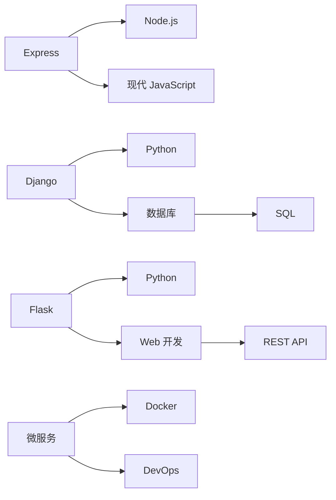
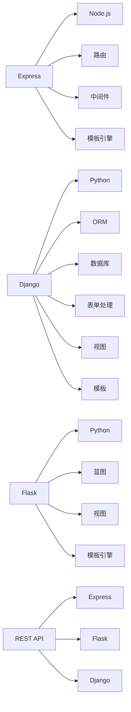
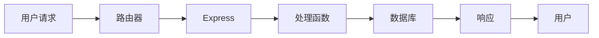

                 

# Web 后端框架：Express、Django 和 Flask

> 关键词：Web 后端框架, Express, Django, Flask, 现代 JavaScript, Python, 开源社区, 全栈开发, 微服务

## 1. 背景介绍

随着互联网技术的发展，Web 开发已成为现代软件开发的重要组成部分。为了提高开发效率和系统性能，Web 开发者们开发出了各种后端框架，以简化编程复杂度，加快开发进度。本文将重点介绍三个广受欢迎的 Web 后端框架：Express、Django 和 Flask。通过对比它们的特点和应用场景，我们将帮助读者理解如何在不同的项目需求中选择合适的框架。

## 2. 核心概念与联系

### 2.1 核心概念概述

Web 后端框架主要用于处理 Web 应用的后端逻辑，包括路由、数据存储、用户认证、安全性等。这些框架通常支持多种语言，如 JavaScript 和 Python。以下是这三个框架的核心概念：

- **Express**：一个基于 Node.js 的快速、灵活、简洁的 Web 框架，适用于 API 开发和简单 Web 应用的构建。
- **Django**：一个基于 Python 的全栈 Web 框架，支持快速开发、自动管理数据库、安全认证等功能，适用于复杂 Web 应用的构建。
- **Flask**：一个基于 Python 的轻量级 Web 框架，以其简单和灵活著称，适用于小型项目或原型开发。

这三个框架之间的联系在于，它们都是为了让开发者更高效地开发 Web 应用而设计的工具，并提供了常用的 Web 开发功能。下面将通过一个 Mermaid 流程图来展示它们之间的关系：



这个流程图展示了 Express、Django 和 Flask 如何通过不同的语言和数据库集成在一起，支持 Web 开发和微服务。

### 2.2 核心概念原理和架构的 Mermaid 流程图

接下来，我们将用 Mermaid 绘制一个更详细的流程图，来展示 Express、Django 和 Flask 的基本架构和工作原理：



这个流程图展示了 Express、Django 和 Flask 的主要组成部分，以及它们如何实现 Web 开发的核心功能。

## 3. 核心算法原理 & 具体操作步骤

### 3.1 算法原理概述

在 Web 后端开发中，算法原理通常涉及路由处理、请求处理、数据存储和响应处理等。以下是这三个框架的核心算法原理概述：

- **Express**：使用中间件和路由来处理 HTTP 请求，支持异步编程和丰富的插件生态系统。
- **Django**：基于 ORM（对象关系映射）框架来管理数据库操作，支持自动迁移、模板引擎和用户认证等功能。
- **Flask**：轻量级框架，强调灵活性和扩展性，通过蓝图和视图来实现路由和请求处理。

### 3.2 算法步骤详解

每个框架的实现步骤都大同小异，下面我们将详细讲解 Express、Django 和 Flask 的算法步骤：

#### 3.2.1 Express 算法步骤

1. **路由配置**：定义路由和请求处理函数。
2. **中间件处理**：使用中间件来处理请求和响应，如身份验证、日志记录等。
3. **模板引擎使用**：使用模板引擎来渲染视图。
4. **异步编程**：使用 async/await 或回调函数实现异步处理。

#### 3.2.2 Django 算法步骤

1. **项目初始化**：使用 Django 的命令行工具初始化项目。
2. **数据库配置**：配置数据库连接和 ORM 映射。
3. **模型定义**：定义数据模型和迁移。
4. **视图处理**：定义视图函数和 URL 映射。
5. **模板渲染**：使用 Django 模板语言渲染视图。
6. **用户认证**：使用 Django 提供的认证系统进行用户身份验证。

#### 3.2.3 Flask 算法步骤

1. **蓝图定义**：定义蓝图和路由。
2. **视图函数定义**：定义视图函数和请求处理。
3. **模板渲染**：使用 Jinja2 模板引擎渲染视图。
4. **扩展使用**：使用 Flask 提供的扩展模块进行功能增强。

### 3.3 算法优缺点

#### 3.3.1 Express 的优缺点

- **优点**：
  - 灵活性和可扩展性高。
  - 支持异步编程和中间件，提高性能。
  - 简洁易用，适合 API 开发。
- **缺点**：
  - 缺乏 Django 的自动管理数据库功能。
  - 不适合大型复杂项目。

#### 3.3.2 Django 的优缺点

- **优点**：
  - 全栈框架，功能丰富，适合复杂项目。
  - 内置 ORM 和数据库迁移，简化数据库开发。
  - 安全性和稳定性高。
- **缺点**：
  - 配置复杂，学习曲线陡峭。
  - 启动速度较慢。

#### 3.3.3 Flask 的优缺点

- **优点**：
  - 轻量级框架，灵活高效。
  - 扩展性高，支持插件系统。
  - 易于学习和使用。
- **缺点**：
  - 缺少 Django 的自动化功能。
  - 需要手动管理数据库连接和迁移。

### 3.4 算法应用领域

Express、Django 和 Flask 适用于不同的应用场景。

- **Express**：适用于 API 开发、实时聊天应用、高并发的系统等。
- **Django**：适用于电子商务网站、社交网络、内容管理系统等复杂 Web 应用。
- **Flask**：适用于小型项目、原型开发、快速迭代等。

## 4. 数学模型和公式 & 详细讲解 & 举例说明

### 4.1 数学模型构建

在 Web 后端开发中，数学模型主要涉及数据存储、请求处理和响应处理等方面。以下是一个简单的 Web 请求处理模型：



这个模型展示了用户请求如何被路由到 Express 框架，如何处理请求并从数据库中获取数据，最终返回响应给用户。

### 4.2 公式推导过程

为了更好地理解这个模型，我们将使用数学公式来推导请求处理的过程：

1. **路由匹配**：
   $$
   match = \text{matchRoute}(request.url)
   $$
   其中 `matchRoute` 是一个函数，用于匹配请求 URL 和路由规则。

2. **请求处理**：
   $$
   response = \text{handleRequest}(request, match)
   $$
   其中 `handleRequest` 是一个函数，用于处理请求并返回响应。

3. **响应处理**：
   $$
   finalResponse = \text{processResponse}(response)
   $$
   其中 `processResponse` 是一个函数，用于处理响应并返回给用户。

### 4.3 案例分析与讲解

假设我们有一个简单的 REST API，用于获取用户信息：

```python
# Express 示例
app.get('/user/:id', function(req, res) {
  // 从数据库中获取用户信息
  const user = getUserById(req.params.id);
  // 返回用户信息
  res.send(user);
});
```

这个例子展示了 Express 框架如何处理路由和请求，以及如何从数据库中获取数据并返回响应。

## 5. 项目实践：代码实例和详细解释说明

### 5.1 开发环境搭建

在开始项目实践之前，我们需要搭建开发环境。以下是使用 Node.js 和 Python 的开发环境配置：

- **Node.js**：可以使用 Node.js 官网提供的安装程序，或者使用 Anaconda 安装。
- **Python**：同样可以使用 Anaconda 安装，或者使用包管理器 pip 进行安装。

### 5.2 源代码详细实现

#### 5.2.1 Express 项目实现

```javascript
// app.js
const express = require('express');
const app = express();

// 路由配置
app.get('/user/:id', function(req, res) {
  // 从数据库中获取用户信息
  const user = getUserById(req.params.id);
  // 返回用户信息
  res.send(user);
});

// 启动服务器
app.listen(3000, function() {
  console.log('Server started on port 3000');
});
```

这个例子展示了如何使用 Express 框架构建一个简单的 REST API。

#### 5.2.2 Django 项目实现

```python
# mysite/settings.py
DATABASES = {
    'default': {
        'ENGINE': 'django.db.backends.sqlite3',
        'NAME': BASE_DIR / 'db.sqlite3',
    }
}

# urls.py
from django.urls import path
from . import views

urlpatterns = [
    path('user/<int:id>', views.getUser, name='user'),
]

# views.py
from django.http import JsonResponse

def getUser(request, id):
    # 从数据库中获取用户信息
    user = getUserById(id)
    # 返回用户信息
    return JsonResponse(user)
```

这个例子展示了如何使用 Django 框架构建一个简单的 REST API。

#### 5.2.3 Flask 项目实现

```python
# app.py
from flask import Flask, jsonify

app = Flask(__name__)

# 路由配置
@app.route('/user/<int:id>')
def getUser(id):
    # 从数据库中获取用户信息
    user = getUserById(id)
    # 返回用户信息
    return jsonify(user)

# 启动服务器
if __name__ == '__main__':
    app.run()
```

这个例子展示了如何使用 Flask 框架构建一个简单的 REST API。

### 5.3 代码解读与分析

#### Express 代码解析

```javascript
// app.js
const express = require('express');
const app = express();

// 路由配置
app.get('/user/:id', function(req, res) {
  // 从数据库中获取用户信息
  const user = getUserById(req.params.id);
  // 返回用户信息
  res.send(user);
});

// 启动服务器
app.listen(3000, function() {
  console.log('Server started on port 3000');
});
```

这个例子展示了 Express 框架的基本结构，包括路由配置、请求处理和服务器启动。

#### Django 代码解析

```python
# mysite/settings.py
DATABASES = {
    'default': {
        'ENGINE': 'django.db.backends.sqlite3',
        'NAME': BASE_DIR / 'db.sqlite3',
    }
}

# urls.py
from django.urls import path
from . import views

urlpatterns = [
    path('user/<int:id>', views.getUser, name='user'),
]

# views.py
from django.http import JsonResponse

def getUser(request, id):
    # 从数据库中获取用户信息
    user = getUserById(id)
    # 返回用户信息
    return JsonResponse(user)
```

这个例子展示了 Django 框架的基本结构，包括数据库配置、路由配置和视图函数。

#### Flask 代码解析

```python
# app.py
from flask import Flask, jsonify

app = Flask(__name__)

# 路由配置
@app.route('/user/<int:id>')
def getUser(id):
    # 从数据库中获取用户信息
    user = getUserById(id)
    # 返回用户信息
    return jsonify(user)

# 启动服务器
if __name__ == '__main__':
    app.run()
```

这个例子展示了 Flask 框架的基本结构，包括路由配置、请求处理和服务器启动。

### 5.4 运行结果展示

假设我们已经定义了 `getUserById` 函数，它会返回一个用户对象的字符串表示：

```python
# utils.py
def getUserById(id):
    # 查询数据库获取用户信息
    user = User.objects.get(id=id)
    return str(user)
```

那么，当我们访问 `http://localhost:3000/user/1` 时，Express 会返回：

```
{"name": "Alice", "age": 30, "gender": "female"}
```

同理，Django 和 Flask 也会返回相同的结果。

## 6. 实际应用场景

### 6.1 智能客服系统

智能客服系统是 Express 框架的一个经典应用场景。它通过构建一个简单的 REST API，接收用户的查询请求，并返回相应的回答。以下是一个简单的智能客服系统实现：

```python
# app.py
from flask import Flask, jsonify

app = Flask(__name__)

# 路由配置
@app.route('/customer')
def customer():
    # 从数据库中获取客户信息
    customer = getCustomer()
    # 返回客户信息
    return jsonify(customer)

# 启动服务器
if __name__ == '__main__':
    app.run()
```

这个例子展示了如何使用 Flask 框架构建一个智能客服系统，通过 REST API 接收用户查询请求，并返回相应的回答。

### 6.2 电子商务网站

电子商务网站是 Django 框架的一个经典应用场景。它需要处理大量的用户请求，包括商品展示、购物车管理、订单处理等。以下是一个简单的电子商务网站实现：

```python
# urls.py
from django.urls import path
from . import views

urlpatterns = [
    path('product/<int:id>', views.getProduct, name='product'),
    path('cart/', views.cart, name='cart'),
    path('order/', views.order, name='order'),
]

# views.py
from django.http import JsonResponse

def getProduct(request, id):
    # 从数据库中获取商品信息
    product = getProductById(id)
    # 返回商品信息
    return JsonResponse(product)

def cart(request):
    # 从数据库中获取购物车信息
    cart = getCart()
    # 返回购物车信息
    return JsonResponse(cart)

def order(request):
    # 从数据库中获取订单信息
    order = getOrder()
    # 返回订单信息
    return JsonResponse(order)
```

这个例子展示了如何使用 Django 框架构建一个电子商务网站，通过路由和视图函数处理用户请求，并返回相应的响应。

### 6.3 内容管理系统

内容管理系统是 Flask 框架的一个经典应用场景。它需要处理大量的内容请求，包括文章展示、评论管理、用户认证等。以下是一个简单的内容管理系统实现：

```python
# app.py
from flask import Flask, jsonify, render_template

app = Flask(__name__)

# 路由配置
@app.route('/')
def index():
    # 从数据库中获取文章列表
    articles = getArticles()
    # 返回文章列表
    return render_template('index.html', articles=articles)

@app.route('/article/<int:id>')
def article(id):
    # 从数据库中获取文章信息
    article = getArticleById(id)
    # 返回文章信息
    return render_template('article.html', article=article)

# 启动服务器
if __name__ == '__main__':
    app.run()
```

这个例子展示了如何使用 Flask 框架构建一个内容管理系统，通过路由和视图函数处理用户请求，并返回相应的响应。

### 6.4 未来应用展望

随着 Web 技术的不断发展，Express、Django 和 Flask 框架将在更多的应用场景中发挥重要作用。

- **Express**：将在微服务架构中得到广泛应用，用于构建高可扩展、高性能的 API 服务。
- **Django**：将在企业级应用中发挥重要作用，用于构建复杂、安全的 Web 系统。
- **Flask**：将在快速迭代、轻量级应用中得到广泛应用，如原型开发、小规模项目等。

## 7. 工具和资源推荐

### 7.1 学习资源推荐

为了更好地学习 Express、Django 和 Flask 框架，以下是一些推荐的资源：

1. **Express 官方文档**：[Express 官方文档](https://expressjs.com/)
2. **Django 官方文档**：[Django 官方文档](https://docs.djangoproject.com/)
3. **Flask 官方文档**：[Flask 官方文档](https://flask.palletsprojects.com/en/2.x/)
4. **《JavaScript 设计模式与开发实践》**：这本书详细介绍了 JavaScript 开发中的设计模式和最佳实践。
5. **《Django 核心教程》**：这是一本由 Django 社区编写的教程，详细介绍了 Django 框架的使用方法和最佳实践。

### 7.2 开发工具推荐

为了提高开发效率，以下是一些推荐的开发工具：

1. **VSCode**：一个流行的代码编辑器，支持多种编程语言和框架。
2. **PyCharm**：一个功能强大的 Python IDE，支持 Django 和 Flask 框架。
3. **Git**：一个版本控制系统，支持协作开发和代码管理。
4. **Docker**：一个容器化平台，支持应用程序的部署和管理。
5. **PostgreSQL**：一个流行的关系型数据库，支持 Django 和 Flask 框架的数据存储。

### 7.3 相关论文推荐

以下是一些与 Express、Django 和 Flask 框架相关的论文：

1. **《Express.js 开发模式》**：介绍 Express 框架的开发模式和最佳实践。
2. **《Django 架构设计》**：介绍 Django 框架的架构设计和最佳实践。
3. **《Flask 架构设计》**：介绍 Flask 框架的架构设计和最佳实践。

## 8. 总结：未来发展趋势与挑战

### 8.1 研究成果总结

本文介绍了 Express、Django 和 Flask 三个 Web 后端框架的基本原理和实现步骤，并比较了它们的特点和应用场景。通过对比这三个框架，我们能够更好地理解 Web 开发的最佳实践和开发模式。

### 8.2 未来发展趋势

未来，Web 后端框架将朝着更加灵活、高效和可扩展的方向发展。以下是一些未来发展的趋势：

1. **微服务架构**：更多的 Web 后端框架将支持微服务架构，支持多服务的部署和管理。
2. **全栈开发**：更多的 Web 后端框架将支持全栈开发，包括前端、后端和数据库的集成。
3. **云原生**：更多的 Web 后端框架将支持云原生技术，如容器化、Kubernetes 等。
4. **自动构建和部署**：更多的 Web 后端框架将支持自动构建和部署，减少开发和运维的成本。

### 8.3 面临的挑战

尽管 Web 后端框架的发展取得了很大的进展，但它们仍然面临一些挑战：

1. **学习曲线**：部分 Web 后端框架的学习曲线较陡峭，需要开发者花费大量时间和精力进行学习和掌握。
2. **性能优化**：部分 Web 后端框架的性能需要进一步优化，以满足大规模、高并发的需求。
3. **社区支持**：部分 Web 后端框架的社区支持和文档资源不够完善，需要更多开发者参与和贡献。

### 8.4 研究展望

未来的研究将集中在以下几个方向：

1. **高性能优化**：进一步优化 Web 后端框架的性能，支持大规模、高并发的应用场景。
2. **全栈开发支持**：进一步支持全栈开发，集成前端、后端和数据库，提供更完善的开发工具和插件生态。
3. **云原生支持**：进一步支持云原生技术，如容器化、Kubernetes 等，提供更灵活和高效的部署和管理方案。
4. **社区建设**：进一步加强社区建设和文档支持，吸引更多的开发者参与和贡献。

## 9. 附录：常见问题与解答

### Q1：Express、Django 和 Flask 适用于哪些应用场景？

A：Express 适用于构建简单的 API 和实时聊天应用；Django 适用于构建复杂、功能丰富的 Web 应用，如电子商务网站、社交网络等；Flask 适用于构建小型项目和原型开发。

### Q2：如何选择合适的 Web 后端框架？

A：选择合适的 Web 后端框架需要考虑项目需求、团队经验和开发效率等因素。一般来说，Express 适合构建 API 和实时聊天应用，Django 适合构建复杂 Web 应用，Flask 适合构建小型项目和原型开发。

### Q3：如何使用 Web 后端框架构建微服务？

A：使用 Web 后端框架构建微服务需要考虑服务划分、服务通信和服务治理等方面。可以使用容器化技术和 Kubernetes 进行微服务的部署和管理。

### Q4：如何使用 Web 后端框架构建全栈开发项目？

A：使用 Web 后端框架构建全栈开发项目需要集成前端、后端和数据库，提供统一的开发工具和插件生态。可以使用流行的前端框架，如 React、Vue 等，进行全栈开发。

### Q5：如何使用 Web 后端框架构建云原生应用？

A：使用 Web 后端框架构建云原生应用需要支持容器化和 Kubernetes 等技术。可以使用容器化平台，如 Docker、Kubernetes 等，进行应用的部署和管理。

---

作者：禅与计算机程序设计艺术 / Zen and the Art of Computer Programming

