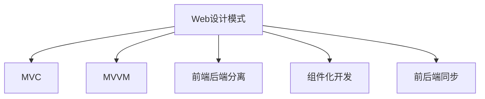

                 

# Web 设计模式：创建可扩展和模块化网站

## 1. 背景介绍

### 1.1 问题由来

随着Web技术的快速发展，互联网企业网站在用户量、数据量和功能复杂度上均达到了前所未有的高度。传统的Web开发模式，如MVC、前端后端分离等，已逐渐暴露出诸多问题。

- **代码复用性差**：各功能模块之间孤立，难以共享代码，导致大量重复开发。
- **扩展性差**：功能新增或变动时，需要重新部署和维护，影响网站性能。
- **维护成本高**：网站规模不断扩大，代码复杂度提升，维护和更新成本逐渐攀升。
- **用户体验差**：前后端分离，用户体验不连贯，前后端数据同步困难。

面对这些问题，Web设计模式应运而生，旨在提升Web网站的扩展性和模块化程度，降低开发和维护成本，提升用户体验。本文将详细介绍Web设计模式的基本原理和核心技术，以及如何通过设计模式构建可扩展、模块化的Web网站。

### 1.2 问题核心关键点

Web设计模式的核心在于通过合理的架构设计，提升Web网站的可扩展性、模块化和复用性。具体包括：

- **可扩展性**：支持功能的快速新增和变动，便于未来的迭代和升级。
- **模块化**：将网站划分为多个独立的模块，便于管理、维护和复用。
- **复用性**：代码复用性高，减少重复开发，提升开发效率。
- **一致性**：提升用户端体验，前后端数据同步无延时，用户界面风格统一。

通过回答上述问题，本文将带读者深入理解Web设计模式的精髓，并展示其实际应用效果。

## 2. 核心概念与联系

### 2.1 核心概念概述

为更好地理解Web设计模式的原理，本节将介绍几个密切相关的核心概念：

- **Web设计模式**：一种将Web应用系统的架构、组件和交互方式进行标准化、规范化、抽象化、可复用化的设计方法。通过设计模式，可以提升Web应用的性能、可维护性和可扩展性。
- **MVC（Model-View-Controller）模式**：将Web应用分为模型、视图和控制器三个部分，模型负责数据处理和业务逻辑，视图负责展示数据，控制器负责视图与模型的交互，实现前后端解耦。
- **MVVM（Model-View-ViewModel）模式**：与MVC类似，但控制器被ViewModel取代，ViewModel负责视图与模型的双向绑定，实现更好的数据流动和复用性。
- **前端后端分离（SPA）**：通过构建单页面应用（SPA），实现前后端的分离开发，提升用户体验和开发效率。
- **组件化开发**：将Web应用划分为多个独立的组件，通过组件化的方式提升代码复用性和可维护性。
- **前后端同步**：通过前后端解耦、双向绑定等技术，实现数据一致性和用户体验的一致性。

这些核心概念之间的逻辑关系可以通过以下Mermaid流程图来展示：



这个流程图展示了许多Web设计模式之间的关联关系：

1. Web设计模式通过MVC、MVVM等设计模式，实现前后端解耦和数据绑定。
2. 前端后端分离、组件化开发、前后端同步等技术，均是实现Web设计模式的手段。
3. 通过MVC、MVVM等设计模式，可以更好地实现组件化开发和前后端同步。

这些概念共同构成了Web设计模式的基石，指导着Web应用的开发和设计。

## 3. 核心算法原理 & 具体操作步骤
### 3.1 算法原理概述

Web设计模式的核心算法原理在于实现前后端解耦，提升Web应用的模块化、复用性和可扩展性。通过合理的架构设计，将Web应用划分为多个独立的模块，每个模块具有明确的功能和接口，可以独立开发、测试和部署，从而实现高效、灵活的Web开发。

### 3.2 算法步骤详解

Web设计模式的实施一般包括以下几个关键步骤：

**Step 1: 需求分析和架构设计**
- 收集需求文档，确定网站的功能、性能和扩展性要求。
- 设计架构图，明确网站模块划分，定义各个模块的功能和接口。
- 选择合适的设计模式，如MVC、MVVM等，用于实现前后端解耦。

**Step 2: 实现各个模块**
- 按照架构设计，独立开发各个模块，确保模块功能完整，接口规范。
- 通过接口规范，将各个模块组合起来，实现完整的Web应用。
- 使用前端后端分离、组件化开发等技术，提升模块的可维护性和复用性。

**Step 3: 测试和部署**
- 对各个模块进行单元测试、集成测试和系统测试，确保模块的正确性和稳定性。
- 使用持续集成和持续部署工具，实现快速、高效的部署和迭代。
- 通过监控工具，实时监测Web应用的性能和异常情况，提升用户体验。

### 3.3 算法优缺点

Web设计模式具有以下优点：
1. 代码复用性高。通过模块化和组件化，可以减少重复开发，提升开发效率。
2. 可扩展性强。模块之间独立开发，功能新增或变动时，只需修改对应模块，不影响整体应用。
3. 维护成本低。模块化设计，便于管理和维护，降低代码复杂度，提升维护效率。
4. 用户体验好。前后端解耦和数据同步，提升用户体验的一致性和流畅性。

同时，该方法也存在一定的局限性：
1. 设计和实现复杂。需要仔细规划模块划分和接口设计，初期开发成本较高。
2. 开发周期较长。由于模块独立开发和测试，开发周期相对较长。
3. 需要高水平的开发者。模块化开发要求开发者具备高水平的编程能力和设计能力。

尽管存在这些局限性，但就目前而言，Web设计模式仍是Web应用开发的主流范式。未来相关研究的重点在于如何进一步简化设计模式，降低开发成本，提高开发效率。

### 3.4 算法应用领域

Web设计模式在Web应用开发领域已经得到了广泛的应用，适用于各种类型的网站，例如：

- 电商网站：如淘宝、京东等。通过组件化开发和前后端分离，提升用户体验和开发效率。
- 社交媒体：如微信、微博等。通过组件化开发和模块化设计，提升应用的可扩展性和维护性。
- 在线教育：如Coursera、Udemy等。通过前后端分离和模块化设计，提升应用的灵活性和交互性。
- 金融平台：如支付宝、微信钱包等。通过组件化开发和数据同步，提升应用的稳定性和安全性。
- 医疗平台：如好大夫在线、微医等。通过前后端分离和模块化设计，提升应用的可靠性和用户体验。

除了上述这些经典应用外，Web设计模式也被创新性地应用到更多场景中，如物联网、智能家居、移动应用等，为Web技术的进一步发展提供了新的思路。

## 4. 数学模型和公式 & 详细讲解 & 举例说明
### 4.1 数学模型构建

本节将使用数学语言对Web设计模式的基本原理进行严格的刻画。

假设一个Web应用由多个模块构成，每个模块有$n$个功能接口。记各模块的功能接口分别为$f_{i,j}(x)$，其中$x$为输入参数。则Web应用的功能模型为：

$$
F(x) = f_{1,1}(x) \cdot f_{1,2}(x) \cdot ... \cdot f_{n,1}(x) \cdot f_{n,2}(x) \cdot ... \cdot f_{n,n}(x)
$$

在实际应用中，模块功能接口通常需要通过后端接口和前端接口进行交互，因此Web应用的功能模型可以表示为：

$$
F(x) = F_{backend}(x) \cdot F_{frontend}(x)
$$

其中$F_{backend}$为后端接口集合，$F_{frontend}$为前端接口集合。

### 4.2 公式推导过程

以MVC模式为例，推导其基本公式。

假设模块$i$的视图为$V_i$，控制器为$C_i$，模型为$M_i$，则MVC模式下的视图和控制器关系可以表示为：

$$
V_i = C_i(M_i(x))
$$

其中$x$为输入参数。将各模块的视图和控制器关系代入Web应用的功能模型中，得：

$$
F(x) = \prod_{i=1}^{n} C_i(M_i(x)) \cdot F_{frontend}(x)
$$

通过上述公式可以看出，MVC模式通过视图和控制器之间的映射关系，实现了前后端解耦和数据绑定。

### 4.3 案例分析与讲解

以下以电商网站为例，展示如何使用MVC模式进行Web设计：

1. **需求分析**：电商网站需要支持商品展示、购物车、结算等功能。将网站分为商品管理、购物车管理、结算三个模块。

2. **模块划分**：商品管理模块负责商品展示、编辑、删除等操作；购物车管理模块负责购物车商品添加、删除、结算等操作；结算模块负责订单生成、支付等操作。

3. **实现方式**：
   - 商品管理模块的模型为$M_{商品}$，视图为$V_{商品}$，控制器为$C_{商品}$。
   - 购物车管理模块的模型为$M_{购物车}$，视图为$V_{购物车}$，控制器为$C_{购物车}$。
   - 结算模块的模型为$M_{结算}$，视图为$V_{结算}$，控制器为$C_{结算}$。
   - 电商网站的功能模型为$F_{电商}=F_{商品} \cdot F_{购物车} \cdot F_{结算} \cdot F_{前端}$。

通过上述方式，电商网站实现了前后端解耦和数据绑定，提升了用户体验和开发效率。

## 5. 项目实践：代码实例和详细解释说明
### 5.1 开发环境搭建

在进行Web设计模式实践前，我们需要准备好开发环境。以下是使用Node.js进行React开发的开发环境配置流程：

1. 安装Node.js和npm：从官网下载并安装Node.js和npm。
2. 创建项目目录：
```bash
mkdir react-web
cd react-web
```

3. 初始化项目：
```bash
npm init -y
```

4. 安装依赖：
```bash
npm install express react react-dom react-router-dom
```

5. 配置开发服务器：
```javascript
// server.js
const express = require('express');
const app = express();
const port = 3000;

app.get('/', (req, res) => {
    res.sendFile(__dirname + '/index.html');
});

app.listen(port, () => {
    console.log(`Server is running on port ${port}`);
});
```

6. 搭建开发环境：
```bash
npm start
```

完成上述步骤后，即可在开发服务器上运行项目。

### 5.2 源代码详细实现

下面我们以电商网站为例，给出使用React框架进行Web设计模式的PyTorch代码实现。

首先，定义各个模块的接口：

```javascript
// 商品管理模块
class ProductModel {
    constructor() {
        this.products = [];
    }
    
    addProduct(product) {
        this.products.push(product);
    }
    
    deleteProduct(index) {
        this.products.splice(index, 1);
    }
    
    getProducts() {
        return this.products;
    }
}

// 购物车管理模块
class CartModel {
    constructor() {
        this.cartItems = [];
    }
    
    addItem(item) {
        this.cartItems.push(item);
    }
    
    deleteItem(index) {
        this.cartItems.splice(index, 1);
    }
    
    getCartItems() {
        return this.cartItems;
    }
}

// 结算模块
class CheckoutModel {
    constructor() {
        this.order = {};
    }
    
    addItemToOrder(item) {
        if (item.name in this.order) {
            this.order[item.name] += item.quantity;
        } else {
            this.order[item.name] = item.quantity;
        }
    }
    
    getOrder() {
        return this.order;
    }
}

// 视图组件
class ProductView extends React.Component {
    constructor(props) {
        super(props);
        this.state = {
            products: []
        };
        this.productModel = new ProductModel();
    }
    
    componentDidMount() {
        this.productModel.getProducts();
    }
    
    render() {
        return (
            <div>
                <h1>商品列表</h1>
                <ul>
                    {this.state.products.map((product, index) => (
                        <li key={index}>{product.name}</li>
                    ))}
                </ul>
            </div>
        );
    }
}

class CartView extends React.Component {
    constructor(props) {
        super(props);
        this.state = {
            cartItems: []
        };
        this.cartModel = new CartModel();
    }
    
    componentDidMount() {
        this.cartModel.getCartItems();
    }
    
    render() {
        return (
            <div>
                <h1>购物车</h1>
                <ul>
                    {this.state.cartItems.map((item, index) => (
                        <li key={index}>{item.name}</li>
                    ))}
                </ul>
            </div>
        );
    }
}

class CheckoutView extends React.Component {
    constructor(props) {
        super(props);
        this.state = {
            order: {}
        };
        this.checkoutModel = new CheckoutModel();
    }
    
    componentDidMount() {
        this.checkoutModel.getOrder();
    }
    
    render() {
        return (
            <div>
                <h1>结算</h1>
                <ul>
                    {Object.keys(this.state.order).map((item, index) => (
                        <li key={index}>{item}: {this.state.order[item]}</li>
                    ))}
                </ul>
            </div>
        );
    }
}

// 控制器组件
class AppController {
    constructor() {
        this.productModel = new ProductModel();
        this.cartModel = new CartModel();
        this.checkoutModel = new CheckoutModel();
    }
    
    addItemToCart(item) {
        this.cartModel.addItem(item);
    }
    
    deleteItemFromCart(index) {
        this.cartModel.deleteItem(index);
    }
    
    addItemToOrder(item) {
        this.checkoutModel.addItemToOrder(item);
    }
    
    getProducts() {
        return this.productModel.getProducts();
    }
    
    getCartItems() {
        return this.cartModel.getCartItems();
    }
    
    getOrder() {
        return this.checkoutModel.getOrder();
    }
}

// 入口组件
class App extends React.Component {
    constructor(props) {
        super(props);
        this.state = {
            products: [],
            cartItems: [],
            order: {}
        };
        this.controller = new AppController();
    }
    
    componentDidMount() {
        this.controller.getProducts();
    }
    
    addItemToCart(item) {
        this.controller.addItemToCart(item);
        this.controller.addItemToOrder(item);
    }
    
    deleteItemFromCart(index) {
        this.controller.deleteItemFromCart(index);
    }
    
    render() {
        return (
            <div>
                <ProductView />
                <CartView />
                <CheckoutView />
                <button onClick={() => this.addItemToCart({name: '产品1', quantity: 1})}>添加商品到购物车</button>
                <button onClick={() => this.deleteItemFromCart(0)}>从购物车删除商品</button>
            </div>
        );
    }
}

ReactDOM.render(<App />, document.getElementById('root'));
```

### 5.3 代码解读与分析

让我们再详细解读一下关键代码的实现细节：

**AppController类**：
- 定义了各个模块的模型接口。
- 实现了商品管理、购物车管理、结算模块的业务逻辑。
- 提供了各个模块的接口函数，供视图组件调用。

**ProductView、CartView、CheckoutView组件**：
- 通过props从AppController类获取商品、购物车、结算模块的接口函数。
- 实现了各个模块的视图逻辑，展示了相应的数据。
- 响应用户的点击事件，调用AppController类的接口函数，更新数据。

**App类**：
- 定义了App组件的初始状态。
- 实现了App组件的业务逻辑，通过AppController类的接口函数获取数据。
- 实现了App组件的视图逻辑，展示了各个模块的数据。
- 响应用户的点击事件，调用AppController类的接口函数，更新数据。

通过上述代码实现，电商网站实现了前后端解耦和数据绑定，提升了用户体验和开发效率。开发者可以进一步拓展电商网站的功能，如订单生成、支付等，只需要增加相应的模块接口和视图逻辑即可。

## 6. 实际应用场景
### 6.1 智能客服系统

基于Web设计模式的智能客服系统，可以广泛应用于互联网企业的客户服务。传统客服系统依赖于人工客服，响应时间慢、效率低、成本高。通过Web设计模式，可以实现自动化的客户服务，提升服务效率和客户满意度。

在技术实现上，可以构建智能客服网站，将各个功能模块划分为消息处理、知识库管理、自动回复等部分。通过消息处理模块，将用户输入的消息转换为标准格式，传递给知识库管理模块，自动回复模块根据知识库内容生成回复。用户可以通过网站查询、在线咨询等方式，获取快速、准确的客服服务。

### 6.2 金融平台

金融平台需要实时监测市场动态，提供投资建议、风险评估等决策支持。Web设计模式可以实现金融平台的前后端分离和数据同步，提升系统的稳定性和可靠性。

在技术实现上，可以构建金融平台网站，将各个功能模块划分为数据采集、数据分析、投资建议、风险评估等部分。通过数据采集模块，实时获取市场数据；通过数据分析模块，对市场数据进行分析和预测；通过投资建议模块，生成投资建议；通过风险评估模块，进行风险评估。各模块独立开发和测试，通过接口实现数据同步和业务集成，提升系统的稳定性和可靠性。

### 6.3 在线教育平台

在线教育平台需要支持课程上传、学生管理、教学评估等功能。Web设计模式可以实现在线教育平台的前后端分离和数据同步，提升用户体验和平台稳定性。

在技术实现上，可以构建在线教育平台网站，将各个功能模块划分为课程管理、学生管理、教学评估等部分。通过课程管理模块，实现课程的上传、编辑、删除等操作；通过学生管理模块，实现学生信息的添加、修改、删除等操作；通过教学评估模块，进行教学效果的评估。各模块独立开发和测试，通过接口实现数据同步和业务集成，提升用户体验和平台稳定性。

### 6.4 未来应用展望

随着Web设计模式的应用范围不断扩大，未来将会有更多领域受益于Web设计模式。例如：

- 医疗平台：通过Web设计模式，可以实现医疗信息的管理、患者咨询、在线诊疗等功能，提升医疗服务的效率和质量。
- 智能家居：通过Web设计模式，可以实现家居设备的控制、监控、维护等功能，提升居住的舒适度和安全性。
- 移动应用：通过Web设计模式，可以实现移动应用的开发和维护，提升应用的稳定性和用户体验。

未来，Web设计模式将成为Web应用开发的重要范式，提升应用的可扩展性、模块化和复用性，推动Web技术的进一步发展。

## 7. 工具和资源推荐
### 7.1 学习资源推荐

为了帮助开发者系统掌握Web设计模式的理论基础和实践技巧，这里推荐一些优质的学习资源：

1. 《JavaScript高级程序设计》：经典JavaScript开发指南，介绍了JavaScript的高级特性和最佳实践。
2. 《深入理解React》：深入解析React的核心原理和设计思想，帮助开发者全面理解React框架。
3. 《Node.js设计模式》：讲解了Node.js开发中的设计模式，帮助开发者提升开发效率和代码质量。
4. 《Web设计模式》：系统介绍了Web设计模式的基本原理和实现方法，适合学习Web开发的新手。
5. 《React实战》：通过具体项目的开发，帮助开发者掌握React框架的实际应用技巧。

通过对这些资源的学习实践，相信你一定能够快速掌握Web设计模式的精髓，并用于解决实际的Web开发问题。

### 7.2 开发工具推荐

高效的开发离不开优秀的工具支持。以下是几款用于Web设计模式开发的常用工具：

1. Visual Studio Code：微软开发的轻量级代码编辑器，支持多种编程语言和框架，集成了丰富的扩展和插件。
2. Sublime Text：一款强大的文本编辑器，支持快速搜索、多文件编辑等功能，适合开发和调试。
3. Atom：GitHub开发的开源编辑器，支持多种编程语言和插件，界面美观易用。
4. Git：版本控制系统，帮助开发者管理代码版本和协作开发。
5. Docker：容器化技术，帮助开发者快速搭建和部署开发环境。

合理利用这些工具，可以显著提升Web设计模式的开发效率，加快创新迭代的步伐。

### 7.3 相关论文推荐

Web设计模式的研究源于学界的持续研究。以下是几篇奠基性的相关论文，推荐阅读：

1. MVC设计模式：介绍MVC模式的基本原理和实现方法。
2. MVVM设计模式：介绍MVVM模式的基本原理和实现方法。
3. 前后端分离：介绍前后端分离的优势和实现方法。
4. 组件化开发：介绍组件化开发的优势和实现方法。
5. 数据同步：介绍Web设计模式中的数据同步方法。

这些论文代表了大设计模式的研究进展，通过学习这些前沿成果，可以帮助研究者把握学科前进方向，激发更多的创新灵感。

## 8. 总结：未来发展趋势与挑战

### 8.1 总结

本文对Web设计模式的基本原理和核心技术进行了全面系统的介绍。首先阐述了Web设计模式的背景和意义，明确了设计模式在提升Web应用的扩展性和模块化方面的独特价值。其次，从原理到实践，详细讲解了Web设计模式的关键步骤和实现方法，给出了具体的代码实例。同时，本文还广泛探讨了Web设计模式在智能客服、金融平台、在线教育等领域的实际应用效果，展示了设计模式的广阔前景。此外，本文精选了设计模式的学习资源，力求为读者提供全方位的技术指引。

通过本文的系统梳理，可以看到，Web设计模式在Web应用开发中发挥了重要的作用，通过前后端解耦、数据同步等技术，提升了应用的性能和用户体验。未来，随着Web技术的不断发展，Web设计模式将进一步演化和完善，为Web应用的开发和设计提供更加可靠、高效的解决方案。

### 8.2 未来发展趋势

展望未来，Web设计模式将呈现以下几个发展趋势：

1. 前端框架的升级：React、Vue等前端框架的持续优化，将提升Web应用的前端性能和用户体验。
2. 无代码开发工具的兴起：如CodeSandbox、Runkeeper等工具的普及，将降低Web应用的开发门槛，提升开发效率。
3. 低代码开发工具的崛起：如ModelScope、ModelScope Studio等工具的推广，将进一步降低Web应用的开发成本，提升开发效率。
4. 微服务架构的普及：微服务架构将进一步提升Web应用的模块化程度和扩展性。
5. 云原生技术的引入：云原生技术将进一步提升Web应用的性能和可靠性，降低开发和运维成本。
6. 人工智能的结合：Web设计模式与人工智能技术的结合，将提升Web应用的智能化程度和用户体验。

这些趋势将推动Web设计模式的进一步发展，为Web应用的开发和设计提供更加可靠、高效的解决方案。

### 8.3 面临的挑战

尽管Web设计模式已经取得了瞩目成就，但在迈向更加智能化、普适化应用的过程中，它仍面临诸多挑战：

1. 设计和实现的复杂性：Web设计模式需要仔细规划模块划分和接口设计，初期开发成本较高。
2. 开发周期较长：由于模块独立开发和测试，开发周期相对较长。
3. 开发者要求高：模块化开发要求开发者具备高水平的编程能力和设计能力。
4. 数据同步的复杂性：前后端数据同步需要考虑数据格式、接口规范等问题，增加了开发复杂度。
5. 用户体验的优化：前后端分离和数据同步可能导致用户体验不一致，需要进一步优化。

尽管存在这些挑战，但Web设计模式仍是Web应用开发的主流范式。未来相关研究的重点在于如何进一步简化设计模式，降低开发成本，提高开发效率。

### 8.4 研究展望

面对Web设计模式所面临的诸多挑战，未来的研究需要在以下几个方面寻求新的突破：

1. 探索轻量级设计模式：开发更加轻量级的设计模式，降低开发成本，提升开发效率。
2. 研究自动生成代码工具：开发自动生成代码的工具，减少手动编码的工作量，提升开发效率。
3. 引入数据可视化技术：通过数据可视化技术，提升Web应用的数据展示和交互效果。
4. 研究跨端体验优化技术：通过跨端体验优化技术，提升Web应用在不同设备上的用户体验。
5. 研究人工智能技术的结合：通过结合人工智能技术，提升Web应用的智能化程度和用户体验。

这些研究方向的探索，必将引领Web设计模式的进一步发展，为构建更加智能化、普适化的Web应用提供新的思路。

## 9. 附录：常见问题与解答

**Q1：Web设计模式是否适用于所有Web应用？**

A: Web设计模式适用于大多数Web应用，特别是对于功能复杂、数据量大、扩展性要求高的应用。但对于一些简单的Web应用，如静态网页、小型应用等，使用前端框架开发即可，无需复杂的Web设计模式。

**Q2：如何选择合适的Web设计模式？**

A: 选择合适的Web设计模式需要综合考虑应用的功能、性能、扩展性等要求。一般来说，可以选择MVC、MVVM、SPA等经典设计模式，也可以根据具体需求设计新的设计模式。

**Q3：Web设计模式和前端框架有什么区别？**

A: Web设计模式是一种设计方法，用于提升Web应用的扩展性和模块化程度；前端框架是具体的技术实现，提供了开发Web应用所需的基础组件和工具。Web设计模式和前端框架是互补的关系，设计模式是框架的基础，框架是设计模式的实现。

**Q4：Web设计模式的优势和劣势是什么？**

A: Web设计模式的优势在于：
1. 代码复用性高，减少重复开发。
2. 可扩展性强，功能新增或变动时，只需修改对应模块，不影响整体应用。
3. 维护成本低，模块化设计，便于管理和维护。
4. 用户体验好，前后端解耦和数据同步，提升用户体验的一致性和流畅性。

劣势在于：
1. 设计和实现复杂，初期开发成本较高。
2. 开发周期较长，模块独立开发和测试。
3. 开发者要求高，模块化开发需要高水平的编程能力和设计能力。

尽管存在劣势，但Web设计模式仍是Web应用开发的主流范式，通过优化设计和实现，可以克服其劣势，提升开发效率和应用性能。

**Q5：Web设计模式和微服务架构有什么区别？**

A: Web设计模式和微服务架构是两种不同的设计思路。Web设计模式通过前后端解耦和数据同步，提升Web应用的扩展性和模块化程度；微服务架构将应用划分为多个独立的微服务，通过容器化技术进行部署和管理，提升系统的扩展性和可靠性。两者可以结合使用，通过微服务架构实现Web应用的模块化开发和部署。

这些问题的回答，可以帮助读者更全面地理解Web设计模式的本质和应用场景。通过本文的系统梳理，可以看到，Web设计模式在Web应用开发中发挥了重要的作用，通过前后端解耦、数据同步等技术，提升了应用的性能和用户体验。未来，随着Web技术的不断发展，Web设计模式将进一步演化和完善，为Web应用的开发和设计提供更加可靠、高效的解决方案。

