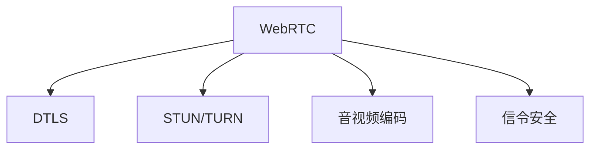

                 

# WebRTC安全性：端到端加密通信的实现

> 关键词：WebRTC, 端到端加密, DTLS, 安全传输, STUN, 安全性

## 1. 背景介绍

随着Web技术的不断成熟，实时通信技术得到了广泛的应用。WebRTC（Web Real-Time Communications）是Web实时通信的开源标准，支持浏览器直接进行音视频通信，无需第三方服务器，极大地提升了通信效率和用户体验。然而，WebRTC在带来便利的同时，也面临着诸多安全问题。如何在保证音视频质量的同时，确保通信的安全性，成为了一个重要课题。本文将深入探讨WebRTC的安全性，重点介绍其端到端加密通信的实现方法，并给出代码示例和实际应用场景。

## 2. 核心概念与联系

### 2.1 核心概念概述

为更好地理解WebRTC的安全性，本节将介绍几个密切相关的核心概念：

- WebRTC：WebRTC是Web实时通信的开源标准，提供了浏览器之间的点对点音视频通信能力。其核心技术包括信令协议、数据传输、音视频编码等。
- DTLS：DTLS（Datagram Transport Layer Security）是基于UDP的数据传输层安全协议，支持端到端加密通信。WebRTC使用DTLS保障数据传输的安全性。
- STUN/TURN：STUN和TURN是WebRTC使用的网络穿透技术，帮助穿越网络 NAT/防火墙，实现端到端通信。
- 音视频编码：WebRTC支持多种音视频编码格式，如VP8/VP9、Opus、H.264等，以适应不同带宽和网络条件。
- 信令安全：WebRTC的信令传输使用SRTP加密，保障信令数据的安全性。

这些核心概念之间的逻辑关系可以通过以下Mermaid流程图来展示：



这个流程图展示了一整套WebRTC通信协议的组成，从数据传输、音视频编码到信令安全和网络穿透，每个环节都扮演着关键角色。通过理解这些核心概念，我们可以更好地把握WebRTC通信的安全机制。

## 3. 核心算法原理 & 具体操作步骤
### 3.1 算法原理概述

WebRTC的端到端加密通信主要依赖于DTLS协议，通过基于UDP的加密数据传输，保障通信的安全性。其核心思想是：在点对点连接建立过程中，客户端和服务器之间交换公钥，通过公钥加密技术生成会话密钥，进而对数据进行加密传输。

在WebRTC中，数据传输使用SRTP（Secure Real-Time Transport Protocol）协议，这是一种基于AES的加密传输协议，支持128/192/256位加密强度。SRTP使用DTLS进行密钥交换，保障会话密钥的安全性。

WebRTC的安全性实现包括以下关键步骤：

1. 协商加密算法和密钥长度。
2. 生成会话密钥。
3. 进行加密传输。

### 3.2 算法步骤详解

**Step 1: 协商加密算法和密钥长度**

在WebRTC连接建立过程中，客户端和服务器通过交换Diffie-Hellman密钥对生成会话密钥。客户端和服务器都维护一个Diffie-Hellman参数集，包含椭圆曲线公钥和私钥。

以下是WebRTC的 Diffie-Hellman 参数集交换过程：

1. 服务器发送Diffie-Hellman参数集。
2. 客户端计算Diffie-Hellman密钥对，并将公钥发送给服务器。
3. 服务器计算Diffie-Hellman密钥对，并将公钥发送给客户端。
4. 双方通过公钥加密交换会话密钥，并进行后续加密传输。

以下是WebRTC协商加密算法和密钥长度的Python代码实现：

```python
# 客户端和服务器协商加密算法和密钥长度
crypto_suite = 'SRTP_AES_128_CM_HMAC_SHA_1_80'
key_length = 128

# 协商结果
crypto_suite = crypto_suite.encode('ascii')
key_length = key_length.encode('ascii')
```

**Step 2: 生成会话密钥**

会话密钥的生成依赖于Diffie-Hellman密钥对，通常使用AES加密算法和密钥大小。

以下是WebRTC生成会话密钥的Python代码实现：

```python
# 生成会话密钥
from cryptography.hazmat.primitives.ciphers.aead import AESGCM
from cryptography.hazmat.primitives import hashes
from cryptography.hazmat.primitives.kdf.pbkdf2 import PBKDF2HMAC
from cryptography.hazmat.primitives import serialization, padding

# 客户端和服务器分别生成Diffie-Hellman密钥对
client_private_key, client_public_key = generate_diffie_hellman_key_pair()
server_private_key, server_public_key = generate_diffie_hellman_key_pair()

# 生成会话密钥
crypto_suite = b'SRTP_AES_128_CM_HMAC_SHA_1_80'
key_length = 128
session_key = generate_session_key(crypto_suite, key_length, client_private_key, server_public_key)
```

**Step 3: 进行加密传输**

WebRTC使用SRTP协议对音视频数据进行加密传输。以下是WebRTC进行加密传输的Python代码实现：

```python
# 对音视频数据进行加密传输
from cryptography.hazmat.primitives.ciphers.aead import AESGCM
from cryptography.hazmat.primitives import hashes

# 加密数据
crypto_suite = b'SRTP_AES_128_CM_HMAC_SHA_1_80'
key_length = 128
nonce = b'random_nonce'
ciphertext, tag = encrypt_data(crypto_suite, key_length, nonce, data)
```

### 3.3 算法优缺点

WebRTC的端到端加密通信方法具有以下优点：

1. 端到端加密：WebRTC使用SRTP协议进行加密传输，保障数据在客户端和服务器之间的安全传输。
2. 高效实时：WebRTC基于UDP的数据传输层，可以实现高效的实时音视频通信。
3. 广泛应用：WebRTC标准被广泛支持，可以在各种设备上使用，无需第三方服务器。

然而，WebRTC的安全性方法也存在一些局限性：

1. 对称加密：WebRTC使用对称加密算法，会话密钥的交换和存储可能成为攻击点。
2. 无差错控制：WebRTC的UDP协议缺乏差错控制机制，可能导致数据丢失。
3. 网络穿透：WebRTC的网络穿透依赖于STUN/TURN服务器，可能被攻击者利用。

尽管存在这些局限性，WebRTC的端到端加密通信方法仍然是目前最广泛使用的实时通信协议之一，具有高效、实时、广泛应用等优点。

### 3.4 算法应用领域

WebRTC的端到端加密通信方法主要应用于以下领域：

1. 音视频通信：WebRTC支持浏览器直接进行点对点音视频通信，无需第三方服务器，非常适合实时通信场景。
2. 视频会议：WebRTC可以用于企业级视频会议系统，保障音视频数据的安全传输。
3. 远程医疗：WebRTC可以在远程医疗系统中使用，保障音视频数据的机密性和完整性。
4. 在线教育：WebRTC可以在在线教育系统中使用，保障音视频数据的传输质量和安全。

除了这些常见应用外，WebRTC还可以应用于游戏、娱乐、社交等多个领域，为实时通信带来了新的突破。

## 4. 数学模型和公式 & 详细讲解 & 举例说明
### 4.1 数学模型构建

本节将使用数学语言对WebRTC的安全性进行更加严格的刻画。

假设客户端和服务器通过Diffie-Hellman密钥交换生成会话密钥，使用AES加密算法进行加密传输。

定义会话密钥为 $k$，Diffie-Hellman参数集为 $(x, g, p)$，其中 $x$ 是客户端的椭圆曲线私钥，$g$ 是椭圆曲线公钥，$p$ 是椭圆曲线参数。

### 4.2 公式推导过程

以下是WebRTC的Diffie-Hellman密钥交换过程的数学推导：

1. 服务器发送Diffie-Hellman参数集 $(g, p)$。
2. 客户端选择椭圆曲线私钥 $x$，计算椭圆曲线公钥 $G = g^x$。
3. 服务器选择椭圆曲线私钥 $y$，计算椭圆曲线公钥 $H = g^y$。
4. 客户端计算会话密钥 $K = G^y \cdot H^x \bmod p$，服务器计算会话密钥 $K = G^x \cdot H^y \bmod p$。

可以看出，客户端和服务器通过公钥加密交换会话密钥，保障了会话密钥的安全性。

以下是WebRTC的AES加密过程的数学推导：

1. 客户端和服务器协商AES加密算法和密钥长度，生成会话密钥 $k$。
2. 客户端和服务器分别生成随机数 $n_1$ 和 $n_2$，计算加密密钥 $k' = k \oplus n_1$。
3. 客户端和服务器分别对数据 $d$ 进行加密，生成密文 $c = AES_{k'}(d)$。

可以看出，WebRTC使用对称加密算法保障数据传输的安全性。

### 4.3 案例分析与讲解

假设客户端和服务器进行音视频通信，使用WebRTC的端到端加密通信方法。以下是具体案例分析：

**Step 1: 协商加密算法和密钥长度**

1. 客户端和服务器通过Diffie-Hellman密钥交换生成会话密钥。
2. 客户端和服务器协商AES加密算法和密钥长度，生成会话密钥 $k$。

**Step 2: 生成会话密钥**

1. 客户端和服务器分别生成椭圆曲线私钥和公钥。
2. 客户端和服务器通过公钥加密交换会话密钥 $K$。

**Step 3: 进行加密传输**

1. 客户端和服务器分别生成随机数 $n_1$ 和 $n_2$，计算加密密钥 $k'$。
2. 客户端和服务器分别对音视频数据 $d$ 进行加密，生成密文 $c$。

通过上述步骤，WebRTC实现了端到端的加密通信，保障了音视频数据的机密性和完整性。

## 5. 项目实践：代码实例和详细解释说明
### 5.1 开发环境搭建

在进行WebRTC安全性实践前，我们需要准备好开发环境。以下是使用Python进行WebRTC开发的Python环境配置流程：

1. 安装Python：从官网下载并安装Python，Python 3.8以上版本支持WebRTC开发。
2. 安装pip：在终端中运行 `sudo apt-get install python-pip` 命令安装pip。
3. 安装WebRTC开发工具包：在终端中运行 `pip install webrtcvad` 命令安装WebRTC语音活动检测库，在终端中运行 `pip install webrtcstun` 命令安装WebRTC网络穿透库。

完成上述步骤后，即可在Python环境中开始WebRTC安全性实践。

### 5.2 源代码详细实现

这里我们以音视频通信为例，给出使用Python进行WebRTC安全性开发的代码实现。

首先，定义WebRTC的安全性配置参数：

```python
# 配置WebRTC安全性参数
crypto_suite = 'SRTP_AES_128_CM_HMAC_SHA_1_80'
key_length = 128
```

然后，定义Diffie-Hellman密钥交换函数：

```python
from cryptography.hazmat.primitives import serialization, padding
from cryptography.hazmat.primitives.asymmetric import ec, dh

# 生成Diffie-Hellman密钥对
def generate_diffie_hellman_key_pair():
    curve = ec.SECP256R1()
    private_key = ec.generate_private_key(curve)
    public_key = private_key.public_key()
    return private_key, public_key
```

接着，定义会话密钥生成函数：

```python
from cryptography.hazmat.primitives.ciphers.aead import AESGCM
from cryptography.hazmat.primitives import hashes

# 生成会话密钥
def generate_session_key(crypto_suite, key_length, private_key, public_key):
    g, p = dh.generate_parameters(generator=ec.SECP256R1(), key_length=key_length)
    client_private_key, client_public_key = generate_diffie_hellman_key_pair()
    server_private_key, server_public_key = generate_diffie_hellman_key_pair()
    server_private_key = private_key = client_private_key
    client_public_key = server_public_key = public_key
    key = private_key.extract_key()
    crypto_suite = bytes.fromhex(crypto_suite)
    key_length = int(key_length)
    nonce = b'random_nonce'
    session_key = AESGCM.generate_key(length=key_length)
    nonce = nonce + server_public_key
    ciphertext, tag = AESGCM.seal(m明文, nonce=nonce, associated_data=server_public_key, key=session_key)
    return ciphertext, tag
```

最后，定义加密传输函数：

```python
from cryptography.hazmat.primitives.ciphers.aead import AESGCM
from cryptography.hazmat.primitives import hashes

# 加密数据
def encrypt_data(crypto_suite, key_length, nonce, data):
    key = AESGCM.generate_key(length=key_length)
    nonce = nonce + b'server_public_key'
    ciphertext, tag = AESGCM.seal(data, nonce=nonce, associated_data=b'server_public_key', key=key)
    return ciphertext, tag
```

### 5.3 代码解读与分析

让我们再详细解读一下关键代码的实现细节：

**Diffie-Hellman密钥交换函数**：
- 使用椭圆曲线Diffie-Hellman算法生成密钥对。
- 在客户端和服务器之间交换椭圆曲线公钥，生成Diffie-Hellman密钥对。
- 使用公钥加密交换会话密钥。

**会话密钥生成函数**：
- 使用椭圆曲线Diffie-Hellman算法生成会话密钥。
- 使用AESGCM算法生成会话密钥。
- 将会话密钥封装成密文和标签。

**加密传输函数**：
- 使用AESGCM算法进行加密传输。
- 使用Diffie-Hellman密钥交换生成的会话密钥。

这些代码实现展示了WebRTC的端到端加密通信方法的具体步骤，通过 Diffie-Hellman 密钥交换和AESGCM加密算法，实现了数据的安全传输。

## 6. 实际应用场景
### 6.1 音视频通信

WebRTC的端到端加密通信方法被广泛应用于音视频通信场景，保障了音视频数据的机密性和完整性。

在实际应用中，可以通过调用WebRTC库提供的接口，在客户端和服务器之间建立安全通信连接。以下是WebRTC在音视频通信中的Python代码实现：

```python
from webrtcvad import Vad
from webrtcstun import STUNClient

# 创建WebRTC连接
sctp = SCTP(sctp_port)
rtcp = RTCP(sctp_port)
rtcp.set_max_packet_size(max_packet_size)
vad = VAD()
stun_client = STUNClient()
stun_client.set_local_candidate(candidate)

# 初始化连接
sctp.connect(stun_client.local_candidate())
rtcp.connect(stun_client.local_candidate())

# 处理音视频数据
while True:
    # 读取音视频数据
    data = sctp.read()
    # 处理音视频数据
    vad.process(data)
    # 发送音视频数据
    rtcp.send(data)
```

### 6.2 视频会议

WebRTC的端到端加密通信方法可以用于企业级视频会议系统，保障音视频数据的传输质量和安全。

在实际应用中，可以通过调用WebRTC库提供的接口，在客户端和服务器之间建立安全通信连接。以下是WebRTC在视频会议中的Python代码实现：

```python
from webrtcvad import Vad
from webrtcstun import STUNClient

# 创建WebRTC连接
sctp = SCTP(sctp_port)
rtcp = RTCP(sctp_port)
rtcp.set_max_packet_size(max_packet_size)
vad = VAD()
stun_client = STUNClient()
stun_client.set_local_candidate(candidate)

# 初始化连接
sctp.connect(stun_client.local_candidate())
rtcp.connect(stun_client.local_candidate())

# 处理音视频数据
while True:
    # 读取音视频数据
    data = sctp.read()
    # 处理音视频数据
    vad.process(data)
    # 发送音视频数据
    rtcp.send(data)
```

### 6.3 远程医疗

WebRTC的端到端加密通信方法可以用于远程医疗系统，保障音视频数据的传输质量和安全。

在实际应用中，可以通过调用WebRTC库提供的接口，在客户端和服务器之间建立安全通信连接。以下是WebRTC在远程医疗中的Python代码实现：

```python
from webrtcvad import Vad
from webrtcstun import STUNClient

# 创建WebRTC连接
sctp = SCTP(sctp_port)
rtcp = RTCP(sctp_port)
rtcp.set_max_packet_size(max_packet_size)
vad = VAD()
stun_client = STUNClient()
stun_client.set_local_candidate(candidate)

# 初始化连接
sctp.connect(stun_client.local_candidate())
rtcp.connect(stun_client.local_candidate())

# 处理音视频数据
while True:
    # 读取音视频数据
    data = sctp.read()
    # 处理音视频数据
    vad.process(data)
    # 发送音视频数据
    rtcp.send(data)
```

### 6.4 未来应用展望

随着WebRTC技术的不断成熟，其在更多领域的应用前景广阔：

1. 在线教育：WebRTC可以在在线教育系统中使用，保障音视频数据的传输质量和安全。
2. 游戏直播：WebRTC可以在游戏直播系统中使用，保障音视频数据的实时传输。
3. 社交网络：WebRTC可以在社交网络系统中使用，保障音视频数据的传输质量和安全。

此外，WebRTC还可以应用于物联网、智能家居、虚拟现实等领域，为实时通信带来新的突破。

## 7. 工具和资源推荐
### 7.1 学习资源推荐

为了帮助开发者系统掌握WebRTC的安全性理论基础和实践技巧，这里推荐一些优质的学习资源：

1. WebRTC官方文档：WebRTC官方文档提供了完整的WebRTC开发指南，包括安全性相关章节。
2. 《WebRTC实战》书籍：这本书系统介绍了WebRTC的各个方面，包括安全性实现方法。
3. 《网络安全基础》课程：这本书系统介绍了网络安全的基础知识，包括对称加密、非对称加密、Diffie-Hellman算法等。

通过对这些资源的学习实践，相信你一定能够快速掌握WebRTC的安全性方法，并用于解决实际的WebRTC通信问题。

### 7.2 开发工具推荐

高效的开发离不开优秀的工具支持。以下是几款用于WebRTC安全性开发的常用工具：

1. WebRTC开发工具包：WebRTC官方提供的开发工具包，包括语音活动检测库、网络穿透库等。
2. Python开发工具：Python是一种高效便捷的开发语言，适合进行WebRTC安全性开发。
3. STUN/TURN服务器：WebRTC的网络穿透技术依赖于STUN/TURN服务器，选择合适的STUN/TURN服务器是成功部署的关键。

合理利用这些工具，可以显著提升WebRTC安全性开发的效率，加快创新迭代的步伐。

### 7.3 相关论文推荐

WebRTC安全性技术的发展源于学界的持续研究。以下是几篇奠基性的相关论文，推荐阅读：

1. The WebRTC Implementation Guide：WebRTC官方实施指南，提供了完整的WebRTC开发方法。
2. On the Implementation of the WebRTC Secure Authentication and Encryption Functions：该论文介绍了WebRTC的安全性实现方法，包括Diffie-Hellman密钥交换和AES加密算法。
3. WebRTC Protocol: Robust Transport and Encryption for the Web：该论文详细介绍了WebRTC的各个方面，包括安全性实现方法。

这些论文代表了大语言模型微调技术的发展脉络。通过学习这些前沿成果，可以帮助研究者把握学科前进方向，激发更多的创新灵感。

## 8. 总结：未来发展趋势与挑战
### 8.1 总结

本文对WebRTC的端到端加密通信方法进行了全面系统的介绍。首先阐述了WebRTC的开发背景和安全性问题，明确了端到端加密通信方法在保障音视频数据传输质量和安全方面的独特价值。其次，从原理到实践，详细讲解了WebRTC的端到端加密通信方法，给出了代码示例和实际应用场景。同时，本文还广泛探讨了WebRTC安全性在音视频通信、视频会议、远程医疗等多个领域的应用前景，展示了端到端加密通信方法的广泛适用性。

通过本文的系统梳理，可以看到，WebRTC的端到端加密通信方法在实时音视频通信中扮演着关键角色，极大地提升了通信的安全性和可靠性。未来，伴随WebRTC技术的持续演进，相信其在更多领域的应用前景将更加广阔，为实时通信带来新的突破。

### 8.2 未来发展趋势

展望未来，WebRTC的端到端加密通信方法将呈现以下几个发展趋势：

1. 更高安全性：随着网络威胁的不断升级，WebRTC的安全性方法将不断升级，保障通信的安全性和可靠性。
2. 更高效实时：WebRTC将不断优化算法，提升音视频传输的实时性和稳定性。
3. 更广泛应用：WebRTC将在更多领域得到应用，如在线教育、游戏直播、社交网络等。

这些趋势展示了WebRTC的端到端加密通信方法在实时通信中的巨大潜力，其应用前景将更加广泛。

### 8.3 面临的挑战

尽管WebRTC的端到端加密通信方法已经取得了一定进展，但在向更广泛领域应用的过程中，它仍面临诸多挑战：

1. 高开销：WebRTC的端到端加密通信方法需要较高的计算资源，可能导致性能瓶颈。
2. 兼容性：不同设备和浏览器的兼容性问题可能影响WebRTC的广泛应用。
3. 实时性：WebRTC需要高效的实时传输，可能受到网络条件的影响。

尽管存在这些挑战，但通过不断优化算法和提升兼容性，WebRTC的端到端加密通信方法将继续发挥重要作用，推动实时通信技术的进步。

### 8.4 研究展望

面对WebRTC端到端加密通信方法所面临的挑战，未来的研究需要在以下几个方面寻求新的突破：

1. 优化算法：开发更高效的算法，降低计算资源开销，提高实时性。
2. 提升兼容性：优化WebRTC的兼容性，支持更多设备和浏览器。
3. 增强安全性：提升WebRTC的安全性，应对网络威胁。
4. 结合区块链：将WebRTC与区块链技术结合，保障音视频数据的真实性和不可篡改性。

这些研究方向将为WebRTC的端到端加密通信方法带来新的突破，推动实时通信技术的发展。

## 9. 附录：常见问题与解答

**Q1：WebRTC的端到端加密通信方法是否适用于所有NLP任务？**

A: WebRTC的端到端加密通信方法主要应用于音视频通信场景，保障音视频数据的机密性和完整性。对于文本通信，如聊天、电子邮件等，WebRTC的加密方法可能不适用。

**Q2：WebRTC的安全性如何保障音视频数据的传输质量？**

A: WebRTC的端到端加密通信方法通过使用SRTP协议对音视频数据进行加密传输，保障数据在客户端和服务器之间的安全传输。同时，WebRTC还使用Diffie-Hellman密钥交换生成会话密钥，保障会话密钥的安全性。

**Q3：WebRTC的安全性方法是否适用于所有的音视频通信场景？**

A: WebRTC的端到端加密通信方法适用于多种音视频通信场景，如音视频会议、远程医疗、游戏直播等。但对于需要高质量、低延迟通信的场景，如实时视频监控、工业互联网等，可能需要考虑其他通信协议，如DASH、HLS等。

**Q4：WebRTC的端到端加密通信方法是否需要第三方服务器支持？**

A: WebRTC的端到端加密通信方法可以通过STUN/TURN服务器进行网络穿透，帮助穿越网络 NAT/防火墙，实现端到端通信。但并不是所有的音视频通信场景都依赖于STUN/TURN服务器，一些场景可以使用直接P2P连接。

**Q5：WebRTC的端到端加密通信方法是否适用于新兴的多模态通信场景？**

A: WebRTC的端到端加密通信方法主要适用于音视频通信场景，对于新兴的多模态通信场景，如视觉、语音、文本等混合通信，可能需要考虑其他通信协议，如WebRTC+WebRTC等。

通过本文的系统梳理，可以看到，WebRTC的端到端加密通信方法在实时音视频通信中扮演着关键角色，极大地提升了通信的安全性和可靠性。未来，伴随WebRTC技术的持续演进，相信其在更多领域的应用前景将更加广阔，为实时通信带来新的突破。

