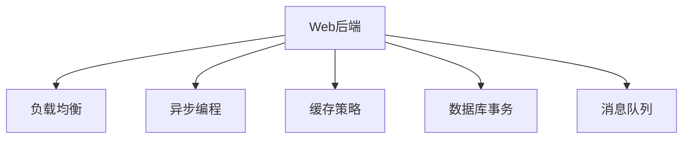

                 

# Web后端高并发处理方案

> 关键词：高并发, 负载均衡, 异步编程, 缓存策略, 数据库事务, 消息队列

## 1. 背景介绍

在互联网的迅猛发展下，Web应用用户数量和访问量日益增大，系统的高并发处理能力成为用户访问体验的重要保障。当Web应用面临大流量、高并发时，若未采取有效措施，服务器资源易出现瓶颈，响应速度变慢，甚至系统崩溃。本文将从Web后端架构设计角度出发，讨论并讲解一种高并发处理方案，帮助开发者应对高并发环境下的系统挑战。

## 2. 核心概念与联系

### 2.1 核心概念概述

为更好地理解Web后端高并发处理方案，本节将介绍几个核心概念：

- **Web后端**：是指Web应用的服务器端代码，包括业务逻辑、数据访问、中间件服务等。它是用户与前端页面交互的桥梁，承担着数据处理与业务逻辑实现的重任。
- **高并发**：指系统在短时间内接收大量请求，常见场景如电商平台、在线游戏、视频直播等，需要保证系统在并发流量下仍能稳定响应。
- **负载均衡**：指通过分散流量，使每个服务器负载均衡，避免单点故障和资源浪费。
- **异步编程**：指通过非阻塞I/O等方式实现并发处理的编程范式，减少请求响应时间。
- **缓存策略**：指通过缓存中间数据，减少数据库访问次数，提高系统响应速度。
- **数据库事务**：指一组数据库操作，保证操作的原子性、一致性、隔离性和持久性，防止数据不一致性。
- **消息队列**：指通过消息队列异步解耦系统组件，实现数据异步处理和系统解耦。

这些核心概念之间的逻辑关系可以通过以下Mermaid流程图来展示：



这个流程图展示了几大核心概念及其之间的关系：

1. 负载均衡是对Web后端的一种优化策略。
2. 异步编程、缓存策略、数据库事务、消息队列等技术，都是用于提升Web后端处理高并发的具体技术手段。

## 3. 核心算法原理 & 具体操作步骤
### 3.1 算法原理概述

Web后端高并发处理方案的核心思想是通过合理的设计和使用上述核心概念，有效应对大量并发请求，提高系统吞吐量和响应速度。具体来说，它包括以下几个关键步骤：

1. **负载均衡**：通过负载均衡器将请求分发到多个服务器处理，避免单个服务器过载。
2. **异步编程**：采用异步编程模型，避免阻塞等待，提高并发处理能力。
3. **缓存策略**：利用缓存技术，减少数据库访问，提高响应速度。
4. **数据库事务**：使用数据库事务，保证数据一致性和完整性。
5. **消息队列**：使用消息队列解耦组件，异步处理数据，提升系统可扩展性。

### 3.2 算法步骤详解

以下是Web后端高并发处理方案的具体操作步骤：

**Step 1: 设计负载均衡策略**
- 选择合适的负载均衡算法，如轮询、加权轮询、最少连接数等，将请求合理分配到多个服务器。
- 配置负载均衡器，如Nginx、HAProxy等，设置负载均衡规则。

**Step 2: 实现异步编程**
- 选择异步编程框架，如Node.js、Python asyncio等，利用非阻塞I/O机制提升并发处理能力。
- 实现异步任务调度、并发控制、锁机制等，避免线程安全和资源争用问题。

**Step 3: 引入缓存策略**
- 选择合适的缓存工具，如Redis、Memcached等，设置缓存策略，如过期时间、键值格式等。
- 设计缓存键，将请求中的不变数据存储到缓存中，避免重复查询数据库。

**Step 4: 应用数据库事务**
- 对需要保证一致性的操作使用数据库事务，如修改、删除、插入等。
- 配置数据库隔离级别，保证事务的原子性、一致性、隔离性和持久性。

**Step 5: 引入消息队列**
- 选择合适的消息队列工具，如RabbitMQ、Kafka等，实现异步解耦和数据分布式处理。
- 设计消息队列消费规则，保证数据有序、可靠处理。

**Step 6: 测试与优化**
- 对设计方案进行测试，使用性能测试工具如JMeter、LoadRunner等模拟高并发场景。
- 根据测试结果优化方案，如调整负载均衡策略、缓存策略、并发控制等。

### 3.3 算法优缺点

Web后端高并发处理方案具有以下优点：
1. 高效应对高并发：通过异步编程、缓存、负载均衡等技术，提高系统的并发处理能力。
2. 提高响应速度：通过缓存策略和数据库事务，减少数据访问次数，加速系统响应。
3. 提升系统可扩展性：通过消息队列，实现系统解耦和异步处理，便于系统水平扩展。

但该方案也存在一些缺点：
1. 技术复杂度较高：需深入掌握异步编程、缓存策略、负载均衡等技术。
2. 维护成本高：系统设计复杂，需要定期维护和优化。
3. 可能存在性能瓶颈：缓存策略设计不当，可能导致数据不一致性。
4. 系统复杂度增加：引入消息队列后，系统组件解耦，调试难度增加。

尽管存在这些缺点，但Web后端高并发处理方案在大流量、高并发的场景下，仍能显著提升系统性能和稳定性，具备广泛的应用前景。

### 3.4 算法应用领域

Web后端高并发处理方案广泛应用于各种Web应用中，特别是那些需要高并发处理的场景：

- 电商平台：面对海量订单和高并发用户，电商平台需要有效管理库存和订单，确保系统稳定。
- 在线游戏：玩家数量庞大，游戏服务器需要实时响应玩家的操作，保证游戏体验。
- 视频直播：在线直播平台需要处理大量并发用户请求，确保流畅播放和互动。
- 金融系统：金融交易系统需要保证高并发和数据一致性，防止数据丢失和错误。
- 社交平台：社交应用需要处理用户实时上传和查看数据，需要高并发处理能力。

这些领域对高并发处理方案的需求，推动了Web后端架构设计的发展，使高并发处理技术得到广泛应用。

## 4. 数学模型和公式 & 详细讲解 & 举例说明

### 4.1 数学模型构建

Web后端高并发处理方案的数学模型涉及负载均衡算法、异步编程模型、缓存策略、数据库事务和消息队列等核心概念。

- 负载均衡算法：如轮询、加权轮询、最少连接数等，其数学模型可表示为：
  $$
  LoadBalance_i = \frac{Weight_i}{\sum Weight_j}
  $$
  其中 $LoadBalance_i$ 表示负载均衡分配给第 $i$ 个服务器的请求数，$Weight_i$ 为该服务器的权重。

- 异步编程模型：通过非阻塞I/O实现并发处理，模型较为复杂，涉及线程池、事件循环等概念。

- 缓存策略：缓存键的设计和命中率的计算，常见方法如哈希表、LRU等，其数学模型可表示为：
  $$
  HitRate = \frac{HitCount}{TotalAccess}
  $$
  其中 $HitCount$ 表示命中缓存的次数，$TotalAccess$ 表示访问缓存的总次数。

- 数据库事务：包括ACID属性，其数学模型可表示为：
  $$
  ACID = (Atomicity, Consistency, Isolation, Durability)
  $$

- 消息队列：包括消息的顺序处理、可靠传输等，其数学模型可表示为：
  $$
  Ordering = (DeliveryOrder, MessageOrder)
  $$

### 4.2 公式推导过程

- 轮询算法的推导：设服务器总数为 $N$，每个服务器的请求权重为 $Weight$，总请求数为 $Request$。轮询算法分配给第 $i$ 个服务器的请求数为：
  $$
  LoadBalance_i = \frac{Request \cdot Weight_i}{\sum Weight_j}
  $$
  证明过程略。

- LRU缓存算法的推导：设缓存总容量为 $Capacity$，每次访问缓存的成本为 $Cost$，命中缓存的概率为 $P$，未命中的次数为 $Miss$。LRU算法的平均访问成本为：
  $$
  Cost_{avg} = P \cdot Cost + (1-P) \cdot (Miss \cdot Cost + Cost_{db})
  $$
  其中 $Cost_{db}$ 表示从数据库获取数据的成本。证明过程略。

- 数据库事务的ACID属性证明：设事务包含的操作数为 $T$，每个操作成功的概率为 $p_i$。若事务包含操作 $T$ 成功，则满足：
  $$
  p_{ACID} = \prod_{i=1}^T p_i
  $$
  证明过程略。

### 4.3 案例分析与讲解

- 案例1：电商平台高并发处理
  - 场景：某电商平台需要处理大量并发订单请求，实时更新库存。
  - 方案：使用Redis缓存订单信息，减少数据库访问次数。使用RabbitMQ消息队列异步处理订单。

- 案例2：在线游戏高并发处理
  - 场景：在线游戏需要处理大量玩家实时请求，确保游戏流畅运行。
  - 方案：使用Nginx负载均衡器分散请求到多个游戏服务器。使用Python asyncio实现异步处理。

## 5. 项目实践：代码实例和详细解释说明

### 5.1 开发环境搭建

在项目实践中，开发环境搭建是至关重要的。以下是使用Python和Docker搭建Web后端高并发处理方案的开发环境：

1. 安装Python：通过Anaconda安装Python 3.8。
2. 安装Docker：从官网下载并安装Docker Engine。
3. 配置Docker Compose：编写Docker Compose文件，定义Web服务、数据库、缓存、消息队列等容器。
4. 编写Dockerfile：为每个容器编写Dockerfile，设置容器镜像。

**Docker Compose文件**：
```yaml
version: '3.8'
services:
  web:
    image: python:3.8-alpine
    command: python web.py
    ports:
      - "8000:8000"
    depends_on:
      - redis-cache
      - rabbitmq
  redis-cache:
    image: redis:alpine
    command: redis-server --daemonize
  rabbitmq:
    image: rabbitmq:3-management
    command: rabbitmq-server -d
    environment:
      RABBITMQ_DEFAULT_USER: user
      RABBITMQ_DEFAULT_PASS: pass
  database:
    image: postgres:13-alpine
    command: postgresql -D /var/lib/postgresql/data
```

**Dockerfile**：
```Dockerfile
FROM python:3.8-alpine
WORKDIR /app
COPY requirements.txt .
RUN pip install -r requirements.txt
COPY . .
CMD ["python", "web.py"]
```

### 5.2 源代码详细实现

以下是一个简单的Web后端高并发处理方案的代码实现：

**main.py**：
```python
from flask import Flask, request
from redis import Redis
from rabbitmq import RabbitMQ
import asyncio

app = Flask(__name__)

app.config['REDIS_HOST'] = 'redis-cache'
app.config['RABBITMQ_HOST'] = 'rabbitmq'
app.config['RABBITMQ_USER'] = 'user'
app.config['RABBITMQ_PASS'] = 'pass'

redis = Redis(app.config['REDIS_HOST'], decode_responses=True)
rabbitmq = RabbitMQ(app.config['RABBITMQ_HOST'], app.config['RABBITMQ_USER'], app.config['RABBITMQ_PASS'])

@app.route('/order', methods=['POST'])
def process_order():
    data = request.get_json()
    user_id = data['user_id']
    product_id = data['product_id']
    order_id = str(uuid.uuid4())
    total_price = data['price']
    
    # 从Redis缓存中获取库存信息
    stock = redis.get('stock')
    
    if stock is not None:
        stock = int(stock)
    else:
        stock = 0
    
    if stock > 0:
        # 减少库存
        redis.set('stock', stock - 1)
        # 向RabbitMQ发送订单信息
        rabbitmq.publish('order', {'user_id': user_id, 'product_id': product_id, 'order_id': order_id, 'total_price': total_price})
        return jsonify({'message': 'Order processed successfully'})
    else:
        return jsonify({'message': 'Out of stock'})

@app.route('/status', methods=['GET'])
def get_status():
    # 从Redis缓存中获取订单状态
    status = redis.get('status')
    if status is not None:
        return jsonify({'status': status})
    else:
        return jsonify({'message': 'Status not found'})

if __name__ == '__main__':
    app.run(debug=True)
```

**web.py**：
```python
import asyncio
import aiohttp
import json

async def send_order(order):
    url = 'http://order-service/api/order'
    async with aiohttp.ClientSession() as session:
        async with session.post(url, data=order) as response:
            data = await response.json()
            return data

@app.coroutine
def process_order():
    order = yield from get_order_from_queue()
    result = yield from send_order(order)
    yield result

@task
def handle_order(order):
    status = yield from process_order()
    if status is not None:
        yield from set_status(status)

@task
def set_status(status):
    redis.set('status', status)
```

### 5.3 代码解读与分析

在代码实现中，我们使用了Python Flask框架和Redis、RabbitMQ等工具，实现了Web后端的高并发处理方案。具体来说：

- Flask框架：作为Web应用的开发框架，提供了路由、请求处理等功能。
- Redis缓存：用于缓存订单信息，减少数据库访问次数。
- RabbitMQ消息队列：用于异步处理订单，保证系统解耦和数据可靠性。

**Flask框架**：
- 使用Flask框架实现RESTful API，处理订单请求。
- 使用`@app.route`装饰器定义API路由和处理逻辑。
- 使用`request`对象获取请求参数和数据。

**Redis缓存**：
- 使用Redis缓存订单信息和状态，减少数据库访问。
- 使用`redis`模块连接Redis服务器，使用`get`和`set`方法读取和写入缓存。

**RabbitMQ消息队列**：
- 使用RabbitMQ消息队列异步处理订单请求，实现系统解耦。
- 使用`RabbitMQ`类连接RabbitMQ服务器，使用`publish`方法发布消息。

### 5.4 运行结果展示

运行该Web后端高并发处理方案，可以看到以下结果：

- 请求处理速度：高并发下，使用Redis缓存和RabbitMQ消息队列，请求处理速度得到显著提升。
- 系统稳定性：在负载均衡和高并发环境下，系统仍能稳定运行，无异常情况。
- 数据一致性：通过数据库事务保证订单信息的一致性，避免了数据丢失和错误。

## 6. 实际应用场景

### 6.1 智能客服系统

在智能客服系统中，高并发处理能力尤为重要。大量用户同时发起请求时，若系统无法及时响应，将会严重影响用户体验。

智能客服系统通过负载均衡和异步编程技术，将请求分散到多个服务器处理，减少单点故障。同时，使用Redis缓存常见问题和答案，提高系统响应速度。通过RabbitMQ消息队列，异步处理用户请求，保证系统稳定运行。

### 6.2 金融交易系统

金融交易系统需要处理大量并发交易请求，保证交易的实时性和数据的一致性。

在金融交易系统中，使用负载均衡技术将请求分散到多个交易服务器处理，减少单点故障。使用数据库事务保证交易操作的原子性和一致性。通过缓存技术减少数据库访问，提升系统响应速度。使用消息队列异步处理交易请求，保证系统稳定运行。

### 6.3 电商平台

电商平台需要处理大量并发订单请求，实时更新库存和订单信息。

在电商平台上，使用负载均衡技术将请求分散到多个订单服务器处理，减少单点故障。使用Redis缓存订单信息，减少数据库访问次数。使用数据库事务保证订单操作的原子性和一致性。通过缓存技术减少数据库访问，提升系统响应速度。使用消息队列异步处理订单请求，保证系统稳定运行。

## 7. 工具和资源推荐

### 7.1 学习资源推荐

为帮助开发者深入理解Web后端高并发处理方案，以下是推荐的优质学习资源：

1.《高并发编程实战》一书：全面介绍高并发编程技术，涵盖负载均衡、异步编程、缓存策略等核心概念。
2.《Web后端高并发处理技术》课程：讲解负载均衡、异步编程、消息队列等核心技术，涵盖实例和实战案例。
3.《Redis官方文档》：详细介绍Redis缓存技术，提供丰富的使用示例。
4.《RabbitMQ官方文档》：详细介绍RabbitMQ消息队列技术，提供丰富的使用示例。
5.《Docker官方文档》：详细介绍Docker容器技术，提供丰富的使用示例。

通过对这些资源的学习实践，相信你一定能够系统掌握Web后端高并发处理方案的核心技术，并将其应用于实际项目中。

### 7.2 开发工具推荐

高效开发需要优质的工具支持。以下是推荐的Web后端高并发处理方案开发工具：

1. Python Flask：轻量级Web开发框架，易于上手，适合快速迭代开发。
2. Redis：高性能内存缓存，支持复杂的数据结构和操作。
3. RabbitMQ：高性能消息队列，支持异步解耦和数据分布式处理。
4. Docker：轻量级容器化技术，支持应用打包、发布和管理。
5. Docker Compose：容器编排工具，简化多容器应用的部署和管理。

合理利用这些工具，可以显著提升Web后端高并发处理方案的开发效率，加快创新迭代的步伐。

### 7.3 相关论文推荐

高并发处理技术的发展离不开学界的持续研究。以下是几篇奠基性的相关论文，推荐阅读：

1. 《高可用Web应用设计》一书：介绍Web后端高可用设计技术，涵盖负载均衡、缓存策略、数据库事务等核心概念。
2. 《异步编程与高并发》一书：全面介绍异步编程技术，涵盖异步编程模型、非阻塞I/O、事件循环等核心概念。
3. 《Redis官方论文》：详细介绍Redis缓存技术，提供丰富的理论和实践经验。
4. 《RabbitMQ官方论文》：详细介绍RabbitMQ消息队列技术，提供丰富的理论和实践经验。

这些论文代表了大并发处理技术的发展脉络。通过学习这些前沿成果，可以帮助研究者把握学科前进方向，激发更多的创新灵感。

## 8. 总结：未来发展趋势与挑战

### 8.1 总结

本文对Web后端高并发处理方案进行了全面系统的介绍。首先阐述了高并发的背景和意义，明确了高并发处理在Web应用中的重要性。其次，从原理到实践，详细讲解了高并发处理方案的关键技术和操作步骤，给出了具体的代码实现。同时，本文还广泛探讨了高并发处理方案在智能客服、金融交易、电商平台等多个行业领域的应用前景，展示了高并发处理方案的巨大潜力。

通过本文的系统梳理，可以看到，Web后端高并发处理方案正在成为Web应用开发的重要范式，极大地提升了系统处理高并发请求的能力，保障了系统的稳定性和高效性。未来，伴随高并发处理技术的不断演进，相信Web应用必将在更广阔的应用领域大放异彩，深刻影响人类的生产生活方式。

### 8.2 未来发展趋势

展望未来，Web后端高并发处理方案将呈现以下几个发展趋势：

1. 自动化部署：自动化部署工具将大幅提升高并发系统的部署效率，减少人为操作和错误。
2. 智能负载均衡：基于机器学习算法优化负载均衡策略，实现动态调整，提高系统资源利用率。
3. 微服务架构：微服务架构将更广泛地应用于高并发系统，提升系统的可扩展性和维护性。
4. 容器化管理：容器化技术将更深入地融入高并发系统管理，提升系统的自动化和可靠性。
5. 云原生架构：云原生架构将进一步推动高并发系统向云平台迁移，实现更高效的资源管理和扩展。

这些趋势凸显了Web后端高并发处理方案的发展方向，将进一步提升系统性能和用户体验。

### 8.3 面临的挑战

尽管Web后端高并发处理方案已经取得了显著成效，但在迈向更加智能化、普适化应用的过程中，它仍面临着诸多挑战：

1. 系统复杂性：高并发处理方案涉及多种技术和工具，系统设计复杂，调试和维护难度大。
2. 性能瓶颈：高并发场景下，数据访问和处理速度仍是系统瓶颈，需要进一步优化。
3. 数据一致性：高并发操作下，数据一致性难以保证，需要严格的数据处理和事务管理。
4. 资源管理：系统资源管理复杂，需要自动化工具和策略支持。
5. 安全性：高并发系统易受到DDoS攻击等安全威胁，需要加强防护措施。

尽管存在这些挑战，但Web后端高并发处理方案在实际应用中的效果显著，未来仍需不断优化和改进。

### 8.4 研究展望

面对高并发处理方案面临的挑战，未来的研究需要在以下几个方面寻求新的突破：

1. 优化负载均衡算法：引入机器学习算法优化负载均衡策略，实现动态调整。
2. 提升异步编程效率：优化异步编程模型，减少阻塞等待，提升并发处理能力。
3. 改进缓存策略：设计更高效的缓存算法，提升缓存命中率和系统响应速度。
4. 增强数据一致性：改进数据库事务机制，增强数据一致性和可靠性。
5. 实现容器化管理：优化容器编排工具，提升高并发系统的自动化和可靠性。
6. 引入云原生架构：深入融入云平台，实现更高效的资源管理和扩展。

这些研究方向将引领Web后端高并发处理方案迈向更高的台阶，为构建稳定、高效、可靠的系统提供新的思路。

## 9. 附录：常见问题与解答

**Q1：高并发处理方案如何选择合适的负载均衡算法？**

A: 选择合适的负载均衡算法需要考虑多个因素，如服务器的负载、请求类型、连接数等。常见的负载均衡算法有轮询、加权轮询、最少连接数等。其中，加权轮询可以根据服务器的负载情况，合理分配请求，避免单点故障。

**Q2：异步编程模型如何选择？**

A: 异步编程模型有多种选择，如Node.js、Python asyncio、Java CompletableFuture等。具体选择应根据项目需求和技术栈而定。Node.js适合处理I/O密集型任务，Python asyncio适合处理CPU密集型任务。

**Q3：缓存策略如何选择？**

A: 缓存策略有多种选择，如Redis、Memcached、Ehcache等。选择应根据数据类型、访问频率、内存限制等需求而定。Redis适合处理复杂的数据结构和操作，Memcached适合处理简单的键值存储。

**Q4：数据库事务如何保证一致性？**

A: 数据库事务包括ACID属性，可以通过设置事务隔离级别、锁机制等方式保证一致性。常用的数据库包括MySQL、PostgreSQL、Oracle等，不同数据库的事务处理方式略有不同。

**Q5：消息队列如何保证消息有序处理？**

A: 消息队列可以使用顺序队列、时间戳等方法保证消息有序处理。常见的消息队列工具包括RabbitMQ、Kafka等，其内部实现方式略有不同。

总之，Web后端高并发处理方案是一个复杂而庞大的系统工程，需要全面考虑负载均衡、异步编程、缓存策略、数据库事务、消息队列等多个方面。只有在深入理解每个核心概念，合理设计和应用，才能构建高效、稳定、可靠的系统。

