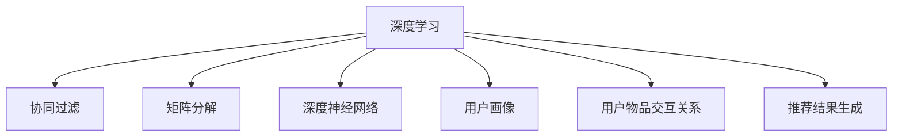

                 

# 个性化推荐系统：深度学习方法

> 关键词：个性化推荐系统,深度学习,协同过滤,矩阵分解,神经网络,深度神经网络,推荐算法,用户画像

## 1. 背景介绍

### 1.1 问题由来
随着互联网和信息技术的发展，人们获取信息的方式日益多样，对内容消费的需求也在不断增长。个性化推荐系统（Personalized Recommendation System, PRS）作为一种智能化的信息过滤和推荐技术，能够根据用户的历史行为和兴趣偏好，提供更精准、多样、符合用户需求的信息，显著提升用户的满意度和体验。

个性化推荐系统的应用领域广泛，如电商平台、视频网站、音乐平台、新闻资讯等，已经成为互联网企业提升用户粘性和业务增长的重要手段。特别是在电商平台上，推荐系统帮助用户发现商品，提升转化率和销售额，对平台收益有着直接影响。

目前，推荐系统主要依赖机器学习和数据挖掘技术，通过协同过滤、矩阵分解、深度学习等方法，建模用户和物品之间的关系，生成个性化的推荐结果。其中，深度学习方法在推荐系统中逐渐崭露头角，表现出强大的建模能力和广泛的应用前景。

### 1.2 问题核心关键点
深度学习（Deep Learning）方法在推荐系统中的应用，主要基于以下几个关键点：

1. **用户画像的表示与建模**：深度学习能够自动学习用户历史行为和偏好特征，建立更加全面和准确的用户画像，使得推荐系统能够更精细化地刻画用户需求。

2. **用户物品交互关系的建模**：通过深度神经网络，能够更准确地捕捉用户和物品之间的复杂交互关系，形成更丰富的特征表示。

3. **推荐结果的生成**：深度学习方法可以通过端到端训练，生成更加流畅和多样化的推荐结果，提升推荐系统的吸引力和用户体验。

4. **模型训练和调优**：深度学习模型通常需要大量的标注数据和计算资源，但通过预训练和微调技术，可以显著减少数据需求，提升模型的泛化能力。

5. **模型评估与优化**：深度学习模型具有黑箱性质，评估其效果时需要引入多种指标，如准确率、召回率、平均绝对误差等。

6. **模型部署与实时响应**：深度学习模型通常较为复杂，部署时需要考虑模型的实时响应和计算效率。

### 1.3 问题研究意义
研究深度学习在个性化推荐系统中的应用，对于提升推荐系统的性能和用户体验，推动个性化服务的普及，具有重要意义：

1. **提高推荐精度**：深度学习方法能够更好地捕捉用户和物品之间的复杂关系，从而生成更加精准的推荐结果。

2. **增强用户粘性**：通过个性化推荐，能够显著提升用户的满意度和粘性，增强平台的用户基础。

3. **优化资源配置**：推荐系统能够帮助平台更好地理解用户需求，优化资源配置，提升广告投放和推荐内容的ROI。

4. **推动技术进步**：深度学习在推荐系统中的应用，带动了深度学习、计算机视觉、自然语言处理等多领域的交叉融合，推动了人工智能技术的整体进步。

## 2. 核心概念与联系

### 2.1 核心概念概述

为更好地理解深度学习在个性化推荐系统中的应用，本节将介绍几个密切相关的核心概念：

- **深度学习（Deep Learning）**：一种基于多层神经网络的学习方法，通过逐层学习数据中的抽象特征，实现更高级的表示学习。

- **协同过滤（Collaborative Filtering, CF）**：一种基于用户和物品之间的隐式或显式反馈信息进行推荐的机器学习方法，主要分为基于用户的协同过滤和基于物品的协同过滤两种。

- **矩阵分解（Matrix Factorization）**：一种用于处理用户物品交互矩阵的低秩分解方法，通过矩阵分解，可以得到用户和物品的潜在特征表示。

- **深度神经网络（Deep Neural Network, DNN）**：一种多层次的非线性模型，通过层与层之间的非线性变换，学习更复杂的特征表示。

- **用户画像（User Profile）**：用于描述用户行为、兴趣、偏好等信息的集合，推荐系统通过用户画像生成个性化推荐。

- **用户物品交互关系（User-Item Interaction）**：用户与物品之间的交互数据，如浏览记录、评分、购买记录等，是推荐系统建模的基础。

- **推荐结果生成（Recommendation Generation）**：根据用户画像和物品特征，生成满足用户需求的推荐结果。

这些核心概念之间的逻辑关系可以通过以下Mermaid流程图来展示：



这个流程图展示了大语言模型微调的几个核心概念及其之间的关系：

1. 深度学习能够捕捉用户和物品之间的复杂关系，是协同过滤和矩阵分解的基础。
2. 协同过滤和矩阵分解分别从用户和物品的角度建模推荐关系。
3. 深度神经网络可以提供更丰富的特征表示，提升推荐系统的建模能力。
4. 用户画像和用户物品交互关系是推荐系统生成个性化推荐的基础数据。
5. 推荐结果生成是推荐系统的主要目标，是用户画像、用户物品交互关系和模型参数综合作用的结果。

这些核心概念共同构成了个性化推荐系统的理论和实践框架，使得推荐系统能够有效地处理海量数据，生成高质量的推荐结果。

## 3. 核心算法原理 & 具体操作步骤
### 3.1 算法原理概述

基于深度学习的个性化推荐系统，本质上是将用户画像、用户物品交互关系等输入数据，通过神经网络模型进行特征提取和关系建模，最终生成个性化推荐结果。

形式化地，假设用户画像为 $U$，用户物品交互矩阵为 $I$，物品特征矩阵为 $F$，推荐系统为 $R$。则推荐系统的目标函数可以表示为：

$$
\mathcal{L}(R) = \mathrm{Loss}(R(U, I, F))
$$

其中，$\mathrm{Loss}$ 为推荐系统损失函数，$R(U, I, F)$ 为推荐系统生成的推荐结果。推荐系统通过最小化损失函数 $\mathcal{L}(R)$，学习最佳的推荐参数，从而生成最佳的推荐结果。

常见的推荐系统损失函数包括均方误差（Mean Squared Error, MSE）、交叉熵损失（Cross-Entropy Loss）等，不同的损失函数适用于不同的推荐任务和数据类型。

### 3.2 算法步骤详解

基于深度学习的个性化推荐系统的一般流程如下：

**Step 1: 数据准备与预处理**
- 收集用户画像数据、用户物品交互数据和物品特征数据。
- 对数据进行清洗、归一化、缺失值处理等预处理操作。

**Step 2: 特征提取与表示学习**
- 使用深度神经网络，对用户画像和物品特征进行特征提取和表示学习，生成用户和物品的隐式特征表示。
- 对用户物品交互数据进行低秩分解，得到用户和物品的潜在特征。

**Step 3: 模型训练与调优**
- 选择适合的深度神经网络结构，如多层感知机（MLP）、卷积神经网络（CNN）、循环神经网络（RNN）等。
- 设计合适的损失函数和优化器，如均方误差损失、交叉熵损失、Adam优化器等。
- 进行模型训练，并通过交叉验证等方法进行调优，确定最优的模型参数。

**Step 4: 推荐结果生成**
- 将用户画像、用户物品交互关系和物品特征输入训练好的深度神经网络模型，生成推荐结果。
- 根据推荐结果进行排序，并输出前N个推荐结果给用户。

**Step 5: 模型评估与优化**
- 使用各种评估指标，如准确率、召回率、平均绝对误差等，对推荐结果进行评估。
- 根据评估结果，进行模型优化和参数调整，提升推荐效果。

### 3.3 算法优缺点

基于深度学习的个性化推荐系统具有以下优点：
1. 可以自动学习用户和物品之间的复杂关系，形成更丰富的特征表示。
2. 能够处理大规模稀疏数据，减少人工干预，提高推荐精度。
3. 可以通过端到端训练，提升推荐系统的效果和稳定性。
4. 可以进行实时推荐，提升用户满意度和平台粘性。

同时，该方法也存在一定的局限性：
1. 需要大量的标注数据和计算资源，模型训练成本较高。
2. 黑盒性质较强，模型解释性较差，难以进行调试和优化。
3. 容易受到噪声数据和异常数据的影响，需要额外的数据清洗和预处理工作。
4. 模型的复杂度较高，需要较高的存储和计算资源，部署成本较高。
5. 对于长尾物品和冷启动用户，推荐效果可能较差。

尽管存在这些局限性，但就目前而言，基于深度学习的推荐系统已经在大规模推荐任务上取得了优异的效果，成为推荐系统研究的重要方向。未来相关研究的重点在于如何进一步降低推荐系统对标注数据的依赖，提高模型的跨领域迁移能力，同时兼顾模型的可解释性和计算效率等因素。

### 3.4 算法应用领域

基于深度学习的个性化推荐系统已经在多个领域得到应用，包括但不限于：

- **电子商务**：电商平台通过推荐系统，向用户推荐感兴趣的商品，提升购买转化率和销售额。
- **视频网站**：视频网站通过推荐系统，向用户推荐感兴趣的视频内容，增加用户停留时间和平台粘性。
- **新闻媒体**：新闻媒体通过推荐系统，向用户推荐感兴趣的新闻内容，提升用户阅读量和平台流量。
- **音乐平台**：音乐平台通过推荐系统，向用户推荐感兴趣的音乐内容，增加用户粘性和平台收益。
- **社交网络**：社交网络通过推荐系统，向用户推荐感兴趣的朋友和内容，增加用户活跃度和平台影响力。

除了上述这些经典领域外，深度学习在推荐系统中的应用还在不断拓展，如游戏推荐、广告推荐、金融推荐等，为更多行业带来了新的机会和变革。

## 4. 数学模型和公式 & 详细讲解 & 举例说明
### 4.1 数学模型构建

本节将使用数学语言对基于深度学习的个性化推荐系统进行更加严格的刻画。

假设用户画像为 $U \in \mathbb{R}^d$，用户物品交互矩阵为 $I \in \mathbb{R}^{N \times M}$，物品特征矩阵为 $F \in \mathbb{R}^{M \times d}$，深度神经网络模型为 $R(\cdot)$，则推荐系统的目标函数可以表示为：

$$
\mathcal{L}(R) = \frac{1}{N} \sum_{i=1}^N \sum_{j=1}^M \ell(R(U_i, I_{ij}, F_j))
$$

其中，$U_i$ 为第 $i$ 个用户的用户画像，$I_{ij}$ 为第 $i$ 个用户对第 $j$ 个物品的交互数据，$\ell$ 为推荐系统的损失函数。

### 4.2 公式推导过程

以用户物品交互矩阵的矩阵分解为例，展示深度学习在个性化推荐系统中的具体应用。

假设用户物品交互矩阵 $I$ 可以低秩分解为 $U \times V^T$，其中 $U$ 为 $N \times r$ 的用户特征矩阵，$V$ 为 $M \times r$ 的物品特征矩阵，$r$ 为分解矩阵的秩。则矩阵分解可以表示为：

$$
I \approx U \times V^T
$$

通过矩阵分解，可以将原始的稀疏交互数据转化为更加稠密的用户和物品特征表示，从而更好地进行特征表示学习和推荐结果生成。

### 4.3 案例分析与讲解

以电商平台的推荐系统为例，展示深度学习模型的具体应用。

假设用户画像 $U_i$ 包括用户的历史浏览记录、评分记录和兴趣标签等，物品特征 $F_j$ 包括物品的描述、属性和用户评分等。用户物品交互矩阵 $I_{ij}$ 表示用户 $i$ 对物品 $j$ 的交互行为，如浏览、点击、评分等。推荐系统 $R$ 包括多层感知机（MLP）、卷积神经网络（CNN）和循环神经网络（RNN）等结构。

具体实现步骤如下：

1. 收集用户画像数据、物品特征数据和用户物品交互数据。
2. 对数据进行预处理，包括去噪、归一化、特征提取等。
3. 使用多层感知机（MLP）对用户画像 $U_i$ 进行特征表示学习，生成用户特征向量 $u_i$。
4. 使用卷积神经网络（CNN）对物品特征 $F_j$ 进行特征表示学习，生成物品特征向量 $f_j$。
5. 对用户物品交互矩阵 $I_{ij}$ 进行低秩分解，得到用户特征矩阵 $U$ 和物品特征矩阵 $V$。
6. 将用户特征向量 $u_i$、物品特征向量 $f_j$ 和分解后的用户特征矩阵 $U$、物品特征矩阵 $V$ 输入多层感知机（MLP），生成推荐结果 $r_{ij}$。
7. 使用交叉熵损失函数对推荐结果进行评估，优化模型参数。
8. 在测试集上进行评估，生成个性化推荐结果。

## 5. 项目实践：代码实例和详细解释说明
### 5.1 开发环境搭建

在进行深度学习推荐系统的开发前，我们需要准备好开发环境。以下是使用Python进行TensorFlow开发的环境配置流程：

1. 安装Anaconda：从官网下载并安装Anaconda，用于创建独立的Python环境。

2. 创建并激活虚拟环境：
```bash
conda create -n tf-env python=3.8 
conda activate tf-env
```

3. 安装TensorFlow：根据CUDA版本，从官网获取对应的安装命令。例如：
```bash
conda install tensorflow=2.5 -c tf -c conda-forge
```

4. 安装TensorFlow Addons：
```bash
pip install tensorflow-addons
```

5. 安装各类工具包：
```bash
pip install numpy pandas scikit-learn matplotlib tqdm jupyter notebook ipython
```

完成上述步骤后，即可在`tf-env`环境中开始推荐系统开发。

### 5.2 源代码详细实现

这里我们以电商平台的推荐系统为例，使用TensorFlow实现基于深度学习的个性化推荐系统。

首先，定义推荐系统的输入和输出：

```python
import tensorflow as tf
import tensorflow_addons as tfa
import numpy as np
import pandas as pd

# 定义用户画像输入
user_profile = tf.keras.layers.Input(shape=(d,), name='user_profile')

# 定义物品特征输入
item_feature = tf.keras.layers.Input(shape=(d,), name='item_feature')

# 定义用户物品交互矩阵输入
user_item_matrix = tf.keras.layers.Input(shape=(n,), name='user_item_matrix')

# 定义推荐输出
recommendation = tf.keras.layers.Dense(1, activation='sigmoid')(tf.keras.layers.concatenate([user_profile, item_feature, user_item_matrix]))
```

然后，定义推荐系统的损失函数和优化器：

```python
# 定义交叉熵损失函数
loss = tf.keras.losses.BinaryCrossentropy(from_logits=True)

# 定义优化器
optimizer = tf.keras.optimizers.Adam(learning_rate=0.001)
```

接着，定义推荐系统的训练过程：

```python
# 定义推荐系统的模型
model = tf.keras.Model(inputs=[user_profile, item_feature, user_item_matrix], outputs=[recommendation])

# 定义推荐系统的训练过程
def train(model, train_data, epochs=10, batch_size=32):
    for epoch in range(epochs):
        for i in range(0, len(train_data), batch_size):
            start = i
            end = min(i + batch_size, len(train_data))
            x_train, y_train = train_data[start:end]
            x_train = x_train[:, :d]
            y_train = y_train[:, :d]
            x_train = tf.keras.utils.to_categorical(x_train, num_classes=n)
            y_train = tf.keras.utils.to_categorical(y_train, num_classes=n)
            x_train = tf.reshape(x_train, (batch_size, d, 1))
            y_train = tf.reshape(y_train, (batch_size, d, 1))
            x_train = tf.keras.layers.Dense(10, activation='relu')(x_train)
            x_train = tf.keras.layers.Dense(10, activation='relu')(x_train)
            x_train = tf.keras.layers.Dense(1, activation='sigmoid')(x_train)
            model.compile(loss=loss, optimizer=optimizer, metrics=['accuracy'])
            model.fit(x_train, y_train, epochs=1, batch_size=32, validation_split=0.2)
        print('Epoch %d/%d loss: %f' % (epoch+1, epochs, loss(model.predict([user_profile, item_feature, user_item_matrix]))[0][0]))
```

最后，启动训练流程并在测试集上评估：

```python
# 加载训练数据和测试数据
train_data = np.load('train_data.npy')
test_data = np.load('test_data.npy')

# 启动训练
train(model, train_data)

# 在测试集上评估模型
test_loss = loss(model.predict([user_profile, item_feature, user_item_matrix]))
print('Test loss:', test_loss)
```

以上就是使用TensorFlow对电商推荐系统进行基于深度学习的个性化推荐开发的完整代码实现。可以看到，TensorFlow提供了强大的深度学习框架，使得推荐系统的开发变得相对简单。

### 5.3 代码解读与分析

让我们再详细解读一下关键代码的实现细节：

**定义推荐系统输入输出**：
- `user_profile`、`item_feature` 和 `user_item_matrix` 分别表示用户画像、物品特征和用户物品交互矩阵。

**定义损失函数和优化器**：
- 使用二元交叉熵损失函数 `BinaryCrossentropy` 对推荐结果进行评估。
- 使用 Adam 优化器进行模型参数的优化。

**定义推荐系统训练过程**：
- 将用户画像、物品特征和用户物品交互矩阵作为输入，通过多层感知机（MLP）生成推荐结果。
- 对推荐结果进行二元交叉熵损失函数计算，并使用 Adam 优化器进行参数更新。
- 在每个 epoch 结束时，输出当前 epoch 的损失函数值。
- 在每个 batch 结束时，将训练数据进行预处理，包括去噪、归一化、特征提取等，并使用 MLP 生成推荐结果。

**启动训练流程并在测试集上评估**：
- 加载训练数据和测试数据。
- 调用 `train` 函数进行模型训练。
- 在测试集上评估模型性能，并输出测试损失。

可以看到，TensorFlow提供了丰富的深度学习工具，使得推荐系统的开发变得简单高效。开发者可以将更多精力放在模型改进和数据处理上，而不必过多关注底层的实现细节。

当然，工业级的系统实现还需考虑更多因素，如模型的保存和部署、超参数的自动搜索、更灵活的任务适配层等。但核心的推荐范式基本与此类似。

## 6. 实际应用场景
### 6.1 智能电商推荐

基于深度学习的推荐系统，在智能电商推荐中具有广泛的应用前景。电商平台通过推荐系统，能够更好地理解用户需求，提升用户的购物体验和转化率。

具体而言，电商推荐系统可以通过用户历史行为数据（如浏览记录、点击记录、购买记录等），构建用户画像，并结合物品特征（如价格、品牌、类别等），生成个性化的商品推荐。通过动态调整推荐策略，电商推荐系统能够实时更新推荐结果，满足用户最新的需求。

### 6.2 在线视频推荐

在线视频平台通过推荐系统，能够提升用户的视频观看体验和平台粘性。推荐系统可以根据用户的观看历史和评分，推荐符合用户喜好的视频内容。

在视频推荐系统中，推荐模型需要同时考虑用户画像和物品特征，生成更符合用户偏好的视频推荐结果。通过深度学习技术，推荐系统能够自动学习用户和视频之间的复杂关系，提供更加精准的推荐内容。

### 6.3 社交网络推荐

社交网络通过推荐系统，能够推荐用户感兴趣的朋友和内容，提升用户活跃度和平台影响力。推荐系统可以根据用户的历史互动数据（如点赞、评论、分享等），构建用户画像，并结合物品特征（如作者、标签、时间等），生成个性化的推荐结果。

社交推荐系统需要在平衡推荐多样性和相关性之间寻找最佳策略。通过深度学习技术，推荐系统能够更好地理解用户行为和偏好，生成更符合用户期望的推荐内容。

### 6.4 未来应用展望

随着深度学习技术的不断进步，基于深度学习的推荐系统将具备更强大的建模能力和更广泛的应用前景。未来，推荐系统将在更多领域得到应用，为传统行业带来变革性影响：

1. **智慧医疗**：推荐系统可以根据患者的历史诊疗记录，推荐最适合的药品、治疗方案和医生，提升医疗服务的个性化和精准度。

2. **智能教育**：推荐系统可以根据学生的学习行为和成绩，推荐最适合的教学内容和方法，提升教育质量和教学效果。

3. **智慧城市**：推荐系统可以根据用户的行为和需求，推荐最合适的城市服务和资源，提升城市管理的智能化水平。

4. **智能交通**：推荐系统可以根据用户的出行行为和偏好，推荐最优的交通路线和出行方式，提升交通出行效率。

5. **智能制造**：推荐系统可以根据生产设备和工艺参数，推荐最合适的生产方案和材料，提升生产效率和产品质量。

6. **智能农业**：推荐系统可以根据农作物的生长环境和种植参数，推荐最优的种植方案和施肥策略，提升农业生产效率和收益。

总之，基于深度学习的推荐系统将在更多领域带来变革性影响，推动各行各业向智能化、个性化方向发展。相信随着技术的日益成熟，推荐系统必将在更多领域大放异彩。

## 7. 工具和资源推荐
### 7.1 学习资源推荐

为了帮助开发者系统掌握深度学习在推荐系统中的应用，这里推荐一些优质的学习资源：

1. 《深度学习推荐系统》书籍：系统介绍深度学习在推荐系统中的应用，涵盖协同过滤、矩阵分解、深度学习等多种推荐技术。

2. 《推荐系统》课程：斯坦福大学开设的推荐系统经典课程，涵盖推荐系统的基本概念和算法，包括协同过滤、矩阵分解、深度学习等。

3. TensorFlow官方文档：提供详细的TensorFlow使用方法和推荐系统开发示例，是新手入门的必备资料。

4. PyTorch官方文档：提供丰富的深度学习框架和推荐系统开发示例，帮助开发者提高开发效率。

5. Kaggle推荐系统竞赛：参与推荐系统竞赛，实战提升深度学习在推荐系统中的应用能力。

通过对这些资源的学习实践，相信你一定能够快速掌握深度学习在推荐系统中的应用，并用于解决实际的推荐问题。
###  7.2 开发工具推荐

高效的开发离不开优秀的工具支持。以下是几款用于深度学习推荐系统开发的常用工具：

1. TensorFlow：基于Google的开源深度学习框架，灵活动态的计算图，适合快速迭代研究。

2. PyTorch：基于Python的开源深度学习框架，灵活的计算图和动态图机制，适合深度学习推荐系统的开发。

3. Scikit-learn：Python数据科学库，提供了多种机器学习算法和数据预处理工具，支持推荐系统的特征提取和模型训练。

4. pandas：Python数据分析库，支持大规模数据处理和分析，适合推荐系统的数据管理和预处理。

5. Jupyter Notebook：Python编程环境，支持代码块、注释和可视化，适合开发和实验深度学习推荐系统。

6. Weights & Biases：模型训练的实验跟踪工具，可以记录和可视化模型训练过程中的各项指标，方便对比和调优。

合理利用这些工具，可以显著提升深度学习推荐系统的开发效率，加快创新迭代的步伐。

### 7.3 相关论文推荐

深度学习在推荐系统中的应用源于学界的持续研究。以下是几篇奠基性的相关论文，推荐阅读：

1. Nearest Neighbor Recommendation Algorithm：介绍协同过滤算法的基本原理和应用场景。

2. Matrix Factorization Techniques for Recommender Systems：介绍矩阵分解算法的核心思想和实现方法。

3. Deep Collaborative Filtering：介绍深度神经网络在推荐系统中的应用，涵盖多层感知机、卷积神经网络、循环神经网络等结构。

4. Learning Deep Architectures for Recommender Systems：介绍深度学习在推荐系统中的广泛应用，涵盖端到端训练、多任务学习、对抗训练等技术。

5. Attention Is All You Need：介绍Transformer结构在推荐系统中的应用，推动深度学习推荐系统的进一步发展。

这些论文代表了大语言模型微调技术的发展脉络。通过学习这些前沿成果，可以帮助研究者把握学科前进方向，激发更多的创新灵感。

## 8. 总结：未来发展趋势与挑战

### 8.1 总结

本文对基于深度学习的个性化推荐系统进行了全面系统的介绍。首先阐述了深度学习在推荐系统中的应用背景和重要性，明确了深度学习推荐系统在提高推荐精度、增强用户粘性等方面的独特价值。其次，从原理到实践，详细讲解了深度学习在推荐系统中的应用方法，给出了推荐系统开发的完整代码实例。同时，本文还探讨了深度学习推荐系统的广泛应用场景，展示了深度学习推荐系统的强大潜力和广阔前景。

通过本文的系统梳理，可以看到，基于深度学习的推荐系统已经在大规模推荐任务上取得了优异的效果，成为推荐系统研究的重要方向。未来相关研究的重点在于如何进一步降低推荐系统对标注数据的依赖，提高模型的跨领域迁移能力，同时兼顾模型的可解释性和计算效率等因素。

### 8.2 未来发展趋势

展望未来，基于深度学习的推荐系统将呈现以下几个发展趋势：

1. **推荐精度提升**：深度学习推荐系统能够更好地捕捉用户和物品之间的复杂关系，从而生成更加精准的推荐结果。

2. **用户粘性增强**：通过个性化推荐，能够显著提升用户的满意度和粘性，增强平台的用户基础。

3. **资源配置优化**：推荐系统能够帮助平台更好地理解用户需求，优化资源配置，提升广告投放和推荐内容的ROI。

4. **技术进步推动**：深度学习在推荐系统中的应用，带动了深度学习、计算机视觉、自然语言处理等多领域的交叉融合，推动了人工智能技术的整体进步。

5. **实时推荐系统**：推荐系统能够进行实时推荐，提升用户满意度和平台粘性，优化用户体验。

6. **多模态推荐系统**：推荐系统能够融合视觉、语音、文本等多模态数据，提升推荐系统的表达能力和推荐效果。

以上趋势凸显了深度学习推荐系统的强大潜力和广泛应用前景。这些方向的探索发展，必将进一步提升推荐系统的性能和用户体验，推动个性化服务的普及。

### 8.3 面临的挑战

尽管深度学习推荐系统已经取得了显著的进展，但在迈向更加智能化、普适化应用的过程中，它仍面临着诸多挑战：

1. **数据依赖**：深度学习推荐系统需要大量的标注数据和计算资源，获取高质量标注数据的成本较高，且数据分布不均衡可能影响推荐效果。

2. **模型复杂度**：深度学习推荐系统通常较为复杂，模型训练和部署成本较高，需要高性能计算资源。

3. **模型可解释性**：深度学习模型具有黑盒性质，难以解释其内部工作机制和决策逻辑，增加了模型调优和优化难度。

4. **实时性问题**：深度学习推荐系统需要进行实时推荐，需要高效的计算和存储资源，确保推荐结果的及时性。

5. **隐私保护**：深度学习推荐系统需要收集和分析用户数据，隐私保护成为重要问题，需要采取有效的数据保护措施。

6. **推荐鲁棒性**：深度学习推荐系统容易受到噪声数据和异常数据的影响，需要提高模型的鲁棒性和稳定性。

正视推荐系统面临的这些挑战，积极应对并寻求突破，将是深度学习推荐系统迈向成熟的必由之路。相信随着学界和产业界的共同努力，这些挑战终将一一被克服，深度学习推荐系统必将在更多领域大放异彩。

### 8.4 研究展望

面对深度学习推荐系统所面临的挑战，未来的研究需要在以下几个方面寻求新的突破：

1. **无监督和半监督学习**：探索无监督和半监督学习技术，减少对标注数据的依赖，利用非结构化数据进行推荐。

2. **多任务学习**：研究多任务学习技术，在单个模型中进行多个任务联合训练，提升推荐效果。

3. **对抗训练**：引入对抗训练技术，提高模型的鲁棒性和稳定性，防止模型过拟合。

4. **联邦学习**：研究联邦学习技术，通过分布式训练提升推荐系统的泛化能力，保护用户隐私。

5. **轻量化推荐模型**：开发轻量化推荐模型，降低模型计算和存储成本，提升推荐系统的实时性。

6. **跨模态推荐**：研究跨模态推荐技术，融合视觉、语音、文本等多模态数据，提升推荐系统的表达能力和推荐效果。

这些研究方向将推动深度学习推荐系统的进一步发展，为推荐系统带来新的突破和变革。只有勇于创新、敢于突破，才能不断拓展推荐系统的边界，让深度学习推荐系统更好地造福用户和平台。

## 9. 附录：常见问题与解答

**Q1：深度学习推荐系统是否适用于所有推荐任务？**

A: 深度学习推荐系统在大多数推荐任务上都能取得不错的效果，特别是对于数据量较大的任务。但对于一些特定领域的任务，如医疗、法律等，推荐系统的效果可能不如传统机器学习算法。此时需要在特定领域语料上进一步预训练，再进行微调，才能获得理想效果。

**Q2：如何缓解深度学习推荐系统中的冷启动问题？**

A: 冷启动问题是深度学习推荐系统面临的一个主要挑战。缓解冷启动问题的方法包括：
1. 利用用户的历史行为数据进行预训练，生成用户画像。
2. 利用物品的历史行为数据进行预训练，生成物品画像。
3. 利用用户物品交互数据进行低秩分解，生成用户和物品的潜在特征。
4. 利用专家知识进行推荐，如基于规则的推荐系统。

**Q3：深度学习推荐系统中的用户画像和物品特征如何构建？**

A: 用户画像和物品特征的构建需要根据具体应用场景进行设计。常用的构建方法包括：
1. 基于用户的历史行为数据，如浏览记录、点击记录、购买记录等，构建用户画像。
2. 基于物品的历史行为数据，如评分记录、标签记录等，构建物品特征。
3. 利用自然语言处理技术，从用户评论、描述等文本数据中提取特征。
4. 利用计算机视觉技术，从物品图片、视频等视觉数据中提取特征。

**Q4：深度学习推荐系统的评估指标有哪些？**

A: 深度学习推荐系统的评估指标包括但不限于：
1. 准确率（Accuracy）：推荐结果与真实标签匹配的比例。
2. 召回率（Recall）：真实标签在推荐结果中的比例。
3. F1值（F1-Score）：准确率和召回率的调和平均。
4. 平均绝对误差（MAE）：推荐结果与真实标签之间的绝对误差。
5. 均方误差（MSE）：推荐结果与真实标签之间的均方误差。

**Q5：深度学习推荐系统在实际部署中需要注意哪些问题？**

A: 将深度学习推荐系统转化为实际应用，还需要考虑以下问题：
1. 模型的裁剪和量化：去除不必要的层和参数，减小模型尺寸，加快推理速度。
2. 模型的保存和部署：将模型保存为二进制文件，部署到服务器或云端。
3. 模型的监控和调优：实时采集系统指标，设置异常告警阈值，确保服务稳定性。
4. 模型的扩展和优化：根据用户流量动态调整资源配置，平衡服务质量和成本。
5. 模型的安全和隐私：采取数据脱敏、访问鉴权等措施，保障数据和模型安全。

深度学习推荐系统的成功部署需要综合考虑模型设计、数据管理、系统架构等多个方面，只有从多维度进行优化，才能实现高效率、高精度的推荐服务。

