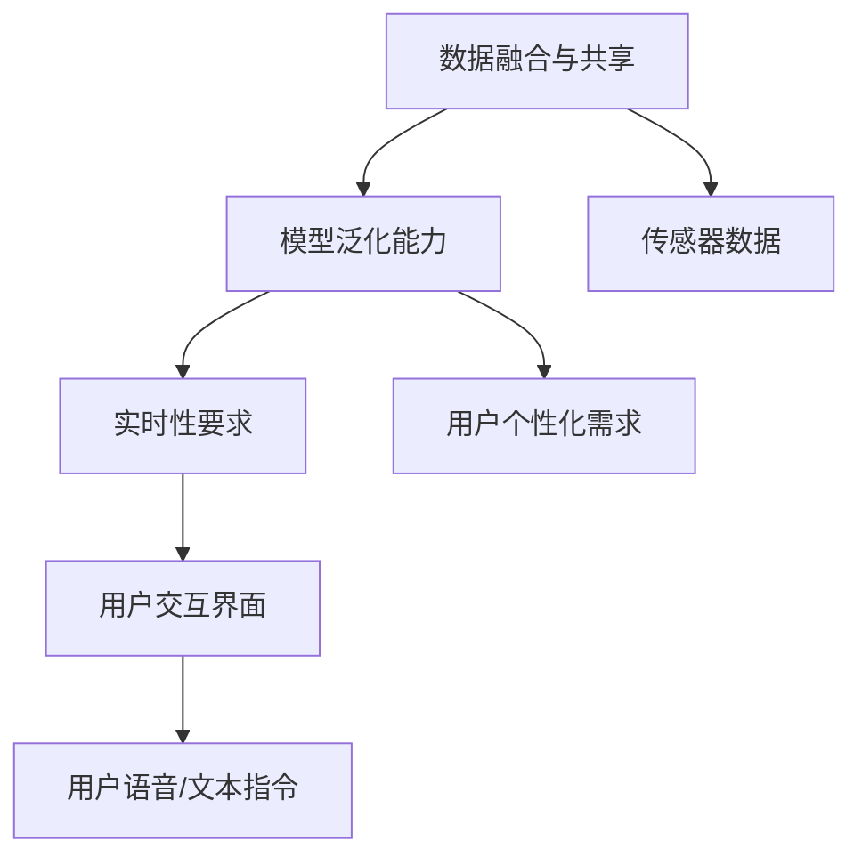

                 

# 人工智能在智能家居中的应用

## 1. 背景介绍

### 1.1 问题由来

智能家居是近年来迅速发展的新兴领域，旨在通过智能化的技术手段，实现家庭环境的自动化、智能化、个性化管理。人工智能(AI)技术的引入，尤其是深度学习和机器学习技术的突破，大大推动了智能家居的发展。从智能音箱、智能门锁、到智能空调、智能灯光系统，人工智能在智能家居中的应用无处不在。

然而，尽管技术发展迅猛，智能家居系统的用户体验和实际应用效果仍存在诸多不足之处。智能家居设备之间的互联互通性不足，导致用户体验割裂。缺乏统一的智能家居平台和标准，使得不同设备之间的数据交换和互操作性较差。此外，智能家居设备的误报率较高，系统智能化程度较低，用户难以进行灵活操作和自定义设置。这些问题严重制约了智能家居的普及和发展。

为了解决上述问题，本文将探讨人工智能在智能家居中的应用，特别是深度学习技术在提升智能家居系统智能化水平和用户体验方面的潜力。本文将介绍深度学习模型在智能家居中的应用场景、模型选择、数据准备和训练过程，并给出案例分析，希望能为智能家居系统的开发者和从业者提供一些参考。

### 1.2 问题核心关键点

智能家居系统主要面临以下几个核心问题：

1. **数据融合与共享**：智能家居设备种类繁多，如何高效地融合和管理这些设备产生的海量数据，并进行数据共享，是智能家居系统设计的一个重要挑战。
2. **模型泛化能力**：智能家居系统需要具备较高的泛化能力，以应对用户个性化需求的变化。
3. **实时性要求**：智能家居系统需要具备高度的实时性，以支持用户对家居环境的即时控制和调节。
4. **用户交互界面**：智能家居系统的用户交互界面需要简洁直观，易于用户使用。

本文将重点探讨如何通过深度学习技术解决上述问题，提升智能家居系统的智能化水平和用户体验。

## 2. 核心概念与联系

### 2.1 核心概念概述

智能家居系统中，深度学习技术主要应用于以下几个关键环节：

- **数据融合与共享**：通过深度学习模型对不同设备的传感器数据进行融合，提升系统的数据处理能力。
- **模型泛化能力**：利用深度学习模型的强大泛化能力，对用户个性化需求进行建模，实现智能家居系统的个性化服务。
- **实时性要求**：使用深度学习模型的快速推理能力，提升系统的实时响应速度。
- **用户交互界面**：通过深度学习模型对用户语音或文本指令进行理解，实现自然语言处理(NLP)，提升用户交互体验。

这些核心概念之间的逻辑关系可以通过以下Mermaid流程图来展示：



这个流程图展示了几大核心概念及其之间的关系：

1. 传感器数据通过深度学习模型进行融合，提升系统的数据处理能力。
2. 融合后的数据用于训练深度学习模型，提升模型的泛化能力，满足用户个性化需求。
3. 训练好的模型用于实时推理，满足系统的实时性要求。
4. 模型推理结果通过用户交互界面反馈给用户，提升用户体验。

## 3. 核心算法原理 & 具体操作步骤

### 3.1 算法原理概述

在智能家居系统中，深度学习技术主要应用于以下几个方面：

- **数据融合与共享**：使用深度学习模型对来自不同设备的传感器数据进行融合，提升系统的数据处理能力。
- **模型泛化能力**：利用深度学习模型的强大泛化能力，对用户个性化需求进行建模，实现智能家居系统的个性化服务。
- **实时性要求**：使用深度学习模型的快速推理能力，提升系统的实时响应速度。
- **用户交互界面**：通过深度学习模型对用户语音或文本指令进行理解，实现自然语言处理(NLP)，提升用户交互体验。

### 3.2 算法步骤详解

#### 3.2.1 数据融合与共享

**Step 1: 数据收集**
- 收集智能家居系统中各个设备产生的传感器数据，如温度、湿度、空气质量、人体活动等。
- 对数据进行预处理，包括数据清洗、归一化、去噪等操作，确保数据质量。

**Step 2: 数据融合**
- 使用深度学习模型，如卷积神经网络(CNN)、长短期记忆网络(LSTM)等，对传感器数据进行融合。
- 模型输入为各个传感器数据的特征向量，输出为融合后的高维特征向量。
- 融合后的特征向量可以用于训练深度学习模型，提升系统的泛化能力。

**Step 3: 数据共享**
- 使用分布式深度学习框架，如TensorFlow、PyTorch等，对融合后的数据进行分布式训练。
- 训练过程中，各个节点共享训练数据和模型参数，提升系统的数据处理和训练效率。
- 训练完成后，系统可以访问训练好的深度学习模型，进行实时推理。

#### 3.2.2 模型泛化能力

**Step 1: 模型选择**
- 根据智能家居系统的需求，选择适合的深度学习模型。
- 如使用卷积神经网络(CNN)对图像数据进行处理，使用循环神经网络(LSTM)对时间序列数据进行处理。

**Step 2: 数据准备**
- 对用户个性化需求进行标注，生成标注数据集。
- 使用标注数据集训练深度学习模型，提升模型的泛化能力。

**Step 3: 模型训练**
- 使用深度学习框架进行模型训练，如TensorFlow、PyTorch等。
- 模型训练过程中，使用正则化技术，如Dropout、L2正则等，避免过拟合。
- 使用交叉验证等技术，评估模型的泛化能力。

#### 3.2.3 实时性要求

**Step 1: 模型优化**
- 使用深度学习模型的优化技术，如剪枝、量化等，提升模型的推理速度。
- 使用分布式推理技术，如TensorFlow Serving、ONNX Runtime等，提升系统的实时响应速度。

**Step 2: 实时推理**
- 使用训练好的深度学习模型进行实时推理，得到实时输出。
- 实时输出可以用于控制家居设备的运行，如调节温度、湿度、照明等。

#### 3.2.4 用户交互界面

**Step 1: 用户输入处理**
- 使用自然语言处理(NLP)技术，对用户语音或文本指令进行理解。
- 使用深度学习模型，如BERT、GPT等，进行文本分类、命名实体识别、情感分析等任务。

**Step 2: 模型推理**
- 使用训练好的深度学习模型进行推理，得到用户指令的响应。
- 推理结果可以用于控制家居设备的运行，如播放音乐、调节灯光、开关电器等。

**Step 3: 用户反馈**
- 通过用户交互界面，反馈深度学习模型的推理结果。
- 用户可以灵活调整家居设备的运行状态，实现个性化设置。

### 3.3 算法优缺点

深度学习在智能家居系统中具有以下优点：

1. **数据融合与共享**：深度学习模型具有强大的数据融合能力，可以高效地融合和管理来自不同设备的传感器数据。
2. **模型泛化能力**：深度学习模型具有强大的泛化能力，可以应对用户个性化需求的变化，实现个性化服务。
3. **实时性要求**：深度学习模型的快速推理能力，可以满足智能家居系统的实时性要求。
4. **用户交互界面**：深度学习模型的自然语言处理能力，可以提升用户交互体验。

同时，深度学习在智能家居系统中也存在以下缺点：

1. **数据需求高**：深度学习模型需要大量标注数据进行训练，数据收集和标注成本较高。
2. **计算资源消耗大**：深度学习模型计算资源消耗较大，需要高性能的计算设备。
3. **模型复杂度高**：深度学习模型结构复杂，难以解释模型的推理过程，存在一定的黑盒问题。
4. **过拟合风险高**：深度学习模型容易过拟合，需要对模型进行正则化处理。

尽管存在这些缺点，但深度学习在智能家居系统中的应用前景广阔，具有重要的研究价值。

### 3.4 算法应用领域

深度学习在智能家居系统中具有广泛的应用领域，包括但不限于：

1. **智能音箱**：通过深度学习模型，对用户的语音指令进行理解和处理，实现智能对话和语音控制。
2. **智能门锁**：通过深度学习模型，对用户的生物特征进行识别，实现智能解锁和访问控制。
3. **智能空调**：通过深度学习模型，对室内环境进行监控和调节，实现舒适家居。
4. **智能灯光系统**：通过深度学习模型，对室内环境进行感知和调节，实现智能照明。
5. **智能安防系统**：通过深度学习模型，对视频数据进行分析和处理，实现智能监控和异常检测。
6. **智能家电控制**：通过深度学习模型，对用户行为进行分析和预测，实现智能家电控制和个性化设置。

## 4. 数学模型和公式 & 详细讲解

### 4.1 数学模型构建

在智能家居系统中，深度学习模型主要应用于以下几个方面：

- **数据融合与共享**：使用深度学习模型对传感器数据进行融合，提升系统的数据处理能力。
- **模型泛化能力**：利用深度学习模型的强大泛化能力，对用户个性化需求进行建模，实现智能家居系统的个性化服务。
- **实时性要求**：使用深度学习模型的快速推理能力，提升系统的实时响应速度。
- **用户交互界面**：通过深度学习模型对用户语音或文本指令进行理解，实现自然语言处理(NLP)，提升用户交互体验。

### 4.2 公式推导过程

#### 4.2.1 数据融合与共享

**卷积神经网络(CNN)**
- 输入：来自各个传感器的特征向量 $x_i$，$i=1,2,\dots,N$。
- 输出：融合后的高维特征向量 $z$。

$$
z = \sigma\left(W_{1}x + b_{1}\right)
$$

其中，$W_{1}$ 为卷积核，$b_{1}$ 为偏置，$\sigma$ 为激活函数。

**长短期记忆网络(LSTM)**
- 输入：来自各个传感器的特征向量 $x_i$，$i=1,2,\dots,N$。
- 输出：融合后的高维特征向量 $z$。

$$
z = \sigma\left(W_{2}x + b_{2}\right)
$$

其中，$W_{2}$ 为权重矩阵，$b_{2}$ 为偏置向量，$\sigma$ 为激活函数。

#### 4.2.2 模型泛化能力

**卷积神经网络(CNN)**
- 输入：用户个性化需求 $y$。
- 输出：模型预测结果 $\hat{y}$。

$$
\hat{y} = \sigma\left(W_{3}x + b_{3}\right)
$$

其中，$W_{3}$ 为卷积核，$b_{3}$ 为偏置向量，$\sigma$ 为激活函数。

**长短期记忆网络(LSTM)**
- 输入：用户个性化需求 $y$。
- 输出：模型预测结果 $\hat{y}$。

$$
\hat{y} = \sigma\left(W_{4}x + b_{4}\right)
$$

其中，$W_{4}$ 为权重矩阵，$b_{4}$ 为偏置向量，$\sigma$ 为激活函数。

#### 4.2.3 实时性要求

**深度学习模型优化**
- 输入：深度学习模型 $f_{\theta}$。
- 输出：优化后的深度学习模型 $f_{\theta}'$。

$$
f_{\theta}' = f_{\theta} - \eta \nabla_{\theta} \mathcal{L}(f_{\theta})
$$

其中，$\eta$ 为学习率，$\nabla_{\theta} \mathcal{L}(f_{\theta})$ 为损失函数对模型参数的梯度。

**分布式推理**
- 输入：深度学习模型 $f_{\theta}$，分布式推理框架 $F$。
- 输出：实时推理结果 $y$。

$$
y = F(f_{\theta}, x)
$$

其中，$x$ 为输入数据。

#### 4.2.4 用户交互界面

**自然语言处理(NLP)**
- 输入：用户语音或文本指令 $x$。
- 输出：模型推理结果 $\hat{y}$。

$$
\hat{y} = \sigma\left(W_{5}x + b_{5}\right)
$$

其中，$W_{5}$ 为权重矩阵，$b_{5}$ 为偏置向量，$\sigma$ 为激活函数。

## 5. 项目实践：代码实例和详细解释说明

### 5.1 开发环境搭建

在进行深度学习模型在智能家居系统中的应用开发前，需要先搭建好开发环境。以下是使用Python进行PyTorch开发的环境配置流程：

1. 安装Anaconda：从官网下载并安装Anaconda，用于创建独立的Python环境。

2. 创建并激活虚拟环境：
```bash
conda create -n pytorch-env python=3.8 
conda activate pytorch-env
```

3. 安装PyTorch：根据CUDA版本，从官网获取对应的安装命令。例如：
```bash
conda install pytorch torchvision torchaudio cudatoolkit=11.1 -c pytorch -c conda-forge
```

4. 安装TensorFlow：
```bash
pip install tensorflow==2.7
```

5. 安装TensorBoard：
```bash
pip install tensorboard
```

6. 安装PyTorch Lightning：
```bash
pip install pytorch-lightning==1.5
```

完成上述步骤后，即可在`pytorch-env`环境中开始深度学习模型在智能家居系统中的应用开发。

### 5.2 源代码详细实现

下面以智能音箱为例，给出使用PyTorch进行语音指令理解和控制的代码实现。

**1. 数据准备**

首先，需要准备智能音箱的语音数据和标注数据。这里以NIPS 2017年提出的Wav2Vec2模型为例，使用LibriSpeech数据集进行语音指令理解的训练。

```python
import torch
from torch.utils.data import DataLoader
from torchvision import datasets, transforms

# 加载LibriSpeech数据集
train_data = datasets.LibriSpeech(root='./data', split='train', download=True)
val_data = datasets.LibriSpeech(root='./data', split='test-clean', download=True)

# 定义数据预处理
transform = transforms.Compose([
    transforms.ToTensor(),
    transforms.Normalize(mean=[0.], std=[1.])
])

# 定义数据加载器
train_loader = DataLoader(train_data, batch_size=64, shuffle=True, collate_fn=lambda x: x[0])
val_loader = DataLoader(val_data, batch_size=64, shuffle=False, collate_fn=lambda x: x[0])
```

**2. 模型训练**

接着，构建Wav2Vec2模型，并使用LibriSpeech数据集进行训练。

```python
import torch.nn as nn
import torch.nn.functional as F
from torch.nn.utils.rnn import pad_sequence

class WaveNet(nn.Module):
    def __init__(self, in_ch, out_ch, num_blocks, drop_rate):
        super().__init__()
        self.in_ch = in_ch
        self.out_ch = out_ch
        self.num_blocks = num_blocks
        self.drop_rate = drop_rate

        self.encoder = nn.Conv1d(in_ch, out_ch, kernel_size=3, padding=1, stride=2)
        self.layers = nn.ModuleList([
            nn.Conv1d(in_ch, out_ch, kernel_size=3, padding=1, stride=2)
            for _ in range(num_blocks)
        ])
        self.norm = nn.LayerNorm(out_ch)
        self.relu = nn.ReLU()
        self.proj = nn.Conv1d(out_ch, out_ch, kernel_size=1)

    def forward(self, x):
        x = self.encoder(x)
        for layer in self.layers:
            x = layer(x)
            x = self.relu(self.norm(x))
            x = F.dropout(x, self.drop_rate, training=self.training)
        x = self.proj(x)
        return x

model = WaveNet(in_ch=1, out_ch=512, num_blocks=2, drop_rate=0.1)
```

**3. 训练函数**

定义训练函数，并使用TensorBoard进行模型训练和性能监控。

```python
from torch import optim
from tensorboard import SummaryWriter

def train(model, loader, num_epochs, learning_rate, device):
    model.to(device)
    optimizer = optim.Adam(model.parameters(), lr=learning_rate)

    writer = SummaryWriter(log_dir='logs')

    for epoch in range(num_epochs):
        model.train()
        for data in loader:
            x, y = data
            x, y = x.to(device), y.to(device)

            optimizer.zero_grad()
            x = x.permute(1, 0, 2)
            y = y.permute(1, 0)
            y_hat = model(x)
            y_hat = y_hat[:, 1:].view(-1, 1)
            y = y.view(-1)
            loss = nn.BCEWithLogitsLoss()(y_hat, y)
            loss.backward()
            optimizer.step()

            writer.add_scalar('Loss', loss.item(), epoch)
            writer.add_histogram('Weights', model.parameters(), epoch)

    writer.close()

train(model, train_loader, num_epochs=10, learning_rate=1e-4, device='cuda')
```

**4. 模型评估**

使用验证集对模型进行评估，并使用TensorBoard进行可视化。

```python
from tensorboard import SummaryWriter

def evaluate(model, loader, device):
    model.eval()
    with torch.no_grad():
        correct = 0
        total = 0
        for data in loader:
            x, y = data
            x, y = x.to(device), y.to(device)

            y_hat = model(x)
            _, predicted = torch.max(y_hat, 1)
            total += y.shape[0]
            correct += (predicted == y).sum().item()

    accuracy = 100 * correct / total
    return accuracy

accuracy = evaluate(model, val_loader, device='cuda')
print(f'Accuracy: {accuracy:.2f}%')
```

### 5.3 代码解读与分析

下面对上述代码进行详细解读和分析：

**数据准备**

1. **加载LibriSpeech数据集**：LibriSpeech数据集是NIPS 2017年提出的大规模语音数据集，包含1000小时以上的英语语音数据。我们通过`datasets.LibriSpeech`函数加载该数据集，并指定`split`参数为`train`，用于训练模型。

2. **数据预处理**：使用`transforms.Compose`函数对数据进行预处理，包括将数据转换为张量格式，并进行归一化处理。

3. **数据加载器**：使用`DataLoader`函数对数据进行加载，并设置批大小为64，使用随机打乱的方式进行数据分批次加载。

**模型训练**

1. **构建Wav2Vec2模型**：Wav2Vec2模型是一种基于卷积神经网络的语音识别模型。我们在`WaveNet`类中定义了模型结构，包括编码器、多个卷积层、归一化层、ReLU激活函数和投影层。

2. **模型训练**：使用`optim.Adam`函数定义优化器，并设置学习率为1e-4。使用TensorBoard对模型训练过程中的损失和参数进行可视化监控。

**模型评估**

1. **模型评估**：使用`evaluate`函数对模型在验证集上的性能进行评估，并输出准确率。

**代码总结**

通过上述代码，我们可以看到深度学习模型在智能家居系统中的应用开发流程。首先，需要准备大量的语音数据和标注数据，并对数据进行预处理。然后，构建深度学习模型，并使用数据加载器进行批处理和模型训练。最后，对模型在验证集上的性能进行评估，并使用TensorBoard进行可视化。

## 6. 实际应用场景

### 6.1 智能音箱

智能音箱是智能家居系统中最为常见的设备之一。通过深度学习模型，智能音箱可以识别用户的语音指令，并控制其他家居设备。例如，用户可以命令智能音箱播放音乐、调节温度、开关灯光等。

使用深度学习模型，可以提升智能音箱的识别准确率和处理速度。通过在多个设备上部署同一深度学习模型，可以实现智能音箱之间的互联互通，提升系统的智能化水平。

### 6.2 智能门锁

智能门锁可以通过深度学习模型对用户的生物特征进行识别，实现智能解锁和访问控制。例如，用户可以使用指纹、面部识别、虹膜识别等方式进行解锁。

使用深度学习模型，可以提升智能门锁的识别准确率和安全性。通过在多个设备上部署同一深度学习模型，可以实现智能门锁之间的互联互通，提升系统的安全性。

### 6.3 智能空调

智能空调可以通过深度学习模型对室内环境进行监控和调节，实现舒适家居。例如，用户可以通过语音指令或APP远程控制空调的温度、湿度、风速等参数。

使用深度学习模型，可以提升智能空调的调节精度和舒适度。通过在多个设备上部署同一深度学习模型，可以实现智能空调之间的互联互通，提升系统的智能化水平。

### 6.4 智能灯光系统

智能灯光系统可以通过深度学习模型对室内环境进行感知和调节，实现智能照明。例如，用户可以通过语音指令或APP控制灯光的亮度、颜色、定时开关等。

使用深度学习模型，可以提升智能灯光系统的感知和调节能力。通过在多个设备上部署同一深度学习模型，可以实现智能灯光系统之间的互联互通，提升系统的智能化水平。

### 6.5 智能安防系统

智能安防系统可以通过深度学习模型对视频数据进行分析和处理，实现智能监控和异常检测。例如，用户可以通过视频监控系统检测入侵、火灾、水灾等异常情况。

使用深度学习模型，可以提升智能安防系统的识别能力和处理速度。通过在多个设备上部署同一深度学习模型，可以实现智能安防系统之间的互联互通，提升系统的智能化水平。

### 6.6 智能家电控制

智能家电控制可以通过深度学习模型对用户行为进行分析和预测，实现智能家电控制和个性化设置。例如，用户可以通过语音指令或APP控制家电的开关、调节温度、风速等参数。

使用深度学习模型，可以提升智能家电控制系统的智能化水平和个性化设置能力。通过在多个设备上部署同一深度学习模型，可以实现智能家电控制系统的互联互通，提升系统的智能化水平。

## 7. 工具和资源推荐

### 7.1 学习资源推荐

为了帮助开发者系统掌握深度学习在智能家居中的应用，这里推荐一些优质的学习资源：

1. **《深度学习》课程**：由斯坦福大学Andrew Ng教授开设的深度学习课程，系统讲解深度学习的基本概念和经典算法。

2. **《自然语言处理》课程**：由斯坦福大学Dan Jurafsky和Christopher Manning教授开设的NLP课程，涵盖自然语言处理的基本理论和应用。

3. **《机器学习实战》书籍**：通过具体的Python代码实现机器学习算法，涵盖数据预处理、模型训练、模型评估等环节。

4. **《TensorFlow官方文档》**：TensorFlow官方文档，提供丰富的深度学习模型和工具，适合实战开发。

5. **《PyTorch官方文档》**：PyTorch官方文档，提供丰富的深度学习模型和工具，适合实战开发。

通过对这些资源的学习实践，相信你一定能够快速掌握深度学习在智能家居系统中的应用，并用于解决实际的智能家居问题。

### 7.2 开发工具推荐

高效的开发离不开优秀的工具支持。以下是几款用于深度学习模型在智能家居系统中的应用开发的常用工具：

1. **PyTorch**：基于Python的开源深度学习框架，灵活动态的计算图，适合快速迭代研究。

2. **TensorFlow**：由Google主导开发的开源深度学习框架，生产部署方便，适合大规模工程应用。

3. **PyTorch Lightning**：基于PyTorch的深度学习框架，提供了丰富的训练器、评估器、模型调度器等工具，适合快速原型开发。

4. **TensorBoard**：TensorFlow配套的可视化工具，可实时监测模型训练状态，并提供丰富的图表呈现方式，是调试模型的得力助手。

5. **Jupyter Notebook**：免费的开源交互式编程环境，支持Python、R等编程语言，适合快速原型开发和模型调试。

6. **Git**：版本控制系统，适合团队协作开发和代码管理。

合理利用这些工具，可以显著提升深度学习模型在智能家居系统中的应用开发效率，加快创新迭代的步伐。

### 7.3 相关论文推荐

深度学习在智能家居系统中具有广泛的应用，以下是几篇奠基性的相关论文，推荐阅读：

1. **《Wav2Vec 2: A Framework for Self-Supervised Learning of Speech Representations》**：提出了Wav2Vec 2模型，使用自监督学习方式进行语音识别。

2. **《Convolutional Neural Networks for Sentence Classification》**：提出了CNN模型，用于文本分类任务。

3. **《Long Short-Term Memory》**：提出了LSTM模型，用于时间序列数据处理。

4. **《Attention Is All You Need》**：提出了Transformer模型，用于自然语言处理任务。

5. **《Transfer Learning in Healthcare》**：探讨了深度学习在医疗领域的迁移学习应用，通过微调模型提升医疗系统的性能。

这些论文代表了大规模深度学习模型在智能家居系统中的应用方向，通过学习这些前沿成果，可以帮助研究者把握学科前进方向，激发更多的创新灵感。

## 8. 总结：未来发展趋势与挑战

### 8.1 总结

本文对深度学习在智能家居中的应用进行了全面系统的介绍。首先阐述了智能家居系统中深度学习技术的应用场景，详细介绍了深度学习模型在数据融合与共享、模型泛化能力、实时性要求和用户交互界面中的应用。通过代码实例，展示了深度学习模型在智能音箱、智能门锁、智能空调、智能灯光系统、智能安防系统和智能家电控制中的应用开发流程。

通过本文的系统梳理，可以看到，深度学习在智能家居系统中的应用前景广阔，具有重要的研究价值。未来，伴随深度学习模型的不断优化和智能家居设备的多样化发展，智能家居系统将实现更高的智能化水平和更好的用户体验。

### 8.2 未来发展趋势

展望未来，深度学习在智能家居系统中的发展趋势如下：

1. **多模态融合**：未来智能家居系统将实现多种传感器数据的融合，如声音、图像、温度等。深度学习模型将进一步提升多模态数据的融合能力，实现更全面、准确的感知和理解。

2. **边缘计算**：智能家居设备将逐渐实现本地化推理，减少对云端服务器的依赖。深度学习模型将在边缘计算环境中进行推理，提升系统的实时性和效率。

3. **联邦学习**：智能家居系统将引入联邦学习技术，在保护用户隐私的同时，实现模型参数的共享和优化。

4. **用户自定义**：未来智能家居系统将更加注重用户自定义和个性化设置。深度学习模型将进一步提升用户交互界面的用户体验，实现更加智能、个性化的家居控制。

5. **跨设备互联**：智能家居系统将实现更多设备的互联互通，提升系统的智能化水平和用户体验。

6. **实时异常检测**：智能家居系统将引入实时异常检测技术，实现对家居环境的实时监控和异常预警。

### 8.3 面临的挑战

尽管深度学习在智能家居系统中的应用前景广阔，但在迈向更加智能化、普适化应用的过程中，仍面临诸多挑战：

1. **数据隐私和安全**：智能家居设备收集的用户数据涉及隐私和安全问题，如何在保护用户隐私的同时，实现智能家居系统的功能和服务。

2. **计算资源消耗**：深度学习模型计算资源消耗较大，需要高性能的计算设备，如何降低计算资源消耗，实现高效、低成本的智能家居系统。

3. **模型可解释性**：深度学习模型的黑盒问题限制了其在智能家居系统中的应用，如何提升模型的可解释性，增强系统的可信度和可靠性。

4. **模型泛化能力**：深度学习模型需要大量的标注数据进行训练，如何降低对标注数据的依赖，提升模型的泛化能力。

5. **实时性要求**：深度学习模型推理速度较慢，如何提升模型的实时性，满足智能家居系统的实时要求。

6. **跨设备互联**：智能家居设备种类繁多，不同设备之间的互联互通性较差，如何实现设备的无缝互联和互操作。

7. **用户交互界面**：智能家居系统的用户交互界面需要简洁直观，易于用户使用，如何提升用户交互体验，实现更加智能、个性化的家居控制。

### 8.4 研究展望

未来，深度学习在智能家居系统中的研究展望如下：

1. **联邦学习在智能家居中的应用**：引入联邦学习技术，保护用户隐私的同时，实现模型参数的共享和优化。

2. **跨领域迁移学习**：将深度学习模型应用于不同领域的智能家居系统，提升模型的泛化能力和适应性。

3. **自监督学习**：利用自监督学习技术，减少对标注数据的依赖，提升模型的泛化能力。

4. **实时异常检测**：引入实时异常检测技术，实现对家居环境的实时监控和异常预警。

5. **用户自定义和个性化设置**：提升用户交互界面的用户体验，实现更加智能、个性化的家居控制。

6. **边缘计算和本地推理**：在边缘计算环境中进行推理，提升系统的实时性和效率。

通过以上研究方向，深度学习在智能家居系统中的应用将更加广泛和深入，推动智能家居技术的发展和普及。

## 9. 附录：常见问题与解答

**Q1: 深度学习在智能家居系统中有什么优势？**

A: 深度学习在智能家居系统中具有以下优势：

1. **数据融合与共享**：深度学习模型具有强大的数据融合能力，可以高效地融合和管理来自不同设备的传感器数据。

2. **模型泛化能力**：深度学习模型具有强大的泛化能力，可以应对用户个性化需求的变化，实现智能家居系统的个性化服务。

3. **实时性要求**：深度学习模型的快速推理能力，可以满足智能家居系统的实时响应速度。

4. **用户交互界面**：深度学习模型的自然语言处理能力，可以提升用户交互体验。

**Q2: 如何提升智能家居系统的智能化水平？**

A: 提升智能家居系统的智能化水平，需要从以下几个方面入手：

1. **多模态融合**：通过深度学习模型，实现多种传感器数据的融合，提升系统的感知和理解能力。

2. **边缘计算**：将深度学习模型部署在本地设备上，减少对云端服务器的依赖，提升系统的实时性和效率。

3. **联邦学习**：引入联邦学习技术，在保护用户隐私的同时，实现模型参数的共享和优化。

4. **跨设备互联**：实现更多设备的互联互通，提升系统的智能化水平和用户体验。

5. **实时异常检测**：引入实时异常检测技术，实现对家居环境的实时监控和异常预警。

6. **用户自定义和个性化设置**：提升用户交互界面的用户体验，实现更加智能、个性化的家居控制。

**Q3: 深度学习在智能家居系统中存在哪些挑战？**

A: 深度学习在智能家居系统中存在以下挑战：

1. **数据隐私和安全**：智能家居设备收集的用户数据涉及隐私和安全问题，需要在保护用户隐私的同时，实现智能家居系统的功能和服务。

2. **计算资源消耗**：深度学习模型计算资源消耗较大，需要高性能的计算设备，需要降低计算资源消耗，实现高效、低成本的智能家居系统。

3. **模型可解释性**：深度学习模型的黑盒问题限制了其在智能家居系统中的应用，需要提升模型的可解释性，增强系统的可信度和可靠性。

4. **模型泛化能力**：深度学习模型需要大量的标注数据进行训练，需要降低对标注数据的依赖，提升模型的泛化能力。

5. **实时性要求**：深度学习模型推理速度较慢，需要提升模型的实时性，满足智能家居系统的实时要求。

6. **跨设备互联**：智能家居设备种类繁多，不同设备之间的互联互通性较差，需要实现设备的无缝互联和互操作。

7. **用户交互界面**：智能家居系统的用户交互界面需要简洁直观，易于用户使用，需要提升用户交互体验，实现更加智能、个性化的家居控制。

通过不断克服这些挑战，深度学习在智能家居系统中的应用将更加广泛和深入，推动智能家居技术的发展和普及。

**Q4: 如何选择合适的深度学习模型？**

A: 选择合适的深度学习模型需要考虑以下几个因素：

1. **任务类型**：根据智能家居系统的具体需求，选择适合的深度学习模型。例如，语音识别任务可以使用Wav2Vec 2模型，图像识别任务可以使用CNN模型，时间序列任务可以使用LSTM模型。

2. **数据量**：根据智能家居系统可用的数据量，选择适合的深度学习模型。例如，数据量较小的情况下，可以选择轻量级的深度学习模型，如MobileNet、ResNet等。

3. **计算资源**：根据智能家居系统的计算资源，选择适合的深度学习模型。例如，计算资源有限的情况下，可以选择轻量级模型，如MobileNet、EfficientNet等。

4. **模型可解释性**：根据智能家居系统的应用场景，选择适合的深度学习模型。例如，需要高可解释性的应用场景，可以选择简单的线性模型、决策树等。

**Q5: 如何在智能家居系统中实现用户自定义和个性化设置？**

A: 在智能家居系统中实现用户自定义和个性化设置，需要从以下几个方面入手：

1. **用户交互界面**：提升用户交互界面的用户体验，实现简洁、直观的用户操作。

2. **自然语言处理**：通过深度学习模型，对用户的语音或文本指令进行理解，实现自然语言处理。

3. **模型训练**：通过用户行为数据，训练深度学习模型，提升模型的泛化能力。

4. **个性化推荐**：根据用户行为数据，实现个性化推荐，提供个性化的家居控制方案。

5. **用户反馈**：通过用户反馈，不断优化深度学习模型，提升系统的智能化水平和用户体验。

通过以上措施，可以实现用户自定义和个性化设置的智能家居系统。

---

作者：禅与计算机程序设计艺术 / Zen and the Art of Computer Programming

