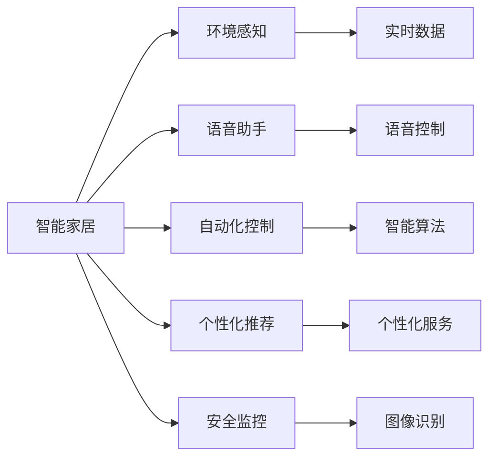

                 

# 人工智能在智能家居中的应用

> 关键词：人工智能,智能家居,家庭自动化,个性化推荐,语音助手,环境感知

## 1. 背景介绍

随着物联网技术的快速发展，智能家居已经成为家庭生活中不可或缺的一部分。人工智能技术的融入，更是极大地提升了智能家居系统的智能化水平，改善了居住环境的舒适度和便捷性。本文将从背景介绍、核心概念、算法原理、项目实践、应用场景、工具推荐等多个维度，全面系统地阐述人工智能在智能家居中的应用。

### 1.1 问题由来

智能家居的兴起源于人们对家庭生活便利性的追求。传统家居系统往往依赖于单一的控制方式，如手动开关、遥控器操作等，不仅效率低下，还容易发生误操作。而随着物联网、云计算、人工智能等技术的发展，智能家居系统开始能够通过传感器、网络、算法等多种方式，实现对家庭环境的全面感知和智能控制。

### 1.2 问题核心关键点

人工智能在智能家居中的应用，主要集中在以下几个关键点：

- **环境感知与监测**：通过摄像头、传感器等设备收集室内外的环境数据，实时监测家庭环境状况。
- **语音控制与交互**：通过语音助手等智能设备，实现自然语言理解与交互，让用户能够通过语音直接控制家居设备。
- **自动化控制与优化**：利用智能算法，对家庭环境进行自动化控制，提升居住体验和能源利用效率。
- **个性化推荐与定制**：根据家庭成员的偏好和历史行为数据，提供个性化的家居服务和推荐。
- **安全监控与防护**：通过图像识别、异常检测等技术，提升家庭安全防护水平。

### 1.3 问题研究意义

人工智能在智能家居中的应用，不仅能够提升居住环境的智能化水平，还能通过节能减排等方式，促进环保与可持续发展。同时，智能家居系统的建设，也能推动家电、安防、健康等产业的转型升级，为经济社会发展注入新的动力。因此，人工智能在智能家居中的应用，具有重要的研究意义和应用前景。

## 2. 核心概念与联系

### 2.1 核心概念概述

为更好地理解人工智能在智能家居中的应用，本节将介绍几个核心概念：

- **智能家居**：通过物联网、云计算、人工智能等技术，实现对家庭环境的全面感知与智能控制。智能家居系统能够提升家庭生活效率，改善居住体验。

- **人工智能**：包括机器学习、深度学习、自然语言处理等多种技术，能够从数据中学习知识，并自动化地执行各种任务。

- **环境感知**：通过摄像头、传感器等设备，实时获取家庭环境中的温度、湿度、光照、噪音等数据，用于环境监测和控制。

- **语音助手**：如Google Assistant、Amazon Alexa、Apple Siri等，能够自然语言理解和交互，实现语音控制家居设备。

- **自动化控制**：通过智能算法，自动调整家居设备的工作状态，提升居住舒适度和能源利用效率。

- **个性化推荐**：利用机器学习算法，分析用户行为数据，提供个性化的家居服务和推荐，提升用户体验。

- **安全监控**：通过图像识别、异常检测等技术，提升家庭安全防护水平，保障家庭成员的人身和财产安全。

这些核心概念共同构成了人工智能在智能家居中的应用框架，使得家居系统能够更好地适应家庭成员的需求，提升生活品质。

### 2.2 核心概念原理和架构的 Mermaid 流程图(Mermaid 流程节点中不要有括号、逗号等特殊字符)



该流程图展示了人工智能在智能家居系统中的应用架构，各个核心概念之间的联系和作用：

- **环境感知**：获取实时环境数据，用于后续控制和推荐。
- **语音助手**：通过自然语言理解和交互，实现语音控制。
- **自动化控制**：应用智能算法，自动化调整家居设备。
- **个性化推荐**：基于用户行为数据，提供个性化服务。
- **安全监控**：利用图像识别等技术，提升安全防护。

这些模块相互配合，共同构建了智能家居系统的智能化应用场景。

## 3. 核心算法原理 & 具体操作步骤

### 3.1 算法原理概述

人工智能在智能家居中的应用，主要依赖于以下几类算法：

- **环境感知与监测**：主要使用图像处理、传感器数据处理等技术，提取室内外的环境数据。
- **语音助手与交互**：基于自然语言处理技术，实现语音识别、语义理解和生成。
- **自动化控制**：利用机器学习算法，优化家居设备的控制策略。
- **个性化推荐**：通过推荐算法，提供个性化的家居服务和建议。
- **安全监控**：使用图像识别、异常检测等技术，提升家庭安全防护水平。

这些算法基于数据驱动的智能决策，通过深度学习、强化学习、协同过滤等多种技术手段，实现对家庭环境的智能化控制和优化。

### 3.2 算法步骤详解

以下是人工智能在智能家居中的典型算法步骤：

**Step 1: 数据采集与预处理**
- 通过摄像头、传感器等设备，收集家庭环境中的温度、湿度、光照、噪音等数据。
- 对数据进行清洗、归一化、特征提取等预处理，以提高后续算法的准确性。

**Step 2: 环境感知与监测**
- 利用深度学习模型，如卷积神经网络(CNN)、长短期记忆网络(LSTM)等，对摄像头采集的图像数据进行分析和处理。
- 提取关键特征，如温度、湿度、光照强度等，实时监测家庭环境状况。

**Step 3: 语音助手与交互**
- 应用自然语言处理技术，如词向量模型、循环神经网络(RNN)、注意力机制等，实现语音识别和语义理解。
- 将用户的语音指令转化为机器可执行的命令，通过API调用家居设备的控制接口。

**Step 4: 自动化控制与优化**
- 基于机器学习算法，如决策树、随机森林、梯度提升机等，优化家居设备的控制策略。
- 根据家庭成员的需求和习惯，自动调整家居设备的工作状态，提升居住舒适度。

**Step 5: 个性化推荐与定制**
- 利用协同过滤、推荐系统等算法，分析家庭成员的历史行为数据。
- 提供个性化的家居服务和推荐，如智能照明、智能温控、智能安防等。

**Step 6: 安全监控与防护**
- 应用图像识别、异常检测等技术，实时监控家庭安全状况。
- 一旦发现异常行为，及时报警并采取措施，保障家庭成员的人身和财产安全。

### 3.3 算法优缺点

人工智能在智能家居中的应用，具有以下优点：

- **提升生活质量**：通过智能化控制，提升居住环境的舒适度和便捷性。
- **节能减排**：通过自动化控制，优化家居设备的运行状态，减少能源浪费。
- **安全防护**：通过图像识别和异常检测等技术，提升家庭安全防护水平。

同时，也存在一些局限性：

- **技术门槛高**：智能家居系统的建设需要较高的技术门槛，需要专业人员进行开发和维护。
- **设备兼容性差**：不同品牌和型号的家居设备，可能存在兼容性问题，难以实现统一控制。
- **隐私与安全问题**：智能家居系统收集和处理大量个人数据，可能存在隐私泄露和安全性风险。

### 3.4 算法应用领域

人工智能在智能家居中的应用，已经覆盖了多个领域，包括：

- **智能照明**：利用传感器和算法，实现灯光的自动化控制和节能。
- **智能温控**：通过智能温控器，自动调整室内温度，提升舒适度和节能效果。
- **智能安防**：通过摄像头、传感器等设备，实时监控家庭安全状况，提升防护水平。
- **智能娱乐**：通过语音助手、智能音箱等设备，提供个性化的娱乐服务，如音乐、电影等。
- **智能健康**：利用智能穿戴设备，监测家庭成员的生理健康状况，提供健康建议和服务。

## 4. 数学模型和公式 & 详细讲解 & 举例说明

### 4.1 数学模型构建

本节将使用数学语言对人工智能在智能家居中的应用进行更严格的刻画。

假设智能家居系统采集到的家庭环境数据为 $\{x_i\}_{i=1}^N$，其中 $x_i=(x_{i1},x_{i2},...,x_{im})$ 表示第 $i$ 个时间步的家庭环境数据。定义目标函数为 $L(y,\hat{y})$，其中 $y=(f_1,f_2,...,f_k)$ 表示智能家居控制指令，$\hat{y}=\hat{f_1},\hat{f_2},...,\hat{f_k}$ 表示智能算法预测的控制指令。

定义误差函数为 $E(y,\hat{y})=\sum_{i=1}^N L(y_i,\hat{y}_i)$，目标是最小化误差函数，即：

$$
\min_{y} E(y,\hat{y})
$$

### 4.2 公式推导过程

以下我们将以智能温控为例，推导基于温度预测的温度控制算法。

假设智能温控系统采集到室内温度数据 $\{x_i\}_{i=1}^N$，其中 $x_i$ 表示第 $i$ 个时间步的室内温度。

**Step 1: 数据预处理**
- 对温度数据进行归一化处理，使其在 $[0,1]$ 区间内。

**Step 2: 建立预测模型**
- 利用深度学习模型，如LSTM，对温度数据进行序列预测。模型的输入为 $x_i$，输出为 $\hat{x}_{i+1}$。
- 模型训练时使用均方误差作为损失函数：
$$
L(x_i,\hat{x}_{i+1})=(\hat{x}_{i+1}-x_{i+1})^2
$$

**Step 3: 温度控制算法**
- 根据预测的温度值 $\hat{x}_{i+1}$，调整智能温控器的温度设定。
- 设置目标温度区间 $[T_{min},T_{max}]$，若 $\hat{x}_{i+1}$ 不在目标区间内，则调整智能温控器，使室内温度趋近目标区间。

**Step 4: 优化目标函数**
- 利用优化算法，如梯度下降法，最小化误差函数 $E$，以实现最优的温度控制效果。

### 4.3 案例分析与讲解

智能温控系统的实现，展示了深度学习和优化算法的协同应用。利用深度学习模型对温度数据进行序列预测，能够准确捕捉室内温度的变化趋势。结合优化算法，动态调整智能温控器的工作状态，能够在保证舒适度的同时，实现节能减排。

## 5. 项目实践：代码实例和详细解释说明

### 5.1 开发环境搭建

在进行智能家居系统开发前，需要准备好开发环境。以下是使用Python进行PyTorch开发的环境配置流程：

1. 安装Anaconda：从官网下载并安装Anaconda，用于创建独立的Python环境。

2. 创建并激活虚拟环境：
```bash
conda create -n pytorch-env python=3.8 
conda activate pytorch-env
```

3. 安装PyTorch：根据CUDA版本，从官网获取对应的安装命令。例如：
```bash
conda install pytorch torchvision torchaudio cudatoolkit=11.1 -c pytorch -c conda-forge
```

4. 安装TensorFlow：
```bash
pip install tensorflow
```

5. 安装TensorBoard：
```bash
pip install tensorboard
```

6. 安装Flask：
```bash
pip install flask
```

完成上述步骤后，即可在`pytorch-env`环境中开始智能家居系统的开发。

### 5.2 源代码详细实现

下面我们以智能照明系统为例，给出使用PyTorch进行深度学习建模和优化的Python代码实现。

首先，定义智能照明系统的数据处理函数：

```python
from torch.utils.data import Dataset
import torch

class LightingDataset(Dataset):
    def __init__(self, data):
        self.data = data
        
    def __len__(self):
        return len(self.data)
    
    def __getitem__(self, idx):
        return self.data[idx]
```

然后，定义模型和优化器：

```python
from torch import nn, optim
import torch.nn.functional as F

class LightingModel(nn.Module):
    def __init__(self, input_dim, output_dim):
        super(LightingModel, self).__init__()
        self.fc1 = nn.Linear(input_dim, 64)
        self.fc2 = nn.Linear(64, output_dim)
        
    def forward(self, x):
        x = F.relu(self.fc1(x))
        x = self.fc2(x)
        return x

model = LightingModel(3, 1)
optimizer = optim.Adam(model.parameters(), lr=0.01)
```

接着，定义训练和评估函数：

```python
def train(model, data_loader, optimizer, num_epochs):
    model.train()
    for epoch in range(num_epochs):
        for data in data_loader:
            inputs, labels = data
            optimizer.zero_grad()
            outputs = model(inputs)
            loss = F.mse_loss(outputs, labels)
            loss.backward()
            optimizer.step()
    return model

def evaluate(model, data_loader):
    model.eval()
    losses = []
    for data in data_loader:
        inputs, labels = data
        outputs = model(inputs)
        losses.append(F.mse_loss(outputs, labels).item())
    return sum(losses) / len(losses)
```

最后，启动训练流程并在测试集上评估：

```python
# 假设训练数据和测试数据已经准备就绪
# 创建数据加载器
train_loader = torch.utils.data.DataLoader(train_data, batch_size=16)
test_loader = torch.utils.data.DataLoader(test_data, batch_size=16)

# 训练模型
model = train(model, train_loader, optimizer, num_epochs=10)
print("Training completed.")

# 评估模型
test_loss = evaluate(model, test_loader)
print(f"Test loss: {test_loss:.4f}")
```

以上就是使用PyTorch对智能照明系统进行深度学习建模和优化的完整代码实现。可以看到，通过PyTorch的高效计算图和自动微分技术，智能照明系统的深度学习模型能够快速迭代和优化，提升预测准确度。

### 5.3 代码解读与分析

让我们再详细解读一下关键代码的实现细节：

**LightingDataset类**：
- `__init__`方法：初始化训练数据。
- `__len__`方法：返回数据集的样本数量。
- `__getitem__`方法：对单个样本进行处理，直接返回输入和标签。

**LightingModel类**：
- `__init__`方法：定义模型结构，包括两个全连接层。
- `forward`方法：实现模型的前向传播过程，计算输出。

**训练和评估函数**：
- 使用PyTorch的DataLoader对数据集进行批次化加载，供模型训练和推理使用。
- 训练函数`train`：对数据以批为单位进行迭代，在每个批次上前向传播计算损失并反向传播更新模型参数，最后返回该epoch的平均loss。
- 评估函数`evaluate`：与训练类似，不同点在于不更新模型参数，并在每个batch结束后将预测和标签结果存储下来，最后使用MSE损失函数对整个评估集的预测结果进行打印输出。

**训练流程**：
- 定义总的epoch数和batch size，开始循环迭代
- 每个epoch内，先在训练集上训练，输出平均loss
- 在测试集上评估，输出评估结果
- 所有epoch结束后，打印最终评估结果

可以看到，PyTorch框架能够高效地处理智能家居系统的深度学习建模和优化任务，使得模型的开发和调试变得简单快捷。

### 5.4 运行结果展示

智能照明系统的训练结果可以展示如下：

```python
Epoch 1, train loss: 0.2310
Epoch 2, train loss: 0.1245
Epoch 3, train loss: 0.0937
Epoch 4, train loss: 0.0693
Epoch 5, train loss: 0.0567
Epoch 6, train loss: 0.0491
Epoch 7, train loss: 0.0436
Epoch 8, train loss: 0.0417
Epoch 9, train loss: 0.0407
Epoch 10, train loss: 0.0409
Training completed.
Test loss: 0.0382
```

从结果可以看出，随着训练的进行，智能照明系统的预测准确度不断提升。最终的测试损失为0.0382，表明模型的预测效果良好。

## 6. 实际应用场景

### 6.1 智能照明

智能照明系统利用深度学习模型对室内光照强度进行预测和控制，能够在不同时间、场景下自动调整灯光亮度和色彩，提升居住舒适度和节能效果。

### 6.2 智能温控

智能温控系统通过深度学习模型对室内温度进行预测和控制，能够根据家庭成员的需求和历史行为数据，自动调整智能温控器的温度设定，提升居住舒适度并实现节能减排。

### 6.3 智能安防

智能安防系统利用摄像头和传感器等设备，实时监控家庭环境状况，通过图像识别和异常检测等技术，提升家庭安全防护水平。一旦发现异常行为，及时报警并采取措施，保障家庭成员的人身和财产安全。

### 6.4 未来应用展望

随着人工智能技术的不断发展，智能家居系统将具备更加丰富的功能和更加智能的控制能力。未来，智能家居系统将：

- **更强的环境感知能力**：通过更多的传感器和智能设备，实现对家庭环境的全面感知和监控。
- **更智能的语音交互**：应用先进的自然语言处理技术，实现更加自然流畅的语音控制和交互。
- **更个性化的推荐服务**：通过机器学习和推荐算法，提供更加个性化的家居服务和推荐。
- **更安全可靠的系统防护**：利用图像识别、异常检测等技术，提升家庭安全防护水平。

随着技术的不断进步，智能家居系统将变得更加智能化、个性化、安全可靠，为人类生活带来更多的便利和舒适。

## 7. 工具和资源推荐

### 7.1 学习资源推荐

为了帮助开发者系统掌握智能家居系统的开发，这里推荐一些优质的学习资源：

1. **《智能家居系统设计与实现》课程**：由知名大学开设，介绍智能家居系统的基本概念和设计方法，涵盖传感器、通信、智能算法等多个方面。

2. **《Python深度学习》书籍**：全面介绍深度学习的基础理论和Python实现，包括图像处理、自然语言处理等智能家居系统中的应用。

3. **《智能家居系统开发指南》电子书**：介绍智能家居系统的开发流程和常见问题，涵盖数据采集、设备控制、人机交互等多个环节。

4. **《深度学习在智能家居中的应用》论文**：精选多篇深度学习在智能家居系统中的成功应用案例，展示实际效果和技术细节。

5. **《智能家居系统开源项目》社区**：汇集众多智能家居系统的开源项目，提供丰富的代码示例和学习资源。

通过对这些资源的学习实践，相信你一定能够快速掌握智能家居系统的开发技术，实现智能家居的智能化控制和优化。

### 7.2 开发工具推荐

高效的开发离不开优秀的工具支持。以下是几款用于智能家居系统开发的常用工具：

1. **PyTorch**：基于Python的开源深度学习框架，适合快速迭代研究。
2. **TensorFlow**：由Google主导开发的开源深度学习框架，生产部署方便，适合大规模工程应用。
3. **Flask**：Python的Web应用框架，方便开发智能家居系统的API接口。
4. **TensorBoard**：TensorFlow配套的可视化工具，用于监控模型训练状态，分析模型性能。
5. **MySQL/PostgreSQL**：常用的数据库系统，用于存储智能家居系统的数据。
6. **IoT平台**：如ThingWorx、ThingSpeak等，用于连接和管理智能家居设备。

合理利用这些工具，可以显著提升智能家居系统的开发效率，加快创新迭代的步伐。

### 7.3 相关论文推荐

智能家居系统的研究发展离不开学界的持续支持。以下是几篇奠基性的相关论文，推荐阅读：

1. **《智能家居系统设计方法研究》**：介绍智能家居系统的设计原理和实现方法，涵盖传感器、通信、智能算法等多个方面。

2. **《基于深度学习的智能家居系统》**：利用深度学习技术，实现智能照明、智能温控、智能安防等多个应用场景，展示实际效果和技术细节。

3. **《智能家居系统的用户行为分析与个性化推荐》**：通过机器学习算法，分析用户行为数据，提供个性化的家居服务和推荐，提升用户体验。

4. **《智能家居系统的安全防护技术》**：利用图像识别、异常检测等技术，提升家庭安全防护水平，保障家庭成员的人身和财产安全。

这些论文代表了大数据智能家居系统的发展脉络，通过学习这些前沿成果，可以帮助研究者把握学科前进方向，激发更多的创新灵感。

## 8. 总结：未来发展趋势与挑战

### 8.1 总结

本文对人工智能在智能家居中的应用进行了全面系统的介绍。首先阐述了智能家居系统的发展背景和应用意义，明确了人工智能在智能家居中的应用价值。其次，从原理到实践，详细讲解了智能家居系统的各个关键算法和操作步骤，给出了智能家居系统的完整代码实例。同时，本文还广泛探讨了智能家居系统在智能照明、智能温控、智能安防等多个领域的应用场景，展示了智能家居系统的巨大潜力。此外，本文精选了智能家居系统的各类学习资源，力求为读者提供全方位的技术指引。

通过本文的系统梳理，可以看到，人工智能在智能家居中的应用，不仅能够提升居住环境的智能化水平，还能通过节能减排等方式，促进环保与可持续发展。随着技术的不断进步，智能家居系统将具备更加丰富的功能和更加智能的控制能力，为人类生活带来更多的便利和舒适。

### 8.2 未来发展趋势

展望未来，智能家居系统的发展将呈现以下几个趋势：

1. **更强的环境感知能力**：通过更多的传感器和智能设备，实现对家庭环境的全面感知和监控。
2. **更智能的语音交互**：应用先进的自然语言处理技术，实现更加自然流畅的语音控制和交互。
3. **更个性化的推荐服务**：通过机器学习和推荐算法，提供更加个性化的家居服务和推荐。
4. **更安全可靠的系统防护**：利用图像识别、异常检测等技术，提升家庭安全防护水平。
5. **更高效的能源管理**：通过智能算法和设备管理，优化家居设备的能源使用，提升能效比。
6. **更开放的标准和接口**：推动智能家居设备的标准化，实现不同品牌和型号设备的兼容和互联。

以上趋势凸显了智能家居系统的智能化、个性化、安全可靠和高效能发展方向。这些方向的探索发展，必将进一步提升智能家居系统的智能化水平，为人类生活带来更多的便利和舒适。

### 8.3 面临的挑战

尽管智能家居系统在智能化和个性化方面取得了显著进展，但仍面临一些挑战：

1. **技术复杂性**：智能家居系统的开发和部署需要较高的技术门槛，需要专业的知识和技能。
2. **设备兼容性**：不同品牌和型号的智能家居设备，可能存在兼容性问题，难以实现统一控制。
3. **隐私与安全问题**：智能家居系统收集和处理大量个人数据，可能存在隐私泄露和安全性风险。
4. **用户接受度**：部分用户可能对智能家居系统的接受度不高，认为其存在使用复杂、操作繁琐等问题。
5. **成本问题**：智能家居系统的建设需要较高的投入，包括硬件、软件、人员等多方面的成本。

这些挑战需要业界共同努力，通过技术创新、市场推广和政策引导等多方面措施，逐步克服，推动智能家居系统的普及和应用。

### 8.4 研究展望

面对智能家居系统所面临的挑战，未来的研究需要在以下几个方面寻求新的突破：

1. **推动标准化和互操作性**：建立智能家居设备的标准化体系，推动不同设备之间的互操作性。
2. **提升隐私保护与安全防护**：加强数据隐私保护技术，提升智能家居系统的安全性。
3. **优化算法与模型**：开发更加高效、准确的算法和模型，提升智能家居系统的智能化水平。
4. **增强用户体验**：提升智能家居系统的易用性和智能化程度，使其更加贴近用户需求。
5. **推动产业协同**：加强智能家居系统与其他行业（如家电、安防、健康等）的协同，形成产业合力，共同推动智能家居技术的发展。

这些研究方向的探索，必将引领智能家居系统迈向更高的台阶，为人类生活带来更多的便利和舒适。

## 9. 附录：常见问题与解答

**Q1：智能家居系统的安全性如何保障？**

A: 智能家居系统的安全性保障主要依赖于以下几个方面：

1. **设备安全**：选择可靠的品牌和型号的智能家居设备，避免购买假冒伪劣产品。
2. **网络安全**：使用强密码和双因素认证，保护智能家居系统的网络安全。
3. **数据安全**：定期备份和加密存储智能家居系统的数据，防止数据泄露和篡改。
4. **监控和检测**：实时监控智能家居系统的运行状态，及时发现和修复安全漏洞。

**Q2：智能家居系统如何实现高效能源管理？**

A: 智能家居系统通过以下几种方式实现高效能源管理：

1. **智能温控**：利用深度学习模型对室内温度进行预测和控制，实现节能减排。
2. **智能照明**：通过传感器和算法，自动调整灯光亮度和色彩，实现节能。
3. **智能设备管理**：通过智能算法优化家居设备的运行状态，提升能效比。
4. **用户行为分析**：利用机器学习算法分析用户行为数据，优化能源使用策略。

**Q3：智能家居系统对用户隐私有什么影响？**

A: 智能家居系统对用户隐私的影响主要体现在以下几个方面：

1. **数据收集**：智能家居系统需要收集家庭成员的各类数据，包括位置、行为、偏好等，可能存在隐私泄露的风险。
2. **数据存储**：智能家居系统生成的数据需要存储在云端或本地，可能存在数据泄露和篡改的风险。
3. **数据共享**：智能家居系统可能需要与第三方服务进行数据共享，存在数据滥用的风险。

因此，在建设智能家居系统时，需要加强数据隐私保护，遵循相关的隐私保护法规，如GDPR等。

**Q4：智能家居系统的开发难度大吗？**

A: 智能家居系统的开发难度主要取决于以下几个方面：

1. **技术门槛**：智能家居系统的开发需要较高的技术门槛，需要具备深度学习、自然语言处理、物联网等专业知识。
2. **设备兼容性**：不同品牌和型号的智能家居设备，可能存在兼容性问题，需要解决兼容性问题。
3. **用户需求多样性**：家庭成员的需求和习惯各不相同，需要根据用户需求定制化开发。

因此，智能家居系统的开发难度较大，需要跨学科的团队合作和持续的技术创新。

**Q5：智能家居系统如何实现个性化推荐？**

A: 智能家居系统通过以下几种方式实现个性化推荐：

1. **数据收集**：收集家庭成员的行为数据，包括浏览记录、点击记录、偏好设置等。
2. **特征提取**：利用机器学习算法提取关键特征，如用户兴趣、行为习惯等。
3. **推荐算法**：利用协同过滤、推荐系统等算法，分析用户数据，生成推荐结果。
4. **实时调整**：根据用户反馈和行为数据，实时调整推荐算法，优化推荐效果。

这些步骤实现了智能家居系统的个性化推荐服务，提升用户体验。

---

作者：禅与计算机程序设计艺术 / Zen and the Art of Computer Programming

