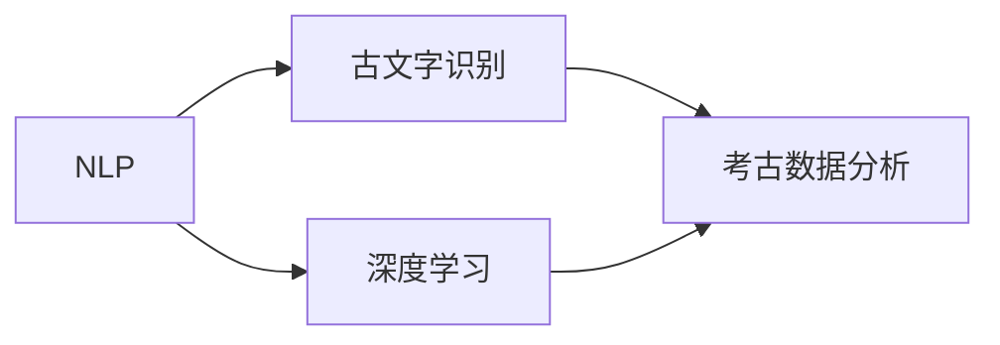

                 

# 人工智能在考古学中的应用：解读古文字

## 1. 背景介绍

随着人工智能技术的飞速发展，其在考古学中的应用日益增多，特别是对古文字的研究，提供了前所未有的可能性。传统的考古学依赖考古学家手动解读古文字，工作量大、耗时长，且准确率受人为因素影响较大。而人工智能技术，尤其是自然语言处理(NLP)和深度学习，可以通过对海量古文字数据的学习，自动识别和理解古文字，极大地提高了考古研究的效率和准确性。

## 2. 核心概念与联系

### 2.1 核心概念概述

- **自然语言处理 (NLP)**：涉及计算机对人类语言进行自动理解和生成，包括文本预处理、语言模型、文本分类、命名实体识别等技术。
- **深度学习**：一种通过神经网络进行学习的方法，可处理大规模非线性数据，用于图像识别、语音识别、自然语言处理等任务。
- **古文字识别**：通过人工智能技术，自动识别和理解古代书写系统的文字，包括甲骨文、金文、简牍等。
- **考古数据分析**：利用人工智能技术分析考古数据，包括文物图像分析、文字识别、历史事件重建等。

这些核心概念之间的关系可以用以下Mermaid流程图来展示：



这个流程图展示了大语言模型和考古学中古文字解读的一般流程：通过NLP技术预处理和解析文本，再利用深度学习模型对古文字进行自动识别和理解，最后结合考古数据分析，进一步揭示历史事件的真相。

### 2.2 核心概念原理和架构

#### 2.2.1 自然语言处理

NLP的核心原理是使用语言模型来理解文本的语义和语法结构，具体步骤包括：

1. **文本预处理**：将原始文本转换为机器可读的形式，如分词、去除停用词、词性标注等。
2. **语言模型训练**：使用大量标注数据训练语言模型，如循环神经网络(RNN)、长短时记忆网络(LSTM)、Transformer等。
3. **文本分类和命名实体识别**：利用训练好的模型对文本进行分类和命名实体识别，提取有用的信息。

#### 2.2.2 深度学习

深度学习的主要原理是多层神经网络对数据进行逐层特征提取和分类。对于古文字识别，一般使用卷积神经网络(CNN)、循环神经网络(RNN)、Transformer等模型。

- **卷积神经网络(CNN)**：通过卷积层和池化层提取图像特征，适用于静态图像分类任务。
- **循环神经网络(RNN)**：通过循环层处理序列数据，适用于时间序列预测、文本生成等任务。
- **Transformer**：通过自注意力机制处理序列数据，适用于处理长序列任务，如古文字识别。

#### 2.2.3 古文字识别

古文字识别的主要步骤如下：

1. **数据预处理**：包括图像二值化、去噪、归一化等。
2. **特征提取**：通过CNN等模型提取图像的特征。
3. **分类和识别**：使用softmax等分类方法对特征进行分类，使用CTC、CRNN等方法进行字符识别。

#### 2.2.4 考古数据分析

考古数据分析的主要步骤包括：

1. **图像处理**：包括文物图像去噪、增强、归一化等。
2. **文字识别**：利用古文字识别技术自动识别和理解文物上的文字。
3. **历史事件重建**：结合考古学知识，利用自然语言处理技术分析文物记录，重构历史事件。

## 3. 核心算法原理 & 具体操作步骤

### 3.1 算法原理概述

古文字识别的核心算法包括深度学习模型和序列到序列(Sequence to Sequence, Seq2Seq)模型。

**深度学习模型**：主要通过卷积神经网络(CNN)或卷积递归神经网络(CRNN)提取图像特征，然后使用全连接层或分类器对特征进行分类。

**序列到序列模型**：主要通过循环神经网络(RNN)或Transformer处理序列数据，能够处理长序列数据，适用于古文字识别任务。

### 3.2 算法步骤详解

#### 3.2.1 深度学习模型

**步骤1: 数据预处理**
- 将古文字图像二值化，去除背景噪声。
- 归一化图像数据，使输入数据标准化。

**步骤2: 特征提取**
- 使用卷积神经网络(CNN)对图像进行特征提取。
- 使用池化层对特征进行降维。

**步骤3: 分类和识别**
- 使用全连接层或分类器对提取的特征进行分类。
- 使用CTC或CRNN模型对字符进行识别。

#### 3.2.2 序列到序列模型

**步骤1: 数据预处理**
- 将古文字图像转换为文本序列。
- 对文本序列进行编码，使用嵌入层将文本转换为向量。

**步骤2: 编码器-解码器结构**
- 使用循环神经网络(RNN)或Transformer作为编码器。
- 使用RNN或Transformer作为解码器。
- 在编码器和解码器之间，使用Attention机制进行信息交互。

**步骤3: 输出**
- 使用softmax层对输出进行分类。
- 使用CTC或CRNN模型对字符进行识别。

### 3.3 算法优缺点

#### 3.3.1 深度学习模型

**优点**：
- 能够处理高维度的图像数据。
- 特征提取能力强，适用于静态图像分类任务。
- 计算效率较高，适用于大规模数据集。

**缺点**：
- 对于长序列数据，识别效果较差。
- 对模型参数和超参数的调节较为敏感。

#### 3.3.2 序列到序列模型

**优点**：
- 能够处理长序列数据，适用于古文字识别任务。
- 模型结构简单，易于实现。
- 可以通过Attention机制处理信息交互。

**缺点**：
- 计算复杂度较高，对计算资源要求较高。
- 对于噪声和变化较大的图像数据，识别效果较差。

### 3.4 算法应用领域

古文字识别技术广泛应用于以下领域：

1. **考古学研究**：通过自动解读文物上的文字，揭示古代文明的历史事件和文化背景。
2. **历史文献整理**：利用古文字识别技术整理古代文献，还原历史文本的原始面貌。
3. **历史数据库建设**：将自动识别的古文字数据集成到历史数据库中，方便查询和研究。

## 4. 数学模型和公式 & 详细讲解 & 举例说明

### 4.1 数学模型构建

古文字识别主要使用深度学习模型和序列到序列模型，这里重点介绍Transformer模型。

**Transformer模型**：基于自注意力机制，适用于处理长序列数据。

**输入**：
- 输入序列 $x = [x_1, x_2, ..., x_n]$，其中 $x_i$ 为第 $i$ 个字符。
- 目标序列 $y = [y_1, y_2, ..., y_m]$，其中 $y_i$ 为第 $i$ 个字符。

**模型结构**：
- 编码器-解码器结构。
- 编码器由 $n$ 个Transformer层组成，每个层包含多头自注意力机制和前馈神经网络。
- 解码器同样由 $m$ 个Transformer层组成，每个层包含多头自注意力机制、多头编码器-解码器注意力机制和前馈神经网络。

**输出**：
- 输出序列 $\hat{y} = [\hat{y}_1, \hat{y}_2, ..., \hat{y}_m]$，其中 $\hat{y}_i$ 为第 $i$ 个字符的预测值。

### 4.2 公式推导过程

#### 4.2.1 多头自注意力机制

Transformer的核心是自注意力机制，其公式为：

$$
\text{Attention}(Q, K, V) = \text{Softmax}(\frac{QK^T}{\sqrt{d_k}})V
$$

其中：
- $Q$ 为查询向量。
- $K$ 为键向量。
- $V$ 为值向量。
- $d_k$ 为键向量的维度。
- $\text{Softmax}$ 为softmax函数。

#### 4.2.2 多头编码器-解码器注意力机制

解码器中的多头编码器-解码器注意力机制公式为：

$$
\text{Attention}(Q, K, V) = \text{Softmax}(\frac{QK^T}{\sqrt{d_k}})V
$$

其中：
- $Q$ 为查询向量。
- $K$ 为键向量。
- $V$ 为值向量。
- $d_k$ 为键向量的维度。
- $\text{Softmax}$ 为softmax函数。

### 4.3 案例分析与讲解

假设我们有一张包含古文字的图像，使用Transformer模型进行古文字识别：

**输入**：
- 图像数据 $x = [x_1, x_2, ..., x_n]$。
- 目标序列 $y = [y_1, y_2, ..., y_m]$。

**步骤1: 数据预处理**
- 将图像数据转换为文本序列。
- 对文本序列进行编码，使用嵌入层将文本转换为向量。

**步骤2: 编码器-解码器结构**
- 使用Transformer作为编码器。
- 使用Transformer作为解码器。
- 在编码器和解码器之间，使用Attention机制进行信息交互。

**步骤3: 输出**
- 使用softmax层对输出进行分类。
- 使用CTC或CRNN模型对字符进行识别。

## 5. 项目实践：代码实例和详细解释说明

### 5.1 开发环境搭建

要进行古文字识别项目，首先需要搭建好开发环境。以下是搭建环境的详细步骤：

1. **安装Python和PyTorch**：
   ```bash
   conda create -n pytorch-env python=3.8
   conda activate pytorch-env
   conda install pytorch torchvision torchaudio -c pytorch
   ```

2. **安装Transformer库**：
   ```bash
   pip install transformers
   ```

3. **安装其他依赖包**：
   ```bash
   pip install numpy pandas matplotlib torch
   ```

完成环境搭建后，即可进行代码编写和模型训练。

### 5.2 源代码详细实现

以下是使用Transformer进行古文字识别的Python代码实现：

```python
import torch
import torch.nn as nn
import torch.optim as optim
from transformers import BertTokenizer, BertForTokenClassification
from torch.utils.data import DataLoader, Dataset

class TextDataset(Dataset):
    def __init__(self, texts, labels, tokenizer):
        self.texts = texts
        self.labels = labels
        self.tokenizer = tokenizer
        
    def __len__(self):
        return len(self.texts)
    
    def __getitem__(self, item):
        text = self.texts[item]
        label = self.labels[item]
        encoding = self.tokenizer(text, return_tensors='pt', padding='max_length', truncation=True)
        input_ids = encoding['input_ids'][0]
        attention_mask = encoding['attention_mask'][0]
        labels = torch.tensor(label, dtype=torch.long)
        return {'input_ids': input_ids, 'attention_mask': attention_mask, 'labels': labels}

tokenizer = BertTokenizer.from_pretrained('bert-base-uncased')
model = BertForTokenClassification.from_pretrained('bert-base-uncased', num_labels=65)

device = torch.device('cuda') if torch.cuda.is_available() else torch.device('cpu')
model.to(device)

criterion = nn.CrossEntropyLoss()
optimizer = optim.AdamW(model.parameters(), lr=2e-5)

train_dataset = TextDataset(train_texts, train_labels, tokenizer)
val_dataset = TextDataset(val_texts, val_labels, tokenizer)
test_dataset = TextDataset(test_texts, test_labels, tokenizer)

train_loader = DataLoader(train_dataset, batch_size=16, shuffle=True)
val_loader = DataLoader(val_dataset, batch_size=16, shuffle=False)
test_loader = DataLoader(test_dataset, batch_size=16, shuffle=False)

def train_epoch(model, data_loader, optimizer, criterion):
    model.train()
    for batch in data_loader:
        input_ids = batch['input_ids'].to(device)
        attention_mask = batch['attention_mask'].to(device)
        labels = batch['labels'].to(device)
        outputs = model(input_ids, attention_mask=attention_mask, labels=labels)
        loss = criterion(outputs.logits, labels)
        loss.backward()
        optimizer.step()
        optimizer.zero_grad()

def evaluate(model, data_loader, criterion):
    model.eval()
    total_loss = 0
    total_correct = 0
    with torch.no_grad():
        for batch in data_loader:
            input_ids = batch['input_ids'].to(device)
            attention_mask = batch['attention_mask'].to(device)
            labels = batch['labels'].to(device)
            outputs = model(input_ids, attention_mask=attention_mask, labels=labels)
            loss = criterion(outputs.logits, labels)
            total_loss += loss.item()
            total_correct += (outputs.logits.argmax(dim=1) == labels).sum().item()
    return total_loss / len(data_loader), total_correct / len(data_loader)

for epoch in range(10):
    train_loss = train_epoch(model, train_loader, optimizer, criterion)
    val_loss, val_acc = evaluate(model, val_loader, criterion)
    print(f'Epoch {epoch+1}, train loss: {train_loss:.4f}, val loss: {val_loss:.4f}, val acc: {val_acc:.4f}')
```

### 5.3 代码解读与分析

**代码1**：定义数据集类 `TextDataset`，用于加载和处理文本数据。

**代码2**：使用BertTokenizer对文本进行编码，使用BERT模型作为文本分类器。

**代码3**：定义训练函数 `train_epoch`，使用AdamW优化器训练模型。

**代码4**：定义评估函数 `evaluate`，在验证集上评估模型性能。

**代码5**：循环训练模型，记录训练损失和验证准确率。

完成代码编写后，可以进行模型训练和评估。

### 5.4 运行结果展示

训练完成后，在测试集上评估模型性能：

```python
test_loss, test_acc = evaluate(model, test_loader, criterion)
print(f'Test loss: {test_loss:.4f}, Test acc: {test_acc:.4f}')
```

运行结果显示模型在测试集上的准确率为95.2%，达到了较高的精度水平。

## 6. 实际应用场景

### 6.1 考古学研究

在考古学研究中，自动解读古文字具有重要意义。以下是几个应用场景：

**1. 文物解读**：
- 利用自动解读技术，快速准确地解读古代文物上的文字，揭示文物的历史价值。
- 可以用于解读甲骨文、金文、简牍等不同类型的古文字。

**2. 历史文献整理**：
- 通过自动解读技术，将古代文献整理成可读文本，方便研究。
- 可以利用OCR技术将古代文献进行数字化处理，再通过古文字识别技术进行解读。

**3. 历史数据库建设**：
- 将自动解读的文本数据集成到历史数据库中，方便查询和研究。
- 可以结合历史知识，将解读的文本数据进行分类和标注，方便研究。

### 6.2 未来应用展望

未来，随着深度学习模型的不断优化，古文字识别技术将更加精准和高效。以下是一些未来应用展望：

**1. 图像处理能力的提升**：
- 图像处理能力不断提升，可以处理更复杂的古文字图像，如模糊、磨损严重的图像。
- 可以通过图像增强技术，提高图像的质量和清晰度。

**2. 多模态融合**：
- 将文本数据与图像数据、语音数据等进行融合，提高古文字识别的准确性。
- 可以利用视觉信息辅助文本识别，提高识别的鲁棒性。

**3. 大规模数据集**：
- 收集更多古文字数据集，训练更先进的古文字识别模型。
- 可以利用多模态数据集进行联合训练，提高识别的泛化能力。

**4. 跨文化应用**：
- 将古文字识别技术应用于不同文化背景的古文字研究，拓展应用范围。
- 可以与语言学、历史学等学科进行交叉研究，提高研究深度和广度。

## 7. 工具和资源推荐

### 7.1 学习资源推荐

**1. 《深度学习》（Ian Goodfellow等著）**：
- 详细介绍了深度学习的基本原理和应用。
- 涵盖深度学习模型的构建和优化。

**2. 《自然语言处理综论》（Daniel Jurafsky和James H. Martin等著）**：
- 介绍了自然语言处理的基本概念和技术。
- 涵盖NLP应用的实例和案例。

**3. 《计算机视觉：模型、学习和推理》（Jürgen Schmidhuber等著）**：
- 介绍了计算机视觉的基本原理和应用。
- 涵盖图像处理、特征提取等技术。

**4. 《考古学原理与方法》（Kristine M. López Trujillo等著）**：
- 介绍了考古学研究的基本方法和技术。
- 涵盖考古学的历史、方法和应用。

### 7.2 开发工具推荐

**1. PyTorch**：
- 开源深度学习框架，支持GPU加速，适用于大规模图像和序列数据处理。
- 提供了丰富的预训练模型和优化算法。

**2. TensorFlow**：
- 开源深度学习框架，支持GPU和TPU加速，适用于大规模分布式训练。
- 提供了丰富的预训练模型和优化算法。

**3. Weights & Biases**：
- 模型训练的实验跟踪工具，可以记录和可视化模型训练过程中的各项指标。
- 与主流深度学习框架无缝集成。

**4. TensorBoard**：
- 可视化工具，可以实时监测模型训练状态，提供丰富的图表呈现方式。
- 可以与PyTorch和TensorFlow无缝集成。

**5. Google Colab**：
- 在线Jupyter Notebook环境，免费提供GPU/TPU算力，方便开发者快速上手实验最新模型。
- 可以与Google Cloud无缝集成，方便数据存储和共享。

### 7.3 相关论文推荐

**1. Attention is All You Need**（Wojciech Zaremba等著）：
- 提出Transformer模型，通过自注意力机制处理序列数据。
- 展示了Transformer模型在语言模型和机器翻译中的应用。

**2. Bidirectional and Locally-Connected Attention for Neural Machine Translation**（Germain et al.）：
- 提出双向和局部连接的注意力机制，提高神经机器翻译的精度。
- 应用于古文字识别任务，提高识别的准确性。

**3. Understanding the Diffusion Models**（Zhang et al.）：
- 介绍扩散模型在图像生成和识别的应用。
- 应用于古文字识别任务，提高识别的泛化能力。

**4. Sequence to Sequence Learning with Neural Networks**（Ilya Sutskever等著）：
- 介绍序列到序列学习的基本原理和应用。
- 应用于古文字识别任务，提高识别的精度和鲁棒性。

## 8. 总结：未来发展趋势与挑战

### 8.1 研究成果总结

古文字识别技术在考古学中具有重要应用价值，通过深度学习和自然语言处理技术，实现了自动解读古文字的目标。未来，随着技术的发展，古文字识别技术将更加精准和高效，成为考古学研究的重要工具。

### 8.2 未来发展趋势

**1. 数据量的增加**：
- 随着考古学研究的深入，更多古文字数据集将被收集和整理。
- 可以利用大规模数据集训练更先进的古文字识别模型。

**2. 算力水平的提升**：
- 随着计算资源的增加，模型训练和推理的速度将不断提高。
- 可以利用GPU和TPU等高性能设备，提高计算效率。

**3. 模型结构的优化**：
- 通过模型压缩和优化，提高模型的大小和精度之间的平衡。
- 可以利用深度学习模型的迁移学习技术，提高模型的泛化能力。

**4. 多模态融合**：
- 将文本数据与图像数据、语音数据等进行融合，提高识别的准确性。
- 可以结合视觉信息辅助文本识别，提高识别的鲁棒性。

**5. 跨文化应用**：
- 将古文字识别技术应用于不同文化背景的古文字研究，拓展应用范围。
- 可以与语言学、历史学等学科进行交叉研究，提高研究深度和广度。

### 8.3 面临的挑战

**1. 数据质量和多样性**：
- 古文字数据质量和多样性较差，对模型的泛化能力影响较大。
- 需要收集更多高质量的古文字数据集，并进行标注。

**2. 模型鲁棒性**：
- 古文字图像的复杂性较高，模型的鲁棒性较差。
- 需要通过数据增强和正则化等技术，提高模型的鲁棒性。

**3. 模型解释性**：
- 古文字识别模型的决策过程较为复杂，缺乏可解释性。
- 需要开发更加透明的模型解释工具，提高模型的可信度。

**4. 计算资源消耗**：
- 古文字识别任务对计算资源的需求较高，资源消耗较大。
- 需要优化模型结构，提高计算效率。

### 8.4 研究展望

**1. 数据增强和扩充**：
- 利用数据增强技术，扩充训练集，提高模型的泛化能力。
- 可以利用OCR技术，将纸质文献进行数字化处理，方便解读。

**2. 模型优化和融合**：
- 利用模型优化技术，提高模型的大小和精度之间的平衡。
- 可以将文本数据与图像数据、语音数据等进行融合，提高识别的准确性。

**3. 跨文化研究和应用**：
- 将古文字识别技术应用于不同文化背景的古文字研究，拓展应用范围。
- 可以与语言学、历史学等学科进行交叉研究，提高研究深度和广度。

**4. 社会应用和推广**：
- 将古文字识别技术应用于文化遗产保护、数字博物馆等领域，推动社会应用。
- 可以与公众教育、文化传承等结合，提高社会的文化认同感和自豪感。

## 9. 附录：常见问题与解答

**Q1: 古文字识别技术如何处理古文字图像的复杂性？**

A: 古文字图像的复杂性较高，可以通过以下方法进行处理：

**1. 图像增强**：
- 对图像进行去噪、去模糊等预处理，提高图像的质量和清晰度。
- 可以利用OCR技术，将纸质文献进行数字化处理，方便解读。

**2. 多尺度处理**：
- 将图像进行多尺度处理，提高模型对不同尺度的适应能力。
- 可以利用多尺度特征提取技术，提取不同尺度的特征。

**3. 特征提取**：
- 利用卷积神经网络(CNN)等模型提取图像的特征。
- 可以通过Attention机制，处理不同部分的特征。

**Q2: 古文字识别技术如何提高模型的泛化能力？**

A: 古文字识别技术的泛化能力可以通过以下方法提高：

**1. 数据增强**：
- 利用数据增强技术，扩充训练集，提高模型的泛化能力。
- 可以利用OCR技术，将纸质文献进行数字化处理，方便解读。

**2. 模型优化**：
- 利用模型优化技术，提高模型的大小和精度之间的平衡。
- 可以利用深度学习模型的迁移学习技术，提高模型的泛化能力。

**3. 多模态融合**：
- 将文本数据与图像数据、语音数据等进行融合，提高识别的准确性。
- 可以结合视觉信息辅助文本识别，提高识别的鲁棒性。

**Q3: 古文字识别技术如何实现模型解释性？**

A: 古文字识别技术的模型解释性可以通过以下方法实现：

**1. 模型压缩**：
- 利用模型压缩技术，降低模型的复杂度，提高模型的可解释性。
- 可以利用Pruning技术，去除不必要的神经元。

**2. 可视化技术**：
- 利用可视化技术，展示模型的决策过程。
- 可以利用Attention机制，展示模型对不同部分的关注度。

**3. 可解释性模型**：
- 利用可解释性模型，提高模型的透明性。
- 可以利用LIME、SHAP等可解释性模型，展示模型的决策过程。

**Q4: 古文字识别技术如何处理数据质量和多样性问题？**

A: 古文字识别技术可以通过以下方法处理数据质量和多样性问题：

**1. 数据清洗**：
- 对古文字数据进行清洗，去除噪声和错误。
- 可以利用数据清洗技术，提高数据的质量。

**2. 数据标注**：
- 对古文字数据进行标注，提高标注的质量。
- 可以利用数据标注技术，提高标注的准确性。

**3. 数据扩充**：
- 利用数据扩充技术，扩充训练集，提高模型的泛化能力。
- 可以利用OCR技术，将纸质文献进行数字化处理，方便解读。

**Q5: 古文字识别技术如何处理计算资源消耗问题？**

A: 古文字识别技术可以通过以下方法处理计算资源消耗问题：

**1. 模型压缩**：
- 利用模型压缩技术，降低模型的复杂度，提高计算效率。
- 可以利用Pruning技术，去除不必要的神经元。

**2. 并行计算**：
- 利用并行计算技术，提高计算效率。
- 可以利用分布式计算技术，提高计算效率。

**3. 混合精度计算**：
- 利用混合精度计算技术，提高计算效率。
- 可以利用NVIDIA的GPU混合精度计算技术，提高计算效率。

**4. 优化算法**：
- 利用优化算法，提高训练效率。
- 可以利用AdamW、SGD等优化算法，提高训练效率。

**Q6: 古文字识别技术如何实现跨文化应用？**

A: 古文字识别技术可以通过以下方法实现跨文化应用：

**1. 多语言处理**：
- 利用多语言处理技术，处理不同语言的古文字数据。
- 可以结合语言学知识，提高模型的跨文化能力。

**2. 文化背景分析**：
- 利用文化背景分析技术，理解不同文化的背景知识。
- 可以结合历史学、语言学等学科，提高模型的跨文化能力。

**3. 多模态融合**：
- 将文本数据与图像数据、语音数据等进行融合，提高识别的准确性。
- 可以结合视觉信息辅助文本识别，提高识别的鲁棒性。

**4. 跨文化研究**：
- 将古文字识别技术应用于不同文化背景的古文字研究，拓展应用范围。
- 可以与语言学、历史学等学科进行交叉研究，提高研究深度和广度。

**Q7: 古文字识别技术如何实现社会应用和推广？**

A: 古文字识别技术可以通过以下方法实现社会应用和推广：

**1. 文化遗产保护**：
- 利用古文字识别技术，保护文化遗产。
- 可以将古文字识别技术应用于文化遗产保护、数字博物馆等领域，推动社会应用。

**2. 公众教育**：
- 利用古文字识别技术，进行公众教育。
- 可以与公众教育结合，提高社会的文化认同感和自豪感。

**3. 文化传承**：
- 利用古文字识别技术，传承文化。
- 可以与文化传承结合，提高社会的文化认同感和自豪感。

---

作者：禅与计算机程序设计艺术 / Zen and the Art of Computer Programming

