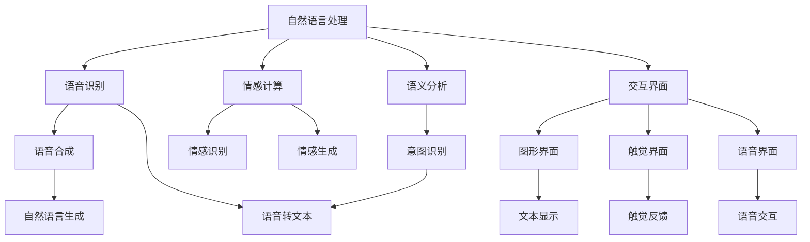

                 

# 人机交互：未来趋势与展望

> 关键词：人机交互, 自然语言处理, 情感计算, 机器人, 虚拟现实, 增强现实

## 1. 背景介绍

### 1.1 问题由来
随着人工智能技术的飞速发展，人机交互（Human-Computer Interaction, HCI）正在经历前所未有的变革。从简单的命令执行到复杂的自然语言理解和情感识别，再到动态的视觉和触觉交互，人机交互的方式和范畴都在不断扩展。未来，人机交互技术将成为连接智能设备和人类感官的关键桥梁，改变人们的生活和工作方式。

在过去十年间，我们见证了智能助理、语音识别、虚拟现实（Virtual Reality, VR）和增强现实（Augmented Reality, AR）等技术的兴起，它们极大地丰富了人机交互的手段和体验。然而，这些技术虽然带来了便利，但同时也暴露出新的挑战，如隐私保护、可访问性和适应性等。因此，研究未来的人机交互趋势和挑战，显得尤为重要。

### 1.2 问题核心关键点
未来人机交互的关键在于如何更自然、更高效地实现信息交换和情感交流。具体来说，包括以下几个方面：

- **自然语言理解**：如何让机器能够真正理解人类语言中的细微差别和隐含意义，并提供更精准的响应。
- **情感计算**：如何通过面部表情、语音、文本等手段识别和理解用户的情绪状态，实现更加个性化和情感化的交互。
- **多模态交互**：如何整合视觉、听觉、触觉等多种感官信息，提供更丰富和生动的交互体验。
- **实时性**：如何实现高效的实时交互，确保响应的即时性和流畅性。
- **可访问性**：如何让不同年龄、性别、身体状况的用户都能平等地使用和享受人机交互技术。
- **隐私保护**：如何在交互过程中保护用户的隐私，防止数据泄露和滥用。

### 1.3 问题研究意义
研究未来人机交互的趋势和挑战，对于提升用户体验、促进技术进步和推动社会和谐具有重要意义：

- **用户体验提升**：自然、高效的人机交互技术能够增强用户的满意度，提升工作效率和生活质量。
- **技术进步推动**：人机交互技术的进步能够促进其他领域的技术创新，如智能助理、自动驾驶、智能家居等。
- **社会和谐促进**：公平、易用的人机交互技术能够减少数字鸿沟，推动社会包容性和和谐共生。
- **商业价值巨大**：人机交互技术的广泛应用将带来巨大的商业价值，推动企业创新和市场竞争。

## 2. 核心概念与联系

### 2.1 核心概念概述

为更好地理解未来人机交互的趋势和挑战，本节将介绍几个关键概念：

- **自然语言处理（Natural Language Processing, NLP）**：让计算机能够理解、解释和生成自然语言的技术，包括语音识别、语义分析、情感识别等。
- **情感计算（Affective Computing）**：研究如何通过计算手段识别、理解和生成情感，提升人机交互的情感共鸣和亲和力。
- **机器人（Robots）**：能够执行人类指令，进行自主决策和复杂任务的自动化设备。
- **虚拟现实（VR）**：通过计算机生成的三维虚拟环境，提供沉浸式的人机交互体验。
- **增强现实（AR）**：将虚拟信息叠加到现实世界中，提供混合现实的人机交互体验。
- **交互界面（Interaction Interface）**：包括图形界面、触觉界面、语音界面等，提供人机交互的物理媒介。

这些核心概念之间的联系和相互作用可以通过以下Mermaid流程图来展示：



这个流程图展示了自然语言处理、情感计算和交互界面如何共同作用，实现多模态的人机交互。其中，自然语言处理负责语言理解和生成，情感计算负责情感识别和生成，交互界面负责提供具体的物理交互方式。

## 3. 核心算法原理 & 具体操作步骤
### 3.1 算法原理概述

未来人机交互的核心算法原理包括以下几个方面：

- **自然语言处理**：使用机器学习、深度学习等技术，对自然语言进行分词、句法分析、语义理解、情感识别等处理，使机器能够理解人类的语言表达。
- **情感计算**：利用面部识别、语音分析、文本挖掘等技术，识别用户的情绪状态，并根据情绪状态调整交互方式和内容。
- **机器人交互**：设计机器人感知、决策和动作模型，实现机器人与用户的自然对话和交互。
- **虚拟现实和增强现实**：通过三维建模、实时渲染等技术，构建虚拟或混合现实环境，提供沉浸式交互体验。

### 3.2 算法步骤详解

未来人机交互的算法步骤一般包括以下几个关键环节：

1. **数据采集与预处理**：收集用户的数据，包括语音、文本、面部表情等，并进行清洗、标准化和特征提取。
2. **模型训练与优化**：使用机器学习算法对数据进行训练，优化模型的参数和结构，使其能够准确识别用户意图和情感。
3. **交互界面设计**：设计直观、易用的交互界面，支持多种输入和输出方式，如触摸屏、语音、手势等。
4. **用户交互与反馈**：在实际应用中，用户通过交互界面进行输入，系统根据输入提供响应，并收集用户的反馈数据，进一步优化模型。
5. **系统集成与测试**：将各个模块集成到完整的系统中，进行全面测试，确保系统的稳定性和可靠性。

### 3.3 算法优缺点

未来人机交互的算法具有以下优点：

- **用户友好**：自然、高效的人机交互能够提升用户体验，减少操作复杂度。
- **情感共鸣**：情感计算技术能够识别用户的情绪状态，提供更加个性化的交互内容。
- **多模态融合**：通过整合视觉、听觉、触觉等多模态信息，提供更加丰富和生动的交互体验。
- **实时响应**：高效的数据处理和计算能力能够实现实时交互，提高交互的流畅性。

然而，这些算法也存在一些缺点：

- **数据隐私问题**：采集和处理用户数据时，需要重视隐私保护，防止数据泄露和滥用。
- **复杂度高**：多模态交互和情感计算需要处理大量的数据和复杂的计算模型，增加了系统的复杂度。
- **适应性不足**：当前技术在适应不同用户需求和文化背景方面，仍存在一定的局限性。

### 3.4 算法应用领域

未来人机交互的算法已在多个领域得到应用，包括但不限于：

- **智能助理**：如Siri、Alexa、Google Assistant等，通过自然语言处理和情感计算，提供个性化的智能服务。
- **自动驾驶**：如特斯拉Autopilot、Waymo等，通过情感计算和虚拟现实技术，提高驾驶安全和舒适性。
- **智能家居**：如Amazon Echo、Google Nest等，通过多模态交互和实时反馈，提供智能化的生活服务。
- **医疗健康**：如虚拟康复机器人、智能穿戴设备等，通过情感识别和交互界面设计，提高医疗服务的个性化和可达性。
- **教育培训**：如智能教室、虚拟实验室等，通过自然语言处理和情感计算，提供个性化的学习体验。
- **娱乐互动**：如虚拟现实游戏、增强现实应用等，通过沉浸式交互体验，提供创新的娱乐方式。

## 4. 数学模型和公式 & 详细讲解 & 举例说明

### 4.1 数学模型构建

为了更好地理解未来人机交互的数学模型和算法，我们将以情感计算为例，介绍其数学模型的构建和公式推导。

假设用户面部表情、语音和文本数据分别为$X_f$、$X_v$和$X_t$，情感标签为$Y$。使用神经网络进行情感计算的模型可以表示为：

$$
Y = f(X_f, X_v, X_t; \theta)
$$

其中$f$为情感计算模型，$\theta$为模型参数。假设$Y$为二分类问题，即情绪状态为正面或负面，则情感计算模型可以进一步表示为：

$$
Y = \sigma(\mathbf{w}^T \cdot \mathbf{z} + b)
$$

其中$\sigma$为激活函数，$\mathbf{w}$为权重向量，$\mathbf{z}$为输入向量。

### 4.2 公式推导过程

情感计算模型的推导过程如下：

首先，对输入数据进行预处理，包括归一化、降维等操作。假设预处理后的面部表情特征向量为$\mathbf{z}_f$，语音特征向量为$\mathbf{z}_v$，文本特征向量为$\mathbf{z}_t$，则输入向量$\mathbf{z}$可以表示为：

$$
\mathbf{z} = (\mathbf{z}_f, \mathbf{z}_v, \mathbf{z}_t)^T
$$

接下来，对输入向量进行加权求和，得到特征向量$\mathbf{z}$的加权表示：

$$
\mathbf{z}^* = \mathbf{w} \cdot \mathbf{z} = (\mathbf{w}_f \cdot \mathbf{z}_f, \mathbf{w}_v \cdot \mathbf{z}_v, \mathbf{w}_t \cdot \mathbf{z}_t)^T
$$

然后，将加权表示$\mathbf{z}^*$与偏置项$b$进行线性变换，并通过激活函数$\sigma$得到情感标签的预测值：

$$
Y = \sigma(\mathbf{w}^T \cdot \mathbf{z}^* + b)
$$

其中$\sigma$可以采用ReLU、Sigmoid等激活函数，$b$为偏置项。

### 4.3 案例分析与讲解

以Facebook的Emotion API为例，其情感计算模型使用了多层次卷积神经网络（Convolutional Neural Network, CNN）进行情感识别。具体步骤如下：

1. **数据采集**：从用户提交的面部表情、语音和文本数据中，提取出特征向量。
2. **模型训练**：使用大量的标注数据训练卷积神经网络，优化权重向量$\mathbf{w}$和偏置项$b$。
3. **情感识别**：将用户输入的数据通过预处理后，输入训练好的模型，输出情感标签。
4. **用户反馈**：收集用户的反馈数据，进一步优化模型参数。

Facebook的Emotion API通过情感计算技术，帮助用户识别和管理自己的情绪状态，提高了社交媒体的互动性和用户体验。

## 5. 项目实践：代码实例和详细解释说明
### 5.1 开发环境搭建

在进行人机交互开发前，我们需要准备好开发环境。以下是使用Python进行TensorFlow开发的环境配置流程：

1. 安装Anaconda：从官网下载并安装Anaconda，用于创建独立的Python环境。

2. 创建并激活虚拟环境：
```bash
conda create -n tf-env python=3.8 
conda activate tf-env
```

3. 安装TensorFlow：根据CUDA版本，从官网获取对应的安装命令。例如：
```bash
conda install tensorflow-gpu -c conda-forge
```

4. 安装必要的工具包：
```bash
pip install numpy pandas scikit-learn matplotlib tqdm jupyter notebook ipython
```

完成上述步骤后，即可在`tf-env`环境中开始项目实践。

### 5.2 源代码详细实现

下面我们以情感计算为例，给出使用TensorFlow进行情感识别的PyTorch代码实现。

首先，定义情感计算的模型：

```python
import tensorflow as tf
from tensorflow.keras import layers

def build_model(input_shape):
    model = tf.keras.Sequential()
    model.add(layers.Dense(64, activation='relu', input_shape=input_shape))
    model.add(layers.Dense(64, activation='relu'))
    model.add(layers.Dense(1, activation='sigmoid'))
    return model
```

然后，定义数据处理和模型训练函数：

```python
def preprocess_data(data):
    # 数据预处理，包括归一化、降维等操作
    # ...

def train_model(model, data_train, data_val, epochs, batch_size):
    model.compile(optimizer=tf.keras.optimizers.Adam(learning_rate=0.001),
                  loss=tf.keras.losses.BinaryCrossentropy(from_logits=True),
                  metrics=[tf.keras.metrics.BinaryAccuracy(name='accuracy')])
    model.fit(data_train, epochs=epochs, batch_size=batch_size, validation_data=data_val)
```

最后，启动情感计算模型的训练和评估：

```python
model = build_model(input_shape=(input_shape,))
train_model(model, data_train, data_val, epochs=100, batch_size=32)

# 在测试集上评估模型
test_data = preprocess_data(data_test)
test_labels = preprocess_data(data_test)
test_loss, test_acc = model.evaluate(test_data, test_labels, batch_size=32)
print(f'Test loss: {test_loss}, Test accuracy: {test_acc}')
```

以上就是使用TensorFlow进行情感计算项目的完整代码实现。可以看到，TensorFlow的高级API使得情感计算的模型构建和训练变得非常简单高效。

### 5.3 代码解读与分析

让我们再详细解读一下关键代码的实现细节：

**build_model函数**：
- 定义了一个简单的多层感知器（MLP）模型，包括两个全连接层和一个输出层。

**train_model函数**：
- 使用了TensorFlow的高级API，包括模型编译、损失函数、优化器、评估指标等。
- 在训练过程中，使用了二元交叉熵损失函数和Adam优化器，并在每个epoch结束时计算验证集上的损失和准确率。

**情感计算模型训练和评估**：
- 在训练完成后，通过测试集评估模型的性能。
- 情感计算模型通常需要大量的标注数据进行训练，以提高模型的准确性和泛化能力。

## 6. 实际应用场景

### 6.1 智能助理

基于情感计算技术的智能助理能够根据用户的情绪状态，提供更加个性化和情感化的服务。例如，Alexa可以通过分析用户的语音和面部表情，判断用户的情绪状态，并在用户情绪低落时提供安慰和鼓励。

在技术实现上，可以通过情感计算技术，训练一个情感识别模型，对用户的语音和面部表情进行实时分析，并根据情感状态调整智能助理的响应策略。例如，在用户情绪低落时，智能助理可以播放舒缓的音乐或提供情感支持。

### 6.2 自动驾驶

自动驾驶技术需要能够实时识别和响应驾驶员的情绪状态，以确保驾驶安全。例如，通过情感计算技术，可以实时分析驾驶员的情绪，判断其疲劳程度和注意力集中度，从而调整车辆的驾驶策略。

在技术实现上，可以通过情感计算技术，训练一个面部表情识别模型，实时分析驾驶员的面部表情，判断其情绪状态，并根据情绪状态调整驾驶策略。例如，在驾驶员情绪低落时，自动驾驶系统可以提醒驾驶员休息或播放放松的音乐。

### 6.3 智能家居

智能家居系统可以通过情感计算技术，提升用户的居住体验。例如，智能音箱可以通过分析用户的语音和面部表情，判断用户的情绪状态，并在用户情绪低落时播放舒缓的音乐或提供情感支持。

在技术实现上，可以通过情感计算技术，训练一个情感识别模型，对用户的语音和面部表情进行实时分析，并根据情感状态调整智能家居设备的响应策略。例如，在用户情绪低落时，智能音箱可以播放舒缓的音乐，智能灯光可以调暗灯光，智能电视可以播放轻松的内容。

### 6.4 医疗健康

医疗健康领域可以通过情感计算技术，提升患者的就医体验和医生的诊疗效率。例如，智能机器人可以通过分析患者的面部表情和语音，判断其情绪状态，并在患者情绪低落时提供情感支持。

在技术实现上，可以通过情感计算技术，训练一个面部表情识别模型，实时分析患者的面部表情，并根据情感状态调整智能机器人的响应策略。例如，在患者情绪低落时，智能机器人可以播放舒缓的音乐，并提供情感支持。

## 7. 工具和资源推荐

### 7.1 学习资源推荐

为了帮助开发者系统掌握未来人机交互的理论基础和实践技巧，这里推荐一些优质的学习资源：

1. **《Human-Computer Interaction》课程**：斯坦福大学开设的NLP课程，有Lecture视频和配套作业，带你入门NLP领域的基本概念和经典模型。
2. **《情感计算》书籍**：介绍情感计算的基本概念、理论和应用，涵盖面部表情识别、语音情感分析等多个方面。
3. **Emotion AI平台**：提供情感计算相关的开源工具和数据集，帮助开发者快速上手情感计算项目。
4. **Google AI Blog**：Google AI团队发布的最新研究成果和案例分析，涵盖情感计算、自然语言处理等多个方向。

通过对这些资源的学习实践，相信你一定能够快速掌握未来人机交互的精髓，并用于解决实际的NLP问题。

### 7.2 开发工具推荐

高效的开发离不开优秀的工具支持。以下是几款用于人机交互开发的常用工具：

1. **TensorFlow**：Google开发的开源深度学习框架，提供丰富的工具和库，支持高效的模型训练和推理。
2. **PyTorch**：Facebook开发的开源深度学习框架，灵活的计算图和动态图，适合快速迭代研究。
3. **OpenCV**：开源计算机视觉库，提供丰富的图像处理和分析工具，支持视频和摄像头输入输出。
4. **Microsoft Kinect**：微软推出的体感设备，支持面部表情、手势等信息的捕捉和分析，适合多模态交互项目。

合理利用这些工具，可以显著提升未来人机交互的开发效率，加快创新迭代的步伐。

### 7.3 相关论文推荐

未来人机交互的发展源于学界的持续研究。以下是几篇奠基性的相关论文，推荐阅读：

1. **《A Survey on Affective Computing》**：综述了情感计算的基本概念、方法和应用，涵盖面部表情识别、语音情感分析等多个方向。
2. **《Emotion Recognition Using Deep Neural Networks》**：介绍了使用深度神经网络进行情感识别的基本方法和最新进展。
3. **《Robotic Emotion and Affective Behavior》**：介绍了机器人在情感识别和情感表达方面的研究进展，涵盖表情、语音等多个模态。

这些论文代表了大语言模型微调技术的发展脉络。通过学习这些前沿成果，可以帮助研究者把握学科前进方向，激发更多的创新灵感。

## 8. 总结：未来发展趋势与挑战

### 8.1 总结

本文对未来人机交互的趋势和挑战进行了全面系统的介绍。首先阐述了未来人机交互的发展背景和意义，明确了情感计算、自然语言处理、多模态交互等关键技术的应用前景。其次，从原理到实践，详细讲解了未来人机交互的数学模型和关键步骤，给出了情感计算任务的完整代码实例。同时，本文还广泛探讨了未来人机交互在智能助理、自动驾驶、智能家居等多个领域的应用前景，展示了未来人机交互的广阔前景。

通过本文的系统梳理，可以看到，未来人机交互技术正在成为连接智能设备和人类感官的关键桥梁，改变人们的生活和工作方式。受益于深度学习、自然语言处理和情感计算等技术的进步，人机交互的未来充满了无限可能。

### 8.2 未来发展趋势

展望未来，未来人机交互将呈现以下几个发展趋势：

1. **多模态融合**：融合视觉、听觉、触觉等多种感官信息，提供更加丰富和生动的交互体验。
2. **实时交互**：通过高效的数据处理和计算能力，实现实时交互，提高交互的流畅性。
3. **情感共鸣**：利用情感计算技术，实现更加个性化和情感化的交互，提升用户的满意度和亲和力。
4. **跨领域应用**：人机交互技术将在更多领域得到应用，如智能助理、自动驾驶、智能家居等。
5. **普适性增强**：通过优化交互界面和算法，使得不同用户都能够平等地使用和享受人机交互技术。
6. **隐私保护**：在数据采集和处理过程中，重视隐私保护，防止数据泄露和滥用。

以上趋势凸显了未来人机交互技术的广阔前景。这些方向的探索发展，必将进一步提升用户体验，促进技术进步，推动社会和谐。

### 8.3 面临的挑战

尽管未来人机交互技术正在快速发展，但仍面临诸多挑战：

1. **数据隐私问题**：在数据采集和处理过程中，需要重视隐私保护，防止数据泄露和滥用。
2. **复杂度较高**：多模态交互和情感计算需要处理大量的数据和复杂的计算模型，增加了系统的复杂度。
3. **适应性不足**：当前技术在适应不同用户需求和文化背景方面，仍存在一定的局限性。
4. **实时性要求高**：在实时交互过程中，需要高效的数据处理和计算能力，确保响应的即时性和流畅性。
5. **普适性不足**：现有技术在适应不同用户需求和文化背景方面，仍存在一定的局限性。
6. **隐私保护问题**：在数据采集和处理过程中，需要重视隐私保护，防止数据泄露和滥用。

这些挑战凸显了未来人机交互技术的复杂性和多样性，需要学界和产业界共同努力，才能实现更广泛、更高效、更公平的人机交互。

### 8.4 研究展望

面对未来人机交互的挑战，未来的研究需要在以下几个方面寻求新的突破：

1. **多模态交互融合**：研究如何将视觉、听觉、触觉等多种感官信息进行有效融合，提供更加丰富和生动的交互体验。
2. **实时交互优化**：研究如何提高实时交互的效率和准确性，确保响应的即时性和流畅性。
3. **情感计算优化**：研究如何提高情感计算的准确性和泛化能力，提升用户的满意度和亲和力。
4. **隐私保护技术**：研究如何在数据采集和处理过程中，保护用户的隐私，防止数据泄露和滥用。
5. **普适性增强**：研究如何优化交互界面和算法，使得不同用户都能够平等地使用和享受人机交互技术。
6. **跨领域应用推广**：研究如何推广人机交互技术在更多领域的应用，提升社会的智能化水平。

这些研究方向的探索，必将引领未来人机交互技术的不断发展，推动智能设备的普及和应用，提升人类的生产生活质量。

## 9. 附录：常见问题与解答

**Q1：未来人机交互技术的主要应用场景有哪些？**

A: 未来人机交互技术将在多个领域得到广泛应用，包括但不限于：

1. **智能助理**：如Siri、Alexa、Google Assistant等，通过情感计算和自然语言处理，提供个性化的智能服务。
2. **自动驾驶**：如特斯拉Autopilot、Waymo等，通过情感计算和虚拟现实技术，提高驾驶安全和舒适性。
3. **智能家居**：如Amazon Echo、Google Nest等，通过多模态交互和实时反馈，提供智能化的生活服务。
4. **医疗健康**：如虚拟康复机器人、智能穿戴设备等，通过情感识别和交互界面设计，提高医疗服务的个性化和可达性。
5. **教育培训**：如智能教室、虚拟实验室等，通过自然语言处理和情感计算，提供个性化的学习体验。
6. **娱乐互动**：如虚拟现实游戏、增强现实应用等，通过沉浸式交互体验，提供创新的娱乐方式。

**Q2：如何进行未来人机交互技术的数据采集和处理？**

A: 进行未来人机交互技术的数据采集和处理，需要考虑以下几个方面：

1. **数据采集**：通过摄像头、麦克风、传感器等设备，采集用户的面部表情、语音、手势等信息。
2. **数据预处理**：对采集到的数据进行归一化、降维等操作，提取有用的特征向量。
3. **数据标注**：对采集到的数据进行标注，包括情感标签、意图标签等，用于模型训练和评估。
4. **模型训练**：使用机器学习算法对标注数据进行训练，优化模型的参数和结构，使其能够准确识别用户意图和情感。
5. **数据可视化**：使用可视化工具，展示数据处理和模型训练的结果，帮助开发者进行调试和优化。

通过这些步骤，可以高效地进行未来人机交互技术的数据采集和处理，为模型的训练和应用奠定基础。

**Q3：未来人机交互技术在落地应用中需要注意哪些问题？**

A: 未来人机交互技术在落地应用中，需要注意以下几个问题：

1. **数据隐私问题**：在数据采集和处理过程中，需要重视隐私保护，防止数据泄露和滥用。
2. **计算资源问题**：实时交互和情感计算需要高效的数据处理和计算能力，需要考虑计算资源的分配和优化。
3. **用户体验问题**：需要优化交互界面和算法，使得用户能够平等地使用和享受人机交互技术。
4. **鲁棒性和健壮性**：需要在不同的环境和场景中，保证系统的稳定性和鲁棒性。
5. **可扩展性问题**：需要考虑系统的可扩展性，支持大规模并发用户和复杂场景的应用。

通过这些措施，可以确保未来人机交互技术的可靠性和安全性，提升用户体验和满意度。

**Q4：未来人机交互技术的未来趋势和挑战是什么？**

A: 未来人机交互技术的未来趋势和挑战包括以下几个方面：

1. **多模态融合**：融合视觉、听觉、触觉等多种感官信息，提供更加丰富和生动的交互体验。
2. **实时交互**：通过高效的数据处理和计算能力，实现实时交互，提高交互的流畅性。
3. **情感共鸣**：利用情感计算技术，实现更加个性化和情感化的交互，提升用户的满意度和亲和力。
4. **跨领域应用**：人机交互技术将在更多领域得到应用，如智能助理、自动驾驶、智能家居等。
5. **普适性增强**：通过优化交互界面和算法，使得不同用户都能够平等地使用和享受人机交互技术。
6. **隐私保护**：在数据采集和处理过程中，重视隐私保护，防止数据泄露和滥用。

这些趋势和挑战凸显了未来人机交互技术的复杂性和多样性，需要学界和产业界共同努力，才能实现更广泛、更高效、更公平的人机交互。

---

作者：禅与计算机程序设计艺术 / Zen and the Art of Computer Programming

