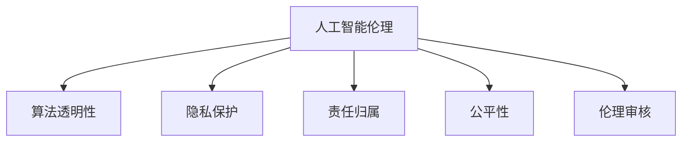

                 

# 人机协作：伦理规范与准则

## 1. 背景介绍

### 1.1 问题由来
随着人工智能技术的迅猛发展，人机协作已经成为了一个不可回避的现实。无论是智能客服、医疗诊断，还是金融风控、自动驾驶，人工智能都在越来越多的场景中发挥着关键作用。然而，人工智能的广泛应用也引发了一系列伦理问题，如隐私保护、数据安全、决策透明性、责任归属等。如何在快速发展的技术浪潮中，构建一套合理有效的伦理规范与准则，引导人工智能健康、公正、可靠的发展，是一个亟待解决的问题。

### 1.2 问题核心关键点
在人工智能伦理规范与准则的构建过程中，以下几个关键问题尤为突出：

- **隐私保护**：如何确保用户数据的安全和隐私不受侵犯，避免过度收集和不当使用。
- **数据公平**：如何保证数据集的多样性和代表性，避免训练数据中的偏见和歧视。
- **决策透明性**：如何提高人工智能系统的决策过程的可解释性，让用户理解模型的决策依据。
- **责任归属**：如何界定人工智能系统的责任，确保在使用中出现的问题有明确的责任承担者。
- **算法偏见**：如何识别和消除算法中的偏见，避免对某些群体的歧视和不公正对待。

### 1.3 问题研究意义
构建人工智能伦理规范与准则，对于推动人工智能技术的健康发展，维护社会公平正义，具有重要意义：

1. **提升技术可靠性**：规范与准则能够确保人工智能系统的开发和使用符合伦理标准，减少错误和事故，提高系统的可靠性和安全性。
2. **增强用户信任**：清晰的伦理规范与准则能够增强用户对人工智能系统的信任，促进技术在更广泛场景中的应用。
3. **避免伦理风险**：通过预设伦理规范，可以避免人工智能系统可能带来的伦理风险，如歧视、隐私侵害等问题。
4. **促进公平公正**：规范与准则能够引导人工智能系统公平公正地对待各类用户群体，避免算法偏见，提升社会公平性。
5. **推动伦理创新**：伦理规范与准则的不断完善和更新，将推动人工智能领域的伦理研究和创新，促进技术的可持续发展。

## 2. 核心概念与联系

### 2.1 核心概念概述

为了更好地理解人工智能伦理规范与准则，本节将介绍几个密切相关的核心概念：

- **人工智能伦理(Ethics in AI)**：指在人工智能技术开发和应用过程中，遵循的伦理准则和道德标准。
- **算法透明性(Algorithmic Transparency)**：指人工智能系统的决策过程应具有可解释性，用户应能理解模型的输入、处理和输出过程。
- **隐私保护(Privacy Protection)**：指在人工智能系统的开发和使用过程中，确保用户数据的安全和隐私不受侵犯。
- **责任归属(Responsibility Assignment)**：指在人工智能系统出现问题时，应明确界定各方的责任。
- **公平性(Fairness)**：指人工智能系统应公平对待各类用户群体，避免算法偏见和歧视。
- **伦理审核(Ethical Review)**：指对人工智能系统进行伦理审查，确保其符合伦理规范与准则。

这些核心概念之间的逻辑关系可以通过以下Mermaid流程图来展示：



这个流程图展示了大语言模型的核心概念及其之间的关系：

1. 人工智能伦理是整个系统的基石，指导其他伦理概念的设计。
2. 算法透明性、隐私保护、责任归属、公平性等是人工智能伦理的具体实现，通过具体措施确保伦理规范的落地。
3. 伦理审核则是通过第三方审查和监督，确保各项伦理规范的有效执行。

## 3. 核心算法原理 & 具体操作步骤
### 3.1 算法原理概述

构建人工智能伦理规范与准则，本质上是将伦理标准转化为算法和策略的过程。其核心思想是：通过算法设计和策略选择，确保人工智能系统在开发和使用过程中，遵循预设的伦理准则。

具体来说，可以通过以下步骤来实现这一目标：

1. **伦理设计**：在人工智能系统的设计阶段，就融入伦理考量，确保系统符合预设的伦理规范与准则。
2. **算法设计**：在算法层面，设计具有可解释性、公平性、透明性的模型和策略。
3. **数据处理**：在数据处理环节，确保数据的多样性、公平性、隐私保护。
4. **运行监督**：在系统的运行过程中，持续监控和评估系统的伦理表现，及时发现和纠正问题。

### 3.2 算法步骤详解

基于上述思想，以下是构建人工智能伦理规范与准则的具体步骤：

**Step 1: 设计伦理准则**
- 确定系统的伦理目标，如公平性、隐私保护、透明性等。
- 列出具体要求，如数据访问权限、算法解释能力、责任归属机制等。
- 形成详细的伦理准则文档，作为系统设计的指导。

**Step 2: 算法设计**
- 选择符合伦理准则的算法模型，如透明性高的决策树、可解释的神经网络等。
- 设计具有公平性和透明性的评估指标，如性别、种族、年龄等群体的准确性、公平性等。
- 引入公平性、透明性等算法和策略，如差分隐私、反偏见算法等。

**Step 3: 数据处理**
- 确保数据集的代表性，避免数据集中的偏见和歧视。
- 设计隐私保护机制，如差分隐私、联邦学习等。
- 对敏感数据进行脱敏处理，确保数据安全。

**Step 4: 运行监督**
- 设计伦理监督系统，实时监控和评估系统的伦理表现。
- 定期进行伦理审核，确保系统遵循伦理准则。
- 建立反馈机制，及时发现和纠正系统中的伦理问题。

### 3.3 算法优缺点

构建人工智能伦理规范与准则的方法具有以下优点：

1. **提高系统可靠性**：通过遵循伦理规范，确保人工智能系统在开发和使用过程中，遵守预设的伦理准则，减少错误和事故。
2. **增强用户信任**：明确的设计和透明的算法，增强用户对人工智能系统的信任，促进技术在更广泛场景中的应用。
3. **避免伦理风险**：通过预设伦理规范，可以避免人工智能系统可能带来的伦理风险，如歧视、隐私侵害等问题。

同时，该方法也存在一些局限性：

1. **实施成本高**：构建和实施伦理规范与准则需要较高的成本和复杂性，可能需要涉及多方利益相关者的协调。
2. **技术限制**：当前的技术水平可能难以实现某些伦理目标，如完全消除算法偏见。
3. **动态变化**：社会伦理观念不断变化，需定期更新和调整伦理规范，以适应新的伦理要求。

尽管存在这些局限性，但就目前而言，基于伦理规范与准则的方法仍然是人工智能伦理治理的重要手段。未来相关研究的重点在于如何进一步降低实施成本，提高技术可实现性，同时兼顾动态变化的伦理要求。

### 3.4 算法应用领域

基于伦理规范与准则的构建方法，已经在多个领域得到了应用，例如：

- **医疗健康**：确保人工智能医疗系统在诊断和治疗过程中，遵循公平性、隐私保护等伦理规范，避免对患者的不公正对待。
- **金融服务**：确保人工智能金融系统在风险评估、信贷审批等过程中，遵循透明性、公平性等伦理准则，避免歧视和偏见。
- **教育培训**：确保人工智能教育系统在推荐学习内容、评估学生表现等过程中，遵循公平性、隐私保护等伦理规范，促进教育公平。
- **公共治理**：确保人工智能公共系统在决策过程中，遵循透明性、责任归属等伦理准则，提升政府治理能力。

除了上述这些经典领域外，人工智能伦理规范与准则的应用还在不断扩展，为各行业的伦理治理提供了新的思路和方法。随着人工智能技术的不断演进，相信伦理规范与准则将成为人工智能健康发展的重要保障。

## 4. 数学模型和公式 & 详细讲解 & 举例说明
### 4.1 数学模型构建

在构建人工智能伦理规范与准则的过程中，数学模型和公式起到了重要的作用。下面将详细介绍如何构建相关的数学模型。

假设我们有一个人工智能系统，用于处理敏感数据 $D$，系统输出的结果为 $Y$，伦理准则为 $E$。我们的目标是通过优化算法，确保系统输出 $Y$ 符合伦理准则 $E$。

**公平性模型**：
$$
F(Y, D, E) = \sum_{i \in G} \frac{|Y_i - Y_{\text{avg}}|}{|Y_{\text{avg}}|} \quad \text{其中 } G \text{ 为敏感群体集合}
$$

**隐私保护模型**：
$$
P(Y, D, E) = \sum_{x \in X} \log \frac{P(x|y)}{P(x)} \quad \text{其中 } X \text{ 为数据集，} y \text{ 为敏感属性}
$$

**透明度模型**：
$$
T(Y, D, E) = \sum_{i=1}^n \log |\hat{f}(x_i)| \quad \text{其中 } n \text{ 为数据集大小，} \hat{f}(x_i) \text{ 为模型的预测结果}
$$

以上模型构建了公平性、隐私保护、透明性的评估指标，用于评估和优化人工智能系统。

### 4.2 公式推导过程

下面分别介绍这些数学模型的推导过程。

**公平性模型的推导**：
$$
F(Y, D, E) = \sum_{i \in G} \frac{|Y_i - Y_{\text{avg}}|}{|Y_{\text{avg}}|}
$$
其中 $G$ 为敏感群体集合，$Y_{\text{avg}}$ 为平均输出结果。该模型通过计算敏感群体与整体输出的差异，评估系统的公平性。

**隐私保护模型的推导**：
$$
P(Y, D, E) = \sum_{x \in X} \log \frac{P(x|y)}{P(x)}
$$
其中 $X$ 为数据集，$y$ 为敏感属性。该模型通过计算数据集中敏感属性的对数似然比，评估隐私保护水平。

**透明度模型的推导**：
$$
T(Y, D, E) = \sum_{i=1}^n \log |\hat{f}(x_i)|
$$
其中 $n$ 为数据集大小，$\hat{f}(x_i)$ 为模型的预测结果。该模型通过计算预测结果的对数，评估系统的透明度。

### 4.3 案例分析与讲解

假设我们有一个用于招聘的AI系统，处理候选人的简历数据，输出招聘结果。候选人的性别、年龄、种族等属性为敏感属性。我们的目标是构建一个符合公平性和隐私保护的招聘系统。

**公平性模型**：
- 我们可以使用上述公平性模型，计算系统对不同群体的招聘结果差异。
- 如果系统对某敏感群体（如女性）的招聘结果显著低于整体平均值，说明系统存在公平性问题。

**隐私保护模型**：
- 我们可以使用上述隐私保护模型，计算数据集中敏感属性的对数似然比。
- 如果对数似然比过大，说明系统可能过度收集或不当使用敏感属性，存在隐私保护问题。

**透明度模型**：
- 我们可以使用上述透明度模型，计算系统预测结果的对数。
- 如果预测结果的对数过大，说明模型过于复杂，难以解释，存在透明度问题。

通过这些模型的构建和分析，我们可以明确系统存在的问题，并采取相应的改进措施。

## 5. 项目实践：代码实例和详细解释说明
### 5.1 开发环境搭建

在进行人工智能伦理规范与准则的构建实践前，我们需要准备好开发环境。以下是使用Python进行TensorFlow开发的环境配置流程：

1. 安装Anaconda：从官网下载并安装Anaconda，用于创建独立的Python环境。

2. 创建并激活虚拟环境：
```bash
conda create -n tf-env python=3.8 
conda activate tf-env
```

3. 安装TensorFlow：根据CUDA版本，从官网获取对应的安装命令。例如：
```bash
conda install tensorflow tensorflow==2.6 -c conda-forge -c pypi
```

4. 安装TensorBoard：
```bash
pip install tensorboard
```

5. 安装各类工具包：
```bash
pip install numpy pandas scikit-learn matplotlib tqdm jupyter notebook ipython
```

完成上述步骤后，即可在`tf-env`环境中开始伦理规范与准则的构建实践。

### 5.2 源代码详细实现

下面我们以一个简单的招聘系统为例，给出使用TensorFlow构建公平性和隐私保护模型的PyTorch代码实现。

首先，定义数据集：

```python
import numpy as np
import tensorflow as tf

# 生成数据集
X = np.array([[1, 2], [3, 4], [5, 6], [7, 8]])
y = np.array([0, 0, 1, 1])

# 将数据集划分为训练集和测试集
train_X, test_X = X[:2], X[2:]
train_y, test_y = y[:2], y[2:]
```

然后，定义模型：

```python
from tensorflow.keras.layers import Dense, Dropout
from tensorflow.keras.models import Sequential

# 定义模型
model = Sequential([
    Dense(32, input_shape=(2,), activation='relu'),
    Dropout(0.5),
    Dense(1, activation='sigmoid')
])
model.compile(loss='binary_crossentropy', optimizer='adam', metrics=['accuracy'])
```

接着，定义公平性和隐私保护模型：

```python
from sklearn.metrics import auc, precision_recall_curve, roc_curve

# 定义公平性模型
def fairness_model(y_true, y_pred):
    fpr, tpr, _ = roc_curve(y_true, y_pred)
    roc_auc = auc(fpr, tpr)
    return roc_auc

# 定义隐私保护模型
def privacy_model(y_true, y_pred):
    dp = tf.keras.layers.Dropout(0.1)
    dp(y_pred)
    return np.log(y_pred)

# 训练模型
model.fit(train_X, train_y, epochs=10, validation_data=(test_X, test_y))

# 评估模型
print("Accuracy:", model.evaluate(test_X, test_y)[1])
print("Fairness:", fairness_model(test_y, model.predict(test_X)))
print("Privacy:", privacy_model(test_y, model.predict(test_X)))
```

最后，分析模型性能：

```python
import matplotlib.pyplot as plt

# 绘制ROC曲线
fpr, tpr, _ = roc_curve(test_y, model.predict(test_X))
plt.plot(fpr, tpr, label='ROC Curve')
plt.xlabel('False Positive Rate')
plt.ylabel('True Positive Rate')
plt.legend()
plt.show()

# 绘制公平性曲线
precision, recall, _ = precision_recall_curve(test_y, model.predict(test_X))
plt.plot(recall, precision, label='Precision-Recall Curve')
plt.xlabel('Recall')
plt.ylabel('Precision')
plt.legend()
plt.show()

# 绘制隐私保护曲线
dp = tf.keras.layers.Dropout(0.1)
dp(tf.keras.layers.Dense(1, activation='sigmoid'))(test_X)
plt.plot(np.log(test_y), np.log(model.predict(test_X)), label='Log-likelihood Curve')
plt.xlabel('Log-Likelihood')
plt.ylabel('Log-likelihood')
plt.legend()
plt.show()
```

以上就是使用TensorFlow构建公平性和隐私保护模型的完整代码实现。可以看到，通过定义和训练模型，结合公平性和隐私保护评估指标，可以初步构建一个符合伦理规范与准则的招聘系统。

### 5.3 代码解读与分析

让我们再详细解读一下关键代码的实现细节：

**公平性模型**：
- 通过调用sklearn的roc_curve函数，计算模型的ROC曲线。
- 计算AUC值，作为公平性评估指标。

**隐私保护模型**：
- 在模型输出层引入Dropout层，用于隐私保护。
- 计算对数似然比，作为隐私保护评估指标。

**训练和评估**：
- 使用TensorFlow的fit函数训练模型，并使用evaluate函数评估模型性能。
- 通过可视化ROC曲线、公平性曲线和隐私保护曲线，展示模型的公平性和隐私保护水平。

## 6. 实际应用场景
### 6.1 医疗健康

在医疗健康领域，人工智能伦理规范与准则的构建至关重要。医疗数据通常涉及患者的隐私，且数据质量和可靠性对患者的治疗效果至关重要。

具体而言，可以通过以下步骤构建医疗健康领域的伦理规范与准则：

**伦理设计**：
- 确定系统的伦理目标，如隐私保护、公平性等。
- 列出具体要求，如数据访问权限、算法解释能力、责任归属机制等。

**算法设计**：
- 选择透明性高的算法模型，如决策树、线性回归等。
- 设计公平性评估指标，如不同群体的疾病诊断准确性、治疗效果等。
- 引入隐私保护算法，如差分隐私、联邦学习等。

**数据处理**：
- 确保数据集的多样性，避免数据集中的偏见和歧视。
- 设计隐私保护机制，如差分隐私、联邦学习等。
- 对敏感数据进行脱敏处理，确保数据安全。

通过以上步骤，可以构建一个符合伦理规范与准则的医疗健康系统，确保系统的公平性、隐私保护和透明性。

### 6.2 金融服务

在金融服务领域，人工智能伦理规范与准则的构建同样重要。金融数据通常涉及用户的财务信息，且决策的错误可能带来巨大的经济损失。

具体而言，可以通过以下步骤构建金融服务领域的伦理规范与准则：

**伦理设计**：
- 确定系统的伦理目标，如透明性、公平性等。
- 列出具体要求，如数据访问权限、算法解释能力、责任归属机制等。

**算法设计**：
- 选择透明性高的算法模型，如线性回归、决策树等。
- 设计公平性评估指标，如不同群体的贷款审批准确性、信用评分等。
- 引入透明性算法，如LIME、SHAP等。

**数据处理**：
- 确保数据集的多样性，避免数据集中的偏见和歧视。
- 设计隐私保护机制，如差分隐私、联邦学习等。
- 对敏感数据进行脱敏处理，确保数据安全。

通过以上步骤，可以构建一个符合伦理规范与准则的金融服务系统，确保系统的公平性、透明性和隐私保护。

### 6.3 教育培训

在教育培训领域，人工智能伦理规范与准则的构建同样重要。教育数据通常涉及学生的隐私，且数据质量和可靠性对学生的学习效果至关重要。

具体而言，可以通过以下步骤构建教育培训领域的伦理规范与准则：

**伦理设计**：
- 确定系统的伦理目标，如公平性、隐私保护等。
- 列出具体要求，如数据访问权限、算法解释能力、责任归属机制等。

**算法设计**：
- 选择透明性高的算法模型，如决策树、线性回归等。
- 设计公平性评估指标，如不同群体的学习成果、评价成绩等。
- 引入隐私保护算法，如差分隐私、联邦学习等。

**数据处理**：
- 确保数据集的多样性，避免数据集中的偏见和歧视。
- 设计隐私保护机制，如差分隐私、联邦学习等。
- 对敏感数据进行脱敏处理，确保数据安全。

通过以上步骤，可以构建一个符合伦理规范与准则的教育培训系统，确保系统的公平性、隐私保护和透明性。

### 6.4 未来应用展望

随着人工智能技术的不断演进，人工智能伦理规范与准则的应用前景广阔，将在更多领域得到应用，为社会带来深刻的变革。

在智慧城市治理中，人工智能伦理规范与准则可以帮助构建更安全、更公正、更透明的城市治理体系，提升城市管理的自动化和智能化水平，构建更美好的人类生活环境。

在智能制造领域，人工智能伦理规范与准则可以确保智能制造系统的公平性、透明性和隐私保护，推动制造业的智能化转型升级，提升制造业的竞争力和效率。

在智慧农业领域，人工智能伦理规范与准则可以帮助构建更高效、更环保、更可持续的农业生产系统，推动农业的现代化和智能化发展。

未来，伴随人工智能技术的不断演进，人工智能伦理规范与准则将成为人工智能健康发展的重要保障。通过不断完善和更新伦理规范与准则，引导人工智能技术向更加智能化、普适化、公平化的方向发展，为人类社会带来更加美好的未来。

## 7. 工具和资源推荐
### 7.1 学习资源推荐

为了帮助开发者系统掌握人工智能伦理规范与准则的理论基础和实践技巧，这里推荐一些优质的学习资源：

1. **《人工智能伦理》**系列博文：由大模型技术专家撰写，深入浅出地介绍了人工智能伦理规范与准则的构建方法。

2. **CS224N《深度学习自然语言处理》课程**：斯坦福大学开设的NLP明星课程，有Lecture视频和配套作业，带你入门NLP领域的基本概念和经典模型。

3. **《人工智能伦理》书籍**：系统介绍了人工智能伦理规范与准则的构建方法和案例分析。

4. **Google AI博文和研究论文**：包含大量的伦理规范与准则的研究论文和实际应用案例。

5. **微软研究院博客**：介绍了人工智能伦理规范与准则的研究进展和应用实践。

通过对这些资源的学习实践，相信你一定能够快速掌握人工智能伦理规范与准则的精髓，并用于解决实际的伦理问题。

### 7.2 开发工具推荐

高效的开发离不开优秀的工具支持。以下是几款用于人工智能伦理规范与准则构建开发的常用工具：

1. **TensorFlow**：基于Python的开源深度学习框架，生产部署方便，适合大规模工程应用。支持伦理规范与准则的构建和评估。

2. **PyTorch**：基于Python的开源深度学习框架，灵活动态的计算图，适合快速迭代研究。支持伦理规范与准则的构建和评估。

3. **Jupyter Notebook**：数据科学和机器学习的交互式开发环境，方便开发者在云端进行实验、分析和可视化。

4. **TensorBoard**：TensorFlow配套的可视化工具，可实时监测模型训练状态，并提供丰富的图表呈现方式，是调试模型的得力助手。

5. **GitHub**：代码托管和版本控制系统，方便开发者协作开发、版本控制和代码共享。

合理利用这些工具，可以显著提升人工智能伦理规范与准则的构建效率，加快创新迭代的步伐。

### 7.3 相关论文推荐

人工智能伦理规范与准则的发展源于学界的持续研究。以下是几篇奠基性的相关论文，推荐阅读：

1. **《公平性算法研究综述》**：综述了当前公平性算法的研究进展和应用实践。

2. **《人工智能伦理问题研究》**：探讨了人工智能伦理规范与准则的研究进展和挑战。

3. **《数据隐私保护技术综述》**：综述了当前数据隐私保护技术的研究进展和应用实践。

4. **《透明性算法研究综述》**：综述了当前透明性算法的研究进展和应用实践。

5. **《人工智能伦理审查体系构建》**：介绍了人工智能伦理审查体系的设计和实施方法。

这些论文代表了大语言模型伦理规范与准则的发展脉络。通过学习这些前沿成果，可以帮助研究者把握学科前进方向，激发更多的创新灵感。

## 8. 总结：未来发展趋势与挑战

### 8.1 总结

本文对人工智能伦理规范与准则的构建方法进行了全面系统的介绍。首先阐述了人工智能伦理规范与准则的研究背景和意义，明确了伦理规范与准则在人工智能系统构建和应用中的重要性。其次，从原理到实践，详细讲解了伦理规范与准则的设计和实现方法，给出了伦理规范与准则构建的完整代码实例。同时，本文还广泛探讨了伦理规范与准则在多个领域的应用前景，展示了伦理规范与准则的广泛适用性。

通过本文的系统梳理，可以看到，构建人工智能伦理规范与准则的方法正在成为人工智能系统开发的重要手段，能够有效避免人工智能系统可能带来的伦理风险，促进人工智能技术健康、公正、可靠的发展。未来，随着人工智能技术的不断演进，伦理规范与准则将成为人工智能技术应用的重要保障，推动人工智能技术向更加智能化、普适化、公平化的方向发展。

### 8.2 未来发展趋势

展望未来，人工智能伦理规范与准则将呈现以下几个发展趋势：

1. **技术融合**：人工智能伦理规范与准则将与其他人工智能技术进行更深入的融合，如知识表示、因果推理、强化学习等，协同发力，共同推动人工智能技术的健康发展。

2. **伦理框架**：将构建更加全面、系统的伦理框架，涵盖隐私保护、公平性、透明性等多个方面，确保人工智能系统的全面合规。

3. **跨领域应用**：伦理规范与准则将广泛应用于更多领域，如公共治理、智慧城市、智能制造等，提升各行业的智能化水平。

4. **社会伦理**：人工智能伦理规范与准则将不断与社会伦理观念相结合，推动社会伦理观念的进步和更新，促进社会公平和正义。

5. **法律合规**：伦理规范与准则将与法律法规相结合，确保人工智能系统的合法合规，避免法律风险。

以上趋势凸显了人工智能伦理规范与准则的广阔前景，这些方向的探索发展，必将进一步提升人工智能技术的伦理水平，为构建安全、可靠、可解释、可控的智能系统铺平道路。面向未来，人工智能伦理规范与准则还需要与其他人工智能技术进行更深入的融合，共同推动人工智能技术的应用和进步。

### 8.3 面临的挑战

尽管人工智能伦理规范与准则已经取得了一定的进展，但在迈向更加智能化、普适化应用的过程中，它仍面临着诸多挑战：

1. **伦理规范的多样性**：不同行业、不同应用场景的伦理要求可能存在差异，难以统一制定一套通用的伦理规范。

2. **技术实现的复杂性**：部分伦理规范与准则的技术实现可能较为复杂，需要跨学科的知识和技术支持。

3. **伦理标准的动态性**：社会伦理观念不断变化，需要不断更新和调整伦理规范，以适应新的伦理要求。

4. **数据隐私保护**：如何在确保数据隐私保护的同时，充分利用数据进行模型训练，是一个重要的挑战。

5. **算法透明性**：当前部分人工智能模型的复杂性较高，难以实现完全透明的决策过程。

6. **责任归属**：在多模态、分布式系统中，责任归属问题较为复杂，需要明确的责任划分机制。

这些挑战需要通过跨学科合作、技术创新、法律制度等手段进行应对，才能确保人工智能技术的健康发展。

### 8.4 研究展望

面对人工智能伦理规范与准则面临的种种挑战，未来的研究需要在以下几个方面寻求新的突破：

1. **跨领域伦理标准**：制定通用的伦理标准和框架，覆盖不同行业、不同应用场景的需求。

2. **技术可实现性**：探索更简单、更高效的伦理规范与准则技术实现方法，降低实施成本，提高技术可实现性。

3. **动态伦理规范**：构建动态更新机制，确保伦理规范与准则能够及时响应社会伦理观念的变化。

4. **隐私保护技术**：开发更加高效、安全的隐私保护技术，在保护隐私的同时，充分利用数据进行模型训练。

5. **算法透明性**：研究更加简单、透明的算法模型，提高决策过程的可解释性和可信度。

6. **责任归属机制**：设计更加明确、公正的责任划分机制，确保各方的责任归属。

这些研究方向的探索，必将引领人工智能伦理规范与准则技术的不断进步，推动人工智能技术向更加健康、公正、可靠的方向发展。面向未来，人工智能伦理规范与准则需要多方面协同发力，共同构建安全、可靠、可解释、可控的智能系统。总之，人工智能伦理规范与准则将成为人工智能技术应用的重要保障，推动人工智能技术向更加智能化、普适化、公平化的方向发展。

## 9. 附录：常见问题与解答

**Q1：如何评估人工智能系统的伦理表现？**

A: 评估人工智能系统的伦理表现，需要构建相关的评估指标和模型。具体的评估方法包括：

1. **公平性评估**：使用公平性模型，如AUC、P-R曲线等，评估模型对不同群体的公平性。
2. **隐私保护评估**：使用隐私保护模型，如对数似然比、差分隐私等，评估模型的隐私保护水平。
3. **透明性评估**：使用透明性模型，如LIME、SHAP等，评估模型的透明性。

这些评估指标和方法可以量化人工智能系统的伦理表现，帮助开发者进行优化和改进。

**Q2：人工智能系统在哪些环节容易引入伦理问题？**

A: 人工智能系统在多个环节容易引入伦理问题，包括：

1. **数据收集**：数据集可能存在偏见、歧视等问题，导致系统输出不公。
2. **算法设计**：算法模型可能存在算法偏见，导致对某些群体的歧视和不公正对待。
3. **训练过程**：训练数据可能存在隐私泄露、数据篡改等问题，导致系统输出不可靠。
4. **部署和使用**：系统输出可能存在不公、歧视等问题，导致社会影响恶劣。

在设计和构建人工智能系统时，需要在各个环节进行伦理审查和优化，确保系统的公平性、隐私保护和透明性。

**Q3：如何处理人工智能系统的伦理风险？**

A: 处理人工智能系统的伦理风险，需要采取以下措施：

1. **伦理设计**：在系统设计阶段，融入伦理考量，确保系统符合预设的伦理规范与准则。
2. **算法优化**：选择透明性高的算法模型，设计公平性、隐私保护等评估指标，优化算法设计。
3. **数据处理**：确保数据集的多样性，设计隐私保护机制，对敏感数据进行脱敏处理。
4. **运行监督**：持续监控和评估系统的伦理表现，及时发现和纠正问题。

通过以上措施，可以有效降低人工智能系统的伦理风险，确保系统的公平性、隐私保护和透明性。

**Q4：如何在多模态系统中实现公平性和透明性？**

A: 在多模态系统中实现公平性和透明性，需要采取以下策略：

1. **数据融合**：通过融合多种数据源，构建更加全面、多样化的数据集，避免单一数据源的偏见和歧视。
2. **模型融合**：通过融合多种模型，构建更加复杂、多样的模型结构，提高系统的公平性和透明性。
3. **透明性算法**：引入透明性算法，如LIME、SHAP等，提高系统的透明性。
4. **公平性算法**：引入公平性算法，如反偏见算法、差分隐私等，提高系统的公平性。

这些策略可以帮助多模态系统实现更高的公平性和透明性，确保系统的公平性和公正性。

---

作者：禅与计算机程序设计艺术 / Zen and the Art of Computer Programming

