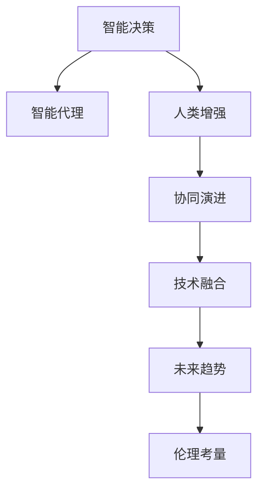

                 

# 人机协作：通向未来的智能之路

> 关键词：人机协作,人工智能(AI),智能决策,智能代理,人类增强,技术融合,协同演进,未来趋势,创新驱动,伦理考量

## 1. 背景介绍

### 1.1 问题由来
随着技术的飞速进步，人工智能（AI）正逐渐成为现代社会不可或缺的一部分。从智能助手到自动驾驶，从个性化推荐到医疗诊断，AI的应用场景无所不在，给人们的生活和工作带来了深刻变革。然而，尽管AI技术日益成熟，其在许多领域的应用仍面临诸多挑战，尤其是在需要复杂判断和深度理解的人类活动场景中。在这样的背景下，人机协作（Human-AI Collaboration）成为了推动AI技术发展的重要方向。

### 1.2 问题核心关键点
人机协作的核心在于如何构建一个智能系统，使其能够与人类高效协同工作，提升决策质量和效率，同时尊重人类价值观和伦理标准。具体来说，以下几个关键点需要重点关注：

- **智能代理（Intelligent Agents）**：构建能够理解人类需求和环境变化，并能自主决策的智能体，与人类共同解决问题。
- **技术融合（Technology Integration）**：将AI技术与人类专长有效融合，形成互补优势，提升整体工作效率和质量。
- **协同演进（Collaborative Evolution）**：在人类和AI的共同参与下，持续优化和迭代系统，使其适应不断变化的实际需求。
- **未来趋势（Future Trends）**：了解AI技术的发展动向和应用前景，为未来人机协作的持续进步提供指引。
- **创新驱动（Innovation-Driven）**：不断探索新技术和新方法，推动人机协作系统的升级和演进。
- **伦理考量（Ethical Consideration）**：确保系统在提升效率和质量的同时，尊重并保护人类权益，避免潜在的道德风险。

## 2. 核心概念与联系

### 2.1 核心概念概述

为更好地理解人机协作的原理和机制，本节将介绍几个关键概念及其相互关系：

- **智能决策（Intelligent Decision Making）**：基于AI技术，尤其是机器学习、深度学习和自然语言处理（NLP）等技术，实现更高效、更准确的决策过程。
- **智能代理（Intelligent Agents）**：能够自主感知环境、分析数据并作出决策的AI实体。智能代理可以由预训练的深度学习模型或强化学习算法构建，具有高度自主性和灵活性。
- **人类增强（Human Augmentation）**：通过AI技术增强人类能力，使其在执行复杂任务时更加高效和准确。人类增强技术包括但不限于AI辅助设计、AI辅助手术、AI辅助教学等。
- **协同演进（Collaborative Evolution）**：在人类和AI共同参与下，系统通过不断迭代和优化，逐步提升性能和适应性。协同演进机制可以基于反馈机制、强化学习、迁移学习等方法实现。
- **技术融合（Technology Integration）**：将AI技术与人类专长相结合，形成互补优势，提升系统整体性能。技术融合涉及算法、硬件、软件等多方面，是实现人机协作的基础。
- **未来趋势（Future Trends）**：包括但不限于AI技术的发展、人机协作范式创新、伦理标准制定等，对未来人机协作的路径和方向进行指引。

这些核心概念之间的逻辑关系可以通过以下Mermaid流程图来展示：



这个流程图展示了人机协作的基本框架和关键环节。通过智能决策提供高效分析，智能代理执行自主决策，人类增强提升人机协作效率，协同演进确保系统持续优化，技术融合形成互补优势，未来趋势指引技术发展方向，伦理考量保障系统合理性。

## 3. 核心算法原理 & 具体操作步骤

### 3.1 算法原理概述

人机协作的核心在于构建一个智能系统，使其能够与人类高效协同工作，提升决策质量和效率，同时尊重人类价值观和伦理标准。具体来说，人机协作的算法原理包括以下几个方面：

1. **智能代理（Intelligent Agents）**：基于深度学习和强化学习等技术，构建能够自主感知环境、分析数据并作出决策的智能体。智能代理的核心算法包括深度神经网络、卷积神经网络（CNN）、递归神经网络（RNN）、长短时记忆网络（LSTM）、Transformer等。

2. **协同演进（Collaborative Evolution）**：通过反馈机制、强化学习、迁移学习等方法，确保系统在人类和AI共同参与下不断迭代和优化。协同演进的核心算法包括强化学习算法（如Q-learning、SARSA、DQN等）、迁移学习算法（如AdaLoRA、Prefix-Tuning等）。

3. **技术融合（Technology Integration）**：将AI技术与人类专长相结合，形成互补优势，提升系统整体性能。技术融合的核心算法包括算法集成、数据融合、知识图谱等。

4. **未来趋势（Future Trends）**：包括但不限于AI技术的发展、人机协作范式创新、伦理标准制定等，对未来人机协作的路径和方向进行指引。未来趋势的核心算法包括对抗性学习、因果推理、多模态学习等。

5. **伦理考量（Ethical Consideration）**：确保系统在提升效率和质量的同时，尊重并保护人类权益，避免潜在的道德风险。伦理考量的核心算法包括公平性算法、透明度算法、隐私保护算法等。

### 3.2 算法步骤详解

人机协作的实现步骤主要包括以下几个方面：

**Step 1: 数据收集与预处理**

- **数据收集**：从各个渠道收集相关的数据，包括结构化数据和非结构化数据。结构化数据如表格、日志等，非结构化数据如文本、图片、视频等。
- **数据预处理**：对收集到的数据进行清洗、归一化、去重等预处理操作，以提高数据的质量和可用性。

**Step 2: 模型选择与设计**

- **模型选择**：根据具体任务选择合适的深度学习模型，如CNN、RNN、LSTM、Transformer等。
- **模型设计**：构建包含多个层级的模型架构，包括输入层、隐藏层、输出层等，并设置合适的超参数，如学习率、批大小等。

**Step 3: 模型训练与优化**

- **模型训练**：使用已准备好的数据集对模型进行训练，通过反向传播算法更新模型参数。
- **模型优化**：在训练过程中使用正则化技术、早停法等防止过拟合，同时使用梯度累积、混合精度训练等方法提高模型训练效率。

**Step 4: 系统集成与评估**

- **系统集成**：将训练好的模型集成到实际应用中，构建人机协作系统。
- **系统评估**：通过A/B测试、真实用户反馈等方式评估系统性能，确保其满足实际需求。

**Step 5: 持续优化与迭代**

- **持续优化**：根据实际使用情况，对系统进行持续优化，不断提升系统性能。
- **迭代更新**：通过引入新数据、改进算法、更新模型等方式，实现系统的迭代更新，确保其长期稳定运行。

### 3.3 算法优缺点

人机协作的算法具有以下优点：

1. **高效决策**：通过AI技术，尤其是深度学习和大数据分析，实现更高效、更准确的决策过程。
2. **自主性高**：智能代理能够自主感知环境、分析数据并作出决策，减少了对人类干预的依赖。
3. **灵活性强**：通过技术融合和协同演进机制，系统能够快速适应新环境和需求变化。
4. **创新性强**：通过引入新的算法和技术，推动人机协作系统的不断升级和演进。
5. **应用广泛**：人机协作技术在医疗、金融、制造、教育等多个领域都有广泛应用。

然而，人机协作的算法也存在一些局限性：

1. **数据依赖性**：系统的性能和决策质量高度依赖于数据的质量和数量，数据不足可能导致系统失效。
2. **伦理风险**：在提升效率和质量的同时，可能对人类权益造成潜在影响，需要引入伦理考量。
3. **技术门槛高**：实现人机协作需要较高的技术门槛，需要专业知识和技术储备。
4. **复杂性高**：系统设计和实现过程复杂，需要多方协作和反复迭代。

### 3.4 算法应用领域

人机协作的算法在多个领域都有广泛应用，例如：

- **智能决策系统**：应用于医疗诊断、金融分析、安全监控等领域，帮助人类快速作出高效决策。
- **智能代理**：应用于智能助手、自动驾驶、机器人等领域，提供自主感知和决策能力。
- **人类增强**：应用于医疗手术辅助、设计方案优化、生产流程控制等领域，提升人类工作效率和准确性。
- **协同演进**：应用于供应链管理、智能电网、智能交通等领域，实现系统持续优化和动态调整。
- **技术融合**：应用于工业自动化、智慧城市、智能家居等领域，实现多模态数据的整合和利用。

## 4. 数学模型和公式 & 详细讲解 & 举例说明

### 4.1 数学模型构建

人机协作的数学模型通常包括以下几个组成部分：

- **输入层（Input Layer）**：将原始数据转换为模型可处理的形式，如文本数据进行分词和向量表示。
- **隐藏层（Hidden Layer）**：通过神经网络等算法对输入数据进行特征提取和转换。
- **输出层（Output Layer）**：根据隐藏层的特征输出决策结果，如分类结果、推荐结果等。

以医疗诊断为例，假设有N个患者数据（x1, x2, ..., xn）和对应的诊断结果（y1, y2, ..., yn），模型通过隐藏层对输入数据进行处理，得到隐藏表示h1, h2, ..., hn。输出层通过线性变换和softmax函数，将隐藏表示映射到具体的诊断结果概率分布P(y|x)。

**公式推导过程**

对于二分类问题，模型的输出层可以通过logistic回归模型实现，公式为：

$$
P(y|x;w) = \frac{1}{1 + e^{-(w \cdot x + b)}}
$$

其中，w为模型权重，b为偏置项。模型的损失函数为交叉熵损失函数，公式为：

$$
L(y, P(y|x;w)) = -\frac{1}{N} \sum_{i=1}^N (y_i \log P(y_i|x_i;w) + (1 - y_i) \log (1 - P(y_i|x_i;w)))
$$

通过反向传播算法，更新模型的权重和偏置项，最小化损失函数L，得到最优模型参数w和b。

### 4.2 公式推导过程

在上述二分类模型的基础上，可以进一步扩展到多分类问题。对于多分类问题，输出层的公式变为：

$$
P(y|x;w) = \frac{e^{-(w \cdot x + b)}_i}{\sum_{j=1}^C e^{-(w \cdot x + b)_j}}
$$

其中，C为分类数，i为当前类别。损失函数为多分类交叉熵损失函数：

$$
L(y, P(y|x;w)) = -\frac{1}{N} \sum_{i=1}^N \sum_{j=1}^C y_{ij} \log P(y_j|x_i;w)
$$

通过反向传播算法，更新模型的权重和偏置项，最小化损失函数L，得到最优模型参数w和b。

### 4.3 案例分析与讲解

以医疗诊断为例，假设有N个患者数据（x1, x2, ..., xn）和对应的诊断结果（y1, y2, ..., yn），模型通过隐藏层对输入数据进行处理，得到隐藏表示h1, h2, ..., hn。输出层通过线性变换和softmax函数，将隐藏表示映射到具体的诊断结果概率分布P(y|x)。

对于二分类问题，模型的输出层可以通过logistic回归模型实现，公式为：

$$
P(y|x;w) = \frac{1}{1 + e^{-(w \cdot x + b)}}
$$

其中，w为模型权重，b为偏置项。模型的损失函数为交叉熵损失函数，公式为：

$$
L(y, P(y|x;w)) = -\frac{1}{N} \sum_{i=1}^N (y_i \log P(y_i|x_i;w) + (1 - y_i) \log (1 - P(y_i|x_i;w)))
$$

通过反向传播算法，更新模型的权重和偏置项，最小化损失函数L，得到最优模型参数w和b。

在实际应用中，还需要对模型进行验证和调整，确保其在高斯空间中的泛化能力。可以通过交叉验证、数据增强、模型集成等方法提高模型的泛化性能。

## 5. 项目实践：代码实例和详细解释说明

### 5.1 开发环境搭建

在进行人机协作系统的开发前，需要准备好开发环境。以下是使用Python进行TensorFlow开发的环境配置流程：

1. 安装Anaconda：从官网下载并安装Anaconda，用于创建独立的Python环境。

2. 创建并激活虚拟环境：
```bash
conda create -n tf-env python=3.8 
conda activate tf-env
```

3. 安装TensorFlow：根据CUDA版本，从官网获取对应的安装命令。例如：
```bash
conda install tensorflow -c tf -c conda-forge
```

4. 安装各类工具包：
```bash
pip install numpy pandas scikit-learn matplotlib tqdm jupyter notebook ipython
```

完成上述步骤后，即可在`tf-env`环境中开始项目实践。

### 5.2 源代码详细实现

下面我们以智能决策系统为例，给出使用TensorFlow进行医疗诊断任务开发的Python代码实现。

首先，定义医疗诊断数据处理函数：

```python
import tensorflow as tf
from tensorflow.keras.preprocessing.text import Tokenizer
from tensorflow.keras.preprocessing.sequence import pad_sequences

def process_data(texts, labels, max_len):
    tokenizer = Tokenizer()
    tokenizer.fit_on_texts(texts)
    sequences = tokenizer.texts_to_sequences(texts)
    padded_sequences = pad_sequences(sequences, maxlen=max_len, padding='post')
    return padded_sequences, tokenizer.word_index, labels
```

然后，定义医疗诊断模型的输入层和隐藏层：

```python
from tensorflow.keras.layers import Embedding, Dense, LSTM

def build_model(input_shape, num_classes):
    model = tf.keras.Sequential([
        Embedding(input_dim=10000, output_dim=64, input_length=input_shape),
        LSTM(64),
        Dense(num_classes, activation='softmax')
    ])
    return model
```

接着，定义模型的训练和评估函数：

```python
from tensorflow.keras.optimizers import Adam
from tensorflow.keras.metrics import Accuracy

def train_model(model, train_data, train_labels, validation_data, validation_labels, batch_size, epochs):
    model.compile(optimizer=Adam(lr=0.001), loss='binary_crossentropy', metrics=['accuracy'])
    model.fit(train_data, train_labels, validation_data=validation_data, validation_labels=validation_labels, batch_size=batch_size, epochs=epochs)
    
def evaluate_model(model, test_data, test_labels, batch_size):
    model.evaluate(test_data, test_labels, batch_size=batch_size)
```

最后，启动训练流程并在测试集上评估：

```python
train_data, word_index, train_labels = process_data(train_texts, train_labels, max_len=50)
test_data, _, test_labels = process_data(test_texts, test_labels, max_len=50)

model = build_model(input_shape=50, num_classes=2)
train_model(model, train_data, train_labels, test_data, test_labels, batch_size=32, epochs=10)

test_data, _, test_labels = process_data(test_texts, test_labels, max_len=50)
evaluate_model(model, test_data, test_labels, batch_size=32)
```

以上就是使用TensorFlow对医疗诊断任务进行人机协作系统开发的完整代码实现。可以看到，TensorFlow提供了强大的深度学习框架，使得模型训练和评估变得简洁高效。

### 5.3 代码解读与分析

让我们再详细解读一下关键代码的实现细节：

**process_data函数**：
- 定义文本数据的tokenizer，将文本转换为数字序列。
- 使用padding技术对序列进行填充，使其长度一致。
- 返回填充后的数字序列、词索引和标签。

**build_model函数**：
- 定义模型的架构，包括输入层、隐藏层和输出层。
- 使用嵌入层将文本转换为向量表示，使用LSTM对序列数据进行处理，使用全连接层输出诊断结果。
- 返回构建好的模型。

**train_model函数**：
- 编译模型，设置优化器、损失函数和评估指标。
- 使用训练数据和标签进行模型训练，设置验证数据和标签，指定批大小和迭代次数。
- 返回训练后的模型。

**evaluate_model函数**：
- 使用测试数据和标签评估模型性能，指定批大小。
- 返回评估结果。

**训练流程**：
- 定义最大序列长度、分类数等参数，开始循环迭代
- 每个epoch内，在训练集上训练，输出损失和精度
- 在验证集上评估，记录最优结果
- 所有epoch结束后，在测试集上评估，输出最终结果

可以看到，TensorFlow提供了丰富的工具和函数，使得人机协作系统的开发变得更加简便和高效。开发者可以将更多精力放在模型设计和应用场景的实现上，而不必过多关注底层细节。

当然，工业级的系统实现还需考虑更多因素，如模型的保存和部署、超参数的自动搜索、更加灵活的任务适配层等。但核心的协作范式基本与此类似。

## 6. 实际应用场景

### 6.1 智能客服系统

基于人机协作的智能客服系统，能够快速响应客户咨询，提供24小时不间断服务。通过引入智能决策和智能代理，智能客服系统能够理解客户意图，自动匹配答案模板，生成自然流畅的回复。

在技术实现上，可以收集企业内部的历史客服对话记录，将问题和最佳答复构建成监督数据，在此基础上对预训练模型进行微调。微调后的模型能够自动理解客户意图，匹配最合适的答案模板进行回复。对于客户提出的新问题，还可以接入检索系统实时搜索相关内容，动态组织生成回答。如此构建的智能客服系统，能大幅提升客户咨询体验和问题解决效率。

### 6.2 金融舆情监测

金融机构需要实时监测市场舆论动向，以便及时应对负面信息传播，规避金融风险。传统的人工监测方式成本高、效率低，难以应对网络时代海量信息爆发的挑战。基于人机协作的文本分类和情感分析技术，为金融舆情监测提供了新的解决方案。

具体而言，可以收集金融领域相关的新闻、报道、评论等文本数据，并对其进行主题标注和情感标注。在此基础上对人机协作的模型进行微调，使其能够自动判断文本属于何种主题，情感倾向是正面、中性还是负面。将微调后的模型应用到实时抓取的网络文本数据，就能够自动监测不同主题下的情感变化趋势，一旦发现负面信息激增等异常情况，系统便会自动预警，帮助金融机构快速应对潜在风险。

### 6.3 个性化推荐系统

当前的推荐系统往往只依赖用户的历史行为数据进行物品推荐，无法深入理解用户的真实兴趣偏好。基于人机协作的个性化推荐系统，可以更好地挖掘用户行为背后的语义信息，从而提供更精准、多样的推荐内容。

在实践中，可以收集用户浏览、点击、评论、分享等行为数据，提取和用户交互的物品标题、描述、标签等文本内容。将文本内容作为模型输入，用户的后续行为（如是否点击、购买等）作为监督信号，在此基础上微调人机协作的模型。微调后的模型能够从文本内容中准确把握用户的兴趣点。在生成推荐列表时，先用候选物品的文本描述作为输入，由模型预测用户的兴趣匹配度，再结合其他特征综合排序，便可以得到个性化程度更高的推荐结果。

### 6.4 未来应用展望

随着人机协作技术的发展，其在更多领域的应用前景将更加广阔。

在智慧医疗领域，基于人机协作的医疗问答、病历分析、药物研发等应用将提升医疗服务的智能化水平，辅助医生诊疗，加速新药开发进程。

在智能教育领域，人机协作技术可应用于作业批改、学情分析、知识推荐等方面，因材施教，促进教育公平，提高教学质量。

在智慧城市治理中，人机协作技术可应用于城市事件监测、舆情分析、应急指挥等环节，提高城市管理的自动化和智能化水平，构建更安全、高效的未来城市。

此外，在企业生产、社会治理、文娱传媒等众多领域，人机协作技术也将不断涌现，为传统行业数字化转型升级提供新的技术路径。相信随着技术的日益成熟，人机协作方法将成为人工智能落地应用的重要手段，推动人工智能技术更好地服务于人类社会。

## 7. 工具和资源推荐
### 7.1 学习资源推荐

为了帮助开发者系统掌握人机协作的理论基础和实践技巧，这里推荐一些优质的学习资源：

1. 《深度学习》系列书籍：由深度学习专家撰写，深入浅出地介绍了深度学习的基本概念和经典算法，适合入门和进阶阅读。
2. 《机器学习实战》书籍：由著名机器学习专家撰写，通过实际案例展示了机器学习在各个领域的应用，适合初学者和实战学习。
3. 《TensorFlow官方文档》：TensorFlow的官方文档，提供了丰富的API文档和代码示例，是学习TensorFlow的最佳资源。
4. 《人机协作技术》课程：斯坦福大学开设的先进AI技术课程，涵盖了人机协作的核心概念和前沿技术，适合深入学习。
5. 《人机协作系统设计》书籍：详细介绍了人机协作系统的设计和实现方法，适合工程实践和项目管理。

通过对这些资源的学习实践，相信你一定能够快速掌握人机协作的精髓，并用于解决实际的AI问题。
###  7.2 开发工具推荐

高效的人机协作开发离不开优秀的工具支持。以下是几款用于人机协作开发的常用工具：

1. TensorFlow：由Google主导开发的深度学习框架，灵活性和可扩展性强，适合复杂模型的构建和训练。
2. PyTorch：由Facebook主导开发的深度学习框架，动态计算图和易用性使其成为研究者的首选。
3. Keras：一个高级深度学习API，可以方便地构建和训练各种神经网络模型，适合快速原型开发。
4. Jupyter Notebook：一个交互式的编程环境，支持多种编程语言，适合数据探索和模型调试。
5. Weights & Biases：模型训练的实验跟踪工具，可以记录和可视化模型训练过程中的各项指标，方便对比和调优。
6. Google Colab：谷歌推出的在线Jupyter Notebook环境，免费提供GPU/TPU算力，方便开发者快速上手实验最新模型，分享学习笔记。

合理利用这些工具，可以显著提升人机协作系统的开发效率，加快创新迭代的步伐。

### 7.3 相关论文推荐

人机协作技术的发展离不开学界的持续研究。以下是几篇奠基性的相关论文，推荐阅读：

1. AlphaGo Zero：谷歌DeepMind发表的AlphaGo Zero论文，展示了通过自我对弈提升棋类游戏AI水平的方法，对人机协作技术有重要参考价值。
2. GPT-3：OpenAI发布的GPT-3模型，展示了通过大规模预训练和微调实现语言生成和理解的方法，对人机协作的文本生成和理解有重要参考价值。
3. BetaGAN：由DeepMind发表的BetaGAN论文，展示了生成对抗网络（GAN）在人机协作中的潜在应用，对人机协作的生成模型和图像处理有重要参考价值。
4. TRPO：DeepMind发表的TRPO论文，展示了通过信任域策略优化方法提升强化学习效率，对人机协作中的策略优化和动态调整有重要参考价值。
5. EAT：由DeepMind发表的EAT论文，展示了通过增强型自我注意力机制提升图像生成质量，对人机协作中的图像生成和增强有重要参考价值。

这些论文代表了大模型微调技术的发展脉络。通过学习这些前沿成果，可以帮助研究者把握学科前进方向，激发更多的创新灵感。

## 8. 总结：未来发展趋势与挑战

### 8.1 总结

本文对基于人机协作的智能决策系统进行了全面系统的介绍。首先阐述了人机协作的基本概念和应用场景，明确了其在提升决策质量和效率、尊重人类价值观和伦理标准方面的独特价值。其次，从原理到实践，详细讲解了人机协作的数学模型和关键步骤，给出了智能决策系统的完整代码实例。同时，本文还广泛探讨了人机协作在智能客服、金融舆情、个性化推荐等多个行业领域的应用前景，展示了人机协作技术的巨大潜力。此外，本文精选了人机协作技术的各类学习资源，力求为读者提供全方位的技术指引。

通过本文的系统梳理，可以看到，基于人机协作的智能决策系统正在成为AI技术发展的重要方向，极大地拓展了深度学习模型的应用边界，为人工智能落地应用提供了新的思路和方法。相信随着技术的不断演进和应用实践的积累，人机协作技术必将在更多的领域发挥作用，推动人工智能技术更好地服务于人类社会。

### 8.2 未来发展趋势

展望未来，人机协作技术的发展将呈现以下几个趋势：

1. **模型规模持续增大**：随着算力成本的下降和数据规模的扩张，深度学习模型的参数量还将持续增长。超大规模模型蕴含的丰富知识，有望支撑更加复杂多变的智能决策任务。
2. **技术融合加速**：人机协作技术将与其他AI技术进行更深入的融合，如知识图谱、因果推理、强化学习等，多路径协同发力，共同推动决策系统的进步。
3. **伦理标准制定**：随着人机协作系统的广泛应用，伦理标准和规范的制定将成为重要议题，确保系统的公平、透明和可解释性。
4. **数据驱动决策**：基于大量数据驱动的决策系统将成为主流，通过大数据分析和机器学习，提升决策的科学性和准确性。
5. **分布式计算**：为了处理海量数据和复杂任务，分布式计算技术将得到广泛应用，实现多机协同决策。
6. **自适应学习**：基于在线学习、迁移学习、对抗性学习等机制，使系统具备更强的自适应能力，能够快速应对环境变化和任务需求。

这些趋势凸显了人机协作技术的广阔前景。这些方向的探索发展，必将进一步提升决策系统的性能和应用范围，为社会治理和经济发展提供新的工具和方法。

### 8.3 面临的挑战

尽管人机协作技术已经取得了显著成果，但在迈向更加智能化、普适化应用的过程中，仍面临诸多挑战：

1. **数据隐私和安全**：在处理大量数据时，如何保护用户隐私和数据安全成为重要问题。需要采用数据脱敏、访问控制等措施，确保数据合规使用。
2. **伦理和道德风险**：在提升效率和质量的同时，可能对人类权益造成潜在影响，需要引入伦理考量。避免算法偏见和歧视，确保公平性。
3. **技术复杂性**：人机协作系统的设计和实现过程复杂，需要多方协作和反复迭代。如何降低技术门槛，提供更易用的开发工具和框架。
4. **决策透明度和可解释性**：如何使决策过程透明化，提升系统的可解释性和可信度，避免“黑盒”决策。
5. **硬件资源消耗**：大规模模型和大规模数据处理对硬件资源的需求高，如何优化计算资源和存储资源，降低成本。
6. **系统集成和接口设计**：如何将人机协作系统无缝集成到现有业务系统中，设计灵活、易用的用户接口。

面对这些挑战，需要学界和业界共同努力，不断探索新的解决方案，推动人机协作技术的发展和普及。

### 8.4 研究展望

面对人机协作技术的发展和应用，未来的研究方向可以从以下几个方面进行探索：

1. **多模态学习**：将视觉、语音、文本等多种模态数据进行融合，提升决策系统的综合感知能力。
2. **因果推断**：基于因果推断方法，提升决策系统的解释性和可信赖度。
3. **对抗性学习**：通过对抗性训练等方法，增强系统的鲁棒性和安全性。
4. **隐私保护**：采用隐私保护技术，确保数据在处理和传输过程中的安全。
5. **自适应学习**：基于在线学习、迁移学习、强化学习等机制，使系统具备更强的自适应能力。
6. **伦理标准制定**：制定伦理标准和规范，确保人机协作系统的公平、透明和可解释性。

这些研究方向将进一步推动人机协作技术的进步，为人机协作系统的应用提供更多的可能性。

## 9. 附录：常见问题与解答

**Q1：人机协作技术是否适用于所有决策场景？**

A: 人机协作技术在大多数决策场景上都能取得不错的效果，特别是对于数据量较大的任务。但对于一些特定领域的任务，如高风险决策、伦理道德决策等，需要谨慎应用。

**Q2：如何选择合适的人机协作框架？**

A: 选择合适的人机协作框架需要考虑多个因素，包括任务类型、数据量、计算资源等。常用的框架包括TensorFlow、PyTorch、Keras等，可以根据具体需求进行选择。

**Q3：如何提高人机协作系统的鲁棒性？**

A: 提高系统的鲁棒性可以从数据增强、正则化、对抗性训练等方面入手。数据增强可以通过回译、近义替换等方式扩充训练集，对抗性训练可以通过引入对抗样本，提高系统对噪声的鲁棒性。

**Q4：人机协作系统的设计过程中需要注意哪些关键点？**

A: 设计过程中需要注意系统的可扩展性、可维护性、易用性等关键点。同时，需要引入伦理考量，确保系统的公平性、透明性和安全性。

**Q5：人机协作技术在实际应用中可能面临哪些问题？**

A: 实际应用中可能面临数据隐私、伦理风险、技术复杂性等问题。需要采取相应的技术和管理措施，确保系统的合规性和可靠性。

通过本文的系统梳理，可以看到，基于人机协作的智能决策系统正在成为AI技术发展的重要方向，极大地拓展了深度学习模型的应用边界，为人工智能落地应用提供了新的思路和方法。相信随着技术的不断演进和应用实践的积累，人机协作技术必将在更多的领域发挥作用，推动人工智能技术更好地服务于人类社会。

---

作者：禅与计算机程序设计艺术 / Zen and the Art of Computer Programming

