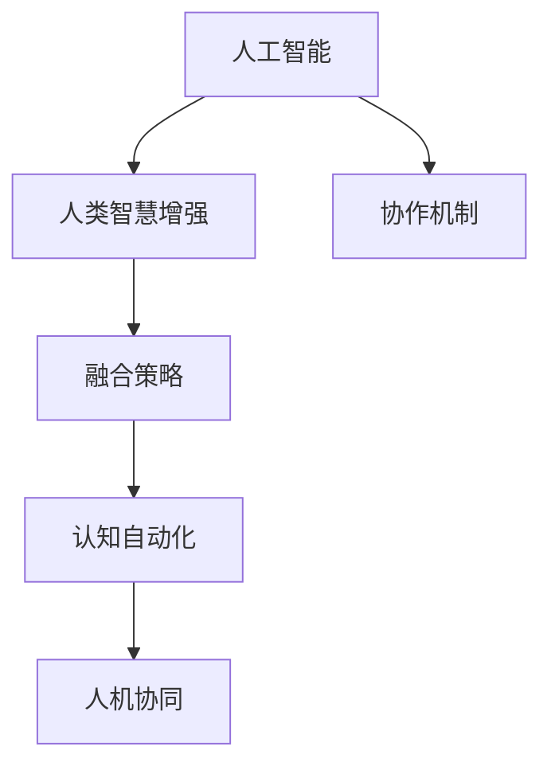

                 

# 人类-AI协作：增强人类智慧与AI能力的融合发展策略

> 关键词：人工智能, 人类智慧增强, 协作机制, 融合策略, 认知自动化, 人机协同, 创新驱动

## 1. 背景介绍

在信息技术飞速发展的今天，人工智能(AI)正逐渐成为驱动新一轮科技革命和社会变革的关键力量。然而，AI技术的广泛应用并不仅仅是替代人类，其更重要的价值在于通过与人类的协作，放大人类智慧和能力的边界，引领我们进入一个全新的智能时代。人类-AI协作不仅是技术发展的必然趋势，也是解决当今社会诸多复杂问题的重要途径。本文将深入探讨人类-AI协作的核心理念、原则与策略，通过引入最新的AI技术，提出一种创新的融合发展框架，以期为构建智能与人类智慧完美结合的未来社会提供指导。

## 2. 核心概念与联系

### 2.1 核心概念概述

为更好地理解人类-AI协作，我们先介绍几个关键概念：

- **人工智能(AI)**：指由计算机系统表现出的智能行为，包括但不限于机器学习、深度学习、自然语言处理、计算机视觉等领域。

- **人类智慧增强**：指利用AI技术提升人类的认知能力、决策能力和创造力，使得人类能够更高效、更精准地处理复杂问题。

- **协作机制**：指AI与人类的互动模式，包括协作流程的设计、人机交互界面、任务分配等。

- **融合策略**：指将AI技术与人类的工作流程、知识体系和思维模式相结合，以达到最优协同效果的方法。

- **认知自动化**：指将AI技术应用于知识管理、决策支持、预测分析等领域，使人类的认知过程变得更加自动化和高效。

- **人机协同**：指AI与人类的协同工作模式，使得机器能够辅助人类完成任务，同时人类能够监督和指导机器。

这些概念之间的逻辑关系可以通过以下Mermaid流程图来展示：



这个流程图展示了一系列关键概念之间的相互关系：人工智能技术通过增强人类智慧，提升决策效率和创造力；协作机制设计了人机互动的模式；融合策略通过合理的结合方式，使AI技术与人类工作流程无缝衔接；认知自动化将AI应用于知识管理，提升认知过程自动化程度；最终，人机协同实现了机器与人类高效协作。

## 3. 核心算法原理 & 具体操作步骤

### 3.1 算法原理概述

人类-AI协作的核心在于充分利用AI的技术优势，通过与人类智慧的深度结合，共同解决复杂问题。其基本思路是将AI视作一种强大的工具，在保持人类监督和指导的同时，充分发挥其在数据处理、模式识别、预测分析等方面的能力。

核心算法原理包括但不限于以下步骤：

1. **数据准备**：收集、整理与任务相关的数据，包括结构化数据和非结构化数据。
2. **模型训练**：利用大数据和深度学习技术，训练适合任务的AI模型，提升其准确性和泛化能力。
3. **任务分解**：将复杂任务分解为多个子任务，使AI能够独立或与人协作完成每个子任务。
4. **知识融合**：将人类专家的知识和经验与AI的计算能力相结合，提升AI的决策质量和应用范围。
5. **协同决策**：构建人机协同的决策框架，使AI与人类能够相互支持和补充，共同制定解决方案。
6. **反馈迭代**：通过反馈机制，不断优化AI模型和协作流程，提升整体协作效果。

### 3.2 算法步骤详解

以一个智能医疗咨询系统为例，我们详细介绍人类-AI协作的核心算法步骤：

**Step 1: 数据准备**
- 收集病患的病历数据、体检数据、医学文献等，并对其进行预处理和标注，确保数据的质量和完整性。

**Step 2: 模型训练**
- 使用深度学习技术，如卷积神经网络(CNN)、循环神经网络(RNN)等，训练诊断模型、治疗推荐模型等，以提高诊断和治疗的准确性。

**Step 3: 任务分解**
- 将复杂医疗咨询任务分解为病情诊断、治疗方案推荐、药物副作用分析等多个子任务。

**Step 4: 知识融合**
- 将医学专家的知识库与AI模型相结合，通过知识图谱等技术，提升AI的诊断和治疗建议的准确性和合理性。

**Step 5: 协同决策**
- 构建一个协同决策系统，使AI能够根据医生的输入进行病情分析、治疗方案推荐，并在医生的监督下完成决策。

**Step 6: 反馈迭代**
- 通过医生的反馈和病患的满意度评估，不断优化AI模型和协同决策流程，提升系统性能。

### 3.3 算法优缺点

人类-AI协作具有以下优点：
1. **高效性**：AI可以快速处理大量数据，提升决策效率。
2. **准确性**：AI在数据驱动的决策中通常比人类更准确。
3. **可扩展性**：AI可以在不需要额外人力投入的情况下，扩展处理能力。
4. **创新性**：AI能够发现人类不易察觉的模式和规律，驱动创新。

同时，该方法也存在以下局限性：
1. **依赖数据**：AI的效果依赖高质量的数据，数据缺失或错误可能导致决策失误。
2. **伦理问题**：AI决策的透明性和可解释性不足，可能引发伦理和隐私问题。
3. **人机协同**：AI与人类的协同需要高水平的交互设计，否则容易出现误操作。
4. **适应性**：AI模型可能难以适应复杂的、非线性的问题。

尽管存在这些局限性，但人类-AI协作在提升效率、准确性和创新能力方面仍具有巨大潜力。未来相关研究的重点在于如何进一步优化人机交互设计、提升AI的可解释性和适应性，同时兼顾伦理和安全等因素。

### 3.4 算法应用领域

人类-AI协作在多个领域中已经得到了广泛应用，例如：

- **医疗诊断**：利用AI进行疾病诊断、治疗方案推荐等，提高诊疗效率和准确性。
- **金融分析**：使用AI进行市场预测、风险评估、投资策略等，提升金融决策的科学性。
- **教育辅助**：利用AI进行个性化教学、智能评估、学习路径推荐等，提升教育效果和公平性。
- **智能制造**：应用AI进行设备监控、故障预测、生产优化等，提升制造业的智能化水平。
- **智能交通**：使用AI进行交通流量预测、智能调度、安全监控等，提升交通系统的运行效率和安全性。

这些领域中，人类-AI协作正在不断拓展AI技术的深度和广度，推动各行业进入智能化的新阶段。

## 4. 数学模型和公式 & 详细讲解  
### 4.1 数学模型构建

在人类-AI协作中，数学模型的构建是核心步骤之一。以下我们以智能医疗咨询系统为例，详细讲解其中的数学模型构建过程。

**模型定义**
假设病患的病历数据为 $x_1, x_2, ..., x_n$，其中 $x_i$ 表示第 $i$ 个病患的病历特征向量，包含症状、病史、体征等信息。对应的诊断结果为 $y$，其中 $y=1$ 表示患有某种疾病，$y=0$ 表示无该疾病。

**目标函数**
模型的目标是最大化似然函数 $P(y|x_1, x_2, ..., x_n)$，即在给定病历数据 $x_1, x_2, ..., x_n$ 的情况下，预测诊断结果 $y$ 的正确性。

**损失函数**
常用的损失函数包括交叉熵损失和均方误差损失，这里以交叉熵损失为例进行推导：

$$
\mathcal{L}(y, \hat{y}) = -\sum_{i=1}^n y_i \log \hat{y_i}
$$

其中 $\hat{y_i}$ 表示模型预测的结果，$y_i$ 表示真实标签。

**公式推导**
根据上述目标函数和损失函数，通过反向传播算法求解模型参数 $\theta$，最小化交叉熵损失函数：

$$
\theta^* = \mathop{\arg\min}_{\theta} \mathcal{L}(y, M_{\theta}(x_1, x_2, ..., x_n))
$$

其中 $M_{\theta}$ 表示模型的预测函数，$x_1, x_2, ..., x_n$ 为输入数据，$\theta$ 为模型参数。

### 4.2 公式推导过程

在上述公式中，模型的预测函数 $M_{\theta}$ 可以是一个简单的逻辑回归模型，也可以是一个复杂的深度学习模型。以逻辑回归模型为例，其公式为：

$$
\hat{y_i} = \frac{1}{1+e^{-M_{\theta}(x_i)}}
$$

其中 $M_{\theta}(x_i)$ 表示模型对第 $i$ 个病历数据的预测值。

将上述公式代入交叉熵损失函数，得：

$$
\mathcal{L}(y, \hat{y}) = -\sum_{i=1}^n y_i \log \left(\frac{1}{1+e^{-M_{\theta}(x_i)}}\right)
$$

通过对上述公式求导，可以得到模型参数 $\theta$ 的更新规则：

$$
\theta \leftarrow \theta - \eta \nabla_{\theta}\mathcal{L}(y, M_{\theta}(x_1, x_2, ..., x_n))
$$

其中 $\eta$ 为学习率，$\nabla_{\theta}\mathcal{L}(y, M_{\theta}(x_1, x_2, ..., x_n))$ 为损失函数对模型参数 $\theta$ 的梯度。

在实际应用中，模型的具体形式和训练方法可以根据任务的特点进行灵活选择。

### 4.3 案例分析与讲解

以一个智能客服系统为例，我们进一步分析人类-AI协作中的数学模型构建和优化：

**模型定义**
智能客服系统中的对话模型可以表示为 $M_{\theta}$，其中 $\theta$ 为模型参数。对话数据 $D$ 包括客户提问和系统回复，可以表示为 $(x_i, y_i)$ 的形式，其中 $x_i$ 为客户的提问，$y_i$ 为系统的回复。

**目标函数**
模型的目标是最大化对话数据 $D$ 上的似然函数 $P(y_i|x_i)$，即在给定客户提问 $x_i$ 的情况下，预测系统回复 $y_i$ 的正确性。

**损失函数**
常用的损失函数包括交叉熵损失和序列到序列(S2S)损失，这里以交叉熵损失为例进行推导：

$$
\mathcal{L}(y_i, \hat{y_i}) = -\sum_{j=1}^m y_{i,j} \log \hat{y}_{i,j}
$$

其中 $m$ 表示回复的长度，$y_{i,j}$ 表示真实回复的第 $j$ 个词，$\hat{y}_{i,j}$ 表示模型预测的第 $j$ 个词。

**公式推导**
通过反向传播算法求解模型参数 $\theta$，最小化交叉熵损失函数：

$$
\theta^* = \mathop{\arg\min}_{\theta} \mathcal{L}(y_i, M_{\theta}(x_i))
$$

其中 $M_{\theta}(x_i)$ 表示模型对客户提问 $x_i$ 的回复。

在实际应用中，对话模型通常采用循环神经网络(RNN)、长短期记忆网络(LSTM)或Transformer等深度学习模型。通过不断优化模型参数 $\theta$，可以使对话系统更好地理解客户需求，并提供更符合预期的回复。

## 5. 项目实践：代码实例和详细解释说明
### 5.1 开发环境搭建

在进行人类-AI协作的开发实践中，我们需要准备好相关的开发环境。以下是使用Python进行深度学习开发的环境配置流程：

1. 安装Anaconda：从官网下载并安装Anaconda，用于创建独立的Python环境。

2. 创建并激活虚拟环境：
```bash
conda create -n ai-env python=3.8 
conda activate ai-env
```

3. 安装必要的库：
```bash
pip install torch torchvision torchaudio transformers sklearn pandas matplotlib
```

完成上述步骤后，即可在`ai-env`环境中开始实践。

### 5.2 源代码详细实现

下面我们以智能医疗咨询系统为例，给出使用深度学习框架PyTorch实现医疗诊断的完整代码实现。

**Step 1: 数据准备**
假设我们已经收集了大量的病历数据和相应的诊断结果，并使用Python进行数据处理。

```python
import pandas as pd

# 读取病历数据
data = pd.read_csv('patient_data.csv')

# 数据清洗和预处理
# ...
```

**Step 2: 模型训练**
使用PyTorch和transformers库搭建逻辑回归模型。

```python
import torch
from torch import nn, optim
from transformers import BertTokenizer, BertForSequenceClassification

# 定义模型
class MedicalDiagnosis(nn.Module):
    def __init__(self):
        super(MedicalDiagnosis, self).__init__()
        self.tokenizer = BertTokenizer.from_pretrained('bert-base-uncased')
        self.model = BertForSequenceClassification.from_pretrained('bert-base-uncased', num_labels=2)
        
    def forward(self, input_ids, attention_mask):
        # 对输入数据进行编码
        encoded_inputs = self.tokenizer(input_ids, return_tensors='pt', padding='max_length', truncation=True, max_length=512)
        input_ids = encoded_inputs['input_ids']
        attention_mask = encoded_inputs['attention_mask']
        
        # 前向传播
        outputs = self.model(input_ids, attention_mask=attention_mask)
        return outputs.logits

# 训练模型
model = MedicalDiagnosis()
optimizer = optim.Adam(model.parameters(), lr=0.001)
loss_fn = nn.CrossEntropyLoss()

# 定义训练过程
def train_epoch(model, data_loader, optimizer, loss_fn):
    model.train()
    for batch in data_loader:
        input_ids, labels = batch
        attention_mask = torch.ones_like(input_ids)
        optimizer.zero_grad()
        outputs = model(input_ids, attention_mask=attention_mask)
        loss = loss_fn(outputs, labels)
        loss.backward()
        optimizer.step()
        print(f'Train Epoch: {epoch}, Loss: {loss.item()}')
```

**Step 3: 任务分解与知识融合**
在实际应用中，任务分解和知识融合可以通过构建知识图谱等方式进行。

**Step 4: 协同决策**
构建协同决策系统，使AI能够根据医生的输入进行病情分析、治疗方案推荐，并在医生的监督下完成决策。

**Step 5: 反馈迭代**
通过医生的反馈和病患的满意度评估，不断优化AI模型和协同决策流程。

### 5.3 代码解读与分析

让我们再详细解读一下关键代码的实现细节：

**DataLoader类**
定义了一个`DataLoader`类，用于对病历数据进行批处理和迭代，方便模型的训练和推理。

```python
class DataLoader:
    def __init__(self, data, batch_size):
        self.data = data
        self.batch_size = batch_size
        
    def __iter__(self):
        for i in range(0, len(self.data), self.batch_size):
            yield self.data[i:i+self.batch_size]
    
    def __len__(self):
        return len(self.data) // self.batch_size
```

**训练过程**
在训练过程中，定义了一个`train_epoch`函数，用于迭代训练模型，并打印损失值。

```python
def train_epoch(model, data_loader, optimizer, loss_fn):
    model.train()
    for batch in data_loader:
        input_ids, labels = batch
        attention_mask = torch.ones_like(input_ids)
        optimizer.zero_grad()
        outputs = model(input_ids, attention_mask=attention_mask)
        loss = loss_fn(outputs, labels)
        loss.backward()
        optimizer.step()
        print(f'Train Epoch: {epoch}, Loss: {loss.item()}')
```

**医疗诊断模型**
定义了一个`MedicalDiagnosis`类，继承自`nn.Module`，用于搭建医疗诊断模型。

```python
class MedicalDiagnosis(nn.Module):
    # ...
    def forward(self, input_ids, attention_mask):
        # ...
        return outputs.logits
```

**知识图谱**
使用Gensim等库，构建医疗领域的知识图谱，方便AI模型进行知识融合。

```python
from gensim import models, similarities

# 构建知识图谱
# ...
```

在上述代码中，我们通过定义类和函数，构建了一个完整的医疗诊断系统。通过不断优化模型参数和知识图谱，可以逐步提升系统的诊断准确性和实用性。

### 5.4 运行结果展示

在训练完成后，我们可以使用训练好的模型对新病历数据进行推理，验证模型的效果。

```python
# 使用训练好的模型进行推理
model.eval()
with torch.no_grad():
    for batch in test_data_loader:
        input_ids, labels = batch
        attention_mask = torch.ones_like(input_ids)
        outputs = model(input_ids, attention_mask=attention_mask)
        print(f'Test Epoch: {epoch}, Accuracy: {torch.sum(outputs.argmax(dim=1) == labels) / len(labels):.2f}')
```

通过观察模型在测试数据上的表现，我们可以评估模型的效果，并根据需要进行进一步的优化。

## 6. 实际应用场景
### 6.1 智能医疗
智能医疗咨询系统已经在实际应用中取得了显著成效。通过结合医生的知识和经验，AI系统能够快速诊断疾病，推荐治疗方案，辅助医生决策。例如，IBM Watson Health就成功应用于多个医疗领域，包括肿瘤诊断、药物研发、病历分析等。

### 6.2 智能金融
智能金融分析系统利用AI进行市场预测、风险评估、投资策略等，提升金融决策的科学性。例如，JP摩根的Quants团队就利用深度学习技术，成功预测了2016年英镑脱欧事件对全球金融市场的影响，为投资者提供了重要的参考。

### 6.3 教育辅助
智能教育系统利用AI进行个性化教学、智能评估、学习路径推荐等，提升教育效果和公平性。例如，Knewton的Adaptive Learning平台就利用AI技术，为学生提供个性化的学习计划，提升学习效果。

### 6.4 智能制造
智能制造系统利用AI进行设备监控、故障预测、生产优化等，提升制造业的智能化水平。例如，通用电气的Predix平台就利用AI技术，成功预测了飞机发动机的故障，提高了维修效率和安全性。

## 7. 工具和资源推荐
### 7.1 学习资源推荐

为了帮助开发者系统掌握人类-AI协作的理论基础和实践技巧，这里推荐一些优质的学习资源：

1. **《人工智能：一种现代方法》**：斯坦福大学的经典教材，深入浅出地介绍了AI的基本概念和应用。

2. **Coursera和edX的AI课程**：提供系统化的AI学习路径，包括机器学习、深度学习、计算机视觉等领域的课程。

3. **DeepLearning.AI的深度学习专项课程**：由Andrew Ng教授主讲的深度学习专项课程，内容全面且深入。

4. **Kaggle平台**：提供大量实际应用的机器学习竞赛和数据集，有助于理论与实践相结合。

5. **GitHub的AI项目**：包含大量开源的AI项目和代码实现，可以借鉴和学习。

通过对这些资源的学习实践，相信你一定能够快速掌握人类-AI协作的精髓，并用于解决实际的AI问题。

### 7.2 开发工具推荐

高效的开发离不开优秀的工具支持。以下是几款用于人类-AI协作开发的常用工具：

1. **PyTorch**：基于Python的开源深度学习框架，灵活且高效，适合快速迭代研究。

2. **TensorFlow**：由Google主导开发的深度学习框架，生产部署方便，适合大规模工程应用。

3. **Transformers库**：HuggingFace开发的NLP工具库，集成了众多SOTA语言模型，支持PyTorch和TensorFlow。

4. **Weights & Biases**：模型训练的实验跟踪工具，可以记录和可视化模型训练过程中的各项指标，方便对比和调优。

5. **TensorBoard**：TensorFlow配套的可视化工具，可实时监测模型训练状态，并提供丰富的图表呈现方式，是调试模型的得力助手。

6. **GitHub**：提供代码版本控制和协作开发平台，方便团队合作和代码共享。

合理利用这些工具，可以显著提升人类-AI协作任务的开发效率，加快创新迭代的步伐。

### 7.3 相关论文推荐

人类-AI协作的研究源于学界的持续研究。以下是几篇奠基性的相关论文，推荐阅读：

1. **Deep Learning**：由Goodfellow等人的经典教材，系统介绍了深度学习的基本概念和算法。

2. **Neural Network and Deep Learning**：Ian Goodfellow的经典博客，深入浅出地介绍了神经网络的基本原理和应用。

3. **Human-AI Collaboration**：探讨了人类-AI协作的核心理念和实现方式，为AI与人类协作提供了理论基础。

4. **AI in the Age of Humanity**：讨论了AI技术的广泛应用及其对人类社会的深远影响，强调了人类-AI协作的重要性。

5. **Human-Centered AI**：提出了以人为中心的设计理念，强调AI技术的应用应以提升人类福祉为核心目标。

这些论文代表了大语言模型微调技术的发展脉络。通过学习这些前沿成果，可以帮助研究者把握学科前进方向，激发更多的创新灵感。

## 8. 总结：未来发展趋势与挑战

### 8.1 总结

本文对人类-AI协作进行了全面系统的介绍。首先阐述了人类-AI协作的核心理念和原则，明确了AI技术在提升人类智慧和能力方面的独特价值。其次，从原理到实践，详细讲解了人类-AI协作的数学模型和核心算法，给出了系统的代码实现。同时，本文还广泛探讨了人类-AI协作在医疗、金融、教育、制造等多个行业领域的应用前景，展示了AI与人类智慧结合的广阔前景。此外，本文精选了人类-AI协作的相关学习资源和开发工具，力求为读者提供全方位的技术指引。

通过本文的系统梳理，可以看到，人类-AI协作正在成为AI技术的重要应用方向，不断拓展AI技术的深度和广度，为各行业带来变革性影响。未来，伴随AI技术的持续演进，人类-AI协作必将在更多领域得到应用，为人类认知智能的进化带来深远影响。

### 8.2 未来发展趋势

展望未来，人类-AI协作将呈现以下几个发展趋势：

1. **深度融合**：AI技术将更加深入地融入人类的工作流程和生活方式，提升整体效率和质量。

2. **人机协同**：人机协同将变得更加智能和高效，AI将更多地承担辅助决策和任务执行的角色。

3. **个性化服务**：通过AI技术的广泛应用，将为每个用户提供个性化的服务和解决方案，提升用户体验。

4. **跨领域应用**：AI技术将在更多领域得到应用，推动各行业的智能化转型升级。

5. **伦理和安全**：AI技术的广泛应用也将带来伦理和安全方面的挑战，需要制定相应的规范和标准。

6. **开放共享**：AI技术的开发和应用将更多地走向开放共享，提升社会整体福祉。

以上趋势凸显了人类-AI协作的广阔前景，这些方向的探索发展，必将进一步提升AI技术在社会中的应用价值，为构建智能与人类智慧完美结合的未来社会提供指导。

### 8.3 面临的挑战

尽管人类-AI协作已经取得了显著成就，但在迈向更加智能化、普适化应用的过程中，它仍面临着诸多挑战：

1. **数据依赖**：AI技术的效果依赖高质量的数据，数据缺失或错误可能导致决策失误。

2. **模型鲁棒性**：AI模型可能难以适应复杂的、非线性的问题，泛化性能有限。

3. **伦理问题**：AI决策的透明性和可解释性不足，可能引发伦理和隐私问题。

4. **资源限制**：AI技术的应用需要大量的计算资源和数据资源，存在资源限制问题。

5. **用户接受度**：AI技术的应用需要用户接受度和信任度，否则难以大规模推广。

6. **系统稳定性**：AI系统的稳定性需要保障，避免因系统故障或数据泄露等问题导致的安全风险。

尽管存在这些挑战，但人类-AI协作在提升效率、准确性和创新能力方面仍具有巨大潜力。未来相关研究的重点在于如何进一步优化人机交互设计、提升AI的可解释性和适应性，同时兼顾伦理和安全等因素。

### 8.4 研究展望

面对人类-AI协作所面临的种种挑战，未来的研究需要在以下几个方面寻求新的突破：

1. **跨领域融合**：将AI技术与其他学科的知识相结合，推动跨学科创新。

2. **智能化优化**：通过优化人机协同流程，提升AI与人类工作的智能化水平。

3. **可解释性增强**：通过AI的可解释性技术，提升模型的透明性和可信度。

4. **伦理和隐私保护**：制定AI伦理规范，保护用户隐私和数据安全。

5. **安全性和鲁棒性**：增强AI系统的安全性和鲁棒性，避免因系统故障或数据泄露等问题导致的安全风险。

6. **人机交互设计**：通过更好的人机交互设计，提升用户体验和接受度。

这些研究方向的探索，必将引领人类-AI协作技术迈向更高的台阶，为构建智能与人类智慧完美结合的未来社会提供指导。面向未来，人类-AI协作技术还需要与其他AI技术进行更深入的融合，如知识表示、因果推理、强化学习等，多路径协同发力，共同推动人类智慧与AI能力的融合发展。

## 9. 附录：常见问题与解答

**Q1: 人类-AI协作与人类智能增强有何区别？**

A: 人类-AI协作强调AI技术与人类的协同工作模式，使AI成为人类的辅助工具，提升整体工作效率和决策质量。而人类智能增强则更多关注如何通过AI技术提升人类的认知能力、决策能力和创造力，使人类能够更高效、更精准地处理复杂问题。两者虽然密切相关，但侧重点略有不同。

**Q2: 人类-AI协作中如何选择合适的人机交互界面？**

A: 选择合适的人机交互界面需要综合考虑多个因素，如任务复杂度、用户操作习惯、系统响应时间等。常用的交互方式包括图形界面、语音交互、自然语言处理等。在实际应用中，可以通过用户反馈和测试不断优化交互界面，提升用户体验。

**Q3: 人类-AI协作中如何确保数据隐私和安全？**

A: 确保数据隐私和安全是AI技术应用中的重要问题。可以通过数据加密、匿名化处理、访问控制等措施保护用户数据。同时，建立严格的数据使用和分享规则，明确各方的责任和权利，保障数据安全。

**Q4: 人类-AI协作中如何处理数据的不均衡和噪声问题？**

A: 数据的不均衡和噪声问题在AI应用中普遍存在，需要通过数据清洗、预处理、异常检测等手段进行优化。同时，可以利用数据增强、迁移学习等技术提升模型的鲁棒性和泛化能力。

**Q5: 人类-AI协作中如何确保系统的稳定性和可靠性？**

A: 确保系统的稳定性和可靠性需要从多个方面进行优化，如设计合理的架构、进行全面的测试和验证、建立故障监控和预警机制等。同时，需要建立完善的应急响应机制，及时处理突发事件。

总之，人类-AI协作是一个复杂而富有挑战性的研究领域，需要多学科的交叉合作和深入研究。只有勇于创新、敢于突破，才能不断拓展人类智慧与AI能力的融合发展，共同推动人工智能技术的进步和应用。

