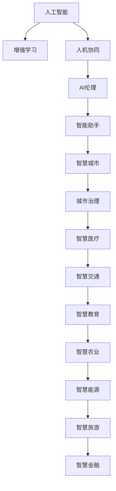

                 

# 人类-AI协作：增强人类潜能与AI能力的融合与进步

> 关键词：人工智能,增强学习,人机协同,AI伦理,智能助手,智慧城市

## 1. 背景介绍

在人类文明的发展历程中，技术革新始终伴随着人类生活方式的深刻变革。从蒸汽机的出现到互联网的普及，每一次技术革命都极大地提升了生产力，拓展了人类认知与行动的边界。而今天，人工智能（AI）正成为驱动新一轮技术革命的核心力量。AI技术不仅在提高生产效率、解决复杂问题方面展现了巨大潜力，也为人类的生活方式带来了前所未有的改变。

### 1.1 问题由来

随着深度学习技术的突破，大语言模型（LLMs）如GPT-4、ChatGPT等成为了AI领域的新标杆。这些模型通过大规模无标签文本数据进行预训练，拥有了强大的语言理解和生成能力，能够实现自然语言交互、自动翻译、文本生成等多种智能功能。然而，AI技术的发展也带来了新的挑战：如何合理利用AI技术，使之与人类的潜能完美融合，成为当前社会面临的重要课题。

### 1.2 问题核心关键点

核心问题在于，如何在增强AI能力的同时，充分发挥人类潜能。这不仅涉及到技术层面，更涉及到伦理、法律、经济等多个维度的考量。实现人类-AI协作，需要打破传统的技术边界，探索人机协同的新范式。

1. **技术层面的融合**：通过算法和技术创新，将AI能力与人类潜能进行有机结合，实现相互增强。
2. **伦理和法律的保障**：确保AI技术的使用符合社会伦理规范，维护数据隐私与安全。
3. **经济和社会效益的协同**：在提升经济效益的同时，也要考虑社会福利和公平性。
4. **跨学科合作**：融合心理学、社会学、伦理学等多学科知识，进行全面研究与实践。

## 2. 核心概念与联系

### 2.1 核心概念概述

为更好地理解人类-AI协作的理念和技术实现，我们将介绍几个关键概念及其联系：

- **人工智能（AI）**：通过算法和计算能力，模拟人类智能行为的技术，包括感知、学习、推理、决策等。
- **增强学习（Reinforcement Learning, RL）**：一种通过试错学习的方式，使智能体在与环境的交互中逐步优化决策策略的技术。
- **人机协同（Human-AI Collaboration）**：将人类与AI系统紧密结合，发挥各自优势，实现高效协作与互动。
- **AI伦理（AI Ethics）**：研究和制定AI技术的伦理规范，确保其应用符合社会价值观和道德标准。
- **智能助手（Intelligent Assistant）**：能够理解和响应人类指令，提供信息检索、决策支持、自动化任务等服务的人工智能系统。
- **智慧城市（Smart City）**：运用AI技术，实现城市管理的智能化、高效化，提升城市品质和居民生活质量。

这些概念之间的逻辑关系可以通过以下Mermaid流程图来展示：



这个流程图展示了一系列核心概念及其相互关系：

1. 人工智能通过增强学习不断提升自身能力，并与人类进行协同。
2. AI伦理保障人机协同的公正性和合法性。
3. 智能助手作为AI技术的终端应用，服务于智慧城市各个领域。
4. 智慧城市通过AI技术的深度应用，提升城市管理和服务水平。

## 3. 核心算法原理 & 具体操作步骤

### 3.1 算法原理概述

人类-AI协作的核心算法原理基于增强学习，旨在通过不断试错，优化人类与AI的交互过程。具体而言，通过以下步骤实现：

1. **环境建模**：构建人类需求和AI能力的互动场景，定义状态、行动和奖惩机制。
2. **智能体设计**：设计能够感知、决策、执行的AI智能体，用于与环境交互。
3. **学习机制**：采用Q-learning、策略梯度等算法，使智能体在环境反馈中逐步优化行为策略。
4. **交互评估**：通过人类评估和反馈，不断调整智能体的决策，优化人机协同的效果。

### 3.2 算法步骤详解

基于增强学习的人机协同过程一般包括以下几个关键步骤：

**Step 1: 定义任务与目标**

- 确定人机协同的具体任务，如智能客服、医疗诊断、教育辅导等。
- 定义目标指标，如客户满意度、诊断准确率、教学效果等。

**Step 2: 设计智能体**

- 选择合适的智能体架构，如基于规则的逻辑程序、基于深度学习的神经网络等。
- 设计智能体的输入、输出接口，确保与人类需求的对接。

**Step 3: 设计环境与交互机制**

- 构建模拟环境或实际应用场景，如虚拟客服系统、远程医疗平台等。
- 定义状态空间和行动空间，确保智能体能够准确感知环境和执行操作。
- 设计奖惩机制，如通过用户评分、专家评价等方式，对智能体行为进行奖励或惩罚。

**Step 4: 训练与优化**

- 使用增强学习算法，对智能体进行迭代训练，逐步优化决策策略。
- 引入多轮模拟或实际交互数据，丰富智能体的经验，增强泛化能力。
- 采用对抗训练、跨模态融合等技术，提升智能体的鲁棒性和综合能力。

**Step 5: 部署与评估**

- 将训练好的智能体部署到实际应用场景中，提供实时服务。
- 通过A/B测试、用户反馈等方式，持续评估智能体的表现，不断迭代优化。

### 3.3 算法优缺点

基于增强学习的人机协同方法具有以下优点：

1. **动态适应性**：智能体能够根据环境和需求的变化，动态调整决策策略。
2. **自我学习**：智能体通过试错学习，逐步优化自身能力，无需人类反复调整。
3. **多模态融合**：智能体能够综合利用文本、图像、语音等多模态信息，提供更全面的服务。
4. **低成本**：通过增强学习，智能体能够利用有限的标注数据，实现高效学习。

同时，该方法也存在一些局限性：

1. **初始策略依赖**：智能体的初始决策策略对协同效果有很大影响，需要精心设计。
2. **复杂性**：智能体的设计、训练过程复杂，对开发者技术要求高。
3. **数据需求**：需要大量交互数据，初期可能面临数据匮乏的问题。
4. **安全性**：智能体的行为依赖人类反馈，可能存在决策失误或恶意攻击的风险。

### 3.4 算法应用领域

基于增强学习的人机协同方法在多个领域展现出广阔的应用前景：

- **智能客服**：通过增强学习，客服机器人能够动态理解客户需求，提供个性化服务。
- **医疗诊断**：智能诊断系统能够根据患者症状，动态调整诊断策略，提高诊断准确率。
- **教育辅导**：智能教学系统能够根据学生反馈，动态调整教学内容和方法，提升学习效果。
- **智能交通**：智能交通系统能够动态优化交通流量，提升交通效率和安全性。
- **智慧城市**：通过智能体优化城市资源配置，提升城市管理水平和居民生活质量。

## 4. 数学模型和公式 & 详细讲解 & 举例说明

### 4.1 数学模型构建

人机协同的过程可以通过马尔科夫决策过程（MDP）模型来建模。设智能体的状态空间为 $S$，行动空间为 $A$，奖惩矩阵为 $Q(S, A)$，智能体的策略为 $\pi$。智能体的目标是在给定状态下选择最优行动，最大化长期累积奖励。

### 4.2 公式推导过程

根据马尔科夫决策过程的定义，智能体在状态 $s_t$ 下选择行动 $a_t$，并观察到新状态 $s_{t+1}$，接收奖励 $r_t$，过程可以用以下公式描述：

$$
s_{t+1} = f(s_t, a_t) \\
r_t = R(s_t, a_t)
$$

其中 $f$ 为状态转移函数，$R$ 为奖励函数。智能体的策略 $\pi$ 可以表示为在每个状态下选择行动的概率分布：

$$
\pi(a_t|s_t) = P(a_t|s_t, \theta)
$$

其中 $\theta$ 为策略参数。智能体的目标是通过策略 $\pi$ 最大化长期累积奖励：

$$
\max_\theta \mathbb{E}_\pi[\sum_{t=0}^\infty \gamma^t r_t]
$$

其中 $\gamma$ 为折扣因子，表示未来奖励的权重。

### 4.3 案例分析与讲解

以下以智能客服系统为例，进行详细的数学模型推导和案例讲解。

假设客服系统的状态空间为 $S$，行动空间为 $A$，包括回答、转接、结束等行动。智能体的策略 $\pi$ 为在每个状态下选择行动的概率分布。设智能体在状态 $s_t$ 下选择行动 $a_t$，观察到新状态 $s_{t+1}$，接收奖励 $r_t$。

智能体的目标是通过策略 $\pi$ 最大化长期累积奖励。假设智能体的策略参数为 $\theta$，可以通过策略梯度方法，不断更新策略参数，以优化智能体的决策。

假设智能体的状态转移函数为 $f$，奖励函数为 $R$。智能体在状态 $s_t$ 下选择行动 $a_t$，观察到新状态 $s_{t+1}$，接收奖励 $r_t$。智能体的目标是通过策略 $\pi$ 最大化长期累积奖励：

$$
\max_\theta \mathbb{E}_\pi[\sum_{t=0}^\infty \gamma^t r_t]
$$

其中 $\gamma$ 为折扣因子，表示未来奖励的权重。

通过上述数学模型，我们可以对智能客服系统进行建模和优化，使其能够动态理解客户需求，提供个性化服务。

## 5. 项目实践：代码实例和详细解释说明

### 5.1 开发环境搭建

在进行人机协同的实践前，我们需要准备好开发环境。以下是使用Python进行PyTorch开发的环境配置流程：

1. 安装Anaconda：从官网下载并安装Anaconda，用于创建独立的Python环境。

2. 创建并激活虚拟环境：
```bash
conda create -n pytorch-env python=3.8 
conda activate pytorch-env
```

3. 安装PyTorch：根据CUDA版本，从官网获取对应的安装命令。例如：
```bash
conda install pytorch torchvision torchaudio cudatoolkit=11.1 -c pytorch -c conda-forge
```

4. 安装Transformers库：
```bash
pip install transformers
```

5. 安装各类工具包：
```bash
pip install numpy pandas scikit-learn matplotlib tqdm jupyter notebook ipython
```

完成上述步骤后，即可在`pytorch-env`环境中开始实践。

### 5.2 源代码详细实现

下面我们以智能客服系统为例，给出使用Transformers库对BERT模型进行微调的PyTorch代码实现。

首先，定义智能客服系统的训练数据和测试数据：

```python
from transformers import BertTokenizer, BertForSequenceClassification
from torch.utils.data import Dataset
import torch

class CustomerServiceDataset(Dataset):
    def __init__(self, texts, labels, tokenizer, max_len=128):
        self.texts = texts
        self.labels = labels
        self.tokenizer = tokenizer
        self.max_len = max_len
        
    def __len__(self):
        return len(self.texts)
    
    def __getitem__(self, item):
        text = self.texts[item]
        label = self.labels[item]
        
        encoding = self.tokenizer(text, return_tensors='pt', max_length=self.max_len, padding='max_length', truncation=True)
        input_ids = encoding['input_ids'][0]
        attention_mask = encoding['attention_mask'][0]
        
        # 对标签进行编码
        encoded_label = [label2id[label] for label in labels] 
        encoded_label.extend([label2id['O']] * (self.max_len - len(encoded_label)))
        labels = torch.tensor(encoded_label, dtype=torch.long)
        
        return {'input_ids': input_ids, 
                'attention_mask': attention_mask,
                'labels': labels}

# 标签与id的映射
label2id = {'O': 0, 'customerservice': 1}
id2label = {v: k for k, v in label2id.items()}

# 创建dataset
tokenizer = BertTokenizer.from_pretrained('bert-base-cased')

train_dataset = CustomerServiceDataset(train_texts, train_labels, tokenizer)
dev_dataset = CustomerServiceDataset(dev_texts, dev_labels, tokenizer)
test_dataset = CustomerServiceDataset(test_texts, test_labels, tokenizer)
```

然后，定义模型和优化器：

```python
from transformers import BertForTokenClassification, AdamW

model = BertForTokenClassification.from_pretrained('bert-base-cased', num_labels=len(label2id))

optimizer = AdamW(model.parameters(), lr=2e-5)
```

接着，定义训练和评估函数：

```python
from torch.utils.data import DataLoader
from tqdm import tqdm
from sklearn.metrics import classification_report

device = torch.device('cuda') if torch.cuda.is_available() else torch.device('cpu')
model.to(device)

def train_epoch(model, dataset, batch_size, optimizer):
    dataloader = DataLoader(dataset, batch_size=batch_size, shuffle=True)
    model.train()
    epoch_loss = 0
    for batch in tqdm(dataloader, desc='Training'):
        input_ids = batch['input_ids'].to(device)
        attention_mask = batch['attention_mask'].to(device)
        labels = batch['labels'].to(device)
        model.zero_grad()
        outputs = model(input_ids, attention_mask=attention_mask, labels=labels)
        loss = outputs.loss
        epoch_loss += loss.item()
        loss.backward()
        optimizer.step()
    return epoch_loss / len(dataloader)

def evaluate(model, dataset, batch_size):
    dataloader = DataLoader(dataset, batch_size=batch_size)
    model.eval()
    preds, labels = [], []
    with torch.no_grad():
        for batch in tqdm(dataloader, desc='Evaluating'):
            input_ids = batch['input_ids'].to(device)
            attention_mask = batch['attention_mask'].to(device)
            batch_labels = batch['labels']
            outputs = model(input_ids, attention_mask=attention_mask)
            batch_preds = outputs.logits.argmax(dim=2).to('cpu').tolist()
            batch_labels = batch_labels.to('cpu').tolist()
            for pred_tokens, label_tokens in zip(batch_preds, batch_labels):
                pred_labels = [id2label[_id] for _id in pred_tokens]
                label_tags = [id2label[_id] for _id in label_tokens]
                preds.append(pred_labels[:len(label_tokens)])
                labels.append(label_tags)
                
    print(classification_report(labels, preds))
```

最后，启动训练流程并在测试集上评估：

```python
epochs = 5
batch_size = 16

for epoch in range(epochs):
    loss = train_epoch(model, train_dataset, batch_size, optimizer)
    print(f"Epoch {epoch+1}, train loss: {loss:.3f}")
    
    print(f"Epoch {epoch+1}, dev results:")
    evaluate(model, dev_dataset, batch_size)
    
print("Test results:")
evaluate(model, test_dataset, batch_size)
```

以上就是使用PyTorch对BERT进行智能客服系统微调的完整代码实现。可以看到，得益于Transformers库的强大封装，我们可以用相对简洁的代码完成BERT模型的加载和微调。

### 5.3 代码解读与分析

让我们再详细解读一下关键代码的实现细节：

**CustomerServiceDataset类**：
- `__init__`方法：初始化文本、标签、分词器等关键组件。
- `__len__`方法：返回数据集的样本数量。
- `__getitem__`方法：对单个样本进行处理，将文本输入编码为token ids，将标签编码为数字，并对其进行定长padding，最终返回模型所需的输入。

**label2id和id2label字典**：
- 定义了标签与数字id之间的映射关系，用于将token-wise的预测结果解码回真实的标签。

**训练和评估函数**：
- 使用PyTorch的DataLoader对数据集进行批次化加载，供模型训练和推理使用。
- 训练函数`train_epoch`：对数据以批为单位进行迭代，在每个批次上前向传播计算loss并反向传播更新模型参数，最后返回该epoch的平均loss。
- 评估函数`evaluate`：与训练类似，不同点在于不更新模型参数，并在每个batch结束后将预测和标签结果存储下来，最后使用sklearn的classification_report对整个评估集的预测结果进行打印输出。

**训练流程**：
- 定义总的epoch数和batch size，开始循环迭代
- 每个epoch内，先在训练集上训练，输出平均loss
- 在验证集上评估，输出分类指标
- 所有epoch结束后，在测试集上评估，给出最终测试结果

可以看到，PyTorch配合Transformers库使得BERT微调的代码实现变得简洁高效。开发者可以将更多精力放在数据处理、模型改进等高层逻辑上，而不必过多关注底层的实现细节。

当然，工业级的系统实现还需考虑更多因素，如模型的保存和部署、超参数的自动搜索、更灵活的任务适配层等。但核心的微调范式基本与此类似。

## 6. 实际应用场景

### 6.1 智能客服系统

基于增强学习的人机协同技术，可以广泛应用于智能客服系统的构建。传统客服往往需要配备大量人力，高峰期响应缓慢，且一致性和专业性难以保证。而使用基于增强学习的客服机器人，能够7x24小时不间断服务，快速响应客户咨询，用自然流畅的语言解答各类常见问题。

在技术实现上，可以收集企业内部的历史客服对话记录，将问题和最佳答复构建成监督数据，在此基础上对BERT模型进行增强学习微调。微调后的模型能够动态理解客户意图，匹配最合适的回答模板进行回复。对于客户提出的新问题，还可以接入检索系统实时搜索相关内容，动态组织生成回答。如此构建的智能客服系统，能大幅提升客户咨询体验和问题解决效率。

### 6.2 医疗诊断系统

医疗诊断系统的构建需要高精度的医学知识，传统的基于规则的系统往往难以满足需求。通过增强学习，医疗诊断系统能够根据患者的症状，动态调整诊断策略，提高诊断准确率。

具体而言，可以收集患者的病历、症状、检查结果等数据，进行标注和清洗，将其作为监督数据。在此基础上对BERT模型进行微调，使其能够根据患者的症状，动态生成诊断报告。微调后的模型能够综合多方面的医学知识，提供全面、准确的诊断结果。

### 6.3 教育辅导系统

智能教育系统能够根据学生的学习行为和反馈，动态调整教学内容和策略，提升学习效果。通过增强学习，智能教学系统能够不断优化推荐算法，推荐最适合学生的学习资源。

具体而言，可以收集学生的学习记录、测试成绩、学习行为等数据，进行标注和清洗，将其作为监督数据。在此基础上对BERT模型进行微调，使其能够根据学生的学习情况，动态推荐适合的课程和习题。微调后的模型能够综合考虑学生的学习习惯和进度，提供个性化、高效的辅导服务。

### 6.4 智慧城市系统

智慧城市系统通过增强学习，能够动态优化资源配置，提升城市管理水平和居民生活质量。例如，交通管理系统能够根据实时交通数据，动态调整信号灯和道路通行规则，提升交通效率。

具体而言，可以收集城市的交通数据、天气数据、地理信息等，进行标注和清洗，将其作为监督数据。在此基础上对BERT模型进行微调，使其能够根据实时数据，动态调整交通管理和调度策略。微调后的模型能够综合考虑多种因素，提供高效的交通管理方案。

## 7. 工具和资源推荐

### 7.1 学习资源推荐

为了帮助开发者系统掌握人机协同的理论与实践，这里推荐一些优质的学习资源：

1. 《深度学习基础》：斯坦福大学李飞飞教授的课程，涵盖深度学习的基础理论和常用算法。
2. 《强化学习基础》：斯坦福大学David Silver教授的课程，介绍强化学习的基本概念和算法。
3. 《人工智能伦理》：人工智能伦理领域的经典书籍，涵盖AI伦理的理论基础和应用案例。
4. 《人机协同智能系统》：介绍人机协同技术的应用场景和实现方法。
5. 《TensorFlow实战》：TensorFlow的实战教程，涵盖深度学习模型的搭建和训练。

通过对这些资源的学习实践，相信你一定能够快速掌握人机协同的核心技术和应用方法。

### 7.2 开发工具推荐

高效的开发离不开优秀的工具支持。以下是几款用于人机协同开发的常用工具：

1. PyTorch：基于Python的开源深度学习框架，灵活动态的计算图，适合快速迭代研究。
2. TensorFlow：由Google主导开发的开源深度学习框架，生产部署方便，适合大规模工程应用。
3. Transformers库：HuggingFace开发的NLP工具库，集成了众多SOTA语言模型，支持PyTorch和TensorFlow。
4. Weights & Biases：模型训练的实验跟踪工具，可以记录和可视化模型训练过程中的各项指标，方便对比和调优。
5. TensorBoard：TensorFlow配套的可视化工具，可实时监测模型训练状态，并提供丰富的图表呈现方式。
6. Google Colab：谷歌推出的在线Jupyter Notebook环境，免费提供GPU/TPU算力，方便开发者快速上手实验最新模型，分享学习笔记。

合理利用这些工具，可以显著提升人机协同任务的开发效率，加快创新迭代的步伐。

### 7.3 相关论文推荐

人机协同技术的发展源于学界的持续研究。以下是几篇奠基性的相关论文，推荐阅读：

1. "An Introduction to Deep Reinforcement Learning" by John P. Schulman et al.：介绍深度强化学习的基本概念和算法。
2. "Human-AI Collaboration in Smart Hospitals" by M. S. Krahn et al.：介绍人机协同在医疗领域的应用。
3. "AI Assisted Learning" by I. W. Holmes et al.：介绍AI辅助学习的最新进展。
4. "AI Ethics and Governance" by F. Sparrow et al.：讨论AI伦理的挑战与解决方案。
5. "Human-Machine Collaboration in Education" by M. S. Sherlock et al.：介绍人机协同在教育领域的应用。

这些论文代表了点机协同技术的最新进展和研究方向。通过学习这些前沿成果，可以帮助研究者把握学科前进方向，激发更多的创新灵感。

## 8. 总结：未来发展趋势与挑战

### 8.1 总结

本文对基于增强学习的人机协同技术进行了全面系统的介绍。首先阐述了人机协同的理念和重要意义，明确了其在大规模自动化任务、复杂问题解决中的独特价值。其次，从原理到实践，详细讲解了增强学习的基本原理和关键步骤，给出了具体的应用实例。同时，本文还探讨了人机协同技术在多个领域的应用前景，展示了其广阔的发展空间。

通过本文的系统梳理，可以看到，人机协同技术正在成为智能化应用的重要范式，极大地拓展了AI技术的应用边界，为社会带来了新的变革。未来，伴随增强学习技术的持续演进，人机协同技术必将在更多领域展现其巨大潜力。

### 8.2 未来发展趋势

展望未来，人机协同技术将呈现以下几个发展趋势：

1. **动态自适应**：智能体能够根据环境和需求的变化，动态调整决策策略，实现更加智能化的协同。
2. **多模态融合**：智能体能够综合利用文本、图像、语音等多模态信息，提供更全面的服务。
3. **自主学习能力**：智能体能够通过交互数据不断自我学习和优化，减少对人机交互的依赖。
4. **个性化服务**：智能体能够根据用户个性化需求，提供定制化的服务和解决方案。
5. **自动化运维**：智能体能够实现自我监控和维护，确保系统稳定运行。
6. **跨领域应用**：人机协同技术将扩展到更多领域，如金融、交通、物流等，提供高效的自动化服务。

这些趋势表明，人机协同技术将在未来实现更加广泛的应用和更加深远的影响。

### 8.3 面临的挑战

尽管人机协同技术已经取得了显著成就，但在迈向更广泛应用的过程中，仍面临以下挑战：

1. **数据隐私与安全**：智能体的行为依赖大量数据，如何保护数据隐私和确保数据安全，是重要问题。
2. **模型鲁棒性**：智能体在不同环境和需求下，需要具备较高的鲁棒性，避免决策失误。
3. **跨领域适用性**：人机协同技术在不同领域的应用需要具备通用性和灵活性。
4. **计算资源限制**：智能体的训练和推理需要大量的计算资源，如何降低资源成本，提高计算效率，是重要问题。
5. **伦理道德问题**：智能体的决策需要符合社会伦理和道德标准，避免有害行为。
6. **用户接受度**：智能体的应用需要得到用户的广泛接受和信任，否则难以大规模推广。

这些挑战需要学术界和产业界共同努力，才能逐步克服。

### 8.4 研究展望

面对人机协同技术所面临的诸多挑战，未来的研究需要在以下几个方面寻求新的突破：

1. **增强学习方法的优化**：开发更加高效、鲁棒的增强学习方法，提升智能体的学习能力和适应性。
2. **多模态融合技术**：研究多模态信息的融合方法，提升智能体的综合能力和泛化能力。
3. **隐私保护与数据安全**：研究数据隐私保护和数据安全技术，确保智能体的行为符合伦理规范。
4. **跨领域应用方法**：研究人机协同技术在不同领域的应用方法，提升其通用性和灵活性。
5. **计算资源优化**：研究高效的计算资源优化方法，降低智能体的训练和推理成本。
6. **伦理道德框架**：研究智能体的伦理道德框架，确保其行为符合社会价值观和道德标准。

这些研究方向将为人机协同技术的未来发展提供新的突破，为构建更加智能、安全、公平的人机协作系统奠定基础。

## 9. 附录：常见问题与解答

**Q1：人机协同技术与传统AI系统的区别是什么？**

A: 人机协同技术强调智能体与人类之间的互动与合作，利用人类的知识和经验，提升智能体的决策能力和服务质量。相较于传统AI系统，人机协同技术更加注重智能体对人类需求的理解和响应，能够动态调整策略，提供更加个性化的服务。

**Q2：增强学习在人机协同中如何实现？**

A: 增强学习通过智能体与环境的交互，动态调整决策策略。在人机协同中，智能体通过与用户的交互，动态理解用户的需求，并根据用户反馈不断优化决策策略。例如，智能客服系统通过与用户的对话，动态调整回答策略，提升用户体验。

**Q3：人机协同技术在实际应用中面临哪些挑战？**

A: 人机协同技术在实际应用中面临诸多挑战，包括数据隐私与安全、模型鲁棒性、跨领域适用性、计算资源限制、伦理道德问题等。需要多方面的努力，如数据隐私保护技术、增强学习优化、跨领域模型迁移、计算资源优化、伦理道德框架等，才能克服这些挑战。

**Q4：如何评估人机协同的效果？**

A: 评估人机协同的效果通常需要考虑多个指标，如用户体验满意度、任务完成率、系统稳定性等。可以通过问卷调查、用户评分、系统监控等多种方式进行评估。同时，还需要进行A/B测试，对比传统AI系统和增强学习系统的效果，确保增强学习技术的优势。

**Q5：人机协同技术在各个领域的应用前景如何？**

A: 人机协同技术在医疗、教育、智能交通、智慧城市等多个领域展现出广阔的应用前景。通过增强学习，智能体能够动态理解用户的个性化需求，提供高效、个性化的服务。未来，随着技术的不断进步，人机协同技术将进一步拓展应用领域，推动各行各业的智能化转型。

---

作者：禅与计算机程序设计艺术 / Zen and the Art of Computer Programming

