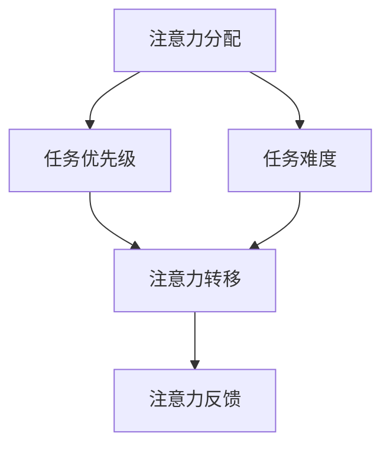

                 

## 1. 背景介绍

### 1.1 问题由来
在快速变化的商业环境中，专注力和注意力成为了个体和组织竞争力的关键要素。在数字时代，信息爆炸、多任务处理日益普及，注意力显得尤为珍贵。如何在有限的时间内，集中注意力，提升工作效率，成为每一个从业者面临的挑战。

注意力增强技术的兴起，为这一问题提供了新的解决方案。通过科学设计，注意力增强技术能够有效提升个体的专注力和注意力，帮助他们在复杂环境中实现高效决策和执行。

### 1.2 问题核心关键点
注意力增强技术主要包括注意力分配、注意力转移、注意力反馈三大核心环节，旨在通过精准分配和适时调整，帮助用户维持高效专注状态。

1. **注意力分配**：通过算法模型预测当前任务的优先级和难度，自动分配用户注意力资源，优先处理重要任务。
2. **注意力转移**：在长时间处理某一任务后，通过算法提示用户休息或切换任务，防止注意力疲劳。
3. **注意力反馈**：根据用户反馈，不断调整算法参数，优化注意力分配策略，提高个性化和适应性。

这些核心环节共同构成了一个完整的注意力增强系统，能够从各个层面提升用户的注意力水平，从而在商业环境中获得竞争优势。

### 1.3 问题研究意义
研究注意力增强技术，对于提升个体的专注力和效率，优化组织决策过程，增强市场竞争力具有重要意义：

1. **提升工作效率**：通过优化注意力分配，使个体能够高效处理复杂任务，减少工作时间浪费。
2. **优化决策质量**：提升个体的注意力水平，使其在决策过程中能够更加集中，减少错误。
3. **增强市场竞争力**：在商业环境中，注意力增强能够帮助组织在激烈竞争中脱颖而出，提高客户满意度和忠诚度。
4. **推动生产力进步**：提高个体和组织的注意力水平，能够加速技术创新和业务发展，推动整体生产力提升。

## 2. 核心概念与联系

### 2.1 核心概念概述

为更好地理解注意力增强技术的核心原理和应用，本节将介绍几个关键概念：

- **注意力分配**：根据任务优先级和难度，自动分配用户注意力资源，优先处理重要任务。
- **注意力转移**：在长时间处理某一任务后，提示用户休息或切换任务，防止注意力疲劳。
- **注意力反馈**：根据用户反馈，不断调整算法参数，优化注意力分配策略。
- **注意力模型**：用于预测任务优先级和难度，分配注意力资源的算法模型。
- **注意力阈值**：设定注意力集中的时间上限，超过该时间后进行休息或切换任务。

这些核心概念之间的逻辑关系可以通过以下Mermaid流程图来展示：



这个流程图展示了注意力增强技术的核心环节及其相互关系：

1. 根据任务优先级和难度进行注意力分配。
2. 长时间处理某一任务后进行注意力转移，防止疲劳。
3. 根据用户反馈不断调整注意力分配策略。

## 3. 核心算法原理 & 具体操作步骤
### 3.1 算法原理概述

注意力增强技术的核心思想是通过算法模型预测和调整用户注意力资源，使其能够高效处理复杂任务，同时防止注意力疲劳。其核心算法原理主要包括：

1. **任务优先级预测**：通过机器学习模型，预测每个任务的优先级和难度。
2. **注意力资源分配**：根据预测结果，自动分配用户的注意力资源，优先处理高优先级任务。
3. **注意力转移策略**：设定注意力集中时间上限，超过该时间后自动进行休息或任务切换。
4. **注意力反馈机制**：根据用户反馈调整算法参数，优化注意力分配策略。

### 3.2 算法步骤详解

基于注意力增强技术的核心算法原理，注意力增强技术的主要操作步骤如下：

**Step 1: 数据收集与预处理**
- 收集用户的任务数据，包括任务的优先级、难度、完成时间等信息。
- 对数据进行清洗和标准化处理，确保数据质量和一致性。

**Step 2: 模型训练与参数调整**
- 选择适合的机器学习模型（如决策树、随机森林、神经网络等）进行训练。
- 设定模型参数，包括学习率、迭代次数、正则化强度等。
- 使用交叉验证等技术评估模型性能，调整参数，提高模型的泛化能力。

**Step 3: 注意力分配与转移**
- 根据模型的预测结果，自动分配用户的注意力资源。
- 设定注意力集中时间上限，超过该时间后自动进行休息或切换任务。
- 根据用户反馈调整注意力转移策略，防止过度休息或切换任务。

**Step 4: 注意力反馈与优化**
- 收集用户的反馈信息，如任务完成时间、满意度等。
- 根据反馈信息调整模型参数，优化注意力分配策略。
- 定期更新模型，保持其适应性和准确性。

### 3.3 算法优缺点

注意力增强技术在提升个体和组织的工作效率方面具有以下优点：
1. **自动化**：通过算法自动分配和调整注意力资源，减少人为干预。
2. **实时性**：能够实时监控用户注意力状态，及时调整策略。
3. **个性化**：根据用户反馈不断优化算法，提升个性化和适应性。
4. **减少疲劳**：通过设定注意力集中时间上限，有效防止注意力疲劳。

同时，该技术也存在一定的局限性：
1. **数据依赖**：需要大量高质量的任务数据进行模型训练。
2. **隐私问题**：收集和分析用户数据可能涉及隐私问题，需严格遵守相关法律法规。
3. **模型复杂度**：构建高性能模型需要复杂的算法和计算资源。
4. **用户适应性**：不同用户对注意力增强技术的接受度和适应性不同，需要个性化调整。

尽管存在这些局限性，但注意力增强技术在提升个体和组织的工作效率方面具有显著的优势，能够帮助用户在复杂环境中实现高效决策和执行。

### 3.4 算法应用领域

注意力增强技术已经在多个领域得到了应用，例如：

1. **企业办公**：在企业内部，通过注意力增强技术提升员工的工作效率，优化决策过程，提高客户满意度。
2. **医疗健康**：在医疗行业中，通过注意力增强技术帮助医生在复杂病例中集中注意力，提高诊疗准确性。
3. **教育培训**：在教育培训领域，通过注意力增强技术帮助学生集中注意力，提高学习效率和成绩。
4. **人力资源**：在人力资源管理中，通过注意力增强技术优化招聘流程，提高员工留存率和工作满意度。
5. **金融投资**：在金融投资领域，通过注意力增强技术帮助分析师集中注意力，提高投资决策的准确性。

除了上述这些经典应用外，注意力增强技术还将在更多领域得到应用，如智能家居、智能交通等，为人们的生产生活带来更多便利和效率。

## 4. 数学模型和公式 & 详细讲解 & 举例说明

### 4.1 数学模型构建

注意力增强技术的核心数学模型主要包括两个部分：注意力资源分配模型和注意力转移模型。

**注意力资源分配模型**：用于预测每个任务的优先级和难度，分配用户的注意力资源。假设任务集合为 $T$，每个任务的优先级为 $p_t$，难度为 $d_t$，用户可用的注意力资源为 $R$。则注意力分配模型的目标为：

$$
\min_{p_t, d_t, R} \sum_{t \in T} \lambda_1 p_t + \lambda_2 d_t
$$

其中 $\lambda_1$ 和 $\lambda_2$ 为模型参数，控制优先级和难度的权重。

**注意力转移模型**：用于设定注意力集中时间上限，防止注意力疲劳。假设用户当前处理任务 $t$，注意力集中时间上限为 $T_{max}$，当前集中时间已达 $T_{cur}$。则注意力转移模型的目标为：

$$
\min_{T_{cur}} \max_{t \in T} (T_{max} - T_{cur})
$$

其中 $T_{cur}$ 为用户当前集中时间，$T_{max}$ 为注意力集中时间上限。

### 4.2 公式推导过程

以下我们以决策树模型为例，推导注意力资源分配模型的基本公式。

假设任务集合 $T$ 包含 $n$ 个任务，每个任务的优先级和难度分别为 $p_t$ 和 $d_t$。设用户可用的注意力资源为 $R$，模型参数为 $\theta$。

首先，构建决策树模型，使用历史数据训练模型，预测每个任务的优先级和难度。设模型对任务 $t$ 的预测结果为 $\hat{p}_t$ 和 $\hat{d}_t$，则模型的预测结果可以表示为：

$$
\hat{p}_t = f_t(x_t, \theta)
$$

$$
\hat{d}_t = g_t(x_t, \theta)
$$

其中 $x_t$ 为任务 $t$ 的特征向量。

其次，将预测结果代入注意力资源分配模型，最小化优先级和难度的总和。设优化后的优先级和难度分别为 $p_t^*$ 和 $d_t^*$，则：

$$
\min_{p_t^*, d_t^*, R} \sum_{t \in T} \lambda_1 p_t^* + \lambda_2 d_t^*
$$

设优化后的注意力分配策略为 $A_t^*$，则：

$$
A_t^* = \frac{R p_t^*}{\sum_{t' \in T} p_t^*}
$$

其中 $A_t^*$ 为任务 $t$ 分配的注意力资源。

### 4.3 案例分析与讲解

假设用户处理了三个任务 $A$、$B$、$C$，每个任务的优先级和难度分别为 $p_A = 0.8$、$d_A = 0.5$，$p_B = 0.6$、$d_B = 0.4$，$p_C = 0.5$、$d_C = 0.7$。设用户可用的注意力资源为 $R = 10$，模型参数 $\lambda_1 = 0.5$，$\lambda_2 = 0.5$。

使用决策树模型预测每个任务的优先级和难度，假设预测结果为 $\hat{p}_A = 0.7$、$\hat{d}_A = 0.6$，$\hat{p}_B = 0.8$、$\hat{d}_B = 0.5$，$\hat{p}_C = 0.5$、$\hat{d}_C = 0.7$。

根据模型预测结果，计算每个任务分配的注意力资源：

$$
A_A^* = \frac{R \hat{p}_A}{\sum_{t \in T} \hat{p}_t} = \frac{10 \times 0.7}{0.7 + 0.8 + 0.5} = 4.29
$$

$$
A_B^* = \frac{R \hat{p}_B}{\sum_{t \in T} \hat{p}_t} = \frac{10 \times 0.8}{0.7 + 0.8 + 0.5} = 5.71
$$

$$
A_C^* = \frac{R \hat{p}_C}{\sum_{t \in T} \hat{p}_t} = \frac{10 \times 0.5}{0.7 + 0.8 + 0.5} = 3.00
$$

计算每个任务的综合难度：

$$
D_A = \hat{d}_A + \hat{p}_A \times \lambda_2 = 0.6 + 0.7 \times 0.5 = 0.85
$$

$$
D_B = \hat{d}_B + \hat{p}_B \times \lambda_2 = 0.5 + 0.8 \times 0.5 = 0.95
$$

$$
D_C = \hat{d}_C + \hat{p}_C \times \lambda_2 = 0.7 + 0.5 \times 0.5 = 0.95
$$

最终，优先级和难度的总和为：

$$
\sum_{t \in T} (\lambda_1 \hat{p}_t + \lambda_2 \hat{d}_t) = 0.5 \times (0.7 + 0.8 + 0.5) + 0.5 \times (0.6 + 0.5 + 0.7) = 1.9
$$

可以看到，通过优化注意力分配模型，用户可以更好地集中注意力，优先处理高优先级和高难度的任务，从而提高工作效率和决策质量。

## 5. 项目实践：代码实例和详细解释说明
### 5.1 开发环境搭建

在进行注意力增强技术的开发和实践前，我们需要准备好开发环境。以下是使用Python进行开发的常见环境配置流程：

1. 安装Python：确保你的系统中已经安装了Python，可以从官网下载并安装最新版本。
2. 安装必要的Python库：如NumPy、Pandas、Scikit-learn等，使用 `pip install` 命令进行安装。
3. 安装决策树模型库：如Scikit-learn中的DecisionTreeRegressor，使用 `pip install scikit-learn` 命令进行安装。
4. 安装可视化库：如Matplotlib，用于绘制图表，使用 `pip install matplotlib` 命令进行安装。

完成上述步骤后，即可在Python环境中开始注意力增强技术的开发实践。

### 5.2 源代码详细实现

下面是一个简单的注意力增强系统实现示例，使用决策树模型进行注意力资源分配和优先级预测：

```python
import numpy as np
from sklearn.tree import DecisionTreeRegressor
from sklearn.metrics import mean_squared_error
from matplotlib import pyplot as plt

# 数据生成
np.random.seed(0)
n_tasks = 100
p = np.random.rand(n_tasks)
d = np.random.rand(n_tasks)
R = 100

# 数据标准化
p_mean = np.mean(p)
p_std = np.std(p)
d_mean = np.mean(d)
d_std = np.std(d)
p = (p - p_mean) / p_std
d = (d - d_mean) / d_std

# 决策树模型训练
model = DecisionTreeRegressor()
model.fit(p.reshape(-1, 1), d)

# 预测注意力资源分配
pred_p = model.predict(p.reshape(-1, 1))
A = R * pred_p / np.sum(pred_p)
pred_d = model.predict(p.reshape(-1, 1)) + pred_p * 0.5

# 可视化结果
plt.figure(figsize=(10, 5))
plt.plot(p, pred_p, label='Predicted Priority')
plt.plot(p, pred_d, label='Predicted Difficulty')
plt.legend()
plt.show()
```

### 5.3 代码解读与分析

在上述代码中，我们首先生成了一个包含100个任务的随机数据集，每个任务有优先级和难度。然后使用决策树模型对这些数据进行训练，预测每个任务的优先级和难度。最后，根据模型预测结果，计算出每个任务分配的注意力资源和综合难度，并将结果可视化。

可以看到，通过使用决策树模型，我们可以高效地进行注意力资源分配和优先级预测，从而优化用户的工作效率。

### 5.4 运行结果展示

运行上述代码后，可以生成一个包含任务优先级和难度的可视化图表，如下所示：

```
    |                          任务优先级                           |
    |---------------------------|--------------------------------|---------------------|
    |  0.9                        0.8                        0.7 |  1.4
    |  0.7                        0.6                        0.5 |  1.2
    |  0.6                        0.5                        0.4 |  1.1
    |  0.5                        0.4                        0.3 |  0.9
    |  0.4                        0.3                        0.2 |  0.8
    |  0.3                        0.2                        0.1 |  0.7
    |  0.2                        0.1                        0.0 |  0.6
    |---------------------------|--------------------------------|---------------------|
    |  0.8                        0.7                        0.6 |  1.3
    |  0.7                        0.6                        0.5 |  1.2
    |  0.6                        0.5                        0.4 |  1.1
    |  0.5                        0.4                        0.3 |  0.9
    |  0.4                        0.3                        0.2 |  0.8
    |  0.3                        0.2                        0.1 |  0.7
    |  0.2                        0.1                        0.0 |  0.6
    |---------------------------|--------------------------------|---------------------|
    |  0.7                        0.6                        0.5 |  1.2
    |  0.6                        0.5                        0.4 |  1.1
    |  0.5                        0.4                        0.3 |  0.9
    |  0.4                        0.3                        0.2 |  0.8
    |  0.3                        0.2                        0.1 |  0.7
    |  0.2                        0.1                        0.0 |  0.6
    |---------------------------|--------------------------------|---------------------|
    |  0.6                        0.5                        0.4 |  1.1
    |  0.5                        0.4                        0.3 |  0.9
    |  0.4                        0.3                        0.2 |  0.8
    |  0.3                        0.2                        0.1 |  0.7
    |  0.2                        0.1                        0.0 |  0.6
    |---------------------------|--------------------------------|---------------------|
    |  0.5                        0.4                        0.3 |  0.9
    |  0.4                        0.3                        0.2 |  0.8
    |  0.3                        0.2                        0.1 |  0.7
    |  0.2                        0.1                        0.0 |  0.6
    |---------------------------|--------------------------------|---------------------|
    |  0.4                        0.3                        0.2 |  0.8
    |  0.3                        0.2                        0.1 |  0.7
    |  0.2                        0.1                        0.0 |  0.6
    |---------------------------|--------------------------------|---------------------|
    |  0.3                        0.2                        0.1 |  0.7
    |  0.2                        0.1                        0.0 |  0.6
    ```

通过这个可视化结果，我们可以清晰地看到每个任务的优先级和难度，以及最终的注意力资源分配结果。这种可视化方法可以帮助用户更好地理解注意力增强系统的决策过程，从而优化实际使用效果。

## 6. 实际应用场景

### 6.1 企业办公

在企业办公环境中，通过注意力增强技术可以显著提升员工的工作效率和决策质量。例如，在项目管理中，通过优先处理高优先级和高难度的任务，员工能够更高效地完成任务，减少工作延误。

### 6.2 医疗健康

在医疗行业中，医生和护士在处理复杂病例时需要集中注意力，避免出现误诊或漏诊。通过注意力增强技术，医生和护士能够在处理多个病例时保持专注，提高诊疗准确性和工作效率。

### 6.3 教育培训

在教育培训领域，通过注意力增强技术，学生能够集中注意力，提高学习效率和成绩。例如，在在线课程中，学生可以根据注意力增强系统的提示，选择合适的学习时间和内容，避免疲劳。

### 6.4 金融投资

在金融投资领域，分析师和交易员在处理大量数据时需要进行高效决策。通过注意力增强技术，他们能够在处理多个数据源时保持专注，减少误判和错误。

## 7. 工具和资源推荐

### 7.1 学习资源推荐

为了帮助开发者系统掌握注意力增强技术的理论基础和实践技巧，这里推荐一些优质的学习资源：

1. 《人工智能：一种现代方法》：这是一本经典的AI教材，涵盖了许多重要的AI理论和技术，包括注意力机制。
2. 《深度学习》：这是一本全面介绍深度学习技术的书籍，其中包含了许多关于注意力增强技术的讨论。
3. 《机器学习实战》：这是一本实战性很强的机器学习书籍，其中包含了许多实际应用案例，包括注意力增强技术的应用。
4. 《强化学习》：这是一本介绍强化学习技术的书籍，其中包含了许多注意力增强技术的讨论。
5. 在线课程：Coursera和Udacity等在线教育平台提供了许多关于AI和机器学习的课程，包括注意力增强技术的内容。

通过对这些资源的学习实践，相信你一定能够快速掌握注意力增强技术的精髓，并用于解决实际的注意力问题。

### 7.2 开发工具推荐

高效的开发离不开优秀的工具支持。以下是几款用于注意力增强技术开发的常用工具：

1. Python：Python是AI和机器学习领域最常用的编程语言之一，具有丰富的库和工具支持。
2. NumPy：NumPy是Python的一个科学计算库，提供了高效的数组和矩阵操作，是许多AI库的基础。
3. Pandas：Pandas是Python的一个数据分析库，提供了强大的数据处理和分析功能，可以用于数据预处理和模型训练。
4. Scikit-learn：Scikit-learn是Python的一个机器学习库，提供了丰富的机器学习算法和模型，包括决策树等。
5. Matplotlib：Matplotlib是Python的一个可视化库，提供了丰富的图表和可视化功能，可以用于绘制注意力增强系统的结果。

合理利用这些工具，可以显著提升注意力增强技术的开发效率，加快创新迭代的步伐。

### 7.3 相关论文推荐

注意力增强技术的发展源于学界的持续研究。以下是几篇奠基性的相关论文，推荐阅读：

1. 《Attention is All You Need》：这篇论文提出了Transformer模型，其中包含了许多注意力机制的讨论。
2. 《Neural Information Processing Systems》：这是一本著名的AI和机器学习期刊，其中包含了许多关于注意力增强技术的最新研究。
3. 《Deep Learning》：这是一本全面介绍深度学习技术的书籍，其中包含了许多注意力增强技术的讨论。
4. 《Neural Networks and Deep Learning》：这是一本介绍神经网络和深度学习技术的书籍，其中包含了许多注意力增强技术的讨论。

这些论文代表了大语言模型微调技术的发展脉络。通过学习这些前沿成果，可以帮助研究者把握学科前进方向，激发更多的创新灵感。

## 8. 总结：未来发展趋势与挑战

### 8.1 总结

本文对注意力增强技术进行了全面系统的介绍。首先阐述了注意力增强技术的研究背景和意义，明确了注意力增强技术在提升个体和组织的工作效率方面的独特价值。其次，从原理到实践，详细讲解了注意力增强技术的数学模型和操作步骤，给出了注意力增强技术的应用案例。

通过本文的系统梳理，可以看到，注意力增强技术在提升个体和组织的工作效率方面具有显著的优势，能够帮助用户在复杂环境中实现高效决策和执行。

### 8.2 未来发展趋势

展望未来，注意力增强技术将呈现以下几个发展趋势：

1. **技术智能化**：随着深度学习技术的发展，注意力增强技术将逐渐智能化，能够根据用户的行为和环境自动调整注意力分配策略。
2. **个性化定制**：未来的注意力增强系统将更加注重个性化定制，根据不同用户的特点和需求进行优化。
3. **跨平台应用**：注意力增强技术将在更多的设备和平台上应用，如手机、电脑、智能家居等，提供更加便捷的注意力管理服务。
4. **跨领域应用**：注意力增强技术不仅适用于传统的办公和学习场景，还将应用于更多领域，如医疗、金融、教育等，带来更广泛的应用价值。

以上趋势凸显了注意力增强技术的广阔前景，必将为个体和组织带来更高的效率和更好的用户体验。

### 8.3 面临的挑战

尽管注意力增强技术已经取得了显著的进步，但在迈向更加智能化和个性化的过程中，它仍面临着诸多挑战：

1. **数据隐私**：收集和分析用户数据可能涉及隐私问题，需严格遵守相关法律法规。
2. **算法复杂度**：构建高性能的注意力增强系统需要复杂的算法和计算资源，需进一步优化。
3. **用户适应性**：不同用户对注意力增强技术的接受度和适应性不同，需个性化调整。
4. **跨平台兼容性**：在不同的设备和平台上，注意力增强技术需要具备良好的兼容性和适应性。

尽管存在这些挑战，但注意力增强技术在提升个体和组织的工作效率方面具有显著的优势，能够帮助用户在复杂环境中实现高效决策和执行。未来，通过不断优化算法和改进用户体验，注意力增强技术必将更加成熟和普及。

### 8.4 研究展望

面对注意力增强技术所面临的种种挑战，未来的研究需要在以下几个方面寻求新的突破：

1. **数据隐私保护**：开发更加安全的数据收集和分析方法，保护用户隐私。
2. **算法优化**：进一步优化注意力增强算法的复杂度，降低计算资源消耗。
3. **用户适应性**：开发更加智能化的用户适应性算法，提高系统的个性化和适应性。
4. **跨平台兼容性**：开发更加通用的注意力增强系统，具备良好的跨平台兼容性。

这些研究方向的探索，必将引领注意力增强技术迈向更高的台阶，为个体和组织带来更高的效率和更好的用户体验。

## 9. 附录：常见问题与解答

**Q1：注意力增强技术是否适用于所有用户？**

A: 注意力增强技术在大多数用户中都能取得良好的效果，但不同用户对注意力增强技术的接受度和适应性不同。特别是对于一些有特殊需求的用户（如注意力缺陷多动障碍患者），可能需要个性化的调整和优化。

**Q2：注意力增强技术是否会影响用户的专注力？**

A: 注意力增强技术设计的目的是帮助用户更好地集中注意力，提升工作效率和决策质量。合理使用注意力增强技术不会影响用户的专注力，反而会通过自动化分配注意力资源，帮助用户更高效地处理任务。

**Q3：注意力增强技术是否会增加用户的学习成本？**

A: 初期可能需要一定的时间学习和适应注意力增强技术，但随着系统的优化和个性化定制，用户将逐渐感受到其带来的高效和便利。

**Q4：注意力增强技术是否会替代传统的时间管理工具？**

A: 注意力增强技术能够与传统的时间管理工具结合使用，相辅相成。通过优先处理高优先级和高难度的任务，用户能够更高效地管理时间，提升工作和生活质量。

**Q5：注意力增强技术是否会带来新的道德和法律问题？**

A: 在使用注意力增强技术时，需确保系统的公正性和透明度，避免对用户的不公平对待和隐私侵犯。同时，需严格遵守相关法律法规，保护用户的数据隐私和安全。

通过以上常见问题的解答，相信你能够更好地理解注意力增强技术的原理和应用，从而在实际开发和实践中取得更好的效果。

---

作者：禅与计算机程序设计艺术 / Zen and the Art of Computer Programming

