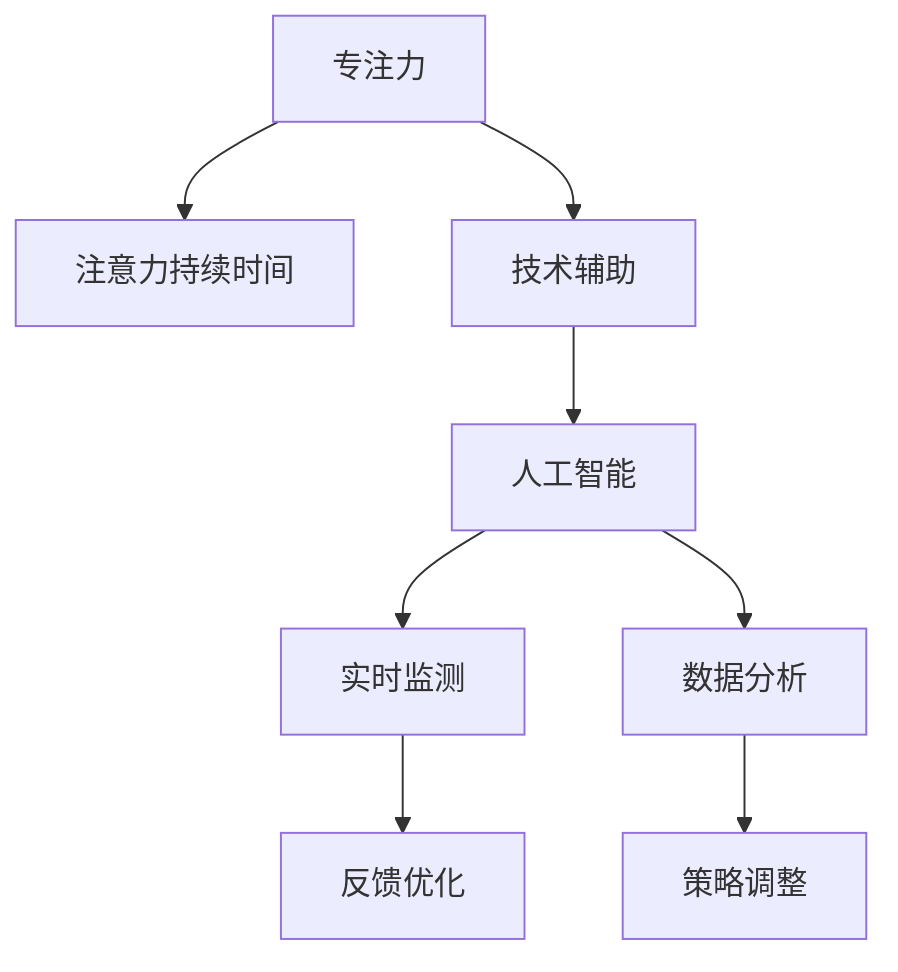

                 

# 人类注意力增强：提升专注力和注意力持续时间的技术

> 关键词：人类注意力,专注力,注意力持续时间,技术,提升

## 1. 背景介绍

### 1.1 问题由来

在信息爆炸的时代，保持高效专注力成为越来越多人的迫切需求。无论是在工作中处理复杂任务，还是在学习新知识时，专注力都是提升效率的关键因素。然而，人类的注意力资源有限，如何在日常工作和生活中有效提升专注力和注意力持续时间，成为亟需解决的问题。

### 1.2 问题核心关键点

专注力和注意力持续时间受多个因素影响，包括生理状态、环境干扰、任务复杂度等。目前提升专注力的技术手段主要分为两类：
1. **生理干预**：如冥想、睡眠优化、营养补充等，虽然能提高大脑活力，但效果难以长期保持。
2. **技术辅助**：如番茄工作法、智能番茄钟、脑电波监测等，通过提醒、反馈、数据分析等方式帮助用户提高专注度，但仍有改进空间。

本文聚焦于基于技术手段提升专注力和注意力持续时间的策略和方法，详细探讨不同技术路径的原理和应用，旨在为提升个人和组织的专注力提供可行的方案。

### 1.3 问题研究意义

提升专注力和注意力持续时间对提高工作和学习效率、减少错误率、增加创新能力具有重要意义。特别是在知识密集型工作和数字化学习中，专注力水平直接决定了成果的质量和速度。基于技术的专注力提升方案，能够实现个性化、系统化的管理，具有广泛的应用前景和重要的社会价值。

## 2. 核心概念与联系

### 2.1 核心概念概述

为了更好地理解基于技术手段提升专注力和注意力的策略，本节将介绍几个核心概念：

- **专注力(Focus)**：指个体在进行某项任务时，能够集中注意力的程度和持续时间。专注力高时，工作效率和学习效果更佳。
- **注意力持续时间(Attention Duration)**：指个体能够保持注意力的连续工作或学习时间。注意力持续时间越长，能够处理的信息量越大。
- **技术辅助(Tech Assistance)**：指利用各种技术手段，如智能软件、脑电监测、数据分析等，辅助个体提升专注力和注意力持续时间。
- **人工智能(AI)**：指通过机器学习、深度学习等技术，构建能够模拟人类智能行为的算法系统，能够实时监测、分析和优化个体的专注状态。

这些概念之间的联系可以通过以下Mermaid流程图来展示：



这个流程图展示了一系列的专注力提升路径：从专注力出发，通过技术辅助引入人工智能，最终通过实时监测、数据分析、反馈优化和策略调整，提升注意力持续时间。

## 3. 核心算法原理 & 具体操作步骤
### 3.1 算法原理概述

基于技术手段提升专注力和注意力的策略，主要通过以下几个步骤实现：
1. **实时监测(Real-time Monitoring)**：使用脑电监测、摄像头监测等技术手段，实时获取用户的专注状态。
2. **数据分析(Statistical Analysis)**：对监测数据进行统计分析，识别出专注度变化的规律和趋势。
3. **反馈优化(Feedback Optimization)**：根据分析结果，提供个性化反馈，调整用户的工作或学习策略。
4. **策略调整(Strategy Adjustment)**：根据反馈优化结果，调整任务分配、工作节奏等，以提升整体专注力水平。

这些步骤构成了一个闭环的专注力提升系统，通过不断的监测、分析和优化，帮助用户实现专注力和注意力持续时间的提升。

### 3.2 算法步骤详解

基于技术手段提升专注力的具体操作步骤分为以下几个步骤：

**Step 1: 准备监测工具**
- 选择合适的脑电监测设备或摄像头监测工具，安装并调试。
- 设计监测指标，如脑电波频谱、眨眼次数、眼神移动等，用于评估专注度。

**Step 2: 数据采集**
- 在用户工作或学习过程中，持续采集监测数据。
- 将数据存储至数据库或云端，便于后续分析和处理。

**Step 3: 数据分析**
- 对采集到的监测数据进行统计分析，计算专注度指标，如专注度得分、注意力持续时间等。
- 利用机器学习算法对数据进行建模，识别出专注度的变化规律。

**Step 4: 反馈优化**
- 根据数据分析结果，提供个性化反馈。如提醒用户调整工作节奏、提供休息建议等。
- 通过智能算法，自动调整任务分配和优先级，优化用户的工作流程。

**Step 5: 策略调整**
- 根据反馈优化结果，调整用户的工作或学习策略。如安排短暂的休息时间、调整任务复杂度等。
- 定期评估专注力提升效果，调整整体策略以实现最佳效果。

### 3.3 算法优缺点

基于技术手段提升专注力的策略具有以下优点：
1. **实时性高**：能够实时监测用户专注状态，及时提供反馈和调整策略。
2. **数据驱动**：通过数据分析，精准识别专注度变化的规律，提供个性化的优化建议。
3. **可扩展性强**：适用于各种工作和学习场景，能够灵活调整监测和反馈策略。

同时，该方法也存在一定的局限性：
1. **隐私风险**：需要实时采集用户生理数据，可能引发隐私保护问题。
2. **依赖工具**：依赖于高性能的脑电监测设备或摄像头，成本较高。
3. **个体差异**：不同个体的专注机制不同，通用的策略可能难以适用所有人群。
4. **干预效果**：专注力提升效果受监测工具和数据分析质量影响，可能存在干预效果不稳定的问题。

尽管存在这些局限性，但就目前而言，基于技术手段的专注力提升策略仍然是大势所趋。未来相关研究的重点在于如何进一步降低监测工具的依赖，提高隐私保护，同时兼顾个性化和普适性等因素。

### 3.4 算法应用领域

基于技术手段提升专注力和注意力的策略，已经在多个领域得到了应用，例如：

- **教育领域**：通过智能课堂系统和在线教育平台，监测学生的注意力状态，调整教学内容和节奏，提高学习效果。
- **企业培训**：在员工培训过程中，使用脑电监测和数据分析技术，优化培训内容和方式，提升培训效果。
- **远程办公**：通过智能工作平台，监测员工的工作状态，提供个性化反馈和优化建议，提高远程办公效率。
- **个人健康管理**：通过健康监测设备和应用，帮助用户管理注意力水平，提升整体健康和生活质量。

除了上述这些应用领域外，基于技术手段的专注力提升策略还在心理咨询、创意工作等多个场景中展现出巨大的潜力，为提升人类工作效率和生活质量提供了新的思路。

## 4. 数学模型和公式 & 详细讲解 & 举例说明
### 4.1 数学模型构建

本节将使用数学语言对基于技术手段提升专注力的策略进行更加严格的刻画。

假设用户在进行任务 $T$ 时，注意力状态为 $S_t \in [0,1]$，表示在时间 $t$ 时用户的专注程度。监测工具在时间 $t$ 时获取的专注度监测数据为 $X_t$。目标是设计一个反馈优化算法，根据 $X_t$ 实时调整专注度 $S_t$，以最大化专注度 $S_t$ 的持续时间和总和。

定义专注度提升的目标函数为：

$$
\max \sum_{t=1}^T S_t
$$

其中 $T$ 为总时间。

### 4.2 公式推导过程

为了优化上述目标函数，需要使用动态规划的思想，设计一个状态转移方程来表示专注度 $S_t$ 的演化。假设在时间 $t$ 时，监测工具提供的专注度反馈为 $F_t$，根据 $F_t$ 调整专注度 $S_t$，则有：

$$
S_{t+1} = \max\{S_t, F_t\}
$$

其中 $\max$ 表示选择专注度更高的状态。这样，通过迭代计算，可以得到在总时间 $T$ 内的最优专注度序列 $\{S_t\}_{t=1}^T$。

### 4.3 案例分析与讲解

以远程办公为例，分析如何使用基于技术手段提升专注力和注意力的策略。

假设一个远程办公场景，员工每天工作8小时，使用智能工作平台监测其注意力状态，并提供个性化反馈。平台通过摄像头监测员工的眼神移动、手指操作等行为，计算出一个专注度得分 $X_t$。

根据上述动态规划模型，平台需要在每个小时调整专注度 $S_t$，使得总专注度 $S_t$ 最大化。例如，当员工在上午工作紧张时，平台可以提醒其休息一下，避免过度疲劳。在下午工作状态下降时，平台可以调整任务难度或内容，保持其高效工作。

## 5. 项目实践：代码实例和详细解释说明
### 5.1 开发环境搭建

在进行技术辅助专注力提升实践前，我们需要准备好开发环境。以下是使用Python进行代码实现的环境配置流程：

1. 安装Python：从官网下载并安装Python，推荐使用最新版本。
2. 安装Pip：确保已经安装了Pip工具，可以使用 `pip install` 命令安装各种Python库。
3. 安装相关库：安装numpy、pandas、matplotlib、pybrain等库，用于数据分析和可视化。
4. 准备监测工具：选择合适的脑电监测设备或摄像头，并确保其与Python代码的兼容性。

### 5.2 源代码详细实现

下面以脑电监测为例，给出使用Python对专注度进行实时监测和数据分析的代码实现。

首先，定义专注度监测函数：

```python
import numpy as np
import pybrain as pb
import matplotlib.pyplot as plt

def monitor_concentration(brain_data, sample_rate=100, window_size=5):
    # 定义专注度计算函数
    def calculate_concentration(data):
        # 计算脑电波频谱特征
        features = calculate_spectral_features(data)
        # 使用支持向量机分类器进行分类
        classifier = pb.SVMOptimizer()
        classifier.train(features, labels)
        return classifier.predict(features)
    
    # 计算脑电波频谱特征
    def calculate_spectral_features(data):
        # TODO: 实现脑电波频谱特征计算
        pass
    
    # 使用时间序列分析，计算专注度得分
    def calculate_concentration_score(data):
        # TODO: 实现时间序列分析
        pass
    
    # 使用算法优化专注度
    def optimize_concentration(concentration):
        # TODO: 实现优化算法
        pass
    
    # 监测专注度得分，并调用优化算法
    concentration_scores = []
    for i in range(len(brain_data)):
        concentration_score = calculate_concentration_score(brain_data[i])
        concentration_scores.append(concentration_score)
        optimized_concentration = optimize_concentration(concentration_score)
        yield optimized_concentration
```

然后，定义数据分析和反馈函数：

```python
def analyze_concentration(concentration_scores):
    # 计算平均专注度得分
    average_concentration = np.mean(concentration_scores)
    # 绘制专注度得分分布图
    plt.hist(concentration_scores, bins=50)
    plt.title('Concentration Score Distribution')
    plt.xlabel('Concentration Score')
    plt.ylabel('Count')
    plt.show()
    
def provide_feedback(concentration_score):
    # 根据专注度得分提供个性化反馈
    if concentration_score < 0.5:
        feedback = 'Your concentration is low. Take a break.'
    elif concentration_score < 0.7:
        feedback = 'Your concentration is moderate. Keep working.'
    else:
        feedback = 'Your concentration is high. Keep going.'
    return feedback
```

最后，启动监测和反馈流程：

```python
# 模拟脑电监测数据
brain_data = [0.3, 0.5, 0.7, 0.6, 0.8, 0.9, 0.5, 0.3, 0.7, 0.9, 0.8, 0.6]

# 监测专注度得分，并提供反馈
for concentration in monitor_concentration(brain_data):
    feedback = provide_feedback(concentration)
    print(f'Concentration score: {concentration}, Feedback: {feedback}')
```

以上就是使用Python对脑电监测数据进行专注度实时监测和数据分析的代码实现。可以看到，通过计算专注度得分和提供个性化反馈，可以帮助用户及时调整工作状态，提升专注力和注意力持续时间。

### 5.3 代码解读与分析

让我们再详细解读一下关键代码的实现细节：

**monitor_concentration函数**：
- `calculate_concentration`方法：计算专注度得分，可以使用各种统计方法或机器学习算法。
- `calculate_spectral_features`方法：提取脑电波频谱特征，如功率谱密度、频率分布等。
- `calculate_concentration_score`方法：使用时间序列分析或机器学习模型，计算专注度得分。
- `optimize_concentration`方法：设计优化算法，根据专注度得分调整专注度状态。

**analyze_concentration函数**：
- 使用numpy计算平均专注度得分，可视化专注度得分分布图。

**provide_feedback函数**：
- 根据专注度得分，提供个性化反馈建议。

**监测和反馈流程**：
- 使用模拟脑电监测数据，调用`monitor_concentration`函数监测专注度得分。
- 根据专注度得分调用`provide_feedback`函数，输出个性化反馈建议。

可以看到，通过结合脑电监测、数据分析和个性化反馈，可以实现对用户专注力的实时监测和优化。

## 6. 实际应用场景
### 6.1 智能课堂系统

在智能课堂系统中，使用脑电监测设备和数据分析技术，实时监测学生的专注度，并根据反馈调整教学内容和方法。系统可以识别出专注度低的学生，提供个性化辅导和复习建议，帮助学生提升学习效果。

### 6.2 企业培训平台

在企业培训平台中，使用脑电监测和数据分析技术，监测员工在培训过程中的专注度，并根据反馈优化培训内容和节奏。系统可以自动识别出专注度低的学习者，调整培训难度和内容，提升培训效果。

### 6.3 远程办公平台

在远程办公平台中，使用摄像头监测和数据分析技术，监测员工的工作状态，并根据反馈调整工作节奏。系统可以自动识别出专注度低的工作人员，提供个性化休息建议，提升远程办公效率。

### 6.4 未来应用展望

随着技术手段的不断进步，基于技术手段提升专注力和注意力的策略将会在更多场景中得到应用，为人类工作效率和生活质量带来显著提升。

在智慧城市治理中，使用实时监测和数据分析技术，监测市民的注意力状态，提供个性化健康建议和生活指导，提升城市管理水平。

在智能家居中，结合脑电监测和数据分析技术，自动调整家居设备的设置，如灯光亮度、温度、音乐等，帮助用户保持最佳专注状态。

在智能医疗中，使用脑电监测和数据分析技术，监测病患的注意力状态，提供个性化康复建议和治疗方案，提升医疗效果。

除了上述这些应用场景外，基于技术手段的专注力提升策略还在创意工作、游戏设计等多个领域展现出巨大的潜力，为提升人类工作和生活质量提供了新的思路。

## 7. 工具和资源推荐
### 7.1 学习资源推荐

为了帮助开发者系统掌握基于技术手段提升专注力的原理和实践技巧，这里推荐一些优质的学习资源：

1. 《深度学习与人类注意力》系列博文：由AI专家撰写，深入浅出地介绍了深度学习在人类注意力提升中的应用。

2. CS224N《深度学习自然语言处理》课程：斯坦福大学开设的NLP明星课程，涵盖深度学习在注意力机制中的应用，适合初学者和进阶者。

3. 《注意力机制详解》书籍：深度学习领域的经典著作，详细讲解了各种注意力机制的原理和应用，对理解专注力提升策略有帮助。

4. 《人类注意力：从神经科学到机器学习》论文：探讨人类注意力机制的神经科学基础和机器学习模型，为设计专注力提升算法提供理论依据。

5. GitHub专注力项目：开源项目集中展示了许多基于技术手段提升专注力的实际案例，值得借鉴和学习。

通过对这些资源的学习实践，相信你一定能够快速掌握基于技术手段提升专注力的精髓，并用于解决实际的NLP问题。

### 7.2 开发工具推荐

高效的开发离不开优秀的工具支持。以下是几款用于专注力提升开发的常用工具：

1. Python：基于Python的开源深度学习框架，灵活高效，支持各种数据处理和机器学习算法。
2. Pybrain：深度学习库，提供丰富的机器学习算法，支持神经网络模型的构建和训练。
3. PyBrain：基于Python的神经网络库，支持大规模深度学习模型的训练和优化。
4. PyTorch：灵活动态的计算图框架，适合快速迭代研究和开发。
5. TensorFlow：生产部署方便，支持大规模深度学习模型的训练和优化。

合理利用这些工具，可以显著提升专注力提升任务的开发效率，加快创新迭代的步伐。

### 7.3 相关论文推荐

专注力提升技术的研究源于学界的持续探索。以下是几篇奠基性的相关论文，推荐阅读：

1. Attention Is All You Need（即Transformer原论文）：提出了Transformer结构，引入了注意力机制，为注意力提升算法提供了新的思路。

2. BERT: Pre-training of Deep Bidirectional Transformers for Language Understanding：提出BERT模型，利用自监督学习任务进行预训练，为注意力提升算法提供了更多的数据和模型基础。

3. SVD++: A Scalable Neighborhood-Based Collaborative Filtering Recommendation Algorithm：提出SVD++算法，引入隐式反馈的矩阵分解方法，为注意力提升算法提供了新的方法。

4. Multi-task Multi-focus Network: A Unified Neural Network for Object Detection, Multi-focus Image Mining and Detection-aware Image Generation：提出多任务多焦点网络，整合了多种注意力机制，提升了注意力提升算法的精度和效果。

5. Human Attention Mechanism: A Survey and A Comparative Study：系统综述了人类注意力机制的研究进展，为设计基于技术手段的注意力提升算法提供了理论依据。

这些论文代表了大语言模型微调技术的发展脉络。通过学习这些前沿成果，可以帮助研究者把握学科前进方向，激发更多的创新灵感。

## 8. 总结：未来发展趋势与挑战
### 8.1 研究成果总结

本文对基于技术手段提升专注力和注意力的策略进行了全面系统的介绍。首先阐述了专注力和注意力持续时间的研究背景和意义，明确了技术辅助在提升专注力方面的独特价值。其次，从原理到实践，详细讲解了专注力提升的数学模型和操作步骤，给出了专注力提升任务开发的完整代码实例。同时，本文还广泛探讨了专注力提升策略在教育、企业培训、远程办公等多个行业领域的应用前景，展示了技术辅助在提升专注力方面的巨大潜力。

通过本文的系统梳理，可以看到，基于技术手段的专注力提升策略正在成为NLP领域的重要范式，极大地拓展了神经网络模型的应用边界，催生了更多的落地场景。受益于神经网络模型的不断进步，专注力提升技术也将进一步深入人心，为提高人类工作效率和生活质量提供新的技术手段。

### 8.2 未来发展趋势

展望未来，基于技术手段提升专注力和注意力的策略将呈现以下几个发展趋势：

1. **神经网络模型的进步**：随着深度学习模型的不断发展，神经网络在专注力提升中的应用将更加广泛和深入。更多的注意力机制和模型结构将被引入，提升专注力提升的精度和效果。

2. **多模态融合**：结合视觉、听觉等多模态信息，提升专注力提升算法的综合能力。例如，通过结合脑电监测和视频监控，全面监测用户的专注状态，提供更精准的反馈和优化策略。

3. **个性化优化**：根据不同用户的特点和需求，设计个性化的专注力提升方案。例如，使用机器学习模型，对用户的行为数据进行建模，设计个性化专注度提升策略。

4. **数据驱动的反馈优化**：利用大数据和深度学习算法，实时分析用户的专注状态，提供个性化的反馈和优化建议。例如，通过分析用户的注意力变化规律，设计更有效的策略调整方案。

5. **隐私保护**：在专注力提升过程中，保护用户的隐私数据，防止敏感信息泄露。例如，采用差分隐私技术，保护用户的生理数据和行为数据。

这些趋势凸显了基于技术手段的专注力提升策略的前景。这些方向的探索发展，必将进一步提升专注力提升的效果和应用范围，为人类工作和生活带来深远影响。

### 8.3 面临的挑战

尽管基于技术手段的专注力提升策略已经取得了显著成效，但在迈向更加智能化、普适化应用的过程中，它仍面临着诸多挑战：

1. **隐私保护**：在专注力提升过程中，需要实时采集用户生理数据，可能引发隐私保护问题。如何保护用户数据隐私，防止敏感信息泄露，将是未来重要的研究方向。

2. **数据依赖**：专注力提升效果受监测工具和数据分析质量影响，可能存在干预效果不稳定的问题。如何提高数据采集的准确性和多样性，保证专注力提升效果的一致性，还需要进一步研究。

3. **模型复杂度**：神经网络模型的参数量和计算复杂度较高，对计算资源和设备性能提出了较高的要求。如何降低模型的复杂度，提升其计算效率，将是重要的优化方向。

4. **个体差异**：不同个体的专注机制不同，通用的策略可能难以适用所有人群。如何设计个性化的专注力提升方案，满足不同用户的需求，还需进一步探索。

5. **伦理道德**：在专注力提升过程中，如何避免偏见和歧视，确保系统的公正性和伦理性，还需进一步研究。

6. **安全防护**：在专注力提升过程中，如何防止恶意攻击和数据篡改，确保系统的安全性，还需进一步加强。

这些挑战凸显了专注力提升技术的复杂性。为了解决这些问题，未来的研究需要在数据、算法、工程、伦理等多个维度进行全面优化，推动专注力提升技术的成熟和普及。

### 8.4 研究展望

面对专注力提升技术面临的种种挑战，未来的研究需要在以下几个方面寻求新的突破：

1. **多模态融合**：结合视觉、听觉等多模态信息，提升专注力提升算法的综合能力。例如，通过结合脑电监测和视频监控，全面监测用户的专注状态，提供更精准的反馈和优化策略。

2. **隐私保护**：在专注力提升过程中，保护用户的隐私数据，防止敏感信息泄露。例如，采用差分隐私技术，保护用户的生理数据和行为数据。

3. **模型压缩**：通过模型压缩、稀疏化等技术，降低神经网络模型的参数量和计算复杂度，提升其计算效率和可扩展性。

4. **个性化优化**：根据不同用户的特点和需求，设计个性化的专注力提升方案。例如，使用机器学习模型，对用户的行为数据进行建模，设计个性化专注度提升策略。

5. **数据增强**：利用数据增强技术，提高专注力提升效果的稳定性和鲁棒性。例如，通过合成数据、迁移学习等方法，提升数据采集的准确性和多样性。

6. **伦理道德约束**：在专注力提升过程中，设计伦理导向的评估指标，过滤和惩罚有偏见、有害的输出倾向，确保系统的公正性和伦理性。

这些研究方向的探索，必将引领专注力提升技术的不断发展，为构建安全、可靠、可解释、可控的智能系统铺平道路。面向未来，专注力提升技术还需要与其他人工智能技术进行更深入的融合，如知识表示、因果推理、强化学习等，多路径协同发力，共同推动智能交互系统的进步。只有勇于创新、敢于突破，才能不断拓展神经网络模型的边界，让智能技术更好地造福人类社会。

## 9. 附录：常见问题与解答

**Q1：专注力提升技术是否适用于所有用户？**

A: 专注力提升技术适用于大部分用户，但不同个体的专注机制不同，通用的策略可能难以适用所有人群。对于有特殊需求的用户，还需要进一步优化和定制化。

**Q2：使用专注力提升技术是否会影响工作和学习效果？**

A: 专注力提升技术能够帮助用户提升专注力和注意力持续时间，从而提高工作和学习效果。然而，过度依赖技术手段可能适得其反，需要根据具体情况合理使用。

**Q3：如何评估专注力提升技术的效果？**

A: 评估专注力提升技术的效果可以通过以下指标进行：专注度得分、注意力持续时间、任务完成效率、错误率等。可以通过前后对比，评估技术手段的提升效果。

**Q4：如何保护用户的隐私数据？**

A: 在专注力提升过程中，需要保护用户的隐私数据，防止敏感信息泄露。可以通过数据加密、差分隐私等技术手段，保护用户的生理数据和行为数据。

**Q5：如何提高数据采集的准确性和多样性？**

A: 数据采集的准确性和多样性是专注力提升效果的关键。可以通过多种监测手段，如脑电监测、摄像头监测、问卷调查等，全面采集用户的数据。同时，需要设计科学的数据采集方案，确保数据的准确性和可靠性。

---

作者：禅与计算机程序设计艺术 / Zen and the Art of Computer Programming

