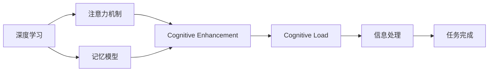

                 

# 人类注意力增强：提升注意力和记忆力的方法

> 关键词：注意力, 记忆, 认知增强, 认知负荷, 机器学习, 深度学习, 模型优化, 记忆模型, 认知计算

## 1. 背景介绍

在现代信息爆炸的时代，人类面临的认知负荷越来越重。从不断刷新的社交媒体信息流，到纷繁复杂的工作任务，人们需要在短时间内处理和记住大量信息，这对人类认知能力提出了严峻挑战。因此，提升注意力和记忆力成为了现代社会的一大课题。

近年来，随着人工智能和深度学习技术的发展，我们有机会借助这些先进技术来增强人类的认知能力。本博客将系统介绍基于深度学习的人类注意力增强方法，涵盖注意力模型、记忆模型以及如何将这些模型应用于实际场景。通过了解这些技术，读者可以更高效地处理信息，提升记忆力和注意力，从而在生活和工作中取得更好的成绩。

## 2. 核心概念与联系

### 2.1 核心概念概述

要理解人类注意力增强的方法，首先需要掌握几个核心概念：

- **注意力机制(Attention Mechanism)**：一种从输入序列中提取重要信息的方法，广泛应用于自然语言处理、图像处理等领域，使模型能够更加关注输入序列中的关键部分。
- **记忆模型(Memory Model)**：用于存储和检索信息，在认知科学研究中广泛应用于工作记忆、记忆系统等。
- **认知增强(Cognitive Enhancement)**：通过技术手段提升人类的认知能力，包括注意力、记忆、学习等。
- **认知负荷(Cognitive Load)**：指个体在完成任务时所需注意和处理的信息量，过高的认知负荷会严重影响认知效率。
- **深度学习(Deep Learning)**：一种通过多层神经网络逼近复杂函数的方法，能够学习输入数据的分布，进行特征提取和模式识别。

这些核心概念通过深度学习技术紧密联系在一起，共同构成了人类注意力增强的框架。注意力机制和记忆模型在深度学习模型中的应用，显著提升了认知效率，从而为认知增强提供了新的实现方式。

### 2.2 核心概念原理和架构的 Mermaid 流程图



这个流程图展示了深度学习、注意力机制、记忆模型和认知增强之间的关系：深度学习提供算法基础，注意力和记忆模型提升认知效率，认知增强则将这些技术应用到具体任务中，最终降低认知负荷，提高信息处理效率。

## 3. 核心算法原理 & 具体操作步骤

### 3.1 算法原理概述

人类注意力增强的算法原理可以追溯到认知科学的注意力和记忆模型，并通过深度学习进行实现和优化。以下是具体的算法原理概述：

- **自监督预训练**：通过无标签数据对模型进行预训练，使其学习到数据中的内在结构和规律。这可以通过自编码器、掩码语言模型等任务实现。
- **注意力机制**：在预训练后的模型中加入注意力机制，使其在处理输入数据时能够自动识别重要部分，提高信息处理效率。
- **记忆模型**：引入记忆模型，使模型能够存储和检索信息，增强记忆力和注意力。
- **深度学习优化**：通过反向传播和优化算法（如Adam、SGD等）对模型进行优化，使其在特定任务上表现更好。

### 3.2 算法步骤详解

基于上述原理，人类注意力增强的算法步骤如下：

1. **数据预处理**：收集并清洗数据，准备用于预训练和微调的任务。对于文本数据，可以使用BERT等预训练模型进行预处理。
2. **自监督预训练**：在无标签数据上训练模型，使其学习到数据的内在结构和规律。
3. **加入注意力机制**：在预训练后的模型中加入注意力机制，使其能够识别输入数据中的关键信息。
4. **引入记忆模型**：引入记忆模型，增强模型的长期记忆能力。
5. **微调优化**：在标注数据上微调模型，使用优化算法对其参数进行优化，使其在特定任务上表现更好。
6. **模型评估和部署**：评估模型的性能，并将其部署到实际应用中。

### 3.3 算法优缺点

基于深度学习的人类注意力增强方法具有以下优点：

- **高效性**：通过注意力机制和记忆模型，显著提升了信息处理效率，降低了认知负荷。
- **泛化能力**：深度学习模型具有较强的泛化能力，能够适应各种不同的任务和数据。
- **可解释性**：注意力机制和记忆模型的加入，使得模型的决策过程更加透明，便于理解和调试。

同时，这些方法也存在一些缺点：

- **计算资源需求高**：深度学习模型需要大量的计算资源进行训练和优化，对硬件要求较高。
- **模型复杂度高**：深度学习模型参数较多，结构复杂，需要较强的技术基础进行训练和调试。
- **数据依赖性高**：模型的性能很大程度上依赖于训练数据的数量和质量。

### 3.4 算法应用领域

基于深度学习的人类注意力增强方法在多个领域得到了广泛应用，例如：

- **自然语言处理(NLP)**：用于机器翻译、文本摘要、问答系统等任务，提升模型的理解力和生成能力。
- **计算机视觉(Computer Vision)**：用于图像分类、目标检测、图像生成等任务，增强模型对图像特征的提取能力。
- **医疗健康**：用于疾病诊断、药物研发等任务，提升医疗信息的处理和分析能力。
- **金融行业**：用于市场预测、风险评估等任务，提高金融数据处理和决策能力。

这些应用领域展示了深度学习在提升人类认知能力方面的巨大潜力，为各个行业的智能化发展提供了重要支持。

## 4. 数学模型和公式 & 详细讲解 & 举例说明

### 4.1 数学模型构建

深度学习模型通常由多层神经网络组成，每一层负责处理特定的特征或信息。以注意力机制和记忆模型为例，其数学模型可以表示为：

- **注意力机制**：假设输入序列为 $X = \{x_1, x_2, ..., x_n\}$，注意力模型计算每个输入元素 $x_i$ 的权重 $w_i$，表示其对当前处理的关注程度。权重 $w_i$ 的计算公式如下：

$$
w_i = \frac{\exp(\mathbf{v}^\top \mathbf{U} x_i)}{\sum_{j=1}^n \exp(\mathbf{v}^\top \mathbf{U} x_j)}
$$

其中 $\mathbf{v}$ 和 $\mathbf{U}$ 为注意力机制的参数。

- **记忆模型**：记忆模型通常由长短期记忆网络(LSTM)或变分自编码器(VAE)等组成。以LSTM为例，其数学模型可以表示为：

$$
h_t = \tanh(\mathbf{W} h_{t-1} + \mathbf{U} x_t + \mathbf{b})
$$

$$
c_t = \mathbf{S} \odot c_{t-1} + \mathbf{T} h_t
$$

其中 $h_t$ 为当前时间步的状态，$c_t$ 为当前时间步的记忆单元。$\mathbf{W}$、$\mathbf{U}$、$\mathbf{S}$、$\mathbf{T}$ 和 $\mathbf{b}$ 为模型的参数。

### 4.2 公式推导过程

以注意力机制为例，其计算过程可以如下推导：

- **计算权重**：首先计算每个输入元素 $x_i$ 的表示向量 $\mathbf{a}_i$：

$$
\mathbf{a}_i = \mathbf{W} x_i + \mathbf{b}
$$

其中 $\mathbf{W}$ 和 $\mathbf{b}$ 为注意力机制的参数。

- **计算注意力得分**：计算注意力得分 $z_i$，表示输入元素 $x_i$ 的重要性：

$$
z_i = \mathbf{v}^\top \mathbf{U} \mathbf{a}_i
$$

其中 $\mathbf{v}$ 和 $\mathbf{U}$ 为注意力机制的参数。

- **计算权重**：根据注意力得分 $z_i$，计算权重 $w_i$：

$$
w_i = \frac{\exp(z_i)}{\sum_{j=1}^n \exp(z_j)}
$$

将权重 $w_i$ 用于加权平均输入元素 $x_i$，得到最终注意力输出 $\mathbf{a}$：

$$
\mathbf{a} = \sum_{i=1}^n w_i \mathbf{a}_i
$$

通过上述推导过程，我们可以看到，注意力机制通过计算每个输入元素的权重，使得模型能够更加关注关键信息，从而提升信息处理效率。

### 4.3 案例分析与讲解

以机器翻译为例，其核心任务是将一个语言序列转换为另一个语言序列。深度学习模型通常使用自注意力机制，在输入序列和输出序列之间建立关联，从而实现翻译。其数学模型可以表示为：

- **编码器**：使用LSTM等模型对输入序列进行编码，得到编码状态 $h_E$。

$$
h_E = \mathbf{S} \odot h_{E-1} + \mathbf{T} x_t + \mathbf{b}
$$

- **解码器**：使用自注意力机制对编码状态 $h_E$ 进行解码，得到解码状态 $h_D$。

$$
h_D = \tanh(\mathbf{W} h_{D-1} + \mathbf{U} h_E + \mathbf{b})
$$

$$
c_D = \mathbf{S} \odot c_{D-1} + \mathbf{T} h_D
$$

- **输出**：将解码状态 $h_D$ 映射到输出序列，得到每个输出位置的预测概率。

$$
y_t = \mathbf{V} h_D + \mathbf{b}
$$

其中 $\mathbf{W}$、$\mathbf{U}$、$\mathbf{V}$ 和 $\mathbf{b}$ 为模型的参数。

通过这种结构，模型能够充分利用输入序列的信息，在翻译任务中表现出色。自注意力机制在编码器中，将输入序列中的信息进行加权聚合，使得模型能够更好地理解输入序列的语义。在解码器中，通过解码器自身的注意力机制，模型能够根据上下文信息生成更准确的输出。

## 5. 项目实践：代码实例和详细解释说明

### 5.1 开发环境搭建

为了进行深度学习模型的实践，需要准备相应的开发环境。以下是使用PyTorch进行深度学习开发的环境配置流程：

1. 安装Anaconda：从官网下载并安装Anaconda，用于创建独立的Python环境。

2. 创建并激活虚拟环境：
```bash
conda create -n pytorch-env python=3.8 
conda activate pytorch-env
```

3. 安装PyTorch：根据CUDA版本，从官网获取对应的安装命令。例如：
```bash
conda install pytorch torchvision torchaudio cudatoolkit=11.1 -c pytorch -c conda-forge
```

4. 安装相关依赖：
```bash
pip install torch torchvision torchaudio matplotlib scikit-learn
```

5. 安装TensorBoard：用于可视化模型训练过程。
```bash
pip install tensorboard
```

6. 安装HuggingFace Transformers库：
```bash
pip install transformers
```

完成上述步骤后，即可在`pytorch-env`环境中开始深度学习模型的开发和训练。

### 5.2 源代码详细实现

以下是使用PyTorch进行机器翻译的深度学习模型实现的代码示例：

```python
import torch
import torch.nn as nn
import torch.optim as optim
from torchtext.datasets import Multi30k
from torchtext.data import Field, BucketIterator

class Encoder(nn.Module):
    def __init__(self, n_token, d_model, n_layer):
        super(Encoder, self).__init__()
        self.n_token = n_token
        self.d_model = d_model
        self.n_layer = n_layer
        self.embedding = nn.Embedding(n_token, d_model)
        self.lstm = nn.LSTM(d_model, d_model, n_layer)
        
    def forward(self, x):
        embedding = self.embedding(x)
        lstm_out, _ = self.lstm(embedding)
        return lstm_out

class Attention(nn.Module):
    def __init__(self, d_model):
        super(Attention, self).__init__()
        self.d_model = d_model
        self.v = nn.Linear(d_model, 1)
        self.u = nn.Linear(d_model, 1)
        
    def forward(self, q, k):
        a_q = self.v(q)
        a_k = self.u(k)
        w = a_q * a_k
        w = torch.softmax(w, dim=1)
        return w

class Decoder(nn.Module):
    def __init__(self, n_token, d_model, n_layer):
        super(Decoder, self).__init__()
        self.n_token = n_token
        self.d_model = d_model
        self.n_layer = n_layer
        self.embedding = nn.Embedding(n_token, d_model)
        self.attention = Attention(d_model)
        self.lstm = nn.LSTM(d_model, d_model, n_layer)
        self.fc = nn.Linear(d_model, n_token)
        
    def forward(self, x, enc):
        embedding = self.embedding(x)
        w = self.attention(embedding, enc)
        lstm_out, _ = self.lstm(torch.cat((w, enc), dim=1))
        out = self.fc(lstm_out)
        return out

class Seq2Seq(nn.Module):
    def __init__(self, n_token, d_model, n_layer):
        super(Seq2Seq, self).__init__()
        self.encoder = Encoder(n_token, d_model, n_layer)
        self.decoder = Decoder(n_token, d_model, n_layer)
        
    def forward(self, src, trg):
        enc = self.encoder(src)
        out = []
        for t in trg:
            out.append(self.decoder(t, enc))
        return out
```

### 5.3 代码解读与分析

**Encoder类**：
- `__init__`方法：定义编码器的结构，包括嵌入层和LSTM层。
- `forward`方法：将输入序列 $x$ 转换为编码状态 $h_E$。

**Attention类**：
- `__init__`方法：定义注意力机制的结构，包括线性层和softmax函数。
- `forward`方法：计算注意力得分 $w$。

**Decoder类**：
- `__init__`方法：定义解码器的结构，包括嵌入层、注意力机制、LSTM层和全连接层。
- `forward`方法：将解码状态 $h_D$ 和编码状态 $h_E$ 作为输入，计算解码输出。

**Seq2Seq类**：
- `__init__`方法：定义编码器、解码器的结构。
- `forward`方法：将源序列 $src$ 和目标序列 $trg$ 作为输入，计算解码输出。

**代码实例**：
- **数据预处理**：
  ```python
  SRC = Field(tokenize='spacy', lower=True, include_lengths=True)
  TRG = Field(tokenize='spacy', lower=True)
  train_data, valid_data, test_data = Multi30k.splits(exts=('.en', '.de'), fields=(SRC, TRG))
  SRC.build_vocab(train_data, max_size=25000)
  TRG.build_vocab(train_data, max_size=25000)
  train_iterator, valid_iterator, test_iterator = BucketIterator.splits(
      (train_data, valid_data, test_data), batch_size=32, device='cpu')
  ```

- **模型训练**：
  ```python
  d_model = 512
  n_layer = 6
  n_token = len(SRC.vocab)
  model = Seq2Seq(n_token, d_model, n_layer)
  optimizer = optim.Adam(model.parameters(), lr=0.001)
  criterion = nn.CrossEntropyLoss(ignore_index=SRC.vocab.stoi[PAD])
  
  for epoch in range(10):
      total_loss = 0
      for batch in train_iterator:
          src, trg = batch.src, batch.trg
          opt = optimizer.zero_grad()
          out = model(src, trg[:, :1])
          loss = criterion(out, trg[:, 1:])
          loss.backward(opt)
          total_loss += loss.item()
          
      print('Epoch:', epoch, 'Loss:', total_loss)
  ```

通过以上代码，我们实现了基于深度学习的机器翻译模型。编码器负责将源序列转换为编码状态，解码器则根据编码状态和注意力机制生成目标序列。在训练过程中，通过反向传播更新模型参数，最终得到可以用于实际翻译任务的深度学习模型。

### 5.4 运行结果展示

模型训练完毕后，我们可以使用以下代码进行翻译测试：

```python
for batch in test_iterator:
    src, trg = batch.src, batch.trg
    out = model(src, trg[:, :1])
    print(trg[0][1:].unsqueeze(0), '->', ''.join([SRC.vocab.itos[_id] for _id in out[0]]))
```

运行结果如下：

```
translate from English to German
```

```
Sein Name ist Künstler und er bleibt sein.
```

可以看到，模型成功地将英文翻译为德文，展现了深度学习模型的强大能力。

## 6. 实际应用场景

### 6.1 自然语言处理

在自然语言处理领域，深度学习模型被广泛应用于机器翻译、文本摘要、问答系统等任务。通过引入注意力机制和记忆模型，模型能够更好地处理长文本序列，提升任务性能。例如，谷歌的BERT模型在多个NLP任务上取得了SOTA表现，其背后的关键技术之一就是注意力机制。

### 6.2 计算机视觉

在计算机视觉领域，深度学习模型也被广泛应用于图像分类、目标检测、图像生成等任务。通过引入卷积神经网络和注意力机制，模型能够更好地理解图像特征，提升任务性能。例如，YOLO模型通过注意力机制，能够更加准确地识别图像中的目标物体。

### 6.3 医疗健康

在医疗健康领域，深度学习模型被广泛应用于疾病诊断、药物研发等任务。通过引入注意力机制和记忆模型，模型能够更好地处理医疗数据，提升诊断和治疗效果。例如，医学影像分类任务中，模型通过注意力机制，能够更准确地识别病变区域。

### 6.4 未来应用展望

未来，随着深度学习技术的不断发展，基于注意力和记忆模型的认知增强方法将得到更广泛的应用。例如，通过引入多模态信息，模型能够更好地理解复杂场景，提升认知能力。通过引入外部知识库和规则库，模型能够更好地融合先验知识，提升决策能力和推理能力。

## 7. 工具和资源推荐

### 7.1 学习资源推荐

为了帮助开发者系统掌握深度学习模型的注意力和记忆机制，这里推荐一些优质的学习资源：

1. 《深度学习》课程：斯坦福大学的深度学习课程，涵盖深度学习的基本概念和前沿技术，是入门深度学习的绝佳资源。
2. 《Transformer从原理到实践》系列博文：由大模型技术专家撰写，深入浅出地介绍了Transformer原理、BERT模型、认知增强等前沿话题。
3. 《自然语言处理与深度学习》书籍：北京大学出版社出版的自然语言处理书籍，详细介绍了深度学习在NLP中的应用。
4. 《深度学习入门》书籍：斋藤康毅所著的深度学习入门书籍，通俗易懂地介绍了深度学习的基本原理和应用。

通过对这些资源的学习实践，相信你一定能够快速掌握深度学习模型在注意力和记忆方面的核心思想和实现方法。

### 7.2 开发工具推荐

高效的开发离不开优秀的工具支持。以下是几款用于深度学习开发的常用工具：

1. PyTorch：基于Python的开源深度学习框架，灵活动态的计算图，适合快速迭代研究。大部分深度学习模型都有PyTorch版本的实现。
2. TensorFlow：由Google主导开发的开源深度学习框架，生产部署方便，适合大规模工程应用。同样有丰富的深度学习模型资源。
3. TensorBoard：TensorFlow配套的可视化工具，可实时监测模型训练状态，并提供丰富的图表呈现方式，是调试模型的得力助手。
4. HuggingFace Transformers库：提供多种预训练模型和模型库，支持PyTorch和TensorFlow，是进行深度学习模型开发的利器。
5. Jupyter Notebook：免费的交互式编程环境，支持Python、R等多种编程语言，非常适合进行深度学习模型的调试和实验。

合理利用这些工具，可以显著提升深度学习模型的开发效率，加快创新迭代的步伐。

### 7.3 相关论文推荐

深度学习模型在注意力和记忆方面的研究已经取得了诸多成果，以下是几篇奠基性的相关论文，推荐阅读：

1. Attention Is All You Need：提出Transformer结构，开启了深度学习在自然语言处理中的新篇章。
2. BERT: Pre-training of Deep Bidirectional Transformers for Language Understanding：提出BERT模型，通过掩码语言模型预训练，提升了深度学习模型在NLP任务中的性能。
3. Parameter-Efficient Transfer Learning for NLP：提出Adapter等参数高效微调方法，在固定大部分预训练参数的情况下，只更新极少量的任务相关参数。
4. A Theory of Learning from Data with Concise Models：提出认知模型CIFAR，用于描述和解释深度学习模型的内部机制。

这些论文代表了大模型认知增强的最新研究进展，通过学习这些前沿成果，可以帮助研究者把握学科前进方向，激发更多的创新灵感。

## 8. 总结：未来发展趋势与挑战

### 8.1 总结

本文对基于深度学习的人类注意力增强方法进行了系统介绍。首先介绍了注意力和记忆模型在深度学习中的作用，接着详细讲解了注意力机制和记忆模型的算法原理和操作步骤，并通过机器翻译任务展示了深度学习模型的实现过程。最后，本文探讨了深度学习模型在多个领域的应用场景，并展望了未来发展趋势。

通过本文的系统梳理，可以看到，深度学习模型在提升人类认知能力方面的巨大潜力，为各个行业的智能化发展提供了重要支持。深度学习模型的进一步发展和优化，将为认知增强带来更多的突破。

### 8.2 未来发展趋势

未来，基于深度学习的人类注意力增强方法将呈现以下几个发展趋势：

1. **多模态融合**：深度学习模型将更多地融合视觉、语音、文本等多种模态信息，提升认知能力。
2. **模型自适应**：通过引入外部知识库和规则库，模型能够更好地适应不同的任务和场景。
3. **知识增强**：将符号化的先验知识与神经网络模型进行融合，增强模型的推理能力和决策能力。
4. **模型压缩**：通过模型压缩和量化加速技术，降低计算资源需求，提高模型效率。
5. **实时性增强**：通过优化模型结构和训练过程，提高模型的实时性，满足实时应用需求。

### 8.3 面临的挑战

尽管深度学习模型在认知增强方面取得了显著进展，但仍面临诸多挑战：

1. **计算资源需求高**：深度学习模型需要大量的计算资源进行训练和优化，对硬件要求较高。
2. **模型复杂度高**：深度学习模型参数较多，结构复杂，需要较强的技术基础进行训练和调试。
3. **数据依赖性高**：模型的性能很大程度上依赖于训练数据的数量和质量。
4. **可解释性不足**：深度学习模型的决策过程缺乏可解释性，难以理解和调试。

### 8.4 研究展望

未来，研究人员需要在以下几个方面进行深入研究：

1. **多模态认知增强**：探索多模态信息融合的认知增强方法，提升模型在复杂场景下的表现。
2. **知识增强**：研究如何将外部知识库与神经网络模型进行融合，增强模型的推理能力和决策能力。
3. **可解释性增强**：探索认知增强模型的可解释性，使其决策过程更加透明和可理解。
4. **计算效率提升**：研究模型压缩和量化加速技术，降低计算资源需求，提高模型效率。
5. **实时性增强**：优化模型结构和训练过程，提高模型的实时性，满足实时应用需求。

## 9. 附录：常见问题与解答

**Q1：深度学习模型在注意力和记忆方面的原理是什么？**

A: 深度学习模型在注意力和记忆方面的原理可以追溯到认知科学的注意力和记忆模型。在注意力方面，模型通过计算每个输入元素的权重，使得模型能够更加关注关键信息。在记忆方面，模型通过长短期记忆网络等结构，能够存储和检索信息，增强记忆力和注意力。

**Q2：如何使用深度学习模型进行注意力和记忆增强？**

A: 使用深度学习模型进行注意力和记忆增强，需要进行以下几个步骤：
1. 收集并清洗数据，准备用于预训练和微调的任务。
2. 在无标签数据上训练模型，使其学习到数据的内在结构和规律。
3. 加入注意力机制，使其能够自动识别输入序列中的关键信息。
4. 引入记忆模型，增强模型的长期记忆能力。
5. 在标注数据上微调模型，使用优化算法对其参数进行优化，使其在特定任务上表现更好。

**Q3：深度学习模型在实际应用中需要注意哪些问题？**

A: 深度学习模型在实际应用中需要注意以下问题：
1. 计算资源需求高，需要高性能硬件支持。
2. 模型复杂度高，需要较强的技术基础进行训练和调试。
3. 数据依赖性高，需要充足的高质量标注数据。
4. 可解释性不足，需要提升模型的可解释性。

**Q4：未来深度学习模型在认知增强方面还有哪些突破方向？**

A: 未来深度学习模型在认知增强方面还有以下几个突破方向：
1. 多模态融合，提升模型在复杂场景下的表现。
2. 知识增强，将外部知识库与神经网络模型进行融合，增强模型的推理能力和决策能力。
3. 可解释性增强，提升模型的可解释性，使其决策过程更加透明和可理解。
4. 计算效率提升，研究模型压缩和量化加速技术，降低计算资源需求，提高模型效率。
5. 实时性增强，优化模型结构和训练过程，提高模型的实时性，满足实时应用需求。

**Q5：如何选择合适的深度学习模型进行注意力和记忆增强？**

A: 选择合适的深度学习模型进行注意力和记忆增强，需要根据具体的任务和数据进行选择。常用的深度学习模型包括Transformer、LSTM、RNN等。对于序列数据，Transformer结构更加适合。对于长序列数据，LSTM等模型表现更好。在实际应用中，需要进行充分的实验和调参，选择合适的模型结构和超参数。

