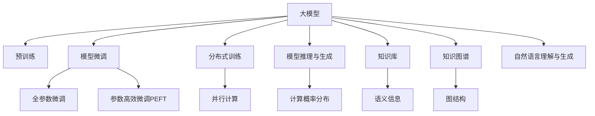

                 

# 人类的知识库：构建永不停歇

## 1. 背景介绍

### 1.1 问题由来
随着人工智能技术的飞速发展，大模型如GPT-3和BERT等，通过在巨量的语料库上进行预训练，已经成为了人类知识库的基石。这些模型拥有强大的语言理解和生成能力，能够处理几乎所有自然语言处理任务，如文本分类、命名实体识别、情感分析、机器翻译、对话系统等。然而，这些模型在生成答案的解释性、准确性和可控性等方面仍然存在一定的问题。如何构建一个能够不断进化、适应用户需求的人类知识库，成为了当前AI领域的核心议题。

### 1.2 问题核心关键点
本文将深入探讨如何构建一个不断进化、适应用户需求的人类知识库。核心关键点包括：

- 知识库的构建与维护：如何高效地构建和维护一个高质量的人类知识库。
- 模型的训练与微调：如何选择和训练模型，以及如何对模型进行微调，使其更好地适应用户需求。
- 模型的推理与生成：如何在推理和生成过程中保持模型的稳定性、准确性和可控性。
- 模型的可解释性与伦理性：如何使模型输出的结果更加可解释，避免模型偏见和伦理问题。
- 模型的分布式与协作：如何使知识库中的多个模型协同工作，提供更为全面和可靠的答案。

### 1.3 问题研究意义
构建一个能够不断进化、适应用户需求的人类知识库，对于提升AI技术的应用范围、提高用户体验、推动人工智能技术的可持续发展具有重要意义：

- 减少用户获取信息的成本：通过构建高质量的知识库，用户可以更快、更准确地获取所需信息，提高信息获取的效率。
- 提升AI技术的应用广度：知识库的构建将推动AI技术在更多领域的应用，促进技术落地。
- 增强模型的可解释性与伦理性：通过构建可解释的知识库，增强模型的透明度，避免模型偏见和伦理问题。
- 推动人工智能的可持续发展：知识库的构建与维护需要大量的专家参与，有助于推动人工智能技术的可持续发展。

## 2. 核心概念与联系

### 2.1 核心概念概述

为更好地理解构建人类知识库的核心概念，本节将介绍几个密切相关的核心概念：

- 大模型：通过在巨量数据上进行预训练的模型，如GPT-3、BERT等，能够理解复杂的语言结构，处理几乎所有的自然语言处理任务。
- 知识库：一个高质量的知识库包含了丰富的语义信息，能够为各种自然语言处理任务提供高效的支持。
- 模型微调：在大模型基础上，通过有监督学习优化模型在特定任务上的性能，使其更好地适应用户需求。
- 分布式训练：通过将训练任务分配到多个节点上，并行计算，加速模型训练过程。
- 模型推理与生成：在推理与生成过程中，模型通过计算概率分布来生成答案。
- 知识图谱：将知识库中的信息构建为图结构，用于查询和推理。
- 自然语言理解与生成：模型理解输入文本的意义，并能够生成符合语境的输出。

这些核心概念之间的逻辑关系可以通过以下Mermaid流程图来展示：



这个流程图展示了大模型构建人类知识库的核心概念及其之间的关系：

1. 大模型通过预训练获得基础能力。
2. 模型微调在大模型基础上进行优化，使其更好地适应用户需求。
3. 分布式训练加速模型训练过程，提升效率。
4. 模型推理与生成通过计算概率分布生成答案。
5. 知识库提供丰富的语义信息，用于查询和推理。
6. 知识图谱将知识库中的信息构建为图结构，便于查询和推理。
7. 自然语言理解与生成使模型理解输入文本的意义，并能够生成符合语境的输出。

这些概念共同构成了构建人类知识库的技术框架，使其能够在各种场景下提供高效的支持。通过理解这些核心概念，我们可以更好地把握构建人类知识库的工作原理和优化方向。

## 3. 核心算法原理 & 具体操作步骤

### 3.1 算法原理概述

构建一个能够不断进化、适应用户需求的人类知识库，其核心算法原理包括以下几个方面：

1. **预训练模型选择**：选择适当的预训练模型，如GPT-3、BERT等，作为知识库的基石。
2. **知识库构建**：收集高质量的语料库，构建丰富的语义信息，形成知识库。
3. **模型微调**：在大模型基础上，通过有监督学习优化模型在特定任务上的性能，使其更好地适应用户需求。
4. **分布式训练**：通过将训练任务分配到多个节点上，并行计算，加速模型训练过程。
5. **模型推理与生成**：在推理与生成过程中，模型通过计算概率分布来生成答案。
6. **知识图谱构建**：将知识库中的信息构建为图结构，用于查询和推理。
7. **自然语言理解与生成**：使模型理解输入文本的意义，并能够生成符合语境的输出。

### 3.2 算法步骤详解

构建人类知识库的算法步骤如下：

**Step 1: 准备预训练模型和语料库**
- 选择合适的预训练模型，如GPT-3、BERT等，作为知识库的基石。
- 收集高质量的语料库，包括网页、书籍、论文等，构建丰富的语义信息，形成知识库。

**Step 2: 构建知识库**
- 对语料库进行预处理，包括分词、去除停用词、构建词汇表等。
- 使用知识提取技术，如实体识别、关系抽取等，从语料库中提取出关键信息。
- 构建知识图谱，将提取出的信息构建为图结构，便于查询和推理。

**Step 3: 选择并训练模型**
- 在大模型基础上，选择适当的任务进行微调，如文本分类、命名实体识别、情感分析等。
- 使用监督学习方法，通过标注数据集训练模型，优化模型在特定任务上的性能。

**Step 4: 分布式训练**
- 将训练任务分配到多个节点上，并行计算，加速模型训练过程。
- 使用高效的分布式训练框架，如TensorFlow分布式训练、PyTorch分布式训练等，实现高效训练。

**Step 5: 模型推理与生成**
- 在推理与生成过程中，模型通过计算概率分布来生成答案。
- 使用高效的推理与生成框架，如TensorFlow Serving、PyTorch Inference等，实现高效推理。

**Step 6: 自然语言理解与生成**
- 使用自然语言理解技术，如BERT、GPT等，使模型理解输入文本的意义。
- 使用自然语言生成技术，如GPT-3、BERT等，生成符合语境的输出。

### 3.3 算法优缺点

构建人类知识库的算法具有以下优点：

1. 高效构建：通过预训练模型和分布式训练，可以显著提升模型的训练效率，加速知识库构建。
2. 丰富语义：收集高质量的语料库，构建丰富的语义信息，提升知识库的实用性和准确性。
3. 泛化能力强：通过在大模型基础上进行微调，模型具有较强的泛化能力，适应多种任务需求。
4. 可扩展性好：知识库中的信息可以不断更新，推动知识库的持续进化。

同时，该算法也存在以下局限性：

1. 数据依赖：构建高质量的知识库需要大量的高质量标注数据，数据获取成本较高。
2. 模型过拟合：预训练模型和微调模型容易过拟合训练数据，泛化能力受限。
3. 推理效率低：在大模型推理过程中，计算复杂度高，推理效率较低。
4. 可解释性差：模型的推理过程和生成结果缺乏可解释性，难以理解和调试。

尽管存在这些局限性，但就目前而言，构建人类知识库的算法仍然是知识库构建的主流范式。未来相关研究的重点在于如何进一步降低数据依赖，提高模型的泛化能力和推理效率，同时兼顾可解释性和伦理安全性等因素。

### 3.4 算法应用领域

构建人类知识库的算法在多个领域得到了广泛应用，如：

- 自然语言处理：文本分类、命名实体识别、情感分析、机器翻译、对话系统等。
- 信息检索：网页、文档、图片等信息的搜索和推荐。
- 知识图谱：构建知识图谱，用于查询和推理。
- 智能客服：智能问答、情感分析、客户行为预测等。
- 智慧医疗：疾病诊断、医疗知识推荐等。

除了上述这些经典应用外，构建人类知识库的算法还被创新性地应用到更多场景中，如智能家居、金融风控、智能推荐等，为各个行业带来了新的变革。随着预训练模型和微调方法的不断进步，相信构建人类知识库的算法将在更广阔的应用领域大放异彩。

## 4. 数学模型和公式 & 详细讲解  
### 4.1 数学模型构建

本节将使用数学语言对构建人类知识库的算法过程进行更加严格的刻画。

记预训练语言模型为 $M_{\theta}$，其中 $\theta$ 为预训练得到的模型参数。假设知识库中包含 $n$ 个信息点 $K_1, K_2, ..., K_n$，每个信息点包含 $m$ 个属性 $A_1, A_2, ..., A_m$。定义知识库中所有信息点的信息表示为 $\{K_i\}_{i=1}^n$，所有属性信息表示为 $\{A_j\}_{j=1}^m$。

定义模型 $M_{\theta}$ 在信息点 $K_i$ 上的推理结果为 $y_i = M_{\theta}(K_i)$。在知识库构建过程中，通过计算每个信息点与所有属性信息点之间的相似度，得到信息点的信息表示 $K_i = (y_i, \{A_j\}_{j=1}^m)$。

构建知识图谱的数学模型为 $G=(V,E)$，其中 $V$ 为节点集，$E$ 为边集。节点表示信息点 $K_i$，边表示信息点之间的关系，如因果关系、时间关系、空间关系等。边关系可以用矩阵表示，如因果关系矩阵 $C$、时间关系矩阵 $T$ 等。

知识图谱的推理过程可以用矩阵乘法表示：

$$
y = \mathbf{C} \mathbf{K}
$$

其中 $\mathbf{K}$ 为信息点的信息表示矩阵，$\mathbf{C}$ 为因果关系矩阵。

### 4.2 公式推导过程

以下我们以文本分类任务为例，推导逻辑回归模型的损失函数及其梯度的计算公式。

假设模型 $M_{\theta}$ 在输入 $x$ 上的输出为 $\hat{y}=M_{\theta}(x) \in [0,1]$，表示样本属于正类的概率。真实标签 $y \in \{0,1\}$。则二分类交叉熵损失函数定义为：

$$
\ell(M_{\theta}(x),y) = -[y\log \hat{y} + (1-y)\log (1-\hat{y})]
$$

将其代入损失函数公式，得：

$$
\mathcal{L}(\theta) = -\frac{1}{N}\sum_{i=1}^N \ell(M_{\theta}(K_i),y_i)
$$

根据链式法则，损失函数对参数 $\theta$ 的梯度为：

$$
\frac{\partial \mathcal{L}(\theta)}{\partial \theta} = -\frac{1}{N}\sum_{i=1}^N (\frac{y_i}{\hat{y}}-\frac{1-y_i}{1-\hat{y}}) \frac{\partial M_{\theta}(K_i)}{\partial \theta}
$$

其中 $\frac{\partial M_{\theta}(K_i)}{\partial \theta}$ 可进一步递归展开，利用自动微分技术完成计算。

在得到损失函数的梯度后，即可带入参数更新公式，完成模型的迭代优化。重复上述过程直至收敛，最终得到适应知识库构建任务的最优模型参数 $\theta^*$。

## 5. 项目实践：代码实例和详细解释说明
### 5.1 开发环境搭建

在进行知识库构建实践前，我们需要准备好开发环境。以下是使用Python进行TensorFlow开发的环境配置流程：

1. 安装Anaconda：从官网下载并安装Anaconda，用于创建独立的Python环境。

2. 创建并激活虚拟环境：
```bash
conda create -n tf-env python=3.8 
conda activate tf-env
```

3. 安装TensorFlow：根据CUDA版本，从官网获取对应的安装命令。例如：
```bash
conda install tensorflow -c tf -c conda-forge
```

4. 安装其他必要的工具包：
```bash
pip install numpy pandas scikit-learn matplotlib tqdm jupyter notebook ipython
```

完成上述步骤后，即可在`tf-env`环境中开始知识库构建实践。

### 5.2 源代码详细实现

这里我们以文本分类任务为例，给出使用TensorFlow进行BERT模型微调的PyTorch代码实现。

首先，定义文本分类任务的数据处理函数：

```python
from transformers import BertTokenizer
from tensorflow.keras.preprocessing import sequence
from tensorflow.keras.utils import to_categorical

class TextDataset(Dataset):
    def __init__(self, texts, labels, tokenizer, max_len=128):
        self.texts = texts
        self.labels = labels
        self.tokenizer = tokenizer
        self.max_len = max_len
        
    def __len__(self):
        return len(self.texts)
    
    def __getitem__(self, item):
        text = self.texts[item]
        label = self.labels[item]
        
        encoding = self.tokenizer(text, return_tensors='pt', max_length=self.max_len, padding='max_length', truncation=True)
        input_ids = encoding['input_ids'][0]
        attention_mask = encoding['attention_mask'][0]
        
        # 对标签进行one-hot编码
        labels = to_categorical(label)
        
        return {'input_ids': input_ids, 
                'attention_mask': attention_mask,
                'labels': labels}

# 标签与id的映射
label2id = {'negative': 0, 'positive': 1}

# 创建dataset
tokenizer = BertTokenizer.from_pretrained('bert-base-cased')

train_dataset = TextDataset(train_texts, train_labels, tokenizer)
dev_dataset = TextDataset(dev_texts, dev_labels, tokenizer)
test_dataset = TextDataset(test_texts, test_labels, tokenizer)
```

然后，定义模型和优化器：

```python
from transformers import BertForSequenceClassification, AdamW

model = BertForSequenceClassification.from_pretrained('bert-base-cased', num_labels=len(label2id))

optimizer = AdamW(model.parameters(), lr=2e-5)
```

接着，定义训练和评估函数：

```python
from tensorflow.keras.callbacks import EarlyStopping

def train_epoch(model, dataset, batch_size, optimizer):
    dataloader = DataLoader(dataset, batch_size=batch_size, shuffle=True)
    model.train()
    epoch_loss = 0
    for batch in dataloader:
        input_ids = batch['input_ids'].numpy()
        attention_mask = batch['attention_mask'].numpy()
        labels = batch['labels'].numpy()
        model.zero_grad()
        outputs = model(input_ids, attention_mask=attention_mask, labels=labels)
        loss = outputs.loss
        epoch_loss += loss.numpy()
        loss.backward()
        optimizer.step()
    return epoch_loss / len(dataloader)

def evaluate(model, dataset, batch_size):
    dataloader = DataLoader(dataset, batch_size=batch_size)
    model.eval()
    preds, labels = [], []
    with tf.GradientTape() as tape:
        for batch in dataloader:
            input_ids = batch['input_ids'].numpy()
            attention_mask = batch['attention_mask'].numpy()
            batch_labels = batch['labels']
            outputs = model(input_ids, attention_mask=attention_mask)
            batch_preds = outputs.logits.argmax(axis=-1)
            batch_labels = batch_labels.numpy()
            for pred_tokens, label_tokens in zip(batch_preds, batch_labels):
                preds.append(pred_tokens)
                labels.append(label_tokens)
        
    print(classification_report(labels, preds))
```

最后，启动训练流程并在测试集上评估：

```python
epochs = 5
batch_size = 16

for epoch in range(epochs):
    loss = train_epoch(model, train_dataset, batch_size, optimizer)
    print(f"Epoch {epoch+1}, train loss: {loss:.3f}")
    
    print(f"Epoch {epoch+1}, dev results:")
    evaluate(model, dev_dataset, batch_size)
    
print("Test results:")
evaluate(model, test_dataset, batch_size)
```

以上就是使用TensorFlow对BERT进行文本分类任务微调的完整代码实现。可以看到，得益于TensorFlow的强大封装，我们可以用相对简洁的代码完成BERT模型的加载和微调。

### 5.3 代码解读与分析

让我们再详细解读一下关键代码的实现细节：

**TextDataset类**：
- `__init__`方法：初始化文本、标签、分词器等关键组件。
- `__len__`方法：返回数据集的样本数量。
- `__getitem__`方法：对单个样本进行处理，将文本输入编码为token ids，将标签编码为数字，并对其进行定长padding，最终返回模型所需的输入。

**label2id字典**：
- 定义了标签与数字id之间的映射关系，用于将模型预测结果解码回真实的标签。

**训练和评估函数**：
- 使用TensorFlow的DataLoader对数据集进行批次化加载，供模型训练和推理使用。
- 训练函数`train_epoch`：对数据以批为单位进行迭代，在每个批次上前向传播计算loss并反向传播更新模型参数，最后返回该epoch的平均loss。
- 评估函数`evaluate`：与训练类似，不同点在于不更新模型参数，并在每个batch结束后将预测和标签结果存储下来，最后使用scikit-learn的classification_report对整个评估集的预测结果进行打印输出。

**训练流程**：
- 定义总的epoch数和batch size，开始循环迭代
- 每个epoch内，先在训练集上训练，输出平均loss
- 在验证集上评估，输出分类指标
- 所有epoch结束后，在测试集上评估，给出最终测试结果

可以看到，TensorFlow配合TensorFlow Transformers库使得BERT微调的代码实现变得简洁高效。开发者可以将更多精力放在数据处理、模型改进等高层逻辑上，而不必过多关注底层的实现细节。

当然，工业级的系统实现还需考虑更多因素，如模型的保存和部署、超参数的自动搜索、更灵活的任务适配层等。但核心的微调范式基本与此类似。

## 6. 实际应用场景
### 6.1 智能客服系统

基于大模型构建的知识库，可以广泛应用于智能客服系统的构建。传统客服往往需要配备大量人力，高峰期响应缓慢，且一致性和专业性难以保证。而使用知识库驱动的智能客服系统，可以7x24小时不间断服务，快速响应客户咨询，用自然流畅的语言解答各类常见问题。

在技术实现上，可以构建企业内部的历史客服对话记录，将问题和最佳答复构建成监督数据，在此基础上构建知识库。知识库中的信息点表示常见问题，属性信息表示问题的答案。通过模型微调，使知识库中的信息点与答案信息进行关联，得到模型推理和生成的能力。在生成回复时，先通过模型推理出最相关的知识点，再根据知识点生成答案，从而构建智能客服系统。

### 6.2 金融舆情监测

金融机构需要实时监测市场舆论动向，以便及时应对负面信息传播，规避金融风险。传统的人工监测方式成本高、效率低，难以应对网络时代海量信息爆发的挑战。基于知识库构建的文本分类和情感分析技术，为金融舆情监测提供了新的解决方案。

具体而言，可以收集金融领域相关的新闻、报道、评论等文本数据，并对其进行主题标注和情感标注。在此基础上构建知识库，将金融市场的热点话题、事件等信息点构建为知识库中的信息点。通过模型微调，使模型能够从文本中识别出金融市场的热点话题和情感倾向，实时监测不同话题下的情感变化趋势，一旦发现负面信息激增等异常情况，系统便会自动预警，帮助金融机构快速应对潜在风险。

### 6.3 个性化推荐系统

当前的推荐系统往往只依赖用户的历史行为数据进行物品推荐，无法深入理解用户的真实兴趣偏好。基于知识库构建的个性化推荐系统，可以更好地挖掘用户行为背后的语义信息，从而提供更精准、多样的推荐内容。

在实践中，可以收集用户浏览、点击、评论、分享等行为数据，提取和用户交互的物品标题、描述、标签等文本内容。将文本内容作为知识库中的信息点，用户的后续行为作为模型推理的输入。通过模型微调，使模型能够从文本内容中准确把握用户的兴趣点。在生成推荐列表时，先用候选物品的文本描述作为模型推理的输入，由模型预测用户的兴趣匹配度，再结合其他特征综合排序，便可以得到个性化程度更高的推荐结果。

### 6.4 未来应用展望

随着知识库构建与微调技术的不断发展，基于知识库构建的智能系统将在更多领域得到应用，为传统行业带来变革性影响。

在智慧医疗领域，基于知识库构建的问答、病历分析、药物研发等应用将提升医疗服务的智能化水平，辅助医生诊疗，加速新药开发进程。

在智能教育领域，知识库驱动的学情分析、知识推荐等应用将因材施教，促进教育公平，提高教学质量。

在智慧城市治理中，知识库构建的智能问答、舆情分析、应急指挥等应用将提高城市管理的自动化和智能化水平，构建更安全、高效的未来城市。

此外，在企业生产、社会治理、文娱传媒等众多领域，基于知识库构建的AI应用也将不断涌现，为经济社会发展注入新的动力。相信随着技术的日益成熟，知识库构建将成为AI技术落地应用的重要手段，推动人工智能技术的可持续发展。

## 7. 工具和资源推荐
### 7.1 学习资源推荐

为了帮助开发者系统掌握构建知识库的核心技术，这里推荐一些优质的学习资源：

1. 《深度学习理论与实践》系列博文：由大模型技术专家撰写，深入浅出地介绍了深度学习理论、算法和实践技巧。

2. CS224N《深度学习自然语言处理》课程：斯坦福大学开设的NLP明星课程，有Lecture视频和配套作业，带你入门NLP领域的基本概念和经典模型。

3. 《Natural Language Processing with TensorFlow》书籍：TensorFlow官方文档，全面介绍了如何使用TensorFlow进行NLP任务开发，包括知识库构建在内的诸多范式。

4. HuggingFace官方文档：Transformer库的官方文档，提供了海量预训练模型和完整的知识库构建样例代码，是上手实践的必备资料。

5. CLUE开源项目：中文语言理解测评基准，涵盖大量不同类型的中文NLP数据集，并提供了基于知识库构建的baseline模型，助力中文NLP技术发展。

通过对这些资源的学习实践，相信你一定能够快速掌握知识库构建的精髓，并用于解决实际的NLP问题。
###  7.2 开发工具推荐

高效的开发离不开优秀的工具支持。以下是几款用于知识库构建开发的常用工具：

1. TensorFlow：基于Python的开源深度学习框架，灵活动态的计算图，适合快速迭代研究。TensorFlow Transformers库提供了丰富的预训练语言模型资源。

2. PyTorch：基于Python的开源深度学习框架，灵活动态的计算图，适合快速迭代研究。PyTorch Transformers库提供了丰富的预训练语言模型资源。

3. Weights & Biases：模型训练的实验跟踪工具，可以记录和可视化模型训练过程中的各项指标，方便对比和调优。与主流深度学习框架无缝集成。

4. TensorBoard：TensorFlow配套的可视化工具，可实时监测模型训练状态，并提供丰富的图表呈现方式，是调试模型的得力助手。

5. Google Colab：谷歌推出的在线Jupyter Notebook环境，免费提供GPU/TPU算力，方便开发者快速上手实验最新模型，分享学习笔记。

合理利用这些工具，可以显著提升知识库构建任务的开发效率，加快创新迭代的步伐。

### 7.3 相关论文推荐

知识库构建与微调技术的发展源于学界的持续研究。以下是几篇奠基性的相关论文，推荐阅读：

1. Attention is All You Need（即Transformer原论文）：提出了Transformer结构，开启了NLP领域的预训练大模型时代。

2. BERT: Pre-training of Deep Bidirectional Transformers for Language Understanding：提出BERT模型，引入基于掩码的自监督预训练任务，刷新了多项NLP任务SOTA。

3. Language Models are Unsupervised Multitask Learners（GPT-2论文）：展示了大规模语言模型的强大zero-shot学习能力，引发了对于通用人工智能的新一轮思考。

4. Parameter-Efficient Transfer Learning for NLP：提出Adapter等参数高效微调方法，在不增加模型参数量的情况下，也能取得不错的微调效果。

5. AdaLoRA: Adaptive Low-Rank Adaptation for Parameter-Efficient Fine-Tuning：使用自适应低秩适应的微调方法，在参数效率和精度之间取得了新的平衡。

这些论文代表了大模型构建知识库的演变过程。通过学习这些前沿成果，可以帮助研究者把握学科前进方向，激发更多的创新灵感。

## 8. 总结：未来发展趋势与挑战

### 8.1 总结

本文对构建人类知识库的核心概念进行了全面系统的介绍。首先阐述了知识库构建与微调技术的背景和意义，明确了知识库构建在提升AI技术应用范围、提高用户体验、推动AI技术可持续发展等方面的独特价值。其次，从原理到实践，详细讲解了知识库构建的数学原理和关键步骤，给出了知识库构建任务开发的完整代码实例。同时，本文还广泛探讨了知识库构建在多个行业领域的应用前景，展示了知识库构建范式的巨大潜力。最后，本文精选了知识库构建的相关学习资源，力求为读者提供全方位的技术指引。

通过本文的系统梳理，可以看到，基于知识库构建的智能系统正在成为AI技术应用的重要范式，极大地拓展了AI技术的应用边界，催生了更多的落地场景。得益于预训练模型和微调方法的不断进步，相信知识库构建技术将在更广阔的应用领域大放异彩，深刻影响人类的生产生活方式。

### 8.2 未来发展趋势

展望未来，知识库构建技术将呈现以下几个发展趋势：

1. 知识库的构建与维护将更加自动化。通过自然语言处理技术，自动识别和抽取文本中的关键信息，构建高质量的知识库。

2. 知识库的构建将更加开放和协作。知识库构建将不再是少数专家的专利，而是逐步向社区开放，吸引更多开发者参与构建和维护。

3. 知识库构建将更加注重模型的可解释性和伦理性。通过引入因果推断、对抗学习等技术，提升模型的可解释性和伦理性，确保知识库构建的公正性和安全性。

4. 知识库构建将更加关注模型分布式协作和推理。通过分布式训练和推理，提升知识库的计算效率和可靠性。

5. 知识库构建将更加注重知识图谱的构建与应用。通过构建知识图谱，提升知识库的查询和推理能力。

以上趋势凸显了知识库构建技术的广阔前景。这些方向的探索发展，必将进一步提升知识库构建的精度、效率和可解释性，为构建安全、可靠、可控的智能系统铺平道路。

### 8.3 面临的挑战

尽管知识库构建技术已经取得了显著进展，但在迈向更加智能化、普适化应用的过程中，仍面临诸多挑战：

1. 数据依赖性强。构建高质量的知识库需要大量的高质量标注数据，数据获取成本较高。

2. 模型泛化能力有限。预训练模型和微调模型容易过拟合训练数据，泛化能力受限。

3. 推理效率低。在大模型推理过程中，计算复杂度高，推理效率较低。

4. 可解释性差。模型的推理过程和生成结果缺乏可解释性，难以理解和调试。

5. 安全性有待保障。预训练模型和微调模型可能学习到有害信息，产生误导性、歧视性的输出。

6. 知识图谱构建复杂。知识图谱的构建需要大量专家知识，成本较高，且构建过程复杂。

尽管存在这些挑战，但就目前而言，知识库构建技术仍然是知识库构建的主流范式。未来相关研究的重点在于如何进一步降低数据依赖，提高模型的泛化能力和推理效率，同时兼顾可解释性和伦理性等因素。

### 8.4 研究展望

面对知识库构建所面临的种种挑战，未来的研究需要在以下几个方面寻求新的突破：

1. 探索无监督和半监督知识库构建方法。摆脱对大规模标注数据的依赖，利用自监督学习、主动学习等无监督和半监督范式，最大限度利用非结构化数据，实现更加灵活高效的知识库构建。

2. 研究知识库构建的可解释性和伦理性。引入因果推断、对抗学习等技术，提升知识库构建的公正性和安全性，增强模型的可解释性。

3. 融合多模态信息构建知识库。将视觉、语音、文本等多模态信息融合，构建多模态知识库，提升知识库构建的全面性和准确性。

4. 构建分布式协作的知识库。通过分布式训练和推理，提升知识库的计算效率和可靠性，构建分布式协作的知识库系统。

5. 引入因果推断构建知识图谱。通过引入因果推断技术，构建因果关系明确的知识图谱，提升知识库的查询和推理能力。

这些研究方向的探索，必将引领知识库构建技术迈向更高的台阶，为构建安全、可靠、可解释、可控的智能系统铺平道路。面向未来，知识库构建技术还需要与其他人工智能技术进行更深入的融合，如知识表示、因果推理、强化学习等，多路径协同发力，共同推动自然语言理解和智能交互系统的进步。只有勇于创新、敢于突破，才能不断拓展知识库构建的边界，让智能技术更好地造福人类社会。

## 9. 附录：常见问题与解答

**Q1：如何高效构建知识库？**

A: 知识库的构建需要大量高质量的标注数据，可以通过自然语言处理技术自动识别和抽取文本中的关键信息，构建高质量的知识库。同时，可以使用多模态信息融合技术，将视觉、语音、文本等多模态信息融合，构建多模态知识库，提升知识库构建的全面性和准确性。

**Q2：模型微调过程中如何避免过拟合？**

A: 可以通过以下方法避免过拟合：
1. 数据增强：通过回译、近义替换等方式扩充训练集
2. 正则化：使用L2正则、Dropout、Early Stopping等避免过拟合
3. 对抗训练：引入对抗样本，提高模型鲁棒性
4. 参数高效微调：只调整少量参数(如Adapter、Prefix等)，减小过拟合风险
5. 多模型集成：训练多个知识库模型，取平均输出，抑制过拟合

**Q3：模型推理与生成过程中如何保持稳定性？**

A: 可以通过以下方法保持模型推理与生成的稳定性：
1. 使用自适应低秩适应的微调方法，在参数效率和精度之间取得新的平衡
2. 引入因果推断技术，增强模型的因果关系能力
3. 引入对抗学习技术，增强模型的鲁棒性

**Q4：知识库构建中的伦理和安全问题如何保障？**

A: 可以通过以下方法保障知识库构建中的伦理和安全问题：
1. 引入因果推断和博弈论工具，预测和规避模型的脆弱点
2. 设置伦理导向的评估指标，过滤和惩罚有害的输出倾向
3. 加强人工干预和审核，建立模型行为的监管机制
4. 使用对抗训练技术，增强模型的鲁棒性

这些方法将有助于构建更加安全、可解释、可控的知识库系统，确保知识库构建的公正性和安全性。

---

作者：禅与计算机程序设计艺术 / Zen and the Art of Computer Programming

