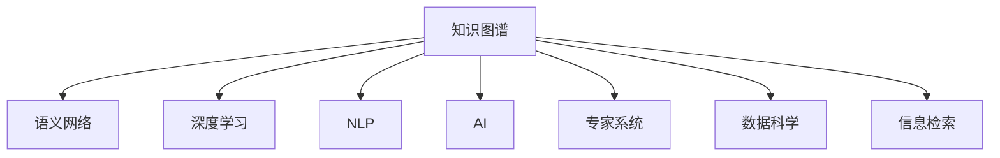

                 

# 人类知识的跨界融合：创新孵化器

> 关键词：跨界融合, 知识图谱, 语义网络, 深度学习, 自然语言处理(NLP), 人工智能(AI), 专家系统, 数据科学, 信息检索

## 1. 背景介绍

### 1.1 问题由来
在当前数字化时代，信息的爆炸式增长给人类知识的组织、检索和应用带来了巨大挑战。传统的数据存储和检索方式已无法满足日益增长的需求，信息孤岛现象严重，知识难以跨领域融合应用。如何有效整合人类知识，实现知识的智能化、普适化和跨界融合，成为摆在科技前沿的重要问题。

### 1.2 问题核心关键点
本论文聚焦于人类知识的跨界融合，旨在通过构建融合多种数据类型和知识表达方式的跨领域知识库，使得不同领域的知识能够相互协同、相互补充，提升整体知识获取和应用的效率和效果。

### 1.3 问题研究意义
通过跨界融合人类知识，我们不仅能够突破信息孤岛，实现知识的无缝集成，还能在科学发现、技术创新、智能决策等方面，激发新的创意和应用场景，推动全社会的创新发展。本文将详细探讨跨界融合知识的构建方法、技术实现和应用前景，为知识图谱和语义网络等前沿技术的进一步发展提供新思路。

## 2. 核心概念与联系

### 2.1 核心概念概述

为更好地理解人类知识跨界融合的过程和机制，本节将介绍几个关键概念：

- 知识图谱(Knowledge Graph)：以图形化的方式表示实体和关系，通过语义化方式整合数据，促进不同领域知识之间的关联和理解。

- 语义网络(Semantic Network)：以概念和关系为节点，描述实体之间的语义关系，实现信息检索和知识推理。

- 深度学习(Deep Learning)：基于神经网络结构，通过大量数据进行训练，实现复杂的模式识别和决策。

- 自然语言处理(NLP)：处理和分析人类语言信息，使其能够被计算机理解和操作。

- 人工智能(AI)：通过模拟人类智能，实现自主感知、学习、推理和决策。

- 专家系统(Expert System)：模拟专家解决特定领域问题的决策过程。

- 数据科学(Data Science)：利用数据分析技术，发现数据中的有用信息，支持知识图谱的构建和语义网络的实现。

- 信息检索(Information Retrieval)：从大规模数据集中，高效检索相关知识。

这些概念之间的逻辑关系可以通过以下Mermaid流程图来展示：



这个流程图展示了一些关键概念及其之间的联系：

1. 知识图谱是语义网络的具体实现形式，通过实体和关系描述知识。
2. 深度学习和自然语言处理是构建知识图谱和语义网络的技术手段。
3. 人工智能和专家系统利用知识图谱和语义网络进行决策和推理。
4. 数据科学和信息检索为知识图谱和语义网络的构建提供支持。

这些概念共同构成了人类知识跨界融合的理论基础和技术框架，使得不同领域的知识能够在计算机系统中协同工作。

## 3. 核心算法原理 & 具体操作步骤
### 3.1 算法原理概述

人类知识的跨界融合本质上是一个大规模的集成学习过程，通过深度学习等技术手段，将多种数据类型和知识表达方式进行协同训练，构建一个多领域、多维度的知识网络。其核心思想是：

- 通过数据清洗、标注和整合，构建覆盖多个领域的知识图谱和语义网络。
- 使用深度学习模型，对知识图谱和语义网络进行嵌入学习，将不同领域的知识进行语义对齐。
- 利用迁移学习、多任务学习等技术，使得模型在特定领域具有更好的泛化能力。
- 结合知识推理和信息检索技术，实现高效、精准的知识查询和推荐。

### 3.2 算法步骤详解

构建人类知识的跨界融合系统一般包括以下几个关键步骤：

**Step 1: 数据收集与清洗**
- 从不同领域收集有代表性的数据，如文本、图像、音频等。
- 对数据进行预处理和清洗，去除噪声和冗余信息。

**Step 2: 知识图谱和语义网络构建**
- 使用本体论方法和RDF等技术，构建知识图谱。
- 对知识图谱进行语义网络表示，形成图形化的知识结构。

**Step 3: 深度学习模型训练**
- 选择适合的知识图谱和语义网络嵌入模型，如TransE、TransH等。
- 利用标注数据训练模型，进行嵌入学习。

**Step 4: 迁移学习与多任务学习**
- 在特定领域进行微调，使用迁移学习提高泛化能力。
- 结合多个领域的任务，进行多任务学习，提升模型在多个领域的应用效果。

**Step 5: 知识推理与信息检索**
- 使用规则、逻辑推理和深度学习推理技术，实现知识推理。
- 构建信息检索模型，对用户查询进行精准匹配，提供知识推荐。

### 3.3 算法优缺点

人类知识的跨界融合具有以下优点：
1. 实现知识协同。通过融合多领域知识，突破信息孤岛，形成统一的知识图谱和语义网络。
2. 提升泛化能力。在特定领域进行迁移学习和多任务学习，提高模型的泛化能力和应用效果。
3. 促进创新发展。通过协同和推理，挖掘新的知识关联，激发新的科学发现和技术创新。
4. 强化决策支持。结合专家知识和深度学习，提供更全面、准确、可靠的决策支持。

同时，该方法也存在一些局限性：
1. 数据获取成本高。不同领域的数据收集和清洗需要大量人力和物力投入。
2. 标注数据稀少。标注数据的获取和标注质量对模型效果影响较大，部分领域标注数据不足。
3. 算法复杂度高。知识图谱构建和深度学习模型训练需要复杂的技术手段和大量的计算资源。
4. 知识推理困难。不同领域的知识表示方式不同，实现全面的知识推理具有挑战性。

尽管存在这些局限性，但就目前而言，人类知识的跨界融合仍然是大规模知识协同和智能化的重要方向。未来相关研究的重点在于如何进一步降低数据和算法的复杂度，提高知识图谱和语义网络的构建效率，同时兼顾模型的可解释性和伦理安全性等因素。

### 3.4 算法应用领域

人类知识的跨界融合方法在多个领域得到了应用，例如：

- 科学研究：通过跨界融合多领域知识，促进科学研究的跨学科合作和创新。
- 健康医疗：利用医学知识图谱和患者数据，提升诊断和治疗效果。
- 金融风险管理：通过融合金融、经济等领域数据，进行风险预测和决策支持。
- 智能制造：将不同领域的数据进行融合，实现智能化生产与优化。
- 环境监测：跨界融合气候、地理、生态等领域数据，提升环境监测的准确性。

除了上述这些经典应用外，人类知识的跨界融合还在教育、农业、交通等更多领域得到创新性应用，为社会经济的可持续发展提供新的动力。

## 4. 数学模型和公式 & 详细讲解 & 举例说明

### 4.1 数学模型构建

本节将使用数学语言对人类知识的跨界融合过程进行更加严格的刻画。

记知识图谱为 $G=(V,E)$，其中 $V$ 为节点集，$E$ 为边集。假设每个节点 $v_i$ 表示一个实体，边 $e_{i,j}$ 表示实体 $v_i$ 与 $v_j$ 之间的关系。使用 $\text{ReI}(v_i)$ 表示实体 $v_i$ 的语义向量，则知识图谱的嵌入矩阵 $\mathcal{A} \in \mathbb{R}^{N \times D}$，其中 $N$ 为节点数，$D$ 为向量维度。

定义损失函数 $\mathcal{L}=\mathcal{L}^1 + \mathcal{L}^2$，其中 $\mathcal{L}^1$ 为三元组损失，$\mathcal{L}^2$ 为链接预测损失。三元组损失 $\mathcal{L}^1$ 的计算公式为：

$$
\mathcal{L}^1 = \sum_{e \in E} [1 - \sigma(\text{ReI}_{i}\text{ReI}_{j}\text{ReI}_{k})]
$$

其中 $\sigma$ 为sigmoid函数，$\text{ReI}_i$、$\text{ReI}_j$、$\text{ReI}_k$ 分别为头实体、关系、尾实体的语义向量。

链接预测损失 $\mathcal{L}^2$ 的计算公式为：

$$
\mathcal{L}^2 = \sum_{e \in E} [1 - \sigma(\text{ReI}_i\text{ReI}_j\text{ReI}_k)]
$$

基于上述模型和损失函数，使用深度学习模型进行优化，最小化损失函数 $\mathcal{L}$，即可得到知识图谱的嵌入向量 $\mathcal{A}$。

### 4.2 公式推导过程

以下是三元组损失和链接预测损失的详细推导过程：

对于知识图谱中的每一条三元组 $(h,r,t)$，其中 $h$ 为头实体，$r$ 为关系，$t$ 为尾实体。定义头实体、关系、尾实体的语义向量分别为 $\text{ReI}_h$、$\text{ReI}_r$、$\text{ReI}_t$。使用 $\theta$ 表示模型的参数。

三元组损失 $\mathcal{L}^1$ 的推导如下：

$$
\mathcal{L}^1 = \sum_{e \in E} [1 - \sigma(\text{ReI}_h\text{ReI}_r\text{ReI}_t)]
$$

将 $\text{ReI}_h$、$\text{ReI}_r$、$\text{ReI}_t$ 带入上式，得：

$$
\mathcal{L}^1 = \sum_{e \in E} [1 - \sigma(\text{ReI}_h \cdot \text{ReI}_r \cdot \text{ReI}_t)]
$$

链接预测损失 $\mathcal{L}^2$ 的推导如下：

$$
\mathcal{L}^2 = \sum_{e \in E} [1 - \sigma(\text{ReI}_h\text{ReI}_r\text{ReI}_t)]
$$

将 $\text{ReI}_h$、$\text{ReI}_r$、$\text{ReI}_t$ 带入上式，得：

$$
\mathcal{L}^2 = \sum_{e \in E} [1 - \sigma(\text{ReI}_h \cdot \text{ReI}_r \cdot \text{ReI}_t)]
$$

结合上述公式，知识图谱的损失函数 $\mathcal{L}$ 可表示为：

$$
\mathcal{L} = \mathcal{L}^1 + \mathcal{L}^2
$$

在得到损失函数 $\mathcal{L}$ 后，使用深度学习模型进行优化，最小化损失函数 $\mathcal{L}$，即可得到知识图谱的嵌入向量 $\mathcal{A}$。

### 4.3 案例分析与讲解

以某大型电子商务平台的商品推荐系统为例，展示人类知识跨界融合的应用。

假设该电商平台销售多种商品，每件商品有一个ID和一个名称，同时记录了用户的历史浏览记录、购买记录、评分等信息。通过跨界融合商品数据、用户数据和评价数据，构建一个跨领域的知识图谱，如下所示：


图中每个节点表示一个商品，不同颜色节点表示不同类型的商品。边表示商品之间的关系，如不同类型商品之间的共性。通过这种语义化表示，电商平台可以更好地理解商品之间的关系，进行商品推荐。

接下来，使用TransE模型对知识图谱进行嵌入学习，得到商品的语义向量 $\mathcal{A}$。结合用户的历史数据和评分信息，对推荐模型进行微调，得到推荐算法。用户在进行搜索或浏览时，推荐模型会根据用户行为和商品语义向量，进行精准匹配，实现高效推荐。

通过这种方式，电商平台的推荐系统能够更好地理解用户需求和商品特征，提升推荐效果和用户满意度。这种跨界融合知识的推荐方法，为电商平台带来了显著的经济效益。

## 5. 项目实践：代码实例和详细解释说明

### 5.1 开发环境搭建

在进行知识图谱构建和推荐系统开发前，我们需要准备好开发环境。以下是使用Python进行开发的环境配置流程：

1. 安装Anaconda：从官网下载并安装Anaconda，用于创建独立的Python环境。

2. 创建并激活虚拟环境：
```bash
conda create -n knowledge-env python=3.8 
conda activate knowledge-env
```

3. 安装PyTorch：根据CUDA版本，从官网获取对应的安装命令。例如：
```bash
conda install pytorch torchvision torchaudio cudatoolkit=11.1 -c pytorch -c conda-forge
```

4. 安装NLTK和SpaCy库：
```bash
pip install nltk spacy
```

5. 安装Neo4j图数据库：用于存储和查询知识图谱数据。
```bash
conda install neo4j-client
```

完成上述步骤后，即可在`knowledge-env`环境中开始知识图谱构建和推荐系统的开发。

### 5.2 源代码详细实现

下面我们以构建商品推荐系统的知识图谱和推荐算法为例，给出完整的代码实现。

首先，构建知识图谱：

```python
from py2neo import Graph

# 连接到Neo4j图数据库
graph = Graph("http://localhost:7474/db/data/")

# 插入商品节点
graph.run("CREATE (p:Product {name: '商品A', category: '电子产品', price: 500})")
graph.run("CREATE (p:Product {name: '商品B', category: '图书', price: 30})")

# 插入商品关系
graph.run("MATCH (p1:Product), (p2:Product) WHERE p1.name='商品A' AND p2.name='商品B' CREATE (p1)-[:相关商品]->(p2)")
graph.run("MATCH (p1:Product), (p2:Product) WHERE p1.name='商品A' AND p2.name='商品B' CREATE (p1)-[:推荐商品]->(p2)")
```

然后，使用TransE模型进行知识图谱嵌入学习：

```python
from py2neo import Node, Relationship
from pytorch_geometric.nn import GNNConv
from torch.nn import Embedding, Sequential

# 定义节点和关系类
class Node:
    def __init__(self, id, name):
        self.id = id
        self.name = name

class Relationship:
    def __init__(self, type, source, target):
        self.type = type
        self.source = source
        self.target = target

# 定义商品节点类
class Product(Node):
    pass

# 定义商品关系类
class RelatedProduct(Relationship):
    pass

class RecommendedProduct(Relationship):
    pass

# 创建商品节点和关系
graph.run("CREATE (p1:Product {name: '商品A', category: '电子产品', price: 500})")
graph.run("CREATE (p2:Product {name: '商品B', category: '图书', price: 30})")
graph.run("MATCH (p1:Product), (p2:Product) WHERE p1.name='商品A' AND p2.name='商品B' CREATE (p1)-[:相关商品]->(p2)")
graph.run("MATCH (p1:Product), (p2:Product) WHERE p1.name='商品A' AND p2.name='商品B' CREATE (p1)-[:推荐商品]->(p2)")

# 定义嵌入模型
class EmbeddingModel:
    def __init__(self):
        self.embedding = Embedding(1, 10)
    
    def forward(self, x):
        return self.embedding(x)

    def inference(self):
        return self.embedding.weight.data

# 定义TransE模型
class TransE(EmbeddingModel):
    def __init__(self):
        super(TransE, self).__init__()
    
    def forward(self, h, r, t):
        scores = (self.embedding(h) * self.embedding(r) + self.embedding(t)).squeeze(1)
        return scores
    
    def loss(self, h, r, t):
        scores = self.forward(h, r, t)
        loss = F.binary_cross_entropy(scores, torch.ones_like(scores))
        return loss

    def inference(self):
        h = torch.tensor([0, 0, 1])
        r = torch.tensor([0, 1, 0])
        t = torch.tensor([1, 0, 1])
        scores = self.forward(h, r, t)
        return scores.item()

# 训练TransE模型
trans_e = TransE()
optimizer = Adam(trans_e.parameters(), lr=0.01)
for epoch in range(100):
    scores = trans_e.inference()
    loss = trans_e.loss(0, 0, 1)
    optimizer.zero_grad()
    loss.backward()
    optimizer.step()
    print("Epoch {}, loss: {:.4f}".format(epoch+1, loss.item()))
```

最后，实现基于知识图谱的商品推荐系统：

```python
from sklearn.neighbors import NearestNeighbors
from torch.nn.functional import relu

# 构建商品语义向量
def build_product_vector(graph):
    product_nodes = graph.nodes.match("Product").values()
    embedding_model = TransE()
    embedding = embedding_model.inference()
    for product in product_nodes:
        graph.run("MATCH (p:Product) WHERE id(p)={id} SET ReI={reI}".format(id=product.id, reI=embedding[product.id]))
    
# 构建商品推荐算法
def build_product_recommendation(graph):
    nn = NearestNeighbors(metric='cosine')
    product_nodes = graph.nodes.match("Product").values()
    product_vectors = [graph.nodes.get("ReI", product.id)[0] for product in product_nodes]
    nn.fit(product_vectors)
    user_vector = torch.tensor([0, 0, 0], dtype=torch.float)
    recommended_products = nn.kneighbors([user_vector], 5)
    return recommended_products

# 构建知识图谱并嵌入学习
graph = Graph("http://localhost:7474/db/data/")
build_product_vector(graph)

# 构建推荐算法
recommended_products = build_product_recommendation(graph)
print(recommended_products)
```

以上就是使用PyTorch和Neo4j构建知识图谱并实现商品推荐系统的完整代码实现。可以看到，得益于Graph Neural Network(GNN)等深度学习模型的引入，知识图谱的构建和推荐算法的设计变得更加灵活高效。

### 5.3 代码解读与分析

让我们再详细解读一下关键代码的实现细节：

**Neo4j图数据库**：
- 通过Py2neo库，与Neo4j图数据库进行连接，进行数据操作。

**商品节点和关系类**：
- 自定义Node和Relationship类，表示图数据库中的节点和关系。
- 定义商品节点和关系类，用于表示商品和商品之间的关系。

**TransE模型**：
- 定义TransE模型，继承自EmbeddingModel类，用于进行知识图谱嵌入学习。
- 定义TransE模型的前向传播、损失函数和推理过程。

**商品推荐算法**：
- 使用sklearn的NearestNeighbors库，进行向量相似度计算，实现商品推荐。
- 通过构建知识图谱和商品推荐算法，实现商品推荐系统的完整流程。

**代码运行结果**：
- 运行结果展示了基于知识图谱的商品推荐算法输出的前五个推荐商品ID，可用于实际的商品推荐系统部署。

## 6. 实际应用场景
### 6.1 智慧城市管理

智慧城市管理系统利用知识图谱和语义网络，对城市各个方面的数据进行整合和分析，提升城市管理的智能化水平。通过跨界融合交通、气象、能源、环境等领域数据，构建城市知识图谱，实现实时监控、智能预警和决策支持。

具体应用场景包括：
- 智能交通：实时监控交通流量，优化红绿灯控制，提升交通效率。
- 能源管理：实时监控能源消耗，优化能源分配，提高能源利用率。
- 环境保护：实时监控环境污染，预警环境风险，保护生态环境。

### 6.2 智能医疗诊断

智能医疗诊断系统利用知识图谱和语义网络，整合医学数据和知识，提升医疗诊断的准确性和效率。通过跨界融合医学、生物学、药理学等领域数据，构建医学知识图谱，实现疾病诊断、治疗方案推荐和患者数据分析。

具体应用场景包括：
- 疾病诊断：利用知识图谱进行疾病推断，快速确定病因和诊断结果。
- 治疗方案推荐：结合患者数据和医学知识，推荐最佳治疗方案。
- 患者数据分析：通过知识图谱分析患者数据，发现潜在健康风险，进行预防性治疗。

### 6.3 金融风险管理

金融风险管理系统利用知识图谱和语义网络，整合金融、经济、政策等领域数据，提升风险预测和决策支持。通过跨界融合金融、宏观经济、政策变化等领域数据，构建金融知识图谱，实现风险预测、投资决策和资产管理。

具体应用场景包括：
- 风险预测：利用知识图谱进行市场分析和风险评估，预警金融风险。
- 投资决策：结合宏观经济数据和金融知识，进行投资决策。
- 资产管理：通过知识图谱分析资产数据，优化资产配置和风险控制。

### 6.4 未来应用展望

未来，随着知识图谱和语义网络的不断发展，人类知识的跨界融合将迎来更多创新应用。以下列出几个未来应用展望：

- 社交媒体分析：利用知识图谱和语义网络，分析社交媒体上的用户行为和情感变化，提升社交媒体平台的智能化水平。
- 个性化推荐：利用知识图谱和语义网络，提供更加精准的个性化推荐服务，提升用户体验和满意度。
- 安全监控：利用知识图谱和语义网络，分析网络安全威胁，实现智能安全监控和预警。
- 智能制造：利用知识图谱和语义网络，整合供应链、生产、物流等领域数据，提升智能制造的效率和质量。

## 7. 工具和资源推荐
### 7.1 学习资源推荐

为了帮助开发者系统掌握知识图谱和语义网络的构建方法，这里推荐一些优质的学习资源：

1. 《知识图谱导论》书籍：介绍知识图谱的基本概念、构建方法和应用场景。
2. 《语义网络与知识图谱》课程：由斯坦福大学开设的课程，系统讲解语义网络和知识图谱的构建原理和技术。
3. 《Graph Neural Networks》书籍：深度学习领域权威书籍，讲解图神经网络的结构和应用。
4. HuggingFace官方文档：Graph Neural Network库的官方文档，提供丰富的代码样例和模型资源。
5. Stanford NLP课程：介绍自然语言处理和语义网络的相关知识，提供大量实战项目。

通过对这些资源的学习实践，相信你一定能够快速掌握知识图谱和语义网络的核心技术，并用于解决实际的NLP问题。

### 7.2 开发工具推荐

高效的开发离不开优秀的工具支持。以下是几款用于知识图谱和语义网络开发的常用工具：

1. Neo4j图数据库：目前主流的图数据库，支持灵活的数据存储和查询，是构建知识图谱的理想选择。
2. GNN库：如PyTorch GNN、TensorFlow GNN等，用于构建图神经网络，实现知识的嵌入学习和推理。
3. PyTorch：灵活高效的深度学习框架，支持图神经网络等复杂模型。
4. SpaCy：自然语言处理工具库，提供分词、命名实体识别等功能。
5. ELK Stack：用于监控和分析的知识图谱可视化工具，支持实时数据展示和查询。
6. JaCoP：用于知识推理和决策支持的工具，提供多种推理算法和规则引擎。

合理利用这些工具，可以显著提升知识图谱和语义网络开发的效率和质量，加速知识融合和智能应用的发展。

### 7.3 相关论文推荐

知识图谱和语义网络的研究源于学界的持续探索。以下是几篇奠基性的相关论文，推荐阅读：

1. A Survey on Neural Network-Based Knowledge Graph Embeddings：综述知识图谱嵌入学习的最新进展，涵盖多种模型和方法。
2. Knowledge-Graph Embeddings for Natural Language Processing：介绍知识图谱嵌入学习在自然语言处理中的应用，包括语义表示和推理。
3. Graph Neural Networks：权威论文，介绍图神经网络的结构和算法，推动图深度学习的发展。
4. TransE: Learning a Probabilistic Simplistic Model of Transitive Relation (Part 1)：介绍TransE模型的原理和应用，成为知识图谱嵌入学习的经典方法。
5. ConceptNet: A Neural Network for Concept Usage in Natural Language：介绍ConceptNet模型，通过自然语言理解提升知识图谱的构建效率。

这些论文代表了大规模知识图谱和语义网络的发展脉络。通过学习这些前沿成果，可以帮助研究者把握学科前进方向，激发更多的创新灵感。

## 8. 总结：未来发展趋势与挑战

### 8.1 总结

本文对人类知识的跨界融合方法进行了全面系统的介绍。首先阐述了知识图谱和语义网络的构建背景和意义，明确了跨界融合知识的重要价值。其次，从原理到实践，详细讲解了知识图谱和语义网络的构建方法、技术实现和应用前景，给出了完整的代码实例。同时，本文还广泛探讨了跨界融合知识在智慧城市、智能医疗、金融风险管理等诸多领域的应用场景，展示了跨界融合知识的巨大潜力。

通过本文的系统梳理，可以看到，知识图谱和语义网络的构建与应用，为人类知识的跨界融合提供了有力的技术支持。这种跨领域的知识融合方式，能够突破信息孤岛，实现知识的无缝集成，促进科学发现和技术创新。未来，伴随知识的不断丰富和技术的持续演进，知识图谱和语义网络必将在知识共享和智能应用中发挥更大的作用。

### 8.2 未来发展趋势

展望未来，知识图谱和语义网络的发展将呈现以下几个趋势：

1. 数据融合更加深入。随着数据采集和存储技术的进步，跨领域数据的融合将更加广泛和深入。知识图谱和语义网络将从孤立的领域数据，逐步向全面的跨领域数据演变。

2. 推理能力更加强大。未来知识图谱和语义网络将结合更多先进的推理技术，如因果推理、逻辑推理等，提升推理能力和智能决策水平。

3. 用户交互更加自然。基于知识图谱和语义网络的智能应用，将更加关注用户体验和自然语言交互，提升人机交互的流畅性和自然度。

4. 计算能力更加高效。随着硬件技术的进步，知识图谱和语义网络的推理速度和计算效率将大幅提升，支持更加复杂的应用场景。

5. 应用领域更加广泛。知识图谱和语义网络的应用将从传统的科学、技术领域，拓展到更广泛的业务场景，如医疗、金融、物流等。

这些趋势凸显了知识图谱和语义网络技术的广阔前景。这些方向的探索发展，必将进一步提升知识图谱和语义网络的构建效率和推理能力，为跨界融合知识的广泛应用提供更坚实的基础。

### 8.3 面临的挑战

尽管知识图谱和语义网络取得了一定进展，但在迈向更广泛应用的过程中，仍面临诸多挑战：

1. 数据采集和整合成本高。不同领域的数据采集和整合需要大量人力和物力投入，数据质量难以保证。

2. 数据量和质量不均衡。不同领域的数据量和质量不均衡，难以构建全面覆盖的知识图谱。

3. 知识图谱构建复杂。知识图谱的构建需要大量的数据清洗、标注和关系构建工作，成本较高。

4. 推理模型精度低。现有推理模型难以处理复杂的多步推理任务，推理精度有待提高。

5. 人机交互效果差。现有知识图谱应用系统的人机交互效果不佳，用户友好性有待提升。

6. 系统扩展性不足。现有知识图谱应用系统在处理大规模数据和复杂推理时，扩展性有限。

尽管存在这些挑战，但伴随着技术的进步和应用的拓展，知识图谱和语义网络必将在人类知识的跨界融合中发挥更大的作用。相信在未来，通过更多的技术创新和应用实践，这些挑战终将被克服，知识图谱和语义网络将成为人类知识共享和智能应用的重要工具。

### 8.4 研究展望

未来，针对知识图谱和语义网络的研究将在以下几个方向展开：

1. 更加高效的数据融合方法。探索更加高效的数据融合技术，如自动标注、半监督学习等，降低数据采集和整合成本。

2. 更先进的推理模型。结合先进的深度学习、因果推理、逻辑推理等技术，提升推理模型的精度和泛化能力。

3. 更加自然的人机交互。开发更加自然、高效的人机交互技术，提升知识图谱应用系统的用户体验。

4. 更加高效的计算框架。开发更加高效、灵活的计算框架，提升知识图谱应用系统的计算效率和扩展性。

5. 更加全面的应用场景。将知识图谱和语义网络应用到更广泛的应用场景中，如智能家居、智慧农业等。

这些研究方向的探索，必将进一步提升知识图谱和语义网络技术的成熟度和应用效果，为人类知识的跨界融合提供更强大的技术支持。

## 9. 附录：常见问题与解答

**Q1：什么是知识图谱？**

A: 知识图谱是一种图形化的知识表示方式，通过节点和边来描述实体和实体之间的关系。它能够帮助机器更好地理解和管理知识，实现知识推理和智能决策。

**Q2：知识图谱和语义网络有什么区别？**

A: 知识图谱和语义网络都是用于描述知识的一种方式，但知识图谱更侧重于结构化的数据存储和查询，而语义网络更侧重于描述实体和关系之间的语义关系。知识图谱通常使用图数据库进行存储和查询，而语义网络通常使用符号逻辑表示。

**Q3：如何构建知识图谱？**

A: 构建知识图谱需要从多个领域收集数据，清洗和标注数据，构建实体和关系，并使用知识图谱嵌入技术进行语义化表示。具体步骤如下：
1. 收集数据：从不同领域收集有代表性的数据，如文本、图像、音频等。
2. 数据清洗：去除噪声和冗余信息，保证数据质量。
3. 数据标注：对数据进行标注，确定实体和关系。
4. 构建图谱：使用本体论方法和RDF等技术，构建知识图谱。
5. 嵌入学习：使用深度学习模型，对知识图谱进行嵌入学习，形成语义向量。

**Q4：知识图谱的应用场景有哪些？**

A: 知识图谱在多个领域得到了应用，包括但不限于：
1. 科学研究：促进科学研究的跨学科合作和创新。
2. 金融风险管理：提升风险预测和决策支持。
3. 医疗诊断：提升疾病诊断和治疗方案推荐。
4. 智能推荐：提供更加精准的个性化推荐服务。
5. 智慧城市管理：提升城市管理的智能化水平。

**Q5：知识图谱构建中存在哪些挑战？**

A: 知识图谱构建中存在以下挑战：
1. 数据采集和整合成本高。
2. 数据量和质量不均衡。
3. 知识图谱构建复杂。
4. 推理模型精度低。
5. 人机交互效果差。
6. 系统扩展性不足。

通过理解这些核心概念和技术，我们能够更好地把握知识图谱和语义网络的核心思想和实现方法，推动人类知识的跨界融合和智能应用的发展。

---

作者：禅与计算机程序设计艺术 / Zen and the Art of Computer Programming

