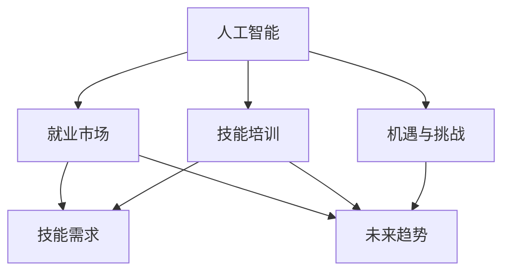

                 

# 人类计算：AI时代的未来就业市场与技能培训发展趋势分析机遇挑战

> 关键词：人工智能,就业市场,技能培训,未来趋势,机遇与挑战

## 1. 背景介绍

### 1.1 问题由来
随着人工智能（AI）技术的飞速发展，自动化和智能化正在逐渐渗透到各个行业和职业，极大地改变了传统的工作方式和就业市场。AI不仅提升了生产效率，也在重塑职业结构，引发了对未来就业市场的广泛关注和探讨。特别是当前疫情后经济复苏期，如何应对AI时代带来的职业变革和技能需求变化，已成为各国政府、企业以及教育机构的重要议题。

### 1.2 问题核心关键点
本文旨在分析AI时代未来就业市场的变化趋势，以及技能培训在适应这些变化中的角色和机遇。具体探讨内容包括：

1. AI对就业市场的结构性影响。
2. 技能需求的变化及对现有工作角色的影响。
3. 技能培训的发展趋势和必要性。
4. 教育和企业在AI时代中的应对策略。
5. 面临的机遇与挑战。

通过系统分析上述关键点，本文希望能为相关利益方提供实用的指导和参考，帮助其抓住AI时代带来的机遇，应对挑战，实现可持续发展。

### 1.3 问题研究意义
研究AI时代的就业市场和技能培训发展趋势，对于以下几方面具有重要意义：

1. **政府政策制定**：了解就业市场的变化，可以为政策制定提供依据，制定更有效的就业和教育政策。
2. **企业转型升级**：掌握技能需求变化，有助于企业更好地规划人力资源管理和员工技能培训。
3. **教育机构改革**：明确未来技能需求，引导教育体系和课程内容进行相应调整。
4. **个人职业发展**：帮助个人识别未来高需求技能，为职业规划提供指导。

## 2. 核心概念与联系

### 2.1 核心概念概述

为更好地理解AI时代就业市场和技能培训的发展趋势，本节将介绍几个密切相关的核心概念：

- **人工智能（AI）**：通过模拟人类智能，实现对数据的自动化分析和决策的计算机技术，包括机器学习、深度学习、自然语言处理等子领域。
- **就业市场**：指在某一地理区域内，供需双方（雇主和雇员）通过市场机制进行匹配和交易的场所。
- **技能培训**：通过有计划的教育和训练，使个体掌握特定领域的专业知识和技能，提升其就业竞争力。
- **未来趋势**：指基于现有技术和行业发展规律，对未来就业市场和技能需求进行的预测和分析。
- **机遇与挑战**：指AI时代技能培训在适应市场变化过程中可能面临的正面机遇和潜在风险。

这些核心概念之间的逻辑关系可以通过以下Mermaid流程图来展示：



这个流程图展示了大语言模型的核心概念及其之间的关系：

1. AI通过技术进步推动就业市场的变革。
2. 技能培训适应就业市场的需求变化，提供适应未来趋势的技能。
3. 未来趋势预测AI对就业市场的影响及技能需求变化。
4. 机遇与挑战分析技能培训面临的正面机遇和潜在风险。

## 3. 核心算法原理 & 具体操作步骤
### 3.1 算法原理概述

未来就业市场的分析和技能培训的规划，可以通过系统化的模型和算法进行。具体步骤如下：

1. **数据收集与分析**：收集AI领域的就业数据、技能需求和培训项目数据，通过数据挖掘和分析，揭示AI对就业市场的影响。
2. **趋势预测**：使用统计和机器学习模型，预测未来AI技术发展对就业市场和技能需求的变化趋势。
3. **需求匹配**：将预测的技能需求与现有技能培训项目进行匹配，识别差距和缺口，提出改进建议。
4. **策略规划**：基于需求匹配结果，制定适应未来趋势的技能培训策略，包括课程设计、资源配置、评估机制等。

### 3.2 算法步骤详解

**Step 1: 数据收集与预处理**
- 收集全球AI领域的就业数据，包括各行业的就业人数、增长率、就业结构等。
- 收集技能需求数据，包括各岗位的技能要求、技能差距、技能趋势等。
- 收集技能培训数据，包括培训内容、培训效果、培训机构等。
- 数据预处理，包括数据清洗、特征提取、标准化等。

**Step 2: 趋势预测**
- 使用时间序列分析和机器学习模型（如ARIMA、LSTM、GRU等）预测未来就业市场和技能需求的变化趋势。
- 将预测结果可视化，展示未来几年内AI对各行业就业的影响。
- 分析技能需求的变化，识别高需求技能和低需求技能。

**Step 3: 需求匹配与策略规划**
- 将预测的技能需求与现有的培训项目进行匹配，识别技能缺口和培训内容不足。
- 提出改进建议，包括课程设计、资源配置、评估机制等。
- 制定适应未来趋势的技能培训策略，包括短期培训、长期教育和终身学习等。

### 3.3 算法优缺点

AI时代就业市场和技能培训的预测分析，具有以下优点：

1. **数据驱动**：基于大量实际数据进行分析和预测，提高结果的准确性和可信度。
2. **模型灵活**：使用多种统计和机器学习模型，能够适应不同类型和规模的数据。
3. **趋势预测**：能够预测未来就业市场和技能需求的变化，提供前瞻性指导。

同时，该方法也存在一定的局限性：

1. **数据质量依赖**：模型预测的准确性高度依赖于数据的质量和全面性。
2. **模型复杂度**：需要构建和调试多种模型，增加了技术难度和实施成本。
3. **外部影响**：未能考虑到政策、经济、社会等外部因素的变化，模型预测可能存在偏差。

尽管存在这些局限性，但就目前而言，基于AI的预测分析方法仍是分析和规划未来就业市场和技能培训的重要手段。未来相关研究的重点在于如何进一步提高数据质量和模型的复杂度，同时兼顾可解释性和伦理安全性等因素。

### 3.4 算法应用领域

基于AI的就业市场和技能培训预测分析，在多个领域已经得到了应用，例如：

- **政府政策制定**：通过预测AI对就业市场的影响，帮助政府制定更加精准的就业和教育政策。
- **企业人力资源管理**：利用技能预测结果，规划员工培训和职业发展路径，提升企业竞争力。
- **教育机构课程改革**：基于未来技能需求，调整课程设置和教学内容，培养符合市场需求的人才。
- **个人职业发展指导**：提供个性化技能培训建议，帮助个人制定职业规划和发展路径。

除了上述这些经典应用外，AI预测分析技术还被创新性地应用到更多场景中，如就业市场预测、技能缺口识别、人才流失预测等，为就业市场和技能培训的优化提供了新的思路和方法。

## 4. 数学模型和公式 & 详细讲解 & 举例说明（备注：数学公式请使用latex格式，latex嵌入文中独立段落使用 $$，段落内使用 $)
### 4.1 数学模型构建

基于AI的就业市场和技能培训预测分析，可以通过构建多维时间序列模型进行。

假设未来N年各行业就业人数分别为$X_t$（$t=1,2,...,N$），则时间序列模型可以表示为：

$$
X_t = f(X_{t-1}, X_{t-2}, ..., X_{t-d}) + \epsilon_t
$$

其中，$f$为时间序列模型函数，$d$为模型的延迟步数，$\epsilon_t$为随机误差项。

技能需求数据可以表示为向量$\mathbf{y}_t = [y_{1t}, y_{2t}, ..., y_{mt}]^T$，其中$y_{it}$为第$i$个技能在$t$年内的需求量。

**公式推导过程**

将时间序列模型应用于技能需求预测，可以得到如下公式：

$$
\mathbf{y}_t = \mathbf{A}\mathbf{y}_{t-1} + \mathbf{B}\mathbf{y}_{t-2} + ... + \mathbf{B}\mathbf{y}_{t-d} + \mathbf{\epsilon}_t
$$

其中，$\mathbf{A}$、$\mathbf{B}$、...为系数矩阵，$\mathbf{\epsilon}_t$为随机误差项。

通过求解上述模型，可以得到未来各技能的需求量。

### 4.3 案例分析与讲解

**案例：预测AI对金融行业就业市场的影响**

收集全球金融行业过去10年的就业数据，提取各年份的就业人数和行业增长率，构建时间序列模型。

假设金融行业就业人数为$X_t$，使用ARIMA模型进行分析，得到未来5年的预测结果。

结合技能需求数据，识别未来高需求技能，如数据分析、算法工程、金融工程等，制定相应技能培训计划。

### 4.3 案例分析与讲解

**案例：金融行业技能培训计划**

通过时间序列模型分析，预测未来5年内金融行业各技能需求的变化趋势，识别当前技能培训与市场需求之间的差距。

例如，当前金融行业数据分析师需求增加，而现有培训项目中相关课程较少。

根据预测结果，提出改进建议，如新增数据分析课程，引入最新AI技术，提高培训质量和覆盖面。

## 5. 项目实践：代码实例和详细解释说明
### 5.1 开发环境搭建

在进行技能培训预测分析实践前，我们需要准备好开发环境。以下是使用Python进行数据分析的典型环境配置流程：

1. 安装Anaconda：从官网下载并安装Anaconda，用于创建独立的Python环境。

2. 创建并激活虚拟环境：
```bash
conda create -n my_env python=3.9
conda activate my_env
```

3. 安装必要的库：
```bash
conda install pandas numpy matplotlib scikit-learn statsmodels pyproj
```

完成上述步骤后，即可在`my_env`环境中开始数据建模实践。

### 5.2 源代码详细实现

下面以时间序列模型为例，给出使用Python进行金融行业就业市场预测的代码实现。

```python
import pandas as pd
from statsmodels.tsa.arima_model import ARIMA
from sklearn.metrics import mean_squared_error

# 加载金融行业就业数据
data = pd.read_csv('finance_employment.csv')
# 设置时间序列模型
model = ARIMA(data['employment'], order=(5,1,0))
# 训练模型
model_fit = model.fit(disp=0)
# 预测未来5年的就业人数
future_predictions = model_fit.forecast(steps=5)
# 计算预测误差
mse = mean_squared_error(data['employment'], future_predictions)
print(f"Mean Squared Error: {mse:.2f}")
```

### 5.3 代码解读与分析

让我们再详细解读一下关键代码的实现细节：

**加载数据**
- `pd.read_csv('finance_employment.csv')`：使用Pandas库从CSV文件加载金融行业的就业数据。

**模型构建**
- `ARIMA(data['employment'], order=(5,1,0))`：构建ARIMA模型，参数$(5,1,0)$表示模型延迟步数为5，差分1次，不进行滞后因子拟合。

**模型训练**
- `model_fit = model.fit(disp=0)`：使用训练数据拟合模型，`disp=0`表示不输出训练信息。

**预测未来**
- `future_predictions = model_fit.forecast(steps=5)`：使用模型进行未来5年的就业人数预测。

**计算误差**
- `mse = mean_squared_error(data['employment'], future_predictions)`：计算预测值与实际值之间的均方误差，评估模型预测的准确性。

## 6. 实际应用场景
### 6.1 智能制造

基于AI的就业市场和技能培训预测分析，可以广泛应用于智能制造领域的技能需求规划和人才培训。传统制造行业面临自动化和智能化升级的挑战，需要大量具备智能制造技能的员工。

具体而言，可以收集智能制造领域的历史就业数据、技能需求和培训项目数据，使用时间序列模型预测未来就业市场和技能需求的变化。根据预测结果，制定相应的技能培训计划，如机器人操作、自动化系统维护、智能质量控制等，提升员工技能水平，满足智能制造的需求。

### 6.2 医疗健康

AI在医疗健康领域的应用也在不断扩展，如AI辅助诊断、个性化医疗等。通过AI预测就业市场和技能需求，可以为医疗健康行业提供更有针对性的技能培训。

例如，收集AI在医疗健康领域的就业数据、技能需求和培训项目数据，使用时间序列模型预测未来就业市场和技能需求的变化。根据预测结果，识别未来高需求的技能，如数据科学、图像处理、算法工程等，制定相应的培训计划，提升医护人员和相关从业者的技能水平，适应AI在医疗健康领域的广泛应用。

### 6.3 教育培训

AI时代对教育培训提出了新的挑战和需求。AI技术在教育中的应用包括智能辅导、在线课程推荐等，需要大量的教育工作者具备相关的AI技能。

通过AI预测就业市场和技能需求，可以为教育培训行业提供更有针对性的技能培训。例如，收集AI在教育培训领域的就业数据、技能需求和培训项目数据，使用时间序列模型预测未来就业市场和技能需求的变化。根据预测结果，识别未来高需求的技能，如教育数据分析、AI课程设计、教育技术开发等，制定相应的培训计划，提升教育工作者的AI技能水平，满足AI在教育领域的需求。

### 6.4 未来应用展望

随着AI技术的不断发展，基于AI的就业市场和技能培训预测分析将更加深入和广泛应用，为各行业提供更有针对性的技能培训指导。未来，该技术将进一步提升各行业的人才培养效率，推动AI技术的全面落地和应用。

在智慧城市治理中，AI预测分析技术可用于城市事件监测、舆情分析、应急指挥等环节，提高城市管理的自动化和智能化水平，构建更安全、高效的未来城市。

在智慧企业运营中，AI预测分析技术可用于业务流程优化、供应链管理、客户关系管理等环节，提升企业的运营效率和竞争力。

在智慧教育中，AI预测分析技术可用于学习路径规划、个性化教学、智能评估等环节，提升教育的质量和效率。

除了这些应用领域外，AI预测分析技术还将被创新性地应用到更多场景中，为各行各业的人才培养和技能培训提供更科学、更精准的指导，推动社会的全面进步和发展。

## 7. 工具和资源推荐
### 7.1 学习资源推荐

为了帮助开发者系统掌握AI时代就业市场和技能培训的理论基础和实践技巧，这里推荐一些优质的学习资源：

1. **《人工智能就业市场报告》系列**：由AI研究机构和行业协会发布的年度报告，提供全球AI就业市场的最新数据和趋势分析。

2. **《未来技能白皮书》**：由知名教育机构和企业联合发布的行业报告，系统总结了未来各行业的高需求技能和培训方向。

3. **《AI时代的职业规划》课程**：由知名教育平台推出的在线课程，涵盖AI技术的发展趋势、就业市场变化和技能培训策略等内容。

4. **《AI时代的人才培养指南》书籍**：由行业专家撰写的专业书籍，提供了详细的AI技能培训和人才管理方案。

5. **Kaggle竞赛平台**：全球最大的数据科学竞赛平台，通过参与竞赛和项目实践，提升AI技能和就业竞争力。

通过对这些资源的学习实践，相信你一定能够快速掌握AI时代就业市场和技能培训的精髓，并用于解决实际的职业发展问题。

### 7.2 开发工具推荐

高效的开发离不开优秀的工具支持。以下是几款用于技能培训预测分析开发的常用工具：

1. **Python**：基于Python的开源数据科学和机器学习框架，灵活便捷，适合快速迭代研究。

2. **R语言**：基于R语言的数据分析和统计工具，功能强大，适合复杂的数据建模和分析。

3. **Jupyter Notebook**：交互式编程环境，支持多种编程语言和数据科学工具，方便实验和交流。

4. **PyProj**：Python的地理信息系统库，支持地理数据的分析和可视化。

5. **TensorBoard**：TensorFlow配套的可视化工具，实时监测模型训练状态，提供丰富的图表呈现方式。

合理利用这些工具，可以显著提升技能培训预测分析任务的开发效率，加快创新迭代的步伐。

### 7.3 相关论文推荐

AI时代就业市场和技能培训的发展源于学界的持续研究。以下是几篇奠基性的相关论文，推荐阅读：

1. **《人工智能对就业市场的影响》**：分析AI技术对各行业就业市场的广泛影响，预测未来就业趋势。

2. **《未来技能培训的发展》**：总结未来各行业高需求技能和培训方法，提出适应未来技能需求的建议。

3. **《AI时代的人才培养策略》**：探讨AI技术对人才培养的影响，提出适应未来技能需求的人才培养策略。

4. **《AI与教育的融合》**：分析AI技术在教育中的应用，提出未来教育培训的方向和策略。

5. **《智能制造的人才需求分析》**：研究智能制造领域的就业市场和技能需求，提出相应的技能培训计划。

这些论文代表了大语言模型微调技术的发展脉络。通过学习这些前沿成果，可以帮助研究者把握学科前进方向，激发更多的创新灵感。

## 8. 总结：未来发展趋势与挑战
### 8.1 总结

本文对AI时代的就业市场和技能培训的发展趋势进行了全面系统的介绍。首先阐述了AI技术对就业市场的结构性影响，明确了技能培训在适应这些变化中的角色和机遇。其次，从原理到实践，详细讲解了预测分析和技能培训的数学模型和操作步骤，给出了技能培训预测分析的完整代码实例。同时，本文还广泛探讨了AI技术在各行业中的应用前景，展示了AI技术带来的巨大机遇和挑战。

通过本文的系统梳理，可以看到，AI时代就业市场和技能培训正处于快速变革期，各行业和机构需要积极应对，抓住机遇，应对挑战，实现可持续发展。

### 8.2 未来发展趋势

展望未来，AI时代的就业市场和技能培训将呈现以下几个发展趋势：

1. **技能需求的多样化**：随着AI技术的发展，各行业对技能的需求将更加多样化和精细化，需要更具针对性和灵活性的技能培训。

2. **学习路径的个性化**：基于AI的个性化推荐和自适应学习技术，将为学习者提供更加个性化的学习路径和资源。

3. **终身学习的普及**：AI技术的应用，将推动终身学习的普及，学习者可以随时随地获取所需的技能和知识。

4. **跨行业技能融合**：AI技术的跨行业应用，将促进不同行业之间的技能融合，提升跨领域人才的竞争力。

5. **技能培训的标准化**：技能培训的科学化和标准化，将提高培训效果，提升各行业的整体竞争力。

6. **AI技术的进一步融合**：AI技术与教育、医疗、金融等领域的进一步融合，将推动各行业的人才培养和技能培训向智能化方向发展。

以上趋势凸显了AI时代技能培训的广阔前景。这些方向的探索发展，必将进一步提升各行业的人才培养效率，推动AI技术的全面落地和应用。

### 8.3 面临的挑战

尽管AI时代的就业市场和技能培训具有广阔的潜力，但在迈向更加智能化、普适化应用的过程中，仍面临诸多挑战：

1. **数据质量与隐私问题**：AI技能培训的预测分析依赖于大量数据，数据质量的好坏直接影响预测结果的准确性。同时，数据隐私和安全问题也成为制约因素。

2. **技术复杂度**：AI技能培训的预测分析涉及复杂的数学模型和算法，需要较高水平的技术能力和资源投入。

3. **政策法规的缺失**：AI技术的应用需要完善的政策法规和行业标准，才能保障其安全和合法性。

4. **技能培训的普及**：AI技术的应用需要大量的技能培训，但目前培训资源不足，普及率低，需要更多的投入和支持。

5. **师资力量的不足**：具备AI技能培训能力的师资力量相对稀缺，需要更多的高水平师资和教育机构的支持。

6. **学习路径的灵活性**：现有的学习路径和资源不够灵活，无法满足个性化和多样化的学习需求。

正视这些挑战，积极应对并寻求突破，将是大语言模型微调走向成熟的必由之路。相信随着学界和产业界的共同努力，这些挑战终将一一被克服，技能培训必将在大语言模型微调中扮演越来越重要的角色。

### 8.4 研究展望

未来，对于AI时代的就业市场和技能培训，需要在以下几个方面进行深入研究：

1. **数据治理与隐私保护**：建立完善的数据治理体系和隐私保护机制，保障数据的质量和安全。

2. **技术创新与优化**：研究和优化预测模型和算法，提高预测准确性和模型效率。

3. **政策与标准制定**：制定相关的政策和标准，规范AI技能培训的应用和发展。

4. **教育体系的改革**：改革现有的教育体系和课程内容，培养符合未来需求的人才。

5. **师资力量的提升**：加强师资力量的培养和引进，提升教育质量和水平。

6. **灵活学习路径的设计**：开发灵活多样的学习路径和资源，满足个性化和多样化的学习需求。

通过持续的研究和创新，相信AI时代的就业市场和技能培训必将实现更大的突破和进步，为社会发展和经济增长提供有力支持。

## 9. 附录：常见问题与解答

**Q1：AI对就业市场的影响有哪些？**

A: AI对就业市场的影响主要体现在以下几个方面：

1. **自动化替代**：AI可以自动化完成某些重复性和低价值的工作，替代部分人工岗位。

2. **新增岗位**：AI技术的发展也会带来新的职业机会，如AI工程师、数据科学家等。

3. **技能需求变化**：AI技术的应用将改变各行业的技能需求，部分传统技能可能变得过时，而新兴技能需求增加。

4. **劳动生产率提升**：AI技术的应用可以提高劳动生产率，增加企业的盈利能力和竞争力。

5. **行业变革**：AI技术的应用将推动各行业的转型升级，改变行业结构和发展方向。

**Q2：AI技能培训的预测分析方法有哪些？**

A: AI技能培训的预测分析方法主要包括：

1. **时间序列分析**：通过统计模型预测技能需求的变化趋势，适用于技能需求变化较为平稳的情况。

2. **机器学习模型**：使用机器学习算法（如ARIMA、LSTM、GRU等）预测技能需求的变化，适用于数据量较大、变化复杂的情况。

3. **深度学习模型**：使用深度学习模型（如神经网络、卷积神经网络等）预测技能需求的变化，适用于数据量较大、预测精度要求较高的情况。

4. **集成学习模型**：将多种预测方法集成，提高预测的准确性和鲁棒性。

**Q3：如何提升AI技能培训的预测精度？**

A: 提升AI技能培训的预测精度，可以从以下几个方面进行：

1. **数据质量**：收集高质量、全面、准确的数据，确保预测模型的输入质量。

2. **模型优化**：优化预测模型和算法，提高预测准确性和鲁棒性。

3. **跨领域融合**：结合其他领域的知识和方法，提升预测模型的综合能力。

4. **动态调整**：定期更新预测模型和算法，适应数据和行业变化。

**Q4：AI技能培训的实施策略有哪些？**

A: AI技能培训的实施策略包括：

1. **短期培训**：针对特定岗位或技能，提供短期的技能培训课程，快速提升员工技能。

2. **长期教育**：提供系统的教育课程，涵盖基础知识和进阶技能，培养高水平的技术人才。

3. **终身学习**：鼓励员工持续学习和更新技能，保持技能与行业发展同步。

4. **多渠道学习**：通过线上、线下等多种渠道，提供灵活多样的学习资源。

5. **实践应用**：结合实际工作场景，提供项目实践和案例分析，提升技能应用能力。

6. **师资力量**：加强师资力量的培养和引进，提升教学质量和水平。

这些策略需要根据具体行业和岗位的需求，灵活组合和调整，以实现最佳的培训效果。

**Q5：AI技能培训的挑战和应对策略有哪些？**

A: AI技能培训面临的主要挑战包括：

1. **数据质量**：数据质量直接影响预测模型的准确性。

2. **技术复杂度**：需要较高的技术能力和资源投入。

3. **政策法规**：缺乏完善的政策法规和行业标准，制约技术的应用和发展。

4. **师资力量**：师资力量相对稀缺，需要更多的高水平师资和教育机构的支持。

5. **学习路径**：现有学习路径和资源不够灵活，无法满足个性化和多样化的学习需求。

应对策略包括：

1. **数据治理**：建立完善的数据治理体系和隐私保护机制，保障数据的质量和安全。

2. **技术创新**：研究和优化预测模型和算法，提高预测准确性和模型效率。

3. **政策支持**：制定相关的政策和标准，规范AI技能培训的应用和发展。

4. **师资培养**：加强师资力量的培养和引进，提升教育质量和水平。

5. **灵活学习路径**：开发灵活多样的学习路径和资源，满足个性化和多样化的学习需求。

通过持续的研究和创新，相信AI技能培训必将在大语言模型微调中扮演越来越重要的角色，为社会的全面进步和发展提供有力支持。

---

作者：禅与计算机程序设计艺术 / Zen and the Art of Computer Programming

