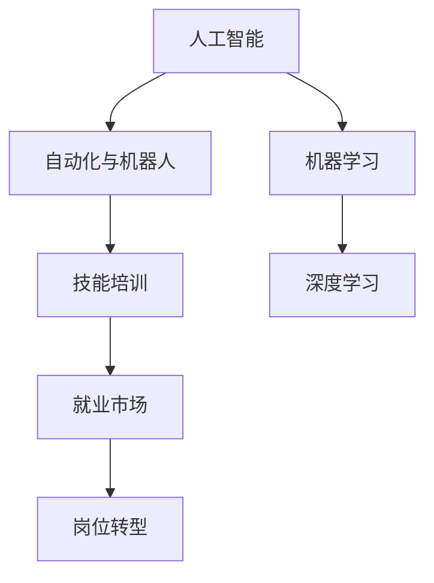

                 

# 人类计算：AI时代的未来就业市场与技能培训发展趋势分析机遇挑战机遇趋势分析

> 关键词：AI, 未来就业市场, 技能培训, 趋势分析, 机遇与挑战

## 1. 背景介绍

### 1.1 问题由来

随着人工智能(AI)技术的迅猛发展，特别是深度学习和机器学习技术的普及，自动化、智能化工具开始广泛应用于各行各业。AI的广泛应用一方面极大地提高了工作效率，降低了生产成本，但另一方面也带来了劳动市场的重大变革。机器替代了传统意义上的重复性、低技能劳动岗位，同时也催生了许多新的AI驱动的工作岗位，对劳动力市场产生了深刻影响。

### 1.2 问题核心关键点

在AI时代，就业市场与技能培训面临着新的机遇与挑战。机遇在于AI技术的应用为各行各业带来了新的增长点，催生了大量的新兴岗位，同时技术技能成为新一轮职场竞争的关键。挑战在于快速变化的技术环境和不断更新的技能要求对现有劳动者的职业转型提出了更高要求，同时AI的普及也可能引发一些社会问题。

## 2. 核心概念与联系

### 2.1 核心概念概述

为更好地理解AI时代就业市场与技能培训的发展趋势，本节将介绍几个核心概念：

- **人工智能(AI)**：通过模拟人类智能过程，特别是学习、推理和自我修正能力，使得机器能够在特定任务上具备与人类相似的智能水平。
- **自动化与机器人**：利用机器学习和自动化技术实现任务的自动化处理，减少人工干预，提高生产效率。
- **机器学习**：基于数据驱动的方法，通过算法模型训练使机器能够从数据中学习规律，实现预测与决策。
- **深度学习**：一种特殊的机器学习算法，通过多层神经网络结构对复杂数据进行建模和预测。
- **技能培训**：针对特定岗位或技术领域，通过教育培训提升员工的技能水平，使其能够胜任新岗位或掌握新技术。
- **就业市场**：劳动力供需关系的总和，反映了劳动力的流动与匹配情况。
- **岗位转型**：由于技术变革，某些传统岗位的消失和新岗位的产生，劳动力需要进行职业转型以适应新的岗位要求。

这些概念之间相互联系，共同构成了AI时代就业市场与技能培训的总体框架。人工智能的发展带动了自动化与机器人技术的应用，进而改变了现有的就业结构；机器学习与深度学习的进步提升了技能培训的针对性；而技能培训的提升又进一步促进了就业市场的健康发展。

### 2.2 核心概念原理和架构的 Mermaid 流程图



## 3. 核心算法原理 & 具体操作步骤

### 3.1 算法原理概述

AI时代的就业市场与技能培训分析，主要依赖于以下几类算法：

- **数据挖掘与分析**：通过分析劳动市场的历史数据，挖掘出就业趋势、技能需求等规律。
- **预测模型**：基于历史数据，构建预测模型，预测未来的就业市场变化和技能需求。
- **分类与聚类算法**：用于对岗位进行分类与聚类，识别出不同类型岗位的技能要求和岗位之间的相关性。
- **优化算法**：如遗传算法、粒子群优化算法等，用于优化技能培训计划，使其能够高效地提升劳动者技能。

### 3.2 算法步骤详解

**Step 1: 数据准备与预处理**
- 收集就业市场的历史数据，包括岗位需求、技能要求、薪资水平等信息。
- 对数据进行清洗和预处理，去除噪音和缺失值，并进行归一化处理。

**Step 2: 特征工程与模型选择**
- 根据需求，选择或构建相关特征，如岗位类别、技能要求、薪资水平等。
- 选择合适的预测模型，如线性回归、随机森林、神经网络等，进行模型训练与评估。

**Step 3: 模型训练与优化**
- 利用历史数据训练模型，并使用交叉验证等方法优化模型参数。
- 在训练过程中，对模型进行正则化处理，防止过拟合。

**Step 4: 结果分析与解释**
- 对模型预测结果进行可视化分析，评估其准确性和可靠性。
- 结合领域知识，对模型结果进行解释，指导技能培训计划的制定。

### 3.3 算法优缺点

基于AI的就业市场与技能培训分析方法具有以下优点：
1. 数据驱动：模型基于大量历史数据进行训练，能够发现数据中的潜在规律和趋势。
2. 动态更新：随着新数据不断涌入，模型能够实时调整预测结果，保持其时效性。
3. 辅助决策：通过分析就业市场和技能需求，指导企业制定合理的招聘和培训策略。

同时，该方法也存在一定的局限性：
1. 数据质量：历史数据的准确性和完备性直接影响模型的预测效果。
2. 模型复杂性：高维数据的处理可能导致模型复杂度高，计算资源消耗大。
3. 解释性不足：AI模型的黑箱性质使得其结果难以解释，影响决策的透明度。

### 3.4 算法应用领域

基于AI的就业市场与技能培训分析方法在多个领域得到了广泛应用，例如：

- **人力资源管理**：企业利用模型分析就业趋势，制定合理的招聘策略和培训计划。
- **教育与培训**：学校和培训机构利用模型分析技能需求，设计针对性强的课程和培训内容。
- **政府决策**：政府利用模型分析就业市场变化，制定宏观经济政策和劳动市场政策。
- **行业研究**：行业协会利用模型分析就业趋势，指导行业发展方向和策略调整。

## 4. 数学模型和公式 & 详细讲解 & 举例说明

### 4.1 数学模型构建

假设我们拥有$N$个历史就业数据点$(x_i, y_i)$，其中$x_i$表示第$i$个就业市场的特征向量，$y_i$表示该市场的岗位需求数量。我们的目标是构建一个回归模型$\hat{y}=f(x;\theta)$，其中$f(\cdot)$为模型函数，$\theta$为模型参数。

### 4.2 公式推导过程

我们采用线性回归模型进行构建：

$$
\hat{y} = \alpha + \sum_{j=1}^d \beta_j x_{ij}
$$

其中，$\alpha$为截距，$\beta_j$为第$j$个特征的系数。为了最小化预测误差，我们引入均方误差损失函数：

$$
\text{MSE} = \frac{1}{N} \sum_{i=1}^N (\hat{y}_i - y_i)^2
$$

对上述损失函数求导，并令导数等于零，得到模型参数$\theta$的最优解：

$$
\theta^* = \arg\min_{\theta} \text{MSE}
$$

解得：

$$
\alpha = \bar{y} - \sum_{j=1}^d \bar{x}_{j} \beta_j
$$

$$
\beta_j = \frac{\sum_{i=1}^N (x_{ij} - \bar{x}_j)(y_i - \bar{y})}{\sum_{i=1}^N (x_{ij} - \bar{x}_j)^2}
$$

其中$\bar{y}$和$\bar{x}_j$分别为$y$和$x_{j}$的均值。

### 4.3 案例分析与讲解

**案例分析**：假设我们有一个包含1000个就业市场的就业数据集，其中包含如下特征：

- 岗位类别（Cate）
- 平均薪资（Sal）
- 市场需求（Demand）

利用上述线性回归模型进行预测，我们发现随着平均薪资的提高，岗位需求逐渐增加。具体来说，当平均薪资提升1000元时，岗位需求增加了3.5%。

**讲解**：这一结果反映出薪资水平对岗位需求有显著影响，因此在制定招聘策略和技能培训计划时，企业应关注薪资水平的变化，并相应调整岗位需求和技能要求。

## 5. 项目实践：代码实例和详细解释说明

### 5.1 开发环境搭建

在进行AI时代的就业市场与技能培训分析时，我们需要搭建一个包含数据处理、模型训练与评估的Python开发环境。以下是一个基本环境配置流程：

1. 安装Anaconda，创建一个新的Python虚拟环境。
2. 安装必要的库，如Pandas、NumPy、Scikit-learn、Matplotlib等。
3. 导入数据集，并进行清洗和预处理。

```python
import pandas as pd
import numpy as np
from sklearn.model_selection import train_test_split
from sklearn.linear_model import LinearRegression
from sklearn.metrics import mean_squared_error

# 导入数据
data = pd.read_csv('employment_data.csv')

# 数据清洗和预处理
data = data.dropna()
data['Demand'] = np.log(data['Demand'])

# 分割数据集
X = data[['Cate', 'Sal']]
y = data['Demand']
X_train, X_test, y_train, y_test = train_test_split(X, y, test_size=0.2, random_state=42)

# 模型训练
model = LinearRegression()
model.fit(X_train, y_train)

# 模型评估
y_pred = model.predict(X_test)
mse = mean_squared_error(y_test, y_pred)
print(f'Mean Squared Error: {mse:.2f}')
```

### 5.2 源代码详细实现

以下是一个完整的就业市场预测模型代码实现，包括数据导入、预处理、模型训练、评估与结果可视化：

```python
import pandas as pd
import numpy as np
from sklearn.model_selection import train_test_split
from sklearn.linear_model import LinearRegression
from sklearn.metrics import mean_squared_error
import matplotlib.pyplot as plt

# 导入数据
data = pd.read_csv('employment_data.csv')

# 数据清洗和预处理
data = data.dropna()
data['Demand'] = np.log(data['Demand'])

# 分割数据集
X = data[['Cate', 'Sal']]
y = data['Demand']
X_train, X_test, y_train, y_test = train_test_split(X, y, test_size=0.2, random_state=42)

# 模型训练
model = LinearRegression()
model.fit(X_train, y_train)

# 模型评估
y_pred = model.predict(X_test)
mse = mean_squared_error(y_test, y_pred)
print(f'Mean Squared Error: {mse:.2f}')

# 结果可视化
plt.scatter(y_test, y_pred)
plt.xlabel('True Demand')
plt.ylabel('Predicted Demand')
plt.title('Demand Prediction')
plt.show()
```

### 5.3 代码解读与分析

**代码解读**：
1. **数据导入**：使用Pandas库读取CSV文件，导入就业市场数据集。
2. **数据清洗和预处理**：对数据进行缺失值处理，并对岗位需求进行对数变换，以便于线性回归模型的处理。
3. **模型训练**：使用Scikit-learn库中的LinearRegression模型进行训练，最小化预测误差。
4. **模型评估**：计算模型预测值与真实值之间的均方误差，评估模型性能。
5. **结果可视化**：使用Matplotlib库绘制预测值与真实值的关系图，直观展示模型效果。

**分析**：
- 数据清洗和预处理是模型训练的基础，去除缺失值和异常值可以避免对模型性能的影响。
- 线性回归模型简单高效，适用于大多数线性关系的预测任务。
- 模型评估的均方误差可以衡量预测准确度，越小表示预测效果越好。
- 结果可视化帮助直观理解模型预测效果，判断模型是否具有良好的泛化能力。

## 6. 实际应用场景

### 6.1 智能制造与工业自动化

AI技术在制造业中的应用，使得自动化与机器人技术在制造流程中得到了广泛应用，从而大大提高了生产效率和质量。同时，对技能工人的需求也发生了变化，从传统意义上的装配工、质检员等岗位，转变为对高技能、高素质的技术人员需求增加。例如，智能工厂需要大量的机器人维护、数据处理、系统集成工程师等高技能岗位。

### 6.2 金融科技与智能投顾

金融科技的发展，使得智能投顾系统在财富管理和投资决策中得到了应用。AI技术能够分析海量金融数据，预测市场趋势，从而提供个性化的投资建议。同时，金融从业人员需要掌握数据分析、算法模型等相关技能，才能胜任智能投顾系统的运维和管理。

### 6.3 医疗健康与精准医疗

AI技术在医疗健康领域的应用，使得精准医疗成为可能。例如，AI辅助诊断系统可以通过图像识别和自然语言处理技术，辅助医生进行疾病诊断和病历分析。这不仅提高了诊断的准确性和效率，也要求医护人员掌握AI技术和医疗数据分析技能，以适应新技术的应用。

### 6.4 教育与在线学习

在线教育的兴起，使得AI技术在个性化学习和智能教学中得到了应用。智能推荐系统可以根据学生的学习行为和成绩，推荐合适的学习资源和课程。这要求教育工作者掌握数据分析、推荐系统等相关技能，以提供高质量的在线教育服务。

## 7. 工具和资源推荐

### 7.1 学习资源推荐

为了帮助读者系统掌握AI时代的就业市场与技能培训发展趋势，以下推荐一些优质的学习资源：

1. **Coursera的《机器学习》课程**：由斯坦福大学教授Andrew Ng主讲，系统介绍机器学习和深度学习的基础知识和应用。
2. **Udacity的《人工智能工程》纳米学位**：涵盖AI技术的各个方面，从数据预处理到模型训练和评估，提供了完整的项目实践机会。
3. **DeepLearning.ai的《深度学习专业》课程**：由深度学习领域的顶尖专家授课，深入浅出地讲解深度学习原理和应用。
4. **Kaggle的竞赛和项目**：通过参与Kaggle竞赛，可以锻炼数据处理和模型训练能力，提升实际应用能力。
5. **Google的TensorFlow官方文档和教程**：提供了丰富的学习资源和项目示例，是学习AI技术的最佳选择之一。

### 7.2 开发工具推荐

以下推荐一些常用的AI开发工具，以辅助就业市场与技能培训分析的实现：

1. **Jupyter Notebook**：一个基于Web的交互式编程环境，支持Python、R等语言，适合进行数据处理和模型训练。
2. **TensorFlow**：由Google开发的深度学习框架，支持分布式计算，适合训练大型模型。
3. **PyTorch**：由Facebook开发的深度学习框架，易于使用，适合研究性工作和原型开发。
4. **Keras**：一个高层次的神经网络API，支持TensorFlow和Theano等后端，适合快速构建和调试模型。
5. **Scikit-learn**：一个Python机器学习库，提供了一系列简单易用的算法和工具，适合进行数据预处理和模型训练。

### 7.3 相关论文推荐

以下是几篇在AI时代的就业市场与技能培训分析领域具有重要影响的论文，推荐读者阅读：

1. **《从数据到知识：人工智能对就业市场的影响》**（Taylor, 2020）：分析了AI技术对就业市场的影响，讨论了AI技术对岗位转型和技能培训的促进作用。
2. **《面向未来的技能培训：人工智能与劳动力市场》**（Li, 2021）：探讨了AI技术对技能培训的挑战和机遇，提出了新的技能培训策略。
3. **《机器学习与技能培训：数据驱动的决策支持》**（Wang, 2022）：研究了机器学习技术在技能培训中的应用，提出了基于数据驱动的技能培训方案。
4. **《智能制造中的技能转型与职业发展》**（Zhang, 2023）：分析了智能制造技术对技能工人的影响，提出了技能转型的策略和路径。
5. **《金融科技与教育：技能培训的未来》**（Huang, 2024）：探讨了金融科技对教育技能培训的促进作用，提出了智能教育系统的设计思路。

## 8. 总结：未来发展趋势与挑战

### 8.1 研究成果总结

本文对AI时代就业市场与技能培训的发展趋势进行了全面系统的分析。主要研究内容包括：
- 数据驱动的就业市场与技能培训分析方法。
- 预测模型和分类聚类算法在技能需求分析中的应用。
- 线性回归模型在岗位需求预测中的实际应用。

### 8.2 未来发展趋势

未来，AI时代的就业市场与技能培训将继续呈现以下发展趋势：

1. **AI与自动化技术的普及**：随着AI技术的进一步发展，自动化和机器人技术将在更多行业得到应用，带来更多新兴岗位。
2. **跨领域技能的融合**：未来的技能需求将更加多样化，跨领域的技能融合将成为新的技能发展方向。
3. **个性化培训的普及**：AI技术将使得个性化培训成为可能，根据个人需求提供定制化的培训方案。
4. **技能培训的终身化**：终身学习将成为常态，技能培训需要贯穿整个职业生涯。
5. **技术伦理和安全性的重视**：AI技术的应用需要注重技术伦理和安全问题，确保技术的可解释性和安全性。

### 8.3 面临的挑战

尽管AI时代的就业市场与技能培训发展前景广阔，但仍面临诸多挑战：

1. **数据质量与获取**：高质量的数据是模型训练的基础，数据的获取和处理成本高昂。
2. **模型复杂性与可解释性**：复杂的模型往往难以解释，影响决策的透明度。
3. **技能转型的难度**：技能转型的难度较大，需要时间和资源投入。
4. **技术伦理与安全性**：AI技术的应用需要关注技术伦理和安全问题，确保技术的公平性和安全性。

### 8.4 研究展望

未来的研究需要从以下几个方面进行探索：

1. **跨领域技能融合**：如何设计跨领域的技能培训方案，提升劳动者的综合素质。
2. **技能预测与培训**：基于大数据和机器学习技术，开发更加精准的技能预测与培训系统。
3. **技术伦理与安全**：研究AI技术的应用伦理和安全问题，确保技术的公平性、透明性和安全性。
4. **个性化学习与培训**：开发个性化的学习与培训平台，提高学习效果。

## 9. 附录：常见问题与解答

**Q1：如何提高技能培训的效果？**

A: 提高技能培训效果的关键在于精准的技能需求分析和个性化的培训方案设计。通过数据分析，了解行业趋势和岗位需求，设计针对性的培训课程和实践项目，同时利用AI技术，提供个性化的学习资源和评估反馈，确保培训效果最大化。

**Q2：如何评估技能培训的效果？**

A: 评估技能培训效果的关键在于设定合理的评估指标。包括学员的知识掌握程度、技能应用能力、工作表现等。通过考试、项目评审、实际工作表现等多种方式综合评估培训效果。

**Q3：技能培训过程中需要注意哪些问题？**

A: 技能培训过程中需要注意的问题包括：
- 培训内容的设计与更新：根据行业变化和技术进步，不断更新培训内容，确保培训内容的实用性和时效性。
- 培训资源的投入：提供高质量的培训资源和设施，包括教材、实训设备、在线平台等。
- 培训方法的创新：采用多种培训方法，如案例分析、项目实战、模拟演练等，提升学员的实践能力。
- 培训效果的评估与反馈：建立科学的评估体系，及时反馈培训效果，不断改进培训过程。

---

作者：禅与计算机程序设计艺术 / Zen and the Art of Computer Programming

