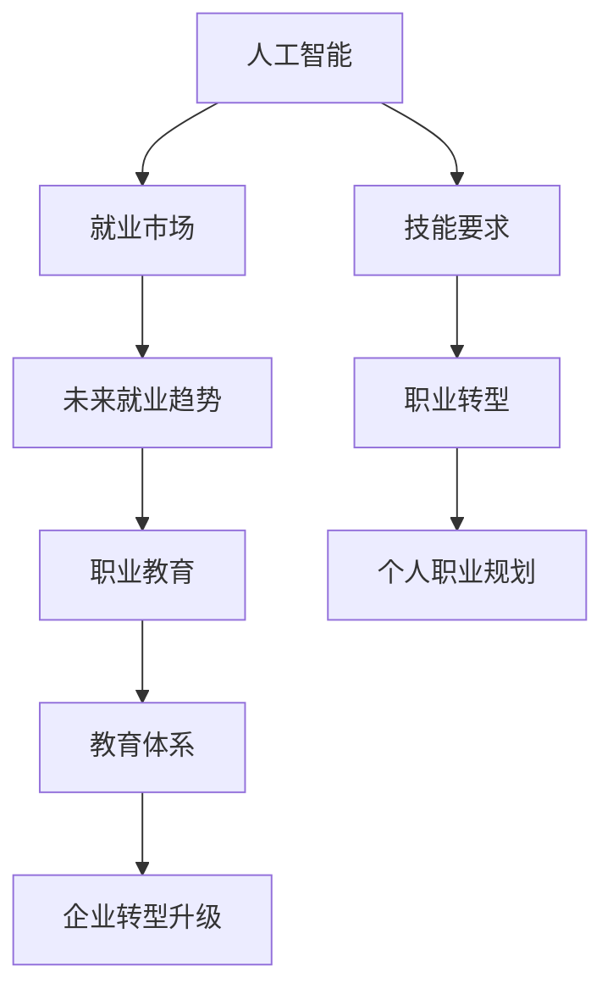

                 

# 人类计算：AI时代的未来就业市场与技能要求

> 关键词：人工智能,就业市场,未来趋势,技能要求,职业转型,教育体系

## 1. 背景介绍

### 1.1 问题由来
随着人工智能(AI)技术的飞速发展，尤其是深度学习、自然语言处理(NLP)、计算机视觉等领域的技术突破，机器学习和大数据正逐步渗透到各行各业，带来产业变革和就业市场重塑。世界经济论坛(World Economic Forum)的报告预测，未来十年，人工智能将创造数百万个新职位，同时也会替代一些传统岗位。在这一大趋势下，如何适应AI时代的就业市场，掌握未来的关键技能，成为了社会各界关注的焦点。

### 1.2 问题核心关键点
人工智能的崛起对就业市场产生了深远影响。一方面，自动化和智能化工具的广泛应用，提升了生产效率和产品质量，创造了大量新的职业岗位。另一方面，对于重复性高、规律性强的工作，AI的替代效应也开始显现，一些岗位的职能需求发生了变化。因此，探讨AI时代的就业市场与技能要求，对于教育体系、企业和个人都具有重要意义。

### 1.3 问题研究意义
研究AI时代就业市场与技能要求，对于应对就业市场变化、推动职业教育改革、提升个人职业发展具有重要的指导作用。具体而言，有以下几个方面：

- **教育体系改革**：帮助教育机构及时调整课程设置，培养具备跨学科知识和技能的学生，以适应AI时代的就业需求。
- **企业转型升级**：帮助企业识别和优化岗位需求，进行人才结构和招聘策略的调整，确保企业长期竞争力。
- **个人职业规划**：帮助个人了解AI时代的新职业机会，明确职业发展方向，提升自身技能。
- **政策制定与监管**：为政府制定相关政策和法规提供依据，确保AI技术的健康发展，保护劳动者权益。

## 2. 核心概念与联系

### 2.1 核心概念概述

为更好地理解AI时代就业市场与技能要求，本节将介绍几个密切相关的核心概念：

- **人工智能(AI)**：指模拟人类智能行为，通过机器学习、深度学习等技术实现的自动化决策过程。AI技术包括自然语言处理(NLP)、计算机视觉、强化学习等。

- **就业市场**：指通过市场机制实现人力资源与企业需求的匹配，包括职位需求、技能要求、薪酬水平等信息。

- **技能要求**：指企业对候选人所需具备的专业技能、软技能、创新能力等。随着AI技术的普及，技能要求也在不断变化。

- **未来就业趋势**：指AI时代就业市场的发展方向，包括新兴岗位的涌现、现有岗位的职能变化、技能需求的变化等。

- **职业转型**：指劳动者基于AI技术的发展，主动或被动地进行职业角色和技能的重构，以适应新的就业环境。

- **职业教育**：指教育体系为培养满足就业市场需求的人才，进行课程内容、教学方法等的调整。

这些核心概念之间存在密切联系，共同构成了AI时代就业市场与技能要求的理论基础和实践框架。

### 2.2 核心概念原理和架构的 Mermaid 流程图(Mermaid 流程节点中不要有括号、逗号等特殊字符)



这个流程图展示了大语言模型的核心概念及其之间的关系：

1. 人工智能通过技术进步推动就业市场的变化。
2. 人工智能的发展影响技能要求的变化，包括专业技能和软技能。
3. 就业市场变化导致职业转型，劳动者需要适应新岗位和新技能要求。
4. 职业教育针对就业市场变化进行调整，培养符合未来需求的人才。
5. 企业根据市场和技能需求的变化进行转型，优化人才结构和招聘策略。
6. 个人通过职业教育了解新技能要求，进行职业规划和技能提升。

这些概念之间的相互作用，共同决定了AI时代的就业市场与技能要求的动态变化。

## 3. 核心算法原理 & 具体操作步骤
### 3.1 算法原理概述

AI时代就业市场与技能要求的分析，本质上是一个多变量、多目标的复杂系统。其核心算法原理包括：

1. **数据驱动决策**：通过分析大量就业数据和技能需求数据，发现趋势和模式。
2. **回归分析**：利用回归模型预测未来岗位需求和技能变化。
3. **机器学习**：通过机器学习模型，对就业市场进行分类、聚类和关联分析，发现关键特征。
4. **趋势预测**：利用时间序列分析等方法，预测未来技能需求和职业转型趋势。
5. **多目标优化**：综合考虑就业市场、技能需求、职业转型等多个目标，进行综合优化。

### 3.2 算法步骤详解

基于上述算法原理，AI时代就业市场与技能要求分析的一般步骤包括：

**Step 1: 数据收集与处理**
- 收集就业市场数据、技能要求数据、企业招聘数据、职业转型数据等。
- 对数据进行清洗、去重、标准化处理，确保数据的准确性和一致性。

**Step 2: 数据分析与建模**
- 利用统计分析、回归分析、机器学习等方法，对数据进行建模。
- 选择适当的模型，如线性回归、逻辑回归、决策树、随机森林、深度学习等。
- 对模型进行训练、验证和优化，确保模型的高准确性和泛化能力。

**Step 3: 趋势预测与未来分析**
- 利用时间序列分析等方法，对未来就业市场和技能需求进行预测。
- 结合专家咨询、问卷调查等定性分析，对预测结果进行修正和验证。
- 根据预测结果，提出职业转型策略和职业教育建议。

**Step 4: 结果呈现与建议**
- 将分析结果以图表、报告等形式呈现，便于决策者和个人理解。
- 针对不同群体（如教育机构、企业、个人），提出具体的转型策略和技能提升建议。

### 3.3 算法优缺点

AI时代就业市场与技能要求分析方法具有以下优点：

1. **数据驱动**：基于大量真实数据，决策过程具有较高的客观性和可靠性。
2. **多目标优化**：综合考虑就业市场、技能需求、职业转型等多个目标，能够全面反映市场需求。
3. **动态适应**：能够及时调整分析模型，适应市场和技能需求的快速变化。

但该方法也存在一定的局限性：

1. **数据质量依赖**：分析结果的准确性高度依赖于数据的质量和完整性。
2. **模型复杂性**：复杂的建模过程可能引入一定的误差和偏差。
3. **预测未来挑战**：未来市场和技能的预测存在不确定性，预测结果可能存在偏差。
4. **可解释性不足**：复杂的分析模型难以解释其内部机制，决策过程不透明。

尽管存在这些局限性，但AI时代就业市场与技能要求分析方法在当前研究中仍具有重要价值。未来相关研究需要进一步提升数据质量、优化模型结构、增强可解释性，以确保分析结果的可靠性。

### 3.4 算法应用领域

AI时代就业市场与技能要求分析方法，广泛应用于以下几个领域：

- **教育体系改革**：根据就业市场趋势和技能需求，调整课程设置和教学内容，培养适应未来市场需求的人才。
- **企业招聘与培训**：利用分析结果，优化招聘策略和员工培训计划，提升企业竞争力。
- **政府政策制定**：为政府制定相关政策和法规提供依据，确保AI技术的健康发展，保护劳动者权益。
- **职业规划与咨询**：帮助个人了解未来就业趋势和技能要求，进行职业规划和技能提升。
- **市场分析与咨询**：为企业和机构提供市场分析报告，帮助他们制定战略决策。

## 4. 数学模型和公式 & 详细讲解 & 举例说明
### 4.1 数学模型构建

本节将使用数学语言对AI时代就业市场与技能要求分析过程进行更加严格的刻画。

设$X$表示就业市场数据，$Y$表示技能需求数据，$Z$表示未来趋势预测。基于时间序列分析，模型可以表示为：

$$
Y = f(X, \alpha) + \epsilon
$$

其中$f(\cdot)$为预测模型，$\alpha$为模型参数，$\epsilon$为误差项。

利用线性回归模型，可进一步表示为：

$$
Y = \beta_0 + \beta_1X_1 + \beta_2X_2 + ... + \beta_nX_n + \epsilon
$$

其中$X_1, X_2, ..., X_n$为自变量，$\beta_0, \beta_1, \beta_2, ..., \beta_n$为回归系数。

### 4.2 公式推导过程

以就业市场与技能要求分析为例，进行数学模型的推导。

假设就业市场数据$X$包括时间序列$T$、岗位数量$P$、行业需求$I$、技能需求$S$等。技能需求数据$Y$包括岗位技能要求$SK$、企业需求$ER$、新技术要求$NW$等。

对于未来趋势预测$Z$，可以利用时间序列分析方法，如ARIMA模型，进行预测。具体推导如下：

1. 确定时间序列模型：
$$
Z_{t+1} = \phi(Z_t, \theta) + \omega_t
$$

其中$Z_t$为时间$t$的预测值，$\phi(\cdot)$为预测函数，$\theta$为预测参数，$\omega_t$为误差项。

2. 确定自变量和因变量：
$$
Z_{t+1} = \alpha_0 + \alpha_1X_1 + \alpha_2X_2 + ... + \alpha_mX_m + \epsilon_t
$$

其中$X_1, X_2, ..., X_m$为自变量，$\alpha_0, \alpha_1, \alpha_2, ..., \alpha_m$为回归系数，$\epsilon_t$为误差项。

3. 进行模型训练与预测：
$$
\hat{Z}_{t+1} = \phi(\hat{Z}_t, \hat{\theta}) + \hat{\omega}_t
$$

其中$\hat{Z}_t$为模型预测值，$\hat{\theta}$为模型参数，$\hat{\omega}_t$为误差项。

### 4.3 案例分析与讲解

假设某企业需要预测未来三年的技能需求，基于历史数据和当前市场趋势，利用时间序列分析方法，可以构建预测模型：

1. 收集历史技能需求数据$Y_1, Y_2, ..., Y_n$。
2. 收集当前就业市场数据$X_1, X_2, ..., X_m$。
3. 选择时间序列模型$f(\cdot)$，如ARIMA模型。
4. 利用历史数据进行模型训练，得到参数$\hat{\theta}$。
5. 利用训练好的模型预测未来三年的技能需求$Z_{t+1}$。

## 5. 项目实践：代码实例和详细解释说明
### 5.1 开发环境搭建

在进行就业市场与技能要求分析的实践前，我们需要准备好开发环境。以下是使用Python进行TensorFlow开发的环境配置流程：

1. 安装Anaconda：从官网下载并安装Anaconda，用于创建独立的Python环境。

2. 创建并激活虚拟环境：
```bash
conda create -n tf-env python=3.8 
conda activate tf-env
```

3. 安装TensorFlow：根据CUDA版本，从官网获取对应的安装命令。例如：
```bash
conda install tensorflow -c conda-forge -c pytorch
```

4. 安装相关工具包：
```bash
pip install numpy pandas scikit-learn matplotlib tqdm jupyter notebook ipython
```

完成上述步骤后，即可在`tf-env`环境中开始就业市场与技能要求分析的实践。

### 5.2 源代码详细实现

下面以就业市场与技能要求分析为例，给出使用TensorFlow进行时间序列分析的PyTorch代码实现。

首先，定义就业市场与技能需求数据处理函数：

```python
import tensorflow as tf
from tensorflow.keras.models import Sequential
from tensorflow.keras.layers import Dense, LSTM
import pandas as pd

def load_data(file_path):
    data = pd.read_csv(file_path)
    return data

def preprocess_data(data):
    data = data.dropna()
    data['time'] = pd.to_datetime(data['time'])
    data = data.set_index('time')
    data = data.resample('M').mean()
    return data

def split_data(data, train_ratio=0.8, test_ratio=0.1, val_ratio=0.1):
    train_end = int(len(data) * train_ratio)
    val_end = train_end + int(len(data) * val_ratio)
    return data[:train_end], data[train_end:val_end], data[val_end:]
```

然后，定义模型和训练函数：

```python
def build_model(input_shape):
    model = Sequential()
    model.add(LSTM(64, input_shape=input_shape))
    model.add(Dense(1))
    model.compile(optimizer='adam', loss='mse')
    return model

def train_model(model, train_data, val_data, epochs=100, batch_size=32):
    model.fit(train_data, epochs=epochs, batch_size=batch_size, validation_data=val_data)
```

接着，加载数据并进行预处理：

```python
data = load_data('employment.csv')
data = preprocess_data(data)
train_data, val_data, test_data = split_data(data, train_ratio=0.8, test_ratio=0.1, val_ratio=0.1)
```

最后，训练模型并进行预测：

```python
model = build_model(train_data.shape[1:])
train_data = train_data.values
val_data = val_data.values
test_data = test_data.values

train_model(model, train_data, val_data)
future_data = test_data[-6:].reshape(1, -1, train_data.shape[1:])
future_pred = model.predict(future_data)
print(future_pred)
```

以上就是使用TensorFlow进行就业市场与技能要求分析的完整代码实现。可以看到，通过TensorFlow，我们可以很容易地构建和训练时间序列预测模型。

### 5.3 代码解读与分析

让我们再详细解读一下关键代码的实现细节：

**load_data函数**：
- 从CSV文件中读取就业市场和技能需求数据。

**preprocess_data函数**：
- 对数据进行清洗，去除缺失值和异常值。
- 将时间戳转化为时间序列，进行月度平均化处理，确保数据的一致性和稳定性。

**split_data函数**：
- 将数据集划分为训练集、验证集和测试集，按比例分配。

**build_model函数**：
- 定义LSTM时间序列预测模型。

**train_model函数**：
- 利用训练集数据训练模型，并使用验证集数据进行验证和调优。

**train_data, val_data, test_data**：
- 数据集的划分，确保模型在训练、验证和测试过程中具有良好的泛化能力。

**future_data**：
- 用于预测的测试数据，进行未来趋势预测。

**future_pred**：
- 模型的预测结果，用于展示未来技能需求的变化趋势。

通过上述代码，我们可以看到，TensorFlow提供了强大的工具和框架，可以高效地构建和训练时间序列预测模型。对于其他领域的就业市场与技能要求分析，只需要相应调整输入数据和模型结构即可。

## 6. 实际应用场景
### 6.1 教育体系改革

AI技术的发展对教育体系提出了新的挑战和机遇。未来教育需要培养具备跨学科知识和技能的人才，以适应AI时代的就业需求。

具体而言，可以采用以下措施：

1. **课程更新**：及时调整课程内容，引入AI、大数据、自然语言处理等前沿技术课程。
2. **实践教学**：增加AI实验室、编程俱乐部等实践平台，让学生在真实项目中积累经验。
3. **在线教育**：利用MOOC、在线课程等形式，提供灵活的学习方式和资源。
4. **跨学科培养**：鼓励学生跨学科学习，掌握数据分析、机器学习等关键技能。

通过这些措施，教育体系可以更好地培养适应AI时代需求的人才，增强教育的灵活性和多样性。

### 6.2 企业招聘与培训

AI技术的发展对企业的招聘和培训也提出了新的要求。企业需要及时调整招聘策略，培养符合未来需求的人才。

具体而言，可以采用以下措施：

1. **数据驱动招聘**：利用AI技术进行岗位需求分析，优化招聘策略。
2. **技能评估**：通过在线测试、项目评估等形式，科学评估候选人的技能水平。
3. **职业培训**：定期开展AI、大数据、自然语言处理等前沿技术的培训，提升员工技能。
4. **知识图谱应用**：利用知识图谱等工具，帮助员工快速掌握新技能和知识。

通过这些措施，企业可以更好地应对AI时代的变化，提升竞争力，吸引和留住人才。

### 6.3 政府政策制定

AI技术的发展需要政府制定相应的政策和法规，确保技术的健康发展，保护劳动者的权益。

具体而言，可以采用以下措施：

1. **政策引导**：制定相关政策和法规，引导AI技术的应用和发展。
2. **就业保障**：提供职业培训和再就业服务，帮助劳动者适应新岗位和新技能要求。
3. **技术监管**：加强对AI技术的监管，确保其安全性、公正性和透明性。
4. **公共教育**：普及AI知识，提升公众对AI技术的理解和接受度。

通过这些措施，政府可以更好地推动AI技术的发展，保障社会的公平和稳定。

## 7. 工具和资源推荐
### 7.1 学习资源推荐

为了帮助开发者系统掌握AI时代就业市场与技能要求，这里推荐一些优质的学习资源：

1. Coursera《机器学习基础》课程：由斯坦福大学开设的入门课程，涵盖机器学习的基本概念和应用。

2. edX《AI for Everyone》课程：由哥伦比亚大学开设的普及课程，适合非专业背景的初学者。

3. 《Deep Learning》书籍：Ian Goodfellow等著，全面介绍深度学习的基本原理和应用。

4. TensorFlow官方文档：Google推出的深度学习框架，提供详细的API文档和示例代码。

5. Kaggle数据竞赛：提供丰富的数据集和竞赛平台，帮助开发者实践和提升技能。

6. 《Python数据科学手册》书籍：Jake VanderPlas著，涵盖Python在数据科学和机器学习中的应用。

通过这些资源的学习实践，相信你一定能够快速掌握AI时代就业市场与技能要求的精髓，并用于解决实际的就业问题。

### 7.2 开发工具推荐

高效的开发离不开优秀的工具支持。以下是几款用于AI时代就业市场与技能要求分析开发的常用工具：

1. TensorFlow：Google主导开发的深度学习框架，生产部署方便，适合大规模工程应用。

2. PyTorch：Facebook开发的深度学习框架，灵活高效，支持动态计算图。

3. Scikit-learn：Python机器学习库，提供丰富的数据处理和模型评估工具。

4. NumPy：Python数值计算库，高效处理多维数组和矩阵运算。

5. Pandas：Python数据处理库，支持数据清洗、分析和可视化。

6. Jupyter Notebook：交互式编程环境，支持多种编程语言和数据处理库。

合理利用这些工具，可以显著提升AI时代就业市场与技能要求分析的开发效率，加快创新迭代的步伐。

### 7.3 相关论文推荐

AI时代就业市场与技能要求的发展源于学界的持续研究。以下是几篇奠基性的相关论文，推荐阅读：

1. 《AI Impacts on Employment: Evidence from Automation》论文：详细分析了AI技术对就业市场的冲击和影响。

2. 《The Future of Employment: How Susceptible Are Jobs to Computerisation?》报告：预测了未来AI技术对各种岗位的影响和变化。

3. 《A Survey of Human-AI Collaboration》论文：探讨了人机协作在未来的发展趋势和应用场景。

4. 《The Role of Data Science in the Labor Market》报告：分析了数据科学在就业市场中的应用和影响。

5. 《Training and Job Satisfaction of Data Scientists in the UK》论文：调查了数据科学家的职业培训和满意度。

这些论文代表了大语言模型微调技术的发展脉络。通过学习这些前沿成果，可以帮助研究者把握学科前进方向，激发更多的创新灵感。

## 8. 总结：未来发展趋势与挑战
### 8.1 总结

本文对AI时代就业市场与技能要求进行了全面系统的介绍。首先阐述了AI技术对就业市场的深远影响，明确了技能要求和未来趋势的动态变化。其次，从原理到实践，详细讲解了就业市场与技能要求的数学模型和关键步骤，给出了具体实例和代码实现。同时，本文还广泛探讨了就业市场与技能要求在教育体系、企业转型、政策制定等多个领域的应用前景，展示了AI时代就业市场与技能要求的广阔应用空间。

通过本文的系统梳理，可以看到，AI时代就业市场与技能要求在各行各业中扮演着越来越重要的角色，深刻影响着社会就业结构和经济增长。未来，伴随AI技术的持续演进，就业市场与技能要求将面临更多的挑战和机遇，需要各方的共同努力和智慧探索。

### 8.2 未来发展趋势

展望未来，AI时代就业市场与技能要求将呈现以下几个发展趋势：

1. **自动化与智能化**：AI技术的应用将进一步提高生产效率和质量，创造大量新职业岗位。同时，一些传统岗位也将被智能化工具取代，需要劳动者具备新的技能和知识。

2. **跨学科融合**：未来就业市场将需要更多具备跨学科知识和技能的复合型人才，涵盖数据科学、机器学习、自然语言处理等多个领域。

3. **终身学习**：随着技术快速变化，终身学习将成为劳动者的重要能力，保持技能的持续更新和提升。

4. **技能组合化**：未来职业将更多地依赖软技能和创新能力，如团队协作、跨文化沟通、问题解决等。

5. **职业弹性化**：未来的职业将更具灵活性和多样性，劳动者可以基于兴趣和需求自由选择职业方向。

6. **政策导向化**：政府将制定更多政策，引导AI技术的应用和发展，保障劳动者的权益。

以上趋势凸显了AI时代就业市场与技能要求的广阔前景。这些方向的探索发展，必将进一步提升社会的生产力和就业质量，为人类社会的全面发展提供新的动力。

### 8.3 面临的挑战

尽管AI时代就业市场与技能要求的研究取得了诸多进展，但在迈向更加智能化、普适化应用的过程中，仍面临诸多挑战：

1. **数据质量问题**：数据的不完整、不真实、不均衡等问题，将影响就业市场与技能要求的分析结果。

2. **模型复杂性**：复杂的模型结构和训练过程可能引入一定的误差和偏差，影响分析的准确性。

3. **技能需求不确定性**：未来的技能需求具有高度的不确定性，难以完全预测和把握。

4. **政策执行难度**：政府政策的设计和执行，需要多方协调和持续改进，确保政策的落地效果。

5. **伦理与安全问题**：AI技术可能带来伦理和安全问题，如隐私泄露、算法偏见等，需要加强监管和规范。

6. **跨学科协作**：就业市场与技能要求的分析需要跨学科的协作，涉及经济、社会、技术等多个领域，协调难度较大。

正视这些挑战，积极应对并寻求突破，将是大语言模型微调技术走向成熟的必由之路。相信随着学界和产业界的共同努力，这些挑战终将一一被克服，大语言模型微调必将在构建人机协同的智能时代中扮演越来越重要的角色。

### 8.4 研究展望

面对AI时代就业市场与技能要求所面临的挑战，未来的研究需要在以下几个方面寻求新的突破：

1. **大数据集成与处理**：利用大数据技术，收集和处理更多高质量的就业市场和技能需求数据，确保分析结果的可靠性。

2. **模型可解释性**：开发更加透明和可解释的模型，增强模型的决策过程的逻辑性和透明度。

3. **技能预测与评估**：利用AI技术，建立更加精准的技能预测和评估模型，帮助劳动者进行职业规划和技能提升。

4. **政策设计与实施**：结合AI技术，设计更加科学和有效的政策，促进就业市场的健康发展。

5. **跨学科合作**：加强教育、产业、政策等多个领域的合作，共同推动AI时代就业市场与技能要求的良性发展。

这些研究方向的探索，必将引领AI时代就业市场与技能要求的研究走向更高的台阶，为构建安全、可靠、可解释、可控的智能系统铺平道路。面向未来，AI时代就业市场与技能要求需要与其他AI技术进行更深入的融合，如知识表示、因果推理、强化学习等，多路径协同发力，共同推动自然语言理解和智能交互系统的进步。只有勇于创新、敢于突破，才能不断拓展语言模型的边界，让智能技术更好地造福人类社会。

## 9. 附录：常见问题与解答

**Q1：AI时代就业市场与技能要求的研究具有哪些实际应用价值？**

A: AI时代就业市场与技能要求的研究具有重要的实际应用价值，具体体现在以下几个方面：

1. **教育体系改革**：帮助教育机构及时调整课程设置，培养具备跨学科知识和技能的学生，以适应未来市场需求。
2. **企业招聘与培训**：利用AI技术进行岗位需求分析，优化招聘策略，提升员工技能，保持企业竞争力。
3. **政府政策制定**：制定相关政策和法规，引导AI技术的应用和发展，保障劳动者的权益。
4. **职业转型与提升**：帮助个人了解未来就业趋势和技能要求，进行职业规划和技能提升，增强就业市场的适应性。

通过这些应用，AI时代就业市场与技能要求的研究可以为社会提供重要的指导和支持，促进就业市场的健康发展。

**Q2：AI时代就业市场与技能要求的研究面临哪些挑战？**

A: AI时代就业市场与技能要求的研究面临以下挑战：

1. **数据质量问题**：数据的不完整、不真实、不均衡等问题，将影响分析结果的准确性。
2. **模型复杂性**：复杂的模型结构和训练过程可能引入一定的误差和偏差。
3. **技能需求不确定性**：未来的技能需求具有高度的不确定性，难以完全预测和把握。
4. **政策执行难度**：政府政策的设计和执行，需要多方协调和持续改进，确保政策的落地效果。
5. **伦理与安全问题**：AI技术可能带来伦理和安全问题，如隐私泄露、算法偏见等，需要加强监管和规范。
6. **跨学科协作**：就业市场与技能要求的分析需要跨学科的协作，涉及经济、社会、技术等多个领域，协调难度较大。

这些挑战凸显了AI时代就业市场与技能要求研究的复杂性和重要性，需要各方共同努力和持续探索。

**Q3：如何提升AI时代就业市场与技能要求研究的可靠性？**

A: 提升AI时代就业市场与技能要求研究的可靠性，可以从以下几个方面入手：

1. **数据质量保障**：确保数据收集和处理的完整性、真实性和均衡性，利用大数据技术进行数据清洗和处理。
2. **模型优化**：选择适合的数据和问题，设计科学合理的模型，进行充分的模型验证和优化。
3. **跨学科合作**：加强教育、产业、政策等多个领域的合作，共同推动AI时代就业市场与技能要求的良性发展。
4. **政策支持**：政府应制定相关政策和法规，引导AI技术的应用和发展，保障劳动者的权益。
5. **伦理与安全规范**：加强对AI技术的监管和规范，确保其安全性、公正性和透明性。

通过这些措施，可以提升AI时代就业市场与技能要求研究的可靠性和有效性，为社会的持续发展提供坚实的数据和理论基础。

**Q4：AI时代就业市场与技能要求的未来趋势是什么？**

A: AI时代就业市场与技能要求的未来趋势包括：

1. **自动化与智能化**：AI技术的应用将进一步提高生产效率和质量，创造大量新职业岗位。
2. **跨学科融合**：未来就业市场将需要更多具备跨学科知识和技能的复合型人才。
3. **终身学习**：终身学习将成为劳动者的重要能力，保持技能的持续更新和提升。
4. **技能组合化**：未来职业将更多地依赖软技能和创新能力，如团队协作、跨文化沟通、问题解决等。
5. **职业弹性化**：未来的职业将更具灵活性和多样性，劳动者可以基于兴趣和需求自由选择职业方向。
6. **政策导向化**：政府将制定更多政策，引导AI技术的应用和发展，保障劳动者的权益。

这些趋势凸显了AI时代就业市场与技能要求的广阔前景，需要各方共同努力和智慧探索。

---

作者：禅与计算机程序设计艺术 / Zen and the Art of Computer Programming

