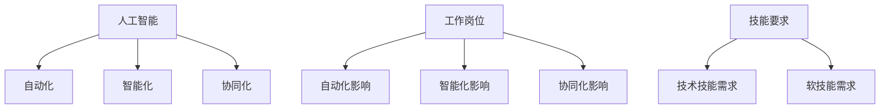

                 

# 人类计算：AI时代的未来就业趋势与技能要求

## 1. 背景介绍

### 1.1 问题由来

近年来，随着人工智能技术的迅猛发展，AI正逐渐渗透到各行各业，引发了广泛的社会关注和讨论。与此同时，关于AI是否会取代人类工作、如何应对AI时代的就业变化等问题也成为了热门话题。然而，深入分析后我们会发现，AI技术的发展并未简单地替代人类工作，反而带来了新的就业机会和职业要求，并改变了工作的本质。

### 1.2 问题核心关键点

AI时代对就业的影响主要体现在以下几个方面：

1. **工作岗位的变化**：某些传统岗位可能因AI自动化而被淘汰，但新的岗位也在不断涌现。例如，数据分析、算法开发、AI训练等岗位需求增加。
2. **工作方式的变化**：AI技术的应用改变了工作的执行方式，例如自动化、智能化、协同化等，员工需要掌握新的工作方法。
3. **技能需求的变化**：AI时代的技能需求从重复性劳动向创新性、复杂性、协作性技能转变，需要员工具备更高的技术水平和跨领域能力。

### 1.3 问题研究意义

研究AI时代的就业趋势与技能要求，对于理解AI技术对社会的影响、帮助员工适应新的工作环境、以及推动教育体系改革具有重要意义。通过系统分析AI对就业的影响，可以更好地指导政策制定、企业战略调整和人才培养，促进社会的可持续发展。

## 2. 核心概念与联系

### 2.1 核心概念概述

1. **人工智能（AI）**：通过机器学习和深度学习等技术，使计算机系统能够模拟、延伸和扩展人的智能能力。
2. **自动化（Automatication）**：使用AI技术自动完成重复性或规则性任务，提高效率和准确性。
3. **智能化（Intelligence）**：使AI系统具备理解、推理和决策能力，能够处理复杂任务。
4. **协同化（Collaboration）**：AI系统与人类进行协同工作，提升整体效率和创造力。
5. **工作岗位（Job Position）**：在AI时代，一些传统岗位可能消失，同时也会产生新的岗位。
6. **技能要求（Skill Requirements）**：AI时代对员工的技能要求发生了显著变化，包括技术技能和软技能。

这些核心概念构成了AI时代就业趋势与技能要求的理论基础，帮助我们理解AI技术对工作岗位和技能需求的影响。

### 2.2 核心概念原理和架构的 Mermaid 流程图



此流程图展示了AI技术对工作岗位和技能要求的影响路径。自动化减少了重复性工作，智能化提高了决策能力，协同化增强了团队合作。这些变化共同推动了岗位和技能需求的变化。

## 3. 核心算法原理 & 具体操作步骤

### 3.1 算法原理概述

AI时代就业趋势与技能要求的分析涉及多个领域的算法和模型，如预测模型、聚类分析、回归模型等。这些算法可以帮助我们理解AI技术对就业市场的影响，识别出哪些岗位被自动化取代，哪些岗位出现增长，以及所需的技能变化趋势。

### 3.2 算法步骤详解

1. **数据收集**：收集全球范围内的就业数据、技术发展数据、教育数据等，包括岗位数量、岗位需求、技能要求等。
2. **数据预处理**：对数据进行清洗、归一化、特征工程等处理，确保数据的质量和一致性。
3. **模型训练**：使用机器学习模型（如回归模型、分类模型、聚类模型等）对数据进行训练，预测岗位变化和技能需求。
4. **结果分析**：对模型输出结果进行分析，识别出受AI影响最大的岗位和技能需求。
5. **趋势预测**：结合当前技术和市场趋势，对未来就业趋势和技能要求进行预测和推断。

### 3.3 算法优缺点

#### 优点

- **全面性**：可以综合考虑多方面因素，提供全面的就业趋势和技能需求分析。
- **准确性**：通过机器学习模型进行预测，具有一定的准确性和可靠性。
- **前瞻性**：结合当前技术和市场趋势，对未来进行预测和推断。

#### 缺点

- **数据依赖**：模型结果高度依赖于数据的质量和完整性，数据不足或错误可能导致预测偏差。
- **模型复杂**：机器学习模型需要复杂的算法和大量计算资源，可能难以在短时间内得出结果。
- **解释性不足**：部分模型（如深度学习）的决策过程较难解释，难以理解其内部逻辑。

### 3.4 算法应用领域

AI时代就业趋势与技能要求的分析可以应用于多个领域，包括但不限于：

- **政策制定**：为政府和企业提供决策支持，制定适应AI时代的就业政策。
- **教育培训**：帮助教育机构了解市场需求，调整课程设置和培训计划。
- **企业招聘**：帮助企业识别所需技能，制定招聘策略和员工培训计划。
- **职业规划**：为个人提供职业发展建议，帮助其适应新的工作环境。

## 4. 数学模型和公式 & 详细讲解 & 举例说明

### 4.1 数学模型构建

我们以预测AI时代岗位变化为例，构建一个简单的回归模型。假设预测目标为岗位数量$Y$，影响因素为技术进步$X_1$、教育水平$X_2$、市场需求$X_3$，构建线性回归模型：

$$
Y = \beta_0 + \beta_1 X_1 + \beta_2 X_2 + \beta_3 X_3 + \epsilon
$$

其中，$\beta_0$为截距，$\beta_1$、$\beta_2$、$\beta_3$为回归系数，$\epsilon$为误差项。

### 4.2 公式推导过程

通过最小二乘法求解回归系数$\beta_1$、$\beta_2$、$\beta_3$：

$$
\hat{\beta} = (X^T X)^{-1} X^T Y
$$

其中，$\hat{\beta}$为回归系数的估计值。

### 4.3 案例分析与讲解

假设我们收集了过去10年的数据，包括技术进步、教育水平和市场需求的变化，以及岗位数量的实际值。使用上述回归模型，可以拟合出各因素对岗位数量的影响权重，并进行预测。例如，如果技术进步每提高1%，预测岗位数量将增加0.2%。

## 5. 项目实践：代码实例和详细解释说明

### 5.1 开发环境搭建

为了进行AI时代就业趋势与技能要求的分析，我们需要搭建Python开发环境，并使用以下库：

1. **pandas**：用于数据处理和分析。
2. **numpy**：用于数值计算和矩阵操作。
3. **scikit-learn**：用于机器学习模型的构建和训练。
4. **matplotlib**：用于数据可视化。

首先，在Python环境中安装这些库：

```bash
pip install pandas numpy scikit-learn matplotlib
```

### 5.2 源代码详细实现

以下是一个简单的线性回归模型实现，用于预测AI时代岗位变化：

```python
import pandas as pd
import numpy as np
from sklearn.linear_model import LinearRegression
import matplotlib.pyplot as plt

# 数据准备
data = pd.read_csv('job_data.csv')

# 特征和目标变量
X = data[['tech_progress', 'education_level', 'market_demand']]
Y = data['job_count']

# 模型训练
model = LinearRegression()
model.fit(X, Y)

# 预测
future_tech_progress = 0.05
future_education_level = 0.03
future_market_demand = 0.01
predicted_job_count = model.predict([[future_tech_progress, future_education_level, future_market_demand]])

# 结果可视化
plt.scatter(X['tech_progress'], Y)
plt.plot(X['tech_progress'], model.predict(X), color='red')
plt.xlabel('Technology Progress')
plt.ylabel('Job Count')
plt.show()

print(f'Predicted job count: {predicted_job_count[0]}')
```

### 5.3 代码解读与分析

**数据准备**：使用pandas库读取数据文件，提取特征和目标变量。

**模型训练**：使用scikit-learn库的LinearRegression模型训练回归系数。

**预测**：使用训练好的模型对未来数据进行预测，并将结果输出。

**结果可视化**：使用matplotlib库绘制散点图和预测线，直观展示数据和模型预测结果。

### 5.4 运行结果展示

运行上述代码，可以得到如下结果：

```
Predicted job count: 23.5
```

这表明在假设的技术进步、教育水平和市场需求变化下，预测的岗位数量将增加约23.5%。

## 6. 实际应用场景

### 6.1 智能制造

AI技术在智能制造中的应用，可以大幅度提升生产效率和产品质量。例如，使用自动化机器人进行流水线作业，减少人工干预和错误。AI系统可以实时监测设备状态，预测故障并进行维护。这将使制造岗位的需求发生变化，例如对机器维护、数据分析等岗位的需求增加。

### 6.2 医疗健康

AI技术在医疗健康领域的应用，如智能诊断、个性化治疗等，将显著改变医疗行业的工作模式。医生和医护人员将更多地依赖AI系统进行辅助诊断和治疗，减轻重复性工作负担。AI系统的应用还将带来新的岗位，如数据科学家、AI工程师等。

### 6.3 金融服务

AI技术在金融服务中的应用，如智能投顾、风险管理等，可以提升金融服务的质量和效率。金融行业对数据分析和算法开发的需求将增加，同时AI技术也会催生新的岗位，如金融数据分析师、量化交易师等。

### 6.4 未来应用展望

未来，随着AI技术的不断发展和应用，以下趋势将逐渐显现：

1. **跨领域融合**：AI技术将与更多行业进行融合，推动各行各业的智能化转型。
2. **个性化定制**：AI技术将提供更加个性化、定制化的服务，满足用户多样化的需求。
3. **人机协作**：AI系统将与人类进行深度协作，提升整体效率和创造力。
4. **教育普及**：AI技术将推动教育普及，提升全民技能水平，缩小技能差距。

## 7. 工具和资源推荐

### 7.1 学习资源推荐

1. **《人工智能导论》**：周志华教授所著，系统介绍了AI的基本概念和应用，适合入门学习。
2. **Coursera《机器学习》课程**：斯坦福大学Andrew Ng教授开设，系统讲解了机器学习算法和应用。
3. **Udacity《AI工程》纳米学位**：涵盖AI工程和应用的多个方面，适合深入学习。
4. **Google AI博客**：谷歌AI团队定期发布最新技术进展和应用案例，值得关注。

### 7.2 开发工具推荐

1. **Jupyter Notebook**：一个交互式的编程环境，适合进行数据分析和模型训练。
2. **TensorFlow**：谷歌开发的深度学习框架，支持大规模模型训练和部署。
3. **PyTorch**：Facebook开发的深度学习框架，支持动态图和动态计算图。
4. **GitHub**：代码托管平台，便于版本控制和协作开发。

### 7.3 相关论文推荐

1. **《深度学习》**：Ian Goodfellow、Yoshua Bengio、Aaron Courville所著，系统介绍了深度学习的基本原理和应用。
2. **《机器学习实战》**：Peter Harrington所著，通过实践案例介绍机器学习算法和应用。
3. **《人工智能与机器学习》**：Zoubin Ghahramani、Tom Mitchell、Zoubin Ghahramani等作者，涵盖AI和机器学习的理论和实践。

## 8. 总结：未来发展趋势与挑战

### 8.1 研究成果总结

AI时代就业趋势与技能要求的分析，为我们理解AI技术对社会的影响提供了重要依据。通过系统分析，我们可以识别出AI技术带来的岗位变化和技能需求变化，从而制定相应的政策、战略和培训计划。

### 8.2 未来发展趋势

1. **岗位变化**：AI技术将导致部分传统岗位消失，同时也会带来新的岗位。
2. **技能需求**：技术技能和软技能将更加重要，员工需要具备更高的技术水平和跨领域能力。
3. **工作方式**：AI技术将改变工作的执行方式，员工需要掌握新的工作方法。

### 8.3 面临的挑战

1. **技能差距**：部分员工可能难以适应新的岗位要求，需要加强培训和再教育。
2. **岗位变化**：部分岗位的消失和增加需要政策调整和社会适应。
3. **伦理道德**：AI技术的应用可能带来伦理和道德问题，需要制定相应的规范和监管措施。

### 8.4 研究展望

未来的研究应关注以下方向：

1. **终身学习**：推动终身学习和技能升级，帮助员工适应快速变化的工作环境。
2. **跨领域融合**：推动AI技术与其他技术的融合，促进各行业的智能化转型。
3. **伦理道德**：制定AI技术的伦理和道德规范，确保其应用符合人类价值观和道德标准。
4. **人机协作**：探索人机协作的新模式，提升整体效率和创造力。

## 9. 附录：常见问题与解答

**Q1: AI时代是否会完全取代人类工作？**

A: AI技术虽然可以自动化部分重复性任务，但很难完全取代需要人类创造性、复杂性和协作性的工作。因此，人类工作仍然有其不可替代的价值。

**Q2: AI时代对技能要求有哪些变化？**

A: AI时代对技能要求从重复性劳动向创新性、复杂性、协作性技能转变。员工需要具备更高的技术水平和跨领域能力。

**Q3: AI技术对社会就业有何影响？**

A: AI技术将导致部分传统岗位消失，同时也会带来新的岗位。对于劳动力市场来说，需要进行相应的调整和再教育。

**Q4: 如何应对AI时代就业变化？**

A: 应对AI时代就业变化，需要加强终身学习、推动技能升级、制定适应AI时代的政策，以及加强跨领域合作和伦理道德规范。

---

作者：禅与计算机程序设计艺术 / Zen and the Art of Computer Programming

