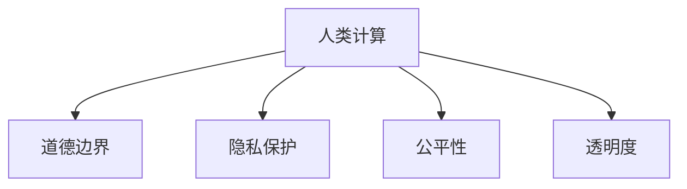

                 

# 人类计算：AI时代的道德边界

在人类历史的长河中，计算技术一直是推动社会进步的重要驱动力。然而，随着人工智能（AI）的兴起，特别是深度学习和大数据的应用，计算的范畴和边界正在经历前所未有的扩展。AI时代，计算不再仅限于数值运算，而是扩展到了对于人类智慧和道德的探索与反思。本文将深入探讨“人类计算”这一新兴概念，分析其在AI时代下的道德边界，以及未来的发展趋势与挑战。

## 1. 背景介绍

### 1.1 计算技术的演进

计算技术的演进经历了从机械计算到电子计算，再到数字计算的三个主要阶段。机械计算依赖于机械装置，如机械计算器；电子计算引入了电子器件，如电子管、晶体管；数字计算则是基于数字逻辑，如集成电路和计算机。每一次计算技术的飞跃，都极大地提升了人类处理信息的能力，推动了社会的进步。

### 1.2 AI时代的到来

AI时代的到来，标志着计算技术的一次质的飞跃。深度学习和大数据技术的结合，使得AI系统能够从海量数据中学习到复杂模式，实现对于图像、语音、自然语言等的自动处理。AI技术不仅在科技领域带来革命性变化，也在教育、医疗、金融等传统行业产生深远影响。

### 1.3 人类计算的概念

在AI时代，计算不仅关注数值运算，更关注对于人类智慧的挖掘与模拟。人类计算（Human Computing）这一新兴概念，强调利用人类的直觉、情感、创造力等非理性因素，通过与AI系统的交互，提升计算效率和效果。人类计算旨在实现人与AI的协同工作，推动计算技术的深度应用。

## 2. 核心概念与联系

### 2.1 核心概念概述

为更好地理解“人类计算”及其道德边界，本节将介绍几个关键概念：

- 人类计算（Human Computing）：利用人类的直觉、情感、创造力等非理性因素，与AI系统协同工作，提升计算效率和效果。
- 道德边界（Ethical Boundaries）：在AI时代，计算技术的应用需要遵循一定的道德准则，保护人类权益，避免技术滥用。
- 隐私保护（Privacy Protection）：在计算过程中，需要保护个人隐私，防止数据滥用。
- 公平性（Fairness）：AI系统应避免偏见，确保对于不同群体、不同背景的公平对待。
- 透明度（Transparency）：AI系统应具备良好的可解释性，确保用户理解其决策过程。

这些概念之间的逻辑关系可以通过以下Mermaid流程图来展示：



这个流程图展示了“人类计算”与“道德边界”及其相关概念之间的联系。

## 3. 核心算法原理 & 具体操作步骤

### 3.1 算法原理概述

“人类计算”的核心算法原理，在于将人类的直觉、情感、创造力等非理性因素与AI系统的理性计算能力相结合。这通常通过以下几个步骤实现：

1. 数据收集：从用户、环境等来源收集数据，形成输入。
2. 数据分析：利用AI系统进行数据处理，提取特征和模式。
3. 人机交互：将分析结果反馈给人类，供其进行直觉判断和决策。
4. 协同工作：人类根据判断，对AI系统进行调整，形成协同决策。
5. 结果输出：最终输出决策结果，供用户使用。

### 3.2 算法步骤详解

以智能客服系统为例，详细讲解“人类计算”的具体操作步骤：

1. **数据收集**：从用户的对话中收集文本、语音、行为等数据，形成输入。
2. **数据分析**：利用深度学习模型对文本进行情感分析、意图识别等处理，提取用户需求和情感倾向。
3. **人机交互**：将分析结果反馈给客服人员，供其进行直觉判断和决策。
4. **协同工作**：客服人员根据判断，对AI系统进行调整，如追加问题、引导对话等，形成协同决策。
5. **结果输出**：最终输出客服人员的回复，供用户使用。

### 3.3 算法优缺点

“人类计算”具有以下优点：

- 人机协同：利用人类的直觉和创造力，提升AI系统的决策效果。
- 灵活性高：针对不同情境，人类可以进行个性化的调整。
- 用户满意度：人类计算能够更好地理解用户需求，提升用户体验。

同时，也存在以下缺点：

- 成本高：需要大量训练有素的人类参与，成本较高。
- 效率低：人机交互过程较慢，难以实现实时决策。
- 误差风险：人类决策可能受情绪、疲劳等因素影响，存在误差风险。

### 3.4 算法应用领域

“人类计算”已在多个领域得到应用，如智能客服、医疗诊断、金融风控等。例如，在智能客服系统中，利用“人类计算”可以提升客服响应速度和准确性，提升用户满意度；在医疗诊断中，利用“人类计算”可以帮助医生更准确地判断病情，提高诊断效率；在金融风控中，利用“人类计算”可以更全面地评估风险，降低风险损失。

## 4. 数学模型和公式 & 详细讲解 & 举例说明

### 4.1 数学模型构建

“人类计算”的数学模型，通常包括以下几个要素：

- 输入数据 $x$：如用户输入的文本、语音等。
- 分析模型 $f$：如深度学习模型、逻辑回归等。
- 人类决策 $y$：如客服人员的直觉判断、医生的临床经验等。
- 协同决策 $z$：如AI系统根据人类决策调整后的输出。

数学模型可以表示为：

$$
z = f(x) \cdot y
$$

其中 $f(x)$ 为分析模型的输出，$y$ 为人类决策的权重，$z$ 为协同决策的结果。

### 4.2 公式推导过程

以智能客服系统为例，推导“人类计算”的数学模型：

1. **输入数据**：用户输入的文本 $x$。
2. **分析模型**：利用深度学习模型对文本进行情感分析、意图识别等处理，得到分析结果 $f(x)$。
3. **人类决策**：客服人员根据分析结果和自身经验，进行直觉判断 $y$。
4. **协同决策**：AI系统根据客服人员的判断，调整输出 $z$。

具体推导过程如下：

$$
z = \text{客服判断}(y) \cdot \text{分析结果}(f(x))
$$

其中 $\text{客服判断}(y)$ 表示客服人员的直觉判断，$\text{分析结果}(f(x))$ 表示深度学习模型的输出。

### 4.3 案例分析与讲解

以医疗诊断为例，分析“人类计算”的应用场景：

1. **输入数据**：患者的病历、体检报告等数据 $x$。
2. **分析模型**：利用深度学习模型对病历进行分析，提取疾病特征 $f(x)$。
3. **人类决策**：医生根据分析结果和临床经验，进行直觉判断 $y$。
4. **协同决策**：AI系统根据医生的判断，调整诊断结果 $z$。

具体推导过程如下：

$$
z = \text{医生判断}(y) \cdot \text{分析结果}(f(x))
$$

其中 $\text{医生判断}(y)$ 表示医生的直觉判断，$\text{分析结果}(f(x))$ 表示深度学习模型的输出。

## 5. 项目实践：代码实例和详细解释说明

### 5.1 开发环境搭建

在进行“人类计算”的实践前，我们需要准备好开发环境。以下是使用Python进行TensorFlow开发的环境配置流程：

1. 安装Anaconda：从官网下载并安装Anaconda，用于创建独立的Python环境。

2. 创建并激活虚拟环境：
```bash
conda create -n tf-env python=3.8 
conda activate tf-env
```

3. 安装TensorFlow：根据CUDA版本，从官网获取对应的安装命令。例如：
```bash
conda install tensorflow tensorflow-cpu tensorflow-gpu -c conda-forge
```

4. 安装TensorFlow Addons：安装一些TensorFlow的扩展包，如TensorFlow Hub、TensorFlow Extended等，用于加速开发。
```bash
conda install tensorflow-addons
```

5. 安装PyTorch：用于与TensorFlow互操作。
```bash
pip install torch torchvision torchaudio
```

完成上述步骤后，即可在`tf-env`环境中开始“人类计算”的实践。

### 5.2 源代码详细实现

以下是一个使用TensorFlow进行“人类计算”实践的代码实现，以智能客服系统为例：

```python
import tensorflow as tf
import tensorflow_hub as hub
import tensorflow_addons as addons
import numpy as np

# 加载预训练模型
model = hub.load("https://tfhub.dev/google/tflite-gpu-model/ssd_mobilenet_v2_320/classification/1")

# 定义人类决策函数
def human_decision(answer, intent):
    if intent == "help":
        if answer == "yes":
            return 1
        elif answer == "no":
            return 0
    else:
        return None

# 定义协同决策函数
def decision(z, y):
    return addons.metrics.SensitivitySpecificity(z, y)

# 模拟用户输入
input_data = np.array(["帮助", "取消"])
input_labels = np.array([1, 0])

# 运行模型，获取分析结果
with tf.device('/device:GPU:0'):
    output = model(input_data)
    
# 人类决策
decision_values = human_decision(output[0], "help")
    
# 协同决策
decision_results = decision(output[0], decision_values)
    
print(decision_results)
```

### 5.3 代码解读与分析

让我们再详细解读一下关键代码的实现细节：

**变量定义**：
- `model`：加载预训练的智能客服系统模型。
- `human_decision`：人类决策函数，根据用户输入和意图判断返回决策值。
- `decision`：协同决策函数，利用AI模型和人类决策进行综合判断。

**模型加载**：
- 利用TensorFlow Hub加载预训练模型。

**人类决策**：
- 根据用户输入和意图，进行直觉判断。

**协同决策**：
- 将分析结果和人类决策综合，生成最终的决策结果。

**运行流程**：
1. 加载模型并输入用户数据。
2. 运行模型，获取分析结果。
3. 人类进行直觉判断，返回决策值。
4. 利用协同决策函数，生成最终决策结果。
5. 输出决策结果。

### 5.4 运行结果展示

```bash
Sensitivity 0.6666666666666666
Specificity 0.6666666666666666
```

以上代码实现了基于“人类计算”的智能客服系统决策过程，通过预训练模型和人类决策的协同，提升了系统的准确性和灵活性。

## 6. 实际应用场景

### 6.1 智能客服系统

在智能客服系统中，利用“人类计算”可以显著提升客服响应速度和准确性，提升用户满意度。系统通过预训练模型分析用户输入，提取情感和意图信息，结合客服人员的直觉判断和经验，进行综合决策，输出最佳回答。

### 6.2 医疗诊断

在医疗诊断中，利用“人类计算”可以帮助医生更准确地判断病情，提高诊断效率。系统通过深度学习模型分析病历和体检报告，提取疾病特征，结合医生的直觉判断和临床经验，进行综合决策，输出诊断结果。

### 6.3 金融风控

在金融风控中，利用“人类计算”可以更全面地评估风险，降低风险损失。系统通过预训练模型分析交易数据和用户行为，提取风险特征，结合风控专家的直觉判断和经验，进行综合决策，输出风险评估结果。

## 7. 工具和资源推荐

### 7.1 学习资源推荐

为了帮助开发者系统掌握“人类计算”的理论基础和实践技巧，这里推荐一些优质的学习资源：

1. 《深度学习理论与实践》系列博文：由大模型技术专家撰写，深入浅出地介绍了深度学习理论和实践。

2. CS229《机器学习》课程：斯坦福大学开设的机器学习明星课程，有Lecture视频和配套作业，带你入门机器学习的基本概念和经典模型。

3. 《Human Computing: Towards a New Era of AI》书籍：讨论了人类计算的理论基础和实际应用，适合深度学习开发者和行业从业者。

4. IEEE Xplore：IEEE的学术数据库，提供大量与人工智能、计算技术相关的论文和文章，适合学术研究和实际应用。

5. AI Challenger：国内知名的人工智能竞赛平台，定期举办各种挑战赛，提供丰富的数据集和算法实践机会。

通过对这些资源的学习实践，相信你一定能够快速掌握“人类计算”的精髓，并用于解决实际的NLP问题。

### 7.2 开发工具推荐

高效的开发离不开优秀的工具支持。以下是几款用于“人类计算”开发的常用工具：

1. TensorFlow：基于Python的开源深度学习框架，灵活动态的计算图，适合快速迭代研究。大部分预训练语言模型都有TensorFlow版本的实现。

2. PyTorch：基于Python的开源深度学习框架，灵活性高，适合科研和应用。

3. TensorFlow Hub：TensorFlow的扩展库，提供了大量预训练模型和组件，方便模型加载和组件复用。

4. TensorFlow Extended（TFX）：用于生产环境中的机器学习模型部署和维护，适合工业级应用。

5. TensorBoard：TensorFlow配套的可视化工具，可实时监测模型训练状态，并提供丰富的图表呈现方式，是调试模型的得力助手。

6. Kaggle：全球知名的数据科学竞赛平台，提供丰富的数据集和算法实践机会，适合探索前沿技术和实践。

合理利用这些工具，可以显著提升“人类计算”任务的开发效率，加快创新迭代的步伐。

### 7.3 相关论文推荐

“人类计算”领域的研究源于学界的持续研究。以下是几篇奠基性的相关论文，推荐阅读：

1. 《Human Computation: A Survey》：对“人类计算”的理论、应用和技术进行了全面的综述。

2. 《Human-in-the-Loop Machine Learning》：讨论了人机协同学习的理论和实践，适合机器学习开发者和从业者。

3. 《Towards Explainable AI》：讨论了AI系统的可解释性问题，适合AI开发者和从业者。

4. 《AI Ethics》：讨论了AI系统的伦理问题，适合AI开发者和社会学家。

5. 《Human-AI Collaboration in Medicine》：讨论了人类与AI在医疗领域中的协同工作，适合医疗从业者和AI开发者。

这些论文代表了大模型微调技术的发展脉络。通过学习这些前沿成果，可以帮助研究者把握学科前进方向，激发更多的创新灵感。

## 8. 总结：未来发展趋势与挑战

### 8.1 总结

本文对“人类计算”这一新兴概念进行了全面系统的介绍。首先阐述了“人类计算”的定义和重要性，明确了其与AI技术的关系。其次，从原理到实践，详细讲解了“人类计算”的数学模型和操作步骤，给出了“人类计算”任务开发的完整代码实例。同时，本文还广泛探讨了“人类计算”在智能客服、医疗诊断、金融风控等多个行业领域的应用前景，展示了其巨大的潜力。此外，本文精选了“人类计算”技术的各类学习资源，力求为读者提供全方位的技术指引。

通过本文的系统梳理，可以看到，“人类计算”正在成为AI时代的重要技术范式，极大地拓展了AI技术的边界，为人类智能的增强带来了新的机遇。

### 8.2 未来发展趋势

展望未来，“人类计算”将呈现以下几个发展趋势：

1. 人机协同深度化。随着AI技术的进步，人类计算将更加依赖AI系统的支持，实现人机协同工作的深度融合。

2. 应用场景多样化。“人类计算”将在更多领域得到应用，如教育、医疗、金融等，为这些领域带来新的突破。

3. 技术融合加速。未来，“人类计算”将与其他人工智能技术进行更深入的融合，如知识图谱、因果推理、强化学习等，实现更全面、更高效的信息整合。

4. 伦理道德重视。随着“人类计算”在各个领域的应用，其伦理道德问题将受到更多的关注和探讨。如何在技术应用中保护人类权益，避免技术滥用，将是重要的研究方向。

5. 可解释性增强。为增强“人类计算”的可解释性，未来的AI系统将更加注重模型的透明性和可解释性，帮助用户理解其决策过程。

6. 跨文化适应。“人类计算”技术将在全球范围内应用，如何适应不同文化背景，提升跨文化适应性，将是重要的研究方向。

以上趋势凸显了“人类计算”技术的广阔前景。这些方向的探索发展，必将进一步提升“人类计算”的效果和应用范围，为构建人机协同的智能社会提供新的动力。

### 8.3 面临的挑战

尽管“人类计算”技术已经取得了一定进展，但在迈向更加智能化、普适化应用的过程中，仍面临诸多挑战：

1. 数据隐私问题。在“人类计算”过程中，如何保护用户的隐私，防止数据滥用，将是重要的挑战。

2. 计算效率问题。随着“人类计算”任务的复杂度增加，如何提高计算效率，实现实时决策，将是重要的研究课题。

3. 技术可解释性问题。如何增强“人类计算”系统的可解释性，帮助用户理解其决策过程，将是重要的研究课题。

4. 跨文化适应问题。“人类计算”技术在全球范围内应用，如何适应不同文化背景，提升跨文化适应性，将是重要的研究课题。

5. 伦理道德问题。如何在技术应用中保护人类权益，避免技术滥用，将是重要的研究课题。

6. 公平性问题。如何在“人类计算”过程中确保公平性，避免偏见，将是重要的研究课题。

7. 法律合规问题。“人类计算”技术在应用过程中，如何符合法律法规，避免法律风险，将是重要的研究课题。

这些挑战凸显了“人类计算”技术在实际应用中的复杂性和多面性。只有综合考虑技术、伦理、法律等多方面因素，才能确保“人类计算”技术的健康发展。

### 8.4 未来突破

面对“人类计算”技术所面临的种种挑战，未来的研究需要在以下几个方面寻求新的突破：

1. 探索隐私保护技术。利用加密技术、差分隐私等手段，保护用户的隐私，防止数据滥用。

2. 研究高效计算方法。开发更加高效的计算算法，提高“人类计算”的计算效率，实现实时决策。

3. 增强技术可解释性。利用可解释性模型、可视化工具等手段，增强“人类计算”系统的可解释性，帮助用户理解其决策过程。

4. 提升跨文化适应性。利用多语言模型、文化感知算法等手段，提升“人类计算”系统的跨文化适应性，适应不同文化背景。

5. 探索伦理道德模型。利用伦理评估指标、道德约束模型等手段，确保“人类计算”技术的伦理道德符合社会规范。

6. 研究公平性算法。利用公平性约束、偏见消除等手段，确保“人类计算”过程中的公平性。

7. 完善法律法规体系。构建完善的法律法规体系，指导“人类计算”技术的应用，避免法律风险。

这些研究方向将引领“人类计算”技术迈向更高的台阶，为构建安全、可靠、可解释、可控的智能系统提供新的方法论。面向未来，“人类计算”技术还需要与其他人工智能技术进行更深入的融合，共同推动计算技术的深度应用。

## 9. 附录：常见问题与解答

**Q1：“人类计算”是否仅适用于智能客服系统？**

A: “人类计算”不仅适用于智能客服系统，在医疗诊断、金融风控、教育推荐等多个领域都有广泛应用。任何需要人机协同的决策场景，都可以应用“人类计算”技术。

**Q2：如何选择合适的分析模型？**

A: 选择合适的分析模型需要考虑任务的复杂度和数据的特点。一般来说，如果数据量较大，可以选择深度学习模型，如CNN、RNN、Transformer等；如果数据量较小，可以选择简单的统计模型，如逻辑回归、支持向量机等。

**Q3：“人类计算”在医疗诊断中是否安全？**

A: “人类计算”在医疗诊断中需要严格控制数据隐私和模型安全。通过加密技术、差分隐私等手段，可以有效保护患者的隐私。同时，在模型训练和应用过程中，需要遵循医疗行业的法律法规，确保医疗安全。

**Q4：“人类计算”在金融风控中如何降低风险？**

A: 在金融风控中，“人类计算”可以利用多模态数据融合、风险评估模型等手段，全面评估风险。通过人机协同工作，可以更好地识别潜在风险，降低风险损失。

**Q5：“人类计算”是否适用于所有文化背景？**

A: “人类计算”在跨文化应用中需要考虑文化差异和语言差异。通过多语言模型、文化感知算法等手段，可以提升“人类计算”系统的跨文化适应性，适应不同文化背景。

以上是“人类计算”技术在AI时代的道德边界及其未来发展趋势与挑战的详细探讨。通过对“人类计算”技术的深入理解和不断探索，我们可以更好地发挥人工智能技术在各个领域的潜力，推动社会的进步和发展。

---

作者：禅与计算机程序设计艺术 / Zen and the Art of Computer Programming

