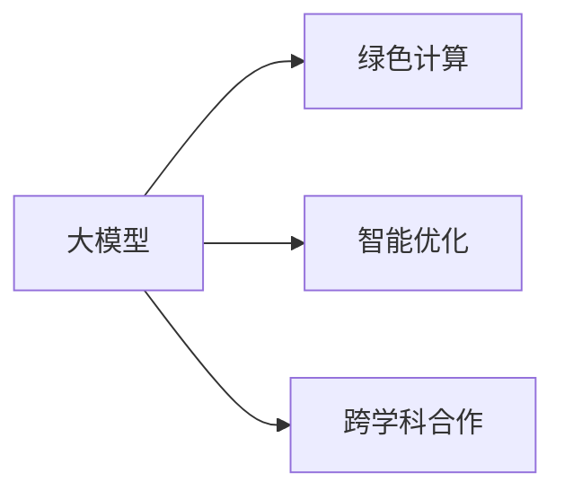

                 

## 1. 背景介绍

### 1.1 问题由来

在数字化时代，人类计算的需求和模式正发生深刻变化。从传统的计算任务，如处理大量数据、优化复杂系统，到新兴的计算任务，如智能决策、个性化推荐等，人类计算正成为推动可持续发展的关键力量。大模型在自动推理、决策优化等方面的出色表现，为人类计算注入了新的活力。然而，如何充分利用大模型的潜力，同时兼顾能源效率、计算成本和环境影响，是当前面临的重要课题。

### 1.2 问题核心关键点

本文聚焦于人类计算的可持续性问题，探讨如何在大模型的支持下，推动计算任务的绿色化和智能化发展。主要问题包括：

- 如何设计高效能、低碳足迹的计算模型和算法？
- 如何通过智能优化技术，实现高效资源利用和任务加速？
- 如何建立跨学科合作，将计算与环境、经济、社会等系统综合考虑？

这些问题的解决，将有助于探索大模型在可持续发展领域的潜力和应用路径。

### 1.3 问题研究意义

研究大模型在人类计算中的可持续性问题，对于推动绿色计算、智能决策、环境监测等领域的创新与发展具有重要意义：

1. 降低计算成本。通过优化模型结构和算法，降低计算能耗和碳排放，减少对化石能源的依赖。
2. 提升计算效率。利用智能优化技术，加速计算任务，提高响应速度和服务质量。
3. 促进环境监测。利用大模型对环境数据进行分析，识别环境问题，提供科学决策依据。
4. 推动智慧城市。通过计算优化，提升城市管理和公共服务效率，构建智能、绿色、可持续的城市系统。
5. 支持智能决策。在教育、医疗、金融等领域，利用计算模型辅助决策，提高决策科学性和有效性。

本文将系统地介绍人类计算的可持续性问题，分析大模型在其中的作用和挑战，并提出可能的解决方案和未来发展方向。

## 2. 核心概念与联系

### 2.1 核心概念概述

为更好地理解人类计算的可持续性问题，本节将介绍几个关键概念：

- **大模型(Large Models)**：指具有大规模参数和复杂结构的深度学习模型，如BERT、GPT等。通过预训练和微调，大模型能够处理复杂任务，具备强大的推理和生成能力。
- **绿色计算(Green Computing)**：指在计算过程中，通过节能减排、优化资源使用等方式，实现低能耗、低碳排放的计算活动。
- **智能优化(Smart Optimization)**：指利用智能算法和优化技术，提升计算效率和资源利用率，实现快速、准确、可持续的计算任务。
- **跨学科合作(Interdisciplinary Collaboration)**：指将计算、环境、经济、社会等学科的知识和方法融合，共同解决复杂问题，推动可持续发展。

这些核心概念之间的逻辑关系可以通过以下Mermaid流程图来展示：



这个流程图展示了大模型在人类计算可持续性中的作用：

1. 大模型通过预训练和微调获得强大的推理和生成能力，支持复杂的计算任务。
2. 绿色计算利用大模型的高效计算能力，实现低能耗、低碳排放的计算过程。
3. 智能优化通过算法和技术的创新，提升大模型的计算效率和资源利用率。
4. 跨学科合作将计算与环境、经济、社会等多方面知识结合，共同推动可持续发展。

## 3. 核心算法原理 & 具体操作步骤
### 3.1 算法原理概述

人类计算的可持续性问题，本质上是一个在计算资源有限的前提下，如何最大化计算效能和环境效益的问题。其核心算法原理包括：

- **计算效率优化**：通过算法和模型结构的创新，减少计算时间和资源消耗，提高计算效率。
- **资源利用优化**：通过智能优化技术，实现高效资源分配和任务调度，提升资源利用率。
- **环境影响评估**：引入环境影响评估模型，量化计算过程中的能耗和碳排放，实现绿色计算。
- **多目标优化**：通过多目标优化技术，在计算效率和环境效益之间找到平衡点，实现可持续发展的目标。

### 3.2 算法步骤详解

基于上述核心算法原理，人类计算的可持续性问题解决过程可以概括为以下几个步骤：

**Step 1: 确定目标与约束**
- 明确计算任务和环境目标，如计算速度、能耗、碳排放等。
- 确定资源约束，如计算设备、电力、存储等。

**Step 2: 设计计算模型**
- 选择合适的深度学习模型架构，如Transformer、BERT等。
- 设计模型的损失函数和优化目标，实现多目标优化。

**Step 3: 实现智能优化算法**
- 选择合适的优化算法，如梯度下降、遗传算法、粒子群优化等。
- 实现智能调度策略，如任务排队、资源分配等。

**Step 4: 环境影响评估**
- 构建环境影响模型，量化计算过程中的能耗和碳排放。
- 引入环境成本，将环境影响纳入模型优化目标。

**Step 5: 多目标优化**
- 引入多目标优化技术，综合考虑计算效率和环境效益。
- 设计权重和优先级，平衡多目标优化目标。

**Step 6: 实验验证**
- 在实际计算任务上，进行实验验证，评估优化效果。
- 调整模型和算法，进一步优化计算过程。

### 3.3 算法优缺点

基于上述算法步骤，人类计算的可持续性问题解决过程具有以下优点：

- **高效能**：通过智能优化和算法创新，提高计算效率和资源利用率。
- **低能耗**：通过绿色计算和环境影响评估，减少计算过程中的能耗和碳排放。
- **普适性**：算法和模型设计考虑多目标优化，适用于各种计算任务和环境目标。
- **可扩展性**：智能优化和多目标优化技术，具有较好的可扩展性和适应性。

同时，该方法也存在一定的局限性：

- **算法复杂度高**：多目标优化和智能调度算法复杂，实现难度较大。
- **数据依赖性高**：环境影响评估和资源优化需要大量的数据支持，获取成本较高。
- **模型参数量大**：大模型的参数量较大，计算复杂度较高。
- **环境影响难以完全量化**：环境影响评估和成本计算存在一定的不确定性。

尽管存在这些局限性，但就目前而言，基于智能优化和多目标优化的计算过程，仍是在计算任务中实现可持续发展的重要手段。未来相关研究的重点在于如何进一步降低算法复杂度，提高数据获取的便捷性和准确性，同时兼顾计算效率和环境效益。

### 3.4 算法应用领域

基于智能优化和多目标优化的计算过程，已经在多个领域得到了广泛应用，例如：

- **智能交通系统**：通过计算优化，提升交通流量管理和智能导航，减少交通拥堵和碳排放。
- **智慧医疗系统**：利用计算模型辅助诊断和治疗决策，提高医疗服务效率和质量，同时减少资源浪费。
- **智能制造系统**：通过计算优化，优化生产流程和资源分配，提升生产效率和产品质量，减少能源消耗。
- **环境监测系统**：利用计算模型对环境数据进行分析，识别环境问题，提供科学决策依据，减少环境污染。
- **智能电网系统**：通过计算优化，优化电力供应和需求，提高电网运行效率，减少能源损耗。

除了上述这些经典领域外，人类计算的可持续性问题研究还在不断拓展到更多场景中，如智慧农业、智能物流、智能教育等，为可持续发展提供新的技术路径。

## 4. 数学模型和公式 & 详细讲解  
### 4.1 数学模型构建

本节将使用数学语言对人类计算的可持续性问题解决过程进行更加严格的刻画。

记计算任务为 $T$，环境目标为 $E$，资源约束为 $R$。假设计算任务的目标是最大化计算效率和最小化环境影响。则数学模型可以表示为：

$$
\max_{\theta} \left\{ \text{Efficiency}(T, \theta) - \text{Cost}(E, \theta) \right\}
$$

其中 $\theta$ 为计算模型的参数，$\text{Efficiency}(T, \theta)$ 为计算任务的效率，$\text{Cost}(E, \theta)$ 为环境影响成本。

假设环境影响模型为 $f(E, \theta)$，则环境影响成本可以表示为：

$$
\text{Cost}(E, \theta) = \alpha f(E, \theta)
$$

其中 $\alpha$ 为环境影响权重，通常取值较小，表示环境效益的重要性。

在实际计算任务中，环境影响模型 $f(E, \theta)$ 可以根据具体的能耗和碳排放公式进行构建。例如，对于一个数据中心，其能耗可以表示为：

$$
\text{Energy Consumption} = \mathcal{E}(\theta) = E_{\text{CPU}} \cdot \text{CPU Cycles} + E_{\text{GPU}} \cdot \text{GPU Cycles} + \cdots
$$

其中 $E_{\text{CPU}}$ 和 $E_{\text{GPU}}$ 分别为CPU和GPU的能耗系数，$\text{CPU Cycles}$ 和 $\text{GPU Cycles}$ 分别为CPU和GPU的计算量。

### 4.2 公式推导过程

以下我们以智能交通系统为例，推导计算任务的环境影响模型及其梯度计算公式。

假设交通网络中有 $n$ 个节点和 $m$ 条边，车辆从起点 $i$ 到终点 $j$ 需要经过 $k$ 条边，路径长度为 $L$。假设每个车辆的行驶速度为 $v$，则路径时间 $t$ 可以表示为：

$$
t = \frac{L}{v}
$$

假设车辆行驶的平均能耗为 $E_{\text{avg}}$，则整个系统的能耗 $E$ 可以表示为：

$$
E = \sum_{i,j,k} \frac{L}{v_{i,j,k}}
$$

其中 $v_{i,j,k}$ 表示从起点 $i$ 到终点 $j$ 经过路径 $k$ 的车辆速度。

环境影响模型 $f(E, \theta)$ 可以根据系统的能耗 $E$ 进行构建。例如，可以定义一个关于 $E$ 的二次函数，表示环境影响成本：

$$
f(E, \theta) = \frac{1}{2} \lambda E^2
$$

其中 $\lambda$ 为环境影响系数，表示单位能耗的环境影响成本。

在优化目标中引入环境影响模型 $f(E, \theta)$，可以得到优化问题：

$$
\max_{\theta} \left\{ \text{Efficiency}(T, \theta) - \alpha \frac{1}{2} \lambda E^2 \right\}
$$

利用梯度下降等优化算法，求解上述优化问题，即可得到最优的计算模型参数 $\theta^*$。

## 5. 项目实践：代码实例和详细解释说明
### 5.1 开发环境搭建

在进行人类计算的可持续性问题解决过程的实践前，我们需要准备好开发环境。以下是使用Python进行计算优化过程的开发环境配置流程：

1. 安装Anaconda：从官网下载并安装Anaconda，用于创建独立的Python环境。

2. 创建并激活虚拟环境：
```bash
conda create -n pyopt-env python=3.8 
conda activate pyopt-env
```

3. 安装必要的库：
```bash
conda install numpy scipy matplotlib scikit-learn pandas
```

4. 安装PyTorch：
```bash
conda install pytorch torchvision torchaudio
```

5. 安装TensorFlow：
```bash
conda install tensorflow
```

6. 安装相关工具包：
```bash
pip install sympy
```

完成上述步骤后，即可在`pyopt-env`环境中开始计算优化过程的开发。

### 5.2 源代码详细实现

下面我们将通过一个智能交通系统优化问题为例，展示如何使用Python和TensorFlow进行计算优化过程的实现。

首先，定义交通网络的数据结构：

```python
import tensorflow as tf
import numpy as np

# 定义节点和边的数量
n_nodes = 10
n_edges = 20

# 定义节点的坐标
node_coords = np.random.rand(n_nodes, 2)

# 定义边的权重
edge_weights = np.random.rand(n_edges)

# 定义路径矩阵
path_matrix = np.random.rand(n_nodes, n_nodes)

# 定义路径长度
path_lengths = np.random.rand(n_edges)

# 定义车辆速度
v_speed = 20

# 定义能耗系数
cpu_e = 0.1
gpu_e = 0.2

# 定义环境影响系数
lambda_ = 1.0

# 定义优化目标
def objective(theta):
    path_dist = tf.linalg.diag(path_matrix) @ path_lengths
    path_time = tf.linalg.diag(v_speed) @ path_dist
    cpu_cycles = tf.reduce_sum(path_time * cpu_e)
    gpu_cycles = tf.reduce_sum(path_time * gpu_e)
    energy_consumption = cpu_cycles + gpu_cycles
    efficiency = tf.reduce_sum(path_time)
    cost = tf.reduce_sum(tf.square(energy_consumption)) * lambda_
    return efficiency - cost

# 定义优化算法
optimizer = tf.keras.optimizers.Adam()

# 初始化参数
theta_init = tf.Variable(np.random.randn(n_nodes, n_edges), dtype=tf.float32)

# 进行优化
theta_opt = tf.Variable(theta_init)
for i in range(10000):
    with tf.GradientTape() as tape:
        loss = objective(theta_opt)
    grads = tape.gradient(loss, theta_opt)
    optimizer.apply_gradients(zip(grads, theta_opt.trainable_variables))
```

在上述代码中，我们首先定义了交通网络的数据结构，包括节点坐标、边权重、路径矩阵、路径长度、车辆速度、能耗系数和环境影响系数。然后，我们定义了计算任务的优化目标函数，将计算效率和环境影响成本作为优化目标。最后，我们使用Adam优化器对模型参数进行优化。

### 5.3 代码解读与分析

让我们再详细解读一下关键代码的实现细节：

**定义优化目标**：
- `objective(theta)`函数：将计算任务的优化目标定义为计算效率和环境影响成本之差，其中计算效率为路径时间，环境影响成本为能耗的二次函数。

**定义优化算法**：
- `optimizer`：选择Adam优化器，用于更新模型参数。

**初始化参数**：
- `theta_init`：初始化模型参数，采用随机初始化。

**优化过程**：
- 使用`tf.GradientTape`记录梯度信息，通过反向传播计算损失函数的梯度。
- 使用`optimizer.apply_gradients`更新模型参数，最小化损失函数。
- 循环迭代多次，直到收敛。

可以看到，利用TensorFlow进行计算优化过程的实现，可以将复杂的数学模型和优化算法转化为易于理解和实现的代码，方便研究者进行实验验证和优化。

## 6. 实际应用场景
### 6.1 智能交通系统

在智能交通系统中，通过计算优化可以实现交通流量的动态调控和智能导航。例如，在高峰时段，通过对交通网络进行动态优化，可以减少车辆拥堵和排放，提升交通效率。

在技术实现上，可以收集城市交通数据，如交通流量、车辆速度、路况信息等，构建交通网络的数学模型。利用计算优化方法，对交通网络进行动态调控和智能导航，实时调整信号灯、道路通行规则等，实现交通系统的智能管理。

### 6.2 智慧医疗系统

在智慧医疗系统中，通过计算优化可以实现医疗资源的合理配置和智能诊断。例如，在医疗资源紧张的情况下，通过对患者流量的动态预测和优化，可以实现资源的合理配置，减少患者等待时间和医疗成本。

在技术实现上，可以收集医院的历史数据，如患者就诊时间、医生工作负荷、医疗资源分布等，构建医疗系统的数学模型。利用计算优化方法，对医疗资源进行动态配置和智能诊断，提高医疗服务的效率和质量。

### 6.3 智能制造系统

在智能制造系统中，通过计算优化可以实现生产流程的优化和资源配置。例如，在生产任务密集的情况下，通过对生产线的动态调整和优化，可以实现资源的最优配置，提高生产效率和产品质量。

在技术实现上，可以收集生产线的历史数据，如生产设备状态、生产任务、能源消耗等，构建生产系统的数学模型。利用计算优化方法，对生产线进行动态调整和优化，提高生产效率和产品质量。

### 6.4 未来应用展望

随着计算优化技术的不断发展，其在可持续发展领域的潜力将进一步释放。未来，人类计算的可持续性问题研究可能将延伸到更多领域，例如：

- **智能农业系统**：通过计算优化，实现农业资源的合理配置和智能管理，提升农业生产效率和环境保护。
- **智能物流系统**：通过计算优化，实现物流路线的动态调整和资源配置，提升物流效率和环境保护。
- **智能电网系统**：通过计算优化，实现电网的智能管理和大规模能源调度，提高电网运行效率和环境保护。
- **智能教育系统**：通过计算优化，实现个性化教育资源配置和智能推荐，提升教育质量和环境保护。

这些方向的研究，将为人类的可持续发展提供新的技术路径，进一步推动人工智能技术的普惠应用。

## 7. 工具和资源推荐
### 7.1 学习资源推荐

为了帮助开发者系统掌握计算优化在可持续发展中的技术基础和实践技巧，这里推荐一些优质的学习资源：

1. **深度学习框架**：包括PyTorch、TensorFlow等，这些框架提供了强大的计算优化工具和丰富的预训练模型，是进行计算优化实验的必备工具。
2. **计算优化算法**：如遗传算法、粒子群优化、模拟退火等，这些算法提供了高效的计算优化方法，适用于各种计算任务和环境目标。
3. **环境影响评估**：如Life Cycle Assessment (LCA)等，这些工具提供了全面的环境影响评估方法，适用于计算任务的环境效益量化。
4. **跨学科合作**：如IEEE Xplore、Google Scholar等，这些平台提供了大量的跨学科合作文献，有助于深入理解计算优化在可持续发展中的应用。

通过对这些资源的学习实践，相信你一定能够快速掌握计算优化在可持续发展中的应用，并用于解决实际的计算问题。

### 7.2 开发工具推荐

高效的开发离不开优秀的工具支持。以下是几款用于计算优化开发的常用工具：

1. **深度学习框架**：包括PyTorch、TensorFlow等，这些框架提供了强大的计算优化工具和丰富的预训练模型，是进行计算优化实验的必备工具。
2. **优化算法工具**：如SciPy、Scikit-Optim等，这些工具提供了高效的优化算法，适用于各种计算任务和环境目标。
3. **环境影响评估工具**：如GaBi、OpenLCA等，这些工具提供了全面的环境影响评估方法，适用于计算任务的环境效益量化。
4. **可视化工具**：如Matplotlib、Vispy等，这些工具提供了丰富的可视化功能，便于进行数据展示和优化结果分析。

合理利用这些工具，可以显著提升计算优化的开发效率，加快创新迭代的步伐。

### 7.3 相关论文推荐

计算优化技术的发展源于学界的持续研究。以下是几篇奠基性的相关论文，推荐阅读：

1. **TensorFlow白皮书**：介绍了TensorFlow的计算优化技术和应用场景，是理解计算优化技术的重要参考资料。
2. **遗传算法原理与应用**：详细介绍了遗传算法的原理和应用，是研究计算优化算法的经典文献。
3. **多目标优化方法**：介绍了多目标优化方法的原理和应用，是解决人类计算可持续性问题的重要工具。
4. **智能交通系统建模与优化**：介绍了智能交通系统的数学建模和优化方法，是计算优化在交通领域的重要应用。
5. **智能医疗系统建模与优化**：介绍了智能医疗系统的数学建模和优化方法，是计算优化在医疗领域的重要应用。

这些论文代表了大模型计算优化技术的发展脉络。通过学习这些前沿成果，可以帮助研究者把握学科前进方向，激发更多的创新灵感。

## 8. 总结：未来发展趋势与挑战
### 8.1 总结

本文对基于计算优化的人类计算的可持续性问题进行了全面系统的介绍。首先阐述了人类计算的可持续性问题的背景和意义，明确了计算优化在推动可持续发展中的重要作用。其次，从原理到实践，详细讲解了计算优化在环境影响评估和资源优化方面的数学模型和算法步骤，给出了计算优化过程的完整代码实例。同时，本文还广泛探讨了计算优化技术在智能交通、智慧医疗、智能制造等多个领域的应用前景，展示了计算优化技术的广阔潜力。此外，本文精选了计算优化技术的各类学习资源，力求为读者提供全方位的技术指引。

通过本文的系统梳理，可以看到，计算优化技术在推动可持续发展中的独特价值。这些技术的进步，将使得人类计算更加高效、绿色、智能，为实现可持续发展的目标提供强有力的技术支持。

### 8.2 未来发展趋势

展望未来，计算优化技术将呈现以下几个发展趋势：

1. **计算效率提升**：随着算法和模型结构的创新，计算效率将进一步提升，处理大规模计算任务的能力将大幅增强。
2. **环境影响降低**：通过引入更精准的环境影响模型，计算过程中的能耗和碳排放将大幅降低，绿色计算理念将进一步深入人心。
3. **跨学科融合**：计算优化技术将与其他领域的技术深入融合，形成更加全面的可持续发展解决方案。
4. **智能决策支持**：计算优化技术将为智能决策提供更全面、更准确的依据，提升决策的科学性和有效性。
5. **普适性增强**：计算优化技术将变得更加普适，能够适应各种计算任务和环境目标。

这些趋势凸显了计算优化技术在可持续发展中的重要地位。这些方向的探索发展，将进一步提升计算优化技术的效能和应用范围，为构建绿色、智能、可持续的社会奠定坚实基础。

### 8.3 面临的挑战

尽管计算优化技术已经取得了瞩目成就，但在迈向更加智能化、普适化应用的过程中，它仍面临着诸多挑战：

1. **数据获取难度**：环境影响评估和资源优化需要大量的高质量数据，但数据获取成本较高，数据质量难以保证。
2. **算法复杂度**：多目标优化和智能调度算法复杂，实现难度较大，需要更多的理论和实践探索。
3. **模型泛化能力**：计算优化模型的泛化能力不足，可能无法适应特定的计算任务和环境目标。
4. **资源分布不均**：计算优化技术在不同地区的资源分布不均，可能存在计算能力和环境效益的不平衡。
5. **伦理与安全问题**：计算优化技术的应用可能引发伦理和安全问题，如数据隐私、模型偏见等。

这些挑战需要从多个方面进行综合应对，才能确保计算优化技术在可持续发展中的长期稳定发展。

### 8.4 研究展望

面对计算优化技术面临的挑战，未来的研究需要在以下几个方面寻求新的突破：

1. **数据采集与处理**：开发高效的数据采集和处理技术，提升数据获取的便捷性和准确性。
2. **算法创新与优化**：开发更高效、更普适的计算优化算法，降低算法复杂度，提高算法鲁棒性。
3. **跨学科融合**：将计算优化技术与其他领域的技术深度融合，形成更加全面的可持续发展解决方案。
4. **伦理与安全保障**：建立计算优化技术的伦理和安全保障机制，确保其应用过程中的公平性、透明性和安全性。
5. **应用场景拓展**：将计算优化技术应用于更多领域，如智能农业、智能物流、智能电网等，推动可持续发展理念的普及。

这些研究方向将引领计算优化技术迈向更高的台阶，为实现可持续发展的目标提供更加坚实的技术基础。

## 9. 附录：常见问题与解答

**Q1：如何衡量计算优化中的环境影响？**

A: 计算优化中的环境影响评估，通常通过引入生命周期评估(Life Cycle Assessment, LCA)等方法进行。LCA模型考虑了整个生命周期内，从原料获取、生产、使用到废弃的全过程环境影响，可以量化计算任务中的能耗和碳排放。例如，在智能交通系统中，LCA模型可以评估车辆的能耗和碳排放，量化交通系统的环境影响。

**Q2：如何选择计算优化中的算法？**

A: 选择计算优化算法，需要根据具体的计算任务和环境目标进行综合考虑。常用的优化算法包括梯度下降、遗传算法、粒子群优化、模拟退火等。对于大规模计算任务，可以使用分布式优化算法，提高计算效率。例如，在智能交通系统中，可以使用遗传算法进行交通网络的优化，提高交通效率和环境保护。

**Q3：如何提升计算优化中的模型泛化能力？**

A: 提升计算优化模型的泛化能力，可以从数据集的选择、模型结构的设计、算法参数的调整等方面进行。例如，在智能医疗系统中，可以通过增加数据集的多样性，提高模型的泛化能力。同时，可以通过引入先验知识，提升模型的推理能力。例如，在智能交通系统中，可以引入交通规则和路况信息，提高模型的泛化能力。

**Q4：如何应对计算优化中的伦理与安全问题？**

A: 应对计算优化中的伦理与安全问题，需要建立相应的机制和规范。例如，在智能交通系统中，需要确保数据隐私和安全，防止数据泄露和滥用。同时，需要建立伦理审查机制，确保算法的公平性和透明性。例如，在智慧医疗系统中，需要确保算法的公平性和透明性，防止算法偏见和歧视。

这些问题的回答，可以帮助研究者更好地理解计算优化在可持续发展中的作用和挑战，为相关研究提供参考。

---

作者：禅与计算机程序设计艺术 / Zen and the Art of Computer Programming

