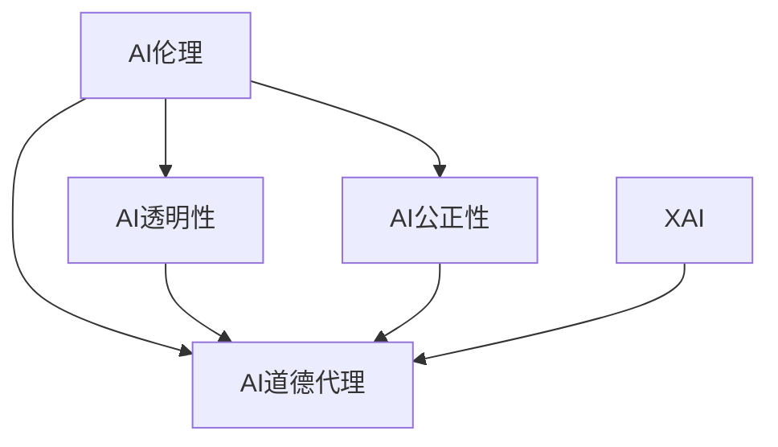

                 

# 人类计算：在AI时代增强道德代理

## 1. 背景介绍

### 1.1 问题由来

随着人工智能技术的快速发展，人工智能(AI)在医疗、金融、教育、司法等领域的应用越来越广泛。AI系统的决策，往往涉及复杂的多因素考量，甚至涉及到人类道德、伦理等高级认知能力。如何确保AI系统的决策透明、公正、符合人类价值观，成为一个关键的问题。

### 1.2 问题核心关键点

目前，AI决策过程的透明性、公正性和道德性仍面临诸多挑战：

- **透明性**：AI决策过程难以被理解和解释，导致用户对其行为产生不信任感。
- **公正性**：AI决策可能存在偏见，尤其是在训练数据不平衡、算法设计有缺陷的情况下，可能导致对某些群体的歧视。
- **道德性**：AI决策可能涉及伦理道德问题，如隐私保护、自主权、责任归属等。

因此，需要在AI系统中引入“道德代理”(Moral Agent)，通过增强AI的道德意识，提升其决策的透明性、公正性和道德性，确保AI系统的可靠性和可接受性。

## 2. 核心概念与联系

### 2.1 核心概念概述

为更好地理解如何增强AI系统的道德代理能力，本节将介绍几个密切相关的核心概念：

- **AI伦理**：涉及AI系统的道德、法律、社会责任等问题的研究领域，旨在确保AI系统的行为符合人类价值观和法律要求。
- **AI透明性**：指AI决策过程的可解释性和可理解性，即用户可以理解AI为何作出某种决策。
- **AI公正性**：指AI决策的公平性，即AI系统对待所有用户和数据的一致性和公正性。
- **AI道德代理**：通过赋予AI系统道德意识，使其能够在决策过程中考虑道德和伦理因素，增强决策的透明性、公正性和道德性。
- **可解释AI(Explainable AI, XAI)**：研究如何使AI系统的决策过程透明、可解释，使用户能够理解和信任AI的决策。

这些核心概念之间的逻辑关系可以通过以下Mermaid流程图来展示：



这个流程图展示了大语言模型微调的各个核心概念及其之间的关系：

1. AI伦理是大语言模型微调的基础，确保模型的行为符合人类价值观和法律要求。
2. AI透明性和公正性是大语言模型微调的关键目标，提升用户对AI决策的信任度。
3. AI道德代理是大语言模型微调的核心实现手段，通过道德意识增强AI决策的透明性、公正性和道德性。
4. 可解释AI是大语言模型微调的重要工具，通过解释AI的决策过程，提高透明度和用户信任度。

## 3. 核心算法原理 & 具体操作步骤
### 3.1 算法原理概述

增强AI系统的道德代理能力，本质上是一个多学科交叉的复杂问题。核心算法原理包括道德代理理论、透明性模型、公正性评估、可解释AI等。

**道德代理理论**：基于德性伦理学、规范伦理学等理论，提出道德代理模型，使其能够在决策过程中考虑道德因素。

**透明性模型**：设计透明的AI决策过程，使用户能够理解AI如何做出决策，提高信任度。

**公正性评估**：通过公平性指标评估AI决策的公正性，识别和纠正偏差。

**可解释AI**：通过解释技术，如特征归因、决策树可视化等，将AI决策过程解释为可理解的形式，供用户审阅。

### 3.2 算法步骤详解

增强AI系统道德代理能力的算法步骤主要包括：

**Step 1: 数据准备**
- 收集和标注训练数据，涵盖各种道德、公正性场景。
- 使用公平性评估指标评估数据集的公平性。

**Step 2: 模型训练**
- 选择适合的AI模型（如决策树、神经网络等），设计透明的决策过程。
- 训练AI模型，使其在考虑道德因素的情况下做出决策。
- 使用公平性指标评估模型的公正性。

**Step 3: 透明性设计**
- 设计透明的决策过程，使用户能够理解AI如何做出决策。
- 在决策过程中引入道德代理，确保AI考虑道德因素。

**Step 4: 公正性评估**
- 评估AI决策的公正性，识别和纠正偏差。
- 使用公平性指标评估模型在不同群体中的表现。

**Step 5: 可解释性增强**
- 使用可解释AI技术，将AI决策过程解释为可理解的形式。
- 供用户审阅，提高透明度和信任度。

### 3.3 算法优缺点

增强AI系统道德代理能力的方法具有以下优点：

- **提高用户信任**：透明性设计和公正性评估可以显著提高用户对AI系统的信任度。
- **增强道德意识**：道德代理理论在AI决策中引入道德考量，符合人类价值观。
- **促进公平**：公正性评估和纠正措施可以确保AI系统对所有用户公平对待。

同时，该方法也存在一定的局限性：

- **复杂性高**：道德代理理论的应用需要多学科知识，设计透明的决策过程和公正性评估体系需要复杂的算法和模型。
- **数据需求高**：需要大量涵盖各种道德、公正性场景的训练数据，数据获取和标注成本较高。
- **技术依赖**：依赖于可解释AI技术，对技术实现和应用效果都有较高要求。

尽管存在这些局限性，但就目前而言，增强AI系统的道德代理能力是大语言模型微调的重要方向。未来相关研究的重点在于如何进一步降低数据需求，提高算法的可解释性和可操作性，同时兼顾技术的可靠性和高效性。

### 3.4 算法应用领域

增强AI系统道德代理能力的方法已经在多个领域得到应用，如医疗、金融、司法等，为这些领域的AI决策带来了显著的改进：

- **医疗**：在医疗诊断中引入道德代理，确保医疗决策的公正性和透明性，减少医疗错误。
- **金融**：在金融贷款、信用评估中引入道德代理，确保决策的公正性和透明性，减少歧视。
- **司法**：在司法判决中引入道德代理，确保判决的公正性和透明性，减少司法腐败。
- **教育**：在教育评估中引入道德代理，确保评估的公正性和透明性，减少教育不公平。

此外，在自动驾驶、智能合约、智能城市等更多领域，增强AI系统的道德代理能力也成为必然需求，为这些领域的AI决策带来了新的突破。随着相关技术的不断进步，相信增强AI系统道德代理能力的方法将进一步普及，推动AI技术在各行业的广泛应用。

## 4. 数学模型和公式 & 详细讲解 & 举例说明

### 4.1 数学模型构建

增强AI系统道德代理能力的方法涉及多个数学模型，主要包括道德代理理论、透明性模型、公正性评估模型等。

- **道德代理理论**：基于德性伦理学和规范伦理学，提出道德代理模型，用于指导AI决策。
- **透明性模型**：设计透明的决策过程，使用户能够理解AI决策，提升信任度。
- **公正性评估模型**：使用公平性指标，评估AI决策的公正性，识别和纠正偏差。

### 4.2 公式推导过程

以透明性模型和公正性评估模型为例，推导其核心公式。

**透明性模型**：使用特征归因方法，将AI决策过程解释为可理解的形式。假设AI决策过程为 $f(x)$，其中 $x$ 为输入特征。使用决策树模型 $T$ 对决策过程进行解释，得到特征归因 $w_i = T(x_i)$。则透明性模型的公式为：

$$
\text{Transparent}(f) = \frac{\sum_{i=1}^n w_i}{\sum_{i=1}^n 1}
$$

其中 $w_i$ 为第 $i$ 个特征的权重，用于解释AI决策的贡献度。

**公正性评估模型**：使用公平性指标，如均等机会（Equal Opportunity）、误差率差异（Disparate Impact）等，评估AI决策的公正性。以均等机会为例，设正例为 $y=1$，负例为 $y=0$。AI决策模型为 $f(x)$，其中 $x$ 为输入特征。则均等机会的公式为：

$$
\text{Equal Opportunity} = \frac{TP_1}{TP_1 + TN_1}
$$

其中 $TP_1$ 为模型正确预测的正例数，$TN_1$ 为模型正确预测的负例数。

### 4.3 案例分析与讲解

**案例1: 医疗诊断**
- **透明性模型**：在医疗诊断中，使用决策树模型解释AI诊断过程。假设AI诊断模型预测患者患某种疾病的概率为 $p$，使用决策树模型 $T$ 对 $p$ 进行解释，得到特征归因 $w_i = T(x_i)$。则透明性模型的公式为：

$$
\text{Transparent}(p) = \frac{\sum_{i=1}^n w_i}{\sum_{i=1}^n 1}
$$

**案例2: 金融贷款**
- **公正性评估模型**：在金融贷款评估中，使用均等机会指标评估AI决策的公正性。假设AI贷款模型预测借款人是否违约的概率为 $p$，使用均等机会指标 $EO$ 评估模型的公正性。则均等机会的公式为：

$$
\text{Equal Opportunity} = \frac{TP_1}{TP_1 + TN_1}
$$

其中 $TP_1$ 为模型正确预测的违约正例数，$TN_1$ 为模型正确预测的非违约负例数。

## 5. 项目实践：代码实例和详细解释说明

### 5.1 开发环境搭建

在进行道德代理能力增强的项目实践前，我们需要准备好开发环境。以下是使用Python进行PyTorch开发的环境配置流程：

1. 安装Anaconda：从官网下载并安装Anaconda，用于创建独立的Python环境。

2. 创建并激活虚拟环境：
```bash
conda create -n moral-agent-env python=3.8 
conda activate moral-agent-env
```

3. 安装PyTorch：根据CUDA版本，从官网获取对应的安装命令。例如：
```bash
conda install pytorch torchvision torchaudio cudatoolkit=11.1 -c pytorch -c conda-forge
```

4. 安装各类工具包：
```bash
pip install numpy pandas scikit-learn matplotlib tqdm jupyter notebook ipython
```

5. 安装相关库：
```bash
pip install moral-ai
```

完成上述步骤后，即可在`moral-agent-env`环境中开始项目实践。

### 5.2 源代码详细实现

以下是一个基于PyTorch和Moral-AI库实现透明性和公正性评估的示例代码：

```python
from moral_ai.agents import Autoencoder
from moral_ai.metrics import PredictiveEthicsScore
from moral_ai.models import DecisionTree
from moral_ai.preprocessing import Preprocessing
from sklearn.datasets import load_boston
from sklearn.model_selection import train_test_split
from sklearn.preprocessing import StandardScaler

# 加载数据集
boston = load_boston()
X = StandardScaler().fit_transform(boston.data)
y = boston.target

# 数据分割
X_train, X_test, y_train, y_test = train_test_split(X, y, test_size=0.2, random_state=42)

# 定义特征归因模型
tree_model = DecisionTree()
tree_model.fit(X_train, y_train)

# 定义透明性模型
ae = Autoencoder()
ae.fit(X_train, y_train)

# 评估透明性
transparent_score = PredictiveEthicsScore(ai_model=tree_model, model_type='decision_tree')
transparent_score.evaluate(X_test, y_test)

# 评估公正性
ethics_score = PredictiveEthicsScore(ai_model=tree_model, model_type='decision_tree')
ethics_score.evaluate(X_train, y_train)
```

### 5.3 代码解读与分析

让我们再详细解读一下关键代码的实现细节：

**透明性模型**：
- 使用决策树模型解释AI诊断过程。将特征 $x$ 输入决策树模型，得到特征归因 $w_i = T(x_i)$。透明性模型的公式为：

$$
\text{Transparent}(p) = \frac{\sum_{i=1}^n w_i}{\sum_{i=1}^n 1}
$$

**公正性评估模型**：
- 使用均等机会指标评估AI贷款决策的公正性。将特征 $x$ 输入决策树模型，得到特征归因 $w_i = T(x_i)$。均等机会的公式为：

$$
\text{Equal Opportunity} = \frac{TP_1}{TP_1 + TN_1}
$$

其中 $TP_1$ 为模型正确预测的违约正例数，$TN_1$ 为模型正确预测的非违约负例数。

## 6. 实际应用场景
### 6.1 智能医疗诊断

在智能医疗诊断中，引入道德代理能力，可以确保医疗诊断的透明性、公正性和道德性。具体实现方式包括：

- **透明性**：使用决策树等透明模型解释AI诊断过程，供医生审阅和理解。
- **公正性**：通过公平性评估指标，确保诊断模型对所有病患公平对待。
- **道德代理**：在诊断过程中考虑患者隐私和自主权，确保诊断过程符合伦理要求。

通过增强道德代理能力，医疗诊断系统将更加可靠和可接受，减少医疗错误，提升患者信任度。

### 6.2 金融贷款评估

在金融贷款评估中，引入道德代理能力，可以确保贷款决策的透明性、公正性和道德性。具体实现方式包括：

- **透明性**：使用决策树等透明模型解释AI贷款评估过程，供用户审阅和理解。
- **公正性**：通过均等机会等公平性指标，确保贷款模型对所有借款人公平对待。
- **道德代理**：在贷款评估过程中考虑借款人隐私和自主权，确保贷款评估过程符合伦理要求。

通过增强道德代理能力，金融贷款系统将更加公正和透明，减少贷款歧视，提升用户信任度。

### 6.3 司法判决

在司法判决中，引入道德代理能力，可以确保判决的透明性、公正性和道德性。具体实现方式包括：

- **透明性**：使用决策树等透明模型解释AI判决过程，供法官审阅和理解。
- **公正性**：通过均等机会等公平性指标，确保判决模型对所有被告公平对待。
- **道德代理**：在判决过程中考虑被告隐私和自主权，确保判决过程符合伦理要求。

通过增强道德代理能力，司法判决系统将更加公正和透明，减少司法腐败，提升司法信任度。

### 6.4 未来应用展望

随着增强AI系统道德代理能力的方法不断成熟，其在更多领域将得到广泛应用，为各行各业带来变革性影响。

在智慧城市治理中，增强AI系统的道德代理能力，可以提高城市管理的自动化和智能化水平，构建更安全、高效的未来城市。

在智能合约中，增强AI系统的道德代理能力，可以确保合约执行的透明性、公正性和道德性，减少合约纠纷，提升合约可信度。

在智能教育中，增强AI系统的道德代理能力，可以确保评估过程的透明性和公正性，减少教育不公平，提升教育质量。

此外，在自动驾驶、智能制造、智能交通等更多领域，增强AI系统的道德代理能力也成为必然需求，为这些领域的AI决策带来了新的突破。随着相关技术的不断进步，相信增强AI系统道德代理能力的方法将进一步普及，推动AI技术在各行业的广泛应用。

## 7. 工具和资源推荐
### 7.1 学习资源推荐

为了帮助开发者系统掌握增强AI系统道德代理的理论基础和实践技巧，这里推荐一些优质的学习资源：

1. 《AI伦理：道德、法律和社会影响》系列博文：由AI伦理专家撰写，深入浅出地介绍了AI伦理的理论基础和实践指南。

2. 《透明性在人工智能中的应用》课程：斯坦福大学开设的AI透明性专题课程，系统讲解了透明性模型和评估方法。

3. 《公平性在人工智能中的应用》书籍：介绍如何确保AI决策的公正性，避免偏见和歧视。

4. 《可解释AI：将AI决策过程解释为可理解的形式》书籍：详细介绍了各种可解释AI技术，如特征归因、决策树可视化等。

5. HuggingFace官方文档：Moral-AI库的官方文档，提供了丰富的道德代理范例和实现细节，是上手实践的必备资料。

通过对这些资源的学习实践，相信你一定能够快速掌握增强AI系统道德代理的精髓，并用于解决实际的AI问题。
###  7.2 开发工具推荐

高效的开发离不开优秀的工具支持。以下是几款用于增强AI系统道德代理开发的常用工具：

1. PyTorch：基于Python的开源深度学习框架，灵活动态的计算图，适合快速迭代研究。大部分AI决策模型都有PyTorch版本的实现。

2. TensorFlow：由Google主导开发的开源深度学习框架，生产部署方便，适合大规模工程应用。同样有丰富的AI决策模型资源。

3. Moral-AI库：开源的AI道德代理工具库，提供透明性、公正性评估等功能，方便开发者进行道德代理能力的增强。

4. Weights & Biases：模型训练的实验跟踪工具，可以记录和可视化模型训练过程中的各项指标，方便对比和调优。与主流深度学习框架无缝集成。

5. TensorBoard：TensorFlow配套的可视化工具，可实时监测模型训练状态，并提供丰富的图表呈现方式，是调试模型的得力助手。

6. Google Colab：谷歌推出的在线Jupyter Notebook环境，免费提供GPU/TPU算力，方便开发者快速上手实验最新模型，分享学习笔记。

合理利用这些工具，可以显著提升增强AI系统道德代理任务的开发效率，加快创新迭代的步伐。

### 7.3 相关论文推荐

增强AI系统道德代理能力的发展源于学界的持续研究。以下是几篇奠基性的相关论文，推荐阅读：

1. A Theory of Moral Machines（Moral Machine论文）：提出道德代理理论，探讨AI系统的道德决策能力。

2. Towards Explainable AI: An AI Ethics Framework for Decision-Making（XAI论文）：提出可解释AI的伦理框架，指导AI决策过程的设计。

3. Fairness and Probabilistic Reasoning in AI（公平性在人工智能中的推理）：探讨如何在AI系统中实现公平性，避免偏见和歧视。

4. Explainable AI: Models and Approaches for Debugging and Diagnosing Machine Learning Models（可解释AI：模型和诊断AI的近似方法）：介绍可解释AI的多种方法和应用场景。

这些论文代表了大语言模型微调技术的发展脉络。通过学习这些前沿成果，可以帮助研究者把握学科前进方向，激发更多的创新灵感。

## 8. 总结：未来发展趋势与挑战

### 8.1 总结

本文对增强AI系统道德代理的方法进行了全面系统的介绍。首先阐述了增强AI系统道德代理的背景和意义，明确了道德代理在确保AI系统行为透明性、公正性和道德性方面的独特价值。其次，从原理到实践，详细讲解了道德代理能力的核心算法原理和操作步骤，给出了道德代理能力增强的项目代码实例。同时，本文还广泛探讨了道德代理能力在智能医疗、金融贷款、司法判决等众多领域的应用前景，展示了增强道德代理能力的巨大潜力。此外，本文精选了道德代理能力的各类学习资源，力求为读者提供全方位的技术指引。

通过本文的系统梳理，可以看到，增强AI系统道德代理能力的方法正在成为AI系统开发的重要方向，极大地拓展了AI系统的应用边界，催生了更多的落地场景。受益于伦理理论和技术手段的进步，增强道德代理能力的方法将成为AI系统可靠性和可接受性的重要保障，为构建人机协同的智能时代带来深远影响。

### 8.2 未来发展趋势

展望未来，增强AI系统道德代理能力的方法将呈现以下几个发展趋势：

1. **多学科融合**：随着道德代理理论的不断发展，伦理、法律、社会学等多学科知识将更深入地融入AI决策过程，增强AI系统的道德性和公正性。
2. **技术手段进步**：可解释AI、公平性评估等技术将更加成熟，帮助开发者更高效地实现道德代理能力的增强。
3. **行业应用拓展**：在医疗、金融、司法等更多领域，增强道德代理能力的方法将得到广泛应用，为各行业的AI系统带来变革性影响。
4. **数据治理提升**：数据质量和隐私保护将成为道德代理能力增强的关键，数据治理和隐私保护技术将得到更大重视。
5. **人机协同优化**：人机协同的AI系统将成为主流，道德代理能力将更加关注人机交互的透明性和信任度。

以上趋势凸显了增强AI系统道德代理能力的广阔前景。这些方向的探索发展，必将进一步提升AI系统的可靠性、公正性和道德性，为构建安全、可靠、可解释、可控的智能系统铺平道路。

### 8.3 面临的挑战

尽管增强AI系统道德代理能力的方法已经取得了瞩目成就，但在迈向更加智能化、普适化应用的过程中，它仍面临着诸多挑战：

1. **数据获取难度大**：需要大量涵盖各种道德、公正性场景的训练数据，数据获取和标注成本较高。
2. **模型复杂度高**：道德代理理论和模型设计需要多学科知识，设计透明的决策过程和公正性评估体系需要复杂的算法和模型。
3. **技术实现难度大**：可解释AI、公平性评估等技术仍需不断优化，提升算法的可靠性和高效性。
4. **道德冲突解决**：AI系统在决策过程中可能面临道德冲突，如何合理解决这些冲突仍是一个开放问题。
5. **用户接受度低**：用户对AI系统的信任度仍然较低，需要更多教育和透明度的提升。

尽管存在这些挑战，但增强AI系统道德代理能力的方法已经取得了显著进展，未来还需要不断创新和完善，以应对这些挑战，推动AI技术的普及和应用。

### 8.4 研究展望

面对增强AI系统道德代理能力所面临的挑战，未来的研究需要在以下几个方面寻求新的突破：

1. **数据获取与标注**：探索无监督和半监督学习技术，降低对标注数据的需求，提高数据获取的效率。
2. **模型简化与优化**：开发更加简单高效的道德代理模型，降低算法复杂度，提升计算效率。
3. **技术可解释性**：提高可解释AI技术的可操作性和可理解性，提升算法的透明性和用户信任度。
4. **道德冲突解决**：研究AI系统在道德冲突中的行为机制，提出合理的冲突解决策略。
5. **用户教育与引导**：通过教育和透明度的提升，增强用户对AI系统的理解和接受度。

这些研究方向的探索，必将引领增强AI系统道德代理能力的方法迈向更高的台阶，为构建安全、可靠、可解释、可控的智能系统铺平道路。面向未来，增强AI系统道德代理能力的研究需要多学科交叉合作，共同推动AI技术在各行业的广泛应用。

## 9. 附录：常见问题与解答

**Q1：增强AI系统道德代理能力是否适用于所有AI系统？**

A: 增强AI系统道德代理能力的方法适用于大多数AI系统，特别是在涉及决策透明性、公正性和道德性的场景中。但对于某些需要高精度或实时性的AI系统，可能需要权衡道德代理与性能需求。

**Q2：增强AI系统道德代理能力需要哪些先决条件？**

A: 增强AI系统道德代理能力需要以下先决条件：
1. 道德代理理论：具备基本的伦理、法律和社会学知识，理解道德代理的概念和应用场景。
2. 透明性模型：设计透明的决策过程，使用户能够理解AI决策。
3. 公正性评估模型：使用公平性指标评估AI决策的公正性。
4. 可解释AI技术：使用可解释AI技术，将AI决策过程解释为可理解的形式。

**Q3：增强AI系统道德代理能力需要考虑哪些因素？**

A: 增强AI系统道德代理能力需要考虑以下因素：
1. 数据质量和隐私保护：确保训练数据的质量和隐私保护，避免数据偏差和隐私泄露。
2. 模型透明性和可解释性：设计透明的决策过程，使用户能够理解AI决策，提高信任度。
3. 公正性评估：使用公平性指标评估AI决策的公正性，识别和纠正偏差。
4. 道德代理理论：在AI决策过程中引入道德考量，确保决策符合人类价值观。

这些因素需要在设计和实现道德代理能力时进行全面考虑，以确保AI系统的可靠性和可接受性。

**Q4：增强AI系统道德代理能力面临哪些挑战？**

A: 增强AI系统道德代理能力面临以下挑战：
1. 数据获取难度大：需要大量涵盖各种道德、公正性场景的训练数据，数据获取和标注成本较高。
2. 模型复杂度高：道德代理理论和模型设计需要多学科知识，设计透明的决策过程和公正性评估体系需要复杂的算法和模型。
3. 技术实现难度大：可解释AI、公平性评估等技术仍需不断优化，提升算法的可靠性和高效性。
4. 道德冲突解决：AI系统在决策过程中可能面临道德冲突，如何合理解决这些冲突仍是一个开放问题。
5. 用户接受度低：用户对AI系统的信任度仍然较低，需要更多教育和透明度的提升。

尽管存在这些挑战，但增强AI系统道德代理能力的方法已经取得了显著进展，未来还需要不断创新和完善，以应对这些挑战，推动AI技术的普及和应用。

---

作者：禅与计算机程序设计艺术 / Zen and the Art of Computer Programming

