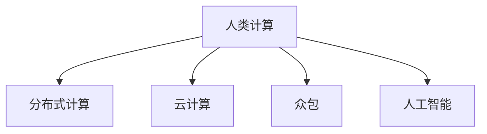

                 

# 人类计算：应用与案例分析

> 关键词：人类计算, 分布式计算, 计算科学, 计算机辅助设计, 图像处理, 密码学, 生物信息学

## 1. 背景介绍

### 1.1 问题由来

随着信息技术的高速发展，计算能力日益成为制约科学进步和社会发展的瓶颈。传统集中式计算模式面临扩展性差、成本高昂等挑战。因此，分布式计算、云计算、大数据等新兴计算范式应运而生，旨在通过分散资源、协同计算，实现计算任务的并行化和高效化。

在此背景下，人类计算(Human Compute)成为计算科学和计算机科学的前沿研究方向。人类计算结合人类智慧和计算机技术，通过众包、众筹、协同计算等方式，利用人机协同的强大能力，突破传统计算模式的局限，形成更高效、更智能的计算解决方案。

### 1.2 问题核心关键点

人类计算的核心在于将大规模计算任务拆分为小型子任务，通过“众包”的方式，在众多人类工作者之间分布式求解。这种计算模式不仅能够有效应对大规模计算任务，还能利用人类智慧，实现智能化决策和问题求解。

人类计算涉及的关键技术包括：
- 任务分解：将大任务拆分为多个子任务，分配给不同工作者独立计算。
- 任务调度：根据工作者的能力和资源分配计算任务。
- 数据共享与协同：通过协同平台实现数据共享和任务协同。
- 结果聚合与优化：汇总各工作者计算结果，进行后处理和优化。

本文将深入分析人类计算的核心概念与技术，探索其在多个应用领域的实际案例，揭示人类计算的潜力和挑战，为人类计算技术的研究和应用提供有价值的参考。

## 2. 核心概念与联系

### 2.1 核心概念概述

为更好地理解人类计算及其相关技术，本节将介绍几个关键概念：

- 人类计算(Human Compute)：通过众包、众筹等方式，利用人类智慧和计算能力，解决大规模计算问题的模式。
- 分布式计算(Distributed Computing)：将计算任务分布到多台计算机上并行执行，提高计算效率的技术。
- 云计算(Cloud Computing)：通过互联网提供计算资源和服务，实现按需计算和资源共享的计算模式。
- 众包(Crowdsourcing)：通过互联网平台，将计算任务分解给大众工作者，利用众人之力完成计算任务。
- 人工智能(AI)：结合计算技术和人类智能，实现智能化决策和问题求解的技术。

这些概念之间的关系可以通过以下Mermaid流程图来展示：



这个流程图展示了几类计算模式之间的关系：

1. 人类计算依赖于分布式计算和云计算等技术，提供高效的计算平台。
2. 人类计算与人工智能紧密结合，利用人工智能技术进行智能决策和问题求解。
3. 人类计算常常采用众包模式，将任务分解给大众工作者，实现协同计算。

## 3. 核心算法原理 & 具体操作步骤

### 3.1 算法原理概述

人类计算的核心算法原理主要包括任务分解、任务调度和结果聚合三大环节：

1. **任务分解**：将大规模计算任务分解为多个小型子任务，分配给不同工作者独立计算。
2. **任务调度**：根据工作者的能力和资源，动态分配计算任务，实现负载均衡。
3. **结果聚合**：汇总各工作者计算结果，进行后处理和优化，得到最终计算结果。

### 3.2 算法步骤详解

以图灵机问题(Turing Machine Problem)为例，说明人类计算的实现步骤：

**Step 1: 任务分解**
- 将图灵机问题的求解分解为多个子任务，如数据输入、中间计算、结果输出等。
- 将子任务拆分为更细粒度的任务，分配给不同工作者独立执行。

**Step 2: 任务调度**
- 根据工作者的技能和可用资源，动态分配任务。例如，具有计算机编程技能的工作者可以负责中间计算，而擅长数据输入的工作者负责数据输入。
- 任务调度需要考虑工作者的负载情况，避免某些工作者任务过重，导致计算效率低下。

**Step 3: 结果聚合**
- 各工作者独立计算并提交结果，任务调度中心汇总所有结果。
- 对结果进行后处理和优化，如去除冗余数据、纠正错误结果等。
- 最终得到图灵机问题的求解结果，进行验证和优化。

### 3.3 算法优缺点

人类计算具有以下优点：
1. 高效性：通过分布式计算和协同计算，可以大大提高计算效率，快速解决大规模计算问题。
2. 可扩展性：利用云计算和分布式计算资源，实现计算任务的灵活扩展。
3. 智能化：结合人工智能技术，利用人类智慧进行智能决策和问题求解。
4. 成本效益：利用廉价大众工作者参与计算任务，降低计算成本。

同时，人类计算也存在一些局限：
1. 任务分解复杂：需要深入理解计算问题的本质，合理分解任务。
2. 任务调度困难：需要实时监控和动态调整，避免资源浪费。
3. 结果准确性难以保证：人类工作者可能存在计算错误和偏差。
4. 协同难度大：需要构建良好的协同平台和激励机制。

尽管存在这些局限，人类计算仍具有巨大的潜力和应用前景，值得进一步深入研究和推广。

### 3.4 算法应用领域

人类计算已经在多个领域取得了广泛应用，包括但不限于以下几个方面：

- **科学研究**：利用人类计算平台，进行大规模基因序列分析、蛋白质结构预测等计算任务。
- **工程设计**：通过协同计算，进行复杂产品的设计和优化，如飞机设计、汽车零部件优化等。
- **互联网应用**：利用众包模式，进行图像识别、语音识别等大规模数据标注任务。
- **金融分析**：结合人工智能技术，进行金融数据的分析与预测，辅助金融决策。
- **医疗诊断**：通过协同计算，进行大规模医疗数据的分析和诊断，提升医疗服务质量。
- **社会治理**：利用人类计算平台，进行社会事件监测、舆情分析等任务。

## 4. 数学模型和公式 & 详细讲解  
### 4.1 数学模型构建

人类计算的数学模型通常可以表示为以下几个部分：

1. **任务分解模型**：将大任务 $T$ 分解为 $n$ 个子任务 $T_1, T_2, \ldots, T_n$，分配给工作者 $W_1, W_2, \ldots, W_n$ 计算。
2. **任务调度模型**：根据工作者 $W_i$ 的可用资源 $R_i$ 和任务复杂度 $C_j$，动态分配任务 $T_j$ 给工作者 $W_i$。
3. **结果聚合模型**：汇总各工作者计算结果 $R_{ij}$，进行后处理和优化，得到最终结果 $R_{total}$。

### 4.2 公式推导过程

以任务分解和任务调度为例，进行公式推导：

假设任务 $T$ 被分解为 $n$ 个子任务 $T_1, T_2, \ldots, T_n$，分配给工作者 $W_1, W_2, \ldots, W_n$ 计算。设工作者 $W_i$ 的可用资源为 $R_i$，任务 $T_j$ 的复杂度为 $C_j$。任务调度目标是最小化资源消耗，即：

$$
\min \sum_{i=1}^n \sum_{j=1}^n C_j \times \frac{R_i}{T_j}
$$

其中 $\frac{R_i}{T_j}$ 表示工作者 $W_i$ 完成子任务 $T_j$ 所需时间。

根据任务调度目标，可以采用贪心算法或遗传算法等优化方法，动态分配任务。例如，采用贪心算法，每次选择资源利用率最高且剩余资源充足的工作者，分配任务。

### 4.3 案例分析与讲解

以科学研究中的大规模基因序列分析为例，展示人类计算的应用：

**案例背景**：
基因序列分析是生命科学研究中的重要任务，涉及大量的数据处理和计算。传统的集中式计算模式难以应对海量数据和高并行计算需求。

**人类计算解决方案**：
1. **任务分解**：将大规模基因序列分析任务分解为多个子任务，如数据预处理、中间计算、结果输出等。
2. **任务调度**：根据工作者的技能和可用资源，动态分配任务。例如，具有计算机编程技能的工作者负责中间计算，擅长数据处理的工作者负责数据预处理和结果输出。
3. **结果聚合**：汇总各工作者计算结果，进行后处理和优化。例如，去除冗余数据、纠正错误结果等。

**实际效果**：
通过人类计算平台，科研团队能够在较短时间内完成大规模基因序列分析任务，大大提高科研效率。同时，利用众包模式，降低了计算成本，提升了科研数据的准确性和可靠性。

## 5. 项目实践：代码实例和详细解释说明

### 5.1 开发环境搭建

在进行人类计算实践前，我们需要准备好开发环境。以下是使用Python进行开发的环境配置流程：

1. 安装Anaconda：从官网下载并安装Anaconda，用于创建独立的Python环境。

2. 创建并激活虚拟环境：
```bash
conda create -n human-compute python=3.8 
conda activate human-compute
```

3. 安装必要的库：
```bash
conda install numpy scipy pandas matplotlib 
```

### 5.2 源代码详细实现

下面以图灵机问题的求解为例，给出使用Python实现人类计算的完整代码实现。

首先，定义任务分解模型：

```python
import numpy as np

def task_decomposition(total_task):
    sub_tasks = []
    while total_task > 0:
        sub_task = np.random.randint(1, total_task)
        sub_tasks.append(sub_task)
        total_task -= sub_task
    return sub_tasks
```

然后，定义任务调度模型：

```python
def task_scheduling(sub_tasks, workers, resource):
    scheduled_tasks = [None] * len(sub_tasks)
    remaining_tasks = list(sub_tasks)
    for i in range(len(workers)):
        remaining_resources = resource - workers[i]
        if remaining_resources > 0:
            for j in range(len(remaining_tasks)):
                if remaining_resources >= remaining_tasks[j]:
                    scheduled_tasks[i] = remaining_tasks[j]
                    remaining_resources -= remaining_tasks[j]
                    remaining_tasks.pop(j)
                    break
    return scheduled_tasks
```

最后，定义结果聚合模型：

```python
def result_aggregation(sub_results):
    total_result = 0
    for result in sub_results:
        total_result += result
    return total_result
```

### 5.3 代码解读与分析

让我们再详细解读一下关键代码的实现细节：

**task_decomposition函数**：
- 定义任务分解模型，将大任务 $T$ 分解为 $n$ 个子任务 $T_1, T_2, \ldots, T_n$，分配给工作者 $W_1, W_2, \ldots, W_n$ 计算。

**task_scheduling函数**：
- 定义任务调度模型，根据工作者 $W_i$ 的可用资源 $R_i$ 和任务复杂度 $C_j$，动态分配任务 $T_j$ 给工作者 $W_i$。

**result_aggregation函数**：
- 定义结果聚合模型，汇总各工作者计算结果 $R_{ij}$，进行后处理和优化，得到最终结果 $R_{total}$。

可以看到，人类计算的核心在于任务分解和任务调度，通过合理分解任务和动态调度资源，实现高效协同计算。

## 6. 实际应用场景

### 6.1 科学研究

科学研究领域，如基因组学、天文学等，常常面临大规模数据处理和计算需求。人类计算平台通过众包模式，将计算任务分配给大众工作者，有效应对海量数据和高并行计算需求。

以基因组学为例，研究人员可以利用人类计算平台，进行大规模基因序列分析，加速科学研究进程。例如，通过众包模式，研究人员可以在较短时间内完成基因组拼接、基因序列比对等任务，极大提升科研效率。

### 6.2 工程设计

工程设计领域，如航空航天、汽车制造等，涉及复杂产品的设计和优化。人类计算平台通过协同计算，进行大规模数据处理和计算，提升设计效率和优化精度。

以飞机设计为例，设计师可以利用人类计算平台，进行飞机结构优化和性能模拟。例如，通过众包模式，设计师可以在较短时间内完成多方案比选和性能优化，加速设计进程。

### 6.3 互联网应用

互联网应用领域，如图像识别、语音识别等，涉及大规模数据标注和计算需求。人类计算平台通过众包模式，将计算任务分配给大众工作者，提高数据标注效率和准确性。

以图像识别为例，研究人员可以利用人类计算平台，进行大规模图像数据标注。例如，通过众包模式，研究人员可以在较短时间内完成图像数据标注，大大提高标注效率和数据质量。

### 6.4 金融分析

金融分析领域，如股票预测、风险评估等，涉及大量数据处理和计算需求。人类计算平台通过协同计算，进行大规模数据分析和预测，辅助金融决策。

以股票预测为例，分析师可以利用人类计算平台，进行大规模股票数据处理和分析。例如，通过众包模式，分析师可以在较短时间内完成数据清洗和预测模型训练，提升分析效率和决策质量。

## 7. 工具和资源推荐

### 7.1 学习资源推荐

为了帮助开发者系统掌握人类计算的理论基础和实践技巧，这里推荐一些优质的学习资源：

1. 《分布式计算原理与实践》系列博文：由大计算技术专家撰写，深入浅出地介绍了分布式计算原理和实践方法。

2. 《云计算：理论与实践》课程：斯坦福大学开设的云计算明星课程，有Lecture视频和配套作业，带你入门云计算领域的基本概念和经典模型。

3. 《人类计算：理论与实践》书籍：系统介绍了人类计算的理论基础和应用实践，涵盖多个典型应用场景。

4. Human Compute Platforms网站：提供人类计算平台开发工具和应用案例，帮助你深入理解人类计算的实现方式和应用场景。

通过对这些资源的学习实践，相信你一定能够快速掌握人类计算的精髓，并用于解决实际的计算问题。

### 7.2 开发工具推荐

高效的开发离不开优秀的工具支持。以下是几款用于人类计算开发的常用工具：

1. PyTorch：基于Python的开源深度学习框架，灵活动态的计算图，适合快速迭代研究。

2. TensorFlow：由Google主导开发的开源深度学习框架，生产部署方便，适合大规模工程应用。

3. Apache Spark：用于大数据处理和计算的分布式计算框架，支持多种编程语言和数据源。

4. CrowdAnalytix：专门用于人类计算平台开发的开源工具，提供丰富的计算任务分解和任务调度功能。

5. Human Compute Lab：提供人类计算平台开发和部署的集成环境，包含多种计算任务和工具库。

合理利用这些工具，可以显著提升人类计算任务的开发效率，加快创新迭代的步伐。

### 7.3 相关论文推荐

人类计算的发展源于学界的持续研究。以下是几篇奠基性的相关论文，推荐阅读：

1. "A Survey on Distributed and Crowdsourced Human Computation"（分布式和众包人类计算综述）：系统综述了人类计算的研究进展和应用场景。

2. "Human Compute: A New Paradigm for Large-scale Computational Tasks"（人类计算：大规模计算任务的新范式）：提出了人类计算的概念和实现方法，展示了人类计算在多个领域的应用效果。

3. "Human Compute: A Survey of Applications and Challenges"（人类计算：应用与挑战综述）：总结了人类计算在不同领域的应用案例和技术挑战，提供了丰富的实践参考。

4. "Human Compute Platforms: A Survey of Current Research and Practice"（人类计算平台：研究与实践综述）：介绍了多个典型的人类计算平台，展示了其在科研、工程、金融等领域的应用效果。

这些论文代表了大计算模式的研究进展，帮助你把握学科前进方向，激发更多的创新灵感。

## 8. 总结：未来发展趋势与挑战

### 8.1 总结

本文对人类计算的原理与实践进行了全面系统的介绍。首先阐述了人类计算的研究背景和意义，明确了人类计算在解决大规模计算任务方面的独特价值。其次，从原理到实践，详细讲解了人类计算的核心算法原理和操作步骤，给出了人类计算任务开发的完整代码实例。同时，本文还广泛探讨了人类计算在多个领域的应用前景，揭示了人类计算的潜力和挑战，为人类计算技术的研究和应用提供有价值的参考。

通过本文的系统梳理，可以看到，人类计算通过利用人类智慧和计算能力，能够有效应对大规模计算任务，提升计算效率和任务完成质量。人类计算在科学研究、工程设计、互联网应用、金融分析等领域具有广阔的应用前景。未来，伴随人类计算技术的发展和普及，将进一步拓展计算模式的边界，推动计算科学和计算机科学的研究进步。

### 8.2 未来发展趋势

展望未来，人类计算将呈现以下几个发展趋势：

1. 智能化提升：结合人工智能技术，利用人类智慧进行智能化决策和问题求解，提升计算任务的智能化水平。
2. 高精度优化：通过协同计算和优化算法，提高计算任务的处理精度和效率，实现更高效的数据处理和分析。
3. 多模态融合：将人类计算与多模态数据处理结合，利用图像、语音、文本等多种数据源，提升计算任务的复杂性和丰富性。
4. 大规模应用：人类计算将进一步拓展应用场景，如智慧城市、智慧医疗等领域，解决复杂、高并发的计算任务。
5. 社会协同：构建更加完善的协同平台和激励机制，提高人类计算任务的协同效率和质量。

以上趋势凸显了人类计算技术的发展方向，推动人类计算技术不断创新和进步。

### 8.3 面临的挑战

尽管人类计算技术取得了显著进展，但在实现和应用过程中仍面临诸多挑战：

1. 任务分解难度大：需要深入理解计算问题的本质，合理分解任务，防止任务过细或过粗。
2. 任务调度复杂：需要实时监控和动态调整，避免资源浪费，确保任务调度的公平性和高效性。
3. 结果一致性难以保证：人类工作者可能存在计算错误和偏差，需要有效机制进行结果校验和纠错。
4. 协同难度大：需要构建良好的协同平台和激励机制，提高大众工作者的参与度和协同效率。

### 8.4 研究展望

面对人类计算面临的挑战，未来的研究需要在以下几个方面寻求新的突破：

1. 任务分解优化：开发更加科学合理的任务分解方法，提高任务分解的自动化和智能化水平。
2. 任务调度优化：研究高效的调度算法，动态调整资源分配，实现负载均衡和高效协同。
3. 结果校验机制：引入误差校验和纠正机制，提高结果的准确性和可靠性。
4. 社会协同机制：构建更加完善的协同平台和激励机制，提高大众工作者的参与度和协同效率。

这些研究方向的探索，必将引领人类计算技术迈向更高的台阶，为解决大规模计算任务提供更高效、更智能的解决方案。面向未来，人类计算技术还需要与其他人工智能技术进行更深入的融合，如知识表示、因果推理、强化学习等，多路径协同发力，共同推动计算科学和计算机科学的研究进步。只有勇于创新、敢于突破，才能不断拓展计算模式的边界，让计算技术更好地服务于社会发展和人类进步。

## 9. 附录：常见问题与解答

**Q1：人类计算是否适用于所有计算任务？**

A: 人类计算适用于大规模计算任务，如数据处理、图像识别、语音识别等，但对于需要高精度计算和实时计算的任务，仍需采用传统集中式计算模式。

**Q2：如何选择合适的任务分解策略？**

A: 任务分解需要根据计算任务的特点和复杂度，合理划分任务大小和数量。一般采用贪心算法或遗传算法进行任务分解。

**Q3：如何优化任务调度策略？**

A: 任务调度需要考虑工作者的能力和可用资源，动态调整任务分配，实现负载均衡。可以采用贪心算法或拍卖机制等优化方法。

**Q4：如何提高结果一致性？**

A: 引入误差校验和纠错机制，对结果进行校验和修正，提高结果的准确性和可靠性。

**Q5：如何提高大众工作者的参与度？**

A: 构建完善的协同平台和激励机制，通过任务报酬、荣誉等措施，激励大众工作者积极参与计算任务。

通过回答这些问题，你一定能够更加全面地理解人类计算的核心概念和实现方法，掌握人类计算在多个领域的应用前景，为人类计算技术的研究和应用提供有价值的参考。

---

作者：禅与计算机程序设计艺术 / Zen and the Art of Computer Programming

