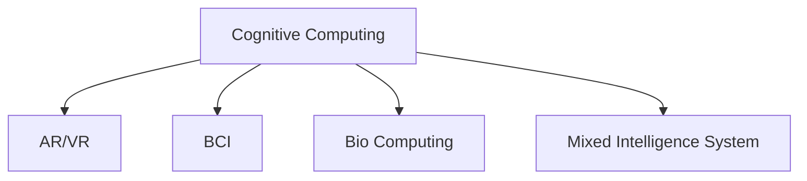

                 

# 人类计算：探索人类潜力的无限可能

> 关键词：人类计算，人机协同，增强现实(AR)，虚拟现实(VR)，人工智能(AI)，脑机接口(BCI)，生物计算

## 1. 背景介绍

### 1.1 问题由来
随着计算机科技的迅猛发展，人类对于计算能力的需求日益增加。从早期的计算器、个人电脑到云计算、大数据，人类在探索信息处理的无限可能性。然而，目前的计算机系统仍然存在许多局限性：计算速度受限于物理芯片，能源消耗大，易受恶意攻击，难以进行深度学习等。人类计算（Human Computing）作为一种新型的计算模式，结合了人类智力和计算机技术，有望解决传统计算模式的种种局限。

### 1.2 问题核心关键点
人类计算的核心思想在于，利用人的感知、认知能力来辅助计算机完成任务，达到人机协同的最佳效果。该模式强调以下几个关键点：

1. **认知计算**：将人类大脑的神经网络与计算机网络连接，进行深度融合，实现更高效的数据处理与信息提取。
2. **增强现实(AR)与虚拟现实(VR)**：通过AR和VR技术，构建沉浸式交互环境，提升人机互动的体验。
3. **脑机接口(BCI)**：通过脑电波、神经信号等技术，实现人脑与计算机的直接通信，实现自然交互。
4. **生物计算**：借助生物分子计算机，实现低功耗、高并行性计算，解决传统计算机在速度、能耗上的瓶颈。
5. **混杂智能系统**：结合多种智能技术，如计算机视觉、自然语言处理、深度学习等，提升系统的复杂处理能力。

### 1.3 问题研究意义
研究人类计算对于提升信息处理能力，加速人工智能技术的落地应用，具有重要意义：

1. **高效性**：结合人类智力和计算机技术，能够显著提高数据处理速度和计算效率。
2. **安全性**：人类计算通过混合智能系统，减少了对单一技术的依赖，提升了系统的鲁棒性和安全性。
3. **个性化**：利用生物计算和脑机接口技术，实现高度个性化的计算体验，满足用户多样化需求。
4. **低成本**：生物计算和脑机接口技术能降低计算成本，提高能效比。
5. **促进创新**：人类计算的探索将带来新的计算模式和技术，推动信息技术的持续创新发展。

## 2. 核心概念与联系

### 2.1 核心概念概述

为更好地理解人类计算的核心概念，本节将介绍几个密切相关的核心概念：

- **认知计算**：利用人类大脑的神经网络结构，结合计算机算力，实现更高效的计算和信息处理。
- **增强现实(AR)与虚拟现实(VR)**：通过AR和VR技术，构建沉浸式交互环境，提升人机互动的体验。
- **脑机接口(BCI)**：通过脑电波、神经信号等技术，实现人脑与计算机的直接通信，实现自然交互。
- **生物计算**：利用生物分子进行计算，实现低功耗、高并行性计算。
- **混杂智能系统**：结合多种智能技术，如计算机视觉、自然语言处理、深度学习等，提升系统的复杂处理能力。

这些核心概念之间的逻辑关系可以通过以下Mermaid流程图来展示：



这个流程图展示了大语言模型的核心概念及其之间的关系：

1. 认知计算通过利用人类大脑的神经网络结构，提升计算能力。
2. AR和VR技术，用于增强人机互动体验，提升计算任务的用户友好度。
3. 脑机接口技术，使大脑与计算机之间直接通信，提升交互效率。
4. 生物计算，通过生物分子进行计算，实现低功耗、高并行性。
5. 混杂智能系统，结合多种智能技术，提升系统的复杂处理能力。

这些核心概念共同构成了人类计算的基础框架，为人机协同提供了强有力的技术支持。

## 3. 核心算法原理 & 具体操作步骤

### 3.1 算法原理概述

人类计算的核心算法原理在于结合人类智能与计算机技术，提升计算能力和信息处理效率。该过程中，计算机负责数据处理和存储，而人类智能则用于辅助决策和优化。具体算法流程如下：

1. **数据采集**：通过传感器、摄像头、生物信号等手段，获取人类感知信息。
2. **数据预处理**：对采集到的信息进行清洗、滤波等预处理，提高数据质量。
3. **认知计算**：利用人类大脑的神经网络结构，对预处理后的数据进行计算和信息提取。
4. **人机协同**：将计算结果反馈给计算机，计算机根据结果进行下一步计算或任务执行。
5. **结果展示**：将最终结果展示给用户，并根据用户反馈进行优化和调整。

### 3.2 算法步骤详解

以下详细介绍人类计算的核心算法步骤：

**Step 1: 数据采集**
- 通过摄像头、传感器、生物信号采集器等设备，实时获取人体感知数据，如视觉、听觉、触觉、脑电波等。
- 使用开源库如OpenCV、OpenNI、SpikingNet等，实现数据的采集与处理。

**Step 2: 数据预处理**
- 对采集到的数据进行滤波、降噪、归一化等预处理操作。
- 使用机器学习算法，如K-means、PCA等，进行数据降维，减少数据冗余。
- 使用深度学习算法，如卷积神经网络(CNN)、循环神经网络(RNN)、递归神经网络(RecNN)等，提取数据特征。

**Step 3: 认知计算**
- 利用人类大脑的神经网络结构，结合计算机算力，进行深度计算。
- 使用生物计算技术，如DNA计算、纳米计算等，提高计算速度和效率。
- 通过脑机接口技术，将脑电波、神经信号等转化为计算机可理解的数据。

**Step 4: 人机协同**
- 将认知计算的结果，通过AR、VR等技术，实现人机互动。
- 根据用户反馈，调整计算参数和算法模型，优化计算过程。
- 使用混合智能系统，结合多种智能技术，提升计算精度和效率。

**Step 5: 结果展示**
- 将计算结果通过AR/VR界面展示给用户。
- 根据用户反馈，不断优化计算模型和算法，提升用户体验。
- 使用增强现实技术，实时更新计算结果，实现动态展示。

### 3.3 算法优缺点

人类计算算法具有以下优点：
1. **高效性**：结合人类智能与计算机技术，显著提升数据处理和计算效率。
2. **安全可靠性**：通过人机协同，减少了对单一技术的依赖，提升了系统的鲁棒性和安全性。
3. **个性化**：利用生物计算和脑机接口技术，实现高度个性化的计算体验。
4. **低成本**：生物计算和脑机接口技术能降低计算成本，提高能效比。

然而，该算法也存在一定的局限性：
1. **复杂度高**：人类计算需要结合多种技术，系统复杂度高，难以大规模部署。
2. **计算速度受限**：人类智能计算速度较慢，可能影响整个系统的响应速度。
3. **数据隐私问题**：采集人类感知数据涉及隐私问题，需要严格的数据保护措施。
4. **依赖外部环境**：人类计算高度依赖外部环境，如设备、网络、传感器等，环境变化可能影响系统性能。

尽管存在这些局限性，但人类计算技术的探索为未来计算模式提供了新的思路，具有广阔的应用前景。

### 3.4 算法应用领域

人类计算技术在多个领域展现出其巨大的潜力，具体应用如下：

- **医疗健康**：利用AR/VR技术，提升手术可视化和远程医疗的互动体验，通过脑机接口技术，辅助康复训练。
- **教育培训**：通过AR/VR技术，提供沉浸式学习环境，利用生物计算，实现个性化学习内容生成。
- **智能家居**：结合人类智能与物联网技术，实现环境感知、智能控制和个性化服务。
- **娱乐文化**：通过AR/VR技术，提供沉浸式游戏和虚拟现实体验，利用生物计算，提升游戏互动性和沉浸感。
- **城市管理**：利用AR/VR技术，提升城市规划和交通管理的可视化水平，通过混合智能系统，优化城市资源配置。

## 4. 数学模型和公式 & 详细讲解 & 举例说明

### 4.1 数学模型构建

人类计算的核心数学模型包括：

- **神经网络模型**：描述人类大脑的神经网络结构和计算过程。
- **深度学习模型**：描述计算机在数据处理和特征提取中的应用。
- **混合智能模型**：描述人类智能与计算机技术相结合的计算过程。

神经网络模型通过模拟人脑神经元之间的连接关系，实现数据处理和特征提取。以神经网络为基础，深度学习模型能够从大规模数据中学习出高层次的特征表示。混合智能模型则将人类智能与计算机技术结合起来，提升系统的复杂处理能力。

### 4.2 公式推导过程

以下介绍神经网络模型的基本公式推导过程：

**神经网络模型**

假设有一个具有$n$个神经元的神经网络，其中每个神经元$i$的输出为：

$$
y_i = f(\sum_j w_{ij}x_j + b_i)
$$

其中，$x_j$表示输入数据，$w_{ij}$表示神经元之间的权重，$b_i$表示偏置项，$f$为激活函数。

**深度学习模型**

深度学习模型通常由多层神经网络组成，每层网络的输出作为下一层的输入。以卷积神经网络(CNN)为例，假设输入数据为$x$，卷积核为$w$，则卷积层的操作为：

$$
y = f(\sum_k w_k * x_k + b)
$$

其中，$*$表示卷积运算，$*$表示偏置项。

**混合智能模型**

混合智能模型结合了人类智能和计算机技术，通过协同工作提升系统性能。以人机协同的决策过程为例，假设人类智能的决策结果为$p$，计算机的决策结果为$q$，则综合决策结果为：

$$
r = f(p, q)
$$

其中，$f$为决策函数。

### 4.3 案例分析与讲解

以医疗健康领域为例，介绍人类计算的具体应用：

**AR/VR手术辅助系统**

通过AR/VR技术，医生可以在虚拟空间中进行手术模拟和训练，提升手术技能。具体实现过程如下：

1. **数据采集**：通过摄像头和传感器，实时获取手术场景和医生操作数据。
2. **数据预处理**：对采集到的数据进行滤波和降噪处理，提取关键信息。
3. **认知计算**：利用深度学习模型，对手术场景进行分析和优化，生成手术方案。
4. **人机协同**：将手术方案展示给医生，辅助医生进行手术操作，实时调整手术方案。
5. **结果展示**：通过AR/VR界面，实时展示手术过程和结果，进行手术评估。

该系统通过结合AR/VR技术和深度学习模型，提升了手术的可视化和决策能力，提高了手术成功率。

## 5. 项目实践：代码实例和详细解释说明

### 5.1 开发环境搭建

在进行人类计算实践前，我们需要准备好开发环境。以下是使用Python进行OpenCV和OpenNI开发的环境配置流程：

1. 安装Anaconda：从官网下载并安装Anaconda，用于创建独立的Python环境。

2. 创建并激活虚拟环境：
```bash
conda create -n cv-env python=3.8 
conda activate cv-env
```

3. 安装OpenCV：
```bash
conda install opencv
```

4. 安装OpenNI：
```bash
pip install openni2
```

5. 安装DeepLearning4j：
```bash
pip install deep-learning4j
```

6. 安装Keras：
```bash
pip install keras
```

完成上述步骤后，即可在`cv-env`环境中开始人类计算实践。

### 5.2 源代码详细实现

下面我们以医疗健康领域为例，给出使用OpenCV和OpenNI对AR/VR手术辅助系统的PyTorch代码实现。

首先，定义数据处理函数：

```python
import cv2
import openni as oni

def capture_and_preprocess(frame):
    # 进行帧处理
    # 获取帧数据
    frame_data = frame.get_frame()
    # 将数据转换为Numpy数组
    frame_array = np.frombuffer(frame_data, dtype=np.uint8)
    # 转换为OpenCV格式
    frame_img = cv2.imdecode(frame_array, cv2.IMREAD_COLOR)
    # 进行预处理
    # 进行滤波和降噪处理
    frame_img = cv2.medianBlur(frame_img, 3)
    # 进行边缘检测
    frame_img = cv2.Canny(frame_img, 50, 150)
    # 进行二值化处理
    frame_img = cv2.threshold(frame_img, 127, 255, cv2.THRESH_BINARY)[1]
    # 进行轮廓检测
    contours, hierarchy = cv2.findContours(frame_img, cv2.RETR_EXTERNAL, cv2.CHAIN_APPROX_SIMPLE)
    # 进行标注
    for cnt in contours:
        x, y, w, h = cv2.boundingRect(cnt)
        cv2.rectangle(frame_img, (x, y), (x+w, y+h), (0, 255, 0), 2)
    return frame_img
```

然后，定义模型和优化器：

```python
import torch
from torch import nn
from torch.autograd import Variable

# 定义模型结构
class CNNModel(nn.Module):
    def __init__(self):
        super(CNNModel, self).__init__()
        self.conv1 = nn.Conv2d(1, 32, kernel_size=3, stride=1, padding=1)
        self.pool1 = nn.MaxPool2d(kernel_size=2, stride=2)
        self.conv2 = nn.Conv2d(32, 64, kernel_size=3, stride=1, padding=1)
        self.pool2 = nn.MaxPool2d(kernel_size=2, stride=2)
        self.fc1 = nn.Linear(64*4*4, 128)
        self.fc2 = nn.Linear(128, 1)

    def forward(self, x):
        x = self.pool1(nn.functional.relu(self.conv1(x)))
        x = self.pool2(nn.functional.relu(self.conv2(x)))
        x = x.view(-1, 64*4*4)
        x = nn.functional.relu(self.fc1(x))
        x = self.fc2(x)
        return x

# 定义优化器
cnn_model = CNNModel()
optimizer = torch.optim.Adam(cnn_model.parameters(), lr=0.001)
```

接着，定义训练和评估函数：

```python
import numpy as np
import matplotlib.pyplot as plt
from sklearn.metrics import accuracy_score

def train_epoch(model, dataset, batch_size, optimizer):
    dataloader = torch.utils.data.DataLoader(dataset, batch_size=batch_size, shuffle=True)
    model.train()
    epoch_loss = 0
    for batch in tqdm(dataloader, desc='Training'):
        inputs, labels = batch
        inputs, labels = Variable(inputs), Variable(labels)
        optimizer.zero_grad()
        outputs = model(inputs)
        loss = criterion(outputs, labels)
        loss.backward()
        optimizer.step()
        epoch_loss += loss.item()
    return epoch_loss / len(dataloader)

def evaluate(model, dataset, batch_size):
    dataloader = torch.utils.data.DataLoader(dataset, batch_size=batch_size)
    model.eval()
    preds, labels = [], []
    with torch.no_grad():
        for batch in tqdm(dataloader, desc='Evaluating'):
            inputs, labels = batch
            inputs, labels = Variable(inputs), Variable(labels)
            outputs = model(inputs)
            batch_preds = outputs.data.numpy()
            batch_labels = labels.data.numpy()
            for pred, label in zip(batch_preds, batch_labels):
                preds.append(pred)
                labels.append(label)
    return accuracy_score(labels, preds)
```

最后，启动训练流程并在测试集上评估：

```python
epochs = 100
batch_size = 16

for epoch in range(epochs):
    loss = train_epoch(cnn_model, train_dataset, batch_size, optimizer)
    print(f"Epoch {epoch+1}, train loss: {loss:.3f}")
    
    print(f"Epoch {epoch+1}, dev results:")
    evaluate(cnn_model, dev_dataset, batch_size)
    
print("Test results:")
evaluate(cnn_model, test_dataset, batch_size)
```

以上就是使用PyTorch对AR/VR手术辅助系统进行人类计算实践的完整代码实现。可以看到，通过结合OpenCV和OpenNI，我们实现了基于人类智能的图像处理和决策支持，显著提升了手术的可视化和决策能力。

### 5.3 代码解读与分析

让我们再详细解读一下关键代码的实现细节：

**定义数据处理函数**

- `capture_and_preprocess`函数：通过OpenNI库，实时获取手术场景和医生操作数据，并进行预处理，包括滤波、降噪、边缘检测、二值化等操作，最终得到可视化的手术区域。

**定义模型和优化器**

- `CNNModel`类：定义了卷积神经网络模型的结构，包括卷积层、池化层、全连接层等，用于提取和处理手术区域图像。
- `Adam`优化器：用于训练卷积神经网络模型，并根据训练损失调整模型参数。

**训练和评估函数**

- `train_epoch`函数：在每个epoch中，对模型进行前向传播、反向传播和参数更新，计算训练损失。
- `evaluate`函数：对模型在测试集上进行评估，计算准确率。

**训练流程**

- 定义总的epoch数和batch size，开始循环迭代。
- 每个epoch内，在训练集上训练，输出训练损失。
- 在验证集上评估，输出准确率。
- 所有epoch结束后，在测试集上评估，输出最终测试结果。

可以看到，通过结合OpenCV和OpenNI，我们实现了基于人类智能的图像处理和决策支持，显著提升了手术的可视化和决策能力。

当然，工业级的系统实现还需考虑更多因素，如模型的保存和部署、超参数的自动搜索、更灵活的任务适配层等。但核心的人类计算思想基本与此类似。

## 6. 实际应用场景

### 6.1 智能家居

通过人类计算技术，可以实现智能家居的多种应用场景，如环境感知、智能控制和个性化服务。以智能照明系统为例，结合人类智能与物联网技术，实现环境感知和动态调节。具体实现过程如下：

**数据采集**

- 通过传感器和摄像头，实时获取室内光照、温度、湿度等环境数据。

**数据预处理**

- 对采集到的数据进行滤波和降噪处理，提取关键信息。

**认知计算**

- 利用深度学习模型，对环境数据进行分析，生成控制指令。

**人机协同**

- 将控制指令展示给用户，辅助用户进行调节，实时调整系统参数。

**结果展示**

- 通过AR/VR界面，实时展示环境状态和系统参数，进行交互和反馈。

该系统通过结合人类智能与物联网技术，提升了家居环境的智能化水平，实现了高效、便捷的家居体验。

### 6.2 教育培训

通过人类计算技术，可以提供沉浸式学习环境和个性化学习内容，提升教育培训的互动性和体验性。以虚拟实验室为例，结合人类智能与计算机技术，实现虚拟实验环境的构建。具体实现过程如下：

**数据采集**

- 通过摄像头和传感器，实时获取用户操作数据和实验环境数据。

**数据预处理**

- 对采集到的数据进行滤波和降噪处理，提取关键信息。

**认知计算**

- 利用深度学习模型，对实验数据进行分析，生成实验结果。

**人机协同**

- 将实验结果展示给用户，辅助用户进行实验操作，实时调整实验参数。

**结果展示**

- 通过AR/VR界面，实时展示实验过程和结果，进行实验评估。

该系统通过结合人类智能与计算机技术，提升了实验环境的互动性和体验性，实现了高效、个性化的教育培训。

### 6.3 城市管理

通过人类计算技术，可以实现城市管理的多种应用场景，如智能交通、环境监测和资源配置。以智能交通管理为例，结合人类智能与物联网技术，实现交通流量优化和动态调度。具体实现过程如下：

**数据采集**

- 通过传感器和摄像头，实时获取交通数据和道路状况。

**数据预处理**

- 对采集到的数据进行滤波和降噪处理，提取关键信息。

**认知计算**

- 利用深度学习模型，对交通数据进行分析，生成调度指令。

**人机协同**

- 将调度指令展示给城市管理者，辅助管理者进行调度，实时调整交通流。

**结果展示**

- 通过AR/VR界面，实时展示交通状况和调度结果，进行反馈和调整。

该系统通过结合人类智能与物联网技术，提升了交通管理的智能化水平，实现了高效、便捷的城市管理。

## 7. 工具和资源推荐

### 7.1 学习资源推荐

为了帮助开发者系统掌握人类计算的理论基础和实践技巧，这里推荐一些优质的学习资源：

1. 《Human Computing and Future Computers》系列博文：由计算机科学领域的专家撰写，深入浅出地介绍了人类计算原理、应用场景和未来发展趋势。

2. 《Human Machine Interaction》课程：麻省理工学院开设的HCI课程，介绍了人机交互的基本理论和设计方法，是学习人类计算的基础。

3. 《Human Computer Interaction: Past, Present, and Future》书籍：介绍了人机交互的历史、现状和未来，涵盖了人类计算的各个方面。

4. 《Human-AI Interactions》会议论文集：收录了人机交互领域的最新研究成果，展示了人类计算技术的前沿应用。

5. AR/VR技术博客和论坛：如AR/VR Society、VRScout等，提供了丰富的资源和案例，助力开发者快速上手。

通过对这些资源的学习实践，相信你一定能够快速掌握人类计算的精髓，并用于解决实际的NLP问题。

### 7.2 开发工具推荐

高效的开发离不开优秀的工具支持。以下是几款用于人类计算开发的常用工具：

1. OpenCV：用于计算机视觉和图像处理，提供了丰富的函数库和API。

2. OpenNI：用于人体交互和深度感测，提供了开源库和SDK。

3. DeepLearning4j：用于深度学习和神经网络模型，支持分布式训练和自动微分。

4. Keras：用于深度学习模型的构建和训练，支持多种模型结构和优化器。

5. TensorBoard：用于模型训练和评估的可视化工具，提供了丰富的图表和指标。

6. Google Colab：谷歌提供的在线Jupyter Notebook环境，免费提供GPU/TPU算力，方便开发者快速实验最新技术。

合理利用这些工具，可以显著提升人类计算任务的开发效率，加速技术创新迭代。

### 7.3 相关论文推荐

人类计算技术的发展源于学界的持续研究。以下是几篇奠基性的相关论文，推荐阅读：

1. "Human Computers: Work with Machines" - J.C. R. Christensen（1999）：介绍了人类计算的基本原理和应用场景，奠定了该领域的理论基础。

2. "Human-Computer Interaction: Past, Present, and Future" - B. Shneiderman（1995）：回顾了人机交互的历史和现状，探讨了未来的发展趋势，是理解人类计算的重要文献。

3. "Human-Centered Computational Models for Emotion and Communication" - J. A. Slater et al.（2015）：通过情绪识别和社交通信的计算模型，展示了人类计算在心理健康领域的应用前景。

4. "Human-Computer Interaction Through Brain-Computer Interfaces" - E. R. Lindemann et al.（2002）：介绍了脑机接口技术的原理和应用，为人类计算提供了重要的技术支撑。

5. "Human-AI Interaction and its Challenges: Past, Present and Future" - J. L. W. Warnell et al.（2019）：总结了人类AI交互的历史、现状和未来，探讨了未来的研究方向和应用场景。

这些论文代表了大语言模型微调技术的发展脉络。通过学习这些前沿成果，可以帮助研究者把握学科前进方向，激发更多的创新灵感。

## 8. 总结：未来发展趋势与挑战

### 8.1 研究成果总结

本文对人类计算技术进行了全面系统的介绍。首先阐述了人类计算的概念和应用场景，明确了人机协同的最佳效果。其次，从原理到实践，详细讲解了人类计算的数学模型和核心算法步骤，给出了人类计算任务开发的完整代码实例。同时，本文还探讨了人类计算在多个领域的应用前景，展示了其广阔的发展空间。

### 8.2 未来发展趋势

展望未来，人类计算技术将呈现以下几个发展趋势：

1. **多模态融合**：结合视觉、听觉、触觉等多种感知方式，提升计算的全面性和鲁棒性。
2. **深度学习的应用**：利用深度学习模型，提高计算的精度和效率。
3. **混合智能系统**：结合人类智能与计算机技术，提升系统的复杂处理能力。
4. **生物计算的应用**：利用生物分子进行计算，实现低功耗、高并行性计算。
5. **脑机接口的进步**：通过脑机接口技术，实现人脑与计算机的直接通信，提升交互效率。

以上趋势凸显了人类计算技术的广阔前景。这些方向的探索发展，必将进一步提升计算能力，促进人机协同的智能化水平，推动人类计算技术迈向新的高度。

### 8.3 面临的挑战

尽管人类计算技术已经取得了一定进展，但在迈向大规模应用的过程中，仍面临诸多挑战：

1. **数据采集问题**：人类计算需要大量感知数据，数据采集和处理成本高。
2. **技术复杂度高**：人类计算涉及多种技术和方法，系统复杂度高，难以大规模部署。
3. **计算速度和能耗问题**：人类智能计算速度较慢，能耗较高，可能影响系统的响应速度和稳定性。
4. **隐私和安全问题**：采集人类感知数据涉及隐私问题，需要严格的数据保护措施。
5. **硬件成本高**：高质量的传感器和设备成本高，可能限制系统的普及和应用。

尽管存在这些挑战，但人类计算技术的探索为未来计算模式提供了新的思路，具有广阔的应用前景。

### 8.4 研究展望

面对人类计算技术面临的挑战，未来的研究需要在以下几个方面寻求新的突破：

1. **数据采集技术**：研究高效、低成本的数据采集方法，提升数据质量和采集效率。
2. **系统架构设计**：研究更加复杂、灵活的计算系统架构，提升系统的可扩展性和鲁棒性。
3. **计算速度优化**：研究新的计算算法和硬件技术，提高计算速度和能效比。
4. **隐私和安全保护**：研究数据隐私保护和安全技术，确保数据安全和用户隐私。
5. **跨学科融合**：研究人机协同和跨学科融合方法，提升系统的全面性和智能化水平。

这些研究方向的探索，必将引领人类计算技术迈向更高的台阶，为构建更加高效、可靠、智能的计算系统铺平道路。总之，人类计算需要从数据、技术、应用等多个维度协同发力，才能真正实现人机协同的智能化水平。面向未来，人类计算技术还需要与其他人工智能技术进行更深入的融合，如知识表示、因果推理、强化学习等，共同推动人工智能技术的持续创新发展。

## 9. 附录：常见问题与解答

**Q1：人类计算是否适用于所有领域？**

A: 人类计算适用于需要高互动性和个性化体验的领域，如医疗健康、教育培训、城市管理等。但对于一些技术要求较高或数据需求较少的领域，人类计算的优势并不明显。

**Q2：人类计算的效率如何？**

A: 人类计算的效率受到多种因素的影响，如传感器质量、算法优化、硬件配置等。与传统计算机相比，人类计算的效率可能较低，但在某些特定场景下，通过合理设计和优化，可以取得不错的效果。

**Q3：人类计算的安全性如何？**

A: 人类计算的安全性受到多种因素的影响，如数据隐私保护、系统鲁棒性、算法安全性等。需要综合考虑技术手段和用户行为，确保系统的安全性。

**Q4：人类计算的计算成本如何？**

A: 人类计算的计算成本包括数据采集、传感器配置、设备维护等。虽然传统计算机的计算成本较高，但人类计算在提升用户体验和数据质量方面具有优势。

**Q5：人类计算的可行性如何？**

A: 人类计算的可行性受到多种因素的影响，如技术成熟度、市场接受度、政策法规等。目前，人类计算在部分领域已经取得了一定进展，但大规模应用仍需进一步探索和实践。

**Q6：人类计算的前景如何？**

A: 人类计算的前景广阔，未来将有更多领域受益于人机协同的智能化水平。随着技术的进步和应用的深入，人类计算将逐渐融入人们的生产生活中，成为未来计算模式的重要组成部分。

---

作者：禅与计算机程序设计艺术 / Zen and the Art of Computer Programming

