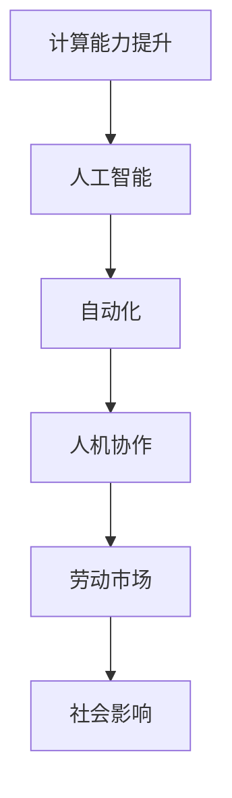

                 

# 人类计算：未来工作的影响

> 关键词：计算能力提升, 人工智能, 自动化, 人机协作, 劳动市场, 社会影响

## 1. 背景介绍

在过去的几十年中，人类社会的计算能力发生了翻天覆地的变化。从个人计算机到移动设备，从数据中心到云计算，计算能力的提升极大地改变了我们的工作方式和生活习惯。而随着人工智能(AI)技术的迅猛发展，尤其是机器学习和深度学习技术的突破，计算能力已经超出了人类想象，进一步推动了各行各业的变革。

AI技术的广泛应用，尤其是在计算密集型任务中的自动化和智能化，已经开始对人类的工作产生深远影响。一方面，AI提升了工作效率，解放了人类从繁琐、重复的工作中解脱出来，专注于更有创造性和战略性的任务。另一方面，AI的出现也带来了新的挑战，如就业结构变化、技能需求转变等。

本文将从技术、社会、经济等多个角度，深入探讨AI计算能力提升对未来工作的影响，帮助读者理解这种变革的本质和可能带来的机遇与挑战。

## 2. 核心概念与联系

### 2.1 核心概念概述

为了更好地理解AI计算能力提升对工作的影响，我们需要掌握几个关键概念：

- **计算能力提升**：指计算速度、存储容量、处理效率等方面的技术进步。这些进步极大地拓展了人类能处理的数据规模和复杂度，使得AI技术能够应对更多、更复杂的任务。

- **人工智能**：指通过算法和模型，使机器能够模仿人类智能行为的技术。包括机器学习、深度学习、自然语言处理、计算机视觉等多个领域。

- **自动化**：指利用AI技术，自动完成某些具体任务，替代人类手动操作。自动化提升了效率，降低了错误率，但也可能导致工作岗位的减少。

- **人机协作**：指人类与AI系统协同完成复杂任务的模式。这种协作模式要求人类与AI各自发挥所长，共同完成目标。

- **劳动市场**：指各类劳动力供需的场所，包括全职、兼职、临时工等多种形式。AI的引入改变了劳动市场的结构，促使技能需求和就业机会发生改变。

- **社会影响**：指AI技术在改变工作效率的同时，对社会结构、伦理道德、就业政策等方面产生的深远影响。

这些概念之间的联系可以简单地用以下Mermaid流程图表示：


这个流程图展示了计算能力的提升是如何通过AI技术实现自动化，进而促进人机协作，最终影响劳动市场和社会结构的过程。

### 2.2 核心概念原理和架构的 Mermaid 流程图



这个简单的流程图展示了从计算能力提升到社会影响的一系列因果关系。接下来，我们将深入探讨这些概念的原理和应用架构。

## 3. 核心算法原理 & 具体操作步骤

### 3.1 算法原理概述

AI计算能力提升的核心在于算法的优化和硬件的进步。具体而言，有以下几个关键点：

- **算法优化**：通过机器学习和深度学习的算法优化，提升了模型训练和推理的效率。这些算法包括卷积神经网络(CNN)、循环神经网络(RNN)、变换器(Transformer)等。

- **硬件进步**：GPU、TPU等加速计算硬件的普及，极大地提升了数据处理和模型训练的速度。这使得更复杂的模型能够被训练和部署。

- **数据驱动**：大数据技术的发展使得更多的数据可以用于模型的训练，提升了模型的泛化能力和表现。

### 3.2 算法步骤详解

AI计算能力提升的具体操作步骤可以分为以下几个阶段：

**步骤1：数据准备**
- 收集和预处理数据，确保数据的质量和多样性。

**步骤2：模型设计**
- 选择合适的算法架构，如CNN、RNN、Transformer等，设计模型的结构和参数。

**步骤3：模型训练**
- 利用计算能力在GPU或TPU上训练模型，调整参数以优化损失函数。

**步骤4：模型评估**
- 在验证集上评估模型性能，选择合适的评估指标，如准确率、召回率、F1分数等。

**步骤5：模型部署**
- 将训练好的模型部署到实际应用场景中，进行推理和预测。

**步骤6：持续优化**
- 根据实际应用反馈，对模型进行微调，提升其性能和鲁棒性。

### 3.3 算法优缺点

AI计算能力提升带来了许多优点，但也存在一些缺点：

**优点：**
- **效率提升**：自动化和智能化操作极大地提升了工作效率，减少了人为错误。
- **处理能力增强**：可以处理海量数据和复杂任务，解决传统方法难以应对的问题。
- **创新驱动**：新的算法和模型不断涌现，推动技术进步和行业变革。

**缺点：**
- **技能需求变化**：AI技术的应用导致传统技能需求下降，新兴技能需求上升，对劳动力的技能要求提高。
- **就业结构变化**：自动化可能导致某些岗位减少，但同时也会创造新的岗位需求。
- **伦理道德问题**：AI的决策过程缺乏透明度，可能导致偏见和歧视，引发伦理争议。

### 3.4 算法应用领域

AI计算能力提升的应用领域非常广泛，涵盖了多个行业：

- **医疗**：AI用于诊断、治疗、药物研发等，提升医疗服务的精准性和效率。

- **金融**：AI用于风险管理、投资策略、客户服务等，优化金融决策和用户体验。

- **制造**：AI用于生产调度、质量控制、设备维护等，提升生产效率和产品质量。

- **物流**：AI用于路径规划、配送优化、库存管理等，提升物流效率和客户满意度。

- **零售**：AI用于需求预测、个性化推荐、客户关系管理等，提升零售业的销售和客户体验。

这些领域的应用展示了AI计算能力提升的巨大潜力，同时也预示着未来的发展方向。

## 4. 数学模型和公式 & 详细讲解 & 举例说明

### 4.1 数学模型构建

在AI计算能力提升的过程中，数学模型扮演了核心角色。以下是一些关键的数学模型和公式：

- **神经网络模型**：由多个神经元组成的非线性模型，用于模拟人脑的神经网络结构。

- **卷积神经网络(CNN)**：一种特殊的神经网络，适用于图像和信号处理任务。

- **循环神经网络(RNN)**：能够处理序列数据的神经网络，适用于时间序列预测和自然语言处理。

- **Transformer模型**：一种基于自注意力机制的神经网络，适用于大规模语言模型和大规模序列数据处理。

### 4.2 公式推导过程

以Transformer模型为例，其核心公式如下：

$$
\text{Attention}(Q, K, V) = \text{Softmax}(\frac{QK^T}{\sqrt{d_k}})V
$$

其中，$Q, K, V$分别表示查询向量、键向量和值向量，$\text{Softmax}$表示softmax函数。该公式表示在输入序列中计算注意力权重，选择最相关的部分进行加权求和，生成新的表示。

### 4.3 案例分析与讲解

以图像识别任务为例，卷积神经网络(CNN)在处理图像时，通过卷积操作提取图像的局部特征，再通过池化操作减少特征维度，最终通过全连接层输出分类结果。

以下是使用PyTorch实现CNN模型的代码示例：

```python
import torch
import torch.nn as nn
import torch.nn.functional as F

class CNN(nn.Module):
    def __init__(self):
        super(CNN, self).__init__()
        self.conv1 = nn.Conv2d(3, 32, 3)
        self.conv2 = nn.Conv2d(32, 64, 3)
        self.fc1 = nn.Linear(64 * 28 * 28, 128)
        self.fc2 = nn.Linear(128, 10)
        
    def forward(self, x):
        x = F.relu(self.conv1(x))
        x = F.max_pool2d(x, 2)
        x = F.relu(self.conv2(x))
        x = F.max_pool2d(x, 2)
        x = x.view(-1, 64 * 28 * 28)
        x = F.relu(self.fc1(x))
        x = self.fc2(x)
        return x
```

此代码展示了CNN模型从卷积、池化到全连接层的整个过程，利用神经网络实现图像分类任务。

## 5. 项目实践：代码实例和详细解释说明

### 5.1 开发环境搭建

要进行AI计算能力提升的项目实践，我们需要搭建一个适合深度学习和模型训练的环境。以下是一些常用的开发环境：

- **Python**：深度学习的首选语言，提供了丰富的科学计算库。
- **PyTorch**：一个强大的深度学习框架，提供了自动微分、动态计算图等特性。
- **TensorFlow**：另一个流行的深度学习框架，提供了静态计算图和分布式训练等特性。
- **Jupyter Notebook**：一个交互式的开发环境，方便编写和调试代码。
- **GPU和TPU**：用于加速计算，提升训练速度。

### 5.2 源代码详细实现

以图像识别任务为例，以下是使用PyTorch实现CNN模型的代码：

```python
import torch
import torch.nn as nn
import torch.nn.functional as F

class CNN(nn.Module):
    def __init__(self):
        super(CNN, self).__init__()
        self.conv1 = nn.Conv2d(3, 32, 3)
        self.conv2 = nn.Conv2d(32, 64, 3)
        self.fc1 = nn.Linear(64 * 28 * 28, 128)
        self.fc2 = nn.Linear(128, 10)
        
    def forward(self, x):
        x = F.relu(self.conv1(x))
        x = F.max_pool2d(x, 2)
        x = F.relu(self.conv2(x))
        x = F.max_pool2d(x, 2)
        x = x.view(-1, 64 * 28 * 28)
        x = F.relu(self.fc1(x))
        x = self.fc2(x)
        return x
```

此代码展示了CNN模型从卷积、池化到全连接层的整个过程，利用神经网络实现图像分类任务。

### 5.3 代码解读与分析

**代码解读：**
- `nn.Conv2d`：定义卷积层，输入通道数为3（RGB），输出通道数为32。
- `nn.Linear`：定义全连接层，输入维度为64 * 28 * 28，输出维度为128。
- `F.relu`：定义ReLU激活函数。
- `forward`：定义前向传播过程，输入图片经过卷积、池化、全连接层后输出分类结果。

**代码分析：**
- 卷积层用于提取图像的局部特征，池化层用于减少特征维度，全连接层用于分类。
- CNN模型通过多层次的卷积和池化，逐步提取和抽象图像特征，最终输出分类结果。

### 5.4 运行结果展示

在训练和测试数据上运行CNN模型，可以验证其准确率和性能表现：

```python
# 训练过程
model.train()
for epoch in range(10):
    for i, (images, labels) in enumerate(train_loader):
        images = images.view(-1, 28, 28)
        labels = labels
        outputs = model(images)
        loss = F.cross_entropy(outputs, labels)
        optimizer.zero_grad()
        loss.backward()
        optimizer.step()

# 测试过程
model.eval()
correct = 0
total = 0
with torch.no_grad():
    for images, labels in test_loader:
        images = images.view(-1, 28, 28)
        outputs = model(images)
        _, predicted = torch.max(outputs.data, 1)
        total += labels.size(0)
        correct += (predicted == labels).sum().item()

print('Accuracy: {:.2f}%'.format(100 * correct / total))
```

此代码展示了训练和测试过程中模型的准确率和损失函数变化。

## 6. 实际应用场景

### 6.1 医疗

在医疗领域，AI计算能力提升主要应用于疾病诊断、治疗方案优化和药物研发。例如，使用深度学习模型对医学影像进行分析，可以显著提高疾病的早期诊断率。利用自然语言处理技术，可以自动分析病历和文献，生成个性化的治疗方案。

### 6.2 金融

在金融领域，AI计算能力提升主要应用于风险管理、投资策略和客户服务。例如，使用AI模型进行市场预测和风险评估，可以提升投资决策的精准性。利用聊天机器人等自然语言处理技术，可以提供24/7的客户服务，提升用户体验。

### 6.3 制造

在制造领域，AI计算能力提升主要应用于生产调度、质量控制和设备维护。例如，使用机器学习模型进行生产线的优化调度，可以提升生产效率。利用计算机视觉技术，可以实时监控生产过程中的质量问题，提高产品质量。

### 6.4 物流

在物流领域，AI计算能力提升主要应用于路径规划、配送优化和库存管理。例如，使用AI模型进行路径规划，可以优化配送路线，提升配送效率。利用机器学习模型进行库存管理，可以预测需求，减少库存成本。

### 6.5 零售

在零售领域，AI计算能力提升主要应用于需求预测、个性化推荐和客户关系管理。例如，使用AI模型进行需求预测，可以提升库存管理效率。利用自然语言处理技术，可以生成个性化的推荐内容，提升用户购买率。

## 7. 工具和资源推荐

### 7.1 学习资源推荐

为了帮助开发者深入学习AI计算能力提升的相关知识，以下是一些推荐的资源：

- **《深度学习》(Deep Learning)书籍**：Ian Goodfellow等著，系统介绍了深度学习的理论和应用。
- **《Python深度学习》(Deep Learning with Python)书籍**：Francois Chollet等著，介绍了使用PyTorch进行深度学习的实践。
- **Coursera深度学习课程**：由Andrew Ng等主讲，涵盖深度学习的理论和实践。
- **Udacity深度学习纳米学位**：提供系统的深度学习课程和项目实践，涵盖从基础到高级的内容。

### 7.2 开发工具推荐

为了加速AI计算能力提升的项目开发和部署，以下是一些推荐的工具：

- **PyTorch**：一个强大的深度学习框架，提供了自动微分和动态计算图等特性。
- **TensorFlow**：另一个流行的深度学习框架，提供了静态计算图和分布式训练等特性。
- **Keras**：一个高层次的深度学习API，提供了简单易用的接口。
- **Jupyter Notebook**：一个交互式的开发环境，方便编写和调试代码。
- **GPU和TPU**：用于加速计算，提升训练速度。

### 7.3 相关论文推荐

为了深入理解AI计算能力提升的相关研究和应用，以下是一些推荐的论文：

- **《ImageNet Classification with Deep Convolutional Neural Networks》论文**：Alex Krizhevsky等著，介绍了使用CNN模型进行图像分类的研究。
- **《Attention Is All You Need》论文**：Ashish Vaswani等著，介绍了使用Transformer模型进行自然语言处理的创新。
- **《Deep Reinforcement Learning for Playing Go》论文**：David Silver等著，介绍了使用深度强化学习进行围棋游戏的成功案例。
- **《AI for Healthcare: A Survey》论文**：Gil Levi等著，综述了AI在医疗领域的广泛应用。

## 8. 总结：未来发展趋势与挑战

### 8.1 总结

AI计算能力提升已经深刻改变了各行各业的工作方式。通过算法优化、硬件进步和数据驱动，AI模型能够高效地处理复杂任务，提升了工作效率和决策质量。然而，AI技术的广泛应用也带来了就业结构变化、技能需求转变和伦理道德问题等挑战。

### 8.2 未来发展趋势

展望未来，AI计算能力提升将呈现以下几个发展趋势：

- **算法多样化**：新的算法和技术不断涌现，如强化学习、迁移学习等，推动AI技术的发展。
- **数据驱动**：大数据和计算能力的发展，使得更多的数据可以用于模型训练，提升模型的泛化能力和表现。
- **人机协作**：AI和人类的协同工作将更加普遍，提升工作效率和决策质量。
- **跨领域应用**：AI技术将跨领域应用，涵盖医疗、金融、制造、物流等多个领域，带来更广泛的影响。
- **伦理和道德**：AI技术的广泛应用将引发更多的伦理和道德问题，需要制定相应的规范和标准。

### 8.3 面临的挑战

AI计算能力提升在带来机遇的同时，也面临诸多挑战：

- **技能需求变化**：AI技术的应用导致传统技能需求下降，新兴技能需求上升，对劳动力的技能要求提高。
- **就业结构变化**：自动化可能导致某些岗位减少，但同时也会创造新的岗位需求。
- **伦理道德问题**：AI的决策过程缺乏透明度，可能导致偏见和歧视，引发伦理争议。
- **计算资源限制**：AI模型的训练和推理需要大量的计算资源，如何高效利用资源成为一大挑战。

### 8.4 研究展望

未来，AI计算能力提升的研究方向包括：

- **算法优化**：开发更加高效和鲁棒的算法，提升模型的性能和可解释性。
- **跨领域应用**：探索AI技术在更多领域的广泛应用，推动技术进步和社会发展。
- **伦理和道德**：制定AI技术的伦理规范和标准，确保其应用符合人类价值观和伦理道德。
- **人机协作**：研究人机协作模式，提升工作效率和决策质量。

总之，AI计算能力提升为各行各业带来了深刻的变革，但也带来了新的挑战。只有通过不断的技术创新和伦理规范，才能充分发挥AI技术的潜力，造福人类社会。

## 9. 附录：常见问题与解答

**Q1：AI计算能力提升对就业市场有哪些影响？**

A: AI计算能力提升对就业市场的影响是双刃剑。一方面，AI技术可以自动化许多繁琐和重复的任务，提高工作效率。但另一方面，一些传统岗位可能会被机器取代，导致就业结构的变化。同时，AI技术的广泛应用将创造新的岗位需求，提升对高技能人才的需求。

**Q2：AI计算能力提升如何提升工作效率？**

A: AI计算能力提升通过自动化和智能化操作，显著提升了工作效率。例如，AI可以自动完成数据分析、图像识别、自然语言处理等任务，减少人为错误，提升处理速度。同时，AI可以优化生产调度、客户服务、物流管理等业务流程，提升整体效率。

**Q3：AI计算能力提升面临哪些伦理和道德问题？**

A: AI计算能力提升面临诸多伦理和道德问题，如数据隐私、算法偏见、决策透明性等。AI模型可能学习到偏见和歧视，导致不公平的决策。此外，AI的决策过程缺乏透明度，可能导致不公正的后果。解决这些问题需要制定相应的伦理规范和标准。

**Q4：AI计算能力提升需要哪些资源支持？**

A: AI计算能力提升需要大量的计算资源、数据资源和人才资源。例如，GPU和TPU等加速计算硬件、大数据存储和处理技术、高技能的人才等。同时，还需要完善的数据隐私保护、算法透明性等伦理规范，确保AI技术的健康发展。

**Q5：AI计算能力提升的未来趋势是什么？**

A: AI计算能力提升的未来趋势包括算法多样化、数据驱动、人机协作、跨领域应用、伦理和道德等方向。这些趋势将推动AI技术在更多领域的应用，带来更广泛的影响。同时，也需要通过技术创新和伦理规范，确保AI技术的健康发展。

---

作者：禅与计算机程序设计艺术 / Zen and the Art of Computer Programming

