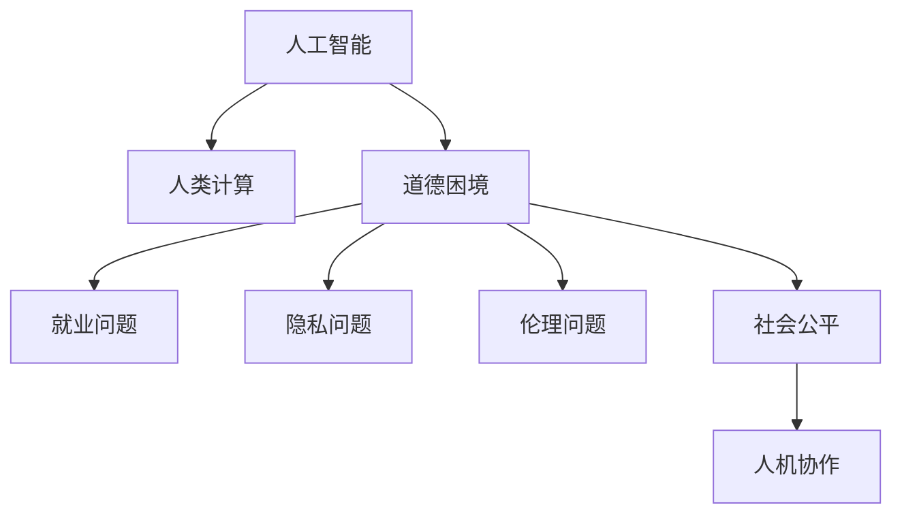

                 

# 人类计算：未来的工作和道德考虑

> 关键词：人工智能, 人类计算, 道德困境, 工作环境, 自动化, 未来工作, 社会公平, 人机协作

## 1. 背景介绍

在数字化时代，人工智能（AI）技术迅猛发展，对人类社会产生了深远的影响。一方面，AI提升了工作效率，解放了人力资源；另一方面，它也引发了一系列复杂的道德和伦理问题。特别是近年来，以深度学习为代表的AI技术被广泛应用于各种领域，推动了"人类计算"的浪潮。"人类计算"是指在人工智能技术的辅助下，通过优化工作流程、提高生产效率、改善决策质量等方式，让人类更好地完成计算任务。然而，在享受技术红利的同时，我们也需要正视AI在提升工作效率的同时可能带来的道德和伦理问题，尤其是在工作环境、就业机会和社会公平方面。

本文将从人工智能与人类计算的角度出发，探讨未来工作和道德面临的挑战，提出可能的解决方案，为技术的发展和社会进步提供参考。

## 2. 核心概念与联系

### 2.1 核心概念概述

为更好地理解人类计算及其道德困境，本节将介绍几个核心概念：

- **人工智能**：以深度学习、强化学习、迁移学习等为代表的技术，使计算机具备感知、理解、学习、推理等智能行为，从而能够处理复杂任务。
- **人类计算**：在AI技术的辅助下，通过优化工作流程、提高生产效率等方式，让人类更好地完成计算任务。
- **道德困境**：AI技术带来的工作效率提升，可能在一定程度上改变劳动分工，引发就业、隐私、伦理等道德问题。
- **社会公平**：AI技术的发展应促进社会资源分配的公平性，避免造成贫富差距的扩大。
- **人机协作**：AI与人类合作，发挥各自的优势，共同完成复杂的计算任务。

这些核心概念之间的逻辑关系可以通过以下Mermaid流程图来展示：



这个流程图展示的核心概念及其之间的关系：

1. 人工智能提供了技术支持，推动了人类计算的实现。
2. 人类计算的实施，可能导致一系列道德问题，如就业、隐私、伦理等。
3. 社会公平要求人工智能技术的广泛应用不能加剧社会不公，而应促进资源分配的均衡。
4. 人机协作是未来工作的重要趋势，需要充分考虑道德和人机平衡。

## 3. 核心算法原理 & 具体操作步骤
### 3.1 算法原理概述

"人类计算"的实现，主要依赖于人工智能技术，尤其是深度学习和强化学习算法。其核心思想是通过数据驱动的模型训练，让机器学习任务规则和经验，从而辅助人类完成复杂计算任务。

形式化地，假设任务为 $T$，输入空间为 $X$，输出空间为 $Y$。人类计算的过程可以表示为：

$$
M_{\theta} = \mathop{\arg\min}_{\theta} \mathcal{L}(T, D)
$$

其中，$M_{\theta}$ 是模型参数，$\mathcal{L}$ 是损失函数，$D$ 是训练数据集。通过最小化损失函数，使模型 $M_{\theta}$ 在任务 $T$ 上获得最优性能。

### 3.2 算法步骤详解

"人类计算"的算法步骤主要包括以下几个关键步骤：

**Step 1: 数据收集和预处理**
- 收集任务 $T$ 的相关数据，包括输入数据 $X$ 和输出数据 $Y$。
- 对数据进行清洗、标注和归一化等预处理，确保数据的质量和格式。

**Step 2: 模型选择和训练**
- 选择合适的深度学习模型（如卷积神经网络、循环神经网络等），并设定模型的超参数。
- 使用训练数据 $D$ 对模型进行训练，最小化损失函数 $\mathcal{L}$，得到最优模型参数 $\theta$。

**Step 3: 模型部署和优化**
- 将训练好的模型 $M_{\theta}$ 部署到实际应用场景中。
- 根据反馈数据和模型性能，进一步优化模型结构和超参数，提升计算效率和准确性。

**Step 4: 人机协作**
- 将人类计算任务分解为多个子任务，让机器执行其中部分简单、重复的任务。
- 人类对机器的结果进行审查和校验，确保最终输出结果的准确性和可解释性。

### 3.3 算法优缺点

人类计算的算法具有以下优点：

1. 效率提升：机器可以处理大量重复性任务，减少人类工作量，提升工作效率。
2. 质量保证：通过优化算法和模型，提高任务完成质量，降低错误率。
3. 人机协作：机器与人类各司其职，发挥各自优势，提升任务处理能力。

同时，该算法也存在一定的局限性：

1. 数据依赖：模型性能依赖于高质量的数据，数据标注成本高。
2. 模型复杂：模型结构和超参数设置复杂，需要专业知识和经验。
3. 依赖环境：需要高性能计算资源和稳定的开发环境。
4. 道德风险：机器辅助可能导致部分人类工作岗位消失，引发就业问题。

### 3.4 算法应用领域

人类计算已经在多个领域得到了应用，例如：

- **医疗**：使用机器学习模型分析医疗影像，辅助医生诊断疾病。
- **金融**：通过数据挖掘和预测模型，优化投资策略，降低风险。
- **制造业**：利用机器视觉和自动化流程，提升生产效率，降低生产成本。
- **交通**：使用交通监控和预测模型，优化交通管理，减少拥堵。
- **教育**：开发个性化学习平台，根据学生表现调整教学内容和方法。

这些应用展示了人类计算的广泛潜力和深远影响，为各行各业带来了效率和质量的双重提升。

## 4. 数学模型和公式 & 详细讲解  
### 4.1 数学模型构建

在人类计算中，常见的数学模型包括线性回归、决策树、支持向量机、神经网络等。以神经网络模型为例，形式化地，假设神经网络模型为 $M_{\theta} = f_{\theta}(X)$，其中 $f_{\theta}$ 是模型函数，$\theta$ 为模型参数。模型的损失函数通常采用均方误差（MSE）或交叉熵（CE）损失，表示为：

$$
\mathcal{L}(Y, M_{\theta}(X)) = \frac{1}{N}\sum_{i=1}^N (Y_i - M_{\theta}(X_i))^2
$$

其中，$N$ 为样本数量，$Y$ 为真实输出，$M_{\theta}(X)$ 为模型预测输出。

### 4.2 公式推导过程

以线性回归模型为例，假设输入 $X$ 和输出 $Y$ 之间存在线性关系 $Y = \theta_0 + \theta_1X + \varepsilon$，其中 $\varepsilon$ 为噪声。最小二乘法的损失函数为：

$$
\mathcal{L}(\theta) = \frac{1}{N}\sum_{i=1}^N (Y_i - (\theta_0 + \theta_1X_i))^2
$$

通过求解损失函数的最小值，得到模型参数 $\theta_0$ 和 $\theta_1$：

$$
\frac{\partial \mathcal{L}(\theta)}{\partial \theta_0} = -\frac{2}{N}\sum_{i=1}^N (Y_i - \theta_0 - \theta_1X_i) = 0 \Rightarrow \theta_0 = \bar{Y} - \theta_1\bar{X}
$$

$$
\frac{\partial \mathcal{L}(\theta)}{\partial \theta_1} = -\frac{2}{N}\sum_{i=1}^N (Y_i - \theta_0 - \theta_1X_i)X_i = 0 \Rightarrow \theta_1 = \frac{\sum_{i=1}^N (X_i - \bar{X})(Y_i - \bar{Y})}{\sum_{i=1}^N (X_i - \bar{X})^2}
$$

其中，$\bar{X}$ 和 $\bar{Y}$ 分别为 $X$ 和 $Y$ 的均值。

### 4.3 案例分析与讲解

以医疗影像分析为例，使用深度学习模型进行病灶检测。假设有 $N$ 个样本的影像数据 $X$ 和相应的病灶标签 $Y$。采用卷积神经网络（CNN）进行训练，最小化损失函数：

$$
\mathcal{L}(Y, M_{\theta}(X)) = \frac{1}{N}\sum_{i=1}^N \text{CE}(Y_i, M_{\theta}(X_i))
$$

其中，$\text{CE}(\cdot)$ 为交叉熵函数。模型输出为二分类问题，如是否有病灶，对应的标签为 1 或 0。通过反向传播算法更新模型参数 $\theta$，得到最优模型 $M_{\theta}$。

## 5. 项目实践：代码实例和详细解释说明
### 5.1 开发环境搭建

在进行人类计算项目开发前，我们需要准备好开发环境。以下是使用Python进行TensorFlow开发的环境配置流程：

1. 安装Anaconda：从官网下载并安装Anaconda，用于创建独立的Python环境。

2. 创建并激活虚拟环境：
```bash
conda create -n tf-env python=3.8 
conda activate tf-env
```

3. 安装TensorFlow：根据CUDA版本，从官网获取对应的安装命令。例如：
```bash
conda install tensorflow -c pytorch -c conda-forge
```

4. 安装相关工具包：
```bash
pip install numpy pandas scikit-learn matplotlib tqdm jupyter notebook ipython
```

完成上述步骤后，即可在`tf-env`环境中开始项目开发。

### 5.2 源代码详细实现

这里我们以医疗影像分析为例，给出使用TensorFlow进行深度学习模型开发的PyTorch代码实现。

首先，定义训练集和测试集：

```python
import tensorflow as tf
import numpy as np

# 加载数据
train_images, train_labels = load_train_data()
test_images, test_labels = load_test_data()

# 定义模型结构
model = tf.keras.models.Sequential([
    tf.keras.layers.Conv2D(32, (3, 3), activation='relu', input_shape=(256, 256, 3)),
    tf.keras.layers.MaxPooling2D((2, 2)),
    tf.keras.layers.Flatten(),
    tf.keras.layers.Dense(256, activation='relu'),
    tf.keras.layers.Dense(1, activation='sigmoid')
])

# 编译模型
model.compile(optimizer=tf.keras.optimizers.Adam(learning_rate=0.001),
              loss=tf.keras.losses.BinaryCrossentropy(),
              metrics=[tf.keras.metrics.AUC()])
```

然后，定义训练和评估函数：

```python
def train_model(model, train_images, train_labels, epochs):
    model.fit(train_images, train_labels, epochs=epochs, validation_data=(test_images, test_labels))

def evaluate_model(model, test_images, test_labels):
    test_loss, test_auc = model.evaluate(test_images, test_labels)
    print(f'Test AUC: {test_auc}')
```

最后，启动训练流程并在测试集上评估：

```python
epochs = 100

# 训练模型
train_model(model, train_images, train_labels, epochs)

# 评估模型
evaluate_model(model, test_images, test_labels)
```

以上就是使用TensorFlow对医疗影像分析模型进行训练的完整代码实现。可以看到，TensorFlow提供了强大的深度学习库和便捷的API接口，使得模型训练和评估变得简洁高效。

### 5.3 代码解读与分析

让我们再详细解读一下关键代码的实现细节：

**定义训练集和测试集**：
- `load_train_data` 和 `load_test_data` 函数用于加载训练集和测试集的图像数据和标签。
- 模型结构采用卷积神经网络，包含卷积层、池化层、全连接层等，适合处理图像数据。
- 使用Adam优化器和二元交叉熵损失函数进行模型编译。

**训练和评估函数**：
- `train_model` 函数对模型进行训练，指定训练轮数和验证集。
- `evaluate_model` 函数对模型进行评估，计算测试集上的准确率和AUC指标。

**训练流程**：
- 定义总的训练轮数，开始循环迭代。
- 每个epoch内，对训练集进行训练，输出模型在验证集上的性能。
- 所有epoch结束后，在测试集上评估模型性能，输出最终的AUC指标。

可以看到，TensorFlow的深度学习库使得模型训练和评估变得简单直观，开发者可以将更多精力放在数据处理和模型优化上。

## 6. 实际应用场景
### 6.1 智能医疗

智能医疗是人工智能技术的重要应用领域之一。通过使用深度学习模型对医疗影像、电子病历等数据进行分析，可以辅助医生进行诊断和治疗决策，提升医疗服务的质量和效率。

在技术实现上，可以收集医院的历史医疗影像数据和病历信息，构建监督学习模型，对新入院的患者的影像进行实时分析，预测其是否存在病变，并给出初步诊断建议。医疗影像分析系统可以在医生忙碌时提供快速辅助，帮助医生更准确地进行诊断，减少误诊率。

### 6.2 金融风控

金融风控是另一个利用人工智能技术的重要应用领域。通过深度学习模型对用户的交易行为、信用记录等数据进行分析，可以预测用户是否存在风险，从而降低金融机构的损失。

在技术实现上，可以收集用户的交易数据、信用记录等，使用深度学习模型对用户的信用评分进行预测。通过持续收集和分析用户的行为数据，不断更新模型，确保预测的准确性和时效性。

### 6.3 智慧城市

智慧城市是利用人工智能技术提升城市管理水平的重要应用方向。通过深度学习模型对城市中的各类数据进行分析，可以实现交通管理、环境监测、公共安全等多种功能。

在技术实现上，可以收集城市中的交通流量、空气质量、气象数据等，使用深度学习模型对这些数据进行分析和预测。通过实时监控和预测，可以实现城市管理的智能化，提高城市运行效率和服务质量。

### 6.4 未来应用展望

随着深度学习技术的不断进步，基于人类计算的AI应用将进一步拓展，为各行各业带来更深远的影响。

在智慧教育领域，基于深度学习的个性化学习平台，可以根据学生的学习情况和兴趣，推荐适合的学习内容和资源，提高学习效果。

在智慧制造领域，通过深度学习模型对生产数据进行分析，可以优化生产流程，降低生产成本，提升产品质量。

在智慧交通领域，基于深度学习模型的交通监测和预测系统，可以实现实时交通管理，减少交通拥堵，提升交通安全。

此外，在医疗、金融、教育、制造业等多个领域，基于深度学习模型的AI应用也将不断涌现，为人类社会带来更多便利和福祉。

## 7. 工具和资源推荐
### 7.1 学习资源推荐

为了帮助开发者系统掌握人工智能与人类计算的理论基础和实践技巧，这里推荐一些优质的学习资源：

1. 《深度学习》系列书籍：由Ian Goodfellow、Yoshua Bengio、Aaron Courville合著，系统介绍了深度学习的原理、算法和应用。

2. CS231n《卷积神经网络》课程：斯坦福大学开设的深度学习课程，涵盖卷积神经网络的原理和应用，非常适合初学者。

3. Coursera《深度学习专项课程》：由吴恩达教授主讲，系统介绍了深度学习的各个方面，包括神经网络、深度学习框架、应用场景等。

4. TensorFlow官方文档：TensorFlow的官方文档，提供了详细的API介绍和示例代码，是深度学习开发的必备资源。

5. PyTorch官方文档：PyTorch的官方文档，提供了丰富的深度学习模型和工具，适合研究人员和开发者使用。

通过对这些资源的学习实践，相信你一定能够快速掌握深度学习与人类计算的精髓，并用于解决实际的AI问题。
###  7.2 开发工具推荐

高效的开发离不开优秀的工具支持。以下是几款用于深度学习和人类计算开发的常用工具：

1. TensorFlow：由Google主导开发的深度学习框架，支持分布式计算和自动微分，适合大规模深度学习模型训练。

2. PyTorch：由Facebook主导开发的深度学习框架，动态计算图，灵活易用，适合快速原型开发和研究。

3. Keras：一个高层次的深度学习框架，易于使用，适合初学者和快速原型开发。

4. Weights & Biases：模型训练的实验跟踪工具，可以记录和可视化模型训练过程中的各项指标，方便对比和调优。

5. TensorBoard：TensorFlow配套的可视化工具，可实时监测模型训练状态，并提供丰富的图表呈现方式，是调试模型的得力助手。

合理利用这些工具，可以显著提升深度学习和人类计算任务的开发效率，加快创新迭代的步伐。

### 7.3 相关论文推荐

深度学习与人类计算的发展源于学界的持续研究。以下是几篇奠基性的相关论文，推荐阅读：

1. ImageNet Classification with Deep Convolutional Neural Networks（AlexNet论文）：提出卷积神经网络（CNN），开创了深度学习在计算机视觉领域的应用。

2. Google's Inception Architecture for Computer Vision（Inception论文）：提出Inception模块，提升了CNN的深度和计算效率。

3. Deep Learning（Ian Goodfellow等合著）：系统介绍了深度学习的理论基础和应用场景，是深度学习的经典教材。

4. Recurrent Neural Network Toolkit（RNN Toolkit）：介绍递归神经网络（RNN）的结构和应用，适合处理序列数据。

5. Autoencoder in Hidden Space：提出自编码器（Autoencoder），实现无监督学习和数据压缩。

这些论文代表了大规模深度学习与人类计算的发展脉络。通过学习这些前沿成果，可以帮助研究者把握学科前进方向，激发更多的创新灵感。

## 8. 总结：未来发展趋势与挑战
### 8.1 总结

本文对基于深度学习的人类计算方法进行了全面系统的介绍。首先阐述了深度学习与人类计算的研究背景和意义，明确了AI技术在提升工作效率的同时可能带来的道德和伦理问题。其次，从原理到实践，详细讲解了深度学习的数学模型和算法步骤，给出了深度学习模型开发的完整代码实例。同时，本文还广泛探讨了深度学习在医疗、金融、智慧城市等多个领域的应用前景，展示了AI技术的广泛潜力和深远影响。此外，本文精选了深度学习与人类计算的相关资源，力求为读者提供全方位的技术指引。

通过本文的系统梳理，可以看到，深度学习与人类计算正在成为AI技术的重要范式，极大地拓展了AI的应用边界，推动了各行各业的发展。未来，伴随深度学习技术的持续演进，基于深度学习的人类计算技术必将在更多领域得到应用，为人类社会带来更多的便利和福祉。

### 8.2 未来发展趋势

展望未来，深度学习与人类计算技术将呈现以下几个发展趋势：

1. 模型规模持续增大。随着算力成本的下降和数据规模的扩张，深度学习模型的参数量还将持续增长。超大规模模型蕴含的丰富知识，有望支撑更加复杂多变的计算任务。

2. 训练效率不断提高。随着训练框架和算法的优化，深度学习模型的训练速度将不断提升，减少计算资源的消耗。

3. 模型通用性增强。经过海量数据的训练，深度学习模型将具备更强的泛化能力和适应性，逐步迈向通用人工智能（AGI）的目标。

4. 人机协作成为常态。深度学习技术与人类协作的深度融合，将显著提升计算效率和任务质量，带来全新的工作体验。

5. 跨领域应用拓展。深度学习技术将在更多领域得到应用，如智能制造、智慧交通、智能医疗等，为各行各业带来新的创新。

以上趋势凸显了深度学习与人类计算技术的广阔前景。这些方向的探索发展，必将进一步提升AI系统的性能和应用范围，为人类社会带来深远影响。

### 8.3 面临的挑战

尽管深度学习与人类计算技术已经取得了瞩目成就，但在迈向更加智能化、普适化应用的过程中，它仍面临着诸多挑战：

1. 数据依赖。深度学习模型的性能依赖于高质量的数据，数据标注成本高，获取难度大。

2. 模型复杂。深度学习模型的结构和超参数设置复杂，需要专业知识和经验。

3. 资源消耗。深度学习模型需要高性能计算资源和稳定的开发环境，对硬件和网络要求高。

4. 道德风险。深度学习模型的应用可能引发就业、隐私、伦理等问题，需要多方协同解决。

5. 可解释性不足。深度学习模型通常被视为"黑盒"系统，难以解释其内部工作机制和决策逻辑。

6. 安全风险。深度学习模型可能学习到有害的偏见和信息，需要加强安全防护和伦理监管。

正视这些挑战，积极应对并寻求突破，将是大规模深度学习与人类计算技术走向成熟的必由之路。相信随着学界和产业界的共同努力，这些挑战终将一一被克服，深度学习与人类计算技术必将在构建智能社会的未来中扮演越来越重要的角色。

### 8.4 研究展望

面对深度学习与人类计算面临的种种挑战，未来的研究需要在以下几个方面寻求新的突破：

1. 探索无监督和半监督学习技术。摆脱对大规模标注数据的依赖，利用自监督学习、主动学习等方法，最大限度利用非结构化数据，实现更加灵活高效的深度学习。

2. 研究模型压缩和加速方法。开发更加高效、轻量级的深度学习模型，降低计算成本，提升计算速度。

3. 引入更多先验知识。将符号化的先验知识，如知识图谱、逻辑规则等，与深度学习模型进行巧妙融合，引导深度学习过程学习更准确、合理的知识表示。

4. 结合因果分析和博弈论工具。将因果分析方法引入深度学习模型，识别出模型决策的关键特征，增强输出解释的因果性和逻辑性。借助博弈论工具刻画人机交互过程，主动探索并规避模型的脆弱点，提高系统稳定性。

5. 纳入伦理道德约束。在深度学习模型的训练目标中引入伦理导向的评估指标，过滤和惩罚有害的输出倾向。加强人工干预和审核，建立模型行为的监管机制，确保输出符合人类价值观和伦理道德。

这些研究方向的探索，必将引领深度学习与人类计算技术迈向更高的台阶，为构建智能社会提供技术保障。面向未来，深度学习与人类计算技术还需要与其他人工智能技术进行更深入的融合，如知识表示、因果推理、强化学习等，多路径协同发力，共同推动人工智能技术的发展。只有勇于创新、敢于突破，才能不断拓展深度学习与人类计算的边界，让智能技术更好地造福人类社会。

## 9. 附录：常见问题与解答

**Q1：深度学习与人类计算在提升工作效率的同时，是否会带来道德和伦理问题？**

A: 深度学习与人类计算在提升工作效率的同时，可能带来一系列道德和伦理问题。例如，机器取代部分人类工作岗位，引发就业问题；隐私保护问题；算法决策的透明度和可解释性问题等。因此，在深度学习与人类计算技术的应用过程中，需要兼顾效率和公平，确保技术的良性发展。

**Q2：深度学习与人类计算的开发和部署需要哪些关键资源？**

A: 深度学习与人类计算的开发和部署需要以下关键资源：

1. 高性能计算资源：深度学习模型训练和推理需要大量计算资源，如GPU、TPU等。
2. 高质量数据集：深度学习模型的性能依赖于高质量的数据，需要花费大量时间和人力进行数据收集和标注。
3. 稳定的开发环境：深度学习开发需要依赖各种开源工具和框架，需要一个稳定的开发环境。
4. 丰富的工具支持：需要各种编程语言、框架和工具的支持，如Python、TensorFlow、PyTorch等。

**Q3：深度学习与人类计算在实际应用中需要注意哪些问题？**

A: 深度学习与人类计算在实际应用中需要注意以下问题：

1. 数据依赖：深度学习模型的性能依赖于高质量的数据，数据标注成本高，获取难度大。
2. 模型复杂：深度学习模型的结构和超参数设置复杂，需要专业知识和经验。
3. 资源消耗：深度学习模型需要高性能计算资源和稳定的开发环境，对硬件和网络要求高。
4. 道德风险：深度学习模型的应用可能引发就业、隐私、伦理等问题，需要多方协同解决。
5. 可解释性不足：深度学习模型通常被视为"黑盒"系统，难以解释其内部工作机制和决策逻辑。
6. 安全风险：深度学习模型可能学习到有害的偏见和信息，需要加强安全防护和伦理监管。

**Q4：深度学习与人类计算的未来应用前景如何？**

A: 深度学习与人类计算的未来应用前景非常广阔，将在更多领域得到应用，如医疗、金融、智慧城市、智能制造、智能交通等。通过深度学习与人类计算技术的结合，可以实现更加智能、高效、精准的计算任务，带来深远的影响。

总之，深度学习与人类计算技术正在引领AI技术的发展，为各行各业带来新的变革。未来，随着技术的发展和应用的深入，深度学习与人类计算技术将进一步拓展其应用边界，为人类社会带来更多的便利和福祉。

