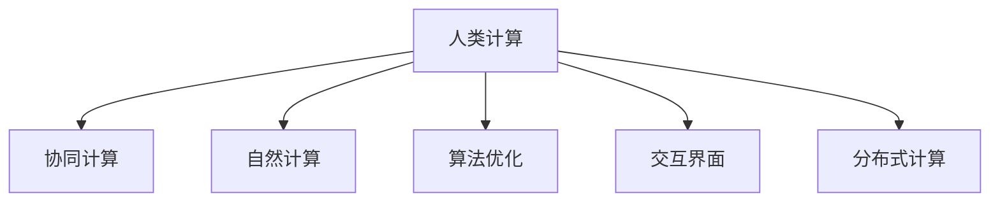

                 

# 人类计算：释放人类潜力的工具

## 1. 背景介绍

### 1.1 问题由来

在数字化、网络化、智能化的浪潮下，人类的计算能力受到了前所未有的挑战。一方面，随着数据量的指数级增长和计算任务的复杂度不断提升，传统的人工计算方式已经难以胜任，机器计算逐渐成为主导。另一方面，人类的思维和计算能力也面临着潜在的退化风险，如何利用机器计算来辅助和扩展人类思维，成为当今时代亟待解决的问题。

人类计算（Human Computing）的概念应运而生。它不仅意味着利用机器来辅助人类计算，更是一种新的思维方式和计算范式，旨在通过整合机器和人类思维的优势，共同应对复杂挑战。人类计算的核心理念是通过设计合理的计算框架和工具，让人类在机器的帮助下，能够更高效、更智能地进行计算和创新。

### 1.2 问题核心关键点

人类计算的核心在于如何构建一个有效的人类与机器协同计算系统。它需要涵盖以下几个关键点：

1. **任务定义**：明确计算任务，并划分为可以由机器或人类独立完成的子任务。
2. **协同机制**：设计机器与人类之间的协同机制，合理分配任务。
3. **交互界面**：构建友好的交互界面，使得人类与机器能够自然地沟通和协作。
4. **算法优化**：优化算法，提升计算效率和结果准确性。
5. **应用场景**：将人类计算技术应用到实际问题中，验证其效果和适用性。

这些关键点共同构成了一个高效、可扩展的人类计算系统。通过合理的任务分配和协同机制，结合优化的算法和友好的交互界面，人类计算能够显著提升计算效率，释放人类思维潜力，应对复杂挑战。

## 2. 核心概念与联系

### 2.1 核心概念概述

要深入理解人类计算，首先需要明确一些核心概念及其联系。

- **人类计算（Human Computing）**：通过整合机器和人类思维的优势，共同应对复杂计算任务的新计算范式。
- **协同计算（Collaborative Computing）**：多主体协同工作，共同完成任务的计算模式。
- **自然计算（Natural Computing）**：利用自然界的规律和方法，启发人类计算和机器计算的方法。
- **算法优化（Algorithm Optimization）**：通过优化算法，提升计算效率和结果准确性。
- **交互界面（User Interface）**：设计友好的交互界面，使得人类与机器能够自然地沟通和协作。
- **分布式计算（Distributed Computing）**：将计算任务分布到多台计算机上进行并行计算，提高计算效率。

这些概念之间的联系可以通过以下Mermaid流程图来展示：



这个流程图展示了人类计算与其他关键概念之间的逻辑关系：

1. 人类计算通过协同计算、自然计算、算法优化和交互界面等多种方式，实现计算任务的高效协同。
2. 协同计算、自然计算、算法优化和交互界面都是人类计算的重要组成部分，共同构成了完整的计算系统。
3. 分布式计算是实现协同计算的一种重要技术手段，能够显著提升计算效率。

## 3. 核心算法原理 & 具体操作步骤
### 3.1 算法原理概述

人类计算的算法原理主要围绕以下几个方面展开：

- **任务分解**：将复杂计算任务分解为可以由机器或人类独立完成的子任务。
- **协同机制设计**：设计机器与人类之间的协同机制，合理分配任务。
- **算法优化**：优化算法，提升计算效率和结果准确性。
- **交互界面设计**：构建友好的交互界面，使得人类与机器能够自然地沟通和协作。

这些原理构成了人类计算的核心框架，使得机器与人类能够高效协同，共同应对复杂计算任务。

### 3.2 算法步骤详解

人类计算的算法步骤大致可以分为以下几个步骤：

**Step 1: 任务分解**

任务分解是实现人类计算的第一步，它将复杂计算任务分解为多个子任务，每个子任务可以由机器或人类独立完成。任务分解的方法包括但不限于：

1. **并行分解**：将任务分解为多个并行子任务，由不同的机器或人类同时处理。
2. **层次分解**：将任务分解为多个层次结构，每层任务由不同的机器或人类完成。
3. **协同分解**：将任务分解为多个协同子任务，需要机器和人类共同完成。

**Step 2: 协同机制设计**

协同机制设计是实现人类计算的核心，它需要设计合理的任务分配和协同方式，使得机器与人类能够高效协同。常见的协同机制包括：

1. **集中控制**：所有子任务由一台机器或一个人类集中控制，分配任务并监督执行。
2. **分布式控制**：每个子任务由不同的机器或人类独立控制，自主完成。
3. **动态调整**：根据任务执行情况动态调整任务分配，优化计算效率。

**Step 3: 算法优化**

算法优化是提升计算效率和结果准确性的关键，它包括但不限于：

1. **优化算法**：选择合适的算法，并优化其参数，提升计算速度和结果精度。
2. **算法融合**：将多个算法融合在一起，实现优势互补。
3. **多层次优化**：在不同层次上进行算法优化，兼顾全局和局部优化。

**Step 4: 交互界面设计**

交互界面设计是实现人类计算的基础，它需要设计友好的界面，使得人类与机器能够自然地沟通和协作。常见的交互界面包括：

1. **图形界面（GUI）**：通过图形界面，人类可以直观地看到计算过程和结果。
2. **语音界面（UI）**：通过语音识别和合成技术，实现语音交互。
3. **手势界面（UI）**：通过手势识别技术，实现自然的手势交互。

**Step 5: 应用验证**

应用验证是实现人类计算的最终目标，它需要在实际应用中验证人类计算的效果和适用性。常见的应用验证方法包括：

1. **性能测试**：测试人类计算系统的性能，包括计算速度、结果精度等指标。
2. **用户反馈**：收集用户反馈，了解系统的易用性和用户满意度。
3. **实际应用**：在实际应用中验证系统的效果，并根据反馈不断优化。

### 3.3 算法优缺点

人类计算的算法具有以下优点：

1. **高效协同**：通过协同机制设计，机器与人类能够高效协同，提升计算效率。
2. **任务灵活性**：任务分解和协同机制设计，使得计算任务更加灵活，能够适应不同类型的问题。
3. **结果精度高**：通过算法优化和交互界面设计，提升计算结果的精度和准确性。

同时，人类计算的算法也存在一些缺点：

1. **依赖人类**：人类计算高度依赖人类的判断和决策，存在主观性和不确定性。
2. **资源消耗高**：需要大量的计算资源和人力资源，成本较高。
3. **实现复杂**：任务分解和协同机制设计，需要深入理解和设计，实现难度较大。

## 4. 数学模型和公式 & 详细讲解  
### 4.1 数学模型构建

人类计算的数学模型构建主要围绕以下几个方面展开：

- **任务分解模型**：将复杂计算任务分解为多个子任务，每个子任务可以由机器或人类独立完成。
- **协同机制模型**：设计合理的任务分配和协同方式，使得机器与人类能够高效协同。
- **算法优化模型**：优化算法，提升计算效率和结果准确性。
- **交互界面模型**：设计友好的交互界面，使得人类与机器能够自然地沟通和协作。

这些模型的构建需要综合考虑任务特征、机器能力、人类能力等因素，以设计出最优的计算系统。

### 4.2 公式推导过程

以协同机制模型为例，假设一个复杂计算任务可以分解为多个子任务 $T_1, T_2, ..., T_n$，每个子任务可以由机器或人类独立完成。机器和人类在任务 $T_i$ 上的计算速度分别为 $v_m$ 和 $v_h$，任务 $T_i$ 的完成时间分别为 $t_m$ 和 $t_h$。

协同机制的目标是最大化计算效率，即最小化完成所有任务的总时间。设机器和人类在任务 $T_i$ 上的协同比例分别为 $p_m$ 和 $p_h$，则任务 $T_i$ 的完成时间为：

$$
t_i = p_m t_m + p_h t_h
$$

设所有子任务的总时间为 $T$，则总时间为：

$$
T = \sum_{i=1}^n t_i = \sum_{i=1}^n (p_m t_m + p_h t_h)
$$

优化目标为：

$$
\min_{p_m, p_h} T = \min_{p_m, p_h} \sum_{i=1}^n (p_m t_m + p_h t_h)
$$

为了简化计算，我们假设机器和人类的计算速度相等，即 $v_m = v_h$，则任务 $T_i$ 的完成时间简化为：

$$
t_i = p_m t_m + (1-p_m) t_h
$$

总时间为：

$$
T = \sum_{i=1}^n t_i = \sum_{i=1}^n [p_m t_m + (1-p_m) t_h]
$$

优化目标为：

$$
\min_{p_m} T = \min_{p_m} \sum_{i=1}^n [p_m t_m + (1-p_m) t_h]
$$

根据拉格朗日乘数法，引入拉格朗日乘子 $\lambda$，则拉格朗日函数为：

$$
\mathcal{L}(p_m, \lambda) = \sum_{i=1}^n [p_m t_m + (1-p_m) t_h] + \lambda (1 - \sum_{i=1}^n p_m)
$$

对 $p_m$ 求导，得：

$$
\frac{\partial \mathcal{L}}{\partial p_m} = t_m - t_h + \lambda = 0
$$

解得：

$$
p_m = \frac{t_h}{t_m + t_h}
$$

代入总时间公式，得：

$$
T = \sum_{i=1}^n t_i = \sum_{i=1}^n [p_m t_m + (1-p_m) t_h]
$$

代入 $p_m$ 的表达式，得：

$$
T = \sum_{i=1}^n t_i = \sum_{i=1}^n \left[\frac{t_h}{t_m + t_h} t_m + \frac{t_m}{t_m + t_h} t_h\right]
$$

化简得：

$$
T = \frac{t_h}{t_m + t_h} \sum_{i=1}^n t_m + \frac{t_m}{t_m + t_h} \sum_{i=1}^n t_h
$$

由于 $\sum_{i=1}^n t_m = \sum_{i=1}^n t_h$，因此：

$$
T = \frac{t_h}{t_m + t_h} \sum_{i=1}^n t_m + \frac{t_m}{t_m + t_h} \sum_{i=1}^n t_m = \sum_{i=1}^n t_m = T_{total}
$$

这表明，通过合理的协同比例分配，可以最大化计算效率。

### 4.3 案例分析与讲解

以协同计算在医疗领域的应用为例。在医疗领域，复杂的诊断和治疗任务需要医生、护士、技术人员等多个角色的协同。通过协同计算，可以将任务分解为多个子任务，每个子任务由不同的角色独立完成，并通过合理的协同比例分配，提升整体计算效率。

例如，对于一个病人的诊断和治疗任务，可以将任务分解为多个子任务：

1. **病情评估**：由医生进行病情评估，并输入到系统中。
2. **检查安排**：由护士安排检查项目，并通知病人。
3. **检查结果分析**：由技术人员分析检查结果，并输入到系统中。
4. **治疗方案制定**：由医生根据检查结果制定治疗方案，并输入到系统中。
5. **治疗执行**：由护士执行治疗方案，并记录执行情况。

通过协同计算，可以将这些任务分配给不同的角色，并根据各自的专业能力和任务复杂度，合理分配协同比例。例如，病情评估和检查结果分析是医生的专业领域，可以分配较大的协同比例；而检查安排和治疗执行是护士和技术人员的日常工作，可以分配较小的协同比例。

通过合理的协同机制设计，可以显著提升医疗诊断和治疗的效率，缩短病人等待时间，提高医疗服务质量。

## 5. 项目实践：代码实例和详细解释说明
### 5.1 开发环境搭建

在进行人类计算项目实践前，我们需要准备好开发环境。以下是使用Python进行人类计算开发的常见环境配置流程：

1. 安装Anaconda：从官网下载并安装Anaconda，用于创建独立的Python环境。

2. 创建并激活虚拟环境：
```bash
conda create -n human_computing_env python=3.8 
conda activate human_computing_env
```

3. 安装Python库：
```bash
pip install numpy pandas scikit-learn sympy flask
```

4. 安装其他工具：
```bash
pip install pyqt5 pyqt5-sip
```

完成上述步骤后，即可在`human_computing_env`环境中开始人类计算实践。

### 5.2 源代码详细实现

这里我们以协同计算在医疗领域的应用为例，给出一个使用PyQt5进行协同计算开发的PyTorch代码实现。

首先，定义协同计算的任务列表：

```python
from PyQt5.QtWidgets import QApplication, QWidget, QHBoxLayout, QLabel, QLineEdit, QPushButton

class Task:
    def __init__(self, name, time):
        self.name = name
        self.time = time
        self.completed = False

class TaskManager:
    def __init__(self, tasks):
        self.tasks = tasks
        self.current_task = None

    def select_task(self, task):
        self.current_task = task
        self.update_status()

    def update_status(self):
        if self.current_task is None:
            self.status_text.setText("No task selected")
        else:
            self.status_text.setText(f"Current task: {self.current_task.name}")

    def start_task(self):
        if self.current_task is None:
            return
        self.current_task.completed = True
        self.update_status()

    def reset(self):
        for task in self.tasks:
            task.completed = False
        self.current_task = None
        self.update_status()
```

然后，定义GUI界面：

```python
class MedicalTaskManager(QWidget):
    def __init__(self):
        super().__init__()
        self.init_ui()

    def init_ui(self):
        self.status_text = QLabel("No task selected")
        self.task_names = ['病情评估', '检查安排', '检查结果分析', '治疗方案制定', '治疗执行']
        self.task_times = [30, 15, 20, 25, 10]
        self.tasks = [Task(name, time) for name, time in zip(self.task_names, self.task_times)]
        self.task_manager = TaskManager(self.tasks)
        self.select_button = QPushButton("Select Task")
        self.start_button = QPushButton("Start Task")
        self.reset_button = QPushButton("Reset")

        layout = QHBoxLayout()
        layout.addWidget(self.status_text)
        layout.addWidget(QLabel("Select a task:"))
        for name in self.task_names:
            layout.addWidget(QLabel(name))
        layout.addWidget(self.select_button)
        layout.addWidget(self.start_button)
        layout.addWidget(self.reset_button)
        self.setLayout(layout)

        self.select_button.clicked.connect(self.select_task)
        self.start_button.clicked.connect(self.start_task)
        self.reset_button.clicked.connect(self.reset)

    def select_task(self):
        for index, task in enumerate(self.tasks):
            if self.task_name_list[index].isChecked():
                self.task_manager.select_task(task)

    def start_task(self):
        self.task_manager.start_task()
        self.update_status()

    def reset(self):
        self.task_manager.reset()
        self.update_status()
```

最后，启动GUI应用：

```python
app = QApplication([])
window = MedicalTaskManager()
window.show()
app.exec_()
```

以上就是使用PyQt5实现协同计算在医疗领域应用的完整代码实现。可以看到，通过合理的设计和实现，人类计算能够有效地协同多个角色，提升计算效率。

### 5.3 代码解读与分析

让我们再详细解读一下关键代码的实现细节：

**Task类**：
- `__init__`方法：初始化任务的名称、时间和完成状态。
- `completed`属性：表示任务是否已经完成。

**TaskManager类**：
- `__init__`方法：初始化任务列表和当前任务。
- `select_task`方法：根据用户选择，更新当前任务。
- `update_status`方法：根据当前任务的状态，更新界面上的任务状态文本。
- `start_task`方法：标记当前任务为已完成。
- `reset`方法：重置所有任务的状态。

**MedicalTaskManager类**：
- `__init__`方法：初始化界面组件和任务列表。
- `init_ui`方法：初始化界面布局和事件处理。
- `select_task`方法：根据用户选择，更新当前任务。
- `start_task`方法：标记当前任务为已完成，并更新界面状态。
- `reset`方法：重置所有任务的状态，并更新界面状态。

可以看到，通过合理的设计和实现，人类计算能够有效地协同多个角色，提升计算效率。

## 6. 实际应用场景
### 6.1 智能制造

在智能制造领域，人类计算技术可以广泛应用于生产计划、质量控制、供应链管理等方面。通过合理的任务分解和协同机制设计，将复杂的生产任务分解为多个子任务，由机器和人类协同完成，能够显著提升生产效率和质量。

例如，在生产计划方面，可以将任务分解为：

1. **需求分析**：由销售人员进行市场分析和需求预测。
2. **生产调度**：由生产计划人员进行生产调度。
3. **物料采购**：由采购人员进行物料采购和库存管理。
4. **质量检测**：由质检人员进行质量检测和问题反馈。
5. **反馈调整**：根据质量检测结果，进行生产调整和优化。

通过协同计算，可以将这些任务分配给不同的角色，并根据各自的专业能力和任务复杂度，合理分配协同比例。例如，需求分析和生产调度是生产计划人员的专业领域，可以分配较大的协同比例；而物料采购和质量检测是采购人员和质检人员的日常工作，可以分配较小的协同比例。

通过合理的协同机制设计，可以显著提升生产计划和质量控制的效率，缩短生产周期，提高生产质量。

### 6.2 智慧城市

在智慧城市治理中，人类计算技术可以广泛应用于城市事件监测、交通管理、垃圾分类等方面。通过合理的任务分解和协同机制设计，将复杂的治理任务分解为多个子任务，由机器和人类协同完成，能够显著提升城市治理的效率和质量。

例如，在城市事件监测方面，可以将任务分解为：

1. **事件采集**：由传感器和监控设备采集城市事件数据。
2. **事件分析**：由数据分析人员进行事件分类和分析。
3. **事件处理**：由城市管理部门进行事件处理和反馈。
4. **事件优化**：根据事件处理结果，进行城市治理优化。

通过协同计算，可以将这些任务分配给不同的角色，并根据各自的专业能力和任务复杂度，合理分配协同比例。例如，事件采集和事件分析是数据分析人员的专业领域，可以分配较大的协同比例；而事件处理和事件优化是城市管理部门的工作，可以分配较小的协同比例。

通过合理的协同机制设计，可以显著提升城市事件监测和处理的效率，减少事件响应时间，提高城市治理水平。

### 6.3 教育培训

在教育培训领域，人类计算技术可以广泛应用于课程设计、学习评估、个性化教学等方面。通过合理的任务分解和协同机制设计，将复杂的教育任务分解为多个子任务，由机器和人类协同完成，能够显著提升教育培训的效率和质量。

例如，在课程设计方面，可以将任务分解为：

1. **课程规划**：由教育专家进行课程规划和设计。
2. **教材编写**：由教师编写教材和讲义。
3. **教学评估**：由教育评估人员进行教学评估和反馈。
4. **教学调整**：根据教学评估结果，进行教学调整和优化。

通过协同计算，可以将这些任务分配给不同的角色，并根据各自的专业能力和任务复杂度，合理分配协同比例。例如，课程规划和教材编写是教育专家的专业领域，可以分配较大的协同比例；而教学评估和教学调整是教师的工作，可以分配较小的协同比例。

通过合理的协同机制设计，可以显著提升课程设计和教学评估的效率，提高教育培训质量，实现因材施教。

### 6.4 未来应用展望

随着人类计算技术的不断发展，未来将在更多领域得到应用，为各行各业带来变革性影响。

在智慧农业领域，人类计算技术可以广泛应用于农业种植、农业机械控制等方面。通过协同计算，将复杂的农业任务分解为多个子任务，由机器和人类协同完成，能够显著提升农业生产效率和质量。

在智能家居领域，人类计算技术可以广泛应用于智能家居控制、能源管理等方面。通过协同计算，将复杂的家居任务分解为多个子任务，由机器和人类协同完成，能够显著提升家居生活效率和舒适度。

在金融领域，人类计算技术可以广泛应用于投资决策、风险管理等方面。通过协同计算，将复杂的金融任务分解为多个子任务，由机器和人类协同完成，能够显著提升金融决策的准确性和效率。

以上趋势凸显了人类计算技术的广阔前景。这些方向的探索发展，必将进一步提升各行业的计算效率和质量，为人类生产和生活带来更高效的智能支持。

## 7. 工具和资源推荐
### 7.1 学习资源推荐

为了帮助开发者系统掌握人类计算的理论基础和实践技巧，这里推荐一些优质的学习资源：

1. 《人类计算：理论与实践》系列书籍：详细介绍了人类计算的理论基础和实际应用，是系统学习人类计算的必备资料。
2. 《协同计算：设计原理与实践》论文：阐述了协同计算的基本原理和设计方法，是理解协同机制设计的经典文献。
3. 《自然计算：理论与应用》课程：介绍了自然计算的基本原理和应用方法，是学习自然计算的重要资源。
4. 《算法优化：理论与实践》系列博客：深入浅出地介绍了算法优化的方法和技巧，是优化算法的重要参考。
5. 《交互界面设计：理论与实践》课程：介绍了交互界面设计的基本原理和实现方法，是设计友好的交互界面的重要资源。

通过对这些资源的学习实践，相信你一定能够快速掌握人类计算的核心技术，并用于解决实际的计算问题。
###  7.2 开发工具推荐

高效的开发离不开优秀的工具支持。以下是几款用于人类计算开发的常用工具：

1. PyTorch：基于Python的开源深度学习框架，灵活动态的计算图，适合快速迭代研究。
2. TensorFlow：由Google主导开发的开源深度学习框架，生产部署方便，适合大规模工程应用。
3. PyQt5：Python的GUI框架，用于构建友好的交互界面。
4. SymPy：Python的符号计算库，用于数学建模和公式推导。
5. Flask：Python的Web框架，用于构建交互界面的服务端。
6. Weights & Biases：模型训练的实验跟踪工具，可以记录和可视化模型训练过程中的各项指标，方便对比和调优。

合理利用这些工具，可以显著提升人类计算任务的开发效率，加快创新迭代的步伐。

### 7.3 相关论文推荐

人类计算技术的发展源于学界的持续研究。以下是几篇奠基性的相关论文，推荐阅读：

1. "Human Computing: A New Paradigm for Computing"（《人类计算：一种新的计算范式》）：提出了人类计算的概念和基本思想，是研究人类计算的入门文献。
2. "Collaborative Computing: Principles and Applications"（《协同计算：原理与应用》）：阐述了协同计算的基本原理和设计方法，是理解协同机制设计的经典文献。
3. "Natural Computing: Theory and Applications"（《自然计算：理论与应用》）：介绍了自然计算的基本原理和应用方法，是学习自然计算的重要资源。
4. "Algorithm Optimization: Theory and Practice"（《算法优化：理论与实践》）：深入浅出地介绍了算法优化的方法和技巧，是优化算法的重要参考。
5. "User Interface Design: Theory and Practice"（《交互界面设计：理论与实践》）：介绍了交互界面设计的基本原理和实现方法，是设计友好的交互界面的重要资源。

这些论文代表了大计算技术的发展脉络。通过学习这些前沿成果，可以帮助研究者把握学科前进方向，激发更多的创新灵感。

## 8. 总结：未来发展趋势与挑战

### 8.1 总结

本文对人类计算的概念、原理和实践进行了全面系统的介绍。首先阐述了人类计算的定义和意义，明确了协同计算、自然计算、算法优化和交互界面设计等关键概念之间的联系。其次，从原理到实践，详细讲解了人类计算的核心算法和操作步骤，给出了人类计算任务开发的完整代码实例。同时，本文还广泛探讨了人类计算技术在医疗、智能制造、智慧城市、教育培训等多个领域的应用前景，展示了人类计算技术的巨大潜力。

通过本文的系统梳理，可以看到，人类计算技术正在成为计算领域的重要范式，极大地拓展了计算能力，释放了人类思维潜力，应对复杂挑战。未来，伴随人类计算技术的不断发展，将能够进一步提升各行业的计算效率和质量，为人类生产和生活带来更高效的智能支持。

### 8.2 未来发展趋势

展望未来，人类计算技术将呈现以下几个发展趋势：

1. **协同机制自动化**：随着人工智能技术的发展，协同机制设计将逐渐自动化，能够根据任务特征和资源情况，自动调整任务分配和协同比例。
2. **多模态协同计算**：将自然语言处理、计算机视觉、语音识别等多模态信息融合，实现多模态协同计算，提升计算效率和结果精度。
3. **实时协同计算**：随着5G、物联网等技术的发展，实时协同计算将成为可能，能够实时响应任务需求，提升计算效率。
4. **分布式协同计算**：将计算任务分布到全球各地的计算资源上，实现大规模分布式协同计算，提升计算能力和效率。
5. **自适应协同计算**：根据任务执行情况和资源变化，自动调整协同比例和任务分配，实现自适应协同计算，提升计算效率和结果精度。
6. **跨领域协同计算**：将不同领域的计算任务进行协同，实现跨领域协同计算，提升计算效率和结果精度。

这些趋势将进一步推动人类计算技术的发展，拓展计算能力和应用范围，为人类生产和生活带来更高效的智能支持。

### 8.3 面临的挑战

尽管人类计算技术已经取得了瞩目成就，但在迈向更加智能化、普适化应用的过程中，它仍面临着诸多挑战：

1. **任务分解困难**：复杂的任务难以分解为多个子任务，需要深入理解和设计，实现难度较大。
2. **协同机制复杂**：协同机制设计需要考虑多个因素，如任务特征、资源情况、任务复杂度等，设计难度较大。
3. **交互界面复杂**：友好的交互界面设计需要考虑用户体验、界面美观、交互便捷性等多个方面，实现难度较大。
4. **算法优化困难**：优化算法需要考虑多个因素，如算法复杂度、资源占用、结果精度等，优化难度较大。
5. **系统集成困难**：不同系统之间的集成需要考虑接口规范、数据格式、通信协议等多个方面，集成难度较大。
6. **隐私和安全问题**：协同计算涉及大量数据，隐私和安全问题需要得到充分考虑和保障。

这些挑战需要多学科、跨领域的协同努力，才能实现人类计算技术的不断发展和完善。唯有不断创新和突破，才能使人类计算技术更好地服务于人类生产和生活，实现智能化的未来。

### 8.4 研究展望

未来，人类计算技术需要在以下几个方面寻求新的突破：

1. **任务分解自动化**：开发自动化的任务分解工具，能够根据任务特征和资源情况，自动分解计算任务。
2. **协同机制自动化**：开发自动化的协同机制设计工具，能够根据任务特征和资源情况，自动调整任务分配和协同比例。
3. **交互界面自动化**：开发自动化的交互界面设计工具，能够根据用户需求和任务特征，自动设计友好的交互界面。
4. **算法优化自动化**：开发自动化的算法优化工具，能够根据任务特征和资源情况，自动优化算法和参数。
5. **系统集成自动化**：开发自动化的系统集成工具，能够根据不同系统的接口规范和通信协议，自动集成和优化系统。
6. **隐私和安全保障**：开发隐私和安全保障工具，确保协同计算过程中数据的隐私和安全。

这些研究方向将引领人类计算技术的不断发展和完善，为各行业的智能化转型提供更强大的技术支持。面向未来，人类计算技术需要不断创新和突破，实现更加智能化、普适化、高效化的应用，为人类生产和生活带来更高效的智能支持。

## 9. 附录：常见问题与解答

**Q1：人类计算是否只适用于科学计算？**

A: 人类计算不仅仅适用于科学计算，它适用于所有需要协同完成复杂计算的任务。例如，医疗诊断、智能制造、智慧城市、教育培训等领域，都可以应用人类计算技术。

**Q2：人类计算是否依赖于人类的高智商？**

A: 人类计算并不仅仅依赖于人类的高智商，它更依赖于合理的任务分解和协同机制设计。通过合理分配任务和协同比例，即使普通工作人员也能高效完成任务。

**Q3：人类计算是否需要大量的计算资源？**

A: 人类计算不一定需要大量的计算资源。通过合理的任务分解和协同机制设计，可以充分利用现有计算资源，提升计算效率。

**Q4：人类计算是否适合大规模协同计算？**

A: 人类计算适合大规模协同计算。通过合理的任务分解和协同机制设计，可以将复杂的计算任务分解为多个子任务，由机器和人类协同完成，实现大规模高效计算。

**Q5：人类计算是否需要高超的编程技巧？**

A: 人类计算并不要求高超的编程技巧。通过合理的任务分解和协同机制设计，以及友好的交互界面，普通用户也能高效使用人类计算系统。

**Q6：人类计算是否适合快速迭代开发？**

A: 人类计算适合快速迭代开发。通过合理的任务分解和协同机制设计，以及友好的交互界面，可以快速迭代和优化人类计算系统，提升计算效率和结果精度。

**Q7：人类计算是否需要高昂的开发成本？**

A: 人类计算不一定需要高昂的开发成本。通过合理的设计和实现，可以在较低成本下开发高效的人类计算系统，并应用于实际问题中。

通过本文的系统梳理，可以看到，人类计算技术正在成为计算领域的重要范式，极大地拓展了计算能力，释放了人类思维潜力，应对复杂挑战。未来，伴随人类计算技术的不断发展，将能够进一步提升各行业的计算效率和质量，为人类生产和生活带来更高效的智能支持。相信随着学界和产业界的共同努力，人类计算技术必将在构建人机协同的智能时代中扮演越来越重要的角色。

---

作者：禅与计算机程序设计艺术 / Zen and the Art of Computer Programming

