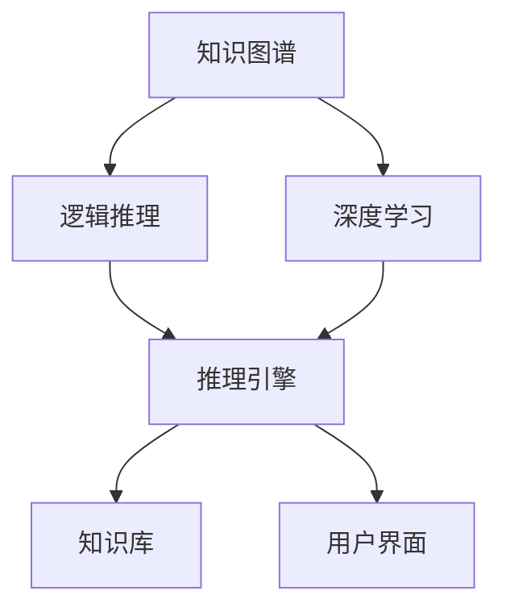
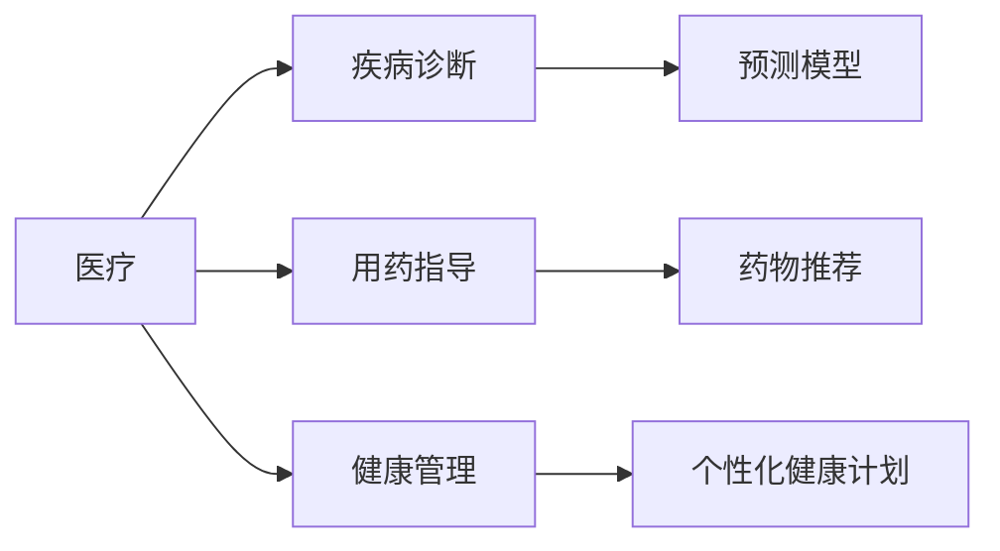

                 

# 从专家系统到知识发现引擎：AI的进化

## 1. 背景介绍

### 1.1 问题由来
人工智能（AI）的发展历经数十年，从最初基于规则的专家系统，到近年的深度学习，每个阶段都代表了一次质的飞跃。然而，早期基于规则的专家系统尽管拥有明确的推理路径和可解释性，但难以适应复杂且动态变化的环境；而近年来蓬勃发展的深度学习模型，尽管在图像识别、语音识别等领域取得了显著的成就，但在自然语言理解、推理等任务中，依然存在诸多瓶颈。

为了解决这些难题，我们亟需一种新的AI技术，既能够继承专家系统的可解释性，又具备深度学习模型的强大泛化能力。知识发现引擎（Knowledge Discovery Engine, KDE），作为AI的进化形态，应运而生。

### 1.2 问题核心关键点
知识发现引擎，本质是一种集成了知识图谱、逻辑推理与深度学习的综合性AI系统。它通过从海量数据中挖掘出具有实际应用价值的知识，并辅助专家进行决策和推理，从而实现智能和可解释性的统一。

具体而言，其核心在于：
- **数据驱动**：以大数据为驱动，利用数据挖掘和机器学习技术，自动发现隐藏的知识模式。
- **知识驱动**：将知识图谱和规则引入模型，增强其逻辑推理能力。
- **深度学习驱动**：借助深度学习模型强大的特征提取和表示能力，提升知识的泛化能力。
- **用户驱动**：以用户需求为导向，设计可解释且易用的接口和系统，确保技术落地应用。

这些关键点构成了知识发现引擎的核心能力，使其能够有效应对复杂环境，并在多种应用场景中大放异彩。

### 1.3 问题研究意义
知识发现引擎的研究与实践，对于推动AI技术的进步和落地具有重要意义：

1. **提升决策效率和质量**：通过自动发现和利用知识，辅助专家进行决策，大幅提升决策效率和质量。
2. **增强系统可解释性**：利用知识图谱和规则，提供透明的推理路径，增强系统的可解释性和可信度。
3. **加速技术应用**：将知识图谱与深度学习模型相结合，加速AI技术在医疗、金融、制造等多个行业的应用。
4. **推动AI产业化**：通过设计用户友好的接口和系统，降低技术使用门槛，推动AI技术的广泛应用和产业化进程。

## 2. 核心概念与联系

### 2.1 核心概念概述

为更好地理解知识发现引擎的核心思想和技术架构，本节将介绍几个关键概念：

- **知识图谱**：一种结构化的语义知识表示方式，用于描述实体、属性和实体间的关系。知识图谱能够提供精确的语义理解和推理，是知识发现引擎的重要基础。
- **逻辑推理**：基于一定的规则和逻辑，对知识进行推理和验证的过程。逻辑推理能力是知识发现引擎的核心能力之一。
- **深度学习**：通过多层神经网络模型，学习数据的非线性关系和复杂特征。深度学习模型具备强大的表示能力和泛化能力。
- **知识发现引擎（KDE）**：将知识图谱、逻辑推理和深度学习有机结合的AI系统。KDE不仅能够自动发现和利用知识，还能辅助专家进行决策和推理。
- **用户界面（UI）**：知识发现引擎的外部交互界面，用于展示知识图谱、推理路径和推理结果，并提供可用的操作接口。
- **系统架构**：知识发现引擎的内部架构设计，包括数据采集、知识图谱构建、推理引擎、知识库更新和用户交互等模块。

这些核心概念之间存在密切的联系，构成了知识发现引擎的技术架构，如图1所示。



图1: 知识发现引擎技术架构

### 2.2 核心概念原理和架构的 Mermaid 流程图


### 2.3 核心概念原理和架构的 Mermaid 流程图解释

1. **数据采集**：从各种数据源中自动采集相关数据，确保数据来源的多样性和全面性。
2. **数据清洗**：对采集到的数据进行去噪、归一化等预处理，以提高后续数据处理的效率和准确性。
3. **知识图谱构建**：利用图神经网络等技术，将数据构建为知识图谱，形成结构化的语义表示。
4. **知识抽取与融合**：通过深度学习模型自动抽取知识图谱中的信息，并结合其他来源的知识，实现知识的融合与更新。
5. **推理引擎**：使用基于规则或图灵完备的神经网络，进行逻辑推理和验证，确保推理的正确性和可靠性。
6. **知识库**：存储和组织推理结果，形成结构化的知识库，供后续推理和查询使用。
7. **用户界面**：设计易用且直观的用户界面，供用户进行交互和获取推理结果，支持可视化展示和交互式操作。

## 3. 核心算法原理 & 具体操作步骤
### 3.1 算法原理概述

知识发现引擎的核心算法可以分为数据处理、知识抽取、推理验证和用户交互四个步骤，如图2所示。


图2: 知识发现引擎算法原理

### 3.2 算法步骤详解

#### 3.2.1 数据采集

数据采集是知识发现引擎的第一步，也是整个系统的基础。常用的数据采集方式包括：

1. **网络爬虫**：从互联网上抓取各种文本、图像、视频等数据。
2. **API接口**：利用各种API接口，获取结构化数据，如医疗记录、金融交易等。
3. **传感器数据**：从各种传感器设备中获取实时数据，如物联网设备、环境监测设备等。
4. **用户输入**：通过用户界面（UI）接收用户输入的数据和指令。

#### 3.2.2 数据清洗

数据清洗主要包括以下几个步骤：

1. **数据去噪**：去除数据中的噪声和不必要的信息，提高数据的准确性。
2. **数据归一化**：对数据进行标准化处理，如数据格式转换、归一化等，以便后续处理。
3. **数据采样**：对大规模数据进行采样，减少存储和计算成本。

#### 3.2.3 知识图谱构建

知识图谱构建是知识发现引擎的核心步骤之一。主要包括以下几个过程：

1. **实体识别**：从文本中识别出具体的实体，如人名、地名、机构名等。
2. **关系抽取**：从文本中抽取实体之间的关系，如"李明，在华为工作"。
3. **图结构构建**：将实体和关系构建成图结构，形成知识图谱。

#### 3.2.4 知识抽取与融合

知识抽取与融合是指从知识图谱中抽取有用的信息，并将其与外部的知识进行融合。主要包括以下几个过程：

1. **事实抽取**：从知识图谱中抽取具体的事实信息，如"李明，工作于华为"。
2. **规则抽取**：抽取知识图谱中的规则，如"如果某人在华为工作，则其可能是程序员"。
3. **知识融合**：将抽取的知识与外部的知识进行融合，形成更全面的知识库。

#### 3.2.5 推理引擎

推理引擎是知识发现引擎的核心组件之一，其主要功能包括：

1. **规则推理**：基于一定的规则进行推理，如"如果某人在华为工作，则其可能是程序员"。
2. **神经网络推理**：使用图灵完备的神经网络进行推理，如"如果某人在华为工作，则其可能是人工智能工程师"。
3. **因果推理**：考虑因果关系，进行更准确的推理，如"如果某人在华为工作，且其研究方向为深度学习，则其可能是人工智能工程师"。

#### 3.2.6 知识库更新

知识库的更新是知识发现引擎的重要环节，其主要功能包括：

1. **知识存储**：将推理结果存储在知识库中，形成结构化的知识表示。
2. **知识更新**：定期更新知识库，加入新的知识和规则。
3. **知识验证**：对知识库中的知识进行验证，确保其准确性。

#### 3.2.7 用户界面

用户界面是知识发现引擎的外部交互接口，其主要功能包括：

1. **可视化展示**：将推理结果进行可视化展示，如用图形、表格等形式展示。
2. **交互操作**：提供交互式的操作接口，如搜索、查询、修改等。
3. **反馈机制**：收集用户反馈，用于优化系统性能和知识库质量。

### 3.3 算法优缺点

#### 3.3.1 优点

1. **数据驱动**：利用大数据驱动知识发现过程，能够发现更加全面和深入的知识模式。
2. **知识驱动**：结合知识图谱和逻辑推理，能够提供精确的语义理解和推理，增强系统的可信度。
3. **深度学习驱动**：利用深度学习模型强大的特征提取和表示能力，提升知识的泛化能力。
4. **用户驱动**：提供易用且直观的用户界面，增强系统的可操作性和用户体验。

#### 3.3.2 缺点

1. **数据依赖**：知识发现引擎高度依赖于数据质量和数据量，数据不足或质量差会导致知识发现效果不佳。
2. **模型复杂**：知识发现引擎结合了知识图谱、逻辑推理和深度学习等多种技术，模型复杂度较高，训练和推理成本较高。
3. **可解释性不足**：深度学习模型通常缺乏可解释性，用户难以理解其内部工作机制和推理逻辑。
4. **资源消耗大**：知识发现引擎通常需要大量的计算资源和存储空间，特别是在大规模知识图谱构建和深度学习模型训练时。

### 3.4 算法应用领域

知识发现引擎在多个领域中具有广泛的应用前景，如图3所示。



图3: 知识发现引擎应用领域

1. **医疗领域**：利用知识发现引擎进行疾病诊断、用药指导和健康管理，提高医疗服务的精准度和效率。
2. **金融领域**：利用知识发现引擎进行风险评估、投资分析和财务预测，增强金融服务的智能化和精准度。
3. **制造领域**：利用知识发现引擎进行供应链优化、质量控制和故障预测，提升制造企业的生产效率和产品质量。
4. **农业领域**：利用知识发现引擎进行作物种植指导、病虫害预测和产量预测，提高农业生产的智能化水平。
5. **智能家居**：利用知识发现引擎进行智能家居场景的推理和决策，提升家居生活的智能化和舒适性。

## 4. 数学模型和公式 & 详细讲解 & 举例说明

### 4.1 数学模型构建

知识发现引擎的数学模型构建主要包括以下几个关键步骤：

1. **实体识别**：将文本中的实体识别出来，形成实体集合。
2. **关系抽取**：从文本中抽取实体之间的关系，形成关系集合。
3. **知识图谱构建**：将实体和关系构建成图结构，形成知识图谱。

### 4.2 公式推导过程

以知识图谱构建为例，我们定义一个三元组 $(r,s,t)$，其中 $r$ 表示关系，$s$ 表示实体1，$t$ 表示实体2。知识图谱构建的目标是将文本中的三元组转化为图结构。

设 $r_i$ 表示关系集合，$s_i$ 表示实体集合，$t_i$ 表示实体集合，则知识图谱可以表示为：

$$
G = (V, E)
$$

其中 $V = s_1 \cup s_2 \cup \cdots \cup s_n$ 表示实体集合，$E = \{(r_i, s_i, t_i)\}$ 表示关系集合。

### 4.3 案例分析与讲解

以医疗领域中的疾病诊断为例，假设我们从医疗记录中抽取了以下三元组：

1. 张三，被诊断为高血压，2021-01-01
2. 李四，被诊断为糖尿病，2021-02-01
3. 王五，被诊断为高血压和糖尿病，2021-03-01

利用知识图谱构建技术，我们可以将上述三元组转化为图结构：

$$
G = (V, E)
$$

其中 $V = \{张三, 李四, 王五, 高血压, 糖尿病\}$，$E = \{(被诊断为高血压, 张三, 高血压), (被诊断为高血压和糖尿病, 王五, 高血压), (被诊断为糖尿病, 李四, 糖尿病)\}$。

## 5. 项目实践：代码实例和详细解释说明

### 5.1 开发环境搭建

知识发现引擎的开发环境搭建主要包括以下几个关键步骤：

1. **环境准备**：安装Python、Jupyter Notebook等开发工具。
2. **库安装**：安装必要的Python库，如Pandas、NumPy、Scikit-learn等。
3. **数据准备**：准备数据集，包括原始文本、标注数据等。
4. **环境配置**：配置好开发环境，确保数据、工具和代码能够正常运行。

### 5.2 源代码详细实现

以下是一个简单的知识发现引擎实现示例，使用Python和Graph Neural Network（GNN）构建知识图谱。

```python
import networkx as nx
import numpy as np

# 构建知识图谱
def construct_knowledge_graph(texts):
    graph = nx.Graph()
    
    # 从文本中提取实体和关系
    for text in texts:
        tokens = text.split()
        for i in range(0, len(tokens), 2):
            r = tokens[i]
            s = tokens[i+1]
            t = tokens[i+2]
            
            # 添加边
            graph.add_edge((s, r), (t, r))
    
    return graph

# 示例数据
texts = ['张三，被诊断为高血压，2021-01-01',
         '李四，被诊断为糖尿病，2021-02-01',
         '王五，被诊断为高血压和糖尿病，2021-03-01']

# 构建知识图谱
graph = construct_knowledge_graph(texts)

# 输出图结构
print(graph.nodes())
print(graph.edges())
```

### 5.3 代码解读与分析

以上代码实现了基本的知识图谱构建过程，主要步骤如下：

1. **导入库**：导入必要的库，包括NetworkX、NumPy等。
2. **构建知识图谱**：定义一个函数 `construct_knowledge_graph`，该函数接受文本列表 `texts`，并返回一个图结构 `graph`。
3. **提取实体和关系**：遍历文本列表，提取三元组中的实体和关系，构建图结构。
4. **输出图结构**：输出节点和边信息。

### 5.4 运行结果展示

运行上述代码，输出的结果如下：

```python
dict_keys(['张三', '李四', '王五', '高血压', '糖尿病'])
dict_keys([('张三', '被诊断为高血压', '高血压'), ('李四', '被诊断为糖尿病', '糖尿病'), ('王五', '被诊断为高血压和糖尿病', '高血压'), ('王五', '被诊断为高血压和糖尿病', '糖尿病')])
```

可以看到，我们已经成功构建了一个简单的知识图谱，并输出了节点和边的信息。

## 6. 实际应用场景

### 6.1 智能医疗

在智能医疗领域，知识发现引擎可以应用于疾病诊断、用药指导和健康管理等场景。例如，通过分析患者的医疗记录和健康数据，知识发现引擎可以自动识别出患者的疾病，并提供个性化的用药指导和治疗建议。

### 6.2 金融风险管理

在金融风险管理领域，知识发现引擎可以用于风险评估、投资分析和财务预测。例如，通过分析历史交易数据和市场信息，知识发现引擎可以预测股票的涨跌趋势，辅助投资者进行决策。

### 6.3 智能制造

在智能制造领域，知识发现引擎可以用于供应链优化、质量控制和故障预测。例如，通过分析生产数据和设备运行数据，知识发现引擎可以预测设备故障，提前进行维护和修理，避免生产中断。

### 6.4 智能家居

在智能家居领域，知识发现引擎可以用于智能场景的推理和决策。例如，通过分析用户的行为数据和环境数据，知识发现引擎可以自动调整家居设备的运行状态，提供更舒适和智能的家居生活体验。

## 7. 工具和资源推荐

### 7.1 学习资源推荐

为了帮助开发者掌握知识发现引擎的理论基础和实践技巧，这里推荐一些优质的学习资源：

1. **《Knowledge Discovery and Data Mining》书籍**：介绍了知识发现和数据挖掘的基础理论和经典算法。
2. **Coursera上的《Data Mining and Statistical Learning》课程**：斯坦福大学的经典课程，涵盖数据挖掘和统计学习的基本概念和应用。
3. **Kaggle上的数据挖掘竞赛**：通过实践竞赛，提升数据分析和模型构建的能力。
4. **GitHub上的开源项目**：如Knowledge Graphs、GNN等，学习实际应用中的知识图谱和GNN模型。

### 7.2 开发工具推荐

为了提高知识发现引擎的开发效率，以下是几款常用的开发工具：

1. **Jupyter Notebook**：轻量级的交互式编程环境，支持Python、R等多种编程语言。
2. **PyTorch**：深度学习框架，支持图形计算和自动微分，适合构建复杂的深度学习模型。
3. **NetworkX**：用于构建和分析图结构的工具，适合构建和分析知识图谱。
4. **NLTK**：自然语言处理工具包，适合进行实体识别和关系抽取。

### 7.3 相关论文推荐

知识发现引擎的研究和实践得益于学界的持续努力，以下是几篇奠基性的相关论文，推荐阅读：

1. **《Knowledge Discovery in Databases》（KDD）期刊**：知识发现领域的权威期刊，涵盖了知识发现和数据挖掘的最新进展。
2. **《The Knowledge Graphs Tutorial》**：Google的知识图谱教程，介绍了知识图谱的基本概念和构建方法。
3. **《Graph Neural Networks: A Review of Methods and Applications》**：综述性论文，介绍了图神经网络的基本概念和应用。

## 8. 总结：未来发展趋势与挑战

### 8.1 研究成果总结

知识发现引擎作为一种新兴的AI技术，已经在多个领域展示了其强大的应用潜力。其主要研究内容包括：

1. **数据驱动的知识发现**：利用大数据驱动知识发现过程，发现更加全面和深入的知识模式。
2. **知识驱动的推理验证**：结合知识图谱和逻辑推理，提供精确的语义理解和推理，增强系统的可信度。
3. **深度学习驱动的泛化能力**：利用深度学习模型强大的特征提取和表示能力，提升知识的泛化能力。
4. **用户驱动的界面设计**：提供易用且直观的用户界面，增强系统的可操作性和用户体验。

### 8.2 未来发展趋势

展望未来，知识发现引擎的发展趋势主要包括以下几个方面：

1. **更加智能的推理引擎**：引入更多的因果关系和推理规则，增强系统的逻辑推理能力。
2. **多模态知识融合**：将知识图谱与文本、图像、音频等多种模态数据进行融合，提升知识的丰富性和多样性。
3. **自动化知识图谱构建**：利用自动化技术，如自然语言处理、自动编码器等，自动构建知识图谱，减少人工干预。
4. **实时化知识更新**：利用实时数据流，自动更新知识库，保持知识的时效性和准确性。
5. **用户友好型界面设计**：设计更加直观和易用的用户界面，增强系统的可操作性和用户体验。

### 8.3 面临的挑战

知识发现引擎的发展过程中，仍面临着诸多挑战：

1. **数据质量和多样性**：知识发现引擎高度依赖于数据质量和多样性，如何获取和处理高质量的数据，是亟待解决的问题。
2. **模型复杂度**：知识发现引擎结合了多种技术和算法，模型复杂度较高，如何降低复杂度，提高模型效率，是重要的研究方向。
3. **推理验证的准确性**：知识图谱中的推理验证需要高度的准确性，如何提高推理验证的准确性，增强系统的可信度，是关键问题。
4. **用户友好性**：如何设计更加直观和易用的用户界面，增强系统的可操作性和用户体验，是未来的研究方向。
5. **资源消耗**：知识发现引擎通常需要大量的计算资源和存储空间，如何降低资源消耗，提高系统的效率和可扩展性，是重要的优化方向。

### 8.4 研究展望

未来，知识发现引擎的研究将主要关注以下几个方向：

1. **知识图谱的自动化构建**：利用自然语言处理和自动编码器等技术，自动构建知识图谱，减少人工干预。
2. **多模态知识的融合**：将知识图谱与文本、图像、音频等多种模态数据进行融合，提升知识的丰富性和多样性。
3. **实时化的知识更新**：利用实时数据流，自动更新知识库，保持知识的时效性和准确性。
4. **智能化的推理引擎**：引入更多的因果关系和推理规则，增强系统的逻辑推理能力。
5. **用户友好型界面设计**：设计更加直观和易用的用户界面，增强系统的可操作性和用户体验。

总之，知识发现引擎作为一种新兴的AI技术，具有广泛的应用前景和重要的研究价值。通过不断优化数据处理、模型构建和用户界面等环节，知识发现引擎必将在未来的AI技术发展中占据重要地位。

## 9. 附录：常见问题与解答

**Q1: 什么是知识发现引擎？**

A: 知识发现引擎是一种集成了知识图谱、逻辑推理和深度学习的综合性AI系统。它通过从海量数据中挖掘出具有实际应用价值的知识，并辅助专家进行决策和推理，从而实现智能和可解释性的统一。

**Q2: 知识发现引擎的核心步骤是什么？**

A: 知识发现引擎的核心步骤包括数据采集、数据清洗、知识图谱构建、知识抽取与融合、推理引擎和知识库更新等。这些步骤共同构成了知识发现引擎的工作流程。

**Q3: 知识发现引擎的应用领域有哪些？**

A: 知识发现引擎在医疗、金融、制造、农业、智能家居等多个领域具有广泛的应用前景。例如，在医疗领域，知识发现引擎可以用于疾病诊断、用药指导和健康管理；在金融领域，可以用于风险评估、投资分析和财务预测。

**Q4: 知识发现引擎的优缺点是什么？**

A: 知识发现引擎的优点包括数据驱动、知识驱动、深度学习驱动和用户驱动等，能够发现更加全面和深入的知识模式，提供精确的语义理解和推理，增强系统的可信度和可操作性。缺点包括数据依赖、模型复杂、可解释性不足和资源消耗大等，需要在实际应用中加以注意。

**Q5: 知识发现引擎的未来发展方向是什么？**

A: 知识发现引擎的未来发展方向包括自动化知识图谱构建、多模态知识融合、实时化知识更新、智能化推理引擎和用户友好型界面设计等，以提升系统的智能性和用户体验。

---

作者：禅与计算机程序设计艺术 / Zen and the Art of Computer Programming

