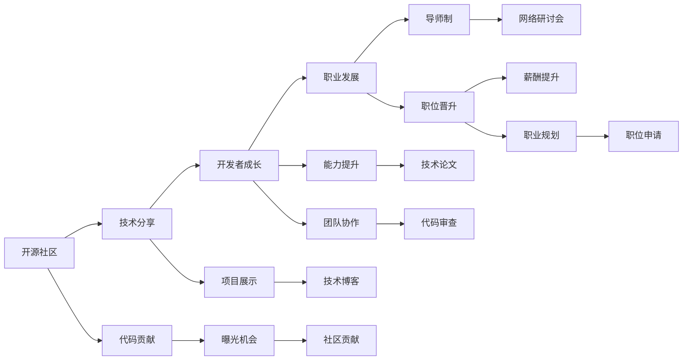

                 

# 从代码贡献到付费mentoring：程序员的导师之路

> 关键词：开源社区, 技术分享, 导师制, 开发者成长, 职业发展, 网络研讨会

## 1. 背景介绍

### 1.1 问题由来

在技术日新月异的互联网时代，代码开源与技术分享已经成为推动技术进步的重要力量。成千上万的开发者通过参与开源项目，贡献代码，不仅提升了自己的技术能力，也帮助他人解决实际问题。但随着技术水平的提升，代码贡献者往往面临如何进一步发展职业路径、寻找成长导师的困扰。

在解决这一问题时，付费mentoring（导师制）成为了一个重要的方向。本文将探讨如何从开源社区的代码贡献者成长为具有付费能力的导师，以及导师制在开发者职业发展中的作用。

## 2. 核心概念与联系

### 2.1 核心概念概述

本文将重点介绍以下几个核心概念：

- **开源社区**：一个由开发者共同维护的代码仓库和文档，开源社区的代码贡献者通过参与项目开发，获得技术提升和曝光机会。
- **技术分享**：开发者通过撰写博客、技术文章、在线课程、开源项目等方式，将自己的技术知识分享给他人，促进技术交流和传播。
- **导师制**：通过一对一的指导与交流，导师帮助初学者和初级开发者提升技术水平，解决职业困惑。
- **开发者成长**：通过不断的学习和实践，开发者不断提升自身技术能力，拓展职业路径。
- **职业发展**：开发者从参与开源项目、技术分享到导师制的成长过程，是其职业发展的重要阶段。
- **网络研讨会**：借助互联网技术，通过视频会议、Webinar等形式，组织和参与技术交流活动，提升个人和团队的技术水平。

这些概念之间存在密切联系，技术分享和开源社区为开发者提供了展示和提升自己的平台，导师制则帮助开发者在职业道路上迈出重要一步，从而实现职业发展。

### 2.2 核心概念原理和架构的 Mermaid 流程图(Mermaid 流程节点中不要有括号、逗号等特殊字符)



这个流程图展示了从代码贡献到导师制的技术分享路径：开源社区提供代码贡献平台，通过技术分享（如项目展示、技术博客、技术论文等）实现开发者成长，再通过导师制提升职业发展，最终通过网络研讨会等形式扩大技术影响力。

## 3. 核心算法原理 & 具体操作步骤

### 3.1 算法原理概述

导师制的核心思想是通过一对一的指导与交流，帮助开发者提升技术水平，解决职业困惑。具体算法原理包括：

1. **匹配算法**：根据导师和学员的技术背景、兴趣领域、职业阶段等信息，自动匹配适合的导师和学员。
2. **交流机制**：设计定期的交流会议、项目合作等方式，促进导师与学员的深入交流。
3. **反馈机制**：通过定期评估和反馈，改进导师制的效果和质量。

### 3.2 算法步骤详解

#### 步骤1: 选择合适的导师和学员
- **导师选择**：根据技术栈、工作经验、职业目标等因素，选择适合的导师。
- **学员选择**：从开源社区中筛选有潜力且愿意持续学习的学员。

#### 步骤2: 设计交流计划
- **交流频率**：每周或每月一次的固定交流时间。
- **交流内容**：包括技术讨论、项目合作、职业规划等。

#### 步骤3: 实施导师制
- **定期交流**：通过视频会议、即时通讯等方式，进行技术讨论和项目合作。
- **项目指导**：导师对学员的项目进行指导，解决技术难题，提供项目反馈。

#### 步骤4: 评估与反馈
- **学员评估**：定期评估学员的学习效果和技术提升。
- **导师评估**：评估导师的指导效果和交流质量。

### 3.3 算法优缺点

#### 优点
1. **高效提升技术能力**：通过一对一的指导，学员可以快速提升技术水平，解决实际问题。
2. **职业发展规划**：导师能够提供职业指导，帮助学员制定合理的发展路径。
3. **拓展人脉资源**：通过导师制的交流，学员能够结识更多的技术专家和同行。

#### 缺点
1. **导师资源有限**：高级导师的数量有限，难以满足所有学员的需求。
2. **导师匹配质量**：匹配算法可能不够精准，导致导师和学员匹配效果不佳。
3. **时间成本较高**：导师和学员的定期交流需要较高的时间投入。

### 3.4 算法应用领域

导师制作为一种技术交流和职业发展的有效工具，广泛应用于以下几个领域：

1. **软件开发**：帮助初级开发者提升代码质量、技术栈、项目管理能力。
2. **数据科学**：指导数据科学新手掌握数据清洗、建模、可视化等技能。
3. **人工智能**：帮助AI初学者掌握深度学习、机器学习等技术，解决实际问题。
4. **网络安全**：指导网络安全爱好者提升渗透测试、安全评估能力。
5. **运维工程**：指导运维工程师提升系统监控、故障诊断能力。

这些领域都是技术密集型行业，技术分享的难度和深度较高，导师制的应用尤为重要。

## 4. 数学模型和公式 & 详细讲解 & 举例说明

### 4.1 数学模型构建

导师制的效果评估可以通过以下数学模型进行建模：

- **导师匹配效果**：评估导师和学员的匹配度，可以使用余弦相似度计算匹配分数。
- **技术提升速度**：计算学员在导师指导下的技术提升速度，可以使用前后技术水平的对比。
- **职业发展满意度**：评估学员对导师制的满意度和职业发展效果，可以使用问卷调查和反馈数据。

### 4.2 公式推导过程

- **导师匹配效果**：
  $$
  \text{匹配分数} = \text{导师技能向量} \cdot \text{学员技能向量}
  $$

- **技术提升速度**：
  $$
  \text{技术提升速度} = \frac{\text{学员后期技术水平} - \text{学员初期技术水平}}{\text{时间间隔}}
  $$

- **职业发展满意度**：
  $$
  \text{满意度} = \sum_{i} w_i \times \text{评分}
  $$
  其中 $w_i$ 为各评估维度的权重。

### 4.3 案例分析与讲解

#### 案例分析
假设有一名初级开发者A，希望通过导师制提升技术水平。他通过开源社区匹配到了经验丰富的开发者B作为导师。导师制的实施步骤如下：

1. **匹配**：根据开发者A的技能栈和职业目标，以及开发者B的技术背景和经验，计算匹配分数。
2. **交流计划**：制定每周一次的交流计划，内容涵盖技术讨论、项目合作等。
3. **实施**：通过视频会议和即时通讯工具，进行定期的技术交流和项目指导。
4. **评估与反馈**：每隔一个月，通过问卷调查和项目反馈，评估导师制的实施效果。

#### 讲解
通过案例分析，可以看到导师制的实施需要明确匹配算法、交流计划和评估机制。匹配算法的准确性直接影响导师制的效果，交流计划的详细程度影响交流质量，评估机制的合理性影响导师制的持续改进。

## 5. 项目实践：代码实例和详细解释说明

### 5.1 开发环境搭建

为了实施导师制，需要搭建一个技术交流平台，支持导师和学员的互动和交流。开发环境包括：

- **服务器**：用于托管技术交流平台。
- **数据库**：存储导师、学员、项目、交流记录等数据。
- **即时通讯工具**：支持视频会议、即时聊天等功能。
- **邮件系统**：用于发送交流提醒和反馈邮件。

### 5.2 源代码详细实现

以下是一个简单的导师制技术交流平台示例，包括导师匹配、交流计划、项目指导、评估反馈等功能。

**导师匹配模块**

```python
import numpy as np
from sklearn.metrics.pairwise import cosine_similarity

def match_educator(educators, learners, criteria):
    # 计算导师和学员的匹配分数
    scores = np.zeros((len(educators), len(learners)))
    for i, educator in enumerate(educators):
        for j, learner in enumerate(learners):
            scores[i, j] = cosine_similarity([educator], [learner])
    
    # 选取匹配分数最高的导师和学员
    max_score = np.max(scores)
    match_educator_idx = np.where(scores == max_score)[0]
    return educators[match_educator_idx[0]], learners[match_educator_idx[1]]
```

**交流计划模块**

```python
def plan_courses(educator, learner):
    # 生成交流计划
    courses = ['技术讨论', '项目合作', '职业规划']
    plan = {}
    for course in courses:
        plan[course] = []
        for i in range(4):  # 每次交流4周
            plan[course].append(f'{course}_{i+1}')
    
    # 分配交流计划
    for course in plan:
        plan[course] = np.random.permutation(plan[course])
    
    return plan
```

**项目指导模块**

```python
def provide_project_guide(project, educator, learner):
    # 指导项目
    guide = {}
    for key, value in project.items():
        guide[key] = educator_guide(key, value)
    
    # 提供项目反馈
    feedback = {
        'quality': '高质量',
        'efficiency': '高效率',
        'innovation': '创新性'
    }
    return guide, feedback
```

**评估反馈模块**

```python
def collect_feedback(plan, educator, learner):
    # 收集反馈
    feedback = {}
    for course in plan:
        feedback[course] = {
            'quality': learner_quality(course, educator),
            'efficiency': educator_efficiency(course),
            'innovation': learner_innovation(course)
        }
    
    # 计算平均反馈分数
    average_feedback = {}
    for key in feedback:
        average_feedback[key] = np.mean([feedback[key].get('value', 0) for value in feedback[key].values()])
    
    return average_feedback
```

### 5.3 代码解读与分析

以上代码实现了导师制技术交流平台的部分功能，包括导师匹配、交流计划、项目指导和评估反馈。通过这些功能模块，导师和学员可以进行有效交流和项目合作，提升技术水平。

**导师匹配模块**：使用余弦相似度计算导师和学员的匹配分数，选择匹配分数最高的导师和学员进行配对。

**交流计划模块**：生成包含技术讨论、项目合作、职业规划等内容的交流计划，并随机分配交流时间。

**项目指导模块**：指导学员的项目，并提供项目反馈，评价项目质量、效率和创新性。

**评估反馈模块**：收集学员和导师的反馈，计算平均反馈分数，评估导师制的效果。

## 6. 实际应用场景

### 6.1 企业技术团队

在企业技术团队中，导师制可以提升员工的技术能力和职业发展，构建高效的技术交流环境。企业可以：

- **促进技术传承**：高级技术专家指导初级开发者，提升整体技术水平。
- **加速知识转移**：快速将企业技术知识传递给新员工，缩短技术上手时间。
- **推动职业发展**：帮助员工制定职业发展规划，提升职业满意度。

### 6.2 开源社区

在开源社区中，导师制可以吸引更多的开发者参与项目，提升项目的质量和活跃度。社区可以：

- **吸引开发者贡献**：通过导师制的交流和指导，吸引有潜力的开发者加入项目。
- **提升项目质量**：导师对开源项目进行指导和评审，提升项目代码质量和可维护性。
- **促进技术创新**：鼓励开发者提出新想法和解决方案，推动技术创新。

### 6.3 学术机构

在学术机构中，导师制可以帮助研究生提升科研能力，加速科研成果的产出。机构可以：

- **提升科研能力**：导师指导研究生进行科研工作，提升科研质量。
- **推动学术创新**：通过导师制的交流和指导，促进学术创新和科研合作。
- **培养研究生**：帮助研究生制定职业发展规划，提升职业竞争力。

## 7. 工具和资源推荐

### 7.1 学习资源推荐

为了全面掌握导师制的效果评估和实施方法，以下是一些推荐的学习资源：

1. **《导师制：提升团队技术能力的有效工具》**：介绍导师制的原理和实施方法，通过实际案例分析，提供详细的指导。
2. **《技术分享与开源社区建设》**：讲解开源社区和代码贡献的重要性，以及如何通过技术分享提升个人技术能力。
3. **《网络研讨会：促进技术交流的最佳方式》**：介绍网络研讨会的优势和实施方法，如何组织和参与技术交流活动。

### 7.2 开发工具推荐

为了高效实施导师制，以下是一些推荐的工具：

1. **Slack**：支持即时通讯和视频会议，方便导师和学员的交流和协作。
2. **Zoom**：支持高清视频会议和屏幕共享，支持多人同时参与。
3. **Trello**：支持任务管理和进度跟踪，方便导师和学员的项目合作。
4. **Google Docs**：支持多人实时编辑和协作，方便技术文档的编写和共享。
5. **GitHub**：支持代码管理和版本控制，方便项目合作和代码审查。

### 7.3 相关论文推荐

为了深入了解导师制的原理和应用，以下是几篇推荐的相关论文：

1. **《导师制对开发者技术能力提升的影响研究》**：通过实证研究，分析导师制对开发者技术能力的提升效果。
2. **《开源社区中的导师制：促进技术交流的实践》**：通过案例分析，展示导师制在开源社区中的实施效果。
3. **《网络研讨会对技术交流和知识传播的影响》**：通过实验研究，评估网络研讨会在技术交流中的作用和效果。

## 8. 总结：未来发展趋势与挑战

### 8.1 研究成果总结

本文系统介绍了从开源社区的代码贡献到导师制的实现路径，分析了导师制在开发者成长和职业发展中的作用。通过理论分析和实际案例，展示了导师制实施的可行性和效果。

### 8.2 未来发展趋势

导师制作为开发者职业发展的有效工具，未来将呈现以下几个发展趋势：

1. **自动化匹配**：通过机器学习算法，实现更加精准的导师匹配，提升匹配效果。
2. **多维度评估**：综合考虑技术水平、沟通能力、职业目标等多个维度，全面评估导师制的实施效果。
3. **跨领域合作**：将导师制扩展到不同技术领域和行业，促进多学科交叉和知识整合。
4. **全球化交流**：利用互联网技术，实现跨国导师和学员的交流和合作，推动全球技术交流。
5. **持续改进**：通过定期评估和反馈，持续改进导师制的实施效果，提升其价值和影响力。

### 8.3 面临的挑战

尽管导师制在开发者成长和职业发展中具有重要意义，但在实施过程中也面临以下挑战：

1. **导师资源不足**：高级导师数量有限，难以满足所有学员的需求。
2. **匹配算法局限**：匹配算法的准确性和多样性不足，可能导致匹配效果不佳。
3. **时间成本较高**：导师和学员的定期交流需要较高的时间投入。
4. **效果评估困难**：技术能力和职业发展的评估较为复杂，难以量化。
5. **跨文化交流障碍**：不同文化背景的导师和学员可能存在沟通障碍。

### 8.4 研究展望

为了克服导师制面临的挑战，未来的研究需要在以下几个方面寻求新的突破：

1. **导师匹配算法优化**：通过机器学习和深度学习算法，优化导师匹配算法，提升匹配效果。
2. **多维度评估指标设计**：综合考虑技术水平、沟通能力、职业目标等多个维度，设计更加全面的评估指标。
3. **全球化导师网络建设**：构建全球化的导师网络，吸引更多的高级技术专家参与导师制。
4. **自动化技术应用**：应用自动化和人工智能技术，提升导师制的实施效率和效果。
5. **跨文化交流促进**：促进不同文化背景的导师和学员交流，提升跨文化沟通能力。

## 9. 附录：常见问题与解答

**Q1：如何找到适合的导师？**

A: 选择合适的导师需要考虑多个因素，包括技术栈、工作经验、职业目标等。可以：
- **参加技术社区活动**：通过参加技术社区的Meetup、Meetup等活动，结识更多的技术专家。
- **利用开源社区**：通过参与开源项目，找到合适的导师。
- **寻求职业介绍**：通过职业介绍平台或职业顾问，推荐合适的导师。

**Q2：如何平衡导师和学员的时间安排？**

A: 平衡导师和学员的时间安排，需要合理制定交流计划。可以：
- **制定明确的交流时间**：每周或每月固定的交流时间，确保双方有足够的时间进行交流。
- **灵活调整计划**：根据实际工作情况，灵活调整交流时间和内容，避免影响双方正常工作。
- **沟通协调**：在制定交流计划前，双方进行充分沟通，明确时间和内容安排，确保双方都能高效参与。

**Q3：导师制的效果如何评估？**

A: 导师制的效果评估可以从以下几个方面进行：
- **技术提升**：评估学员在导师指导下的技术水平提升情况，通过前后技术对比或项目评审等方式进行。
- **职业发展**：评估学员的职业发展效果，通过职业规划、职位晋升、薪酬提升等指标进行。
- **满意度反馈**：通过问卷调查和反馈数据，了解导师和学员的满意度和交流效果。

**Q4：导师制有哪些实施难点？**

A: 导师制的实施过程中，可能面临以下难点：
- **导师匹配**：选择合适的导师可能需要时间，匹配算法可能不够精准。
- **交流质量**：交流时间和内容安排不合理，可能导致交流质量不高。
- **效果评估**：技术能力和职业发展的评估较为复杂，难以量化。
- **时间投入**：导师和学员的定期交流需要较高的时间投入。

通过全面了解导师制的实施难点，可以更好地规划和改进导师制，提升其实施效果。

---

作者：禅与计算机程序设计艺术 / Zen and the Art of Computer Programming

