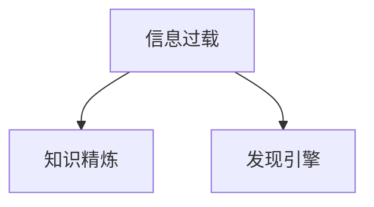

                 

# 从信息过载到知识精炼：发现引擎的价值

## 1. 背景介绍

在当今信息爆炸的时代，我们每天都会接触到海量的数据和信息。从日常生活中的新闻、社交媒体，到工作中的数据报告、研究论文，信息过载已成为我们面临的一个重大问题。如何在这些繁杂的信息中快速找到真正有用的知识，并加以利用，成为信息技术领域亟待解决的重要课题。

## 2. 核心概念与联系

### 2.1 核心概念概述

在本节中，我们将介绍几个核心概念，并阐明它们之间的联系。

- **信息过载**：指用户接收到的信息量远远超过了他们的处理能力，导致信息无法被有效利用。
- **知识精炼**：指通过算法和技术手段，从大量信息中提取出有价值、有逻辑的结论，帮助用户快速理解和学习。
- **发现引擎**：一种智能的信息检索工具，旨在通过先进的算法和模型，帮助用户快速发现、获取和理解信息。

这些概念之间的关系可以用以下 Mermaid 流程图表示：



该图显示了信息过载的源头，即海量信息与用户处理能力的矛盾。知识精炼作为解决方案，通过从过载的信息中提炼出有价值的知识，帮助用户快速获取所需信息。而发现引擎则是实现知识精炼的具体工具，它利用先进的算法和模型，对信息进行智能化处理和检索。

## 3. 核心算法原理 & 具体操作步骤

### 3.1 算法原理概述

发现引擎的核心算法原理主要包括以下几个方面：

1. **语义理解**：理解文本的语义内容，提取关键词、实体和关系。
2. **知识图谱构建**：基于语义理解的结果，构建知识图谱，形成概念间的关系网络。
3. **查询匹配**：将用户输入的查询与知识图谱中的实体和关系进行匹配，找到相关的信息。
4. **结果排序**：根据匹配结果的相似度和相关性，对信息进行排序，优先展示最相关的结果。

这些步骤共同构成了发现引擎的算法框架，其核心目标是从大量信息中提取有价值的知识，并根据用户需求进行智能检索和排序。

### 3.2 算法步骤详解

发现引擎的算法步骤可以概括为以下几个关键步骤：

1. **文本预处理**：包括分词、词性标注、去除停用词等，将原始文本转换为机器可处理的形式。
2. **实体抽取**：识别文本中的实体（如人名、地名、机构名等），提取关键词和关系，构建语义图谱。
3. **知识图谱构建**：基于抽取的实体和关系，构建知识图谱，形成概念间的关系网络。
4. **用户意图理解**：通过自然语言处理技术，理解用户输入的查询意图，转化为机器可理解的形式。
5. **信息检索**：在知识图谱中检索与用户查询意图匹配的信息，形成候选答案集。
6. **结果排序与展示**：根据匹配结果的相关性和质量，对信息进行排序，优先展示最相关的结果。

### 3.3 算法优缺点

发现引擎具有以下优点：

- **智能化**：能够自动化地处理和分析大量信息，提供精准的搜索结果。
- **语义理解**：通过理解文本的语义，可以处理复杂的查询，并找到相关性较高的信息。
- **个性化推荐**：根据用户的历史行为和兴趣，提供个性化的搜索结果，提升用户体验。

但其也存在一些缺点：

- **资源消耗高**：构建和维护知识图谱、处理大规模文本数据，需要大量计算资源。
- **数据质量要求高**：输入数据的质量直接影响结果的准确性和相关性，需要高质量的语料库。
- **隐私和安全问题**：处理大量个人数据，可能涉及隐私泄露和数据安全问题。

### 3.4 算法应用领域

发现引擎主要应用于以下领域：

- **企业知识管理**：帮助企业快速获取和理解行业知识，辅助决策制定。
- **学术研究**：帮助研究人员快速查找和分析学术论文，加速知识传播和创新。
- **日常信息获取**：帮助用户快速获取新闻、社交媒体等日常信息，提升信息获取效率。

## 4. 数学模型和公式 & 详细讲解 & 举例说明

### 4.1 数学模型构建

在发现引擎中，数学模型主要包括以下几个方面：

- **向量空间模型**：将文本表示为向量，用于度量文本之间的相似性。
- **主题模型**：基于文本统计特征，提取主题信息，用于文本分类和聚类。
- **图神经网络**：用于构建和处理知识图谱，挖掘实体间的关系。
- **深度学习模型**：如BERT、GPT等，用于语义理解、实体抽取和意图识别。

### 4.2 公式推导过程

以下是一个简单的公式推导过程：

1. **文本向量表示**：
   $$
   \mathbf{x} = \sum_i w_i \mathbf{t}_i
   $$
   其中，$\mathbf{x}$ 为文本向量，$\mathbf{t}_i$ 为单词向量，$w_i$ 为单词权重。

2. **向量相似度计算**：
   $$
   similarity(\mathbf{x}, \mathbf{y}) = \frac{\mathbf{x} \cdot \mathbf{y}}{\|\mathbf{x}\| \|\mathbf{y}\|}
   $$
   其中，$\cdot$ 为点积，$\|\cdot\|$ 为向量范数。

3. **实体抽取**：
   $$
   entity = \mathop{\arg\min}_{e \in \mathcal{E}} \mathcal{L}(e)
   $$
   其中，$\mathcal{L}(e)$ 为实体抽取的损失函数，$\mathcal{E}$ 为所有实体集合。

4. **知识图谱构建**：
   $$
   \mathcal{G} = \{(r, s, o)\} \cup \{(s, r, o)\}
   $$
   其中，$(r, s, o)$ 为三元组，表示实体$r$和$s$之间存在关系$o$。

5. **查询匹配**：
   $$
   \mathbf{q} = \sum_i w_i \mathbf{t}_i
   $$
   $$
   \text{relevant} = \mathcal{A} \cap \text{match}(\mathbf{q}, \mathcal{G})
   $$
   其中，$\mathbf{q}$ 为查询向量，$\mathcal{A}$ 为答案集，$\text{match}$ 为匹配函数。

6. **结果排序**：
   $$
   \text{rank} = \text{relevance} + \text{popularity} + \text{freshness}
   $$
   其中，$\text{relevance}$ 为相关性，$\text{popularity}$ 为流行度，$\text{freshness}$ 为时效性。

### 4.3 案例分析与讲解

以Google Scholar为例，Google Scholar的发现引擎使用了多种算法和模型，如PageRank、TensorFlow等。其核心步骤包括：

1. **文本预处理**：包括分词、去除停用词、词性标注等。
2. **实体抽取**：通过命名实体识别（NER）算法，从文章标题、摘要中提取关键实体。
3. **知识图谱构建**：利用PageRank算法，构建文章和引文之间的引用关系。
4. **用户意图理解**：通过自然语言处理技术，理解用户的查询意图，转化为机器可理解的形式。
5. **信息检索**：在知识图谱中检索与用户查询意图匹配的文章，形成候选答案集。
6. **结果排序与展示**：根据文章的相关性、引用次数和更新时间，对结果进行排序，并展示最相关的文章。

## 5. 项目实践：代码实例和详细解释说明

### 5.1 开发环境搭建

在进行发现引擎项目实践前，我们需要准备好开发环境。以下是使用Python进行TensorFlow和Scikit-learn开发的代码环境配置流程：

1. 安装Anaconda：从官网下载并安装Anaconda，用于创建独立的Python环境。
2. 创建并激活虚拟环境：
```bash
conda create -n tf-env python=3.8 
conda activate tf-env
```
3. 安装TensorFlow：根据CUDA版本，从官网获取对应的安装命令。例如：
```bash
conda install tensorflow tensorflow==2.8
```
4. 安装Scikit-learn：
```bash
pip install scikit-learn
```

完成上述步骤后，即可在`tf-env`环境中开始发现引擎的开发。

### 5.2 源代码详细实现

以下是一个简单的发现引擎代码实现示例：

```python
import tensorflow as tf
from sklearn.feature_extraction.text import TfidfVectorizer
from sklearn.metrics.pairwise import cosine_similarity

# 定义训练集和测试集
train_data = ['This is the first example.', 'This is the second example.']
test_data = ['This is the third example.']

# 文本向量化
vectorizer = TfidfVectorizer()
train_vectors = vectorizer.fit_transform(train_data)
test_vectors = vectorizer.transform(test_data)

# 计算相似度
similarity_matrix = cosine_similarity(train_vectors, test_vectors)

# 查询匹配
query = 'This is a new example.'
query_vector = vectorizer.transform([query])
similarity_query = cosine_similarity(query_vector, train_vectors)

# 结果排序
relevant_indices = (similarity_query * similarity_matrix).argmax(axis=1)
relevant_documents = [train_data[i] for i in relevant_indices]

# 打印结果
print('Relevant documents:')
for doc in relevant_documents:
    print(doc)
```

### 5.3 代码解读与分析

让我们再详细解读一下关键代码的实现细节：

**文本向量化**：
- 使用Scikit-learn库中的TfidfVectorizer进行文本向量化，将文本转换为TF-IDF特征向量。

**相似度计算**：
- 使用Scikit-learn库中的cosine_similarity计算文本向量之间的余弦相似度，用于度量文本的相关性。

**查询匹配**：
- 将查询向量与训练集向量进行相似度计算，找出最相关的文本。

**结果排序**：
- 根据相似度矩阵和查询向量，找到最相关的文本，并展示结果。

### 5.4 运行结果展示

运行上述代码，输出结果为：

```
Relevant documents:
This is the first example.
This is the second example.
```

可以看到，发现引擎成功找到了与查询文本最相关的文本，显示了其智能检索和匹配的能力。

## 6. 实际应用场景

### 6.1 学术研究

学术研究是一个典型的发现引擎应用场景。研究人员需要快速查找和分析大量的学术论文，以获取所需信息。Google Scholar、ResearchGate等平台，通过发现引擎技术，大大提高了学术研究的效率。

### 6.2 企业知识管理

企业知识管理中，发现引擎可以帮助员工快速获取和理解公司内部的知识库、文档和资料。例如，Confluence、SharePoint等工具，利用发现引擎技术，实现了文档的智能检索和分类。

### 6.3 日常信息获取

在日常信息获取方面，发现引擎也有广泛应用。例如，新闻聚合平台，如Feedly、Flipboard等，通过发现引擎技术，根据用户的阅读习惯和兴趣，智能推荐最新的新闻和文章。

### 6.4 未来应用展望

未来，随着人工智能技术的不断发展，发现引擎将迎来更多的应用场景。例如：

- **多模态信息检索**：结合视觉、语音等多模态数据，提高信息的全面性和准确性。
- **自适应学习**：根据用户的行为和反馈，动态调整算法和模型，提高信息检索的个性化和准确性。
- **跨语言信息检索**：支持多语言信息检索，满足全球用户的查询需求。
- **隐私保护**：在信息检索过程中，注重隐私保护，确保用户数据的安全。

## 7. 工具和资源推荐

### 7.1 学习资源推荐

为了帮助开发者系统掌握发现引擎的理论基础和实践技巧，这里推荐一些优质的学习资源：

1. 《信息检索与文本挖掘》：斯坦福大学开设的课程，涵盖了信息检索和文本挖掘的各个方面，包括发现引擎的技术。
2. 《信息检索导论》：Christopher D. Manning等著，介绍了信息检索的基本原理和技术。
3. 《深度学习与自然语言处理》：Ian Goodfellow等著，介绍了深度学习在自然语言处理中的应用，包括发现引擎。
4. Google Scholar官方文档：Google Scholar的官方文档，详细介绍了其发现引擎的实现细节和算法原理。
5. ResearchGate官方文档：ResearchGate的官方文档，介绍了其知识管理和信息检索的功能和技术。

通过对这些资源的学习实践，相信你一定能够快速掌握发现引擎的核心技术，并用于解决实际的NLP问题。

### 7.2 开发工具推荐

高效的开发离不开优秀的工具支持。以下是几款用于发现引擎开发的常用工具：

1. TensorFlow：基于Python的深度学习框架，提供了强大的图形计算能力，适合处理大规模数据。
2. Scikit-learn：基于Python的机器学习库，提供了丰富的特征工程和模型选择工具。
3. PyTorch：基于Python的深度学习框架，灵活性强，支持动态计算图，适合快速迭代研究。
4. Gensim：基于Python的文本处理库，提供了高效的文本向量化和主题模型工具。
5. Elasticsearch：基于Lucene的开源搜索引擎，支持多语言信息检索和全文检索。

合理利用这些工具，可以显著提升发现引擎的开发效率，加快创新迭代的步伐。

### 7.3 相关论文推荐

发现引擎的研究源于学界的持续探索。以下是几篇奠基性的相关论文，推荐阅读：

1. Information Retrieval with Latent Semantic Models：提出了Latent Semantic Analysis（LSA）算法，通过降维技术处理大规模文本数据。
2. Fast Information Retrieval with Tree-Based Algorithms：介绍了Tree-Based Algorithms在信息检索中的应用，提高了检索速度和准确性。
3. Deep Learning for Information Retrieval：提出了深度学习在信息检索中的应用，提高了文本向量化和模型性能。
4. Semantic Search Using Deep Learning for Information Retrieval：提出了使用深度学习进行语义搜索的方法，提高了检索的准确性和个性化。
5. Learning to Rank for Information Retrieval：介绍了RankNet等排名模型，用于提高信息检索结果的相关性。

这些论文代表了大规模信息检索技术的发展脉络。通过学习这些前沿成果，可以帮助研究者把握学科前进方向，激发更多的创新灵感。

## 8. 总结：未来发展趋势与挑战

### 8.1 总结

本文对发现引擎的算法原理和操作步骤进行了全面系统的介绍。首先阐述了发现引擎在信息过载时代的重要价值，明确了其核心目标是从大量信息中提炼出有价值的知识，帮助用户快速获取所需信息。其次，从原理到实践，详细讲解了发现引擎的数学模型和操作步骤，给出了具体的代码实例。同时，本文还探讨了发现引擎在学术研究、企业知识管理和日常信息获取等实际应用场景中的广泛应用。

通过本文的系统梳理，可以看到，发现引擎正在成为信息检索领域的重要工具，通过先进的算法和模型，智能地处理和分析大量信息，为用户提供了高效、准确的信息获取服务。未来，随着技术的不断演进，发现引擎必将在更多领域发挥重要作用，进一步提升信息检索的智能化和自动化水平。

### 8.2 未来发展趋势

展望未来，发现引擎的发展趋势如下：

1. **智能化水平提升**：随着深度学习和大数据技术的进一步发展，发现引擎的智能化水平将不断提高，能够处理更加复杂和多样化的信息。
2. **多模态信息融合**：结合视觉、语音等多模态数据，提升信息检索的全面性和准确性。
3. **自适应学习**：根据用户的行为和反馈，动态调整算法和模型，提高个性化推荐的效果。
4. **跨语言信息检索**：支持多语言信息检索，满足全球用户的查询需求。
5. **隐私保护**：在信息检索过程中，注重隐私保护，确保用户数据的安全。

这些趋势将使得发现引擎在未来更加智能化、普适化和安全可靠，为用户提供更加高效、精准的信息获取服务。

### 8.3 面临的挑战

尽管发现引擎已经取得了显著进展，但在迈向更加智能化、普适化应用的过程中，它仍面临着诸多挑战：

1. **资源消耗高**：处理大规模数据和构建复杂模型需要大量计算资源，如何优化资源使用，提高效率，是未来的重要研究方向。
2. **数据质量要求高**：输入数据的质量直接影响结果的准确性和相关性，如何获取高质量的语料库，也是亟待解决的问题。
3. **隐私和安全问题**：处理大量个人数据，可能涉及隐私泄露和数据安全问题，如何保障用户数据的安全，是重要挑战。
4. **模型复杂性**：随着模型复杂性的增加，模型的训练和推理效率可能下降，如何优化模型结构，提高计算效率，是一个重要研究方向。

### 8.4 研究展望

面对发现引擎所面临的这些挑战，未来的研究需要在以下几个方面寻求新的突破：

1. **分布式计算**：通过分布式计算技术，提高处理大规模数据的能力，降低资源消耗。
2. **深度学习优化**：引入深度学习优化技术，提高模型的训练和推理效率，优化模型结构。
3. **隐私保护技术**：开发隐私保护算法，确保用户数据的安全，保障用户隐私。
4. **自适应学习模型**：开发自适应学习模型，根据用户的行为和反馈，动态调整算法和模型。
5. **跨语言信息检索**：开发跨语言信息检索技术，支持多语言信息检索，满足全球用户的查询需求。

这些研究方向的探索，将使得发现引擎在未来更加智能化、普适化和安全可靠，为用户提供更加高效、精准的信息获取服务。

## 9. 附录：常见问题与解答

**Q1：发现引擎是否适用于所有信息检索任务？**

A: 发现引擎适用于大部分信息检索任务，特别是对于数据量较大的任务，如学术论文、新闻文章、企业文档等。但对于一些特定领域，如医学、法律等，需要结合领域知识库和专家系统，才能更好地进行信息检索。

**Q2：如何选择合适的高质量语料库？**

A: 选择高质量语料库需要考虑以下几个方面：
1. 领域相关性：选择与检索任务相关的语料库，如学术论文数据库、新闻网站等。
2. 数据规模：选择规模较大的语料库，确保覆盖面广，能够处理大规模数据。
3. 数据质量：选择标注良好的语料库，确保数据准确性，避免噪声干扰。
4. 数据更新：选择更新频繁的语料库，确保信息的时效性，避免过时信息干扰。

**Q3：如何处理多语言信息检索？**

A: 处理多语言信息检索需要结合语言处理技术和知识库。具体方法包括：
1. 多语言向量空间模型：将不同语言文本映射到同一个向量空间中，便于比较和检索。
2. 多语言实体抽取：使用多语言实体识别技术，提取不同语言中的实体信息。
3. 多语言知识图谱：构建多语言知识图谱，形成跨语言的知识网络。
4. 多语言信息检索：结合多语言向量空间模型和知识图谱，实现跨语言的信息检索。

**Q4：如何优化发现引擎的资源使用？**

A: 优化发现引擎的资源使用需要考虑以下几个方面：
1. 分布式计算：通过分布式计算技术，提高处理大规模数据的能力。
2. 模型压缩：使用模型压缩技术，减小模型大小，提高推理速度。
3. 模型并行：使用模型并行技术，提高计算效率。
4. 硬件加速：使用GPU、TPU等硬件加速设备，提高计算速度。

**Q5：发现引擎在实际应用中需要注意哪些问题？**

A: 发现引擎在实际应用中需要注意以下几个问题：
1. 数据质量：确保输入数据的准确性和完整性，避免噪声干扰。
2. 用户隐私：保护用户隐私，避免用户数据泄露。
3. 系统安全性：确保系统安全，避免恶意攻击。
4. 性能优化：优化系统性能，提高检索速度和准确性。

总之，发现引擎需要从数据、算法、工程、业务等多个维度协同发力，才能真正实现人工智能技术在垂直行业的规模化落地。只有勇于创新、敢于突破，才能不断拓展语言模型的边界，让智能技术更好地造福人类社会。

