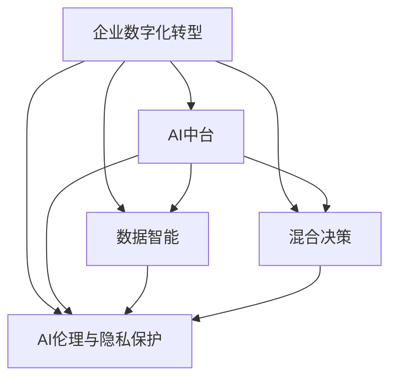

                 

# 从单点突破到全面AI化：Lepton AI的企业转型方案

> 关键词：企业转型, AI化, 全面智能化, 创新驱动, 数据智能, 混合决策, 数字化转型

## 1. 背景介绍

### 1.1 问题由来

随着数字化时代的到来，企业面临前所未有的机遇和挑战。一方面，大数据和互联网技术的迅猛发展为企业带来了巨大的商业价值，帮助企业实现更精准的市场洞察、更高效的运营管理、更优质的客户体验。另一方面，数字化转型过程中涌现的数据安全和隐私保护、网络攻击与防御、数据治理与利用等问题，也成为企业需要重点关注和解决的难题。

在数字化转型的大背景下，Lepton AI作为一家智能科技公司，致力于为企业提供一站式的智能解决方案，帮助企业从单点突破到全面AI化，实现数字化的全面转型。本文将详细介绍Lepton AI的企业转型方案，包括核心概念、关键技术、实施步骤、应用场景以及未来的发展趋势和挑战，希望能够为企业数字化转型的实践提供有价值的参考。

### 1.2 问题核心关键点

Lepton AI的企业转型方案，核心在于通过AI技术实现企业的全面智能化转型，包括但不限于以下几个关键点：

- **单点突破**：通过AI技术优化和改进企业运营中的关键业务节点，如生产调度、库存管理、客户服务、市场营销等，实现业务的数字化升级。
- **多维融合**：将AI技术与其他IT系统（如ERP、CRM、HR系统）融合，实现数据的高效利用和业务流程的协同优化。
- **全面AI化**：构建企业级的AI中台，实现数据智能和决策智能化，驱动企业核心业务的智能化转型。
- **创新驱动**：基于AI技术构建创新业务模式，如个性化推荐、智能客服、智能投顾等，提升企业的核心竞争力。
- **合规安全**：确保AI技术的合规性和安全性，遵守隐私保护法规和数据安全标准，构建健康可持续发展的AI生态。

### 1.3 问题研究意义

Lepton AI的企业转型方案，具有以下重要的研究意义：

- **降低转型风险**：通过AI技术的加持，可以帮助企业更好地应对数字化转型中的挑战，降低转型风险和成本。
- **提升运营效率**：AI技术能够提升企业的运营效率，减少人工干预，提高决策的速度和质量。
- **增强客户体验**：AI技术可以提供更加个性化和智能化的客户服务，提升客户满意度和忠诚度。
- **拓展业务场景**：AI技术能够拓展企业的业务场景，带来新的商业机会和增长点。
- **加速创新迭代**：AI技术驱动的持续创新，可以帮助企业保持市场领先地位，加速业务迭代。
- **促进可持续发展**：AI技术的应用，有助于企业实现绿色环保、节能减排等可持续发展目标。

## 2. 核心概念与联系

### 2.1 核心概念概述

为更好地理解Lepton AI的企业转型方案，本节将介绍几个密切相关的核心概念：

- **企业数字化转型**：企业利用信息技术、数据智能和AI技术，推动业务模式的创新和优化，提升企业核心竞争力，实现业务流程的数字化、智能化和自动化。
- **AI中台**：企业构建的集中式AI能力平台，包括数据存储、模型训练、推理部署等能力，为企业提供全面的AI支撑。
- **数据智能**：利用数据挖掘、机器学习、自然语言处理等AI技术，从海量数据中提炼知识，提供决策支持。
- **混合决策**：结合人工经验和AI算法，构建混合决策系统，优化决策过程和结果。
- **AI伦理与隐私保护**：在AI应用中，确保数据隐私保护、决策透明和公平性，遵守相关法规和伦理规范。

这些核心概念之间的逻辑关系可以通过以下Mermaid流程图来展示：



这个流程图展示了大语言模型的核心概念及其之间的关系：

1. 企业数字化转型通过AI中台、数据智能、混合决策和AI伦理与隐私保护等手段，实现业务的全面智能化转型。
2. AI中台为数据智能和混合决策提供技术支撑，同时也确保了AI应用的伦理和隐私保护。
3. 数据智能和混合决策则是企业数字化转型的核心，通过AI技术从数据中提炼知识和决策支持。
4. AI伦理与隐私保护确保AI应用的安全和合规性，为企业数字化转型提供了健康的发展环境。

## 3. 核心算法原理 & 具体操作步骤

### 3.1 算法原理概述

Lepton AI的企业转型方案，本质上是通过AI技术实现企业的全面智能化，包括但不限于以下几个核心算法：

- **深度学习与神经网络**：构建多层次的神经网络模型，通过大量标注数据进行训练，提升模型的识别和预测能力。
- **自然语言处理(NLP)**：利用语言模型和序列建模技术，处理文本数据，提供情感分析、语义理解、对话系统等应用。
- **图像处理与计算机视觉**：通过卷积神经网络（CNN）和循环神经网络（RNN）等技术，处理图像数据，实现图像识别、视频分析等应用。
- **时间序列分析与预测**：利用时间序列模型，处理时间序列数据，实现趋势预测、异常检测等应用。
- **强化学习与优化算法**：通过强化学习算法，优化业务流程，提升运营效率。

这些算法相互配合，共同构成了Lepton AI企业转型方案的技术框架。

### 3.2 算法步骤详解

Lepton AI的企业转型方案，一般包括以下几个关键步骤：

**Step 1: 评估与规划**
- 对企业的业务流程、数据资源、技术能力进行全面评估，明确数字化转型的目标和方向。
- 制定详细的数字化转型规划，包括AI技术应用的范围、优先级和实施路径。

**Step 2: 数据治理与整合**
- 建立数据治理体系，确保数据的质量、安全和隐私保护。
- 通过数据整合，打通企业内部的数据孤岛，实现数据的统一管理和共享。

**Step 3: AI模型开发与部署**
- 根据业务需求，选择合适的AI算法和模型，利用企业内部的数据进行训练和调优。
- 将训练好的模型部署到AI中台，提供自动化和个性化的服务。

**Step 4: 应用集成与运营**
- 将AI模型集成到企业现有的IT系统中，实现业务流程的自动化和智能化。
- 监控AI模型的运行状态和性能，持续优化模型和业务流程。

**Step 5: 持续创新与改进**
- 结合AI技术和新业务场景，不断创新和改进企业运营模式，提升企业竞争力。
- 关注AI伦理和隐私保护，确保AI应用的安全和合规。

### 3.3 算法优缺点

Lepton AI的企业转型方案，具有以下优点：

- **全面智能化**：通过AI技术实现企业业务的全面智能化转型，提升运营效率和市场竞争力。
- **降低成本**：通过AI自动化和优化，减少人工干预，降低运营成本。
- **提升决策质量**：利用数据智能和混合决策，提高决策的速度和质量，减少人为错误。
- **拓展业务场景**：通过AI技术，拓展企业的业务场景，带来新的商业机会和增长点。
- **加速创新迭代**：基于AI技术，驱动持续创新，加速业务迭代，保持市场领先地位。

同时，该方案也存在一定的局限性：

- **数据质量要求高**：AI模型的效果依赖于数据的质量和数量，企业需要投入大量的精力进行数据治理和整合。
- **技术门槛高**：AI技术的应用需要专业的技术团队，企业需要投入一定的人力资源进行培训和技术支持。
- **安全风险**：AI模型的应用可能带来新的安全风险，企业需要建立完善的安全管理体系。
- **伦理问题**：AI应用可能涉及伦理和隐私问题，企业需要制定相应的伦理规范和隐私保护措施。

### 3.4 算法应用领域

Lepton AI的企业转型方案，已经在多个领域得到了广泛的应用，包括但不限于以下几个方向：

- **制造与物流**：通过AI技术优化生产调度、库存管理、运输计划等业务流程，提升生产效率和供应链管理能力。
- **零售与电商**：利用AI技术实现个性化推荐、智能客服、库存优化等，提升客户体验和销售效率。
- **金融与保险**：通过AI技术进行风险评估、信用评分、智能投顾等，提升金融服务的质量和效率。
- **医疗与健康**：利用AI技术进行疾病预测、健康管理、药物研发等，提升医疗服务的质量和效率。
- **政府与公共服务**：通过AI技术实现智能审批、公共安全监测、环境保护等，提升公共服务的效率和质量。

## 4. 数学模型和公式 & 详细讲解 & 举例说明

### 4.1 数学模型构建

本节将使用数学语言对Lepton AI的企业转型方案进行更加严格的刻画。

记企业数字化转型的目标为 $T=\{t_1, t_2, ..., t_n\}$，其中 $t_i$ 为第 $i$ 个目标，每个目标 $t_i$ 包括业务流程、数据需求和技术能力等关键要素。假设企业内部存在 $D=\{d_1, d_2, ..., d_m\}$ 个数据源，每个数据源 $d_j$ 提供的数据质量为 $q_{d_j}$，数据量 $Q_{d_j}$。

定义企业数字化转型的模型为 $M=\{M_1, M_2, ..., M_k\}$，其中 $M_i$ 为第 $i$ 个目标对应的AI模型，每个模型 $M_i$ 的训练数据量为 $S_i$，模型复杂度为 $C_i$。

企业数字化转型的优化目标是最小化企业运营成本 $C$，即：

$$
C=\min_{T, D, M} C(T, D, M)
$$

其中 $C(T, D, M)$ 表示在目标 $T$、数据源 $D$ 和模型 $M$ 下的企业运营成本。

### 4.2 公式推导过程

以下我们以生产调度优化为例，推导AI模型训练和部署的成本模型。

假设生产调度的目标为最小化生产成本，即：

$$
C_{生产调度}=\min_{S} C_{模型}(S) + C_{数据}(D) + C_{集成}(I)
$$

其中 $S$ 为生产调度模型的训练数据量，$C_{模型}(S)$ 表示模型训练和部署的成本，$C_{数据}(D)$ 表示数据采集和整合的成本，$C_{集成}(I)$ 表示模型与业务系统的集成成本。

模型训练和部署的成本函数 $C_{模型}(S)$ 可以表示为：

$$
C_{模型}(S) = C_{训练} + C_{推理} + C_{优化} + C_{部署}
$$

其中 $C_{训练}$ 表示模型训练的成本，$C_{推理}$ 表示模型推理的成本，$C_{优化}$ 表示模型调优的成本，$C_{部署}$ 表示模型部署的成本。

数据采集和整合的成本函数 $C_{数据}(D)$ 可以表示为：

$$
C_{数据}(D) = C_{采集} + C_{清洗} + C_{存储} + C_{传输}
$$

其中 $C_{采集}$ 表示数据采集的成本，$C_{清洗}$ 表示数据清洗的成本，$C_{存储}$ 表示数据存储的成本，$C_{传输}$ 表示数据传输的成本。

模型与业务系统的集成成本函数 $C_{集成}(I)$ 可以表示为：

$$
C_{集成}(I) = C_{接口开发} + C_{接口测试} + C_{接口维护} + C_{数据同步}
$$

其中 $C_{接口开发}$ 表示接口开发的成本，$C_{接口测试}$ 表示接口测试的成本，$C_{接口维护}$ 表示接口维护的成本，$C_{数据同步}$ 表示数据同步的成本。

### 4.3 案例分析与讲解

**案例一：生产调度的AI优化**

某制造企业通过AI技术优化生产调度，实现生产线的智能化管理。具体而言，利用深度学习模型预测生产线的瓶颈，通过优化生产计划和调度策略，减少生产中的停机时间，提升生产效率。在实际应用中，企业首先对生产线的历史数据进行清洗和整合，然后使用AI模型进行训练和调优，最后将模型部署到生产调度系统中，实时监控生产状态并自动调整生产计划。

**案例二：智能客服的AI应用**

某电商企业通过AI技术实现智能客服，提升客户服务体验。具体而言，利用NLP技术构建情感分析、语义理解等模型，对客户咨询进行自动分类和响应。在实际应用中，企业首先收集和标注大量的客户咨询数据，然后使用AI模型进行训练和调优，最后将模型部署到客服系统中，实现24小时自动响应客户咨询。

## 5. 项目实践：代码实例和详细解释说明

### 5.1 开发环境搭建

在进行AI模型开发前，我们需要准备好开发环境。以下是使用Python进行TensorFlow开发的环境配置流程：

1. 安装Anaconda：从官网下载并安装Anaconda，用于创建独立的Python环境。

2. 创建并激活虚拟环境：
```bash
conda create -n ai-env python=3.8 
conda activate ai-env
```

3. 安装TensorFlow：根据CUDA版本，从官网获取对应的安装命令。例如：
```bash
conda install tensorflow -c conda-forge
```

4. 安装各类工具包：
```bash
pip install numpy pandas scikit-learn matplotlib tqdm jupyter notebook ipython
```

完成上述步骤后，即可在`ai-env`环境中开始AI模型开发。

### 5.2 源代码详细实现

下面我们以智能客服的情感分析模型为例，给出使用TensorFlow进行模型开发的PyTorch代码实现。

首先，定义情感分析模型的输入和输出：

```python
from tensorflow.keras.preprocessing.text import Tokenizer
from tensorflow.keras.preprocessing.sequence import pad_sequences
from tensorflow.keras.layers import Embedding, LSTM, Dense
from tensorflow.keras.models import Sequential

# 定义模型
model = Sequential()
model.add(Embedding(input_dim=vocab_size, output_dim=embedding_dim, input_length=max_len))
model.add(LSTM(units=128, dropout=0.2, recurrent_dropout=0.2))
model.add(Dense(units=num_classes, activation='softmax'))

# 编译模型
model.compile(loss='categorical_crossentropy', optimizer='adam', metrics=['accuracy'])

# 训练模型
model.fit(X_train, y_train, epochs=num_epochs, batch_size=batch_size, validation_data=(X_val, y_val))
```

然后，定义模型评估和预测函数：

```python
# 定义模型评估函数
def evaluate(model, X_test, y_test):
    loss, accuracy = model.evaluate(X_test, y_test)
    print(f"Test loss: {loss:.4f}")
    print(f"Test accuracy: {accuracy:.4f}")

# 定义模型预测函数
def predict(model, X_new):
    y_pred = model.predict(X_new)
    return np.argmax(y_pred, axis=1)
```

最后，启动模型训练并在测试集上评估：

```python
# 加载数据
X_train, y_train, X_val, y_val, X_test, y_test = load_data()

# 训练模型
model.fit(X_train, y_train, epochs=num_epochs, batch_size=batch_size, validation_data=(X_val, y_val))

# 评估模型
evaluate(model, X_test, y_test)
```

以上就是使用TensorFlow进行智能客服情感分析模型开发的完整代码实现。可以看到，得益于TensorFlow的强大封装，我们可以用相对简洁的代码完成模型的训练和评估。

### 5.3 代码解读与分析

让我们再详细解读一下关键代码的实现细节：

**Tokenizer和pad_sequences函数**：
- `Tokenizer`函数用于将文本数据转换为token序列。
- `pad_sequences`函数用于对token序列进行填充，保证所有序列的长度一致。

**LSTM层**：
- `LSTM`层用于处理序列数据，具有记忆功能，可以捕捉序列中的上下文信息。

**Dense层**：
- `Dense`层用于输出分类结果，输出维度为情感类别数。

**模型编译和训练**：
- `compile`函数用于设置模型的损失函数、优化器和评价指标。
- `fit`函数用于训练模型，设置训练轮数和批次大小。

**模型评估和预测**：
- `evaluate`函数用于评估模型在测试集上的性能。
- `predict`函数用于对新文本数据进行情感分类预测。

## 6. 实际应用场景

### 6.1 智能客服系统

Lepton AI的智能客服系统，通过AI技术实现自动响应和处理客户咨询，提升客户满意度和服务效率。具体而言，系统通过自然语言处理技术进行情感分析、意图识别和对话生成，能够自动理解客户咨询的意图，提供精准的回复。此外，系统还具备知识图谱和规则库的整合能力，能够根据客户咨询自动匹配最佳解决方案，进一步提升服务质量。

### 6.2 制造与物流

Lepton AI的制造与物流系统，通过AI技术实现生产调度的优化，提升生产效率和供应链管理能力。具体而言，系统通过深度学习模型预测生产线的瓶颈，优化生产计划和调度策略，减少停机时间，提升生产效率。此外，系统还具备物料库存管理的能力，能够根据生产需求自动调整物料库存，减少浪费和成本。

### 6.3 零售与电商

Lepton AI的零售与电商系统，通过AI技术实现个性化推荐和智能客服，提升客户体验和销售效率。具体而言，系统通过推荐算法对用户行为进行分析，提供个性化的商品推荐。此外，系统还具备智能客服的能力，能够自动处理客户咨询，提升客户满意度。

### 6.4 金融与保险

Lepton AI的金融与保险系统，通过AI技术进行风险评估和智能投顾，提升金融服务的质量和效率。具体而言，系统通过风险评估模型对用户信用进行评分，提供个性化的金融服务。此外，系统还具备智能投顾的能力，能够根据用户需求提供智能投资建议，提升投资回报率。

### 6.5 医疗与健康

Lepton AI的医疗与健康系统，通过AI技术进行疾病预测和健康管理，提升医疗服务的质量和效率。具体而言，系统通过深度学习模型对患者的病历数据进行分析，预测患者的疾病风险，提供个性化的健康管理方案。此外，系统还具备药物研发的能力，能够根据患者的基因数据和病历数据，推荐适合的药物方案，提升治疗效果。

## 7. 工具和资源推荐

### 7.1 学习资源推荐

为了帮助开发者系统掌握Lepton AI的企业转型方案的理论基础和实践技巧，这里推荐一些优质的学习资源：

1. **《深度学习》**：由李航老师编写的经典深度学习教材，全面介绍了深度学习的基本原理和应用。
2. **《TensorFlow实战》**：由彭杉等老师编写的TensorFlow实战书籍，介绍了TensorFlow的基础和高级应用。
3. **《Python深度学习》**：由Francois Chollet撰写的深度学习书籍，介绍了TensorFlow和Keras的应用。
4. **Coursera和edX**：Coursera和edX等在线教育平台，提供大量深度学习和AI课程，适合初学者和进阶者。
5. **Kaggle竞赛**：Kaggle平台上的各类深度学习竞赛，提供丰富的实战机会，提升实践能力。

通过对这些资源的学习实践，相信你一定能够快速掌握Lepton AI的企业转型方案的精髓，并用于解决实际的AI问题。

### 7.2 开发工具推荐

高效的开发离不开优秀的工具支持。以下是几款用于Lepton AI开发常用的工具：

1. **TensorFlow和Keras**：由Google主导开发的深度学习框架，生产部署方便，适合大规模工程应用。
2. **PyTorch和TensorBoard**：由Facebook和Google主导开发的深度学习框架，灵活度高，适合研究和实验。
3. **Jupyter Notebook和JupyterLab**：免费的交互式编程环境，适合代码调试和协作开发。
4. **Git和GitHub**：版本控制和代码托管平台，适合团队协作和项目管理。
5. **Anaconda和conda**：Python环境管理工具，支持虚拟环境和包管理。

合理利用这些工具，可以显著提升Lepton AI的开发效率，加快创新迭代的步伐。

### 7.3 相关论文推荐

Lepton AI的企业转型方案，已经在许多前沿领域得到了广泛的应用。以下是几篇奠基性的相关论文，推荐阅读：

1. **《深度学习与神经网络》**：Goodfellow等人的经典深度学习教材，全面介绍了深度学习的基本原理和应用。
2. **《自然语言处理》**：Ellis和Blackwell编写的自然语言处理教材，介绍了自然语言处理的基本原理和应用。
3. **《强化学习》**：Sutton和Barto撰写的强化学习教材，介绍了强化学习的基本原理和应用。
4. **《大数据分析》**：Jordan和Golub编写的数据分析教材，介绍了大数据分析的基本原理和应用。
5. **《机器学习》**：Hastie等人的经典机器学习教材，介绍了机器学习的基本原理和应用。

这些论文代表了大语言模型微调技术的发展脉络。通过学习这些前沿成果，可以帮助研究者把握学科前进方向，激发更多的创新灵感。

## 8. 总结：未来发展趋势与挑战

### 8.1 总结

本文对Lepton AI的企业转型方案进行了全面系统的介绍。首先阐述了企业数字化转型的背景和意义，明确了AI技术在企业全面智能化转型中的重要性。其次，从原理到实践，详细讲解了企业转型中的关键算法和技术，给出了AI模型开发的完整代码实例。同时，本文还广泛探讨了AI技术在智能客服、制造与物流、零售与电商、金融与保险、医疗与健康等多个领域的应用前景，展示了AI技术在企业数字化转型中的巨大潜力。

通过本文的系统梳理，可以看到，Lepton AI的企业转型方案通过AI技术实现企业业务的全面智能化转型，提升运营效率和市场竞争力。未来，伴随AI技术的不断演进，企业数字化转型必将迎来新的发展机遇。

### 8.2 未来发展趋势

展望未来，Lepton AI的企业转型方案将呈现以下几个发展趋势：

1. **技术融合**：AI技术将与其他技术（如物联网、区块链等）进行深度融合，推动企业数字化转型的全面升级。
2. **数据驱动**：企业将更加重视数据资源的整合和利用，利用大数据和人工智能技术驱动企业运营决策。
3. **AI伦理与合规**：AI技术的伦理和合规问题将得到更多重视，企业在AI应用中需要遵守相关法规和伦理规范。
4. **跨界应用**：AI技术将拓展到更多的行业和应用场景，带来新的商业机会和增长点。
5. **持续创新**：基于AI技术，企业将不断推出创新业务模式，提升核心竞争力。

### 8.3 面临的挑战

尽管Lepton AI的企业转型方案已经取得了一定的成功，但在迈向更加智能化、普适化应用的过程中，仍面临诸多挑战：

1. **技术复杂度**：AI技术的应用需要较高的技术门槛，企业需要投入大量资源进行技术培训和开发。
2. **数据质量**：AI模型的效果依赖于数据的质量和数量，企业需要投入大量精力进行数据治理和整合。
3. **安全和隐私**：AI模型可能带来新的安全风险，企业需要建立完善的安全管理体系。
4. **伦理和合规**：AI应用可能涉及伦理和隐私问题，企业需要制定相应的伦理规范和隐私保护措施。

### 8.4 研究展望

面对Lepton AI企业转型方案所面临的挑战，未来的研究需要在以下几个方面寻求新的突破：

1. **技术简化**：开发更加易于使用的AI开发工具和平台，降低技术门槛，提升开发效率。
2. **数据治理**：建立完善的数据治理体系，确保数据的质量和隐私保护。
3. **安全防护**：构建安全防护机制，防止数据泄露和恶意攻击。
4. **伦理规范**：制定AI伦理规范，确保AI应用的公平性和透明性。
5. **混合决策**：构建混合决策系统，结合人工经验和AI算法，优化决策过程和结果。

这些研究方向的探索，必将引领Lepton AI的企业转型方案迈向更高的台阶，为构建安全、可靠、可解释、可控的智能系统铺平道路。面向未来，Lepton AI的企业转型方案还需要与其他AI技术进行更深入的融合，如知识表示、因果推理、强化学习等，多路径协同发力，共同推动企业数字化转型的进步。只有勇于创新、敢于突破，才能不断拓展AI技术的边界，让智能技术更好地造福人类社会。

## 9. 附录：常见问题与解答

**Q1：企业如何评估数字化转型的效果？**

A: 企业可以通过以下几个指标评估数字化转型的效果：

- **运营效率**：评估生产调度、库存管理、客户服务等方面的效率提升情况。
- **客户满意度**：评估智能客服、个性化推荐等方面的客户满意度提升情况。
- **成本节约**：评估AI技术应用带来的成本节约情况。
- **市场竞争力**：评估AI技术应用对市场竞争力的提升情况。
- **创新能力**：评估AI技术应用带来的创新业务模式和产品服务。

**Q2：企业在实施数字化转型的过程中，需要注意哪些问题？**

A: 企业在实施数字化转型的过程中，需要注意以下问题：

- **数据治理**：确保数据的质量和隐私保护，建立完善的数据治理体系。
- **技术选型**：选择合适的AI技术和工具，确保技术的可行性和可靠性。
- **项目管理**：建立完善的项目管理机制，确保项目按时交付。
- **人才培训**：投入资源进行AI技术培训，提升团队的技术能力。
- **风险控制**：评估和控制数字化转型的风险，确保项目的顺利进行。

**Q3：企业如何构建AI伦理与合规体系？**

A: 企业可以采取以下几个步骤构建AI伦理与合规体系：

- **制定伦理规范**：制定AI伦理规范，确保AI应用的公平性和透明性。
- **建立监管机制**：建立AI应用的监管机制，确保AI应用的合规性。
- **进行伦理培训**：对员工进行AI伦理培训，提升伦理意识。
- **设立伦理委员会**：设立AI伦理委员会，负责AI应用的伦理审查。
- **进行隐私保护**：采取隐私保护措施，确保数据的隐私和安全。

通过这些措施，企业可以构建健康可持续发展的AI生态，确保AI应用的合规性和安全性。

**Q4：企业如何确保AI模型的效果？**

A: 企业可以采取以下几个措施确保AI模型的效果：

- **数据治理**：确保数据的质量和多样性，提升模型的泛化能力。
- **模型评估**：进行模型的评估和调优，提升模型的性能。
- **持续优化**：根据实际情况不断优化模型，提升模型的效果。
- **技术选型**：选择合适的AI技术和工具，确保模型的可行性和可靠性。
- **多模型集成**：采用多模型集成的方法，提升模型的鲁棒性和效果。

通过这些措施，企业可以确保AI模型的效果，提升AI应用的实际价值。

**Q5：企业如何应对AI模型带来的风险？**

A: 企业可以采取以下几个措施应对AI模型带来的风险：

- **数据治理**：确保数据的质量和隐私保护，避免模型产生偏见和有害信息。
- **模型评估**：进行模型的评估和调优，避免模型在特定数据上的过拟合。
- **技术选型**：选择合适的AI技术和工具，避免模型带来的安全风险。
- **持续监控**：持续监控AI模型的运行状态和性能，及时发现和处理问题。
- **多模型集成**：采用多模型集成的方法，避免单一模型带来的风险。

通过这些措施，企业可以应对AI模型带来的风险，确保AI应用的稳定性和安全性。

---

作者：禅与计算机程序设计艺术 / Zen and the Art of Computer Programming

