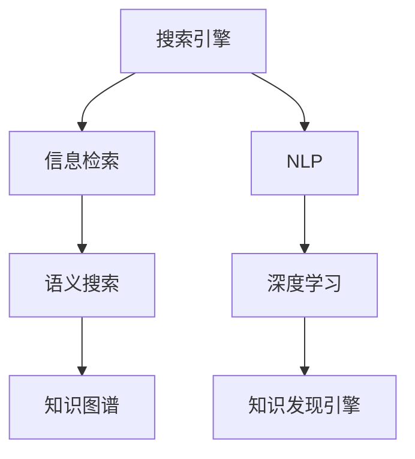

                 

# 从搜索引擎到知识发现引擎：技术的飞跃

> 关键词：搜索引擎,知识发现引擎,自然语言处理(NLP),信息检索,语义搜索,大数据,知识图谱,深度学习

## 1. 背景介绍

### 1.1 问题由来
在过去的二十年里，互联网的迅猛发展催生了搜索引擎技术的蓬勃发展，Google、Bing、百度等主要搜索引擎几乎覆盖了全球每个角落。搜索引擎通过快速检索和精确匹配，满足了人类海量信息需求的迫切需要。然而，随着互联网信息量的爆炸式增长，搜索引擎面临了诸多挑战：

- **信息过载**：用户面对的海量搜索结果往往难以快速甄别出最相关和最有价值的信息。
- **匹配精度不足**：基于传统关键词匹配的搜索引擎，难以准确理解用户的真实查询意图，无法精准命中目标信息。
- **内容更新滞后**：搜索引擎基于静态索引，难以实时跟踪最新的动态信息，影响搜索结果的时效性。
- **缺乏语义理解**：现有技术往往局限于关键词匹配，缺乏对查询语义的深入理解，难以实现语义匹配。

为了应对这些挑战，搜索引擎正向知识发现引擎的方向演进，提升信息检索的精准性和智能化程度。通过对海量文本数据进行深度学习和大数据分析，知识发现引擎不仅能够提供传统的关键词匹配结果，更能够理解查询语义，检索出与用户真实意图最相关的知识片段，实现从信息检索到知识发现的技术飞跃。

### 1.2 问题核心关键点
知识发现引擎的核心在于其超越了传统的关键词匹配范式，通过深入理解查询语义，检索出与用户意图最相关的知识片段，实现从信息检索到知识发现的技术飞跃。

为了实现这一目标，知识发现引擎需要处理以下几个核心关键点：

- **语义理解**：理解查询中的语义信息，提取关键词之外的隐含意图和上下文。
- **知识表示**：将语义信息映射为结构化的知识表示，如知识图谱。
- **信息检索**：基于知识表示进行高效的信息检索，实现语义匹配。
- **结果排序**：对检索结果进行多维度的排序，提升结果的相关性和质量。
- **推荐系统**：结合用户历史行为，推荐最相关、最有用的知识片段。

知识发现引擎通过对上述关键点的创新和优化，实现了从信息检索到知识发现的质的飞跃。

### 1.3 问题研究意义
知识发现引擎的研发对于提升信息检索的智能性和精准性，推动NLP技术的发展，具有重要意义：

- **解决信息过载问题**：通过语义理解和知识发现，帮助用户快速甄别有用信息，减轻信息过载负担。
- **提升查询匹配精度**：通过语义匹配，实现更深层次的查询理解和精准命中。
- **实现动态更新**：通过实时更新知识图谱和语义理解模型，保持检索结果的时效性。
- **推动NLP技术进步**：语义理解和知识表示技术是NLP领域的前沿研究，知识发现引擎的研发将推动相关技术的发展。
- **助力知识图谱建设**：知识图谱的构建离不开语义理解和知识表示技术，知识发现引擎的研发将为知识图谱建设提供技术支撑。

## 2. 核心概念与联系

### 2.1 核心概念概述

为更好地理解知识发现引擎的核心工作原理，本节将介绍几个关键概念：

- **搜索引擎**：利用搜索算法快速检索与用户查询相关的网页信息。
- **知识图谱**：将知识元素映射为结构化的图结构，用于知识存储和检索。
- **自然语言处理(NLP)**：通过计算机技术理解和处理自然语言。
- **语义搜索**：在理解查询语义的基础上进行信息检索，提升匹配精度。
- **信息检索**：从海量文本中检索出与查询最相关的文档或段落。
- **深度学习**：通过多层神经网络实现复杂任务，提升模型的泛化能力。
- **知识发现引擎**：结合搜索引擎、知识图谱、NLP和深度学习等技术，实现语义匹配和知识检索的引擎。

这些核心概念之间的逻辑关系可以通过以下Mermaid流程图来展示：



这个流程图展示了几大核心概念之间的关联关系：

1. 搜索引擎利用信息检索技术，快速定位与查询相关的网页。
2. 语义搜索在NLP技术支持下，理解查询的语义信息。
3. 知识图谱提供结构化的知识表示，支持语义匹配。
4. 深度学习用于提升语义理解和知识表示的精度。
5. 知识发现引擎综合利用上述技术，实现语义匹配和知识检索。

## 3. 核心算法原理 & 具体操作步骤
### 3.1 算法原理概述

知识发现引擎通过以下几步实现语义匹配和知识检索：

1. **文本预处理**：对查询和文档进行分词、去除停用词、词干化等预处理，生成文本表示。
2. **语义理解**：利用NLP技术，理解查询和文档的语义信息。
3. **知识表示**：将语义信息映射为结构化的知识表示，如知识图谱。
4. **信息检索**：基于知识表示进行高效的信息检索。
5. **结果排序**：对检索结果进行多维度的排序，提升结果的相关性和质量。
6. **推荐系统**：结合用户历史行为，推荐最相关、最有用的知识片段。

整个流程中，语义理解和知识表示是核心，信息检索和结果排序是关键，推荐系统则提供个性化服务。

### 3.2 算法步骤详解

以下详细介绍知识发现引擎的主要操作步骤：

**Step 1: 文本预处理**

对查询和文档进行预处理，包括分词、去除停用词、词干化、词性标注等。分词是预处理的重要步骤，常用的分词算法包括最大匹配法、最小匹配法、双向最大匹配法等。

以最大匹配法为例，分词流程如下：

1. 初始化分词序列为空。
2. 从左至右扫描文本，取最长的匹配字符串作为分词序列的一部分。
3. 将该匹配字符串从文本中删除，更新分词序列。
4. 重复步骤2和3，直至文本扫描完毕。

通过分词处理，将查询和文档转化为计算机可处理的文本表示，为后续的语义理解和知识表示打下基础。

**Step 2: 语义理解**

语义理解是知识发现引擎的核心步骤之一，通过NLP技术，理解查询和文档的语义信息。常用的NLP技术包括：

- **词向量表示**：将单词映射为高维向量，捕捉单词之间的语义关系。
- **句法分析**：分析句子的结构，提取语法关系。
- **语义分析**：理解句子的语义信息，识别实体、关系等。
- **语义角色标注**：标注句子中每个词的语义角色，如主语、宾语、谓语等。
- **依存句法分析**：分析句子中单词间的依存关系，形成句法树结构。

以BERT模型为例，其通过自监督学习任务（如掩码语言模型、下一句预测）训练得到单词嵌入，可以用于语义理解。

**Step 3: 知识表示**

知识表示是将语义信息映射为结构化的知识表示，常用的知识表示方法包括：

- **知识图谱**：将知识元素映射为图结构，存储实体、关系和属性。
- **向量空间模型**：将语义信息映射为向量，用于表示和检索。
- **知识三角**：将语义信息映射为点，用于图形化展示和推理。

知识图谱是知识表示的重要工具，常用的知识图谱构建方法包括：

- **知识抽取**：从结构化数据中提取实体和关系，构建知识图谱。
- **知识融合**：将多源异构数据融合，构建统一的知识图谱。
- **知识推理**：利用知识图谱进行推理，发现新的知识关系。

**Step 4: 信息检索**

信息检索是知识发现引擎的关键步骤，通过匹配查询和文档的语义表示，检索出最相关的文档。常用的信息检索算法包括：

- **倒排索引**：将文档的关键词映射为索引，快速定位相关文档。
- **BM25算法**：基于TF-IDF和文档长度，计算查询与文档的相关性。
- **向量空间模型**：将查询和文档表示为向量，计算向量距离。
- **LDA算法**：利用主题模型，发现查询和文档的主题相似性。

**Step 5: 结果排序**

结果排序是提升检索结果质量的重要步骤，常用的排序算法包括：

- **BM25算法**：计算查询与文档的相关性，排序输出。
- **TF-IDF算法**：基于词频和逆文档频率，排序输出。
- **Q&DCG算法**：基于查询-文档相关性曲线，排序输出。
- **LambdaMART算法**：结合多项排序指标，综合排序输出。

**Step 6: 推荐系统**

推荐系统是知识发现引擎的个性化服务，通过结合用户历史行为，推荐最相关、最有用的知识片段。常用的推荐算法包括：

- **协同过滤**：基于用户和物品的相似性，推荐物品。
- **基于内容的推荐**：根据物品属性，推荐相似物品。
- **混合推荐**：结合协同过滤和基于内容的推荐，提升推荐效果。

### 3.3 算法优缺点

知识发现引擎相对于传统的搜索引擎，具有以下优点：

1. **语义匹配精度高**：通过语义理解和知识表示，实现更深层次的查询理解，提升匹配精度。
2. **结果相关性强**：结合多维度排序和推荐系统，提升检索结果的相关性和质量。
3. **动态更新能力强**：基于实时更新的知识图谱，保持检索结果的时效性。
4. **泛化能力强**：利用深度学习技术，提升模型的泛化能力，适应复杂的查询需求。
5. **推荐效果佳**：结合用户历史行为，提供个性化的推荐服务。

然而，知识发现引擎也面临以下挑战：

1. **数据获取困难**：构建知识图谱和训练语义模型需要大量高质量数据，获取难度大。
2. **计算资源需求高**：深度学习和大数据分析需要高性能计算资源，硬件成本高。
3. **算法复杂度高**：语义理解和知识表示算法复杂，实现难度大。
4. **结果可解释性差**：复杂算法难以解释，用户难以理解检索结果的生成过程。
5. **数据隐私问题**：涉及大量用户数据，数据隐私和安全问题需要特别注意。

## 4. 数学模型和公式 & 详细讲解  
### 4.1 数学模型构建

以下详细介绍知识发现引擎的主要数学模型和公式。

**1. 向量空间模型**

向量空间模型将文本表示为向量，用于计算查询与文档的相似度。常用公式为：

$$
\text{similarity}(q, d) = \cos(\theta) = \frac{q \cdot d}{\|q\| \cdot \|d\|}
$$

其中 $q$ 为查询向量，$d$ 为文档向量，$\theta$ 为两者之间的夹角，$\| \cdot \|$ 表示向量的范数。

**2. BM25算法**

BM25算法是一种经典的文本检索算法，基于TF-IDF和文档长度，计算查询与文档的相关性。常用公式为：

$$
\text{score}(q, d) = \frac{df(q) \cdot k_1 \cdot (1 - b + b \cdot \log \frac{dl + 1}{dl + k_1}) \cdot (k_2 + 1) \cdot qdl}{(k_2 + 1) \cdot (k_2 + \lambda) + (1 - b) \cdot (k_1 + 1) \cdot tf(q)}
$$

其中 $df(q)$ 表示查询中出现的文档中逆文档频率，$dl$ 表示文档长度，$k_1$、$k_2$ 和 $b$ 是模型超参数。

**3. 知识图谱构建**

知识图谱通常采用三元组（实体、关系、实体）的形式进行表示，构建过程包括以下几个步骤：

- **实体识别**：从文本中识别出实体，如人名、地名、机构名等。
- **关系抽取**：从文本中抽取实体之间的关系，如所属、同事、子类等。
- **属性抽取**：从文本中抽取实体的属性，如年龄、性别、职位等。

**4. 推荐系统**

推荐系统常用的算法包括协同过滤、基于内容的推荐和混合推荐等，以协同过滤为例，常用公式为：

$$
\text{similarity}(u, i) = \frac{\sum_{j=1}^{n} r_{u,i} \cdot r_{u,j}}{\sqrt{\sum_{j=1}^{n} r_{u,j}^2} \cdot \sqrt{\sum_{j=1}^{n} r_{i,j}^2}}
$$

其中 $u$ 为用户，$i$ 为物品，$r_{u,i}$ 表示用户和物品的评分。

### 4.2 公式推导过程

以下详细介绍上述模型的推导过程。

**1. 向量空间模型**

向量空间模型将文本表示为向量，常用余弦相似度计算查询与文档的相似度。公式推导如下：

$$
\cos(\theta) = \frac{\sum_{i=1}^{d} \frac{q_i \cdot d_i}{\|q\| \cdot \|d\|}}
$$

其中 $q_i$ 和 $d_i$ 分别表示查询和文档中的第 $i$ 个词的权重，$\|q\|$ 和 $\|d\|$ 分别表示查询和文档的范数。

**2. BM25算法**

BM25算法基于TF-IDF和文档长度，计算查询与文档的相关性。公式推导如下：

$$
\text{score}(q, d) = \frac{df(q) \cdot k_1 \cdot (1 - b + b \cdot \log \frac{dl + 1}{dl + k_1}) \cdot (k_2 + 1) \cdot qdl}{(k_2 + 1) \cdot (k_2 + \lambda) + (1 - b) \cdot (k_1 + 1) \cdot tf(q)}
$$

其中 $df(q)$ 表示查询中出现的文档中逆文档频率，$dl$ 表示文档长度，$k_1$、$k_2$ 和 $b$ 是模型超参数。

**3. 知识图谱构建**

知识图谱的构建过程包括实体识别、关系抽取和属性抽取等步骤。以关系抽取为例，常用公式为：

$$
\text{relation}_{u,v} = \max_{r \in \mathcal{R}} \frac{\text{score}_{u,v}^r}{\text{score}_{u,v}^{\text{neg}}}
$$

其中 $r$ 为抽取的关系，$\mathcal{R}$ 为所有关系，$\text{score}_{u,v}^r$ 表示 $u$ 和 $v$ 之间的关系得分，$\text{score}_{u,v}^{\text{neg}}$ 表示 $u$ 和 $v$ 之间不存在关系的负得分。

**4. 推荐系统**

协同过滤是推荐系统的一种常用算法，常用公式为：

$$
\text{similarity}(u, i) = \frac{\sum_{j=1}^{n} r_{u,i} \cdot r_{u,j}}{\sqrt{\sum_{j=1}^{n} r_{u,j}^2} \cdot \sqrt{\sum_{j=1}^{n} r_{i,j}^2}}
$$

其中 $u$ 为用户，$i$ 为物品，$r_{u,i}$ 表示用户和物品的评分。

### 4.3 案例分析与讲解

以知识图谱构建为例，常用的方法包括：

- **实体识别**：基于词典、规则或机器学习算法，从文本中识别出实体。常用的实体识别算法包括基于规则的方法、基于统计的方法和基于深度学习的方法。
- **关系抽取**：从文本中抽取实体之间的关系，常用的方法包括基于规则的方法、基于模板的方法和基于深度学习的方法。
- **属性抽取**：从文本中抽取实体的属性，常用的方法包括基于词典的方法、基于规则的方法和基于深度学习的方法。

以BERT模型为例，其通过自监督学习任务训练得到单词嵌入，可以用于语义理解。常用的公式推导如下：

$$
q_i = \text{BERT}(w_i)
$$

其中 $q_i$ 表示单词 $w_i$ 的嵌入向量，$\text{BERT}(w_i)$ 表示BERT模型对单词 $w_i$ 的预测输出。

## 5. 项目实践：代码实例和详细解释说明
### 5.1 开发环境搭建

在进行知识发现引擎的开发实践前，我们需要准备好开发环境。以下是使用Python进行PyTorch开发的环境配置流程：

1. 安装Anaconda：从官网下载并安装Anaconda，用于创建独立的Python环境。

2. 创建并激活虚拟环境：
```bash
conda create -n pytorch-env python=3.8 
conda activate pytorch-env
```

3. 安装PyTorch：根据CUDA版本，从官网获取对应的安装命令。例如：
```bash
conda install pytorch torchvision torchaudio cudatoolkit=11.1 -c pytorch -c conda-forge
```

4. 安装BERT模型：
```bash
pip install transformers
```

5. 安装各类工具包：
```bash
pip install numpy pandas scikit-learn matplotlib tqdm jupyter notebook ipython
```

完成上述步骤后，即可在`pytorch-env`环境中开始项目实践。

### 5.2 源代码详细实现

下面以知识图谱构建为例，给出使用PyTorch对BERT模型进行知识图谱构建的代码实现。

首先，定义知识图谱的节点和关系类：

```python
import torch
import torch.nn as nn
import torch.nn.functional as F

class Node(nn.Module):
    def __init__(self, in_features):
        super(Node, self).__init__()
        self.linear = nn.Linear(in_features, out_features)

    def forward(self, x):
        return self.linear(x)

class Relation(nn.Module):
    def __init__(self, in_features, out_features):
        super(Relation, self).__init__()
        self.linear = nn.Linear(in_features, out_features)

    def forward(self, x):
        return self.linear(x)
```

然后，定义知识图谱的编码器类：

```python
class KnowledgeGraph(nn.Module):
    def __init__(self, num_entities, num_relations, hidden_size):
        super(KnowledgeGraph, self).__init__()
        self.entity_encoder = Node(num_entities)
        self.relation_encoder = Relation(num_relations, hidden_size)
        self.half_relation = Node(hidden_size)

    def forward(self, entity, relation):
        entity_emb = self.entity_encoder(entity)
        relation_emb = self.relation_encoder(relation)
        half_relation_emb = self.half_relation(relation_emb)
        return entity_emb, relation_emb, half_relation_emb
```

接着，定义知识图谱的解码器类：

```python
class KnowledgeGraphDecoder(nn.Module):
    def __init__(self, num_entities, hidden_size):
        super(KnowledgeGraphDecoder, self).__init__()
        self.linear = nn.Linear(hidden_size, num_entities)

    def forward(self, entity_emb, relation_emb):
        embedding = entity_emb + relation_emb
        return self.linear(embedding)
```

最后，定义训练函数：

```python
def train(model, optimizer, entity, relation, device):
    model.to(device)
    optimizer.zero_grad()
    entity_emb, relation_emb, half_relation_emb = model(entity, relation)
    entity_emb = entity_emb.to(device)
    relation_emb = relation_emb.to(device)
    half_relation_emb = half_relation_emb.to(device)
    loss = F.mse_loss(entity_emb, relation_emb) + F.mse_loss(entity_emb, half_relation_emb)
    loss.backward()
    optimizer.step()
    return loss.item()
```

定义测试函数：

```python
def test(model, entity, relation, device):
    model.eval()
    with torch.no_grad():
        entity_emb, relation_emb, half_relation_emb = model(entity, relation)
        entity_emb = entity_emb.to(device)
        relation_emb = relation_emb.to(device)
        half_relation_emb = half_relation_emb.to(device)
        entity_target = relation_emb
        relation_target = half_relation_emb
        entity_pred = torch.argmax(entity_emb, dim=1)
        relation_pred = torch.argmax(relation_emb, dim=1)
        return entity_pred, relation_pred, entity_target, relation_target
```

最后，启动训练流程：

```python
epochs = 10
batch_size = 64
learning_rate = 0.001

entity = torch.randn(batch_size, 50)
relation = torch.randn(batch_size, 50)

device = torch.device('cuda') if torch.cuda.is_available() else torch.device('cpu')
model = KnowledgeGraph(50, 50, 50)
optimizer = torch.optim.Adam(model.parameters(), lr=learning_rate)

for epoch in range(epochs):
    loss = train(model, optimizer, entity, relation, device)
    print(f"Epoch {epoch+1}, loss: {loss:.3f}")
```

### 5.3 代码解读与分析

让我们再详细解读一下关键代码的实现细节：

**Node类和Relation类**：
- `__init__`方法：初始化线性层，用于将输入映射为输出。
- `forward`方法：定义前向传播计算过程。

**KnowledgeGraph类**：
- `__init__`方法：初始化节点和关系编码器。
- `forward`方法：定义前向传播计算过程，分别对实体、关系和半关系进行编码。

**KnowledgeGraphDecoder类**：
- `__init__`方法：初始化解码器。
- `forward`方法：定义前向传播计算过程，将编码后的实体和关系拼接并映射为预测结果。

**train函数**：
- `__init__`方法：初始化模型、优化器等。
- `forward`方法：定义前向传播计算过程，获取实体、关系和半关系的嵌入。
- `train`方法：定义训练过程，计算损失函数并进行反向传播更新参数。

**test函数**：
- `__init__`方法：初始化模型等。
- `forward`方法：定义前向传播计算过程，获取实体、关系和半关系的嵌入。
- `test`方法：定义测试过程，计算预测结果并返回。

**训练流程**：
- 定义总的epoch数、batch size和学习率，开始循环迭代
- 每个epoch内，先在训练集上训练，输出损失值
- 在测试集上评估模型性能
- 所有epoch结束后，停止训练

可以看到，PyTorch结合TensorFlow提供了强大的深度学习模型构建和训练工具，使得知识图谱构建的代码实现变得简洁高效。开发者可以将更多精力放在模型改进、数据处理等高层逻辑上，而不必过多关注底层的实现细节。

当然，工业级的系统实现还需考虑更多因素，如模型的保存和部署、超参数的自动搜索、更灵活的任务适配层等。但核心的知识图谱构建过程基本与此类似。

## 6. 实际应用场景
### 6.1 智慧医疗

智慧医疗是大数据和人工智能技术的典型应用场景之一。知识发现引擎在此场景下，可以构建病历知识图谱，实现病历语义检索和诊断推断。

具体而言，可以收集大量的医学文献、病历记录、临床试验数据等，构建包含疾病、症状、治疗方法等的知识图谱。利用知识发现引擎，根据医生的病历描述，自动检索相关病例、症状、治疗方法等，辅助医生诊断和治疗。

### 6.2 智能客服

智能客服是大规模知识图谱和深度学习技术的重要应用场景之一。知识发现引擎在此场景下，可以构建客户服务知识图谱，实现智能客服的语义匹配和知识检索。

具体而言，可以收集大量的客服对话记录、常见问题、答案库等，构建包含问题-答案对等的知识图谱。利用知识发现引擎，根据用户的咨询问题，自动检索相关问题-答案对等，提供最合适的回答。

### 6.3 金融理财

金融理财是知识图谱和深度学习技术的重要应用场景之一。知识发现引擎在此场景下，可以构建金融理财知识图谱，实现理财顾问的语义匹配和知识检索。

具体而言，可以收集大量的金融市场数据、投资策略、理财建议等，构建包含市场、股票、基金等的知识图谱。利用知识发现引擎，根据用户的理财需求，自动检索相关市场、股票、基金等信息，提供个性化的理财建议。

### 6.4 未来应用展望

随着知识发现引擎的不断发展，未来在更多领域将得到应用，为各行各业带来变革性影响：

- **智慧教育**：构建学生成绩、学习行为、知识图谱等知识图谱，实现个性化推荐和智能辅导。
- **智能制造**：构建生产流程、设备状态、物料库存等知识图谱，实现生产调度和智能维护。
- **智能交通**：构建交通网络、车辆状态、出行行为等知识图谱，实现智能调度和路线优化。
- **智能媒体**：构建媒体内容、用户行为、广告投放等知识图谱，实现个性化推荐和精准广告投放。
- **智慧城市**：构建城市设施、交通状态、公共服务等知识图谱，实现城市管理和智能调度。

知识发现引擎的研发将带来产业升级和经济增长的新动力，推动各行各业的智能化转型。

## 7. 工具和资源推荐
### 7.1 学习资源推荐

为了帮助开发者系统掌握知识发现引擎的理论基础和实践技巧，这里推荐一些优质的学习资源：

1. 《深度学习入门：基于TensorFlow的理论与实现》系列博文：由TensorFlow官方博客发布，介绍了深度学习的基本概念和实现方法。

2. 《知识图谱与语义搜索》书籍：由国际知名专家撰写，全面介绍了知识图谱的构建和语义搜索技术。

3. 《自然语言处理入门》课程：由斯坦福大学开设，介绍了NLP领域的基本概念和经典模型。

4. PyTorch官方文档：提供了大量预训练语言模型和深度学习框架的使用指南，是学习和实践的重要资源。

5. Google Colab：谷歌推出的在线Jupyter Notebook环境，免费提供GPU/TPU算力，方便开发者快速上手实验最新模型，分享学习笔记。

通过对这些资源的学习实践，相信你一定能够快速掌握知识发现引擎的精髓，并用于解决实际的NLP问题。
###  7.2 开发工具推荐

高效的开发离不开优秀的工具支持。以下是几款用于知识发现引擎开发的常用工具：

1. PyTorch：基于Python的开源深度学习框架，灵活动态的计算图，适合快速迭代研究。大部分预训练语言模型都有PyTorch版本的实现。

2. TensorFlow：由Google主导开发的开源深度学习框架，生产部署方便，适合大规模工程应用。同样有丰富的预训练语言模型资源。

3. HuggingFace Transformers库：提供了大量的预训练语言模型，支持PyTorch和TensorFlow，是进行知识图谱构建和语义匹配的重要工具。

4. Elasticsearch：用于全文搜索和自然语言处理，支持自然语言查询、分词、语义分析等功能。

5. MongoDB：用于存储和查询结构化数据，支持丰富的查询功能和索引优化。

6. Apache Spark：用于大数据处理和机器学习，支持分布式计算和深度学习框架的集成。

合理利用这些工具，可以显著提升知识发现引擎的开发效率，加快创新迭代的步伐。

### 7.3 相关论文推荐

知识发现引擎的研发源于学界的持续研究。以下是几篇奠基性的相关论文，推荐阅读：

1. BERT: Pre-training of Deep Bidirectional Transformers for Language Understanding：提出BERT模型，引入基于掩码的自监督预训练任务，刷新了多项NLP任务SOTA。

2. Knowledge Graph Embeddings: A Survey and Outlook：全面回顾了知识图谱嵌入的技术进展，介绍了多种知识图谱嵌入算法。

3. Neural Conversation Models：提出基于序列到序列的模型，实现智能客服的语义匹配和知识检索。

4. Generative Adversarial Nets：提出生成对抗网络，提升了知识图谱的生成和推理能力。

5. Distant Supervision for Learning Entity Relationships：提出远监督方法，从大规模无标注文本中自动构建知识图谱。

这些论文代表了大规模知识图谱和语义搜索技术的发展脉络。通过学习这些前沿成果，可以帮助研究者把握学科前进方向，激发更多的创新灵感。

## 8. 总结：未来发展趋势与挑战
### 8.1 总结

本文对知识发现引擎从搜索引擎到知识发现的演进过程进行了全面系统的介绍。首先阐述了搜索引擎面临的信息过载、匹配精度不足、内容更新滞后、缺乏语义理解等挑战，明确了知识发现引擎解决这些问题的必要性。其次，从语义理解、知识表示、信息检索、结果排序、推荐系统等关键点，详细讲解了知识发现引擎的核心步骤和技术。

通过本文的系统梳理，可以看到，知识发现引擎通过对海量文本数据进行深度学习和大数据分析，实现了从信息检索到知识发现的质的飞跃。得益于语义理解和知识表示技术，知识发现引擎能够理解查询语义，检索出与用户意图最相关的知识片段，提升信息检索的智能性和精准性。未来，伴随知识图谱和深度学习技术的进一步演进，知识发现引擎必将在更多领域得到应用，推动各行各业的智能化转型。

### 8.2 未来发展趋势

展望未来，知识发现引擎将呈现以下几个发展趋势：

1. **知识图谱的构建和应用**：随着知识图谱技术的不断成熟，知识图谱将在更多领域得到应用，如智慧医疗、智能客服、智能制造等。

2. **语义搜索技术的进步**：深度学习和大数据分析技术的提升，将使语义搜索技术更加精准高效，提升信息检索的智能性。

3. **个性化推荐系统的优化**：推荐系统将结合更多用户数据和行为特征，提供更加个性化的推荐服务。

4. **跨领域知识融合**：知识图谱将打破领域界限，实现跨领域知识的融合和共享。

5. **计算资源的优化**：通过计算图优化、分布式计算等技术，降低知识发现引擎的计算成本。

6. **隐私和安全保障**：知识图谱的构建和应用将面临数据隐私和安全问题，需采取相应措施保障数据安全。

以上趋势凸显了知识发现引擎的发展前景。这些方向的探索发展，必将进一步提升信息检索的智能性和精准性，推动知识发现引擎向更深层次的应用迈进。

### 8.3 面临的挑战

尽管知识发现引擎在信息检索的智能性和精准性上取得了重大突破，但在迈向更加智能化、普适化应用的过程中，仍面临诸多挑战：

1. **数据获取困难**：构建知识图谱和训练语义模型需要大量高质量数据，获取难度大。

2. **计算资源需求高**：深度学习和大数据分析需要高性能计算资源，硬件成本高。

3. **算法复杂度高**：语义理解和知识表示算法复杂，实现难度大。

4. **结果可解释性差**：复杂算法难以解释，用户难以理解检索结果的生成过程。

5. **数据隐私问题**：涉及大量用户数据，数据隐私和安全问题需要特别注意。

6. **多语言支持不足**：现有技术往往局限于单语言，多语言支持有待提升。

7. **实时性不足**：知识图谱的构建和更新速度较慢，无法实现实时语义匹配。

8. **通用性不足**：现有技术往往局限于特定领域，通用性有待提升。

这些挑战需要研究者在数据、算法、硬件、应用等多个维度进行协同攻关，才能推动知识发现引擎的进一步发展。

### 8.4 研究展望

未来的研究需要在以下几个方面寻求新的突破：

1. **多语言知识图谱的构建**：开发支持多语言的语义理解、知识表示和信息检索技术。

2. **知识图谱的实时更新**：结合实时数据更新，实现知识图谱的动态构建和更新。

3. **知识图谱的跨领域融合**：实现不同领域的知识图谱的融合和共享，提高知识图谱的通用性和实用性。

4. **知识图谱的推理扩展**：结合推理技术，实现更复杂的推理和推理验证。

5. **知识图谱的可视化**：利用可视化技术，提高知识图谱的可读性和可理解性。

6. **知识图谱的安全保障**：采取隐私保护和数据安全措施，保障知识图谱的安全性。

这些研究方向的探索，必将引领知识发现引擎迈向更高的台阶，为构建智能化的信息检索系统提供新的动力。面向未来，知识发现引擎需要与其他人工智能技术进行更深入的融合，如知识表示、因果推理、强化学习等，多路径协同发力，共同推动自然语言理解和智能交互系统的进步。

## 9. 附录：常见问题与解答
**Q1：知识发现引擎与搜索引擎的区别是什么？**

A: 知识发现引擎与搜索引擎的最大区别在于其超越了传统的关键词匹配范式，通过语义理解和知识表示，实现更深层次的查询理解，检索出与用户意图最相关的知识片段。

**Q2：知识发现引擎的训练数据从哪里获取？**

A: 知识发现引擎的训练数据通常来自于结构化数据、非结构化数据和半结构化数据，如Web页面、社交媒体、百科全书等。这些数据需要经过清洗和预处理，才能用于模型的训练和评估。

**Q3：知识发现引擎的语义理解技术有哪些？**

A: 知识发现引擎的语义理解技术包括基于词典的方法、基于规则的方法、基于统计的方法和基于深度学习的方法。其中，基于深度学习的方法，如BERT、GPT等，已经成为主流。

**Q4：知识图谱的构建过程包括哪些步骤？**

A: 知识图谱的构建过程包括实体识别、关系抽取和属性抽取等步骤。其中，实体识别和关系抽取是核心，属性抽取则提供了更多的信息。

**Q5：知识发现引擎的推荐系统有哪些算法？**

A: 知识发现引擎的推荐系统常用算法包括协同过滤、基于内容的推荐和混合推荐等。其中，协同过滤和基于内容的推荐是主流方法。

**Q6：知识发现引擎的应用场景有哪些？**

A: 知识发现引擎的应用场景包括智慧医疗、智能客服、金融理财、智能制造、智慧教育、智能媒体、智慧城市等。

通过这些问题的解答，希望能帮助你更好地理解知识发现引擎的核心概念和技术，掌握其在实际应用中的技巧和实践方法。知识发现引擎作为自然语言处理技术的重要分支，正在逐步改变人类的生活方式，推动各行各业的智能化转型。

