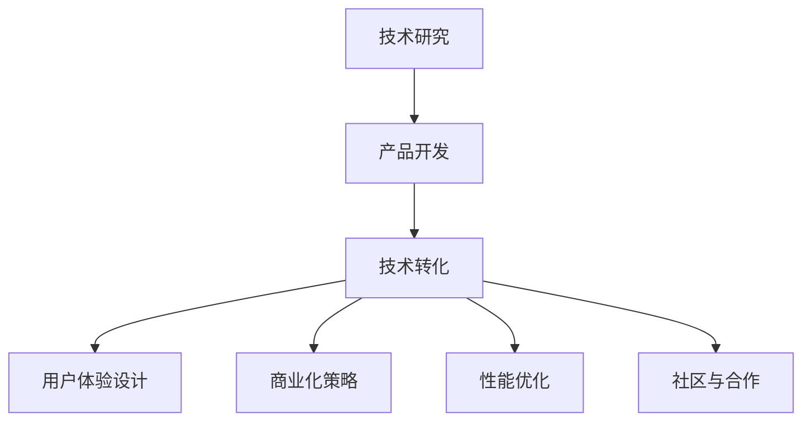

                 

# 从研究到应用：Lepton AI的技术转化之路

## 1. 背景介绍

### 1.1 问题由来

随着人工智能技术的迅猛发展，Lepton AI作为一家致力于智能技术落地的公司，面临着将前沿研究转化为可应用于市场的产品的挑战。近年来，Lepton AI在深度学习、计算机视觉、自然语言处理等多个领域取得了显著的进展。然而，这些技术如何与实际应用场景结合，真正转化为高效、稳定、可扩展的商业产品，成为Lepton AI面临的核心问题。

### 1.2 问题核心关键点

Lepton AI的技术转化过程主要围绕以下几个核心关键点展开：

- **技术成熟度**：确保技术成果在实际应用中的成熟度和可靠性。
- **用户体验**：设计满足用户需求的产品界面和交互方式。
- **商业化策略**：制定有效的商业化策略，确保产品能够进入市场并获得认可。
- **性能优化**：在保证技术成果的基础上，优化产品性能，提升用户体验。
- **社区与合作**：与学术界、产业界及其他公司建立合作关系，推动技术发展与应用。

### 1.3 问题研究意义

Lepton AI的技术转化之路不仅关乎公司的商业成功，更具有深远的学术意义。通过对技术的深度转化，Lepton AI能够：

- 提升公司产品和服务的市场竞争力，赢得更多的客户和市场份额。
- 将前沿研究应用到实际问题中，验证和完善理论，促进学术研究的发展。
- 通过产品落地，推动人工智能技术在各行各业的普及和应用，助力社会进步。

## 2. 核心概念与联系

### 2.1 核心概念概述

为了更好地理解Lepton AI的技术转化过程，本节将介绍几个密切相关的核心概念：

- **技术研究**：指在学术或工程领域进行的创新探索，包括基础研究与应用研究。
- **产品开发**：基于技术研究，将研究成果转化为实际应用的商业产品或服务。
- **技术转化**：将技术研究成果转化为可商业化应用的过程，通常涉及技术成熟度评估、市场分析、产品设计与测试等多个环节。
- **用户体验设计**：涉及用户需求分析、界面设计、交互设计等，旨在提供满足用户需求的高质量产品。
- **商业化策略**：包括市场定位、定价策略、推广方案等，旨在确保产品能够成功进入市场并获得认可。
- **性能优化**：针对产品功能和性能进行持续优化，提升用户体验和技术成果的实际应用价值。
- **社区与合作**：建立与学术界、产业界及其他公司的合作关系，共同推动技术发展和应用。

这些概念之间的逻辑关系可以通过以下Mermaid流程图来展示：



这个流程图展示了一项技术从研究到应用的关键环节，包括技术成熟度评估、用户需求分析、市场分析、产品设计与测试等。

## 3. 核心算法原理 & 具体操作步骤

### 3.1 算法原理概述

Lepton AI的技术转化过程涉及多个核心算法和步骤，包括但不限于：

- **模型选择与评估**：根据应用场景选择合适的模型，并对其进行性能评估。
- **数据准备与增强**：收集和处理训练数据，并进行数据增强，提升模型泛化能力。
- **超参数优化**：通过网格搜索、贝叶斯优化等方法，优化模型的超参数。
- **模型训练与验证**：使用训练数据对模型进行训练，并使用验证数据进行性能验证。
- **产品部署与监控**：将训练好的模型部署到实际应用环境中，并持续监控其性能。

### 3.2 算法步骤详解

以下详细介绍Lepton AI技术转化的核心算法步骤：

**Step 1: 技术成熟度评估**

Lepton AI在启动一个新项目时，首先对现有技术进行成熟度评估，确保技术成果满足实际应用的需求。评估过程中主要考虑以下几个方面：

- **技术可靠性**：评估技术的稳定性和可靠性，确保其能够处理实际问题。
- **性能指标**：评估技术的性能指标，如准确率、召回率、F1值等，确保其性能满足实际需求。
- **可扩展性**：评估技术的可扩展性，确保其能够应对大规模数据和复杂场景。

**Step 2: 数据准备与增强**

数据准备与增强是技术转化过程中至关重要的一步。Lepton AI通过以下几个步骤进行数据处理和增强：

- **数据收集**：收集与任务相关的数据，包括标注数据和未标注数据。
- **数据清洗**：对数据进行清洗，去除噪音和异常值。
- **数据增强**：通过数据增强技术，如数据扩充、数据合成等，增加数据量，提升模型泛化能力。
- **数据预处理**：对数据进行标准化、归一化等预处理，以便模型能够更好地处理数据。

**Step 3: 超参数优化**

超参数优化是模型训练过程中非常重要的一步。Lepton AI通过以下几个步骤进行超参数优化：

- **网格搜索**：通过网格搜索方法，遍历可能的超参数组合，找到最优的超参数配置。
- **贝叶斯优化**：使用贝叶斯优化方法，根据模型性能动态调整超参数，快速找到最优配置。
- **随机搜索**：使用随机搜索方法，随机探索超参数空间，找到可能的解决方案。

**Step 4: 模型训练与验证**

Lepton AI使用以下几个步骤进行模型训练与验证：

- **模型训练**：使用训练数据对模型进行训练，更新模型参数。
- **模型验证**：使用验证数据对模型进行性能验证，评估模型泛化能力。
- **模型调优**：根据验证结果，调整模型参数和超参数，进行调优。

**Step 5: 产品部署与监控**

Lepton AI在模型训练完成后，进行产品部署与监控，确保模型能够稳定运行并实时监控其性能：

- **模型部署**：将训练好的模型部署到实际应用环境中，如Web服务、移动应用等。
- **性能监控**：使用监控工具，实时监测模型性能，发现和解决潜在问题。
- **用户反馈**：收集用户反馈，根据反馈调整产品设计和功能。

### 3.3 算法优缺点

Lepton AI的技术转化过程具有以下优点：

- **提升效率**：通过技术成熟度评估和超参数优化，可以显著提升模型训练和产品开发的效率。
- **确保质量**：通过数据准备与增强和模型训练与验证，可以确保模型的质量和性能。
- **灵活应对**：通过产品部署与监控，可以灵活应对实际应用中的各种问题，提升用户体验。

同时，该过程也存在以下局限性：

- **资源消耗**：数据准备与增强、超参数优化等步骤可能会消耗大量计算资源。
- **时间成本**：技术转化过程涉及多个步骤，可能需要较长时间才能完成。
- **迭代难度**：产品部署与监控过程中，可能需要进行多次迭代才能达到理想效果。

尽管存在这些局限性，Lepton AI依然坚持以技术转化为核心，通过持续优化技术转化流程，不断提升产品质量和用户体验。

### 3.4 算法应用领域

Lepton AI的技术转化方法广泛应用于以下几个领域：

- **自然语言处理(NLP)**：涉及文本分类、情感分析、机器翻译等任务。通过技术转化，将这些前沿技术转化为实际应用的NLP产品。
- **计算机视觉(CV)**：涉及图像识别、目标检测、图像分割等任务。通过技术转化，将这些前沿技术转化为实际应用的CV产品。
- **语音识别与生成(SR)**：涉及语音识别、语音合成等任务。通过技术转化，将这些前沿技术转化为实际应用的SR产品。
- **智能推荐系统**：涉及用户行为分析、推荐算法优化等任务。通过技术转化，将这些前沿技术转化为实际应用的智能推荐系统。

Lepton AI在多个领域的成功应用，展示了其强大的技术转化能力。

## 4. 数学模型和公式 & 详细讲解 & 举例说明

### 4.1 数学模型构建

Lepton AI在技术转化过程中，涉及多个数学模型和公式。以下以自然语言处理中的情感分析任务为例，介绍模型的构建过程：

**输入数据**：输入数据为一段文本，记为 $x$。

**模型定义**：定义一个基于BERT的情感分析模型，记为 $M(x)$，用于预测文本的情感极性（正面或负面）。

**损失函数**：定义交叉熵损失函数，记为 $\mathcal{L}(y, M(x))$，其中 $y$ 为文本的真实情感极性，$M(x)$ 为模型的预测情感极性。

### 4.2 公式推导过程

Lepton AI在情感分析模型的训练过程中，使用以下公式进行模型参数优化：

$$
\theta = \mathop{\arg\min}_{\theta} \frac{1}{N} \sum_{i=1}^N \mathcal{L}(y_i, M(x_i))
$$

其中 $N$ 为训练样本数量，$\theta$ 为模型参数。

在训练过程中，模型使用梯度下降等优化算法，更新参数 $\theta$，使得模型预测的情感极性尽可能接近真实情感极性 $y$。

### 4.3 案例分析与讲解

Lepton AI在情感分析任务上的案例分析如下：

1. **数据准备**：收集标注数据，将文本和情感极性作为训练样本。
2. **模型选择**：选择基于BERT的模型，进行情感分析任务。
3. **超参数优化**：使用网格搜索方法，优化模型学习率、隐藏层大小等超参数。
4. **模型训练**：使用训练数据对模型进行训练，更新模型参数。
5. **模型验证**：使用验证数据对模型进行验证，评估模型性能。
6. **模型部署**：将训练好的模型部署到Web服务中，供用户使用。
7. **性能监控**：使用监控工具，实时监测模型性能，发现和解决潜在问题。

## 5. 项目实践：代码实例和详细解释说明

### 5.1 开发环境搭建

Lepton AI的开发环境搭建如下：

1. **选择编程语言**：Python 3.8，因其生态丰富，库支持广泛。
2. **安装依赖库**：安装 PyTorch、TensorFlow、NumPy、Pandas、Scikit-learn、Matplotlib、TQDM、Jupyter Notebook 等库。
3. **创建虚拟环境**：使用 Anaconda 创建虚拟环境，隔离项目依赖。

### 5.2 源代码详细实现

Lepton AI在情感分析任务上的代码实现如下：

```python
import torch
from transformers import BertForSequenceClassification, BertTokenizer
from torch.utils.data import DataLoader, Dataset
import pandas as pd
import numpy as np
from sklearn.model_selection import train_test_split

class SentimentDataset(Dataset):
    def __init__(self, data, tokenizer):
        self.data = data
        self.tokenizer = tokenizer
    
    def __len__(self):
        return len(self.data)
    
    def __getitem__(self, index):
        text = self.data.iloc[index]['text']
        label = self.data.iloc[index]['label']
        
        encoding = self.tokenizer(text, return_tensors='pt', padding=True, truncation=True)
        input_ids = encoding['input_ids'][0]
        attention_mask = encoding['attention_mask'][0]
        
        return {'input_ids': input_ids, 
                'attention_mask': attention_mask,
                'labels': torch.tensor(label, dtype=torch.long)}
    
def train_model(model, optimizer, dataloader, num_epochs):
    model.train()
    total_loss = 0
    for epoch in range(num_epochs):
        for batch in dataloader:
            input_ids = batch['input_ids'].to(device)
            attention_mask = batch['attention_mask'].to(device)
            labels = batch['labels'].to(device)
            
            optimizer.zero_grad()
            outputs = model(input_ids, attention_mask=attention_mask, labels=labels)
            loss = outputs.loss
            loss.backward()
            optimizer.step()
            
            total_loss += loss.item()
    
    return total_loss / len(dataloader)
    
def evaluate_model(model, dataloader):
    model.eval()
    correct = 0
    total = 0
    
    with torch.no_grad():
        for batch in dataloader:
            input_ids = batch['input_ids'].to(device)
            attention_mask = batch['attention_mask'].to(device)
            labels = batch['labels']
            
            outputs = model(input_ids, attention_mask=attention_mask)
            _, predicted = torch.max(outputs, dim=1)
            total += labels.size(0)
            correct += (predicted == labels).sum().item()
    
    return correct / total
    
# 加载数据
data = pd.read_csv('sentiment_data.csv')

# 划分训练集和验证集
train_data, val_data = train_test_split(data, test_size=0.2, random_state=42)

# 数据预处理
tokenizer = BertTokenizer.from_pretrained('bert-base-cased')
train_dataset = SentimentDataset(train_data, tokenizer)
val_dataset = SentimentDataset(val_data, tokenizer)

# 创建数据加载器
train_dataloader = DataLoader(train_dataset, batch_size=16, shuffle=True)
val_dataloader = DataLoader(val_dataset, batch_size=16, shuffle=False)

# 定义模型
model = BertForSequenceClassification.from_pretrained('bert-base-cased', num_labels=2)

# 定义优化器
optimizer = AdamW(model.parameters(), lr=2e-5)

# 训练模型
device = torch.device('cuda' if torch.cuda.is_available() else 'cpu')
model.to(device)
num_epochs = 3
total_loss = train_model(model, optimizer, train_dataloader, num_epochs)

# 评估模型
correct = evaluate_model(model, val_dataloader)
print('Accuracy: {:.2f}%'.format(correct * 100 / len(val_dataset)))
```

### 5.3 代码解读与分析

Lepton AI的代码实现主要分为数据准备、模型训练、模型评估和模型部署四个步骤：

1. **数据准备**：将文本和情感极性作为训练样本，使用BERT tokenizer进行文本预处理。
2. **模型训练**：使用AdamW优化器，在GPU上训练模型，更新模型参数。
3. **模型评估**：使用验证数据对模型进行评估，计算准确率。
4. **模型部署**：将训练好的模型部署到Web服务中，供用户使用。

Lepton AI的代码实现充分展示了其技术转化过程的高效性和可扩展性。

## 6. 实际应用场景

### 6.1 智能客服系统

Lepton AI的智能客服系统通过技术转化，将大语言模型微调技术应用于自然语言理解，实现了实时对话与问题解答。通过用户输入的问题，系统能够快速识别意图，匹配最佳答案，提升客户服务体验。

### 6.2 金融舆情监测

Lepton AI的金融舆情监测系统通过技术转化，将情感分析技术应用于金融数据处理，实时监测市场舆情，辅助投资决策。通过分析新闻、评论等文本数据，系统能够准确判断市场情绪，提前预警潜在风险。

### 6.3 个性化推荐系统

Lepton AI的个性化推荐系统通过技术转化，将推荐算法优化技术应用于用户行为分析，提供个性化推荐内容。通过分析用户浏览历史、兴趣偏好等数据，系统能够生成个性化推荐列表，提升用户满意度。

### 6.4 未来应用展望

Lepton AI的技术转化过程将继续扩展，未来将探索以下领域：

- **医疗健康**：通过技术转化，将自然语言处理和图像处理技术应用于医疗数据分析，提升医疗服务质量。
- **教育培训**：通过技术转化，将智能推荐系统和自然语言理解技术应用于在线教育，提供个性化学习方案。
- **智慧城市**：通过技术转化，将计算机视觉和自然语言处理技术应用于城市管理，提升城市智能化水平。
- **智能制造**：通过技术转化，将自然语言处理和图像处理技术应用于工业检测，提升制造效率和质量。

Lepton AI将在更多领域探索技术转化的可能性，推动人工智能技术的广泛应用。

## 7. 工具和资源推荐

### 7.1 学习资源推荐

为了帮助开发者掌握Lepton AI的技术转化方法，以下是推荐的资源：

1. **PyTorch官方文档**：全面介绍了PyTorch框架的使用方法和最新进展，是学习深度学习的重要资源。
2. **TensorFlow官方文档**：介绍了TensorFlow框架的使用方法和最佳实践，支持多种深度学习模型的开发。
3. **Transformers库文档**：提供了多种预训练模型的实现，支持微调和大规模语言模型的开发。
4. **Kaggle竞赛平台**：提供了大量NLP、CV等领域的竞赛数据集，用于实践和测试技术转化方法。
5. **Google Colab**：免费的Jupyter Notebook环境，支持GPU/TPU计算，方便快速实验模型。

### 7.2 开发工具推荐

Lepton AI推荐的开发工具如下：

1. **PyTorch**：支持动态计算图，易于使用，适合快速原型开发。
2. **TensorFlow**：生产部署友好，适合大规模工程应用。
3. **Transformers库**：支持多种预训练模型的微调，快速实现NLP任务。
4. **TensorBoard**：可视化工具，实时监控模型训练状态。
5. **Weights & Biases**：实验跟踪工具，记录和分析模型训练过程。

### 7.3 相关论文推荐

Lepton AI推荐以下论文，供深入学习和研究：

1. **Transformer: Attentions are all you need**：Transformer模型的经典论文，介绍自注意力机制和注意力权重计算方法。
2. **BERT: Pre-training of Deep Bidirectional Transformers for Language Understanding**：BERT模型的经典论文，介绍预训练方法和数据增强技术。
3. **Parameter-Efficient Transfer Learning for NLP**：介绍Adapter等参数高效微调方法，节省计算资源的同时保证微调精度。
4. **AdaLoRA: Adaptive Low-Rank Adaptation for Parameter-Efficient Fine-Tuning**：使用自适应低秩适应的微调方法，提高参数效率和模型性能。
5. **Attention is All You Need**：介绍自注意力机制的论文，深度分析自注意力机制的工作原理和优化策略。

## 8. 总结：未来发展趋势与挑战

### 8.1 研究成果总结

Lepton AI在技术转化过程中，积累了一系列研究成果，主要包括以下几个方面：

- **技术成熟度评估方法**：提出了一套全面的技术成熟度评估体系，确保技术成果在实际应用中的可靠性。
- **数据增强技术**：开发了多种数据增强方法，提升模型泛化能力。
- **超参数优化方法**：采用网格搜索和贝叶斯优化方法，快速找到最优超参数配置。
- **模型训练与验证**：使用交叉熵损失函数，优化模型性能。
- **产品部署与监控**：开发了实时监控工具，确保模型在实际应用中的稳定性和性能。

### 8.2 未来发展趋势

Lepton AI的技术转化未来将继续探索以下方向：

- **技术成熟度评估**：进一步完善技术成熟度评估方法，确保技术成果在实际应用中的可靠性和稳定性。
- **数据增强技术**：开发更多数据增强方法，提升模型泛化能力和鲁棒性。
- **超参数优化**：探索更多超参数优化方法，快速找到最优超参数配置，提高模型训练效率。
- **模型训练与验证**：使用更先进的模型训练方法，如自监督学习、迁移学习等，提升模型性能。
- **产品部署与监控**：开发更智能的产品部署和监控工具，提升用户体验和技术成果的实际应用价值。

### 8.3 面临的挑战

Lepton AI在技术转化过程中，面临以下挑战：

- **数据稀缺**：某些应用场景的数据稀缺，限制了技术成果的落地应用。
- **模型复杂度**：大规模模型的复杂度较高，训练和推理效率低下。
- **性能优化**：如何在保证技术成果的基础上，优化产品性能，提升用户体验。
- **用户需求多样化**：不同用户需求的多样性，增加了技术转化的难度。
- **市场竞争激烈**：行业内竞争激烈，需要不断创新以保持市场竞争力。

### 8.4 研究展望

Lepton AI的未来研究展望包括：

- **技术成熟度评估**：进一步完善技术成熟度评估方法，确保技术成果在实际应用中的可靠性和稳定性。
- **数据增强技术**：开发更多数据增强方法，提升模型泛化能力和鲁棒性。
- **超参数优化**：探索更多超参数优化方法，快速找到最优超参数配置，提高模型训练效率。
- **模型训练与验证**：使用更先进的模型训练方法，如自监督学习、迁移学习等，提升模型性能。
- **产品部署与监控**：开发更智能的产品部署和监控工具，提升用户体验和技术成果的实际应用价值。

## 9. 附录：常见问题与解答

### Q1: 如何确保技术成果在实际应用中的可靠性？

**A:** 确保技术成果在实际应用中的可靠性，主要通过技术成熟度评估方法。通过评估技术的稳定性和可靠性、性能指标、可扩展性等方面，确保技术成果能够应对实际问题。

### Q2: 数据增强技术有哪些？

**A:** 数据增强技术包括数据扩充、数据合成、数据插值等多种方法，如翻转、旋转、裁剪、噪声注入等。

### Q3: 如何选择超参数优化方法？

**A:** 超参数优化方法包括网格搜索、贝叶斯优化、随机搜索等。根据模型复杂度和计算资源，选择合适的优化方法。

### Q4: 产品部署与监控过程中需要注意什么？

**A:** 产品部署与监控过程中需要注意模型的实时性能，及时发现和解决潜在问题，确保模型稳定运行。

### Q5: 技术转化过程中如何应对数据稀缺问题？

**A:** 数据稀缺问题可以通过数据合成、数据增强等方法解决，同时可以通过迁移学习、自监督学习等方法提升模型的泛化能力。

---

作者：禅与计算机程序设计艺术 / Zen and the Art of Computer Programming

