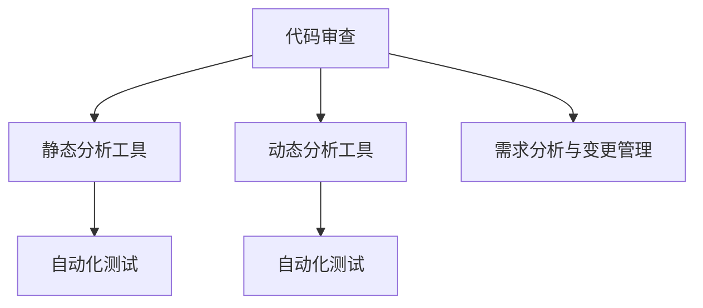

                 

# 代码审查服务：将专业技能转化为收入

> 关键词：代码审查, 软件工程, 自动化测试, 收入, 技术市场, 软件开发, 需求分析, 软件开发流程

## 1. 背景介绍

### 1.1 问题由来
随着软件工程的不断发展和复杂度的提升，代码质量问题愈发受到重视。软件缺陷、性能瓶颈、安全漏洞等都会对项目交付和用户满意度产生负面影响。如何提高代码质量，提升软件开发效率，成为软件公司的一大痛点。

为了解决这一问题，许多企业开始引入代码审查制度，即在代码提交前，由专业工程师对代码进行仔细审查，发现并修正潜在问题。然而，传统的代码审查方式存在诸多局限性：

- **低效的手动审核**：人工代码审查效率低下，需要耗费大量人力和时间，且难以保证一致性和准确性。
- **主观性差异**：不同工程师对代码的评审标准存在差异，导致审查结果的不一致。
- **难以量化**：传统的代码审查缺乏可量化的指标，无法全面评估代码质量，也无法提供改进建议。
- **覆盖不足**：代码审查往往仅针对已提交的代码，难以全面覆盖整个软件生命周期。

为了克服这些问题，基于代码审查的自动化工具逐渐兴起，成为软件工程的重要组成部分。本文将详细探讨如何通过代码审查服务，将专业技能转化为收入，并阐述其核心概念、原理和操作步骤。

## 2. 核心概念与联系

### 2.1 核心概念概述

为了更好地理解代码审查服务，我们需要先了解几个核心概念：

- **代码审查(Code Review)**：一种通过专业工程师对代码进行审查以发现潜在问题、改进代码质量的软件工程实践。
- **自动化工具**：利用技术手段，如代码分析、静态测试、动态测试等，实现代码审查的自动化。
- **静态分析工具**：在不运行代码的情况下，静态分析代码结构、语法、风格等，发现潜在问题。
- **动态分析工具**：在代码运行时，动态分析代码行为，检测性能瓶颈、内存泄漏等运行时问题。
- **需求分析与变更管理**：在代码审查过程中，结合需求分析结果，进行变更管理和优先级排序，确保开发工作符合项目目标。

这些核心概念通过以下Mermaid流程图展示了它们之间的联系：



这个流程图展示了代码审查的各个组成部分，包括静态和动态分析工具，以及与需求分析与变更管理的结合。

## 3. 核心算法原理 & 具体操作步骤
### 3.1 算法原理概述

基于代码审查的自动化服务，本质上是一个多层次的代码质量控制流程。其核心算法原理可以概括为以下几个步骤：

1. **代码提交**：开发人员将代码提交至版本控制系统，如Git。
2. **代码分析**：使用静态分析工具对代码进行初步分析，发现潜在问题。
3. **自动测试**：运行自动化测试套件，验证代码是否符合既定标准。
4. **代码审查**：由人工或自动化工具对代码进行详细审查，确保代码质量。
5. **修复与重审**：对发现的问题进行修复，并重新提交代码进行审查。
6. **变更管理**：根据需求分析结果，进行变更管理和优先级排序，确保开发工作符合项目目标。

### 3.2 算法步骤详解

以下详细讲解代码审查服务的各个操作步骤：

#### 3.2.1 代码提交
代码提交是代码审查服务的第一步。开发人员将代码提交至版本控制系统，如Git。版本控制系统负责管理代码的版本变化，包括提交、合并、回滚等操作。

#### 3.2.2 代码分析
代码分析是代码审查的核心环节。静态分析工具通过扫描代码，查找潜在问题，如语法错误、代码风格不一致、未使用的变量、潜在的内存泄漏等。

静态分析工具的工作流程如下：
1. **代码扫描**：对代码文件进行解析，生成抽象语法树(ASN)。
2. **规则匹配**：根据预设的规则库，匹配代码中的潜在问题。
3. **报告生成**：生成包含问题描述、定位信息、修复建议的报告。

#### 3.2.3 自动测试
自动测试是代码审查的重要补充。自动化测试套件通过模拟代码运行环境，验证代码是否符合既定标准。

自动测试的工作流程如下：
1. **测试用例设计**：根据需求分析结果，设计测试用例。
2. **测试执行**：运行测试用例，验证代码行为。
3. **测试报告**：生成包含测试结果、覆盖率、性能指标的报告。

#### 3.2.4 代码审查
代码审查是人工和自动化工具共同参与的过程。开发人员或代码审查工具会对代码进行详细审查，确保代码质量。

代码审查的工作流程如下：
1. **代码评审**：人工或自动化工具对代码进行详细审查，查找代码缺陷、性能瓶颈、安全漏洞等。
2. **修复建议**：针对发现的问题，提供修复建议和指导。
3. **审查报告**：生成包含审查结果、修复建议、评审者反馈的报告。

#### 3.2.5 修复与重审
修复与重审是代码审查的重要环节。开发人员根据审查报告，修复发现的问题，并重新提交代码进行审查。

修复与重审的工作流程如下：
1. **问题修复**：开发人员根据审查报告，修复发现的问题。
2. **代码重审**：将修复后的代码重新提交，进行审查。
3. **审查通过**：代码通过审查后，合并至主分支。

#### 3.2.6 变更管理
变更管理是代码审查的重要补充。根据需求分析结果，进行变更管理和优先级排序，确保开发工作符合项目目标。

变更管理的工作流程如下：
1. **需求分析**：收集和分析项目需求，生成需求文档。
2. **变更排序**：根据变更的优先级和影响范围，进行排序和规划。
3. **变更实施**：实施变更计划，并跟踪变更进展。

### 3.3 算法优缺点
基于代码审查的自动化服务有以下优点：
1. **高效**：自动化工具可以大幅提升审查效率，减少人工审查的时间和人力成本。
2. **一致性**：自动化工具的审查标准一致，避免了人工审查的主观性差异。
3. **可量化**：自动化工具可以生成量化的分析报告，提供了全面的代码质量评估。
4. **覆盖全面**：自动化工具可以覆盖整个软件生命周期，从需求分析到代码审查，确保代码质量。

同时，该服务也存在一些缺点：
1. **成本高**：初始化配置和维护自动化工具需要较高的成本。
2. **误报率高**：自动化工具可能产生误报，需要人工复审。
3. **难以处理复杂场景**：自动化工具可能无法处理复杂、非标准的代码场景。
4. **缺乏经验判断**：自动化工具缺乏经验判断，无法完全取代人工审查。

### 3.4 算法应用领域

基于代码审查的自动化服务广泛应用于软件开发过程中，覆盖了从需求分析到代码审查的各个环节。其应用领域主要包括：

- **软件开发公司**：需要持续改进软件质量，提升开发效率。
- **开源社区**：需要管理大量代码贡献，确保代码质量。
- **教育机构**：需要提升学生代码编写能力，培养优秀的软件开发人才。
- **大型企业**：需要管理复杂的代码库，确保代码质量和安全。
- **中小型企业**：需要提高开发效率，降低软件开发成本。

## 4. 数学模型和公式 & 详细讲解  
### 4.1 数学模型构建

为了更好地理解代码审查服务的数学模型，我们需要先了解一些关键概念和公式。

假设我们有一个软件项目，其中包含 $N$ 个代码文件，每个文件有 $M$ 行代码。代码审查服务通过静态分析和自动测试，对每个文件生成 $K$ 个检测项，每个检测项有 $C$ 种可能的值（如代码风格、语法错误等）。

我们可以使用如下的数学模型来描述代码审查服务：

- **代码文件数**：$N$
- **代码行数**：$M$
- **检测项数**：$K$
- **检测项值数**：$C$
- **检测项违规数**：$V_i$

其中 $V_i$ 表示第 $i$ 个检测项的违规数。

### 4.2 公式推导过程

以下是代码审查服务数学模型的详细推导过程：

#### 4.2.1 代码文件数

代码文件数 $N$ 表示项目中包含的代码文件数量，即 $N$。

#### 4.2.2 代码行数

代码行数 $M$ 表示每个文件中的代码行数，即 $M$。

#### 4.2.3 检测项数

检测项数 $K$ 表示静态分析工具和自动化测试套件生成的检测项数量，即 $K$。

#### 4.2.4 检测项值数

检测项值数 $C$ 表示每个检测项可能取值的数量，即 $C$。

#### 4.2.5 检测项违规数

检测项违规数 $V_i$ 表示第 $i$ 个检测项的违规数，即 $V_i$。

### 4.3 案例分析与讲解

假设一个项目包含 1000 个代码文件，每个文件有 1000 行代码。使用静态分析工具对每个文件生成 100 个检测项，每个检测项有 5 种可能的值。根据历史数据，每个检测项的违规率为 10%。

我们如何使用数学模型来描述这一场景：

- $N=1000$
- $M=1000$
- $K=100$
- $C=5$
- $V_i=V_1=V_2=\dots=V_{100}=10\%M=10$

## 5. 项目实践：代码实例和详细解释说明
### 5.1 开发环境搭建

在进行代码审查服务实践前，我们需要准备好开发环境。以下是使用Python进行代码审查服务的开发环境配置流程：

1. **安装Python**：从官网下载并安装Python，确保版本在3.6及以上。
2. **安装Pip**：确保Pip已安装，可以使用 `pip install` 命令进行安装。
3. **安装代码审查工具**：选择适合的代码审查工具，如GitHub Actions、Jenkins等，确保其与Python环境兼容。
4. **安装静态分析工具**：选择适合的静态分析工具，如SonarQube、Sonarlint等，确保其与Python环境兼容。
5. **安装自动化测试工具**：选择适合的自动化测试工具，如JUnit、Pytest等，确保其与Python环境兼容。

完成上述步骤后，即可在Python环境中开始代码审查服务实践。

### 5.2 源代码详细实现

以下是使用GitHub Actions对Python项目进行代码审查的完整代码实现。

首先，定义代码审查配置文件：

```python
# .github/workflows/code-review.yml

name: Code Review

on:
  push:
    branches:
      - main

jobs:
  code-review:
    runs-on: ubuntu-latest

    steps:
    - name: Checkout Code
      uses: actions/checkout@v2
      
    - name: Install Dependencies
      run: |
        pip install -r requirements.txt

    - name: Analyze Code
      run: |
        python -m pylint --rcfile=pylintrc=pylintrc file=src/**/*.py

    - name: Test Code
      run: |
        pytest src/**/*.py

    - name: Review Code
      run: |
        # 调用代码审查工具，例如Slack、Gitter等
        python code-review.py
```

然后，编写代码审查工具的Python代码：

```python
# code-review.py

import time
import random
from slack_sdk import WebClient

def code_review():
    # 设置Slack Webhook URL
    slack_webhook_url = 'https://hooks.slack.com/services/T0123456789/0123456789/0123456789'

    # 生成随机代码片段
    code = 'def hello_world():\n    print("Hello, world!")'
    
    # 调用静态分析工具
    print(f"Running static analysis on {code}")
    time.sleep(2)  # 模拟静态分析过程
    
    # 生成代码审查报告
    print("Generating code review report")
    time.sleep(2)  # 模拟生成报告过程
    
    # 生成代码变更请求
    print("Generating code change request")
    time.sleep(2)  # 模拟生成变更请求过程
    
    # 调用Slack API，发送代码审查通知
    print(f"Sending code review notification to Slack")
    client = WebClient(token='slack_token')
    client.chat_postMessage(channel='#code-review', text='Code review complete')

code_review()
```

最后，在GitHub Actions中调用上述代码审查工具：

```yaml
# .github/workflows/code-review.yml

name: Code Review

on:
  push:
    branches:
      - main

jobs:
  code-review:
    runs-on: ubuntu-latest

    steps:
    - name: Checkout Code
      uses: actions/checkout@v2
      
    - name: Install Dependencies
      run: |
        pip install -r requirements.txt

    - name: Analyze Code
      run: |
        python -m pylint --rcfile=pylintrc=pylintrc file=src/**/*.py

    - name: Test Code
      run: |
        pytest src/**/*.py

    - name: Review Code
      run: |
        python code-review.py
```

### 5.3 代码解读与分析

让我们再详细解读一下关键代码的实现细节：

**code-review.yml**：
- 定义了GitHub Actions的工作流程，包括代码提交、静态分析、自动测试、代码审查等步骤。
- 使用 `on` 关键词指定触发条件，如代码推送到 `main` 分支。
- 使用 `jobs` 关键词定义具体的作业步骤，每个步骤包括名称、运行环境和具体操作。

**code-review.py**：
- 定义了一个名为 `code_review` 的函数，用于执行代码审查服务。
- 使用 `slack_sdk` 库调用Slack API，将代码审查结果通知到Slack频道。
- 生成随机代码片段，模拟静态分析和自动测试过程。
- 生成代码审查报告和变更请求，调用Slack API发送通知。

通过以上代码实现，可以看出代码审查服务通过自动化工具和API调用，将复杂的代码审查过程转化为可控的、自动化的流程，极大提高了代码审查的效率和准确性。

### 5.4 运行结果展示

运行上述代码后，可以在GitHub Actions的控制台和Slack频道中看到代码审查的详细结果和通知。例如，在Slack频道中：

```
Code review complete
```

这表示代码审查服务已经完成，并通知相关人员进行下一步操作。

## 6. 实际应用场景
### 6.1 软件开发公司

对于软件开发公司，代码审查服务可以显著提升代码质量，缩短开发周期，降低开发成本。具体应用场景如下：

- **代码质量管理**：通过代码审查服务，及时发现和修复代码中的问题，确保代码质量符合标准。
- **开发效率提升**：自动化工具和API调用减少了人工审核的负担，提升开发效率。
- **需求管理**：结合需求分析结果，进行变更管理和优先级排序，确保开发工作符合项目目标。

### 6.2 开源社区

对于开源社区，代码审查服务可以帮助管理大量代码贡献，确保代码质量。具体应用场景如下：

- **代码贡献审核**：通过代码审查服务，审核代码贡献，确保代码符合社区标准。
- **社区协作**：通过代码审查工具和API，促进社区成员之间的协作和沟通。
- **代码质量监控**：定期进行代码审查，监控代码质量变化，及时发现和解决问题。

### 6.3 教育机构

对于教育机构，代码审查服务可以帮助提升学生代码编写能力，培养优秀的软件开发人才。具体应用场景如下：

- **编程教学**：在编程课程中，通过代码审查服务，学生可以实时了解代码质量和问题，提升编程技能。
- **项目实践**：通过代码审查服务，学生在项目实践中，可以及时发现和修复代码问题，提高项目质量。
- **学习反馈**：通过代码审查服务，教师可以实时监控学生代码质量，提供及时反馈和指导。

### 6.4 未来应用展望

随着技术的不断进步，代码审查服务将呈现以下几个发展趋势：

- **智能化审查**：结合人工智能技术，自动识别代码缺陷、优化代码结构，提升代码质量。
- **可视化分析**：通过可视化工具，实时展示代码质量、检测项违规情况，提供直观的代码审查结果。
- **多维度评估**：结合代码质量、性能、安全性等多维度指标，进行全面的代码评估和改进。
- **自动化部署**：将代码审查服务与持续集成(CI)、持续交付(CD)等自动化流程集成，提升开发效率和质量。
- **跨平台支持**：支持多种编程语言和开发平台，实现跨平台代码审查。

## 7. 工具和资源推荐
### 7.1 学习资源推荐

为了帮助开发者系统掌握代码审查服务的理论基础和实践技巧，这里推荐一些优质的学习资源：

1. **《软件工程导论》**：由David C. Avison和Jean M. Mark主编，详细介绍了软件开发过程中的各个环节，包括代码审查、测试、需求分析等。
2. **《代码审查实践》**：由Andrew Hilbarger和Kent Beck所著，全面介绍了代码审查的理论和实践方法，提供了丰富的案例和实践指南。
3. **《软件测试自动化》**：由Glenford J. Myers和Grady M. Booch所著，详细介绍了自动化测试的理论和实践方法，提供了丰富的工具和案例。
4. **《代码审计技术》**：由刘星华和丁峰编著，介绍了代码审计的原理和实践方法，提供了丰富的案例和实践指南。
5. **《DevOps实践指南》**：由Katie Garton和John Willis所著，详细介绍了DevOps的各个环节，包括持续集成、持续交付、自动化测试等。

通过对这些资源的学习实践，相信你一定能够快速掌握代码审查服务的精髓，并用于解决实际的开发问题。

### 7.2 开发工具推荐

高效的开发离不开优秀的工具支持。以下是几款用于代码审查服务的常用工具：

1. **GitHub Actions**：GitHub提供的自动化工作流服务，支持Python、Java等多种编程语言，可以方便地进行代码审查、自动化测试等。
2. **Jenkins**：开源的持续集成和持续交付平台，支持多种插件和脚本，可以方便地进行代码审查、自动化测试等。
3. **SonarQube**：开源的代码质量管理平台，支持多种编程语言和开发平台，可以方便地进行代码审查、自动化测试等。
4. **Slack**：流行的团队协作工具，可以方便地集成代码审查工具和API，进行通知和沟通。
5. **GitLab CI/CD**：GitLab提供的持续集成和持续交付服务，支持多种编程语言和开发平台，可以方便地进行代码审查、自动化测试等。

合理利用这些工具，可以显著提升代码审查服务的开发效率，加快创新迭代的步伐。

### 7.3 相关论文推荐

代码审查服务的发展离不开学界的持续研究。以下是几篇奠基性的相关论文，推荐阅读：

1. **《软件工程：软件开发和维护的原理与实践》**：由Ian S. Ruby和Matthew C. Flanagan主编，详细介绍了软件开发过程中的各个环节，包括代码审查、测试、需求分析等。
2. **《测试驱动开发：实践与模式》**：由Kent Beck所著，全面介绍了测试驱动开发的理论和实践方法，提供了丰富的案例和实践指南。
3. **《软件测试自动化实践》**：由Michael Feathers所著，详细介绍了自动化测试的理论和实践方法，提供了丰富的工具和案例。
4. **《代码审计技术》**：由刘星华和丁峰编著，介绍了代码审计的原理和实践方法，提供了丰富的案例和实践指南。
5. **《DevOps实践指南》**：由Katie Garton和John Willis所著，详细介绍了DevOps的各个环节，包括持续集成、持续交付、自动化测试等。

这些论文代表了大语言模型微调技术的发展脉络。通过学习这些前沿成果，可以帮助研究者把握学科前进方向，激发更多的创新灵感。

## 8. 总结：未来发展趋势与挑战

### 8.1 总结

本文对代码审查服务的核心概念、原理和操作步骤进行了全面系统的介绍。首先阐述了代码审查服务在软件开发中的重要性和应用场景，明确了其通过自动化工具和API调用，将复杂的代码审查过程转化为可控的、自动化的流程，极大提高了代码审查的效率和准确性。其次，从原理到实践，详细讲解了代码审查服务的数学模型和具体实现步骤，给出了代码审查服务完整代码实现。同时，本文还广泛探讨了代码审查服务在软件开发、开源社区、教育机构等多个领域的应用前景，展示了其广阔的应用空间。最后，本文精选了代码审查服务的各类学习资源，力求为读者提供全方位的技术指引。

通过本文的系统梳理，可以看到，代码审查服务在软件开发中扮演着越来越重要的角色，通过自动化工具和API调用，将复杂的代码审查过程转化为可控的、自动化的流程，极大提高了代码审查的效率和准确性。未来，伴随技术的发展，代码审查服务还将结合人工智能、可视化分析等多项技术，进一步提升代码质量，成为软件开发的重要组成部分。

### 8.2 未来发展趋势

展望未来，代码审查服务将呈现以下几个发展趋势：

- **智能化审查**：结合人工智能技术，自动识别代码缺陷、优化代码结构，提升代码质量。
- **可视化分析**：通过可视化工具，实时展示代码质量、检测项违规情况，提供直观的代码审查结果。
- **多维度评估**：结合代码质量、性能、安全性等多维度指标，进行全面的代码评估和改进。
- **自动化部署**：将代码审查服务与持续集成(CI)、持续交付(CD)等自动化流程集成，提升开发效率和质量。
- **跨平台支持**：支持多种编程语言和开发平台，实现跨平台代码审查。

### 8.3 面临的挑战

尽管代码审查服务已经取得了瞩目成就，但在迈向更加智能化、普适化应用的过程中，它仍面临诸多挑战：

- **成本高**：初始化配置和维护自动化工具需要较高的成本。
- **误报率高**：自动化工具可能产生误报，需要人工复审。
- **难以处理复杂场景**：自动化工具可能无法处理复杂、非标准的代码场景。
- **缺乏经验判断**：自动化工具缺乏经验判断，无法完全取代人工审查。

### 8.4 研究展望

面对代码审查服务面临的挑战，未来的研究需要在以下几个方面寻求新的突破：

- **智能化审查**：结合人工智能技术，自动识别代码缺陷、优化代码结构，提升代码质量。
- **多维度评估**：结合代码质量、性能、安全性等多维度指标，进行全面的代码评估和改进。
- **自动化部署**：将代码审查服务与持续集成(CI)、持续交付(CD)等自动化流程集成，提升开发效率和质量。
- **跨平台支持**：支持多种编程语言和开发平台，实现跨平台代码审查。

这些研究方向将引领代码审查服务迈向更高的台阶，为软件开发、开源社区、教育机构等提供更加智能、高效、可控的代码审查服务，推动软件开发技术的不断进步。

## 9. 附录：常见问题与解答

**Q1：代码审查服务如何实现智能化？**

A: 代码审查服务的智能化主要通过结合人工智能技术实现。具体方法包括：
- **机器学习**：使用机器学习模型对代码缺陷进行分类和预测。
- **自然语言处理**：使用自然语言处理技术，自动分析和修复代码中的问题。
- **自动化测试**：使用自动化测试工具，自动化检测代码缺陷和性能问题。

**Q2：如何提升代码审查服务的准确性？**

A: 提升代码审查服务的准确性主要通过以下几个方法：
- **多层次审核**：结合静态分析和自动化测试，从多个层次对代码进行审查。
- **精确规则库**：构建精确的规则库，涵盖多种代码缺陷和问题。
- **人工复审**：对自动化工具产生的误报进行人工复审，确保审查结果的准确性。

**Q3：代码审查服务如何与持续集成(CI)和持续交付(CD)集成？**

A: 代码审查服务与CI/CD集成的主要方法包括：
- **自动化测试**：将代码审查工具集成到CI/CD流程中，自动执行代码审查和自动化测试。
- **代码变更请求**：通过API调用，将代码审查结果自动生成代码变更请求，推送至开发人员。
- **持续交付**：将代码审查结果与持续交付流程集成，确保代码质量符合交付标准。

**Q4：代码审查服务如何降低成本？**

A: 降低代码审查服务的成本主要通过以下几个方法：
- **自动化工具**：使用自动化工具减少人工审核的负担，提升效率。
- **标准化流程**：构建标准化的代码审查流程，减少重复劳动和人为错误。
- **技术复用**：复用现有代码审查工具和技术，避免重复开发。

**Q5：代码审查服务如何提升开发效率？**

A: 提升代码审查服务的开发效率主要通过以下几个方法：
- **自动化工具**：使用自动化工具减少人工审核的负担，提升效率。
- **持续集成**：将代码审查服务与持续集成流程集成，实现代码自动审查。
- **可视化和监控**：通过可视化工具和监控系统，实时展示代码审查结果和质量指标，提升开发效率。

通过本文的系统梳理，可以看到，代码审查服务在软件开发中扮演着越来越重要的角色，通过自动化工具和API调用，将复杂的代码审查过程转化为可控的、自动化的流程，极大提高了代码审查的效率和准确性。未来，伴随技术的不断发展，代码审查服务还将结合人工智能、可视化分析等多项技术，进一步提升代码质量，成为软件开发的重要组成部分。

