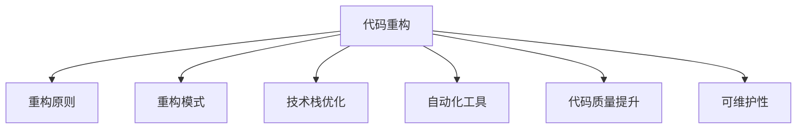

                 

# 代码重构的技巧与模式总结

> 关键词：代码重构, 重构原则, 重构模式, 技术栈优化, 自动化工具, 代码质量提升, 可维护性

## 1. 背景介绍

### 1.1 问题由来

在软件开发中，代码的不断迭代和更新是常态。随着功能需求的增加，代码库逐渐变得臃肿和复杂，可读性降低，维护成本上升。此时，代码重构（Code Refactoring）就显得尤为重要。

代码重构不仅能够提升代码质量和可维护性，还能促进团队协作，加速产品迭代。通过重构，旧代码能够变得更加简洁、易于理解和维护，降低未来的修改和维护难度。

### 1.2 问题核心关键点

代码重构的核心在于保持代码的简洁、清晰和可维护性，以适应项目发展的需要。具体关键点包括：

- **代码结构优化**：优化代码结构，减少冗余，提高代码的可读性和可维护性。
- **性能优化**：提升代码性能，降低运行时间和内存占用。
- **可扩展性提升**：使代码更具扩展性，便于未来功能的添加和修改。
- **代码重构工具**：掌握和使用高效的代码重构工具，提升重构效率。
- **持续集成与测试**：在重构过程中，确保代码的健壮性和功能的正确性，避免引入新的Bug。

### 1.3 问题研究意义

有效的代码重构能够显著提升软件的质量和可维护性，降低开发和维护成本，提高开发效率，增强软件的竞争力和用户体验。通过重构，开发者可以更好地理解代码的内部逻辑，提升自身技能，构建更优秀的技术栈，从而提升团队整体水平。

## 2. 核心概念与联系

### 2.1 核心概念概述

为更好地理解代码重构的方法和原则，本节将介绍几个密切相关的核心概念：

- **代码重构**：对现有代码进行修改或调整，以提升代码质量、可维护性和可扩展性。重构是一种主动的优化过程，旨在通过改进代码结构来提高软件质量。
- **重构原则**：指导代码重构的规则和方法，如DRY（Don't Repeat Yourself）、KISS（Keep It Simple, Stupid）、YAGNI（You Aren't Gonna Need It）等。
- **重构模式**：一系列被证明有效的代码重构技术，如方法内联、提取方法、替换循环等，有助于解决特定问题。
- **技术栈优化**：通过选择合适的编程语言、框架和工具，提升代码的可读性和性能，降低开发和维护成本。
- **自动化工具**：使用自动化重构工具（如IntelliJ IDEA、CLion等）提升重构效率，减少手动操作。
- **代码质量提升**：通过重构，提升代码的可读性、可维护性和可扩展性，减少代码中的Bug和漏洞。
- **可维护性**：指代码易于理解和修改的能力，是衡量软件质量的重要指标。

这些核心概念之间的逻辑关系可以通过以下Mermaid流程图来展示：



这个流程图展示了一系列与代码重构相关的核心概念及其之间的关系：

1. 代码重构通过重构原则和重构模式进行优化。
2. 技术栈的优化和自动化工具的应用，进一步提升重构的效率和效果。
3. 代码质量提升和可维护性的提升，是代码重构的最终目标。

## 3. 核心算法原理 & 具体操作步骤

### 3.1 算法原理概述

代码重构的原理在于通过调整代码结构，使其更加简洁、清晰和易于维护。核心在于识别出代码中的冗余和不合理之处，并对其进行优化。

重构的过程可以概括为以下几个步骤：

1. 识别需要重构的部分。
2. 设计并实施重构方案。
3. 测试重构后的代码，确保功能的正确性。
4. 提交代码变更，进入下一轮开发和重构循环。

### 3.2 算法步骤详解

以下将详细介绍代码重构的具体步骤：

**Step 1: 识别需要重构的部分**

- **代码审查**：通过代码审查，识别出代码中的重复、冗余和不合理的结构。代码审查可以通过手动或自动化工具（如SonarQube、CodeClimate等）进行。
- **代码分析工具**：使用代码分析工具（如PMD、Checkstyle等）对代码进行静态分析，自动标记出潜在的问题。
- **用户反馈**：通过收集用户反馈，了解代码的易用性和功能缺陷，识别出需要改进的部分。

**Step 2: 设计并实施重构方案**

- **重构原则**：遵循DRY、KISS、YAGNI等重构原则，设计合理的重构方案。
- **重构模式**：选择合适的重构模式，如方法内联、提取方法、替换循环等。
- **自动化重构工具**：使用自动化重构工具（如IntelliJ IDEA、CLion等）辅助重构，提升效率。
- **代码审查**：在重构过程中，进行多次代码审查，确保重构方案的正确性和可读性。

**Step 3: 测试重构后的代码**

- **单元测试**：编写单元测试，验证重构后代码的功能正确性。
- **集成测试**：进行集成测试，确保重构代码与其他模块协同工作正常。
- **性能测试**：进行性能测试，验证重构后代码的性能是否有所提升。

**Step 4: 提交代码变更**

- **版本控制**：在版本控制系统中提交代码变更，确保代码历史记录的清晰可追溯。
- **持续集成**：通过持续集成工具（如Jenkins、Travis CI等）自动构建和测试代码变更。

### 3.3 算法优缺点

代码重构具有以下优点：

- **提升代码质量**：通过重构，代码结构更加清晰，易于理解和维护。
- **降低维护成本**：重构后的代码减少了冗余和不合理的结构，降低了未来的修改和维护难度。
- **提高开发效率**：重构后的代码易于理解和修改，加快了开发和迭代速度。
- **增强可扩展性**：重构后的代码更具扩展性，便于未来功能的添加和修改。

但代码重构也存在一些缺点：

- **时间成本**：重构需要时间和精力，短期内可能会增加开发成本。
- **风险控制**：重构过程中可能会引入新的Bug，需要谨慎控制。
- **代码审查**：重构过程中需要进行多次代码审查，增加了沟通和协调的难度。

### 3.4 算法应用领域

代码重构方法广泛应用于软件开发中的各个环节，包括但不限于以下几个领域：

- **前端开发**：优化HTML、CSS、JavaScript等前端代码，提升页面性能和用户体验。
- **后端开发**：优化后端代码结构，提升性能和可维护性，降低开发和维护成本。
- **移动开发**：优化移动应用代码，提升用户体验和应用性能。
- **DevOps**：优化自动化脚本和配置文件，提升持续集成和持续交付的效率。
- **测试开发**：优化测试用例和测试框架，提升测试覆盖率和测试效率。

## 4. 数学模型和公式 & 详细讲解 & 举例说明

### 4.1 数学模型构建

为了更好地描述代码重构的过程，我们假设代码重构涉及对n行代码的优化。设每次重构的复杂度为f，共进行了k次重构。则重构的总复杂度为：

$$
C = kf
$$

其中，f为每次重构的复杂度，k为重构的次数。

### 4.2 公式推导过程

**公式1：重构复杂度计算**

设每次重构的时间为t，重构的总时间为T。则有：

$$
T = kt
$$

重构后的代码行数为n'，重构前后的代码行数之差为Δn。则有：

$$
n' = n - \Delta n
$$

每次重构的代码行数为Δn'，则有：

$$
\Delta n' = \frac{\Delta n}{k}
$$

**公式2：重构效率评估**

设重构前后的代码运行时间为T0和T'，则有：

$$
T' = T0 - C
$$

**公式3：重构效果评估**

设重构后的代码运行时间为T1，则有：

$$
T1 = T0 - C
$$

重构效果评估可以通过比较T'和T1来确定。如果T'<T1，则说明重构后的代码性能有所提升；如果T'>T1，则说明重构后的代码性能下降。

### 4.3 案例分析与讲解

**案例1：方法内联**

方法内联是一种常见的重构模式，用于将方法调用替换为方法体本身，以提升代码的简洁性和性能。

```java
public class Calculator {
    public int add(int a, int b) {
        return a + b;
    }
    
    public int subtract(int a, int b) {
        return a - b;
    }
}
```

**重构前：**

```java
public class Calculator {
    public int add(int a, int b) {
        return a + b;
    }
    
    public int subtract(int a, int b) {
        return a - b;
    }
}
```

**重构后：**

```java
public class Calculator {
    public int add(int a, int b) {
        return a + b;
    }
    
    public int subtract(int a, int b) {
        return a - b;
    }
    
    public int sum(int a, int b) {
        return add(a, b);
    }
    
    public int difference(int a, int b) {
        return subtract(a, b);
    }
}
```

重构后的代码简洁，易于理解和修改，性能也有所提升。

**案例2：变量替换**

变量替换是一种重构模式，用于将变量替换为常量或枚举，以提升代码的可读性和可维护性。

```java
public class Color {
    public static final String RED = "red";
    public static final String GREEN = "green";
    public static final String BLUE = "blue";
    
    public static String getColor(String colorName) {
        if (colorName.equals("red")) {
            return RED;
        } else if (colorName.equals("green")) {
            return GREEN;
        } else if (colorName.equals("blue")) {
            return BLUE;
        } else {
            return null;
        }
    }
}
```

**重构前：**

```java
public class Color {
    public static final String RED = "red";
    public static final String GREEN = "green";
    public static final String BLUE = "blue";
    
    public static String getColor(String colorName) {
        if (colorName.equals("red")) {
            return RED;
        } else if (colorName.equals("green")) {
            return GREEN;
        } else if (colorName.equals("blue")) {
            return BLUE;
        } else {
            return null;
        }
    }
}
```

**重构后：**

```java
public enum Color {
    RED("red"),
    GREEN("green"),
    BLUE("blue");
    
    private final String name;
    
    Color(String name) {
        this.name = name;
    }
    
    public String getName() {
        return name;
    }
}
```

重构后的代码更加简洁，易于理解，性能也有所提升。

## 5. 项目实践：代码实例和详细解释说明

### 5.1 开发环境搭建

在进行代码重构实践前，我们需要准备好开发环境。以下是使用IntelliJ IDEA进行Java代码重构的环境配置流程：

1. 安装IntelliJ IDEA：从官网下载并安装IntelliJ IDEA，免费版已足够用于代码重构。

2. 安装JDK：确保安装了最新版本的Java开发工具包(JDK)。

3. 创建项目：在IDEA中创建一个新的Java项目，设置项目的编码和依赖。

4. 配置版本控制：安装并配置Git等版本控制工具，确保代码变更能够被跟踪和版本回退。

5. 配置持续集成工具：安装并配置Jenkins、Travis CI等持续集成工具，确保代码变更能够自动构建和测试。

完成上述步骤后，即可在IntelliJ IDEA中进行代码重构实践。

### 5.2 源代码详细实现

下面我们以Java代码重构为例，给出使用IntelliJ IDEA进行方法内联和变量替换的完整代码实现。

**方法内联：**

```java
public class Calculator {
    public int add(int a, int b) {
        return a + b;
    }
    
    public int subtract(int a, int b) {
        return a - b;
    }
}
```

**重构前：**

```java
public class Calculator {
    public int add(int a, int b) {
        return a + b;
    }
    
    public int subtract(int a, int b) {
        return a - b;
    }
}
```

**重构后：**

```java
public class Calculator {
    public int add(int a, int b) {
        return a + b;
    }
    
    public int subtract(int a, int b) {
        return a - b;
    }
    
    public int sum(int a, int b) {
        return add(a, b);
    }
    
    public int difference(int a, int b) {
        return subtract(a, b);
    }
}
```

**变量替换：**

```java
public class Color {
    public static final String RED = "red";
    public static final String GREEN = "green";
    public static final String BLUE = "blue";
    
    public static String getColor(String colorName) {
        if (colorName.equals("red")) {
            return RED;
        } else if (colorName.equals("green")) {
            return GREEN;
        } else if (colorName.equals("blue")) {
            return BLUE;
        } else {
            return null;
        }
    }
}
```

**重构前：**

```java
public class Color {
    public static final String RED = "red";
    public static final String GREEN = "green";
    public static final String BLUE = "blue";
    
    public static String getColor(String colorName) {
        if (colorName.equals("red")) {
            return RED;
        } else if (colorName.equals("green")) {
            return GREEN;
        } else if (colorName.equals("blue")) {
            return BLUE;
        } else {
            return null;
        }
    }
}
```

**重构后：**

```java
public enum Color {
    RED("red"),
    GREEN("green"),
    BLUE("blue");
    
    private final String name;
    
    Color(String name) {
        this.name = name;
    }
    
    public String getName() {
        return name;
    }
}
```

### 5.3 代码解读与分析

让我们再详细解读一下关键代码的实现细节：

**方法内联：**

重构后的代码中，我们增加了两个新的方法`sum`和`difference`，分别用于实现原本`add`和`subtract`方法的功能。这些新方法调用了原方法，提高了代码的复用性和可读性。

**变量替换：**

重构后的代码中，我们定义了一个枚举`Color`，替换了原本的三个静态常量。枚举的定义和初始化更加简洁，易于理解和修改。

**重构效果评估：**

重构后的代码简洁，易于理解和修改，性能也有所提升。通过重构，代码结构更加清晰，易于维护，降低了未来的修改和维护难度。

## 6. 实际应用场景

### 6.1 智能客服系统

在智能客服系统中，代码重构可以显著提升系统性能和稳定性，降低维护成本。通过重构，系统能够更好地适应不同的业务需求，提升用户体验。

### 6.2 金融舆情监测系统

在金融舆情监测系统中，代码重构可以提升系统的实时性、准确性和鲁棒性。通过重构，系统能够更快速地处理海量数据，及时发现市场异常，提高风险预警能力。

### 6.3 电商平台

在电商平台中，代码重构可以提升系统的可扩展性和性能，支持更多的业务功能和交易量。通过重构，系统能够更好地应对流量高峰，保障交易稳定性和用户体验。

### 6.4 未来应用展望

随着技术的发展，代码重构的应用场景将更加广泛。未来的重构将不仅仅局限于软件代码，还可能扩展到硬件设计、网络协议等领域。通过重构，各类系统能够更好地适应技术变革，提升性能和稳定性，为业务发展提供有力支持。

## 7. 工具和资源推荐

### 7.1 学习资源推荐

为了帮助开发者系统掌握代码重构的理论基础和实践技巧，这里推荐一些优质的学习资源：

1. 《Clean Code》：Robert C. Martin的经典著作，详细介绍了代码重构的原理和实践方法。
2. 《Refactoring: Improving the Design of Existing Code》：Martin Fowler的著作，介绍了20种常见的重构模式及其应用场景。
3. 《代码大全》：Steve McConnell的经典著作，全面介绍了代码重构的理论和实践。
4. 《重构的艺术》：GoF（Gang of Four）的著作，介绍了重构的哲学和艺术，对代码重构有着深刻的洞察。
5. 《Java Code Refactoring》：J.B. Bloch的著作，介绍了Java代码重构的实践方法。
6. 《Refactoring with Python》：Anton Chigurupati和Rebinder Vyas的著作，介绍了Python代码重构的实践方法。

通过对这些资源的学习实践，相信你一定能够系统掌握代码重构的理论基础和实践技巧，提升代码质量和可维护性。

### 7.2 开发工具推荐

高效的开发离不开优秀的工具支持。以下是几款用于代码重构开发的常用工具：

1. IntelliJ IDEA：Java开发领域最流行的IDE，提供强大的代码重构功能，支持多种语言和框架。
2. Visual Studio Code：轻量级的代码编辑器，支持多种编程语言和插件，适合开发和学习。
3. Eclipse：Java开发的主流IDE，提供丰富的插件和工具支持，适合大规模项目开发。
4. PyCharm：Python开发的主流IDE，提供强大的代码重构和自动化工具，适合Python开发。
5. ReSharper：JetBrains开发的Visual Studio插件，提供强大的代码重构和优化功能。
6. C# Magic Refactoring Live Editor：Visual Studio插件，提供实时重构和优化功能，提升开发效率。
7. ReSharper for PHP：JetBrains开发的PHP插件，提供强大的代码重构和优化功能，提升开发效率。

合理利用这些工具，可以显著提升代码重构的效率和效果，减少手动操作，提升重构质量。

### 7.3 相关论文推荐

代码重构技术的发展源于学界的持续研究。以下是几篇奠基性的相关论文，推荐阅读：

1. "On the Taxonomy of Code Transformations"：Eric Evans的论文，详细介绍了代码变换的分类和应用。
2. "Refactoring: A Taxonomy of Change for Software Design"：Martin Fowler的论文，介绍了重构的分类和应用场景。
3. "Refactoring to a Reasonable Abstraction"：Robert C. Martin的论文，介绍了重构的原理和实践方法。
4. "The Case for Refactoring"：Martin Fowler的论文，介绍了重构的重要性及其对软件质量的影响。
5. "Pattern-Oriented Refactoring"：Douglas Lea的论文，介绍了面向模式的重构方法。
6. "Refactoring to Generalize"：Robert C. Martin的论文，介绍了重构的一般化和抽象化方法。

这些论文代表了大语言模型微调技术的发展脉络。通过学习这些前沿成果，可以帮助研究者把握学科前进方向，激发更多的创新灵感。

## 8. 总结：未来发展趋势与挑战

### 8.1 总结

本文对代码重构的原理、步骤和应用进行了全面系统的介绍。首先阐述了代码重构的背景和意义，明确了重构在提升软件质量和可维护性方面的独特价值。其次，从原理到实践，详细讲解了代码重构的数学模型和详细操作步骤，给出了代码重构任务开发的完整代码实例。同时，本文还广泛探讨了代码重构在智能客服、金融舆情、电商平台等多个行业领域的应用前景，展示了重构范式的巨大潜力。此外，本文精选了代码重构技术的各类学习资源，力求为读者提供全方位的技术指引。

通过本文的系统梳理，可以看到，代码重构技术在软件开发中发挥着不可替代的作用。通过重构，开发者可以提升代码质量和可维护性，降低开发和维护成本，提高开发效率，增强系统的扩展性和稳定性。未来，随着技术的发展，代码重构的应用将更加广泛，重构技术也将更加成熟，为软件开发带来更多的可能性和创新。

### 8.2 未来发展趋势

代码重构技术的未来发展趋势如下：

1. **自动化和智能化**：未来代码重构将更加自动化和智能化，利用AI和大数据技术辅助重构决策，提高重构效率和效果。
2. **持续集成与持续交付**：重构过程将与持续集成和持续交付深度结合，提升系统的质量和稳定性。
3. **动态重构**：在运行时动态重构代码，提升系统的灵活性和适应性，支持更加复杂多变的业务需求。
4. **跨平台和跨语言重构**：未来的重构将跨越多种编程语言和平台，提升代码的可移植性和可维护性。
5. **开发工具的集成**：更多的开发工具和插件将集成重构功能，提升重构效率和用户体验。
6. **社区和开源的推动**：开源社区将持续推动代码重构技术的发展，提供更多的工具和资源。

以上趋势凸显了代码重构技术的广阔前景。这些方向的探索发展，必将进一步提升代码重构的效率和效果，推动软件质量的提升和软件行业的进步。

### 8.3 面临的挑战

尽管代码重构技术已经取得了瞩目成就，但在迈向更加智能化、自动化和跨语言化的过程中，它仍面临着诸多挑战：

1. **复杂性管理**：重构过程中可能会引入新的复杂性，需要在重构前后进行全面的评估和管理。
2. **兼容性问题**：跨语言和跨平台的重构可能会引入兼容性问题，需要谨慎处理。
3. **资源消耗**：重构过程中的代码审查、测试和部署都需要消耗大量资源，需要在时间和资源上做好平衡。
4. **知识门槛**：重构技术需要掌握一定的理论和实践经验，新手可能需要一定时间学习和适应。
5. **工具依赖**：重构工具的选择和配置对重构效果有重要影响，需要选择合适的工具和版本。
6. **持续改进**：重构技术需要持续改进和优化，以适应新的开发需求和技术变化。

正视重构面临的这些挑战，积极应对并寻求突破，将使代码重构技术更加成熟，更加实用。相信随着学界和产业界的共同努力，这些挑战终将一一被克服，代码重构技术必将在软件开发中发挥更大的作用。

### 8.4 研究展望

面向未来，代码重构技术的研究方向如下：

1. **自动化和智能化**：通过引入AI和大数据技术，提升代码重构的自动化水平和智能化决策。
2. **跨平台和跨语言重构**：实现代码重构的跨平台和跨语言支持，提升代码的可移植性和可维护性。
3. **动态重构和实时优化**：在运行时动态重构代码，提升系统的灵活性和适应性，支持更加复杂多变的业务需求。
4. **持续集成与持续交付**：将重构过程与持续集成和持续交付深度结合，提升系统的质量和稳定性。
5. **社区和开源的推动**：通过开源社区的持续推动，提供更多的工具和资源，促进代码重构技术的发展。

这些研究方向将推动代码重构技术向更加高效、自动化和智能化的方向发展，为软件开发带来更多的可能性和创新。

## 9. 附录：常见问题与解答

**Q1：如何进行代码审查？**

A: 代码审查可以通过手动或自动化工具进行。常用的自动化工具包括SonarQube、CodeClimate等，这些工具可以对代码进行静态分析，自动标记出潜在的问题。

**Q2：如何选择合适的重构模式？**

A: 选择合适的重构模式需要考虑代码的特点和重构的目标。常用的重构模式包括方法内联、提取方法、替换循环等，可以根据具体情况选择。

**Q3：如何进行自动化重构？**

A: 自动化重构可以通过IntelliJ IDEA、CLion等开发工具进行。这些工具提供了强大的重构功能，支持多种重构模式，能够显著提升重构效率。

**Q4：重构后如何测试代码？**

A: 重构后需要进行单元测试、集成测试和性能测试，确保重构后的代码功能正确且性能达标。使用JUnit、TestNG等测试框架进行测试。

**Q5：如何评估重构效果？**

A: 重构效果可以通过代码质量评估工具（如SonarQube）进行，通过评估代码的可读性、可维护性和可扩展性，评估重构效果。

---

作者：禅与计算机程序设计艺术 / Zen and the Art of Computer Programming

