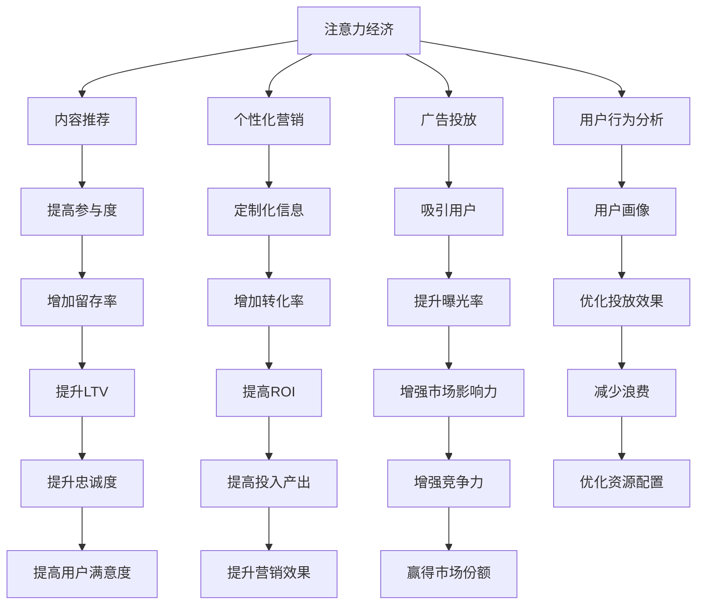

                 

# 企业如何在注意力经济中脱颖而出

## 1. 背景介绍

### 1.1 问题由来
在信息爆炸的时代，企业面临的竞争越来越激烈，如何在海量信息中脱颖而出，吸引并保持用户的注意力，成为企业成功的关键。注意力经济（Attention Economy）的概念由此诞生，强调用户注意力资源的稀缺性和价值。企业需要在短时间内以高效率、高性价比的方式，吸引用户的关注，进而实现产品销售、品牌推广、用户留存等商业目标。

### 1.2 问题核心关键点
注意力经济的核心在于如何高效获取、分配和利用用户的注意力。在实际应用中，企业需要在多渠道、多触点中优化内容传播策略，以匹配用户偏好，提升用户参与度和忠诚度。为此，技术手段如内容推荐、广告投放、个性化营销等手段不断涌现，企业需要掌握这些工具，以最大化用户注意力的商业价值。

### 1.3 问题研究意义
本文聚焦于企业在注意力经济中的策略优化，探讨通过数据科学、算法技术手段，提高企业在海量信息中的曝光率和转化率，从而在激烈的市场竞争中脱颖而出。通过分析注意力经济中的关键概念和应用方法，本文将为企业的营销决策提供科学的依据和实用的工具。

## 2. 核心概念与联系

### 2.1 核心概念概述

为更好地理解注意力经济的应用，本节将介绍几个密切相关的核心概念：

- **注意力经济**：指的是在信息过载时代，企业需要争抢用户注意力的竞争态势。注意力资源的有效分配，是企业获取竞争优势的重要策略。

- **用户注意力**：指用户对于品牌、产品、信息等的关注度和参与度。在注意力经济中，用户注意力是企业最宝贵的资源。

- **内容推荐系统**：通过分析用户行为数据，推荐符合用户兴趣的内容，提高用户参与度和留存率。

- **个性化营销**：根据用户画像和行为数据，提供定制化的营销信息和产品推荐。

- **广告投放**：通过数据分析，在合适的时间和渠道投放广告，以高效吸引用户注意。

- **用户行为分析**：分析用户点击、浏览、购买等行为数据，了解用户偏好和需求。

这些核心概念之间的逻辑关系可以通过以下Mermaid流程图来展示：



这个流程图展示了注意力经济中的核心概念及其之间的关系：

1. 注意力经济通过内容推荐、个性化营销等手段，吸引用户关注。
2. 广告投放则通过精准的用户行为分析，以高效的方式吸引用户。
3. 用户行为分析提供了用户画像，为个性化营销和广告投放提供数据支撑。
4. 通过内容推荐和个性化营销，提高用户参与度和留存率，从而提升LTV和ROI。
5. 最终在优化资源配置和市场影响力的提升下，赢得市场份额和更高的竞争力。

## 3. 核心算法原理 & 具体操作步骤
### 3.1 算法原理概述

注意力经济中，内容推荐、个性化营销等策略的核心算法原理为：利用机器学习算法，分析用户行为数据，预测用户兴趣，以优化内容展示和广告投放，从而提升用户参与度和转化率。

算法的基本流程如下：

1. 数据收集：收集用户行为数据，如点击、浏览、购买等，以及相关内容数据，如文章、视频、广告等。
2. 特征提取：从数据中提取用户兴趣特征和内容特征。
3. 模型训练：利用用户行为数据和内容特征，训练推荐算法模型。
4. 结果预测：输入新用户数据和内容特征，预测推荐结果。
5. 反馈调整：根据用户点击、购买等反馈数据，调整模型参数，优化推荐效果。

### 3.2 算法步骤详解

#### 3.2.1 数据收集
数据收集是注意力经济的基础。企业需要从多个渠道收集用户行为数据和内容数据。例如，可以通过网站日志、应用程序API、社交媒体等途径，获取用户点击、浏览、购买等行为记录，以及相关内容的元数据。

#### 3.2.2 特征提取
特征提取是将原始数据转换为模型可以处理的特征向量。在内容推荐中，常用的特征包括：

- 用户特征：如用户ID、年龄、性别、地理位置等。
- 行为特征：如点击次数、停留时间、浏览路径等。
- 内容特征：如内容ID、标签、类别、时长等。

特征提取的目的是从数据中提取出对用户行为有预测意义的特征，供模型学习使用。

#### 3.2.3 模型训练
模型训练是注意力经济的关键步骤。常用的模型包括协同过滤、基于深度学习的模型如神经网络、以及混合模型如DNN+协同过滤等。

协同过滤模型基于用户和内容的相似性，推荐与用户兴趣相匹配的内容。协同过滤模型分为基于用户的协同过滤和基于项目的协同过滤两种。

基于深度学习的模型如神经网络，可以自动提取数据中的复杂特征，适用于处理高维度的用户和内容特征。常用的神经网络包括多层感知机（MLP）、卷积神经网络（CNN）、循环神经网络（RNN）等。

混合模型则是将协同过滤和深度学习模型结合，以取长补短。

#### 3.2.4 结果预测
模型训练完成后，可以输入新用户数据和内容特征，预测推荐结果。推荐结果包括用户可能感兴趣的内容、相关广告、推荐页面等。

#### 3.2.5 反馈调整
根据用户点击、购买等反馈数据，调整模型参数，优化推荐效果。通常采用在线A/B测试或离线模型验证的方式，评估模型的性能。

### 3.3 算法优缺点

注意力经济中的算法具有以下优点：

1. 提高转化率：通过精准的内容推荐和广告投放，提升用户参与度和转化率，增加销售和营收。
2. 个性化营销：根据用户兴趣和行为数据，提供定制化的营销信息，提升用户体验和满意度。
3. 提高用户留存：通过持续的优质内容和精准推荐，增加用户粘性和留存率。
4. 降低营销成本：通过高效的资源配置和目标用户识别，减少广告投放的浪费。

但同时，该方法也存在一定的局限性：

1. 数据质量依赖高：推荐效果高度依赖于数据质量和完整性，数据偏差可能导致推荐结果不准确。
2. 计算成本高：深度学习模型需要大量计算资源进行训练和推理，对硬件设施要求较高。
3. 用户隐私问题：用户数据收集和分析可能涉及隐私问题，需遵守相关法律法规。
4. 算法复杂度高：复杂的深度学习模型需要专业的知识进行训练和调试，操作难度较大。

尽管存在这些局限性，但就目前而言，基于机器学习的推荐算法仍是大数据时代企业优化注意力经济的重要工具。未来相关研究的重点在于如何进一步降低数据收集和计算成本，提高算法效率，同时兼顾用户隐私和数据安全。

### 3.4 算法应用领域

注意力经济中的算法广泛应用于多个领域，例如：

- 电商网站：推荐用户可能感兴趣的商品，提升销售额和用户留存。
- 视频平台：推荐用户可能喜欢的视频内容，提高用户观看时间和平台活跃度。
- 新闻资讯：推荐用户可能感兴趣的新闻内容，提高阅读量和用户粘性。
- 社交媒体：推荐用户可能感兴趣的朋友动态、广告内容，增加用户参与度。
- 搜索引擎：推荐用户可能感兴趣的相关搜索结果，提升搜索效果。

除了上述这些经典应用外，注意力经济中的算法还被创新性地应用到更多场景中，如智能推荐、个性化广告、智能客服等，为企业带来新的商业模式和竞争优势。

## 4. 数学模型和公式 & 详细讲解  
### 4.1 数学模型构建

注意力经济中的推荐算法通常使用矩阵分解、协同过滤、深度学习等技术，构建推荐模型。

以协同过滤算法为例，假设用户集为$U=\{1,2,...,N\}$，内容集为$I=\{1,2,...,M\}$。用户对内容的操作可以表示为矩阵$R \in \mathbb{R}^{N \times M}$，其中$R_{ij}$表示用户$i$对内容$j$的评分。推荐算法通过预测用户未评分的内容评分，推荐其可能感兴趣的内容。

协同过滤算法基于用户和内容的相似性，进行推荐。设用户$i$与用户$k$的相似度为$u_{ik}$，内容$j$与内容$l$的相似度为$c_{jl}$。则用户$i$对内容$j$的预测评分$R_{ij}^{\prime}$可以表示为：

$$
R_{ij}^{\prime} = \sum_{k \in U} \sum_{l \in I} u_{ik} c_{jl} R_{kl}
$$

其中，$u_{ik}$和$c_{jl}$为相似度计算函数，$R_{kl}$为实际评分矩阵$R$中的值。

### 4.2 公式推导过程

以下我们以基于深度学习的用户兴趣预测模型为例，推导其中的数学公式。

假设用户$i$对内容$j$的评分可以表示为向量$x_i \in \mathbb{R}^{d}$，内容$j$可以表示为向量$y_j \in \mathbb{R}^{d}$。则用户$i$对内容$j$的预测评分$R_{ij}^{\prime}$可以表示为：

$$
R_{ij}^{\prime} = \langle x_i, y_j \rangle = \sum_{k=1}^d x_{ik}y_{jk}
$$

其中，$\langle x_i, y_j \rangle$表示向量$x_i$和$y_j$的点积。

在训练过程中，模型通过最小化预测评分与实际评分之间的差异，优化模型参数。假设训练样本$(i, j)$的实际评分为$R_{ij}$，则优化目标函数为：

$$
\min_{x_i, y_j} \sum_{(i, j) \in R} \frac{1}{2}(R_{ij} - \langle x_i, y_j \rangle)^2 + \lambda \|x_i\|^2 + \lambda \|y_j\|^2
$$

其中，$\lambda$为正则化系数，$\|x_i\|$表示向量$x_i$的L2范数。

### 4.3 案例分析与讲解

假设有一个电商网站，收集了用户对商品的操作数据，共1000个用户和1000个商品。利用协同过滤算法，我们构建了用户-商品评分矩阵$R$，其中用户$i$对商品$j$的评分表示为$R_{ij}$。

设$x_i$为第$i$个用户对商品的兴趣表示向量，$y_j$为第$j$个商品的属性表示向量。通过训练协同过滤模型，我们得到预测评分$R_{ij}^{\prime}$。根据预测评分，网站可以推荐给用户可能感兴趣的商品，从而提升销售额和用户留存。

## 5. 项目实践：代码实例和详细解释说明
### 5.1 开发环境搭建

在进行注意力经济中的推荐系统开发时，我们需要准备好开发环境。以下是使用Python进行TensorFlow开发的环境配置流程：

1. 安装Anaconda：从官网下载并安装Anaconda，用于创建独立的Python环境。

2. 创建并激活虚拟环境：
```bash
conda create -n tf-env python=3.8 
conda activate tf-env
```

3. 安装TensorFlow：根据CUDA版本，从官网获取对应的安装命令。例如：
```bash
conda install tensorflow -c tensorflow -c conda-forge
```

4. 安装TensorFlow Addons：用于使用TensorFlow中的一些高级特性。
```bash
pip install tensorflow-addons
```

5. 安装各类工具包：
```bash
pip install numpy pandas scikit-learn matplotlib tqdm jupyter notebook ipython
```

完成上述步骤后，即可在`tf-env`环境中开始推荐系统的开发。

### 5.2 源代码详细实现

下面我们以电商网站的用户推荐系统为例，给出使用TensorFlow对协同过滤算法进行实现的PyTorch代码实现。

首先，定义协同过滤算法的输入数据：

```python
import tensorflow as tf
import tensorflow_addons as tfa

# 定义用户集和内容集
U = tf.constant(range(1000))
I = tf.constant(range(1000))

# 定义评分矩阵
R = tf.random.normal(shape=(1000, 1000))
```

然后，定义协同过滤算法的损失函数和优化器：

```python
# 定义模型参数
Wu = tf.Variable(tf.random.normal(shape=(len(U), 100)))
Wi = tf.Variable(tf.random.normal(shape=(len(I), 100)))
b = tf.Variable(tf.random.normal(shape=(len(I), 1)))

# 定义预测评分函数
def predict_score(i, j):
    user = Wu[i]
    item = Wi[j]
    return tf.reduce_sum(tf.multiply(user, item)) + b[j]

# 定义损失函数
def loss(R, R_hat):
    return tf.reduce_mean(tf.square(R - R_hat))

# 定义优化器
optimizer = tf.keras.optimizers.Adam(learning_rate=0.01)
```

接着，定义协同过滤算法的训练流程：

```python
# 定义训练过程
def train(R, epochs=10):
    for epoch in range(epochs):
        for i in U:
            for j in I:
                R_hat = predict_score(i, j)
                loss_val = loss(R, R_hat)
                optimizer.minimize(loss_val, variables=[Wu, Wi, b])
                print(f"Epoch {epoch+1}, loss: {loss_val.numpy():.4f}")

# 训练模型
train(R)
```

最终，通过调用训练函数，可以得到协同过滤模型的训练结果。

### 5.3 代码解读与分析

让我们再详细解读一下关键代码的实现细节：

**协同过滤算法**：
- 定义用户集`U`和内容集`I`，以及评分矩阵`R`。
- 定义模型参数`Wu`和`Wi`，以及偏差向量`b`。
- 定义预测评分函数`predict_score`，输入用户`i`和内容`j`，返回预测评分`R_hat`。
- 定义损失函数`loss`，计算预测评分与实际评分之间的差异。
- 定义优化器`optimizer`，使用Adam优化器进行模型训练。
- 定义训练过程`train`，在每个epoch中对每个用户-内容对进行训练。

**训练函数**：
- 在每个epoch中，遍历用户集`U`中的每个用户，以及内容集`I`中的每个内容，计算预测评分`R_hat`和损失`loss_val`。
- 使用优化器`optimizer`最小化损失`loss_val`，更新模型参数。
- 打印当前epoch的平均损失。

可以看到，TensorFlow为协同过滤算法的实现提供了强大的工具支持，开发者可以方便地构建模型、定义损失和优化器、执行训练过程。

当然，工业级的系统实现还需考虑更多因素，如模型的保存和部署、超参数的自动搜索、更灵活的相似度计算方式等。但核心的推荐范式基本与此类似。

## 6. 实际应用场景
### 6.1 电商网站推荐系统

基于注意力经济中的推荐算法，电商网站可以构建高效的用户推荐系统。用户浏览、点击、购买等行为数据是推荐系统的数据来源，通过对这些数据进行分析，网站可以推荐用户可能感兴趣的商品，提高销售额和用户留存。

具体而言，可以通过以下步骤实现：

1. 收集用户的行为数据，如浏览记录、点击次数、购买记录等。
2. 对数据进行预处理，提取用户特征、行为特征、商品特征等。
3. 训练协同过滤算法，预测用户对商品的评分。
4. 根据评分结果，向用户推荐可能感兴趣的商品。

### 6.2 视频平台内容推荐

视频平台利用注意力经济中的推荐算法，可以提升用户的观看时间和平台活跃度。用户观看视频的行为数据，如停留时间、播放次数等，是推荐系统的重要数据来源。通过训练推荐模型，平台可以推荐用户可能喜欢的视频内容，提高用户粘性。

具体实现步骤包括：

1. 收集用户观看视频的行为数据。
2. 提取视频特征、用户特征等。
3. 训练深度学习模型，预测用户对视频的评分。
4. 根据评分结果，向用户推荐可能感兴趣的视频。

### 6.3 新闻资讯推荐系统

新闻资讯平台利用注意力经济中的推荐算法，可以提升用户的阅读量和平台活跃度。用户对新闻的阅读行为数据，如停留时间、点击次数等，是推荐系统的重要数据来源。通过训练推荐模型，平台可以推荐用户可能感兴趣的新闻内容，提高用户粘性。

具体实现步骤包括：

1. 收集用户阅读新闻的行为数据。
2. 提取新闻特征、用户特征等。
3. 训练协同过滤算法或深度学习模型，预测用户对新闻的评分。
4. 根据评分结果，向用户推荐可能感兴趣的新闻。

### 6.4 未来应用展望

随着深度学习技术的不断进步，基于注意力经济的推荐算法将持续演进，为更多领域带来新的应用场景。

在智慧医疗领域，推荐系统可以根据患者的历史诊疗数据，推荐可能有效的治疗方法，提升诊疗效果。

在智能教育领域，推荐系统可以根据学生的学习行为数据，推荐适合的教材和学习资源，提升学习效果。

在智慧城市治理中，推荐系统可以根据市民的出行数据，推荐最佳出行路线，提升城市管理效率。

此外，在企业生产、社会治理、文娱传媒等众多领域，基于注意力经济的推荐算法也将不断涌现，为各行各业带来新的商业模式和竞争优势。

## 7. 工具和资源推荐
### 7.1 学习资源推荐

为了帮助开发者系统掌握注意力经济中的推荐算法，这里推荐一些优质的学习资源：

1. 《推荐系统实战》书籍：由李航老师编写，详细介绍了推荐算法的原理、实现和优化。
2. 《深度学习》课程：斯坦福大学开设的深度学习课程，讲解了深度学习的基本概念和应用。
3. 《推荐系统学习笔记》博文：由张亚楠老师撰写，深入浅出地介绍了推荐算法的理论和实践。
4. 《TensorFlow推荐系统》文档：TensorFlow官方推荐系统的教程，详细介绍了推荐算法的实现过程。

通过对这些资源的学习实践，相信你一定能够快速掌握注意力经济中的推荐算法的精髓，并用于解决实际的商业问题。
###  7.2 开发工具推荐

高效的开发离不开优秀的工具支持。以下是几款用于注意力经济中的推荐系统开发的常用工具：

1. TensorFlow：由Google主导开发的开源深度学习框架，生产部署方便，适合大规模工程应用。
2. TensorFlow Addons：用于使用TensorFlow中的一些高级特性，如推荐算法。
3. PyTorch：基于Python的开源深度学习框架，灵活动态的计算图，适合快速迭代研究。
4. Keras：高层次的神经网络API，简单易用，适合快速开发和原型设计。
5. Jupyter Notebook：交互式的数据科学环境，方便数据处理和算法实验。
6. Scikit-learn：Python数据科学库，提供各种机器学习算法和工具。

合理利用这些工具，可以显著提升注意力经济中的推荐系统开发的效率，加快创新迭代的步伐。

### 7.3 相关论文推荐

注意力经济中的推荐算法的发展源于学界的持续研究。以下是几篇奠基性的相关论文，推荐阅读：

1. Matrix Factorization Techniques for Recommender Systems（矩阵分解推荐算法）：介绍了基于矩阵分解的推荐算法，包括奇异值分解（SVD）、低秩矩阵分解等。
2. Item-Item Collaborative Filtering（基于项目的协同过滤）：提出了一种新的协同过滤算法，利用用户-物品的相似性进行推荐。
3. Deep Collaborative Filtering（深度协同过滤）：使用深度学习模型，如神经网络，进行协同过滤推荐。
4. Hybrid Recommender Systems（混合推荐系统）：将协同过滤和深度学习结合，构建混合推荐模型。
5. Learning from Implicit Feedback（隐式反馈下的推荐算法）：提出了一种基于隐式反馈的推荐算法，处理用户不明确反馈的数据。

这些论文代表了大数据时代推荐算法的进展，通过学习这些前沿成果，可以帮助研究者把握学科前进方向，激发更多的创新灵感。

## 8. 总结：未来发展趋势与挑战

### 8.1 总结

本文对注意力经济中的推荐算法进行了全面系统的介绍。首先阐述了注意力经济的概念和其重要性，明确了推荐算法在提升用户体验、增加营收等方面的独特价值。其次，从原理到实践，详细讲解了推荐算法的数学原理和关键步骤，给出了推荐系统开发的完整代码实例。同时，本文还广泛探讨了推荐算法在电商网站、视频平台、新闻资讯等多个行业领域的应用前景，展示了算法在实际应用中的巨大潜力。

通过本文的系统梳理，可以看到，基于注意力经济的推荐算法已经成为企业在信息爆炸时代获取竞争优势的重要手段，极大地提高了产品销售、用户留存等商业价值。未来，伴随深度学习技术的不断进步，推荐算法还将进一步演进，带来更多的应用场景和商业模式创新。

### 8.2 未来发展趋势

展望未来，注意力经济中的推荐算法将呈现以下几个发展趋势：

1. 模型复杂度提升。随着深度学习技术的发展，推荐模型将更加复杂，能够处理更多的用户和内容特征，提升推荐效果。
2. 跨模态推荐。结合图像、视频、语音等多模态数据，构建更加全面、个性化的推荐系统。
3. 实时推荐。利用流式数据处理和实时计算技术，实现即时推荐，提升用户体验。
4. 联邦学习。利用分布式数据，在不泄露隐私的前提下，构建联邦推荐系统。
5. 自适应推荐。通过用户行为数据，动态调整推荐策略，提升推荐效果。
6. 交互推荐。利用用户反馈数据，不断优化推荐结果，提高用户满意度。

以上趋势凸显了深度学习在推荐算法中的重要地位，推动推荐系统向更加智能化、个性化、实时化的方向发展。

### 8.3 面临的挑战

尽管注意力经济中的推荐算法已经取得了显著成果，但在迈向更加智能化、普适化应用的过程中，仍面临诸多挑战：

1. 数据质量瓶颈。推荐系统高度依赖于数据质量，数据偏差可能导致推荐结果不准确。
2. 计算资源消耗高。深度学习模型需要大量计算资源进行训练和推理，硬件设施要求较高。
3. 用户隐私问题。用户数据收集和分析可能涉及隐私问题，需遵守相关法律法规。
4. 模型复杂度高。复杂的深度学习模型需要专业的知识进行训练和调试，操作难度较大。
5. 冷启动问题。新用户和未评分物品的推荐难度大，需结合更多先验知识进行优化。

尽管存在这些挑战，但深度学习在推荐算法中的应用前景依然广阔。未来相关研究需要在降低数据质量依赖、提高计算效率、加强隐私保护、简化模型操作等方面进行不断优化。

### 8.4 研究展望

面对深度学习在推荐算法中面临的诸多挑战，未来的研究需要在以下几个方面寻求新的突破：

1. 探索无监督和半监督推荐方法。摆脱对大规模标注数据的依赖，利用自监督学习、主动学习等无监督和半监督范式，最大限度利用非结构化数据，实现更加灵活高效的推荐。
2. 研究参数高效和计算高效的推荐范式。开发更加参数高效的推荐方法，在固定大部分预训练参数的情况下，只更新极少量的任务相关参数。同时优化推荐模型的计算图，减少前向传播和反向传播的资源消耗，实现更加轻量级、实时性的部署。
3. 融合因果和对比学习范式。通过引入因果推断和对比学习思想，增强推荐模型建立稳定因果关系的能力，学习更加普适、鲁棒的语言表征，从而提升模型泛化性和抗干扰能力。
4. 引入更多先验知识。将符号化的先验知识，如知识图谱、逻辑规则等，与神经网络模型进行巧妙融合，引导推荐过程学习更准确、合理的推荐结果。
5. 结合因果分析和博弈论工具。将因果分析方法引入推荐模型，识别出推荐结果的关键特征，增强输出的因果性和逻辑性。借助博弈论工具刻画人机交互过程，主动探索并规避推荐模型的脆弱点，提高系统稳定性。
6. 纳入伦理道德约束。在推荐算法中引入伦理导向的评估指标，过滤和惩罚有害的推荐结果，确保输出符合人类价值观和伦理道德。

这些研究方向的探索，必将引领推荐算法技术迈向更高的台阶，为构建智能、可信的推荐系统铺平道路。面向未来，推荐算法技术还需要与其他人工智能技术进行更深入的融合，如知识表示、因果推理、强化学习等，多路径协同发力，共同推动推荐系统的进步。只有勇于创新、敢于突破，才能不断拓展推荐算法的边界，让推荐系统更好地服务用户。

## 9. 附录：常见问题与解答

**Q1：推荐算法是否适用于所有应用场景？**

A: 推荐算法在电商网站、视频平台、新闻资讯等多个领域已经取得了显著成果。但对于一些需要高度定制化的场景，如教育、医疗等，推荐算法需要结合具体业务逻辑和用户需求进行改进。

**Q2：如何优化推荐算法中的数据质量？**

A: 推荐算法的数据质量高度依赖于数据收集和处理的完整性和准确性。可以通过以下措施优化数据质量：
1. 数据清洗：去除噪音和异常值，保证数据的一致性和完整性。
2. 数据标注：对缺失的数据进行人工标注，补充缺失信息。
3. 数据采样：采用分层抽样等方法，保证数据的代表性。
4. 数据验证：利用交叉验证等方法，评估数据质量并进行优化。

**Q3：推荐算法如何应对冷启动问题？**

A: 冷启动问题是推荐系统中的常见问题，指新用户和未评分物品的推荐难度大。推荐算法通常通过以下措施应对冷启动问题：
1. 先验知识引入：结合知识图谱、逻辑规则等先验知识，提高推荐效果。
2. 多模态数据融合：结合图像、视频等多模态数据，提高推荐模型的泛化能力。
3. 协同过滤扩展：使用基于内容的协同过滤，利用物品的相似性进行推荐。
4. 机器学习模型优化：使用模型优化算法，提高推荐模型的性能。

**Q4：推荐算法如何保护用户隐私？**

A: 推荐系统在数据收集和分析过程中，需注意用户隐私保护。可以采取以下措施保护用户隐私：
1. 匿名化处理：对用户数据进行匿名化处理，避免泄露用户身份信息。
2. 数据加密：对用户数据进行加密处理，防止数据泄露。
3. 数据去重：对重复数据进行去重处理，避免用户数据被多次使用。
4. 合规使用：遵守相关法律法规，合理使用用户数据。

**Q5：推荐算法如何实现跨模态推荐？**

A: 跨模态推荐是将图像、视频、语音等多模态数据与文本数据结合，构建更加全面、个性化的推荐系统。可以通过以下措施实现跨模态推荐：
1. 多模态数据融合：利用多模态数据融合技术，将不同模态的数据进行合并。
2. 多模态特征提取：对不同模态的数据进行特征提取，构建统一的特征空间。
3. 多模态模型训练：将不同模态的数据作为输入，训练统一的推荐模型。

**Q6：推荐算法如何实现实时推荐？**

A: 实时推荐是通过流式数据处理和实时计算技术，实现即时推荐。可以采取以下措施实现实时推荐：
1. 流式数据处理：利用流式数据处理技术，实时处理用户行为数据。
2. 实时计算：利用实时计算技术，快速生成推荐结果。
3. 缓存机制：利用缓存机制，存储高频推荐结果，减少计算时间。

**Q7：推荐算法如何实现联邦学习？**

A: 联邦学习是在不泄露隐私的前提下，利用分布式数据进行模型训练。可以采取以下措施实现联邦学习：
1. 分布式数据处理：利用分布式计算技术，处理大规模数据集。
2. 模型联邦化：将模型联邦化，在分布式数据上进行训练。
3. 模型聚合：对分布式训练结果进行聚合，更新全局模型。

这些措施有助于提升推荐算法的性能和安全性，更好地适应实际应用场景，为用户带来更好的体验。

---

作者：禅与计算机程序设计艺术 / Zen and the Art of Computer Programming

