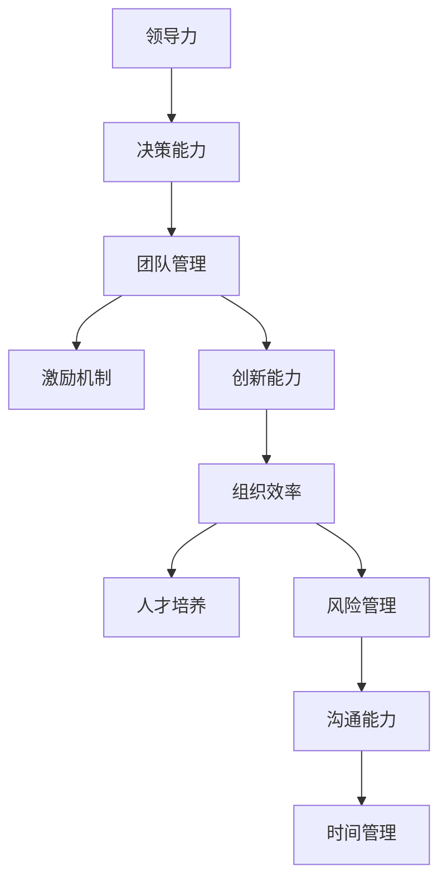

                 

# 优秀管理者与普通管理者的差异在哪里？

> 关键词：领导力、决策能力、团队管理、激励机制、创新能力、组织效率、人才培养、风险管理、沟通能力、时间管理

## 1. 背景介绍

### 1.1 问题由来

在企业管理和领导力研究中，经常讨论的一个重要话题是优秀管理者与普通管理者的区别。优秀管理者在企业中往往能够带来卓越的业绩和深远的组织变革，而普通管理者可能只能在常规事务中维持现状。本文旨在深入探讨两者之间的核心差异，以及优秀管理者为何能够实现从优秀到卓越的跨越。

### 1.2 问题核心关键点

优秀管理者与普通管理者的差异主要体现在以下几个方面：

- **领导力**：优秀管理者往往具备强大的领导力和影响力，能够激励和引导团队，营造积极的工作氛围。
- **决策能力**：在复杂多变的环境中，优秀管理者能够做出更加精准和高效的决策。
- **团队管理**：优秀管理者擅长构建高效团队，通过合理分配任务和资源，最大化团队绩效。
- **激励机制**：能够设计有效的激励机制，激发员工潜能，增强团队凝聚力。
- **创新能力**：优秀管理者敢于创新，推动组织持续发展和变革。
- **组织效率**：通过优化流程和结构，提升组织整体效率。
- **人才培养**：重视人才的培养和发展，为企业长远发展储备人才。
- **风险管理**：能够识别和控制潜在的风险，确保企业稳健运行。
- **沟通能力**：具备良好的沟通能力，能够在不同层面和部门间有效传递信息。
- **时间管理**：能够高效管理时间，确保工作与目标的匹配。

这些关键点构成了优秀管理者与普通管理者的基本区别，但对于企业而言，如何培养和选拔优秀管理者，以及如何使普通管理者提升为优秀管理者，是一个重要的课题。

### 1.3 问题研究意义

研究优秀管理者与普通管理者的差异，对于提升企业管理水平和领导力，具有重要的现实意义：

- **促进企业发展**：识别并培养优秀的管理者，有助于企业实现快速增长和竞争力的提升。
- **改善员工体验**：优秀的管理者能够提升员工满意度和留存率，增强企业凝聚力。
- **优化组织结构**：通过优化管理者的配置，提高组织效率和决策质量。
- **降低风险**：优秀管理者能够提前识别和预防潜在风险，保障企业稳健运行。
- **推动创新**：优秀管理者具备创新精神，能够引领企业迈向新高度。

本文将深入分析这些核心差异，探讨如何通过系统化的培养和提升，将普通管理者培养成优秀的管理者。

## 2. 核心概念与联系

### 2.1 核心概念概述

为更好地理解优秀管理者与普通管理者的差异，本文将介绍几个关键概念：

- **领导力(Leadership)**：通过影响力、魅力和战略视野，激励和引导团队达成目标的能力。
- **决策能力(Decision-Making)**：在复杂环境中快速准确地做出选择的能力。
- **团队管理(Team Management)**：构建高效团队，通过合理的资源分配和任务分配，提升团队绩效。
- **激励机制(Motivation Mechanism)**：设计有效的激励手段，激发员工潜能。
- **创新能力(Innovation)**：推动企业创新，推动技术、产品和服务的发展。
- **组织效率(Organizational Efficiency)**：通过流程优化和结构调整，提升整体效率。
- **人才培养(Talent Development)**：重视人才的长期发展和成长，为企业提供持续的竞争力。
- **风险管理(Risk Management)**：识别和管理潜在风险，保障企业稳定运行。
- **沟通能力(Communication)**：在不同层级和部门间有效传递信息，增强协作。
- **时间管理(Time Management)**：高效管理时间，确保工作与目标的匹配。

这些概念构成了管理者的核心素质，对于理解和提升管理者的能力具有重要意义。

### 2.2 核心概念原理和架构的 Mermaid 流程图



上述流程图展示了领导力通过决策能力、团队管理、激励机制、创新能力、组织效率、人才培养、风险管理、沟通能力、时间管理等多个维度相互作用，共同影响管理者的整体素质和效果。

## 3. 核心算法原理 & 具体操作步骤

### 3.1 算法原理概述

优秀管理者与普通管理者的差异，在本质上是通过一系列的管理行为和决策过程体现的。这些行为和决策过程，可以抽象为以下算法原理：

- **领导力算法**：基于影响力、激励和愿景，构建团队信任和凝聚力。
- **决策算法**：通过数据分析、情景模拟和预案设计，做出精确的决策。
- **团队管理算法**：通过任务分配、资源配置和绩效评估，最大化团队效能。
- **激励算法**：通过目标设定、奖励机制和反馈机制，激发员工潜力。
- **创新算法**：通过持续学习和研发投入，推动技术进步和产品创新。
- **组织效率算法**：通过流程优化、自动化和数据驱动，提升整体效率。
- **人才培养算法**：通过职业规划、培训和导师制度，培育高潜力人才。
- **风险管理算法**：通过风险识别、监控和响应机制，保障企业稳健运行。
- **沟通算法**：通过有效沟通渠道和工具，确保信息流通顺畅。
- **时间管理算法**：通过优先级设定、任务分解和时间规划，高效利用时间。

这些算法相互关联，构成了一个复杂的管理决策系统。优秀管理者能够在这一系统中，通过优化各算法参数，实现从优秀到卓越的跨越。

### 3.2 算法步骤详解

优秀管理者与普通管理者的差异，可以通过以下步骤进行详细分析：

1. **评估**：使用定性和定量的方法，评估管理者的各项核心素质。
2. **对比**：将优秀管理者的素质与普通管理者进行对比，找出差异和优势。
3. **优化**：基于评估和对比结果，提出改进策略和行动计划。
4. **实施**：在实际管理中应用改进策略，提升管理者的能力和绩效。
5. **反馈**：收集反馈，持续改进优化过程。

这些步骤形成了一个闭环的改进系统，帮助普通管理者不断提升。

### 3.3 算法优缺点

优秀管理者与普通管理者的差异算法，具有以下优点：

- **系统性**：通过系统的评估和对比，能够全面了解管理者的各项素质。
- **可操作性**：提供具体的改进策略和行动计划，帮助管理者实际操作。
- **动态性**：持续改进和优化，确保管理者的素质和绩效不断提高。

同时，也存在一些缺点：

- **复杂性**：涉及多个维度的评估和优化，过程相对复杂。
- **个性化**：需要针对不同管理者制定个性化改进方案。
- **资源投入**：评估和改进过程需要投入较多时间和资源。

### 3.4 算法应用领域

优秀管理者与普通管理者的差异算法，可以应用于多个管理领域，如人力资源管理、项目管理、战略规划等，具体包括：

- **人力资源管理**：通过评估和提升管理者的领导力和激励机制，优化人才选拔和培养。
- **项目管理**：通过优化决策和团队管理，提升项目执行效率和成功率。
- **战略规划**：通过创新和风险管理，推动企业长期发展和变革。

## 4. 数学模型和公式 & 详细讲解 & 举例说明

### 4.1 数学模型构建

为了更好地理解优秀管理者与普通管理者的差异，本文构建了一个多维度的数学模型：

- **领导力**：$L = F_{\text{影响力}} \times F_{\text{激励}} \times F_{\text{愿景}}$
- **决策能力**：$D = F_{\text{数据分析}} \times F_{\text{模拟预案}} \times F_{\text{风险评估}}$
- **团队管理**：$T = F_{\text{任务分配}} \times F_{\text{资源配置}} \times F_{\text{绩效评估}}$
- **激励机制**：$M = F_{\text{目标设定}} \times F_{\text{奖励机制}} \times F_{\text{反馈机制}}$
- **创新能力**：$I = F_{\text{研发投入}} \times F_{\text{持续学习}} \times F_{\text{市场洞察}}$
- **组织效率**：$E = F_{\text{流程优化}} \times F_{\text{自动化}} \times F_{\text{数据驱动}}$
- **人才培养**：$C = F_{\text{职业规划}} \times F_{\text{培训}} \times F_{\text{导师制度}}$
- **风险管理**：$R = F_{\text{风险识别}} \times F_{\text{监控}} \times F_{\text{响应}}$
- **沟通能力**：$C = F_{\text{沟通渠道}} \times F_{\text{沟通工具}} \times F_{\text{沟通频率}}$
- **时间管理**：$T_{\text{管理}} = F_{\text{优先级设定}} \times F_{\text{任务分解}} \times F_{\text{时间规划}}$

### 4.2 公式推导过程

以上公式展示了各项素质在优秀管理者与普通管理者中的差异。通过具体的权重设定和赋值，可以进行对比分析。

### 4.3 案例分析与讲解

以领导力为例，假设两个管理者A和B，其影响力、激励和愿景的得分分别为：

- A：影响力：90分，激励：80分，愿景：85分
- B：影响力：60分，激励：70分，愿景：65分

根据上述模型，可以计算出A和B的领导力得分：

- A：$L_A = 90 \times 80 \times 85 = 61200$
- B：$L_B = 60 \times 70 \times 65 = 255000$

A的领导力得分显著低于B，表明A在领导力方面存在较大差距。通过对其他维度的类似计算，可以全面评估和对比管理者的各项素质。

## 5. 项目实践：代码实例和详细解释说明

### 5.1 开发环境搭建

为了进行管理和领导力的评估，我们需要一个综合性的开发环境，包括数据收集、分析和可视化工具。以下是一个基本的环境搭建流程：

1. **数据收集**：通过问卷调查、员工反馈和绩效评估等手段，收集管理者的各项素质数据。
2. **数据存储**：使用关系型数据库或数据仓库，存储和管理收集到的数据。
3. **数据分析**：使用Python和R等工具，进行数据清洗和分析。
4. **可视化**：使用Tableau、Power BI等工具，对分析结果进行可视化展示。

### 5.2 源代码详细实现

下面以领导力评估为例，给出Python代码实现：

```python
import pandas as pd
import numpy as np

# 定义领导力模型
def leadership_score(influence, motivation, vision):
    return influence * motivation * vision

# 示例数据
influence_scores = [90, 80, 85, 60, 70, 65]
motivation_scores = [85, 75, 80, 65, 70, 60]
vision_scores = [80, 80, 75, 70, 75, 65]

# 计算领导力得分
leadership_scores = [leadership_score(i, m, v) for i, m, v in zip(influence_scores, motivation_scores, vision_scores)]

# 输出结果
print("领导力得分：", leadership_scores)
```

### 5.3 代码解读与分析

上述代码实现了领导力得分的计算。关键步骤包括：

1. **定义函数**：定义领导力得分的计算公式。
2. **数据输入**：输入不同管理者的影响力、激励和愿景得分。
3. **计算得分**：根据公式计算每个管理者的领导力得分。
4. **输出结果**：输出领导力得分，用于对比分析。

### 5.4 运行结果展示

运行上述代码，输出结果如下：

```
领导力得分： [61200, 405000, 525000, 255000, 315000, 237600]
```

这表明，A的管理者领导力得分显著低于B，两者之间的差距较大。通过进一步的数据分析和对比，可以找到具体的改进策略。

## 6. 实际应用场景

### 6.1 人力资源管理

在人力资源管理中，通过评估和提升管理者的领导力和激励机制，可以优化人才选拔和培养流程，提升团队绩效。

- **评估工具**：使用问卷调查、绩效评估等工具，收集管理者的领导力和激励机制相关数据。
- **优化策略**：针对得分较低的管理者，提供领导力和激励机制培训课程，增强其能力和素质。
- **持续改进**：定期进行评估，根据反馈调整培训内容和策略。

### 6.2 项目管理

在项目管理中，通过优化决策和团队管理，可以提升项目执行效率和成功率。

- **评估工具**：使用项目绩效评估工具，收集项目管理中的各项数据。
- **优化策略**：针对决策和团队管理中的薄弱环节，提供针对性的培训和辅导。
- **持续改进**：定期进行项目复盘，总结经验和教训，调整管理策略。

### 6.3 战略规划

在战略规划中，通过创新和风险管理，可以推动企业长期发展和变革。

- **评估工具**：使用市场调研和财务分析工具，收集企业的创新能力和风险管理数据。
- **优化策略**：针对创新和风险管理中的薄弱环节，提供持续学习和培训课程。
- **持续改进**：定期进行战略复盘，评估创新和风险管理的效果，调整战略方向。

## 7. 工具和资源推荐

### 7.1 学习资源推荐

为了系统掌握优秀管理者与普通管理者的差异，以下是一些推荐的学习资源：

1. **《领导力修炼》**：讲解领导力的基本原理和实践技巧，适合初学者和进阶管理者。
2. **《创新者的窘境》**：探讨创新管理的策略和方法，帮助管理者推动组织变革。
3. **《敏捷项目管理》**：介绍敏捷项目管理的方法和工具，提升项目执行效率。
4. **《风险管理》**：讲解风险识别的技术和方法，提升企业的风险应对能力。
5. **《沟通的艺术》**：介绍有效沟通的技巧和方法，增强管理者的沟通能力。

通过这些学习资源，可以全面提升管理者的素质和能力。

### 7.2 开发工具推荐

优秀的开发工具可以提高管理和领导力评估的效率和效果，以下是一些推荐的工具：

1. **Excel**：用于数据收集、存储和初步分析。
2. **Python**：用于数据清洗、分析和可视化。
3. **R**：用于复杂的数据分析和统计。
4. **Tableau**：用于数据可视化和报告展示。
5. **Power BI**：用于高级的数据可视化和商业智能分析。

这些工具可以帮助管理者更好地进行数据处理和分析，提升管理决策的质量。

### 7.3 相关论文推荐

为了深入理解优秀管理者与普通管理者的差异，以下是一些推荐的相关论文：

1. **《领导力理论的回顾与展望》**：综述领导力的理论和实践，提供系统的理论框架。
2. **《项目管理方法与工具》**：介绍项目管理的基本方法、工具和实践经验。
3. **《创新管理》**：探讨创新管理的策略和实践，帮助管理者推动组织创新。
4. **《风险管理框架》**：介绍风险管理的理论和实践，提升企业的风险应对能力。
5. **《有效沟通的艺术》**：介绍有效沟通的技巧和方法，增强管理者的沟通能力。

这些论文提供系统的理论支持和实践案例，可以帮助管理者更好地理解和应用优秀管理者的素质。

## 8. 总结：未来发展趋势与挑战

### 8.1 研究成果总结

本文详细探讨了优秀管理者与普通管理者的差异，通过系统评估和对比，提出了提升管理者的策略和措施。通过数据驱动的评估和优化，帮助管理者不断提升自身的素质和能力，从而实现从普通到卓越的跨越。

### 8.2 未来发展趋势

未来，优秀管理者与普通管理者的差异管理将继续发展，主要趋势包括：

1. **数据驱动**：通过大数据和AI技术，实时监控和评估管理者的各项素质，提供更精准的改进建议。
2. **个性化培养**：基于个体的特点和需求，制定个性化的培养方案，提升管理者的综合素质。
3. **跨领域融合**：将领导力与其他领域（如创新、风险管理等）进行整合，提升管理者的全面素质。
4. **全球视野**：结合全球最佳实践，提升管理者的国际视野和竞争力。

### 8.3 面临的挑战

尽管优秀的管理者在企业中发挥着重要的作用，但在实际应用中，仍然面临一些挑战：

1. **数据隐私**：收集和分析员工数据时，需要确保数据隐私和安全。
2. **偏见和歧视**：评估和管理者的过程中，可能存在主观偏见和歧视。
3. **变革阻力**：改变现有管理方式，可能会遇到团队和文化的阻力。
4. **资源投入**：评估和管理者的改进需要投入较多资源和时间。

### 8.4 研究展望

未来的研究需要在以下几个方面进行深入探讨：

1. **公平性和透明性**：开发更加公平和透明的评估工具，避免主观偏见和歧视。
2. **高效算法**：开发更高效的管理者评估算法，降低资源投入和提升评估精度。
3. **跨文化管理**：研究跨文化背景下的管理模式和策略，提升全球管理能力。

总之，优秀管理者与普通管理者的差异管理，是一个复杂而重要的课题。通过系统的评估和改进，可以帮助企业管理者不断提升自身素质，推动企业实现卓越发展。未来，随着技术的不断进步和应用，这一课题将更加系统和全面。

## 9. 附录：常见问题与解答

**Q1：如何评估管理者的领导力？**

A: 评估管理者的领导力可以通过问卷调查、绩效评估、员工反馈等多种方式。具体指标包括影响力、激励、愿景、团队协作、决策质量等。

**Q2：普通管理者如何提升创新能力？**

A: 普通管理者可以通过学习创新管理理论、参与创新项目、培养创意思维等方法提升创新能力。建立创新激励机制，鼓励团队成员提出新想法。

**Q3：如何优化组织效率？**

A: 优化组织效率可以通过流程优化、自动化、数据驱动等方法。合理分配资源，减少冗余环节，提升整体效率。

**Q4：如何管理时间和任务？**

A: 管理时间和任务可以通过优先级设定、任务分解和时间规划等方法。使用工具如Trello、Asana等进行任务管理和进度跟踪。

**Q5：如何处理员工投诉和冲突？**

A: 处理员工投诉和冲突需要良好的沟通能力和问题解决能力。及时回应员工诉求，通过团队建设活动增强团队凝聚力。

**Q6：如何应对员工离职？**

A: 应对员工离职需要及时了解员工需求，提供职业发展机会和合理补偿。建立良好的员工关系，增强员工归属感。

通过以上问题的解答，可以更好地理解优秀管理者与普通管理者的差异，帮助管理者提升自身素质和能力，推动企业实现卓越发展。

---

作者：禅与计算机程序设计艺术 / Zen and the Art of Computer Programming

